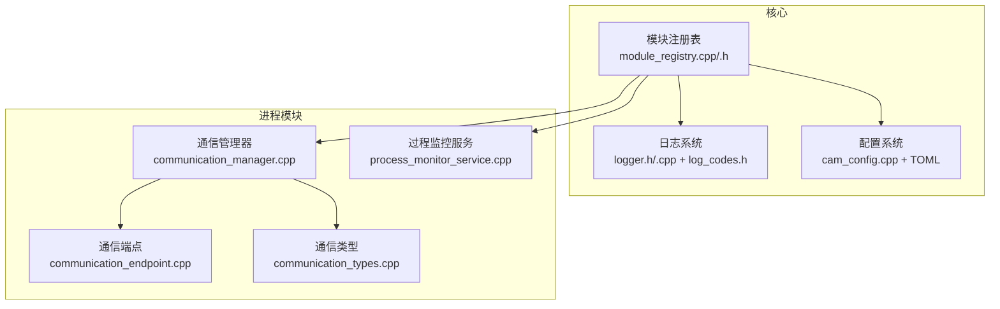
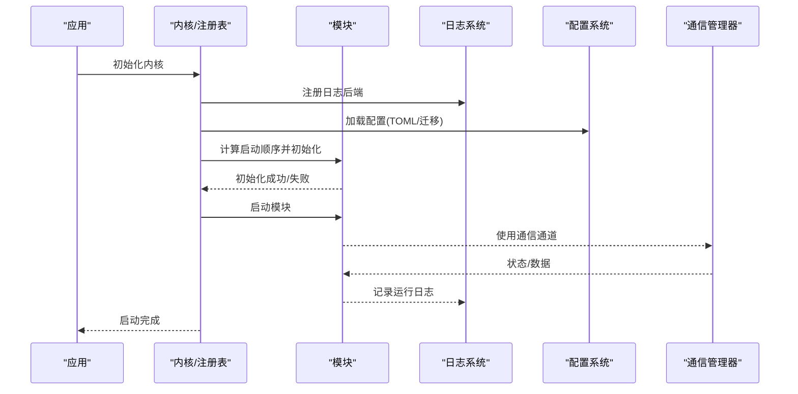
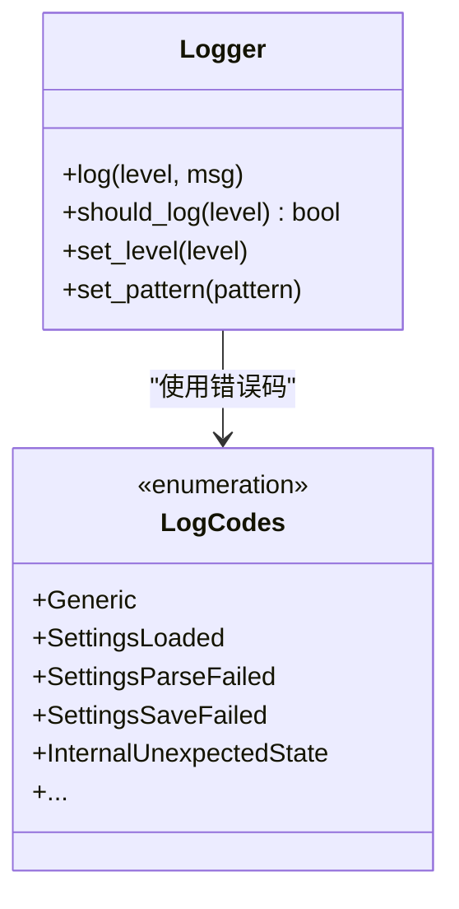
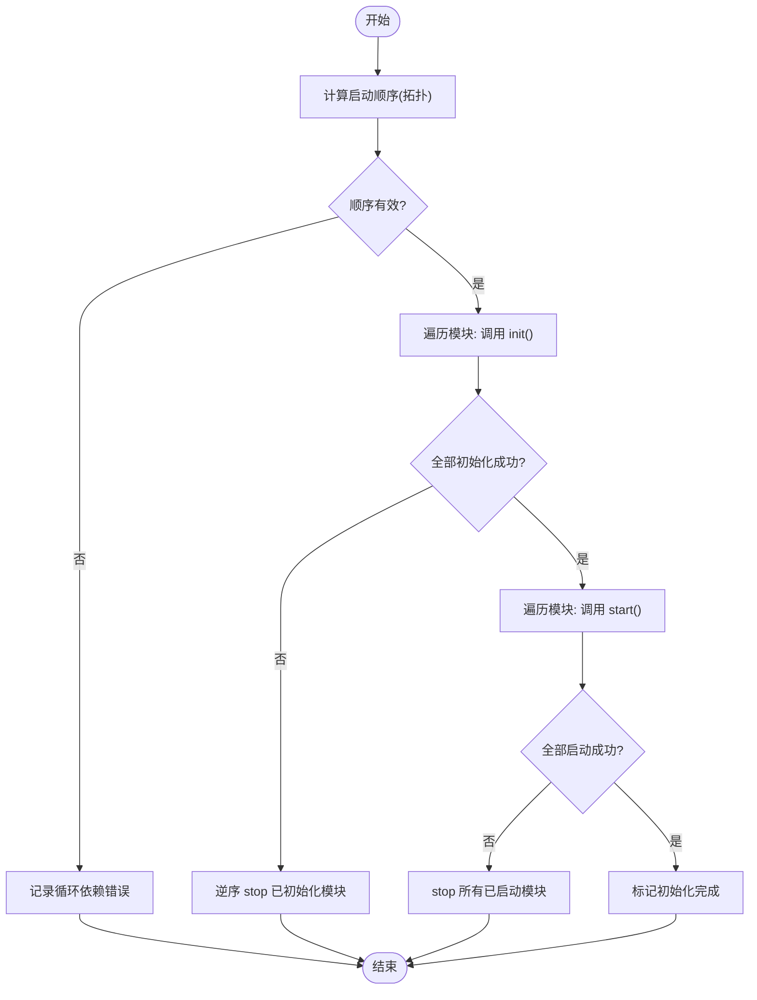
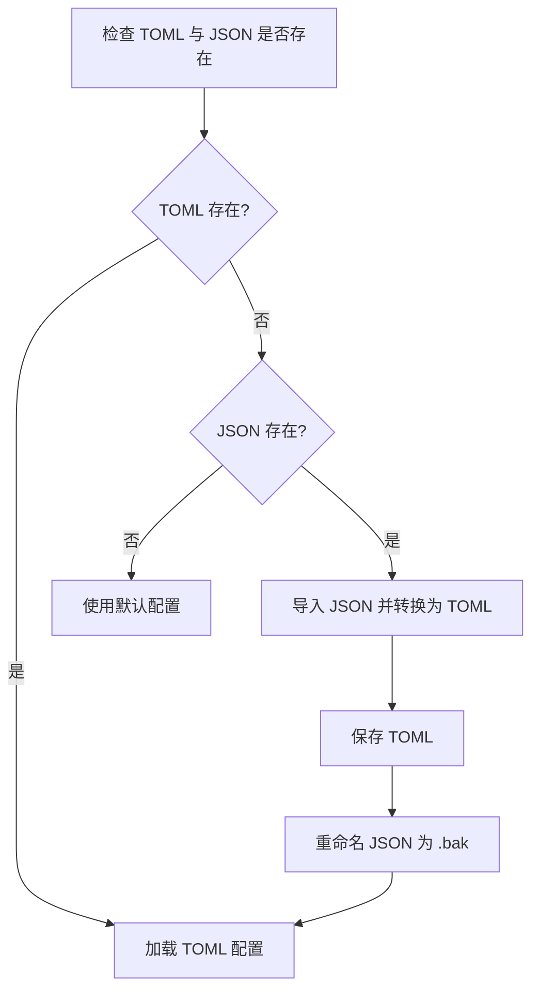
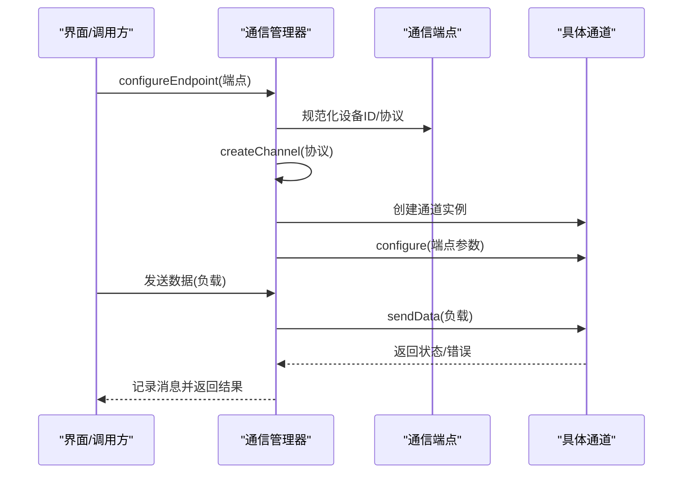
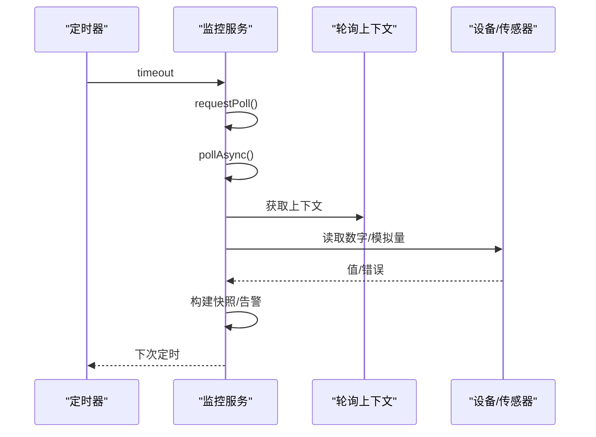
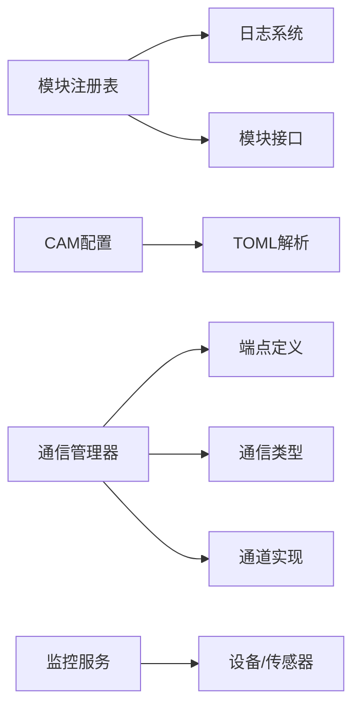

# 故障排除与维护

<cite>
**本文引用的文件**
- [logger.h](file://src/core/logging/logger.h)
- [logger.cpp](file://src/core/logging/logger.cpp)
- [log_codes.h](file://src/core/logging/log_codes.h)
- [module_registry.cpp](file://src/core/kernel/module_registry.cpp)
- [module_registry.h](file://src/core/kernel/module_registry.h)
- [cam_config.cpp](file://src/modules/cam/settings/cam_config.cpp)
- [process_monitor_service.cpp](file://src/modules/process/monitor/process_monitor_service.cpp)
- [communication_manager.cpp](file://src/modules/process/communication/communication_manager.cpp)
- [communication_endpoint.cpp](file://src/modules/process/communication/communication_endpoint.cpp)
- [communication_types.cpp](file://src/modules/process/communication/communication_types.cpp)
- [LaserCNC.toml](file://build/Debug/config/LaserCNC.toml)
- [cam.toml](file://build/Debug/config/cam.toml)
- [process.toml](file://build/Debug/config/process.toml)
- [machine.toml](file://build/Debug/config/machine.toml)
- [mainwindow.toml](file://build/Debug/config/mainwindow.toml)
- [value.hpp](file://3rd/toml11/toml11/value.hpp)
- [helpers-inl.h](file://3rd/spdlog/cfg/helpers-inl.h)
- [argv.h](file://3rd/spdlog/cfg/argv.h)
- [logger.h](file://3rd/spdlog/logger.h)
- [qt_sinks.h](file://3rd/spdlog/sinks/qt_sinks.h)
- [result.hpp](file://3rd/toml11/toml11/result.hpp)
</cite>

## 目录
1. [简介](#简介)
2. [项目结构](#项目结构)
3. [核心组件](#核心组件)
4. [架构总览](#架构总览)
5. [详细组件分析](#详细组件分析)
6. [依赖关系分析](#依赖关系分析)
7. [性能考虑](#性能考虑)
8. [故障排除指南](#故障排除指南)
9. [结论](#结论)
10. [附录](#附录)

## 简介
本文件为LaserCNC项目的故障排除与维护指南，覆盖日志系统配置与使用、常见问题诊断流程（启动失败、模块加载错误、设备连接问题、性能瓶颈）、系统监控指标（内存/CPU/磁盘）、备份与恢复策略（项目文件、配置、数据库迁移），以及性能优化建议与最佳实践。内容基于仓库中实际实现进行梳理，确保可操作性与可追溯性。

## 项目结构
LaserCNC采用微内核框架，核心模块通过注册表进行生命周期管理；日志系统基于spdlog；配置采用TOML格式并通过自定义配置类读取与迁移；通信模块支持多种协议；监控服务提供过程状态轮询与告警。

图表来源
- [module_registry.cpp:74-210](file://src/core/kernel/module_registry.cpp#L74-L210)
- [module_registry.h:48-63](file://src/core/kernel/module_registry.h#L48-L63)
- [logger.h](file://src/core/logging/logger.h)
- [logger.cpp](file://src/core/logging/logger.cpp)
- [log_codes.h](file://src/core/logging/log_codes.h)
- [cam_config.cpp:104-133](file://src/modules/cam/settings/cam_config.cpp#L104-L133)
- [communication_manager.cpp:1-111](file://src/modules/process/communication/communication_manager.cpp#L1-L111)
- [communication_endpoint.cpp:1-45](file://src/modules/process/communication/communication_endpoint.cpp#L1-L45)
- [communication_types.cpp:1-43](file://src/modules/process/communication/communication_types.cpp#L1-L43)
- [process_monitor_service.cpp:211-255](file://src/modules/process/monitor/process_monitor_service.cpp#L211-L255)

章节来源
- [module_registry.cpp:74-210](file://src/core/kernel/module_registry.cpp#L74-L210)
- [module_registry.h:48-63](file://src/core/kernel/module_registry.h#L48-L63)
- [cam_config.cpp:104-133](file://src/modules/cam/settings/cam_config.cpp#L104-L133)

## 核心组件
- 日志系统：统一的日志接口与错误码体系，支持多级日志、异步记录、格式化输出与sink扩展。
- 模块注册表：负责模块拓扑排序、初始化与启动/停止的事务式回滚。
- 配置系统：以TOML为主，兼容旧版JSON并自动迁移。
- 通信系统：统一的通信管理器，支持Mock/TCP/HTTP/Serial等协议。
- 过程监控：定时轮询IO与模拟量状态，生成快照与告警。
- 配置文件：位于构建目录的config子目录，包含应用、CAM、Process、Machine、主窗口等配置。

章节来源
- [logger.h](file://src/core/logging/logger.h)
- [logger.cpp](file://src/core/logging/logger.cpp)
- [log_codes.h](file://src/core/logging/log_codes.h)
- [module_registry.cpp:74-210](file://src/core/kernel/module_registry.cpp#L74-L210)
- [cam_config.cpp:104-133](file://src/modules/cam/settings/cam_config.cpp#L104-L133)
- [communication_manager.cpp:1-111](file://src/modules/process/communication/communication_manager.cpp#L1-L111)
- [process_monitor_service.cpp:211-255](file://src/modules/process/monitor/process_monitor_service.cpp#L211-L255)
- [LaserCNC.toml](file://build/Debug/config/LaserCNC.toml)
- [cam.toml](file://build/Debug/config/cam.toml)
- [process.toml](file://build/Debug/config/process.toml)
- [machine.toml](file://build/Debug/config/machine.toml)
- [mainwindow.toml](file://build/Debug/config/mainwindow.toml)

## 架构总览
下图展示从启动到模块运行、日志记录、配置加载与通信交互的关键路径。

图表来源
- [module_registry.cpp:110-188](file://src/core/kernel/module_registry.cpp#L110-L188)
- [logger.h](file://src/core/logging/logger.h)
- [cam_config.cpp:104-133](file://src/modules/cam/settings/cam_config.cpp#L104-L133)
- [communication_manager.cpp:21-78](file://src/modules/process/communication/communication_manager.cpp#L21-L78)

## 详细组件分析

### 日志系统与错误码
- 统一日志接口：通过宏封装不同严重级别的日志调用，便于集中管理与条件编译。
- 错误码体系：定义LogCode枚举，结合LCNC_ERR/LCNC_WARN/LCNC_INFO等宏，形成结构化的错误报告。
- 日志级别与格式：支持设置全局或特定logger的级别，支持模式化格式输出。
- 异步与sink：支持异步记录与多种sink（文件、控制台、Qt文本框等）。

图表来源
- [logger.h](file://src/core/logging/logger.h)
- [logger.cpp](file://src/core/logging/logger.cpp)
- [log_codes.h](file://src/core/logging/log_codes.h)

章节来源
- [logger.h](file://src/core/logging/logger.h)
- [logger.cpp](file://src/core/logging/logger.cpp)
- [log_codes.h](file://src/core/logging/log_codes.h)

### 模块注册表与启动流程
- 拓扑排序：根据模块依赖计算稳定启动顺序，检测循环依赖并记录错误。
- 初始化阶段：逐个调用模块init，异常时执行回滚（逆序stop已初始化模块）。
- 启动阶段：逐个调用模块start，异常时停止所有已启动模块并返回失败。
- 状态管理：维护已启动模块列表，支持stopAll。

图表来源
- [module_registry.cpp:74-210](file://src/core/kernel/module_registry.cpp#L74-L210)

章节来源
- [module_registry.cpp:74-210](file://src/core/kernel/module_registry.cpp#L74-L210)
- [module_registry.h:48-63](file://src/core/kernel/module_registry.h#L48-L63)

### 配置系统与迁移
- TOML优先：默认使用TOML作为配置格式，路径在构建目录config子目录。
- 兼容迁移：若发现旧版JSON存在且TOML缺失，则自动解析JSON并写入TOML，同时将旧文件重命名为.bak。
- 解析与错误处理：TOML解析结果通过result类型区分成功/失败，便于上层处理。

图表来源
- [cam_config.cpp:104-133](file://src/modules/cam/settings/cam_config.cpp#L104-L133)
- [value.hpp:1275-1286](file://3rd/toml11/toml11/value.hpp#L1275-L1286)
- [result.hpp:408-458](file://3rd/toml11/toml11/result.hpp#L408-L458)

章节来源
- [cam_config.cpp:104-133](file://src/modules/cam/settings/cam_config.cpp#L104-L133)
- [value.hpp:1275-1286](file://3rd/toml11/toml11/value.hpp#L1275-L1286)
- [result.hpp:408-458](file://3rd/toml11/toml11/result.hpp#L408-L458)

### 通信系统与设备连接
- 通信管理器：根据端点协议创建对应通道（Mock/TCP/HTTP/Serial），支持配置更新与状态查询。
- 端点标准化：提供URL构造、显示名生成与设备ID规范化。
- 类型映射：协议与状态的字符串表示，便于UI与日志展示。

图表来源
- [communication_manager.cpp:21-78](file://src/modules/process/communication/communication_manager.cpp#L21-L78)
- [communication_endpoint.cpp:10-45](file://src/modules/process/communication/communication_endpoint.cpp#L10-L45)
- [communication_types.cpp:5-43](file://src/modules/process/communication/communication_types.cpp#L5-L43)

章节来源
- [communication_manager.cpp:1-111](file://src/modules/process/communication/communication_manager.cpp#L1-L111)
- [communication_endpoint.cpp:1-45](file://src/modules/process/communication/communication_endpoint.cpp#L1-L45)
- [communication_types.cpp:1-43](file://src/modules/process/communication/communication_types.cpp#L1-L43)

### 过程监控服务
- 定时轮询：使用QTimer定期触发异步轮询，避免阻塞主线程。
- 数字/模拟量采集：读取IO与模拟量，计算阈值比较与告警详情。
- 快照与告警：生成监控快照，聚合输出状态与告警列表。

图表来源
- [process_monitor_service.cpp:211-255](file://src/modules/process/monitor/process_monitor_service.cpp#L211-L255)
- [process_monitor_service.cpp:130-207](file://src/modules/process/monitor/process_monitor_service.cpp#L130-L207)

章节来源
- [process_monitor_service.cpp:211-255](file://src/modules/process/monitor/process_monitor_service.cpp#L211-L255)
- [process_monitor_service.cpp:130-207](file://src/modules/process/monitor/process_monitor_service.cpp#L130-L207)

## 依赖关系分析
- 模块注册表依赖日志系统进行状态与错误记录；依赖模块接口进行生命周期管理。
- 配置系统依赖TOML解析库，兼容旧版JSON迁移逻辑。
- 通信管理器依赖各协议通道实现，并通过端点与类型定义解耦。
- 监控服务依赖设备抽象与配置，定时器驱动异步轮询。

图表来源
- [module_registry.cpp:74-210](file://src/core/kernel/module_registry.cpp#L74-L210)
- [logger.h](file://src/core/logging/logger.h)
- [cam_config.cpp:104-133](file://src/modules/cam/settings/cam_config.cpp#L104-L133)
- [communication_manager.cpp:1-111](file://src/modules/process/communication/communication_manager.cpp#L1-L111)
- [communication_endpoint.cpp:1-45](file://src/modules/process/communication/communication_endpoint.cpp#L1-L45)
- [communication_types.cpp:1-43](file://src/modules/process/communication/communication_types.cpp#L1-L43)
- [process_monitor_service.cpp:211-255](file://src/modules/process/monitor/process_monitor_service.cpp#L211-L255)

章节来源
- [module_registry.cpp:74-210](file://src/core/kernel/module_registry.cpp#L74-L210)
- [cam_config.cpp:104-133](file://src/modules/cam/settings/cam_config.cpp#L104-L133)
- [communication_manager.cpp:1-111](file://src/modules/process/communication/communication_manager.cpp#L1-L111)

## 性能考虑
- 日志级别控制：通过环境变量或配置降低日志级别以减少I/O开销；仅在调试阶段启用高详细度。
- 异步记录：启用spdlog异步记录，避免阻塞业务线程。
- 监控轮询频率：合理设置监控轮询间隔，避免频繁IO造成抖动。
- 缓存与批处理：对高频读取的数据进行本地缓存，减少重复访问。
- 并发控制：通信与监控使用队列与异步回调，避免同步阻塞。

## 故障排除指南

### 启动失败
- 检查模块依赖：确认无循环依赖，查看日志中“依赖循环”相关记录。
- 初始化与启动阶段：定位init/start抛出异常的模块，结合回滚日志排查资源释放问题。
- 配置加载：确认TOML配置存在且可读；如需迁移，检查.bak是否生成。

诊断步骤
1. 查看模块注册表启动日志，定位init/start失败的模块。
2. 检查该模块的依赖项是否正确加载。
3. 若涉及配置，确认TOML路径与权限，必要时手动迁移旧配置。

章节来源
- [module_registry.cpp:110-188](file://src/core/kernel/module_registry.cpp#L110-L188)
- [cam_config.cpp:104-133](file://src/modules/cam/settings/cam_config.cpp#L104-L133)

### 模块加载错误
- 依赖解析：检查模块间依赖声明与接口实现是否匹配。
- 生命周期异常：捕获init/start中的异常并记录堆栈，结合回滚日志定位资源泄漏。

章节来源
- [module_registry.cpp:120-181](file://src/core/kernel/module_registry.cpp#L120-L181)

### 设备连接问题
- 协议选择：确认端点协议与目标设备匹配（TCP/HTTP/Serial/Mock）。
- 端点参数：校验主机、端口、串口号、波特率、超时等参数。
- 通道创建：检查协议分支与编译选项（Serial在某些构建中可能禁用）。
- 状态查询：通过通信管理器查询设备状态，结合错误消息定位问题。

章节来源
- [communication_manager.cpp:21-108](file://src/modules/process/communication/communication_manager.cpp#L21-L108)
- [communication_endpoint.cpp:10-45](file://src/modules/process/communication/communication_endpoint.cpp#L10-L45)
- [communication_types.cpp:5-43](file://src/modules/process/communication/communication_types.cpp#L5-L43)

### 性能瓶颈
- 监控轮询：调整轮询间隔，减少不必要的读取。
- 日志级别：在生产环境降低日志级别，避免过多I/O。
- 异步化：确保日志与通信使用异步sink与回调，避免阻塞。

章节来源
- [process_monitor_service.cpp:211-255](file://src/modules/process/monitor/process_monitor_service.cpp#L211-L255)
- [logger.h](file://src/core/logging/logger.h)

### 系统监控
- 内存使用：关注模块与日志缓冲区大小，避免长期累积。
- CPU占用：监控定时器与轮询频率，避免过密采样。
- 磁盘空间：定期清理日志文件，控制单文件大小与保留数量。

章节来源
- [logger.h](file://src/core/logging/logger.h)

### 备份与恢复
- 项目文件备份：定期复制项目目录至安全位置。
- 配置文件管理：TOML配置位于构建目录config子目录，备份前先停止应用。
- 数据库迁移：配置系统会自动将旧版JSON迁移到TOML并重命名为.bak，备份后方可删除旧文件。

章节来源
- [cam_config.cpp:104-133](file://src/modules/cam/settings/cam_config.cpp#L104-L133)
- [LaserCNC.toml](file://build/Debug/config/LaserCNC.toml)
- [cam.toml](file://build/Debug/config/cam.toml)
- [process.toml](file://build/Debug/config/process.toml)
- [machine.toml](file://build/Debug/config/machine.toml)
- [mainwindow.toml](file://build/Debug/config/mainwindow.toml)

### 日志系统配置与使用
- 日志级别设置：可通过环境变量或配置加载函数设置全局或特定logger级别。
- 日志文件管理：使用旋转/按日切分等sink策略，控制文件大小与保留天数。
- 错误码对照：结合LogCode枚举与日志消息，快速定位问题类别。

章节来源
- [helpers-inl.h:73-102](file://3rd/spdlog/cfg/helpers-inl.h#L73-L102)
- [argv.h:24-33](file://3rd/spdlog/cfg/argv.h#L24-L33)
- [logger.h:246-289](file://3rd/spdlog/logger.h#L246-L289)
- [qt_sinks.h:150-152](file://3rd/spdlog/sinks/qt_sinks.h#L150-L152)
- [log_codes.h](file://src/core/logging/log_codes.h)

## 结论
本指南提供了LaserCNC从日志、模块、配置到通信与监控的全链路故障排除与维护方法。建议在生产环境中：
- 严格控制日志级别与输出sink；
- 合理设置监控轮询频率；
- 定期备份配置与项目；
- 在变更配置或模块时进行灰度验证。

## 附录

### 常见错误码速查（示例）
- Generic：通用信息/调试
- SettingsLoaded：配置加载成功
- SettingsParseFailed：配置解析失败
- SettingsSaveFailed：配置保存失败
- InternalUnexpectedState：内部状态异常

章节来源
- [log_codes.h](file://src/core/logging/log_codes.h)