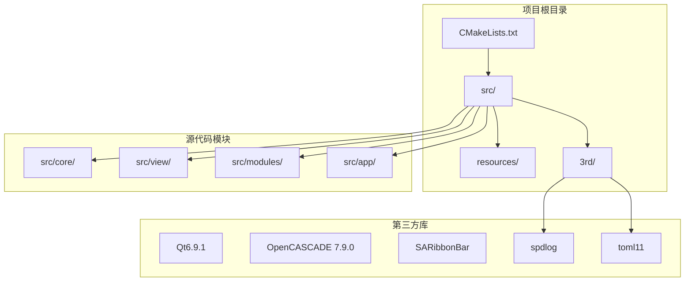
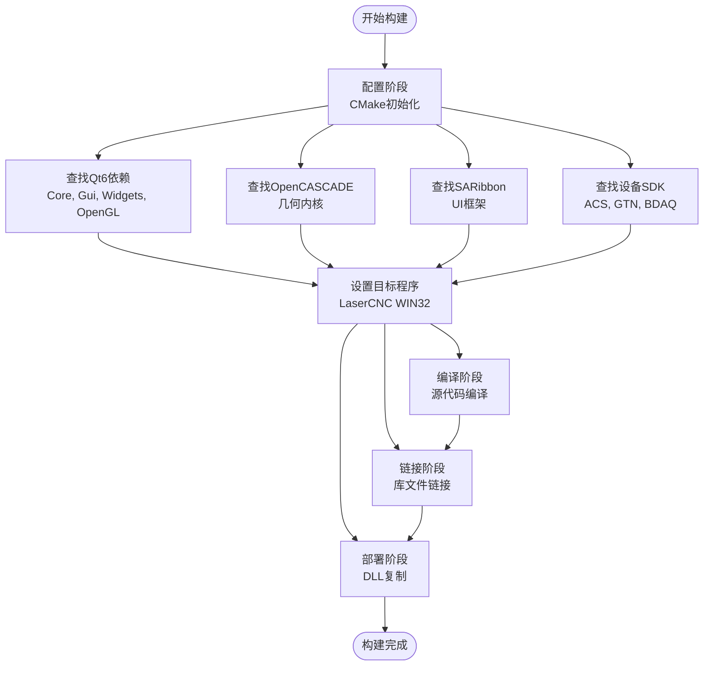
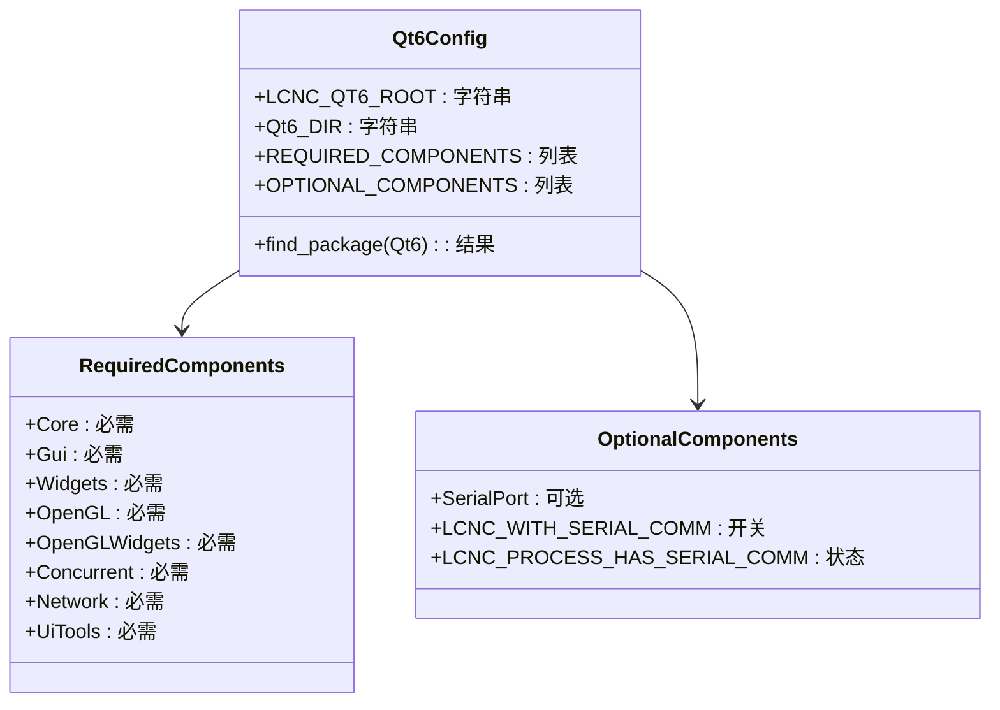
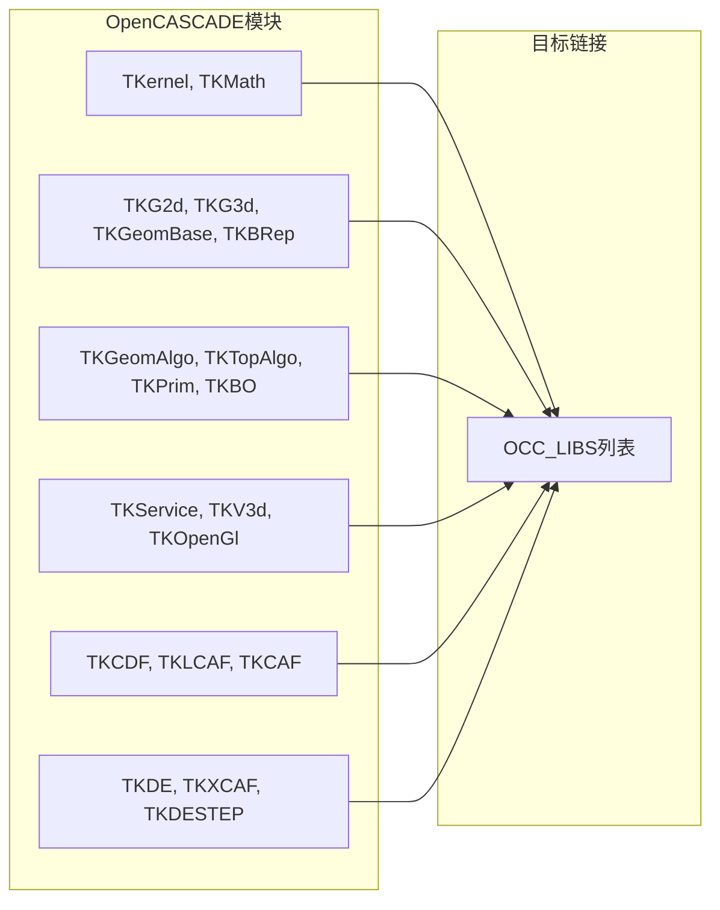
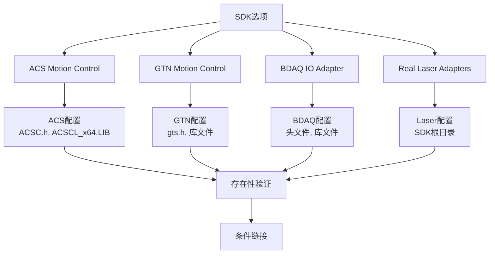
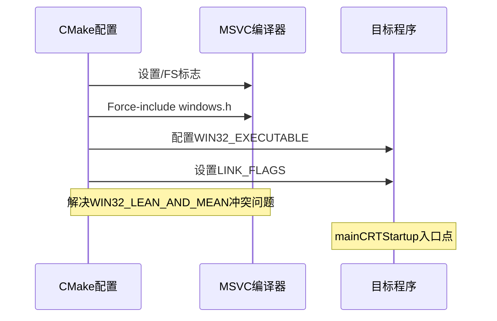
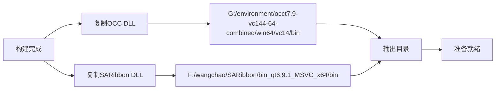
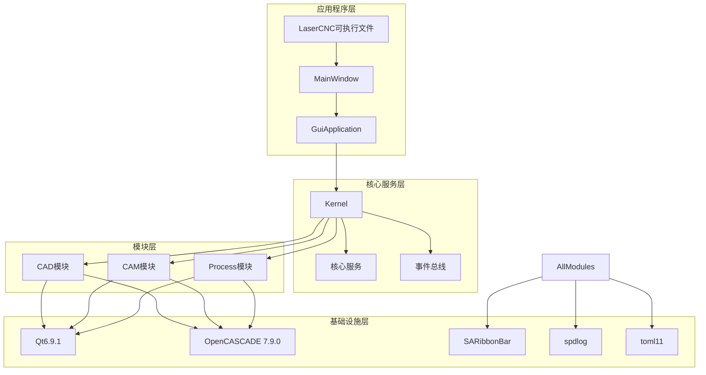
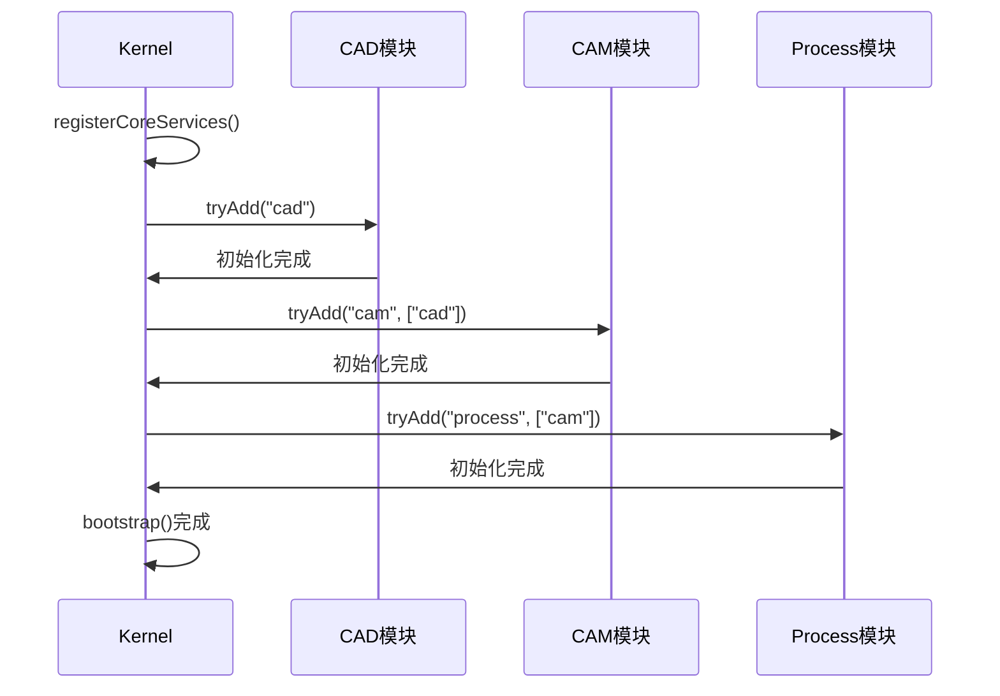

# 构建配置

<cite>
**本文档引用的文件**
- [CMakeLists.txt](file://CMakeLists.txt)
- [Readme.md](file://Readme.md)
- [build_log.txt](file://build_log.txt)
- [build_log2.txt](file://build_log2.txt)
- [build_log3.txt](file://build_log3.txt)
- [src/main.cpp](file://src/main.cpp)
</cite>

## 目录
1. [简介](#简介)
2. [项目结构](#项目结构)
3. [核心组件](#核心组件)
4. [架构概览](#架构概览)
5. [详细组件分析](#详细组件分析)
6. [依赖分析](#依赖分析)
7. [性能考虑](#性能考虑)
8. [故障排除指南](#故障排除指南)
9. [结论](#结论)
10. [附录](#附录)

## 简介
LaserCNC是一个面向五轴激光加工的CAD + CAM + Process一体化桌面软件。该项目采用C++17标准，使用Qt 6.9.1 + SARibbon作为UI框架，OpenCASCADE 7.9.0作为几何内核，并集成了spdlog日志库和toml11配置管理。构建系统基于CMake 3.20+，当前主要在MSVC 2022 x64环境下进行开发和验证。

## 项目结构
LaserCNC项目采用模块化的组织结构，主要分为以下几个核心目录：



**图表来源**
- [CMakeLists.txt:1-425](file://CMakeLists.txt#L1-L425)
- [Readme.md:58-70](file://Readme.md#L58-L70)

**章节来源**
- [CMakeLists.txt:81-283](file://CMakeLists.txt#L81-L283)
- [Readme.md:58-70](file://Readme.md#L58-L70)

## 核心组件
构建系统的核心组件包括以下关键部分：

### 项目配置
- **C++标准**: C++17 (CMAKE_CXX_STANDARD 17)
- **语言支持**: CXX语言
- **最小CMake版本**: 3.20+
- **项目名称**: LaserCNC (版本1.0.0)

### 自动化配置
- **自动MOC/UIC/RCC**: 全面启用Qt自动化工具
- **UI工具搜索路径**: `${CMAKE_CURRENT_SOURCE_DIR}/src/modules/process/Setting`
- **资源文件**: resources/resources.qrc

**章节来源**
- [CMakeLists.txt:1-11](file://CMakeLists.txt#L1-L11)

## 架构概览
LaserCNC的构建系统采用分层架构，从底层依赖到上层应用模块的完整构建流程：



**图表来源**
- [CMakeLists.txt:12-425](file://CMakeLists.txt#L12-L425)

## 详细组件分析

### Qt6依赖管理
项目对Qt6的配置采用了灵活的可选组件机制：



**图表来源**
- [CMakeLists.txt:12-28](file://CMakeLists.txt#L12-L28)

关键特性：
- **必需组件**: 所有核心功能都依赖这些组件
- **可选组件**: SerialPort根据LCNC_WITH_SERIAL_COMM选项动态启用
- **版本兼容**: Qt6.9.1特定版本要求

**章节来源**
- [CMakeLists.txt:12-28](file://CMakeLists.txt#L12-L28)

### OpenCASCADE集成
OpenCASCADE 7.9.0的集成采用了模块化链接策略：



**图表来源**
- [CMakeLists.txt:302-316](file://CMakeLists.txt#L302-L316)

**章节来源**
- [CMakeLists.txt:302-345](file://CMakeLists.txt#L302-L345)

### 第三方设备SDK集成
项目支持多种工业设备SDK的集成：



**图表来源**
- [CMakeLists.txt:40-79](file://CMakeLists.txt#L40-L79)

**章节来源**
- [CMakeLists.txt:40-79](file://CMakeLists.txt#L40-L79)

### 编译器特定配置
针对MSVC编译器的特殊配置：



**图表来源**
- [CMakeLists.txt:371-394](file://CMakeLists.txt#L371-L394)

**章节来源**
- [CMakeLists.txt:371-394](file://CMakeLists.txt#L371-L394)

### 部署配置
构建完成后自动部署必要的运行时文件：



**图表来源**
- [CMakeLists.txt:396-420](file://CMakeLists.txt#L396-L420)

**章节来源**
- [CMakeLists.txt:396-420](file://CMakeLists.txt#L396-L420)

## 依赖分析

### 依赖关系图


**图表来源**
- [CMakeLists.txt:276-345](file://CMakeLists.txt#L276-L345)
- [src/main.cpp:106-108](file://src/main.cpp#L106-L108)

### 模块依赖关系
项目采用拓扑排序确保模块加载顺序正确：



**图表来源**
- [src/main.cpp:86-104](file://src/main.cpp#L86-L104)

**章节来源**
- [src/main.cpp:86-104](file://src/main.cpp#L86-L104)

## 性能考虑
构建系统的性能优化主要体现在以下几个方面：

### 编译器优化
- **MSVC特定优化**: `/FS`标志用于序列化PDB写入
- **强制包含**: `/FIwindows.h`解决头文件冲突问题
- **平台特定定义**: `NOMINMAX`, `_USE_MATH_DEFINES`, `_CRT_SECURE_NO_WARNINGS`

### 链接优化
- **模块化链接**: OpenCASCADE采用精确的模块化链接策略
- **条件编译**: 设备SDK仅在需要时编译和链接
- **第三方库管理**: 统一的3rdparty库目录管理

### 构建时间优化
- **自动化工具**: 全面启用Qt的MOC/UIC/RCC自动化
- **增量构建**: CMake的智能依赖跟踪
- **并行编译**: 利用现代编译器的多核支持

## 故障排除指南

### 常见构建错误及解决方案

#### Qt头文件冲突问题
**问题描述**: 在MSVC环境下出现OLE相关头文件冲突
**解决方案**: 
- 使用`/FIwindows.h`强制包含windows.h
- 确保OpenCASCADE的OpenGl_glext.h不会排除必要头文件

**章节来源**
- [CMakeLists.txt:377-380](file://CMakeLists.txt#L377-L380)

#### LNK2019链接错误
**问题描述**: 设备SDK相关符号未解析
**解决方案**:
- 确认LCNC_WITH_ACS/LCNC_WITH_GTN/LCNC_WITH_BDAQ选项设置正确
- 验证对应SDK库文件路径配置
- 检查SDK版本兼容性

**章节来源**
- [build_log3.txt:173-178](file://build_log3.txt#L173-L178)

#### OCC DLL缺失问题
**问题描述**: 运行时缺少OpenCASCADE动态库
**解决方案**:
- 验证LCNC_OCCT_ROOT路径配置
- 确认OCC_BIN_DIR存在且包含所需DLL
- 检查Post-build命令是否正确执行

**章节来源**
- [CMakeLists.txt:396-407](file://CMakeLists.txt#L396-L407)

### 构建环境配置建议

#### Windows环境配置
```cmake
# Qt6配置
set(LCNC_QT6_ROOT "E:/Qt6.9.1/6.9.1/msvc2022_64" CACHE PATH "Qt6安装根目录")
set(Qt6_DIR "${LCNC_QT6_ROOT}/lib/cmake/Qt6" CACHE PATH "Qt6 CMake包目录")

# OpenCASCADE配置  
set(LCNC_OCCT_ROOT "G:/environment/occt7.9-vc144-64-combined/occt-vc144-64" CACHE PATH "OpenCASCADE安装根目录")
set(OpenCASCADE_DIR "${LCNC_OCCT_ROOT}/cmake" CACHE PATH "OpenCASCADE CMake包目录")

# SARibbon配置
set(LCNC_SARIBBON_ROOT "F:/wangchao/SARibbon/bin_qt6.9.1_MSVC_x64" CACHE PATH "SARibbon安装根目录")
set(SARibbonBar_DIR "${LCNC_SARIBBON_ROOT}/lib/cmake/SARibbonBar" CACHE PATH "SARibbonBar CMake包目录")
```

**章节来源**
- [CMakeLists.txt:13-38](file://CMakeLists.txt#L13-L38)

## 结论
LaserCNC的CMake构建系统展现了现代C++项目的最佳实践，具有以下特点：

### 优势
- **模块化设计**: 清晰的依赖层次和模块化架构
- **跨平台兼容**: 良好的Windows、Linux、macOS支持
- **自动化程度高**: 全面的Qt自动化工具集成
- **可扩展性强**: 灵活的SDK集成机制

### 改进建议
- **文档完善**: 增加更多构建配置示例和最佳实践
- **CI/CD集成**: 考虑添加持续集成配置
- **性能监控**: 添加构建时间分析工具

该构建系统为LaserCNC项目提供了稳定可靠的开发和部署基础，支持复杂的CAD/CAM/Process一体化应用需求。

## 附录

### 构建选项参考
| 选项名称 | 默认值 | 描述 |
|---------|--------|------|
| LCNC_WITH_SERIAL_COMM | ON | 启用Qt SerialPort通信通道 |
| LCNC_WITH_ACS | OFF | 启用ACS运动控制器适配器 |
| LCNC_WITH_GTN | OFF | 启用GTN运动控制器适配器 |
| LCNC_WITH_BDAQ | OFF | 启用BDAQ IO适配器 |
| LCNC_WITH_REAL_LASER | OFF | 启用真实激光适配器 |

### 关键路径配置
- **LCNC_QT6_ROOT**: Qt6安装根目录
- **LCNC_OCCT_ROOT**: OpenCASCADE安装根目录
- **LCNC_OCCT_3RDPARTY_DIR**: OpenCASCADE第三方库目录
- **LCNC_SARIBBON_ROOT**: SARibbon安装根目录

**章节来源**
- [Readme.md:89-98](file://Readme.md#L89-L98)