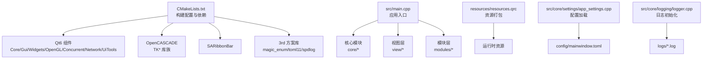
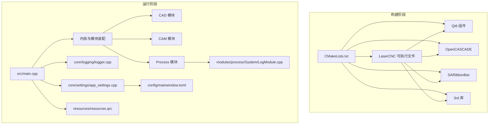
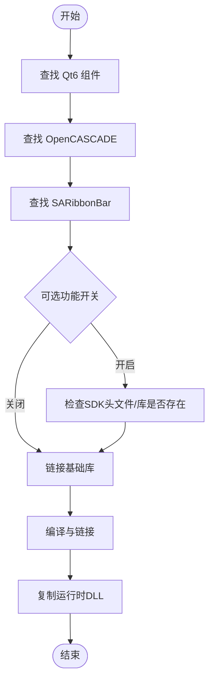
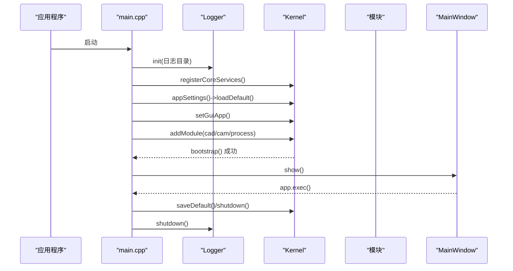
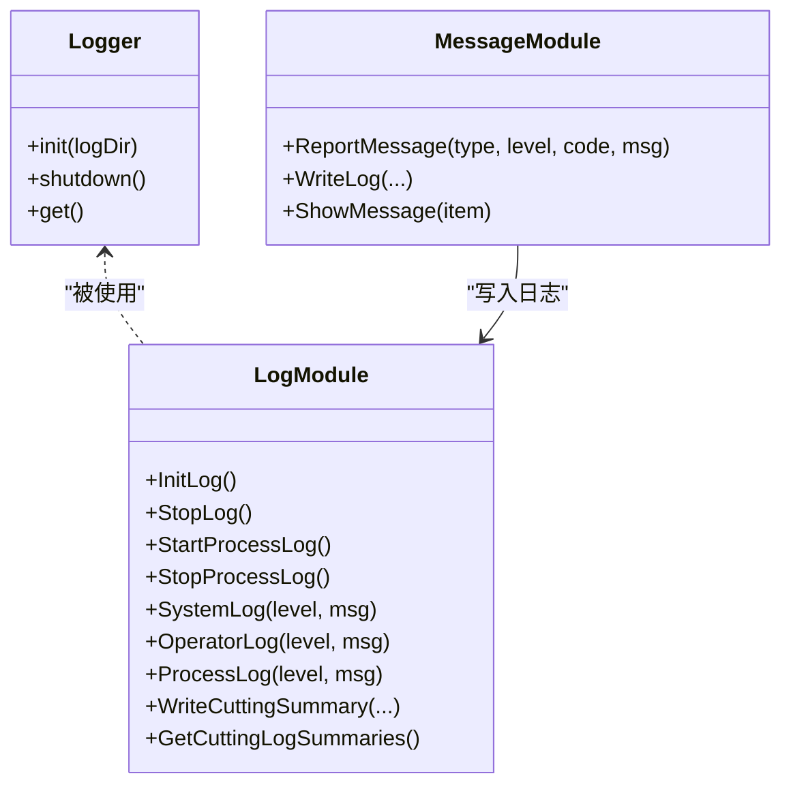
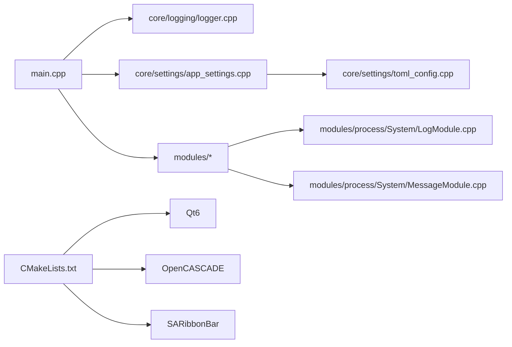

# 部署运维

<cite>
**本文引用的文件**
- [CMakeLists.txt](file://CMakeLists.txt)
- [main.cpp](file://src/main.cpp)
- [app_context.cpp](file://src/app/app_context.cpp)
- [logger.cpp](file://src/core/logging/logger.cpp)
- [toml_config.cpp](file://src/core/settings/toml_config.cpp)
- [app_settings.cpp](file://src/core/settings/app_settings.cpp)
- [LogModule.cpp](file://src/modules/process/System/LogModule.cpp)
- [MessageModule.cpp](file://src/modules/process/System/MessageModule.cpp)
- [resources.qrc](file://resources/resources.qrc)
</cite>

## 目录
1. [简介](#简介)
2. [项目结构](#项目结构)
3. [核心组件](#核心组件)
4. [架构总览](#架构总览)
5. [详细组件分析](#详细组件分析)
6. [依赖关系分析](#依赖关系分析)
7. [性能考虑](#性能考虑)
8. [故障排除指南](#故障排除指南)
9. [结论](#结论)
10. [附录](#附录)

## 简介
本文件面向LaserCNC项目的部署与运维团队，提供从构建配置、依赖管理、交叉编译到打包发布、版本管理、日志系统配置、性能监控与系统维护的完整指南。文档基于仓库中的CMake配置、应用入口、日志与设置模块等关键源码进行分析，并结合实际部署场景给出可操作的建议。

## 项目结构
LaserCNC采用CMake作为主构建系统，使用Qt6、OpenCASCADE、SARibbon等第三方库。项目通过CMakeLists.txt集中管理编译选项、依赖查找、目标链接与运行时DLL部署。资源通过Qt资源系统统一打包，便于分发。

**图表来源**
- [CMakeLists.txt:1-425](file://CMakeLists.txt#L1-L425)
- [main.cpp:1-136](file://src/main.cpp#L1-L136)
- [resources.qrc:1-76](file://resources/resources.qrc#L1-L76)

**章节来源**
- [CMakeLists.txt:1-425](file://CMakeLists.txt#L1-L425)
- [main.cpp:1-136](file://src/main.cpp#L1-L136)
- [resources.qrc:1-76](file://resources/resources.qrc#L1-L76)

## 核心组件
- 构建系统与依赖
  - CMake最小版本要求、C++标准、Qt6/OCCT/SARibbon查找与链接。
  - 可选设备SDK开关（ACS/GTN/BDAQ/真实激光）与串口通信支持。
  - 运行时DLL复制至输出目录，确保分发完整性。
- 应用入口与生命周期
  - 主程序负责OpenGL格式设置、日志初始化、内核启动与模块装配、窗口显示与优雅退出。
- 日志系统
  - 基于spdlog的多通道日志：文件轮转、控制台彩色输出、Windows MSVC Sink。
  - 进程侧独立日志模块，按权限/用户标记，支持异步写入与切割。
- 配置系统
  - TOML配置文件读写，支持默认值、兼容旧字段、模块禁用列表。
- 资源打包
  - Qt资源系统统一打包图标与UI界面，便于安装包制作。

**章节来源**
- [CMakeLists.txt:12-394](file://CMakeLists.txt#L12-L394)
- [main.cpp:33-135](file://src/main.cpp#L33-L135)
- [logger.cpp:44-116](file://src/core/logging/logger.cpp#L44-L116)
- [LogModule.cpp:188-325](file://src/modules/process/System/LogModule.cpp#L188-L325)
- [toml_config.cpp:15-77](file://src/core/settings/toml_config.cpp#L15-L77)
- [app_settings.cpp:229-402](file://src/core/settings/app_settings.cpp#L229-L402)
- [resources.qrc:1-76](file://resources/resources.qrc#L1-L76)

## 架构总览
下图展示LaserCNC从构建到运行的关键交互：CMake配置第三方库与编译选项，生成可执行文件；运行时主程序初始化日志与内核，加载模块并显示界面；日志模块分别输出系统、操作员与工艺过程日志；配置模块负责应用设置的持久化与加载。

**图表来源**
- [CMakeLists.txt:276-394](file://CMakeLists.txt#L276-L394)
- [main.cpp:68-120](file://src/main.cpp#L68-L120)
- [logger.cpp:44-116](file://src/core/logging/logger.cpp#L44-L116)
- [LogModule.cpp:188-325](file://src/modules/process/System/LogModule.cpp#L188-L325)
- [app_settings.cpp:229-402](file://src/core/settings/app_settings.cpp#L229-L402)
- [resources.qrc:1-76](file://resources/resources.qrc#L1-L76)

## 详细组件分析

### 构建系统与CMake配置
- 关键特性
  - Qt6组件：Core/Gui/Widgets/OpenGL/OpenGLWidgets/Concurrent/Network/UiTools。
  - OpenCASCADE：按阶段启用TK*库族，链接第三方库目录。
  - SARibbonBar：界面主题与工具栏扩展。
  - 可选设备适配器：ACS/GTN/BDAQ/真实激光，以及Qt SerialPort通信。
  - 编译器优化：MSVC强制/Fs以避免PDB并发写入问题；Windows入口点与宏定义。
  - 运行时DLL部署：构建后自动复制OCCT与SARibbon运行时DLL到输出目录。
- 依赖管理
  - 通过缓存变量指定Qt6/OCCT/SARibbon根目录，确保跨机器一致性。
  - 对可选SDK进行存在性校验，未满足条件时发出致命错误或警告。
- 交叉编译
  - 当前配置针对MSVC工具链与Windows平台。若需交叉编译，应在宿主机上准备目标平台的Qt6/OCCT/SARibbon SDK，并调整Qt6_DIR/OpenCASCADE_DIR等路径。

**图表来源**
- [CMakeLists.txt:12-394](file://CMakeLists.txt#L12-L394)

**章节来源**
- [CMakeLists.txt:12-394](file://CMakeLists.txt#L12-L394)

### 应用入口与生命周期
- 启动流程
  - 设置高DPI策略与OpenGL默认格式。
  - 初始化日志目录与日志器。
  - 创建内核，注册核心服务，加载默认配置（mainwindow.toml）。
  - 注入GUI应用实例，按依赖顺序添加模块（cad→cam→process）。
  - 显示主窗口，事件循环结束后保存配置并优雅关闭。
- 关闭流程
  - 保存配置，调用内核shutdown，按声明顺序销毁对象。

**图表来源**
- [main.cpp:33-135](file://src/main.cpp#L33-L135)
- [logger.cpp:97-116](file://src/core/logging/logger.cpp#L97-L116)

**章节来源**
- [main.cpp:33-135](file://src/main.cpp#L33-L135)

### 日志系统与配置
- 核心日志（core/logging）
  - 多Sink：文件轮转（5MB/5个）、控制台彩色输出、Windows MSVC Sink。
  - 等级与刷新策略：调试模式下更频繁刷新，发布模式按警告级别刷新。
  - 无初始化时的轻量回退日志器，确保早期日志可见。
- 工艺日志（modules/process/System/LogModule）
  - 系统日志：每日滚动，信息级别以上立即刷新。
  - 操作员日志：异步写入，线程池+阻塞溢出策略，每5秒自动刷新。
  - 工艺日志：10MB轮转，保留1份，按权限/用户标记。
  - 切割摘要：统一格式，包含用户、权限、文件名、起止时间、总切割时间、进给次数、刀具清单。
- 配置与持久化
  - TOML读写封装，解析失败与写入失败均有明确错误码与日志。
  - AppSettings支持主题、语言、单位、窗口状态、最近文件、模块禁用列表、渲染配置等。

**图表来源**
- [logger.cpp:44-116](file://src/core/logging/logger.cpp#L44-L116)
- [LogModule.cpp:188-451](file://src/modules/process/System/LogModule.cpp#L188-L451)
- [MessageModule.cpp:60-125](file://src/modules/process/System/MessageModule.cpp#L60-L125)

**章节来源**
- [logger.cpp:44-116](file://src/core/logging/logger.cpp#L44-L116)
- [LogModule.cpp:188-451](file://src/modules/process/System/LogModule.cpp#L188-L451)
- [MessageModule.cpp:60-125](file://src/modules/process/System/MessageModule.cpp#L60-L125)
- [toml_config.cpp:15-77](file://src/core/settings/toml_config.cpp#L15-L77)
- [app_settings.cpp:229-402](file://src/core/settings/app_settings.cpp#L229-L402)

### 资源打包与安装包制作
- 资源组织
  - 图标与UI界面通过Qt资源系统统一打包，便于安装包制作与分发。
- 安装包建议
  - 将可执行文件、运行时DLL（OCCT/SARibbon）、配置目录config与资源包整合为安装包。
  - 首次运行时自动创建logs目录，确保日志写入权限。

**章节来源**
- [resources.qrc:1-76](file://resources/resources.qrc#L1-L76)

## 依赖关系分析
- 组件耦合
  - main.cpp依赖core/logging与core/settings，间接依赖modules/*。
  - LogModule与MessageModule相互协作，前者负责日志落盘，后者负责消息提示与编码解释。
  - AppSettings与TOML配置模块配合，提供默认配置与兼容处理。
- 外部依赖
  - Qt6、OpenCASCADE、SARibbonBar为强依赖；设备SDK与串口通信为弱依赖，可通过CMake选项控制。

**图表来源**
- [main.cpp:33-135](file://src/main.cpp#L33-L135)
- [logger.cpp:44-116](file://src/core/logging/logger.cpp#L44-L116)
- [app_settings.cpp:229-402](file://src/core/settings/app_settings.cpp#L229-L402)
- [toml_config.cpp:15-77](file://src/core/settings/toml_config.cpp#L15-L77)
- [LogModule.cpp:188-451](file://src/modules/process/System/LogModule.cpp#L188-L451)
- [MessageModule.cpp:60-125](file://src/modules/process/System/MessageModule.cpp#L60-L125)
- [CMakeLists.txt:12-394](file://CMakeLists.txt#L12-L394)

**章节来源**
- [CMakeLists.txt:12-394](file://CMakeLists.txt#L12-L394)
- [main.cpp:33-135](file://src/main.cpp#L33-L135)

## 性能考虑
- 日志性能
  - 异步日志：操作员日志使用线程池与阻塞溢出策略，降低主线程阻塞风险。
  - 刷新策略：按级别设定flush频率，兼顾实时性与I/O开销。
- 渲染与OpenGL
  - 默认OpenGL Core Profile 3.3，双缓冲与垂直同步，可根据硬件能力调整采样与质量预设。
- 配置加载
  - TOML解析异常捕获，缺失文件不中断启动，提升鲁棒性。

**章节来源**
- [LogModule.cpp:204-241](file://src/modules/process/System/LogModule.cpp#L204-L241)
- [logger.cpp:82-94](file://src/core/logging/logger.cpp#L82-L94)
- [app_settings.cpp:85-131](file://src/core/settings/app_settings.cpp#L85-L131)

## 故障排除指南
- 构建失败
  - Qt6/OCCT/SARibbon路径不正确：检查CMake缓存变量并确认SDK安装。
  - 可选SDK缺失：根据LCNC_WITH_*选项确认是否安装对应SDK或禁用相关功能。
  - MSVC编译问题：确保/Fs参数生效，避免PDB并发写入冲突。
- 运行时问题
  - 日志未生成：确认logs目录可写，检查Logger::init调用与配置文件路径。
  - 工艺日志异常：检查D:/Log/路径可用性与权限，确认StartProcessLog/StopProcessLog调用成对。
  - 配置加载失败：查看TOML解析错误码，修正语法或删除损坏文件。
- 模块禁用与依赖
  - 某模块未加载：检查config/mainwindow.toml中的modules.disabled列表，确认依赖链是否被上游禁用。

**章节来源**
- [CMakeLists.txt:59-79](file://CMakeLists.txt#L59-L79)
- [main.cpp:48-66](file://src/main.cpp#L48-L66)
- [LogModule.cpp:279-325](file://src/modules/process/System/LogModule.cpp#L279-L325)
- [toml_config.cpp:35-45](file://src/core/settings/toml_config.cpp#L35-L45)
- [app_settings.cpp:232-235](file://src/core/settings/app_settings.cpp#L232-L235)

## 结论
LaserCNC的构建与运维体系围绕CMake、Qt6、OpenCASCADE与SARibbon展开，辅以spdlog多通道日志与TOML配置系统。通过清晰的模块化设计与可选依赖机制，项目可在不同硬件与操作系统环境下稳定运行。建议在CI/CD中固化Qt6/OCCT/SARibbon路径，建立自动化打包流程，并持续完善日志与监控策略以支撑生产环境的长期运维。

## 附录
- 版本管理建议
  - 使用语义化版本号，变更CMake project版本并在发布包中标注。
  - 配置文件schema演进时保留兼容读取逻辑，逐步迁移字段。
- 运维最佳实践
  - 定期清理logs与D:/Log/下的历史日志，监控磁盘空间。
  - 在生产机上固定Qt6/OCCT/SARibbon路径，避免因路径变化导致运行失败。
  - 对关键配置（如process设备参数）进行备份与回滚策略。