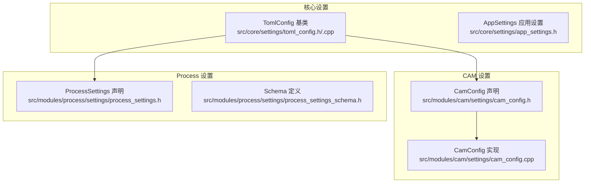
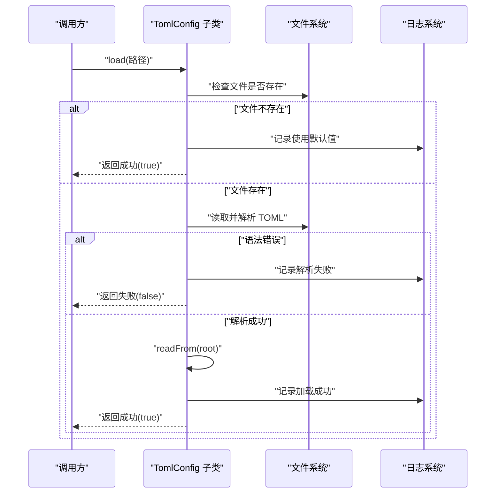
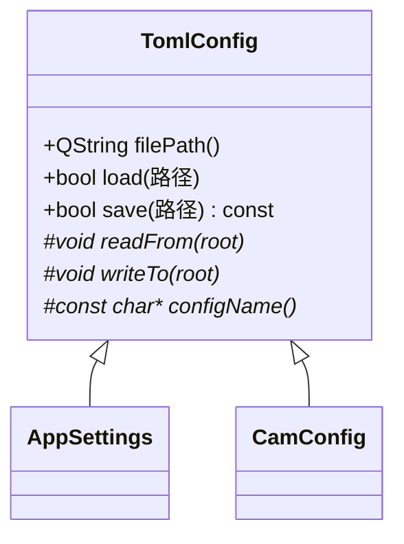
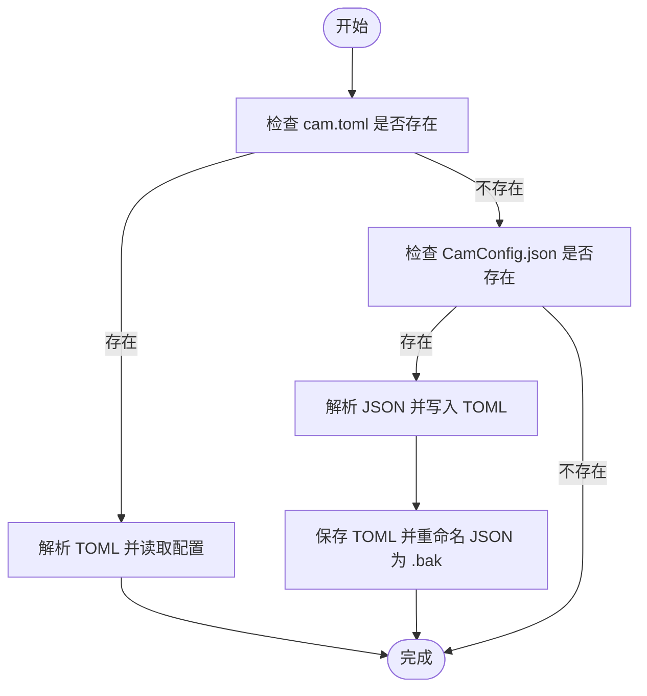
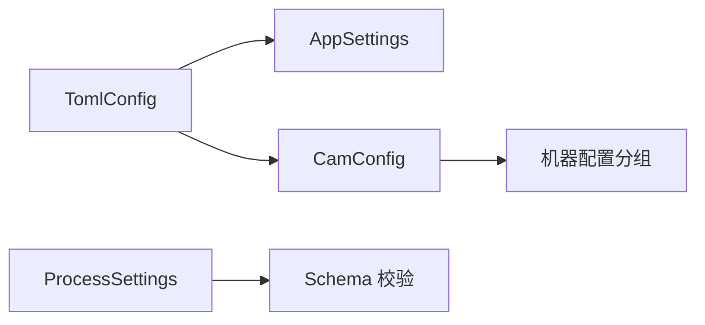

# 配置管理

<cite>
**本文引用的文件**
- [toml_config.h](file://src/core/settings/toml_config.h)
- [toml_config.cpp](file://src/core/settings/toml_config.cpp)
- [app_settings.h](file://src/core/settings/app_settings.h)
- [cam_config.h](file://src/modules/cam/settings/cam_config.h)
- [cam_config.cpp](file://src/modules/cam/settings/cam_config.cpp)
- [process_settings.h](file://src/modules/process/settings/process_settings.h)
- [process_settings_schema.h](file://src/modules/process/settings/process_settings_schema.h)
</cite>

## 目录
1. [简介](#简介)
2. [项目结构](#项目结构)
3. [核心组件](#核心组件)
4. [架构总览](#架构总览)
5. [详细组件分析](#详细组件分析)
6. [依赖关系分析](#依赖关系分析)
7. [性能考量](#性能考量)
8. [故障排查指南](#故障排查指南)
9. [结论](#结论)
10. [附录](#附录)

## 简介
本文件系统性阐述 LaserCNC 的配置管理系统，覆盖应用配置（AppSettings）、CAM 配置（CamConfig）与 Process 配置（ProcessSettings）三类配置的结构、加载流程、验证规则与动态更新机制。系统采用 TOML 作为统一配置格式，提供类型安全的读取与写入、默认值回退、错误日志记录以及从旧版 JSON 的自动迁移能力。本文同时给出配置扩展方法、自定义配置项添加步骤与配置迁移策略，帮助开发者与运维人员高效维护与演进配置体系。

## 项目结构
配置相关代码主要分布在以下位置：
- 核心基类与通用工具：src/core/settings/
- CAM 模块配置：src/modules/cam/settings/
- Process 模块配置：src/modules/process/settings/

图表来源
- [toml_config.h:1-73](file://src/core/settings/toml_config.h#L1-L73)
- [toml_config.cpp:1-48](file://src/core/settings/toml_config.cpp#L1-L48)
- [cam_config.h:1-40](file://src/modules/cam/settings/cam_config.h#L1-L40)
- [cam_config.cpp:70-133](file://src/modules/cam/settings/cam_config.cpp#L70-L133)
- [process_settings.h](file://src/modules/process/settings/process_settings.h)
- [process_settings_schema.h](file://src/modules/process/settings/process_settings_schema.h)

章节来源
- [toml_config.h:1-73](file://src/core/settings/toml_config.h#L1-L73)
- [toml_config.cpp:1-48](file://src/core/settings/toml_config.cpp#L1-L48)
- [cam_config.h:1-40](file://src/modules/cam/settings/cam_config.h#L1-L40)
- [cam_config.cpp:70-133](file://src/modules/cam/settings/cam_config.cpp#L70-L133)
- [process_settings.h](file://src/modules/process/settings/process_settings.h)
- [process_settings_schema.h](file://src/modules/process/settings/process_settings_schema.h)

## 核心组件
- TomlConfig 基类：提供 TOML 文件的加载、保存、错误处理与日志记录；子类通过虚函数 readFrom/writeTo 将内存字段映射到 toml::value。
- AppSettings：应用层通用设置（如主题、窗口状态等），继承自 TomlConfig。
- CamConfig：CAM 模块持久化配置，支持默认路径加载、旧 JSON 迁移与机器配置分组存储。
- ProcessSettings：Process 模块配置接口，配合 Schema 定义进行校验与序列化。

章节来源
- [toml_config.h:8-52](file://src/core/settings/toml_config.h#L8-L52)
- [toml_config.cpp:15-46](file://src/core/settings/toml_config.cpp#L15-L46)
- [app_settings.h](file://src/core/settings/app_settings.h)
- [cam_config.h:11-28](file://src/modules/cam/settings/cam_config.h#L11-L28)
- [process_settings.h](file://src/modules/process/settings/process_settings.h)

## 架构总览
配置系统以 TomlConfig 为抽象基类，向下派生出具体模块配置类。加载流程遵循“先 TOML，后 JSON 迁移”的策略；保存流程确保父目录存在并进行原子写入；错误通过统一日志通道记录，便于定位问题。

图表来源
- [toml_config.cpp:15-46](file://src/core/settings/toml_config.cpp#L15-L46)

章节来源
- [toml_config.cpp:15-46](file://src/core/settings/toml_config.cpp#L15-L46)

## 详细组件分析

### TomlConfig 基类
- 职责：封装 TOML 文件的 IO、解析与错误处理；为子类提供统一的读写接口与日志门面。
- 关键点：
  - load：若文件缺失，不视为错误，返回 true 并记录使用默认值；解析异常时记录错误并返回 false。
  - save：序列化当前状态，自动创建父目录。
  - readFrom/writeTo：纯虚函数，子类实现字段映射。
  - toml_io 辅助：提供 get_bool/get_int/get_float 等安全读取函数，默认值回退。
- 动态更新：通过 saveDefault/save 保存最新配置；建议在应用退出或用户确认时触发保存。

图表来源
- [toml_config.h:23-52](file://src/core/settings/toml_config.h#L23-L52)
- [app_settings.h](file://src/core/settings/app_settings.h)
- [cam_config.h:29-39](file://src/modules/cam/settings/cam_config.h#L29-L39)

章节来源
- [toml_config.h:8-73](file://src/core/settings/toml_config.h#L8-L73)
- [toml_config.cpp:15-46](file://src/core/settings/toml_config.cpp#L15-L46)

### AppSettings（应用配置）
- 作用：管理应用级设置（如界面主题、窗口状态等），以 TOML 文件形式持久化。
- 结构：字段由子类自行定义，遵循 TomlConfig 的读写约定。
- 默认值：当 TOML 缺失时使用内置默认值；类型不匹配时回退默认值。
- 推荐设置：根据产品需求在子类中定义合理默认值，并在 UI 中暴露可编辑项。

章节来源
- [app_settings.h](file://src/core/settings/app_settings.h)

### CamConfig（CAM 配置）
- 作用：管理 CAM 模块的全局与机器特定配置，包括模型路径、刀具路径参数与机器配置分组。
- 文件位置：默认位于 <exeDir>/config/cam.toml；若检测到旧版 CamConfig.json，则自动迁移。
- 结构要点：
  - 全局：machineModelPath、machinePreset、machineRenderQualityPreset。
  - [toolpath]：leadInLength、normalAngle、deflection、smoothAngle、useFaceClassification、showNormals、normalSampleStep。
  - machineProfile：按机台绝对路径分组，包含轴原点、头架位置、工件安装位姿等。
- 加载流程：
  - 若 cam.toml 存在：直接加载。
  - 若 cam.toml 不存在但 CamConfig.json 存在：解析 JSON、写入 TOML、备份原 JSON 并返回成功。
- 保存流程：保存到 loadDefault() 所使用的同一路径。
- 默认值与回退：字段缺失或类型不匹配时回退默认值；点坐标数组长度非 3 时视为无效。
- 推荐设置：
  - 统一使用绝对路径管理机器模型，避免相对路径导致的跨平台差异。
  - 刀具路径参数应结合材料与设备能力进行调优，避免过度细分导致性能问题。

图表来源
- [cam_config.cpp:101-133](file://src/modules/cam/settings/cam_config.cpp#L101-L133)

章节来源
- [cam_config.h:11-28](file://src/modules/cam/settings/cam_config.h#L11-L28)
- [cam_config.cpp:78-133](file://src/modules/cam/settings/cam_config.cpp#L78-L133)

### ProcessSettings（Process 配置）
- 作用：管理 Process 模块的流程、设备与通信相关配置，配合 Schema 进行校验。
- 结构：配置项由 Schema 定义，运行时通过接口读取与更新。
- 验证规则：Schema 提供字段类型、范围与必填约束；读取时进行类型转换与默认值回退。
- 动态更新：建议在 UI 修改后立即保存，或在会话结束时批量保存，避免丢失。

章节来源
- [process_settings.h](file://src/modules/process/settings/process_settings.h)
- [process_settings_schema.h](file://src/modules/process/settings/process_settings_schema.h)

## 依赖关系分析
- 继承关系：AppSettings、CamConfig 均继承自 TomlConfig，复用统一的 IO 与错误处理。
- 外部依赖：使用 toml11 库进行 TOML 解析与序列化；使用 Qt 文件系统与日志系统。
- 潜在耦合：CamConfig 与机器配置服务存在间接耦合，需注意路径规范化与迁移兼容性。

图表来源
- [toml_config.h:23-52](file://src/core/settings/toml_config.h#L23-L52)
- [cam_config.h:18-22](file://src/modules/cam/settings/cam_config.h#L18-L22)
- [process_settings_schema.h](file://src/modules/process/settings/process_settings_schema.h)

章节来源
- [toml_config.h:23-52](file://src/core/settings/toml_config.h#L23-L52)
- [cam_config.h:18-22](file://src/modules/cam/settings/cam_config.h#L18-L22)
- [process_settings_schema.h](file://src/modules/process/settings/process_settings_schema.h)

## 性能考量
- 解析开销：TOML 解析为 O(n) 级别，配置体量较小时影响可忽略；建议减少不必要的频繁保存。
- I/O 策略：保存前自动创建父目录，避免重复 I/O 错误；建议批量化保存，降低磁盘写入次数。
- 类型回退：读取辅助函数在类型不匹配时回退默认值，避免异常传播，提升稳定性。
- 迁移成本：CamConfig 的 JSON 迁移仅在首次加载发生，后续无需重复迁移。

## 故障排查指南
- 文件缺失：当配置文件不存在时，系统记录使用默认值的日志；若出现行为异常，请检查默认值是否符合预期。
- 解析失败：语法错误会记录详细信息；请检查 TOML 语法与字段类型，必要时回滚到上一个已知可用版本。
- 保存失败：保存失败会记录错误；检查目标路径权限与磁盘空间。
- 迁移问题：CamConfig 的 JSON 迁移失败时会记录警告；检查 CamConfig.json 是否损坏，必要时手动修复或删除后重启应用以重新迁移。
- 日志定位：所有配置操作均通过统一日志通道输出，优先查看日志中的文件路径与错误码，快速定位问题。

章节来源
- [toml_config.cpp:22-45](file://src/core/settings/toml_config.cpp#L22-L45)
- [cam_config.cpp:111-133](file://src/modules/cam/settings/cam_config.cpp#L111-L133)

## 结论
LaserCNC 的配置管理以 TomlConfig 为核心，实现了统一的 TOML 配置读写、类型安全的字段访问、默认值回退与完善的日志记录。CAM 与 Process 模块在此基础上分别承担各自领域的配置职责，并提供了从旧版 JSON 的自动迁移能力。通过合理的配置扩展与迁移策略，系统能够在保持向后兼容的同时持续演进。

## 附录

### 配置扩展方法
- 新增配置项：
  - 在对应模块的设置类中声明新字段，并在 readFrom/writeTo 中完成映射。
  - 如需默认值，提供合理的缺省值并在读取时回退。
- 新增配置文件：
  - 继承 TomlConfig，实现 loadDefault/saveDefault 与路径常量。
  - 在模块初始化阶段调用 loadDefault，确保配置可用。
- 自定义配置项添加步骤：
  - 在 Schema 或设置类中定义字段与默认值。
  - 在 UI 中暴露编辑控件并与设置类绑定。
  - 在保存时调用 saveDefault/save，确保持久化。

### 配置迁移策略
- CamConfig 的迁移逻辑：
  - 首次加载检测旧版 JSON，解析后写入 TOML 并将原文件重命名为 .bak。
  - 迁移成功后不再重复迁移，确保幂等性。
- 迁移注意事项：
  - 迁移前备份原文件，防止数据丢失。
  - 迁移后验证关键字段完整性，必要时进行二次校验。