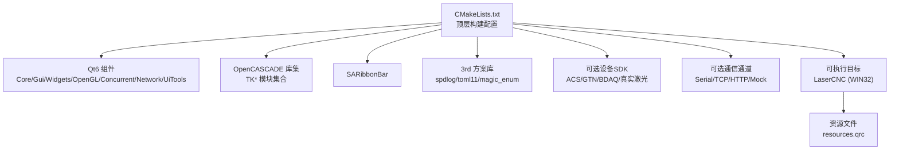
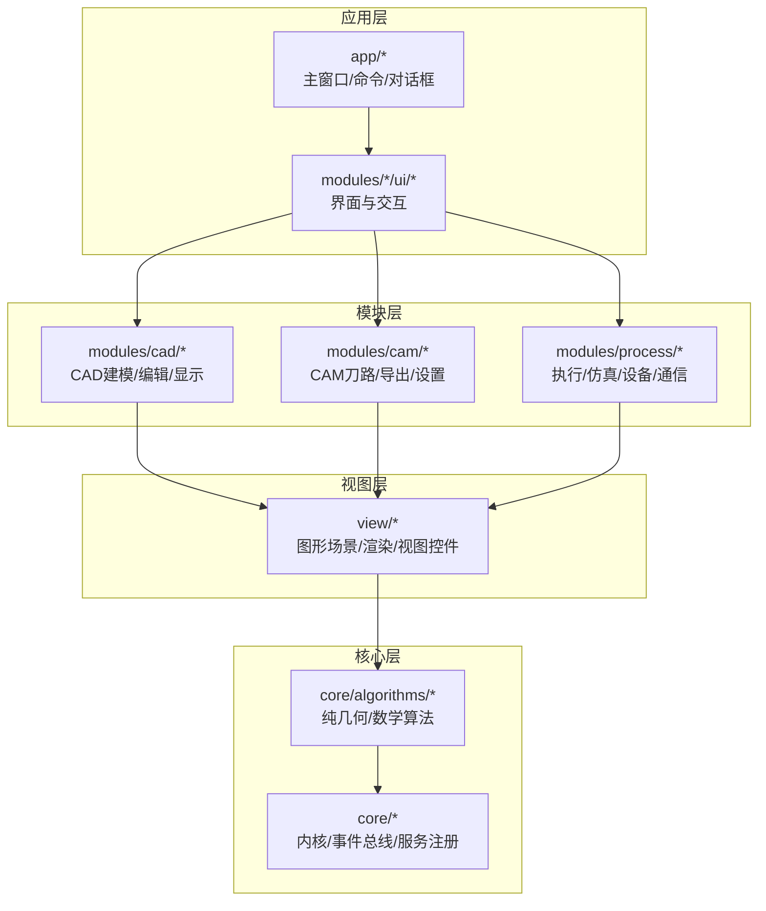
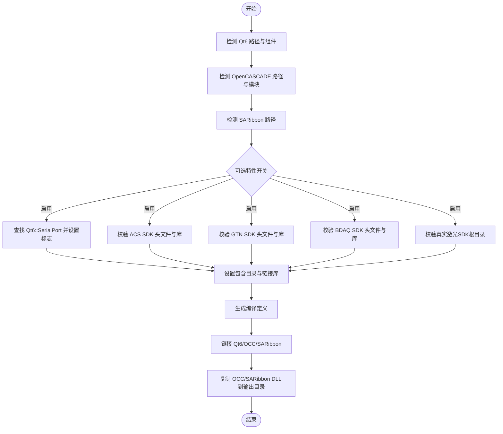
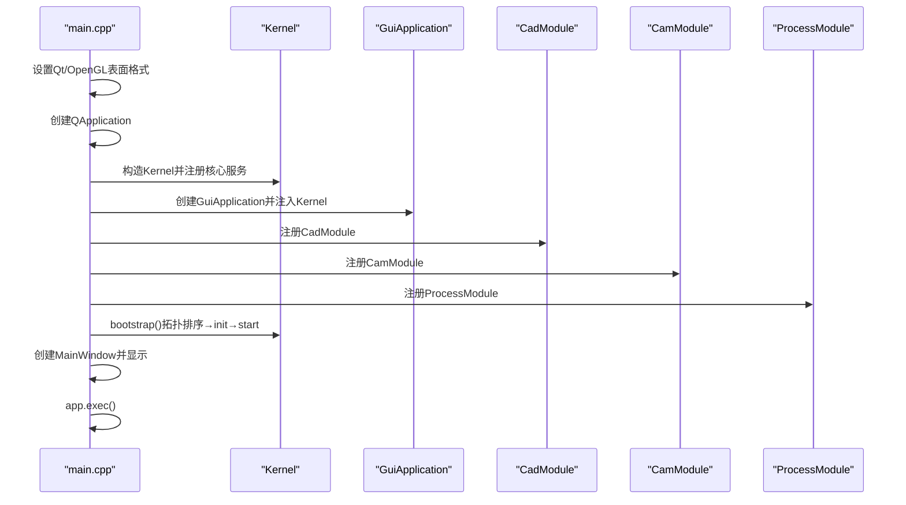
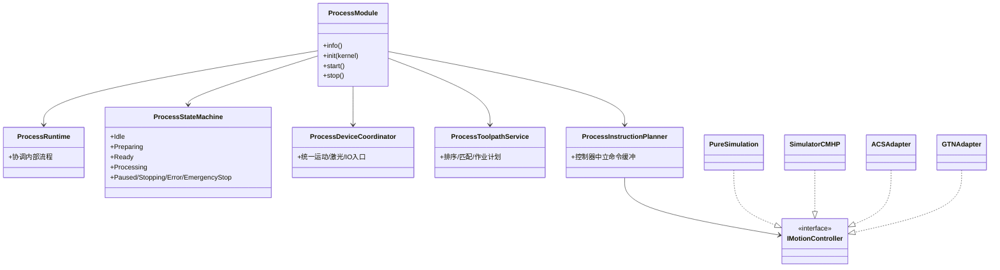
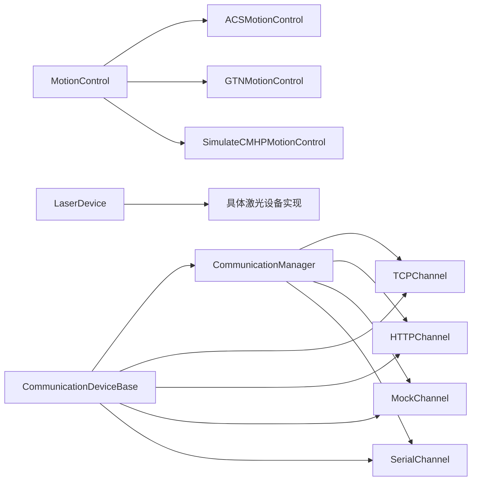

# 开发环境

<cite>
**本文引用的文件**
- [CMakeLists.txt](file://CMakeLists.txt)
- [CLAUDE.md](file://CLAUDE.md)
- [todo.md](file://todo.md)
- [代码规范.md](file://代码规范.md)
- [Readme.md](file://Readme.md)
- [process模块框架.md](file://process模块框架.md)
- [process模块重构计划.md](file://process模块重构计划.md)
- [.gitignore](file://.gitignore)
- [src/main.cpp](file://src/main.cpp)
- [src/app/app_context.h](file://src/app/app_context.h)
- [src/app/app_context.cpp](file://src/app/app_context.cpp)
- [src/core/kernel/kernel.h](file://src/core/kernel/kernel.h)
- [src/core/kernel/kernel.cpp](file://src/core/kernel/kernel.cpp)
- [src/view/gui_application.h](file://src/view/gui_application.h)
- [src/view/gui_application.cpp](file://src/view/gui_application.cpp)
- [src/modules/cad/cad_module.h](file://src/modules/cad/cad_module.h)
- [src/modules/cam/cam_module.h](file://src/modules/cam/cam_module.h)
- [src/modules/process/process_module.h](file://src/modules/process/process_module.h)
- [src/core/settings/app_settings.h](file://src/core/settings/app_settings.h)
- [src/core/settings/app_settings.cpp](file://src/core/settings/app_settings.cpp)
- [src/core/settings/toml_config.h](file://src/core/settings/toml_config.h)
- [src/core/settings/toml_config.cpp](file://src/core/settings/toml_config.cpp)
- [resources/resources.qrc](file://resources/resources.qrc)
- [src/modules/process/communication/communication_manager.h](file://src/modules/process/communication/communication_manager.h)
- [src/modules/process/communication/communication_manager.cpp](file://src/modules/process/communication/communication_manager.cpp)
- [src/modules/process/communication/communication_device_base.h](file://src/modules/process/communication/communication_device_base.h)
- [src/modules/process/communication/communication_device_base.cpp](file://src/modules/process/communication/communication_device_base.cpp)
- [src/modules/process/communication/protocols/tcp_channel.h](file://src/modules/process/communication/protocols/tcp_channel.h)
- [src/modules/process/communication/protocols/tcp_channel.cpp](file://src/modules/process/communication/protocols/tcp_channel.cpp)
- [src/modules/process/communication/protocols/serial_channel.h](file://src/modules/process/communication/protocols/serial_channel.h)
- [src/modules/process/communication/protocols/serial_channel.cpp](file://src/modules/process/communication/protocols/serial_channel.cpp)
- [src/modules/process/communication/protocols/http_channel.h](file://src/modules/process/communication/protocols/http_channel.h)
- [src/modules/process/communication/protocols/http_channel.cpp](file://src/modules/process/communication/protocols/http_channel.cpp)
- [src/modules/process/communication/protocols/mock_channel.h](file://src/modules/process/communication/protocols/mock_channel.h)
- [src/modules/process/communication/protocols/mock_channel.cpp](file://src/modules/process/communication/protocols/mock_channel.cpp)
- [src/modules/process/controllers/acs_motion_controller_adapter.h](file://src/modules/process/controllers/acs_motion_controller_adapter.h)
- [src/modules/process/controllers/acs_motion_controller_adapter.cpp](file://src/modules/process/controllers/acs_motion_controller_adapter.cpp)
- [src/modules/process/controllers/gtn_motion_controller_adapter.h](file://src/modules/process/controllers/gtn_motion_controller_adapter.h)
- [src/modules/process/controllers/gtn_motion_controller_adapter.cpp](file://src/modules/process/controllers/gtn_motion_controller_adapter.cpp)
- [src/modules/process/controllers/simulation_motion_controller.h](file://src/modules/process/controllers/simulation_motion_controller.h)
- [src/modules/process/controllers/simulation_motion_controller.cpp](file://src/modules/process/controllers/simulation_motion_controller.cpp)
- [src/modules/process/device/Laser/LaserDevice.h](file://src/modules/process/device/Laser/LaserDevice.h)
- [src/modules/process/device/Laser/LaserDevice.cpp](file://src/modules/process/device/Laser/LaserDevice.cpp)
- [src/modules/process/device/MotionControl/MotionControl.h](file://src/modules/process/device/MotionControl/MotionControl.h)
- [src/modules/process/device/MotionControl/MotionControl.cpp](file://src/modules/process/device/MotionControl/MotionControl.cpp)
- [src/modules/process/device/MotionControl/ACSMotionControl.h](file://src/modules/process/device/MotionControl/ACSMotionControl.h)
- [src/modules/process/device/MotionControl/ACSMotionControl.cpp](file://src/modules/process/device/MotionControl/ACSMotionControl.cpp)
- [src/modules/process/device/MotionControl/GTNMotionControl.h](file://src/modules/process/device/MotionControl/GTNMotionControl.h)
- [src/modules/process/device/MotionControl/GTNMotionControl.cpp](file://src/modules/process/device/MotionControl/GTNMotionControl.cpp)
- [src/modules/process/device/MotionControl/SimulateCMHPMotionControl.h](file://src/modules/process/device/MotionControl/SimulateCMHPMotionControl.h)
- [src/modules/process/device/MotionControl/SimulateCMHPMotionControl.cpp](file://src/modules/process/device/MotionControl/SimulateCMHPMotionControl.cpp)
- [src/modules/process/instructions/process_instruction_planner.h](file://src/modules/process/instructions/process_instruction_planner.h)
- [src/modules/process/instructions/process_instruction_planner.cpp](file://src/modules/process/instructions/process_instruction_planner.cpp)
- [src/modules/process/instructions/acs_translator.h](file://src/modules/process/instructions/acs_translator.h)
- [src/modules/process/instructions/acs_translator.cpp](file://src/modules/process/instructions/acs_translator.cpp)
- [src/modules/process/instructions/gtn_translator.h](file://src/modules/process/instructions/gtn_translator.h)
- [src/modules/process/instructions/gtn_translator.cpp](file://src/modules/process/instructions/gtn_translator.cpp)
- [src/modules/process/instructions/pure_simulation_translator.h](file://src/modules/process/instructions/pure_simulation_translator.h)
- [src/modules/process/instructions/pure_simulation_translator.cpp](file://src/modules/process/instructions/pure_simulation_translator.cpp)
- [src/modules/process/execution/process_workflow_executor.h](file://src/modules/process/execution/process_workflow_executor.h)
- [src/modules/process/execution/process_workflow_executor.cpp](file://src/modules/process/execution/process_workflow_executor.cpp)
- [src/modules/process/execution/process_execution_service.h](file://src/modules/process/execution/process_execution_service.h)
- [src/modules/process/execution/process_execution_service.cpp](file://src/modules/process/execution/process_execution_service.cpp)
- [src/modules/process/runtime/process_runtime.h](file://src/modules/process/runtime/process_runtime.h)
- [src/modules/process/runtime/process_runtime.cpp](file://src/modules/process/runtime/process_runtime.cpp)
- [src/modules/process/runtime/process_state_machine.h](file://src/modules/process/runtime/process_state_machine.h)
- [src/modules/process/runtime/process_state_machine.cpp](file://src/modules/process/runtime/process_state_machine.cpp)
- [src/modules/process/monitor/process_monitor_service.h](file://src/modules/process/monitor/process_monitor_service.h)
- [src/modules/process/monitor/process_monitor_service.cpp](file://src/modules/process/monitor/process_monitor_service.cpp)
- [src/modules/process/monitor/process_monitor_types.h](file://src/modules/process/monitor/process_monitor_types.h)
- [src/modules/process/monitor/process_monitor_types.cpp](file://src/modules/process/monitor/process_monitor_types.cpp)
- [src/modules/process/toolpath/process_toolpath_sorter.h](file://src/modules/process/toolpath/process_toolpath_sorter.h)
- [src/modules/process/toolpath/process_toolpath_sorter.cpp](file://src/modules/process/toolpath/process_toolpath_sorter.cpp)
- [src/modules/process/toolpath/process_toolpath_service.h](file://src/modules/process/toolpath/process_toolpath_service.h)
- [src/modules/process/toolpath/process_toolpath_service.cpp](file://src/modules/process/toolpath/process_toolpath_service.cpp)
- [src/modules/process/workflow/process_node.h](file://src/modules/process/workflow/process_node.h)
- [src/modules/process/workflow/process_node.cpp](file://src/modules/process/workflow/process_node.cpp)
- [src/modules/process/workflow/process_node_registry.h](file://src/modules/process/workflow/process_node_registry.h)
- [src/modules/process/workflow/process_node_registry.cpp](file://src/modules/process/workflow/process_node_registry.cpp)
- [src/modules/process/workflow/process_flow_document.h](file://src/modules/process/workflow/process_flow_document.h)
- [src/modules/process/workflow/process_flow_document.cpp](file://src/modules/process/workflow/process_flow_document.cpp)
- [src/modules/process/workflow/process_flow_store.h](file://src/modules/process/workflow/process_flow_store.h)
- [src/modules/process/workflow/process_flow_store.cpp](file://src/modules/process/workflow/process_flow_store.cpp)
- [src/modules/process/ui/ribbon_process_tab.h](file://src/modules/process/ui/ribbon_process_tab.h)
- [src/modules/process/ui/ribbon_process_tab.cpp](file://src/modules/process/ui/ribbon_process_tab.cpp)
- [src/modules/process/ui/process_node_edit_dialog.h](file://src/modules/process/ui/process_node_edit_dialog.h)
- [src/modules/process/ui/process_node_edit_dialog.cpp](file://src/modules/process/ui/process_node_edit_dialog.cpp)
- [src/modules/process/ui/process_flow_tree_view.h](file://src/modules/process/ui/process_flow_tree_view.h)
- [src/modules/process/ui/process_flow_tree_view.cpp](file://src/modules/process/ui/process_flow_tree_view.cpp)
- [src/modules/process/ui/process_flow_model.h](file://src/modules/process/ui/process_flow_model.h)
- [src/modules/process/ui/process_flow_model.cpp](file://src/modules/process/ui/process_flow_model.cpp)
- [src/modules/process/ui/widget_laser_control.h](file://src/modules/process/ui/widget_laser_control.h)
- [src/modules/process/ui/widget_laser_control.cpp](file://src/modules/process/ui/widget_laser_control.cpp)
- [src/modules/process/commands/commands_process.h](file://src/modules/process/commands/commands_process.h)
- [src/modules/process/commands/commands_process.cpp](file://src/modules/process/commands/commands_process.cpp)
- [src/modules/process/commands/commands_machine.h](file://src/modules/process/commands/commands_machine.h)
- [src/modules/process/commands/commands_machine.cpp](file://src/modules/process/commands/commands_machine.cpp)
- [src/modules/process/commands/commands_cam.h](file://src/modules/process/commands/commands_cam.h)
- [src/modules/process/commands/commands_cam.cpp](file://src/modules/process/commands/commands_cam.cpp)
- [src/modules/process/commands/commands_cad.h](file://src/modules/process/commands/commands_cad.h)
- [src/modules/process/commands/commands_cad.cpp](file://src/modules/process/commands/commands_cad.cpp)
- [src/modules/process/commands/command_helpers.h](file://src/modules/process/commands/command_helpers.h)
- [src/modules/process/commands/command_helpers.cpp](file://src/modules/process/commands/command_helpers.cpp)
- [src/modules/process/Setting/Settings.h](file://src/modules/process/Setting/Settings.h)
- [src/modules/process/Setting/Settings.cpp](file://src/modules/process/Setting/Settings.cpp)
- [src/modules/process/Setting/qg_dlgsetting.h](file://src/modules/process/Setting/qg_dlgsetting.h)
- [src/modules/process/Setting/qg_dlgsetting.cpp](file://src/modules/process/Setting/qg_dlgsetting.cpp)
- [src/modules/process/Setting/Setting_MotionControl.h](file://src/modules/process/Setting/Setting_MotionControl.h)
- [src/modules/process/Setting/Setting_MotionControl.cpp](file://src/modules/process/Setting/Setting_MotionControl.cpp)
- [src/modules/process/Setting/Setting_Axis.h](file://src/modules/process/Setting/Setting_Axis.h)
- [src/modules/process/Setting/Setting_Axis.cpp](file://src/modules/process/Setting/Setting_Axis.cpp)
- [src/modules/process/Setting/Setting_IOIndex.h](file://src/modules/process/Setting/Setting_IOIndex.h)
- [src/modules/process/Setting/Setting_IOIndex.cpp](file://src/modules/process/Setting/Setting_IOIndex.cpp)
- [src/modules/process/Setting/Setting_Digital.h](file://src/modules/process/Setting/Setting_Digital.h)
- [src/modules/process/Setting/Setting_Digital.cpp](file://src/modules/process/Setting/Setting_Digital.cpp)
- [src/modules/process/Setting/Setting_Analog.h](file://src/modules/process/Setting/Setting_Analog.h)
- [src/modules/process/Setting/Setting_Analog.cpp](file://src/modules/process/Setting/Setting_Analog.cpp)
- [src/modules/process/Setting/Setting_Laser.h](file://src/modules/process/Setting/Setting_Laser.h)
- [src/modules/process/Setting/Setting_Laser.cpp](file://src/modules/process/Setting/Setting_Laser.cpp)
- [src/modules/process/Setting/Setting_Internet.h](file://src/modules/process/Setting/Setting_Internet.h)
- [src/modules/process/Setting/Setting_Internet.cpp](file://src/modules/process/Setting/Setting_Internet.cpp)
- [src/modules/process/Setting/Setting_Tool.h](file://src/modules/process/Setting/Setting_Tool.h)
- [src/modules/process/Setting/Setting_Tool.cpp](file://src/modules/process/Setting/Setting_Tool.cpp)
- [src/modules/process/Setting/Setting_Gas.h](file://src/modules/process/Setting/Setting_Gas.h)
- [src/modules/process/Setting/Setting_Gas.cpp](file://src/modules/process/Setting/Setting_Gas.cpp)
- [src/modules/process/Setting/Setting_Water.h](file://src/modules/process/Setting/Setting_Water.h)
- [src/modules/process/Setting/Setting_Water.cpp](file://src/modules/process/Setting/Setting_Water.cpp)
- [src/modules/process/Setting/Setting_Monitor.h](file://src/modules/process/Setting/Setting_Monitor.h)
- [src/modules/process/Setting/Setting_Monitor.cpp](file://src/modules/process/Setting/Setting_Monitor.cpp)
- [src/modules/process/Setting/Setting_LoadingPos.h](file://src/modules/process/Setting/Setting_LoadingPos.h)
- [src/modules/process/Setting/Setting_LoadingPos.cpp](file://src/modules/process/Setting/Setting_LoadingPos.cpp)
- [src/modules/process/Setting/Setting_Camera.h](file://src/modules/process/Setting/Setting_Camera.h)
- [src/modules/process/Setting/Setting_Camera.cpp](file://src/modules/process/Setting/Setting_Camera.cpp)
- [src/modules/process/System/Service.h](file://src/modules/process/System/Service.h)
- [src/modules/process/System/Service.cpp](file://src/modules/process/System/Service.cpp)
- [src/modules/process/System/LogModule.h](file://src/modules/process/System/LogModule.h)
- [src/modules/process/System/LogModule.cpp](file://src/modules/process/System/LogModule.cpp)
- [src/modules/process/System/MessageModule.h](file://src/modules/process/System/MessageModule.h)
- [src/modules/process/System/MessageModule.cpp](file://src/modules/process/System/MessageModule.cpp)
- [src/modules/process/System/LicenseModule.h](file://src/modules/process/System/LicenseModule.h)
- [src/modules/process/System/LicenseModule.cpp](file://src/modules/process/System/LicenseModule.cpp)
- [src/modules/process/System/DataType.h](file://src/modules/process/System/DataType.h)
- [src/modules/process/System/Expression.h](file://src/modules/process/System/Expression.h)
- [src/modules/process/System/Expression.cpp](file://src/modules/process/System/Expression.cpp)
- [src/modules/process/System/RegexPatterns.h](file://src/modules/process/System/RegexPatterns.h)
- [src/modules/process/System/MessageCode.h](file://src/modules/process/System/MessageCode.h)
</cite>

## 目录
1. [简介](#简介)
2. [项目结构](#项目结构)
3. [核心组件](#核心组件)
4. [架构总览](#架构总览)
5. [详细组件分析](#详细组件分析)
6. [依赖关系分析](#依赖关系分析)
7. [性能考虑](#性能考虑)
8. [故障排查指南](#故障排查指南)
9. [结论](#结论)
10. [附录](#附录)

## 简介
本开发环境配置文档面向LaserCNC项目的开发者，目标是帮助团队快速搭建一致的开发与调试环境，统一代码风格与构建配置，规范第三方库集成与版本管理策略，并提供团队协作流程与代码审查标准。文档内容基于仓库中的CMake配置、架构说明、代码规范与开发计划等资料整理而成。

## 项目结构
LaserCNC是一个单进程、单工程桌面应用，围绕“微内核 + 三域文档 + 单工作区视图”的架构组织代码。顶层CMake负责配置Qt6、OpenCASCADE、SARibbon等依赖，并根据选项启用/禁用过程模块的设备SDK。资源通过Qt资源系统集中管理，模块化设计将CAD、CAM、Process三大功能域解耦。

图表来源
- [CMakeLists.txt:1-425](file://CMakeLists.txt#L1-L425)
- [resources/resources.qrc](file://resources/resources.qrc)

章节来源
- [CMakeLists.txt:1-425](file://CMakeLists.txt#L1-L425)
- [CLAUDE.md:19-66](file://CLAUDE.md#L19-L66)

## 核心组件
- 构建系统与工具链
  - CMake 3.20+，MSVC 2022 x64，C++17标准
  - 自动MOC/UIC/RCC，UI辅助工具UiTools
  - Qt6、OpenCASCADE、SARibbon路径通过缓存变量配置
  - 可选设备SDK与通信通道按需启用
- 代码规范与风格
  - 文件命名：snake_case；类/结构体：PascalCase；函数：camelCase；成员：m_camelCase；常量：kCamelCase或UPPER_SNAKE_CASE
  - 头文件：#pragma once；优先前置声明；Qt/OCC头尽量放在.cpp
  - include顺序：自身头文件 → core → view → modules → app → 第三方 → 标准库
  - 禁止在头文件使用using namespace
- 日志与错误处理
  - 使用LCNC_*宏进行分级日志；捕获异常必须记录LCNC_ERR；LCNC_CRIT抛出逻辑错误
  - 금지的遗留API：禁止使用projectDocument()/workspaceGuiDocument()/ensureProjectDocument()/sourceDocument()等旧路径
- 模块与生命周期
  - 模块实现IModule接口，依赖顺序：cad → cam → process
  - Kernel作为全局入口，注册核心服务、事件总线、模块注册表等

章节来源
- [CMakeLists.txt:1-425](file://CMakeLists.txt#L1-L425)
- [CLAUDE.md:68-88](file://CLAUDE.md#L68-L88)
- [代码规范.md](file://代码规范.md)

## 架构总览
LaserCNC采用微内核架构，核心层不依赖上层UI与模块，模块间通过门面/服务契约与事件总线交互。Process模块严格与几何类型隔离，仅消费OCC无关的DTO。

图表来源
- [CLAUDE.md:34-48](file://CLAUDE.md#L34-L48)
- [CLAUDE.md:89-102](file://CLAUDE.md#L89-L102)

章节来源
- [CLAUDE.md:19-66](file://CLAUDE.md#L19-L66)
- [CLAUDE.md:34-48](file://CLAUDE.md#L34-L48)

## 详细组件分析

### CMake构建系统与自定义参数
- 必要工具链与标准
  - C++17标准、自动MOC/UIC/UIC搜索路径、RCC
  - MSVC下强制/FIwindows.h以避免WIN32_LEAN_AND_MEAN导致的头冲突
- 关键依赖
  - Qt6：Core/Gui/Widgets/OpenGL/OpenGLWidgets/Concurrent/Network/UiTools
  - OpenCASCADE：TKernel、TKMath、TKGeomBase、TKTopAlgo、TKCAF、TKXCAF等模块
  - SARibbonBar：用于界面装饰
- 可选特性
  - LCNC_WITH_SERIAL_COMM：启用Qt SerialPort通信通道
  - LCNC_WITH_ACS/GTN/BDAQ/REAL_LASER：按需启用设备SDK
- 3rd-party库路径
  - OpenCASCADE第三方库目录（OpenVR、FreeImage、FreeType、TBB、FFmpeg等）
- 编译定义
  - 通过编译定义映射上述开关，供条件编译使用
- 部署与输出
  - 构建后复制OCC与SARibbon运行时DLL至输出目录
  - WIN32可执行文件，设置入口点为mainCRTStartup

图表来源
- [CMakeLists.txt:12-38](file://CMakeLists.txt#L12-L38)
- [CMakeLists.txt:40-79](file://CMakeLists.txt#L40-L79)
- [CMakeLists.txt:285-353](file://CMakeLists.txt#L285-L353)
- [CMakeLists.txt:396-420](file://CMakeLists.txt#L396-L420)

章节来源
- [CMakeLists.txt:1-425](file://CMakeLists.txt#L1-L425)

### IDE推荐配置与调试设置
- 推荐IDE
  - Visual Studio 2022（MSVC 2022 x64）或VS Code+CMake Tools
- CMake缓存变量建议
  - LCNC_QT6_ROOT：指向Qt6安装根目录
  - LCNC_OCCT_ROOT：指向OpenCASCADE安装根目录
  - LCNC_SARIBBON_ROOT：指向SARibbon安装根目录
  - LCNC_WITH_SERIAL_COMM/ACS/GTN/BDAQ/REAL_LASER：按需开启
- 调试建议
  - Debug配置构建，确保符号完整
  - 若出现LNK1168（无法写入LaserCNC.exe），请先结束正在运行的进程
  - 如需串口通信，确保系统已安装Qt SerialPort组件

章节来源
- [CLAUDE.md:5-18](file://CLAUDE.md#L5-L18)
- [CMakeLists.txt:12-28](file://CMakeLists.txt#L12-L28)

### 代码格式化与命名约定
- 命名约定
  - 文件：snake_case.{h,cpp}
  - 类/结构体：PascalCase
  - 函数：camelCase
  - 成员：m_camelCase
  - 常量：kCamelCase或UPPER_SNAKE_CASE
- 头文件与include顺序
  - #pragma once
  - 优先使用前置声明
  - include顺序：自身头文件 → core → view → modules → app → 第三方 → 标准库
- 禁止项
  - 头文件中禁止using namespace
- 日志与错误
  - 使用LCNC_*宏分级日志
  - 捕获异常必须记录LCNC_ERR；LCNC_CRIT抛出逻辑错误
- 禁止的遗留API
  - 禁止使用projectDocument()/workspaceGuiDocument()/ensureProjectDocument()/sourceDocument()

章节来源
- [代码规范.md](file://代码规范.md)
- [CLAUDE.md:68-88](file://CLAUDE.md#L68-L88)

### 第三方库集成与版本管理
- 内置方案库
  - spdlog：日志
  - toml11：配置解析
  - magic_enum：枚举反射
- OpenCASCADE
  - 通过OpenCASCADE_DIR指定cmake目录，自动解析TK*模块
  - OCC第三方库目录包含OpenVR、FreeImage、FreeType、TBB、FFmpeg等
- SARibbonBar
  - 通过SARibbonBar_DIR指定cmake目录
- 设备SDK（可选）
  - ACS：ACSC.h与ACSCL_x64.LIB
  - GTN：gts.h
  - BDAQ：包含目录与库文件
  - 真实激光：SDK根目录
- 版本管理策略
  - 通过CMake缓存变量锁定路径，避免随工作区漂移
  - 建议对3rd目录下的库进行版本化标注与归档，减少工作树噪声

章节来源
- [CMakeLists.txt:30-39](file://CMakeLists.txt#L30-L39)
- [CMakeLists.txt:46-79](file://CMakeLists.txt#L46-L79)
- [CMakeLists.txt:318-332](file://CMakeLists.txt#L318-L332)
- [todo.md:31](file://todo.md#L31)

### 开发工具链与质量检查
- 构建与验证
  - 预提交检查清单：构建通过、层依赖检查、禁止遗留API使用、Process模块无OCC包含
- 性能分析
  - 建议结合项目实际在关键路径增加计时与采样（如刀路规划、指令翻译）
- 代码质量
  - 逐步完善单元测试与集成测试钩子，覆盖核心算法与显示一致性

章节来源
- [CLAUDE.md:111-117](file://CLAUDE.md#L111-L117)
- [todo.md:67-73](file://todo.md#L67-L73)

### 团队协作与代码审查
- 审查重点
  - 框架结构优化、运行稳定性、单项目三域数据边界、唯一workspace view
- 问题优先级与建议
  - P0：已完成的元数据保存修正、重复显示修复
  - P1-P2：继续瘦身LcncDocument、消除遗留API、增强Process模块真实控制器能力
- 下一步规划
  - 阶段1：运行稳定性收口
  - 阶段2：框架结构继续瘦身
  - 阶段3：模块服务化
  - 阶段4：工程包与配置稳定性
  - 阶段5：测试与诊断

章节来源
- [todo.md:17-32](file://todo.md#L17-L32)
- [todo.md:33-85](file://todo.md#L33-L85)

## 依赖关系分析

### 模块生命周期与依赖顺序
- 模块实现IModule接口，依赖顺序：cad → cam → process
- 启动顺序：设置Qt表面格式 → 创建QApplication → 初始化Logger → 构造Kernel → 注入GuiApplication → 添加模块 → bootstrap → MainWindow → 进入事件循环

图表来源
- [CLAUDE.md:50-66](file://CLAUDE.md#L50-L66)
- [src/main.cpp](file://src/main.cpp)

章节来源
- [CLAUDE.md:50-66](file://CLAUDE.md#L50-L66)

### Process模块边界与依赖
- Process模块严禁包含OCC类型，仅消费OCC无关的DTO
- 内部结构：ProcessRuntime、ProcessStateMachine、ProcessDeviceCoordinator、ProcessToolpathService、ProcessInstructionPlanner、ProcessWorkflowService、ProcessExecutionService、ProcessNodeExecutorRegistry
- 控制器适配器：PureSimulation、SimulatorCMHP、ACS、GTN，均通过IMotionController抽象

图表来源
- [CLAUDE.md:89-102](file://CLAUDE.md#L89-L102)
- [src/modules/process/process_module.h](file://src/modules/process/process_module.h)
- [src/modules/process/runtime/process_runtime.h](file://src/modules/process/runtime/process_runtime.h)
- [src/modules/process/runtime/process_state_machine.h](file://src/modules/process/runtime/process_state_machine.h)
- [src/modules/process/execution/process_execution_service.h](file://src/modules/process/execution/process_execution_service.h)
- [src/modules/process/execution/process_workflow_executor.h](file://src/modules/process/execution/process_workflow_executor.h)
- [src/modules/process/instructions/process_instruction_planner.h](file://src/modules/process/instructions/process_instruction_planner.h)
- [src/modules/process/controllers/simulation_motion_controller.h](file://src/modules/process/controllers/simulation_motion_controller.h)
- [src/modules/process/controllers/acs_motion_controller_adapter.h](file://src/modules/process/controllers/acs_motion_controller_adapter.h)
- [src/modules/process/controllers/gtn_motion_controller_adapter.h](file://src/modules/process/controllers/gtn_motion_controller_adapter.h)

章节来源
- [CLAUDE.md:89-102](file://CLAUDE.md#L89-L102)

### 通信与设备适配
- 通信通道
  - TCP、HTTP、Mock、Serial（可选）
- 设备适配
  - 运动控制：ACSMotionControl、GTNMotionControl、SimulateCMHPMotionControl
  - 激光设备：多种厂商适配工厂与设备基类
- 系统模块
  - Service/LogModule/MessageModule/LicenseModule/DataType/Expression/RegexPatterns/MessageCode

图表来源
- [src/modules/process/communication/communication_manager.h](file://src/modules/process/communication/communication_manager.h)
- [src/modules/process/communication/protocols/tcp_channel.h](file://src/modules/process/communication/protocols/tcp_channel.h)
- [src/modules/process/communication/protocols/http_channel.h](file://src/modules/process/communication/protocols/http_channel.h)
- [src/modules/process/communication/protocols/mock_channel.h](file://src/modules/process/communication/protocols/mock_channel.h)
- [src/modules/process/communication/protocols/serial_channel.h](file://src/modules/process/communication/protocols/serial_channel.h)
- [src/modules/process/communication/communication_device_base.h](file://src/modules/process/communication/communication_device_base.h)
- [src/modules/process/device/MotionControl/MotionControl.h](file://src/modules/process/device/MotionControl/MotionControl.h)
- [src/modules/process/device/MotionControl/ACSMotionControl.h](file://src/modules/process/device/MotionControl/ACSMotionControl.h)
- [src/modules/process/device/MotionControl/GTNMotionControl.h](file://src/modules/process/device/MotionControl/GTNMotionControl.h)
- [src/modules/process/device/MotionControl/SimulateCMHPMotionControl.h](file://src/modules/process/device/MotionControl/SimulateCMHPMotionControl.h)
- [src/modules/process/device/Laser/LaserDevice.h](file://src/modules/process/device/Laser/LaserDevice.h)

章节来源
- [src/modules/process/communication/communication_manager.h](file://src/modules/process/communication/communication_manager.h)
- [src/modules/process/communication/communication_device_base.h](file://src/modules/process/communication/communication_device_base.h)
- [src/modules/process/device/MotionControl/MotionControl.h](file://src/modules/process/device/MotionControl/MotionControl.h)
- [src/modules/process/device/Laser/LaserDevice.h](file://src/modules/process/device/Laser/LaserDevice.h)

## 性能考虑
- 构建性能
  - 使用多核并行构建（/m），避免频繁重启导致的LNK1168
- 运行时性能
  - 通过Post-build复制OCC/SARibbon运行时DLL，减少启动时缺失依赖
  - 严格控制Qt/OCC头文件包含位置，减少编译时间
- 算法性能
  - 核心算法位于core/algorithms，避免UI耦合，便于独立优化与测试

章节来源
- [CMakeLists.txt:371-381](file://CMakeLists.txt#L371-L381)
- [CMakeLists.txt:396-420](file://CMakeLists.txt#L396-L420)
- [CLAUDE.md:86-88](file://CLAUDE.md#L86-L88)

## 故障排查指南
- 构建失败
  - LNK1168：确保无LaserCNC.exe进程占用，杀掉后再构建
  - Qt/OpenCASCADE/SARibbon路径错误：检查LCNC_QT6_ROOT/LCNC_OCCT_ROOT/LCNC_SARIBBON_ROOT
  - 串口通信不可用：确认LCNC_WITH_SERIAL_COMM=ON且Qt6::SerialPort可用
- 运行时问题
  - OCC相关崩溃：确认OCC运行时DLL已复制到输出目录
  - 重复显示：遵循三域唯一显示原则，避免ToolpathRenderer重复创建AIS
- 代码违规
  - 违反层依赖：core/view/modules/app之间不得交叉包含
  - 使用遗留API：grep projectDocument/workspaceGuiDocument/ensureProjectDocument/sourceDocument
  - Process模块包含OCC类型：grep TopoDS_/AIS_/gp_/Geom_/BRep_/XCAF

章节来源
- [CLAUDE.md:11-18](file://CLAUDE.md#L11-L18)
- [CLAUDE.md:111-117](file://CLAUDE.md#L111-L117)
- [todo.md:23-31](file://todo.md#L23-L31)

## 结论
通过统一的CMake配置、严格的代码规范与模块边界、清晰的依赖关系与启动流程，LaserCNC能够在Windows平台上稳定构建与运行。建议团队在日常开发中遵循本文档的IDE配置、代码风格、质量检查与审查标准，持续优化模块化结构与测试覆盖，保障项目长期可维护性与扩展性。

## 附录
- 常用CMake选项
  - LCNC_QT6_ROOT：Qt6安装根目录
  - LCNC_OCCT_ROOT：OpenCASCADE安装根目录
  - LCNC_SARIBBON_ROOT：SARibbon安装根目录
  - LCNC_WITH_SERIAL_COMM：启用串口通信
  - LCNC_WITH_ACS/GTN/BDAQ/REAL_LASER：启用相应设备SDK
- 资源与配置
  - Qt资源文件：resources/resources.qrc
  - 应用设置：src/core/settings/app_settings.*
  - TOML配置：src/core/settings/toml_config.*

章节来源
- [CMakeLists.txt:12-49](file://CMakeLists.txt#L12-L49)
- [resources/resources.qrc](file://resources/resources.qrc)
- [src/core/settings/app_settings.h](file://src/core/settings/app_settings.h)
- [src/core/settings/toml_config.h](file://src/core/settings/toml_config.h)