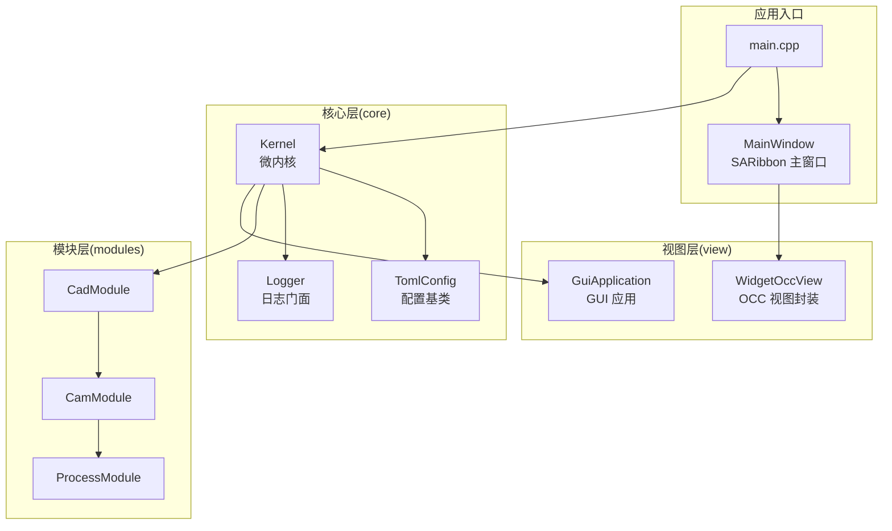
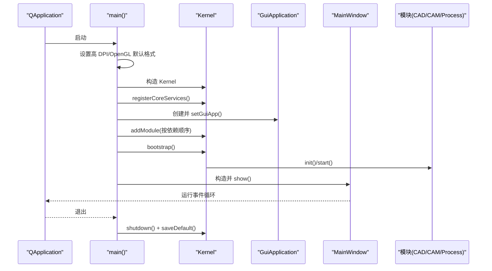
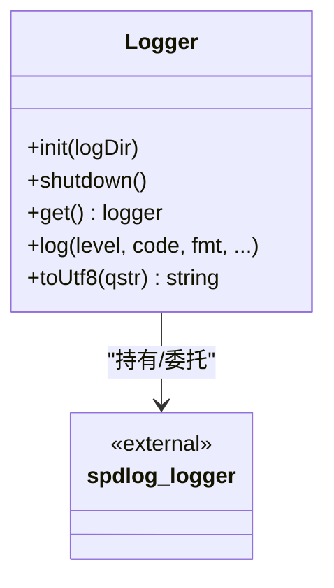
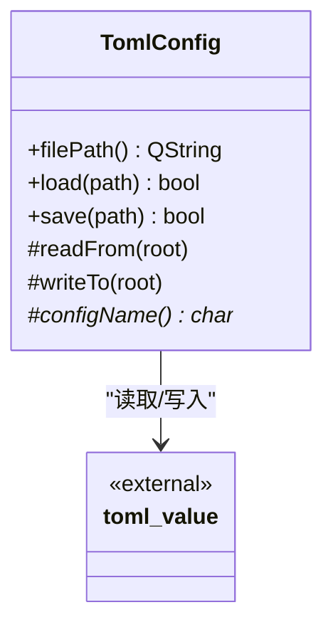
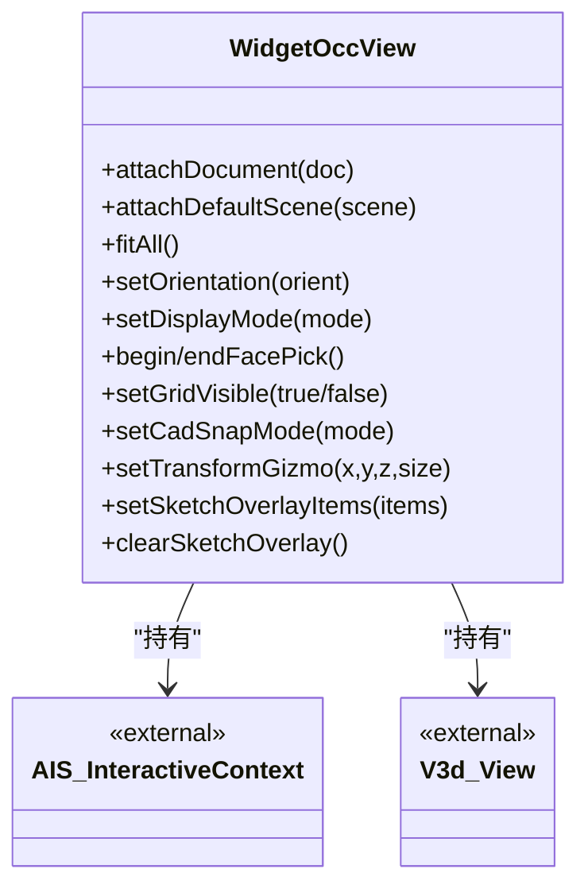
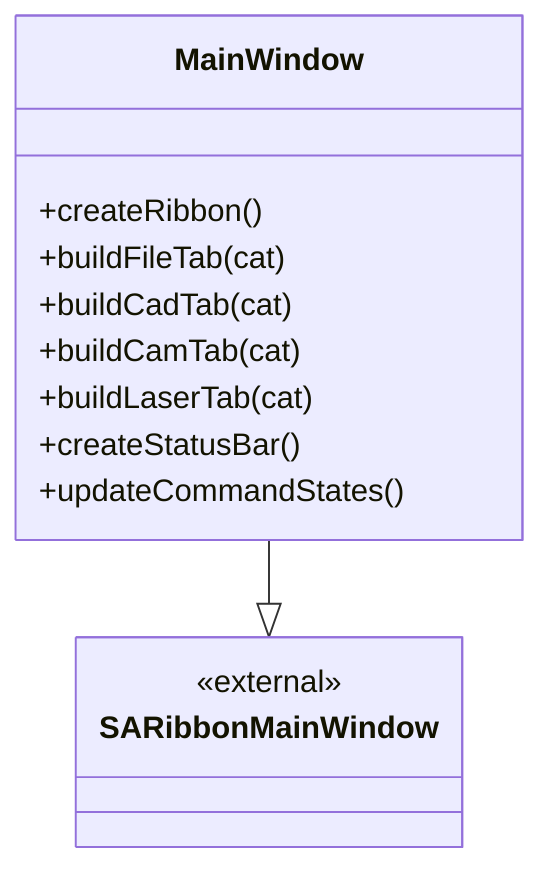
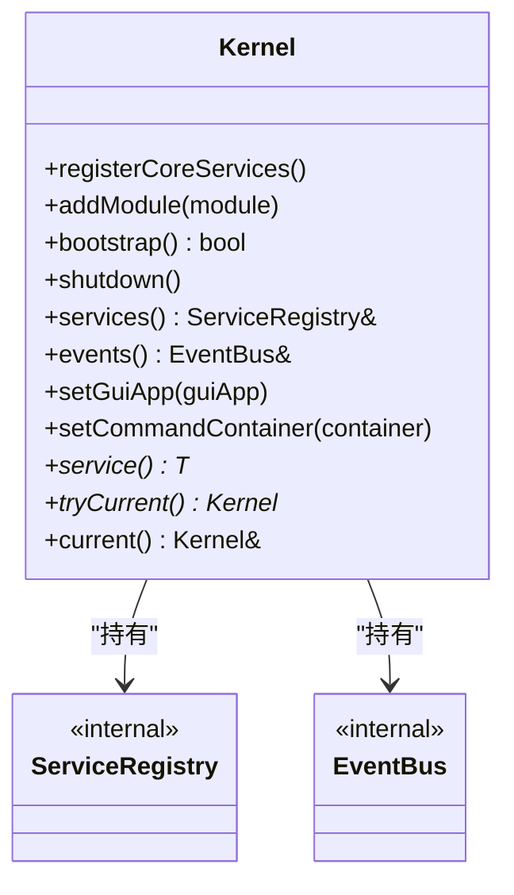
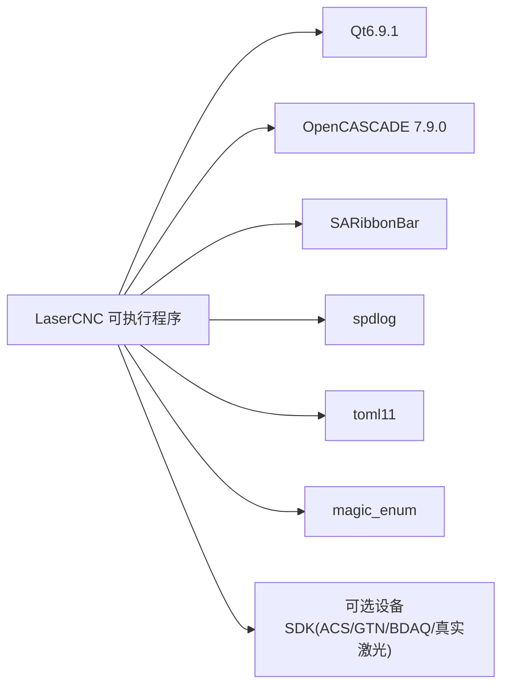

# 技术栈

<cite>
**本文引用的文件**   
- [CMakeLists.txt](file://CMakeLists.txt)
- [main.cpp](file://src/main.cpp)
- [kernel.h](file://src/core/kernel/kernel.h)
- [logger.h](file://src/core/logging/logger.h)
- [toml_config.h](file://src/core/settings/toml_config.h)
- [widget_occ_view.h](file://src/view/widget_occ_view.h)
- [gui_application.cpp](file://src/view/gui_application.cpp)
- [magic_enum.hpp](file://3rd/magic_enum/magic_enum.hpp)
- [mainwindow.h](file://src/app/main_window.h)
- [mainwindow.cpp](file://src/app/main_window.cpp)
- [measure.cpp](file://src/core/algorithms/cad/measure.cpp)
</cite>

## 目录
1. [引言](#引言)
2. [项目结构](#项目结构)
3. [核心组件](#核心组件)
4. [架构总览](#架构总览)
5. [详细组件分析](#详细组件分析)
6. [依赖分析](#依赖分析)
7. [性能考虑](#性能考虑)
8. [故障排查指南](#故障排查指南)
9. [结论](#结论)
10. [附录](#附录)

## 引言
本技术栈文档聚焦 LaserCNC 项目的底层技术选型与集成方式，围绕以下关键点展开：
- 核心技术栈：C++17 标准、Qt 6.9.1、OpenCASCADE 7.9.0、SARibbon 界面库
- 第三方库策略：spdlog 日志、toml11 配置、magic_enum 枚举工具
- 组件协同与依赖管理：微内核 Kernel、日志与配置子系统、图形视图层
- 版本兼容性与编译配置要点：CMake、MSVC、OpenGL 上下文
- 性能考量与最佳实践：渲染管线、多线程、资源部署

## 项目结构
LaserCNC 采用分层+模块化的组织方式：
- 核心层（core）：内核、事件总线、服务注册表、日志、设置、算法、任务、命令
- 视图层（view）：GUI 应用、图形场景、OpenCASCADE 视图封装、渲染管理
- 模块层（modules）：CAD、CAM、Process 三大业务模块及其 UI、服务、工具集
- 应用入口（app）：主窗口、命令容器、上下文、对话框
- 资源与构建（resources、CMakeLists.txt）

图表来源
- [main.cpp:33-135](file://src/main.cpp#L33-L135)
- [kernel.h:37-146](file://src/core/kernel/kernel.h#L37-L146)
- [widget_occ_view.h:37-181](file://src/view/widget_occ_view.h#L37-L181)
- [mainwindow.h:41-68](file://src/app/main_window.h#L41-L68)

章节来源
- [CMakeLists.txt:1-425](file://CMakeLists.txt#L1-L425)
- [main.cpp:33-135](file://src/main.cpp#L33-L135)

## 核心组件
- 微内核 Kernel：负责核心服务注册、模块注册与启动顺序控制，采用拓扑排序确保依赖前置
- 日志系统 Logger：基于 spdlog 的统一门面，支持多 sink、码流日志、宏封装
- 配置系统 TomlConfig：基于 toml11 的配置读写抽象，提供安全的键值回退
- 图形视图 WidgetOccView：封装 OpenCASCADE V3d_View/AIS_InteractiveContext，提供交互与渲染
- SARibbon 主窗口 MainWindow：承载 Ribbon 菜单、面板与状态栏，协调模块 UI

章节来源
- [kernel.h:37-146](file://src/core/kernel/kernel.h#L37-L146)
- [logger.h:25-87](file://src/core/logging/logger.h#L25-L87)
- [toml_config.h:23-95](file://src/core/settings/toml_config.h#L23-L95)
- [widget_occ_view.h:37-181](file://src/view/widget_occ_view.h#L37-L181)
- [mainwindow.h:41-68](file://src/app/main_window.h#L41-L68)

## 架构总览
LaserCNC 的启动流程遵循“Qt 初始化 → Logger 初始化 → Kernel 启动 → 模块装配 → 主窗口展示”的顺序。Kernel 作为唯一允许的进程级全局对象，集中管理核心服务与模块生命周期。

图表来源
- [main.cpp:33-135](file://src/main.cpp#L33-L135)
- [kernel.h:52-88](file://src/core/kernel/kernel.h#L52-L88)

章节来源
- [main.cpp:33-135](file://src/main.cpp#L33-L135)
- [kernel.h:37-146](file://src/core/kernel/kernel.h#L37-L146)

## 详细组件分析

### 组件一：日志系统（Logger + spdlog）
- 设计目标：统一日志门面、多 sink 输出、码流日志、宏封装
- 关键特性：
  - 全局共享 logger 名称为 “lcnc”
  - sink 包括旋转文件、MSVC 调试输出、控制台彩色输出
  - 严重级别阈值默认 warn，便于生产环境控制
  - 提供 LCNC_TRACE/DEBUG/INFO/WARN/ERR/CRIT 宏
- 使用方式：通过 LCNC_* 宏记录带码流的日志，避免直接调用 spdlog

图表来源
- [logger.h:25-87](file://src/core/logging/logger.h#L25-L87)

章节来源
- [logger.h:25-87](file://src/core/logging/logger.h#L25-L87)

### 组件二：配置系统（TomlConfig + toml11）
- 设计目标：以 toml11 为基础，提供统一的配置读写抽象
- 关键特性：
  - 子类仅需实现 readFrom/writeTo，即可完成文件 IO 与错误上报
  - 提供 toml_io 辅助函数，对缺失键/类型不匹配进行安全回退
  - 配合 Logger 输出加载/保存过程中的诊断信息
- 使用方式：继承 TomlConfig，覆盖读写逻辑，通过 load/save 完成持久化

图表来源
- [toml_config.h:23-95](file://src/core/settings/toml_config.h#L23-L95)

章节来源
- [toml_config.h:23-95](file://src/core/settings/toml_config.h#L23-L95)

### 组件三：图形视图（WidgetOccView + OpenCASCADE）
- 设计目标：在 Qt 中托管 OpenCASCADE 3D 视图，支持交互、预览、网格与变换工具
- 关键特性：
  - Mayo 风格的“每文档视图”模式：每个 GuiDocument 拥有独立 V3d_View，切换文档不重建视图
  - 支持左键选择/拖拽多选、右旋/中平移/滚轮缩放、双击拟合、ESC 清空选择
  - 提供草图覆盖层、变换 Gizmo、捕捉模式等建模辅助
- 与 Qt/OpenGL 集成：在 main 中设置 QSurfaceFormat，确保 OCC OpenGL 上下文一致

图表来源
- [widget_occ_view.h:37-181](file://src/view/widget_occ_view.h#L37-L181)

章节来源
- [widget_occ_view.h:37-181](file://src/view/widget_occ_view.h#L37-L181)
- [main.cpp:17-29](file://src/main.cpp#L17-L29)

### 组件四：主窗口与 Ribbon（MainWindow + SARibbon）
- 设计目标：以 SARibbon 为主菜单框架，按模块划分标签页，动态同步右侧面板
- 关键特性：
  - Ribbon 分类页：文件、CAD、CAM、激光加工
  - 视图方向快速动作、显示模式切换、世界坐标轴开关
  - 状态栏显示文档名、坐标、模块状态消息
- 与模块协作：通过 CommandContainer 查找并绑定命令动作

图表来源
- [mainwindow.h:41-68](file://src/app/main_window.h#L41-L68)
- [mainwindow.cpp:1148-1229](file://src/app/main_window.cpp#L1148-L1229)

章节来源
- [mainwindow.h:41-68](file://src/app/main_window.h#L41-L68)
- [mainwindow.cpp:1148-1229](file://src/app/main_window.cpp#L1148-L1229)

### 组件五：微内核（Kernel）
- 设计目标：替代传统全局单例，提供模块化、可裁剪、可替换的内核
- 关键特性：
  - 唯一允许的进程级全局对象，生命周期与 QApplication 对齐
  - 注册核心服务（日志、设置、任务、文档、命令容器）
  - 模块注册与启动：拓扑排序保证依赖前置
  - 运行期通过 ServiceRegistry 获取服务，避免反向依赖

图表来源
- [kernel.h:37-146](file://src/core/kernel/kernel.h#L37-L146)

章节来源
- [kernel.h:37-146](file://src/core/kernel/kernel.h#L37-L146)

### 组件六：第三方库与工具
- magic_enum：提供编译期枚举反射能力，支持名称、索引、范围等查询，降低手写映射成本
- toml11：轻量、头文件为主的 TOML 解析库，配合 TomlConfig 提供安全的配置读写
- spdlog：高性能异步日志，支持多 sink、格式化、条件日志级别

章节来源
- [magic_enum.hpp:95-1364](file://3rd/magic_enum/magic_enum.hpp#L95-L1364)
- [toml_config.h:4-4](file://src/core/settings/toml_config.h#L4-L4)
- [logger.h:11-11](file://src/core/logging/logger.h#L11-L11)

## 依赖分析
- 构建系统（CMake）：
  - Qt6.9.1：Core/Gui/Widgets/OpenGL/OpenGLWidgets/Concurrent/Network/UiTools
  - OpenCASCADE 7.9.0：TKernel/TKBRep/TOPAlgo 等核心模块
  - SARibbonBar：Ribbon 界面库
  - 可选设备 SDK：ACS/GTN/BDAQ/真实激光适配器（通过选项开关）
  - 第三方库目录：OpenCASCADE 3rd-party（OpenVR、FreeImage、FreeType、TBB、Draco、FFmpeg 等）
- 运行时部署：CMake 在构建后复制 OCC 与 SARibbon 的运行时 DLL 到输出目录

图表来源
- [CMakeLists.txt:13-39](file://CMakeLists.txt#L13-L39)
- [CMakeLists.txt:302-345](file://CMakeLists.txt#L302-L345)
- [CMakeLists.txt:396-420](file://CMakeLists.txt#L396-L420)

章节来源
- [CMakeLists.txt:13-39](file://CMakeLists.txt#L13-L39)
- [CMakeLists.txt:302-345](file://CMakeLists.txt#L302-L345)
- [CMakeLists.txt:396-420](file://CMakeLists.txt#L396-L420)

## 性能考虑
- 渲染与 OpenGL
  - 在 main 中固定 QSurfaceFormat，确保 Qt/OpenGL 与 OCC 的上下文一致，避免切换开销
  - WidgetOccView 与 GraphicsScene 协作，尽量使用 AIS_InteractiveContext 的默认显示模式，减少强制刷新
  - 若检测到 VBO 未启用，日志会给出警告，提示可能回退到客户端数组
- 日志与配置
  - Logger 使用条件日志级别，避免不必要的格式化开销
  - TomlConfig 的 toml_io 辅助函数对缺失键/类型不匹配进行安全回退，减少异常路径
- 多线程与异步
  - Qt 的并发组件可用于后台任务与网络通信（如 Process 模块的通信通道）
  - spdlog 支持异步日志，适合高频日志场景
- 编译与链接
  - MSVC 下启用 /FS 串行化 PDB 写入，避免并行编译冲突
  - 通过 CMake 自动化部署 OCC/SARibbon 运行时 DLL，减少运行时缺失问题

章节来源
- [main.cpp:17-29](file://src/main.cpp#L17-L29)
- [widget_occ_view.h:37-181](file://src/view/widget_occ_view.h#L37-L181)
- [logger.h:25-87](file://src/core/logging/logger.h#L25-L87)
- [CMakeLists.txt:371-381](file://CMakeLists.txt#L371-L381)

## 故障排查指南
- 启动失败或模块未加载
  - 检查 Kernel::bootstrap() 返回值与日志输出，确认模块依赖是否被禁用或配置错误
  - 确认 MainWindow.toml 中模块禁用列表不会导致上游模块被连带跳过
- OpenGL 上下文问题
  - 确认 QSurfaceFormat 已在 QApplication 创建前设置
  - 若日志提示 VBO 未激活，检查驱动与硬件兼容性
- 配置文件异常
  - toml11 解析错误时，检查配置文件语法与键名拼写；使用 toml_io 的回退行为避免崩溃
- 设备适配器不可用
  - 若启用 LCNC_WITH_SERIAL_COMM/ACS/GTN/BDAQ/真实激光，需确保对应 SDK 头文件与库存在
  - CMake 中会校验路径存在性，不存在则报错并终止配置

章节来源
- [main.cpp:68-114](file://src/main.cpp#L68-L114)
- [view/graphics_scene.cpp:162-174](file://src/view/graphics_scene.cpp#L162-L174)
- [toml_config.h:31-38](file://src/core/settings/toml_config.h#L31-L38)
- [CMakeLists.txt:59-80](file://CMakeLists.txt#L59-L80)

## 结论
LaserCNC 的技术栈以 Qt6 + OpenCASCADE 为核心，结合 SARibbon 提供现代化界面，并通过 spdlog、toml11、magic_enum 等第三方库完善日志、配置与工具链。微内核 Kernel 将核心服务与模块解耦，既满足功能扩展，又保持清晰的依赖关系。CMake 管理复杂依赖与运行时部署，确保跨平台一致性。建议在开发中遵循统一的日志与配置抽象，合理利用枚举反射与异步日志，持续优化渲染路径与模块加载顺序。

## 附录
- 版本兼容性与编译要点
  - C++17 标准、MSVC（/FS）、Qt 6.9.1、OpenCASCADE 7.9.0、SARibbon
  - OpenGL 上下文需在 QApplication 创建前固定
  - 可选设备 SDK 通过 CMake 选项启用，缺失时会给出明确警告
- 学习路径与最佳实践
  - 先掌握 Qt 信号槽与事件循环，再理解 Kernel 拓扑启动
  - 熟悉 OpenCASCADE 的 AIS_InteractiveContext/V3d_View 生命周期
  - 使用 Logger 宏与日志码流统一输出，避免直接调用 spdlog
  - 通过 TomlConfig 抽象管理配置，使用 toml_io 安全读取
  - 利用 magic_enum 简化枚举到字符串/索引的映射，提升可维护性