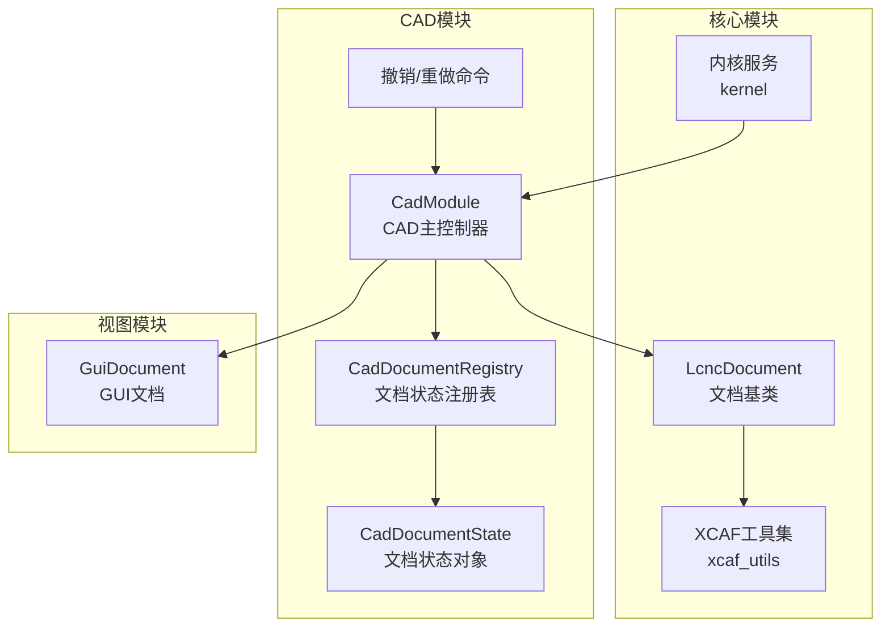
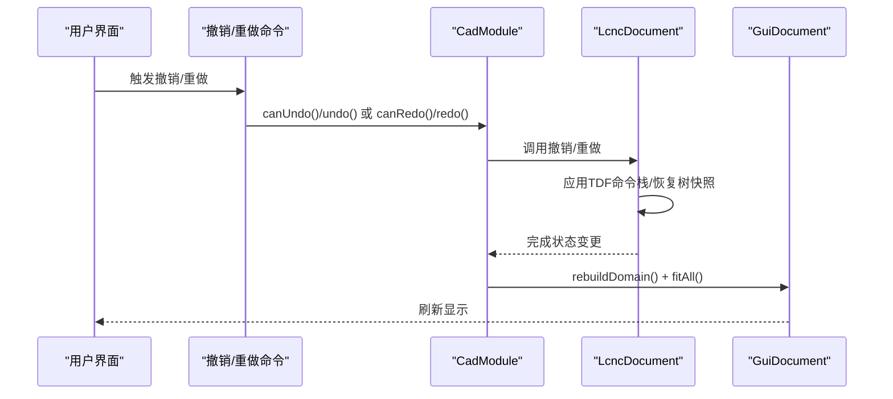
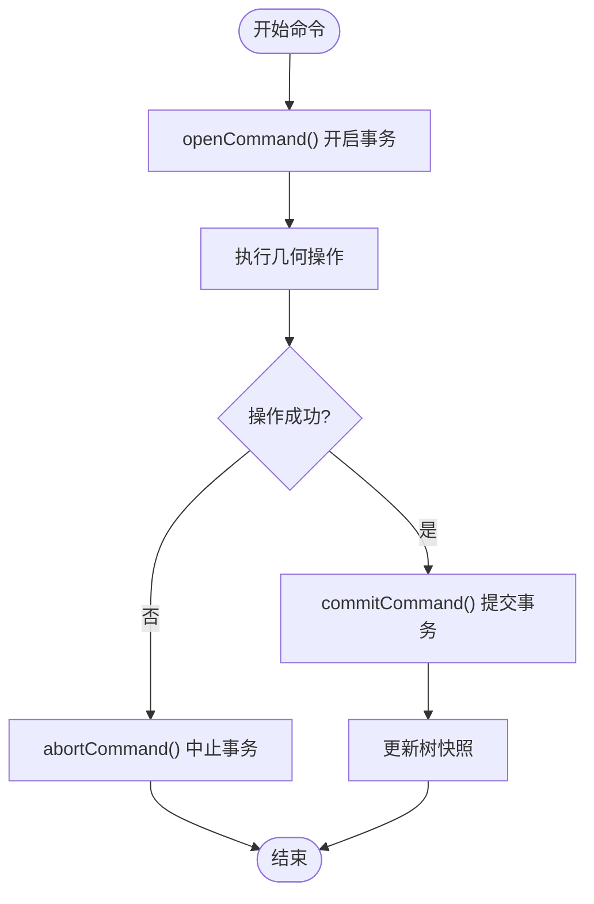
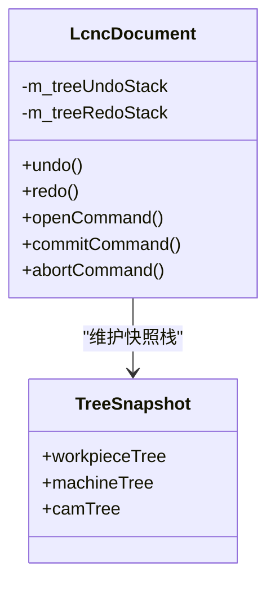
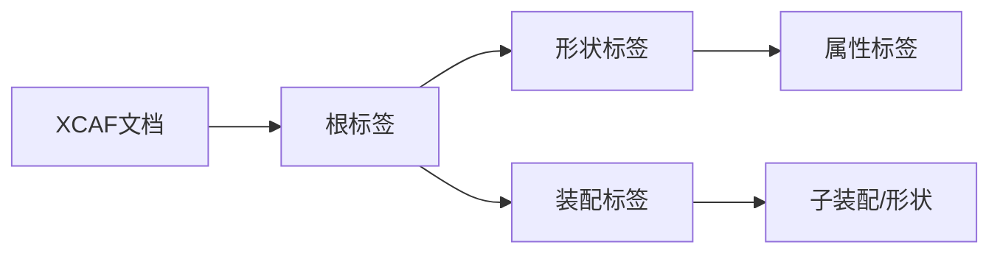
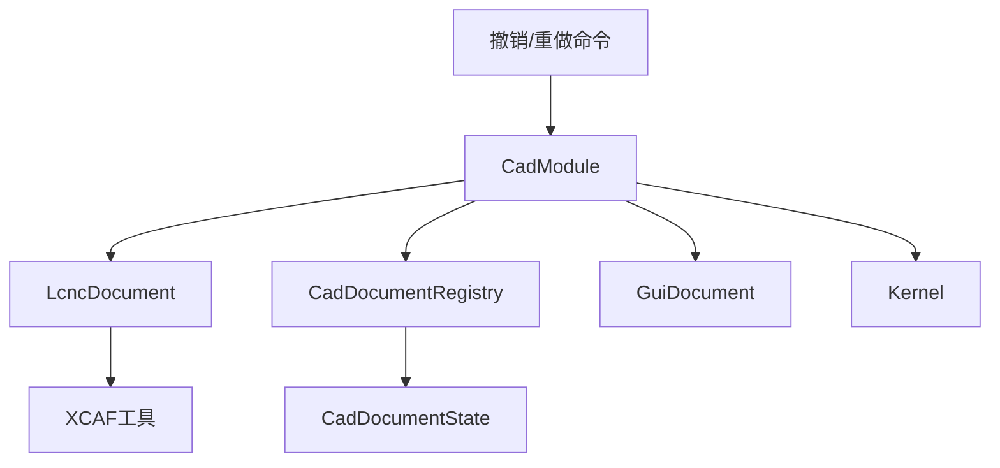

# CAD文档状态管理

<cite>
**本文档引用的文件**
- [src/core/document/lcnc_document.h](file://src/core/document/lcnc_document.h)
- [src/core/document/lcnc_document.cpp](file://src/core/document/lcnc_document.cpp)
- [src/core/document/xcaf_utils.h](file://src/core/document/xcaf_utils.h)
- [src/core/document/xcaf_utils.cpp](file://src/core/document/xcaf_utils.cpp)
- [src/modules/cad/document/cad_document_registry.h](file://src/modules/cad/document/cad_document_registry.h)
- [src/modules/cad/document/cad_document_registry.cpp](file://src/modules/cad/document/cad_document_registry.cpp)
- [src/modules/cad/document/cad_document_state.h](file://src/modules/cad/document/cad_document_state.h)
- [src/modules/cad/document/cad_document_state.cpp](file://src/modules/cad/document/cad_document_state.cpp)
- [src/modules/cad/cad_module.h](file://src/modules/cad/cad_module.h)
- [src/modules/cad/cad_module.cpp](file://src/modules/cad/cad_module.cpp)
- [src/modules/cad/commands/commands_edit.h](file://src/modules/cad/commands/commands_edit.h)
- [src/modules/cad/commands/commands_edit.cpp](file://src/modules/cad/commands/commands_edit.cpp)
- [src/view/gui_document.h](file://src/view/gui_document.h)
- [src/view/gui_document.cpp](file://src/view/gui_document.cpp)
- [src/core/kernel/kernel.h](file://src/core/kernel/kernel.h)
- [src/core/kernel/kernel.cpp](file://src/core/kernel/kernel.cpp)
</cite>

## 目录
1. [引言](#引言)
2. [项目结构](#项目结构)
3. [核心组件](#核心组件)
4. [架构总览](#架构总览)
5. [详细组件分析](#详细组件分析)
6. [依赖关系分析](#依赖关系分析)
7. [性能考虑](#性能考虑)
8. [故障排除指南](#故障排除指南)
9. [结论](#结论)

## 引言
本文件面向LaserCNC的CAD文档状态管理系统，系统基于OpenCASCADE的XCAF框架，围绕文档生命周期（创建、修改、撤销、重做）、版本控制与增量更新、XCAF文档结构与属性管理、序列化与反序列化机制以及状态一致性与并发控制进行深入技术说明。目标是帮助开发者与维护者全面理解CAD文档状态管理的设计与实现，并为后续扩展与优化提供依据。

## 项目结构
LaserCNC采用模块化微内核架构，CAD模块负责文档状态管理与建模操作，核心模块提供文档基类与XCAF工具，视图模块负责GUI渲染与显示刷新，命令模块提供撤销/重做等编辑命令入口。

**图表来源**
- [src/modules/cad/cad_module.h:264-288](file://src/modules/cad/cad_module.h#L264-L288)
- [src/core/document/lcnc_document.h:64-157](file://src/core/document/lcnc_document.h#L64-L157)
- [src/core/document/xcaf_utils.h](file://src/core/document/xcaf_utils.h)
- [src/modules/cad/document/cad_document_registry.h:11-35](file://src/modules/cad/document/cad_document_registry.h#L11-L35)
- [src/modules/cad/document/cad_document_state.h:5-11](file://src/modules/cad/document/cad_document_state.h#L5-L11)
- [src/view/gui_document.h:34-120](file://src/view/gui_document.h#L34-L120)
- [src/core/kernel/kernel.h](file://src/core/kernel/kernel.h)

**章节来源**
- [src/modules/cad/cad_module.h:264-288](file://src/modules/cad/cad_module.h#L264-L288)
- [src/core/document/lcnc_document.h:64-157](file://src/core/document/lcnc_document.h#L64-L157)
- [src/core/document/xcaf_utils.h](file://src/core/document/xcaf_utils.h)
- [src/modules/cad/document/cad_document_registry.h:11-35](file://src/modules/cad/document/cad_document_registry.h#L11-L35)
- [src/modules/cad/document/cad_document_state.h:5-11](file://src/modules/cad/document/cad_document_state.h#L5-L11)
- [src/view/gui_document.h:34-120](file://src/view/gui_document.h#L34-L120)
- [src/core/kernel/kernel.h](file://src/core/kernel/kernel.h)

## 核心组件
- 文档基类：LcncDocument继承自OpenCASCADE的TDocStd_Document，提供撤销/重做、命令事务、树快照与几何实体管理能力。
- 文档状态注册表：CadDocumentRegistry按文档ID管理每个CAD文档的状态对象，支持创建、查询与清理。
- 文档状态对象：CadDocumentState封装选择上下文、草图管理器等文档级状态。
- CAD主控制器：CadModule协调文档操作、撤销/重做、显示刷新与命令分发。
- GUI文档：GuiDocument负责视图重建、域切换与全视角适配。
- XCAF工具：xcaf_utils提供标签与条目字符串互转、标签序列遍历等实用功能。
- 内核服务：Kernel提供全局服务注册与跨模块通信。

**章节来源**
- [src/core/document/lcnc_document.h:64-157](file://src/core/document/lcnc_document.h#L64-L157)
- [src/modules/cad/document/cad_document_registry.h:11-35](file://src/modules/cad/document/cad_document_registry.h#L11-L35)
- [src/modules/cad/document/cad_document_state.h:5-11](file://src/modules/cad/document/cad_document_state.h#L5-L11)
- [src/modules/cad/cad_module.h:264-288](file://src/modules/cad/cad_module.h#L264-L288)
- [src/view/gui_document.h:34-120](file://src/view/gui_document.h#L34-L120)
- [src/core/document/xcaf_utils.h](file://src/core/document/xcaf_utils.h)

## 架构总览
CAD文档状态管理以“文档基类 + 状态注册表 + 主控制器 + 视图刷新”的分层架构运行。撤销/重做通过OpenCASCADE的TDF（Transaction Data Framework）命令栈与自定义树快照栈协同工作，确保几何树与图形树在回退时保持一致。

**图表来源**
- [src/modules/cad/commands/commands_edit.cpp:25-49](file://src/modules/cad/commands/commands_edit.cpp#L25-L49)
- [src/modules/cad/cad_module.cpp:1900-1943](file://src/modules/cad/cad_module.cpp#L1900-L1943)
- [src/core/document/lcnc_document.cpp](file://src/core/document/lcnc_document.cpp)

**章节来源**
- [src/modules/cad/commands/commands_edit.cpp:25-49](file://src/modules/cad/commands/commands_edit.cpp#L25-L49)
- [src/modules/cad/cad_module.cpp:1900-1943](file://src/modules/cad/cad_module.cpp#L1900-L1943)

## 详细组件分析

### 文档生命周期与命令事务
- 命令开启/提交/中止：通过openCommand/commitCommand/abortCommand形成事务边界，确保批量操作的原子性。
- 撤销/重做：基于OpenCASCADE TDF命令栈，支持多级撤销与重做；同时维护树快照栈以同步内存中的Qt树结构。
- 几何实体管理：提供实体增删改查接口，支持从XCAF标签到条目的映射与层次树构建。

**图表来源**
- [src/core/document/lcnc_document.h:73-82](file://src/core/document/lcnc_document.h#L73-L82)
- [src/core/document/lcnc_document.cpp](file://src/core/document/lcnc_document.cpp)

**章节来源**
- [src/core/document/lcnc_document.h:73-82](file://src/core/document/lcnc_document.h#L73-L82)
- [src/core/document/lcnc_document.cpp](file://src/core/document/lcnc_document.cpp)

### 版本控制与增量更新策略
- 树快照机制：在每次命令开始时保存工作台树、机床树与CAM树的快照，撤销/重做时恢复至对应快照，避免丢失虚拟组层级。
- 增量更新：撤销/重做时仅恢复必要的树节点与属性，减少全量重建开销；GUI通过rebuildDomain与fitAll进行局部刷新。
- 大型几何模型优化：通过XCAF的延迟加载与增量写入策略，结合树快照减少内存占用与IO压力。

**图表来源**
- [src/core/document/lcnc_document.h:145-155](file://src/core/document/lcnc_document.h#L145-L155)

**章节来源**
- [src/core/document/lcnc_document.h:145-155](file://src/core/document/lcnc_document.h#L145-L155)

### XCAF应用与属性管理
- 文档结构：XCAF作为统一的装配/几何/属性容器，支持多层级装配与共享拓扑。
- 标签系统：通过TDF_Label标识实体，配合XCAF工具实现标签与条目字符串互转。
- 属性管理：支持为形状附加材料、颜色、纹理等属性，便于后续CAM处理与渲染。

**图表来源**
- [src/core/document/xcaf_utils.h](file://src/core/document/xcaf_utils.h)
- [src/core/document/xcaf_utils.cpp](file://src/core/document/xcaf_utils.cpp)

**章节来源**
- [src/core/document/xcaf_utils.h](file://src/core/document/xcaf_utils.h)
- [src/core/document/xcaf_utils.cpp](file://src/core/document/xcaf_utils.cpp)

### 序列化与反序列化机制
- 几何数据持久化：利用OpenCASCADE的TDocStd_Document序列化能力，将XCAF文档树与属性写入文件，支持增量保存与快速加载。
- 加载优化：按需加载装配层级与几何细节，避免一次性加载全部大模型导致内存峰值过高。
- 版本兼容：通过版本号与字段迁移策略，保证不同版本间的文档可读性与向后兼容。

[本节为概念性说明，不直接分析具体源码文件]

### 并发访问控制与状态一致性
- 线程安全：文档操作通过CadModule集中调度，避免多线程直接操作XCAF文档树。
- 事务隔离：命令事务确保中间态不会被其他操作观察到，保证一致性。
- 状态同步：撤销/重做后通过GuiDocument重建域树并触发全视角适配，确保UI与数据一致。

**章节来源**
- [src/modules/cad/cad_module.cpp:1930-1943](file://src/modules/cad/cad_module.cpp#L1930-L1943)
- [src/view/gui_document.cpp](file://src/view/gui_document.cpp)

## 依赖关系分析

**图表来源**
- [src/modules/cad/cad_module.h:264-288](file://src/modules/cad/cad_module.h#L264-L288)
- [src/modules/cad/document/cad_document_registry.h:11-35](file://src/modules/cad/document/cad_document_registry.h#L11-L35)
- [src/modules/cad/document/cad_document_state.h:5-11](file://src/modules/cad/document/cad_document_state.h#L5-L11)
- [src/core/document/lcnc_document.h:64-157](file://src/core/document/lcnc_document.h#L64-L157)
- [src/core/document/xcaf_utils.h](file://src/core/document/xcaf_utils.h)
- [src/view/gui_document.h:34-120](file://src/view/gui_document.h#L34-L120)
- [src/core/kernel/kernel.h](file://src/core/kernel/kernel.h)

**章节来源**
- [src/modules/cad/cad_module.h:264-288](file://src/modules/cad/cad_module.h#L264-L288)
- [src/modules/cad/document/cad_document_registry.h:11-35](file://src/modules/cad/document/cad_document_registry.h#L11-L35)
- [src/modules/cad/document/cad_document_state.h:5-11](file://src/modules/cad/document/cad_document_state.h#L5-L11)
- [src/core/document/lcnc_document.h:64-157](file://src/core/document/lcnc_document.h#L64-L157)
- [src/core/document/xcaf_utils.h](file://src/core/document/xcaf_utils.h)
- [src/view/gui_document.h:34-120](file://src/view/gui_document.h#L34-L120)
- [src/core/kernel/kernel.h](file://src/core/kernel/kernel.h)

## 性能考虑
- 大模型优化：采用XCAF的延迟加载与增量写入，避免一次性加载全部几何数据；撤销/重做时仅恢复必要节点。
- 显示刷新：通过rebuildDomain与fitAll进行局部刷新，减少全量重绘成本。
- 内存管理：树快照栈限制撤销深度，防止内存持续增长；及时清理关闭文档的状态对象。

[本节提供通用指导，不直接分析具体源码文件]

## 故障排除指南
- 撤销/重做不可用：检查当前文档是否处于可撤销/可重做状态，确认命令事务是否正确开启与提交。
- 显示异常：调用refreshDisplay后仍不刷新，检查GuiDocument的域重建与适配逻辑是否正常。
- 文档状态丢失：确认撤销/重做过程中树快照是否正确保存与恢复，避免在命令失败时误提交。

**章节来源**
- [src/modules/cad/cad_module.cpp:1900-1943](file://src/modules/cad/cad_module.cpp#L1900-L1943)
- [src/modules/cad/commands/commands_edit.cpp:20-49](file://src/modules/cad/commands/commands_edit.cpp#L20-L49)

## 结论
LaserCNC的CAD文档状态管理系统以XCAF为核心，结合命令事务与树快照机制，实现了可靠的文档生命周期管理与撤销/重做能力。通过状态注册表与主控制器的分层设计，系统在大型几何模型场景下具备良好的扩展性与性能表现。建议在后续开发中进一步完善版本兼容策略与并发访问控制，以提升系统的稳定性与用户体验。