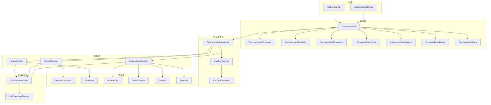
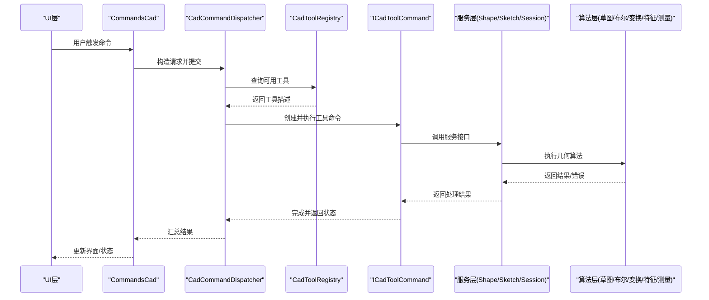
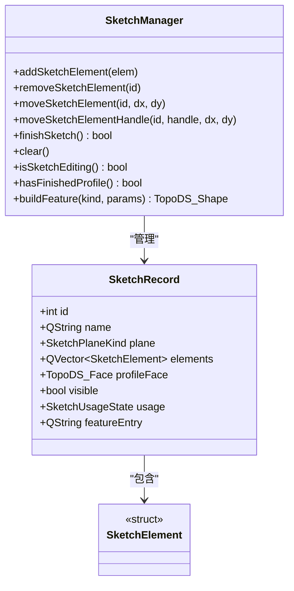
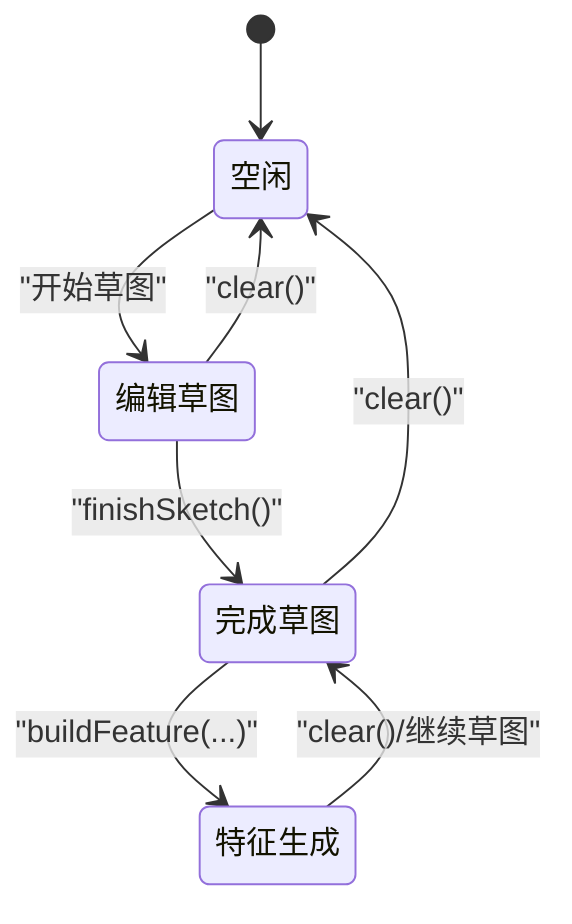
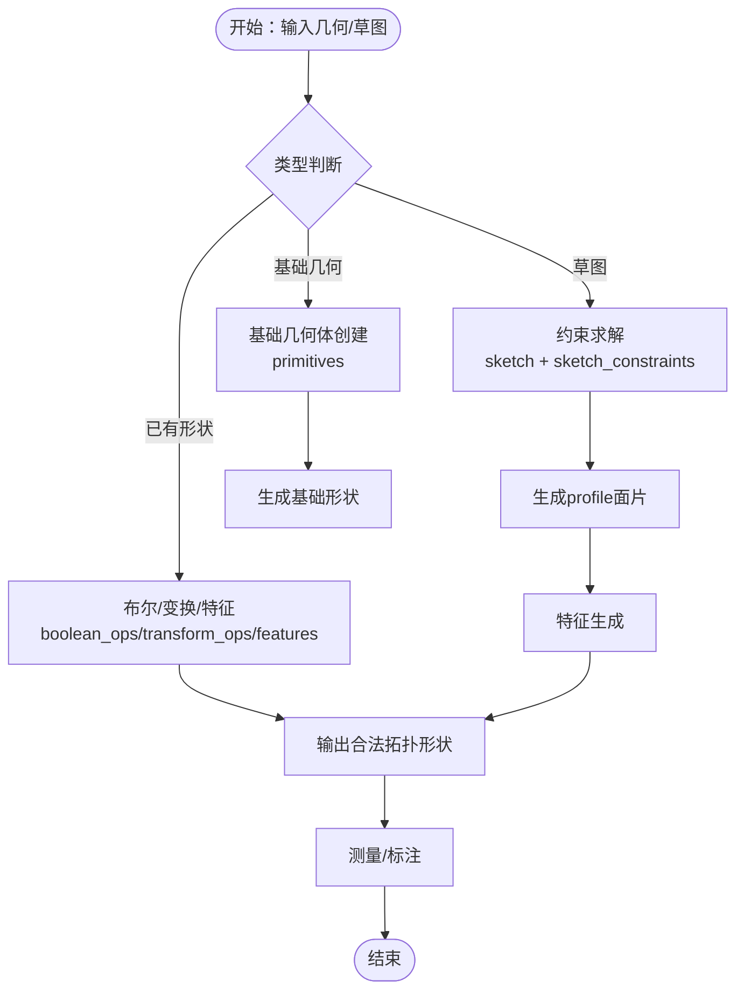
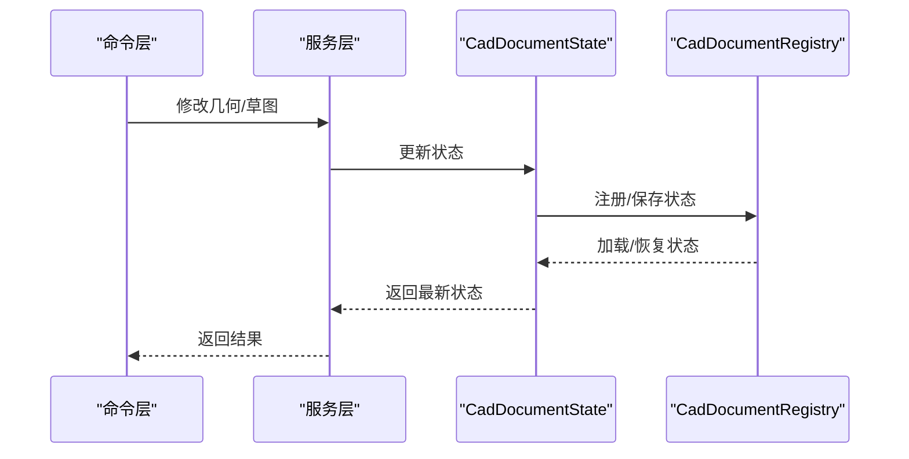
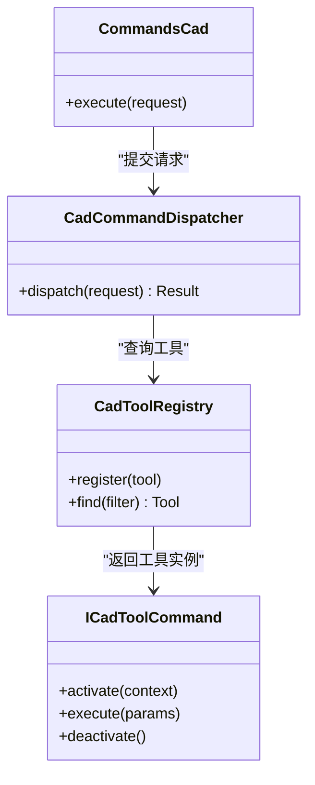
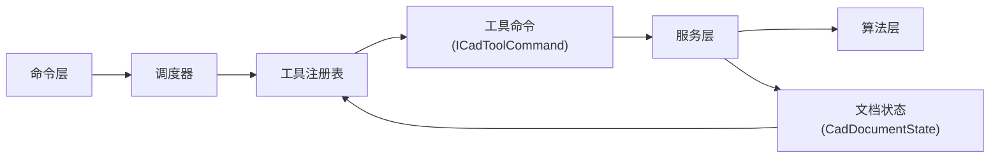

# CAD模块设计

<cite>
**本文引用的文件**
- [i_cad_facade.h](file://src/modules/cad/i_cad_facade.h)
- [cad_module.h](file://src/modules/cad/cad_module.h)
- [cad_modeling_session.h](file://src/modules/cad/services/cad_modeling_session.h)
- [cad_modeling_session.cpp](file://src/modules/cad/services/cad_modeling_session.cpp)
- [shape_service.h](file://src/modules/cad/services/shape_service.h)
- [shape_service.cpp](file://src/modules/cad/services/shape_service.cpp)
- [sketch_manager.h](file://src/modules/cad/services/sketch_manager.h)
- [sketch_manager.cpp](file://src/modules/cad/services/sketch_manager.cpp)
- [sketch_types.h](file://src/modules/cad/services/sketch_types.h)
- [sketch.h](file://src/core/algorithms/cad/sketch.h)
- [sketch.cpp](file://src/core/algorithms/cad/sketch.cpp)
- [sketch_constraints.h](file://src/core/algorithms/cad/sketch_constraints.h)
- [sketch_constraints.cpp](file://src/core/algorithms/cad/sketch_constraints.cpp)
- [primitives.h](file://src/core/algorithms/cad/primitives.h)
- [primitives.cpp](file://src/core/algorithms/cad/primitives.cpp)
- [boolean_ops.h](file://src/core/algorithms/cad/boolean_ops.h)
- [boolean_ops.cpp](file://src/core/algorithms/cad/boolean_ops.cpp)
- [transform_ops.h](file://src/core/algorithms/cad/transform_ops.h)
- [transform_ops.cpp](file://src/core/algorithms/cad/transform_ops.cpp)
- [measure.h](file://src/core/algorithms/cad/measure.h)
- [measure.cpp](file://src/core/algorithms/cad/measure.cpp)
- [features.h](file://src/core/algorithms/cad/features.h)
- [features.cpp](file://src/core/algorithms/cad/features.cpp)
- [cad_document_state.h](file://src/modules/cad/document/cad_document_state.h)
- [cad_document_state.cpp](file://src/modules/cad/document/cad_document_state.cpp)
- [cad_document_registry.h](file://src/modules/cad/document/cad_document_registry.h)
- [cad_document_registry.cpp](file://src/modules/cad/document/cad_document_registry.cpp)
- [cad_selection.h](file://src/modules/cad/selection/cad_selection.h)
- [cad_selection_resolver.h](file://src/modules/cad/selection/cad_selection_resolver.h)
- [cad_selection_resolver.cpp](file://src/modules/cad/selection/cad_selection_resolver.cpp)
- [icad_tool_command.h](file://src/modules/cad/task/icad_tool_command.h)
- [cad_tool_registry.h](file://src/modules/cad/task/cad_tool_registry.h)
- [cad_tool_registry.cpp](file://src/modules/cad/task/cad_tool_registry.cpp)
- [cad_tool_filter.h](file://src/modules/cad/task/cad_tool_filter.h)
- [cad_tool_filter.cpp](file://src/modules/cad/task/cad_tool_filter.cpp)
- [cad_command_dispatcher.h](file://src/modules/cad/task/cad_command_dispatcher.h)
- [cad_command_dispatcher.cpp](file://src/modules/cad/task/cad_command_dispatcher.cpp)
- [commands_cad.h](file://src/modules/cad/commands/commands_cad.h)
- [commands_cad.cpp](file://src/modules/cad/commands/commands_cad.cpp)
- [commands_cad_primitives.h](file://src/modules/cad/commands/commands_cad_primitives.h)
- [commands_cad_primitives.cpp](file://src/modules/cad/commands/commands_cad_primitives.cpp)
- [commands_cad_boolean.h](file://src/modules/cad/commands/commands_cad_boolean.h)
- [commands_cad_boolean.cpp](file://src/modules/cad/commands/commands_cad_boolean.cpp)
- [commands_cad_transform.h](file://src/modules/cad/commands/commands_cad_transform.h)
- [commands_cad_transform.cpp](file://src/modules/cad/commands/commands_cad_transform.cpp)
- [commands_cad_sketch.h](file://src/modules/cad/commands/commands_cad_sketch.h)
- [commands_cad_sketch.cpp](file://src/modules/cad/commands/commands_cad_sketch.cpp)
- [commands_cad_measure.h](file://src/modules/cad/commands/commands_cad_measure.h)
- [commands_cad_measure.cpp](file://src/modules/cad/commands/commands_cad_measure.cpp)
- [commands_cad_delete.h](file://src/modules/cad/commands/commands_cad_delete.h)
- [commands_cad_delete.cpp](file://src/modules/cad/commands/commands_cad_delete.cpp)
- [commands_cad_view.h](file://src/modules/cad/commands/commands_cad_view.h)
- [commands_cad_view.cpp](file://src/modules/cad/commands/commands_cad_view.cpp)
- [widget_cad_task_panel.h](file://src/modules/cad/ui/widget_cad_task_panel.h)
- [widget_cad_task_panel.cpp](file://src/modules/cad/ui/widget_cad_task_panel.cpp)
- [ribbon_cad_tab.h](file://src/modules/cad/ui/ribbon_cad_tab.h)
- [ribbon_cad_tab.cpp](file://src/modules/cad/ui/ribbon_cad_tab.cpp)
- [sketch_serializer.h](file://src/modules/cad/sketch/sketch_serializer.h)
- [sketch_serializer.cpp](file://src/modules/cad/sketch/sketch_serializer.cpp)
</cite>

## 目录
1. [引言](#引言)
2. [项目结构](#项目结构)
3. [核心组件](#核心组件)
4. [架构总览](#架构总览)
5. [详细组件分析](#详细组件分析)
6. [依赖关系分析](#依赖关系分析)
7. [性能考虑](#性能考虑)
8. [故障排查指南](#故障排查指南)
9. [结论](#结论)
10. [附录](#附录)

## 引言
本设计文档面向LaserCNC的CAD模块，系统性阐述其核心职责与实现架构，包括几何建模、草图绘制、布尔运算、变换操作、几何算法实现、文档状态管理与数据流、以及扩展开发指导。重点解析ICadFacade接口设计与对外服务暴露方式，深入说明ShapeService、SketchManager等核心服务的实现原理与协作机制，并给出新几何算法与工具命令的扩展方法。

## 项目结构
CAD模块位于src/modules/cad目录下，采用“功能域+层次化”的组织方式：
- 服务层：ShapeService、SketchManager、CadModelingSession等，负责几何建模与草图管理。
- 算法层：位于src/core/algorithms/cad，包含草图求解、布尔运算、变换、特征生成、测量等算法。
- 文档与状态：CadDocumentState、CadDocumentRegistry负责CAD文档生命周期与状态持久化。
- 任务与工具：CadToolRegistry、CadCommandDispatcher、ICadToolCommand定义工具命令体系。
- 命令层：commands_cad及其子模块提供用户交互命令（草图、布尔、变换、测量、删除、视图）。
- UI层：WidgetCadTaskPanel、RibbonCadTab提供任务面板与功能区界面。
- 选择与渲染：CadSelection、CadSelectionResolver负责选择解析；配合View层进行渲染。

图表来源
- [cad_module.h:44](file://src/modules/cad/cad_module.h#L44)
- [cad_command_dispatcher.h:12](file://src/modules/cad/task/cad_command_dispatcher.h#L12)
- [cad_tool_registry.h:9](file://src/modules/cad/task/cad_tool_registry.h#L9)
- [icad_tool_command.h:12](file://src/modules/cad/task/icad_tool_command.h#L12)
- [shape_service.h](file://src/modules/cad/services/shape_service.h)
- [sketch_manager.h](file://src/modules/cad/services/sketch_manager.h)
- [cad_modeling_session.h:78](file://src/modules/cad/services/cad_modeling_session.h#L78)
- [sketch.h](file://src/core/algorithms/cad/sketch.h)
- [primitives.h](file://src/core/algorithms/cad/primitives.h)
- [boolean_ops.h](file://src/core/algorithms/cad/boolean_ops.h)
- [transform_ops.h](file://src/core/algorithms/cad/transform_ops.h)
- [features.h](file://src/core/algorithms/cad/features.h)
- [measure.h](file://src/core/algorithms/cad/measure.h)
- [cad_document_state.h:15](file://src/modules/cad/document/cad_document_state.h#L15)
- [cad_document_registry.h:11](file://src/modules/cad/document/cad_document_registry.h#L11)

章节来源
- [cad_module.h:44](file://src/modules/cad/cad_module.h#L44)
- [cad_command_dispatcher.h:12](file://src/modules/cad/task/cad_command_dispatcher.h#L12)
- [cad_tool_registry.h:9](file://src/modules/cad/task/cad_tool_registry.h#L9)
- [icad_tool_command.h:12](file://src/modules/cad/task/icad_tool_command.h#L12)
- [shape_service.h](file://src/modules/cad/services/shape_service.h)
- [sketch_manager.h](file://src/modules/cad/services/sketch_manager.h)
- [cad_modeling_session.h:78](file://src/modules/cad/services/cad_modeling_session.h#L78)
- [sketch.h](file://src/core/algorithms/cad/sketch.h)
- [primitives.h](file://src/core/algorithms/cad/primitives.h)
- [boolean_ops.h](file://src/core/algorithms/cad/boolean_ops.h)
- [transform_ops.h](file://src/core/algorithms/cad/transform_ops.h)
- [features.h](file://src/core/algorithms/cad/features.h)
- [measure.h](file://src/core/algorithms/cad/measure.h)
- [cad_document_state.h:15](file://src/modules/cad/document/cad_document_state.h#L15)
- [cad_document_registry.h:11](file://src/modules/cad/document/cad_document_registry.h#L11)

## 核心组件
- ICadFacade接口：作为对外服务的统一入口，继承自IService，允许调用方通过ServiceRegistry注册与发现。该接口由CadModule实现，向外部暴露CAD能力并与Qt信号机制结合，便于UI与命令层订阅状态变化。
- ShapeService：负责基础几何体创建与编辑，封装对底层几何算法的调用，提供统一的形状构建与修改接口。
- SketchManager：管理草图的生命周期，包括草图元素的增删改、约束求解、完成草图生成面片等。
- CadModelingSession：建模会话状态机，协调草图编辑、特征生成、布尔运算与变换操作，维护当前工作面与历史状态。
- 命令系统：CommandsCad及子模块封装用户操作，通过CadCommandDispatcher分发到具体工具命令与服务。
- 工具命令体系：CadToolRegistry与ICadToolCommand定义可插拔的工具命令，支持扩展新的建模工具。
- 文档与状态：CadDocumentState与CadDocumentRegistry负责CAD文档的状态保存与恢复，确保多模型与草图数据的一致性。

章节来源
- [i_cad_facade.h:21](file://src/modules/cad/i_cad_facade.h#L21)
- [i_cad_facade.h:23](file://src/modules/cad/i_cad_facade.h#L23)
- [cad_module.h:44](file://src/modules/cad/cad_module.h#L44)
- [shape_service.h](file://src/modules/cad/services/shape_service.h)
- [sketch_manager.h](file://src/modules/cad/services/sketch_manager.h)
- [cad_modeling_session.h:78](file://src/modules/cad/services/cad_modeling_session.h#L78)
- [cad_document_state.h:15](file://src/modules/cad/document/cad_document_state.h#L15)
- [cad_document_registry.h:11](file://src/modules/cad/document/cad_document_registry.h#L11)
- [icad_tool_command.h:12](file://src/modules/cad/task/icad_tool_command.h#L12)
- [cad_tool_registry.h:9](file://src/modules/cad/task/cad_tool_registry.h#L9)

## 架构总览
CAD模块采用“命令驱动 + 服务编排 + 算法实现”的分层架构。命令层接收用户输入，通过调度器与工具注册表分发到具体工具命令；工具命令调用服务层（ShapeService、SketchManager、CadModelingSession）执行几何操作；服务层进一步调用算法层实现具体几何计算；文档状态层负责数据持久化与一致性。

图表来源
- [commands_cad.h](file://src/modules/cad/commands/commands_cad.h)
- [cad_command_dispatcher.h:12](file://src/modules/cad/task/cad_command_dispatcher.h#L12)
- [cad_tool_registry.h:9](file://src/modules/cad/task/cad_tool_registry.h#L9)
- [icad_tool_command.h:12](file://src/modules/cad/task/icad_tool_command.h#L12)
- [shape_service.h](file://src/modules/cad/services/shape_service.h)
- [sketch_manager.h](file://src/modules/cad/services/sketch_manager.h)
- [cad_modeling_session.h:78](file://src/modules/cad/services/cad_modeling_session.h#L78)
- [sketch.h](file://src/core/algorithms/cad/sketch.h)
- [boolean_ops.h](file://src/core/algorithms/cad/boolean_ops.h)
- [transform_ops.h](file://src/core/algorithms/cad/transform_ops.h)
- [features.h](file://src/core/algorithms/cad/features.h)
- [measure.h](file://src/core/algorithms/cad/measure.h)

## 详细组件分析

### ICadFacade接口与对外服务暴露
- 设计目标：以IService为基类，通过ServiceRegistry在初始化阶段同时注册ICadFacade与具体实现类型，使外部调用方无需直接依赖具体实现即可获取CAD能力。
- 关键点：
  - 统一的服务注册与发现机制，便于模块解耦。
  - 与Qt信号机制结合，允许UI与命令层订阅CAD状态变化。
  - 通过CadModule实现ICadFacade，承担模块生命周期与对外契约。

章节来源
- [i_cad_facade.h:21](file://src/modules/cad/i_cad_facade.h#L21)
- [i_cad_facade.h:23](file://src/modules/cad/i_cad_facade.h#L23)
- [cad_module.h:44](file://src/modules/cad/cad_module.h#L44)

### ShapeService：基础几何体与编辑
- 职责：
  - 提供基础几何体创建（圆、矩形、线段等）与编辑接口。
  - 将几何操作封装为可复用的服务，供命令层与会话层调用。
- 协作机制：
  - 与算法层primitives对接，完成几何体构造。
  - 与文档状态层交互，确保创建的几何体被正确记录与持久化。

章节来源
- [shape_service.h](file://src/modules/cad/services/shape_service.h)
- [primitives.h](file://src/core/algorithms/cad/primitives.h)

### SketchManager：草图管理与约束求解
- 职责：
  - 管理草图元素的增删改与移动，支持句柄级编辑。
  - 驱动草图约束求解，生成闭合轮廓与面片。
  - 维护草图使用状态（可用/已用于特征），避免重复消费。
- 数据结构：
  - SketchRecord：持久化的草图记录，包含名称、平面、元素集合、缓存面片、可见性与使用状态等。
- 协作机制：
  - 与算法层sketch与sketch_constraints协同，完成约束求解与几何重建。
  - 与CadModelingSession协作，提供已完成的profileFace用于特征生成。

图表来源
- [sketch_manager.h](file://src/modules/cad/services/sketch_manager.h)
- [sketch_types.h:18](file://src/modules/cad/services/sketch_types.h#L18)
- [sketch_types.h:19](file://src/modules/cad/services/sketch_types.h#L19)

章节来源
- [sketch_manager.h](file://src/modules/cad/services/sketch_manager.h)
- [sketch_types.h:18](file://src/modules/cad/services/sketch_types.h#L18)
- [sketch_types.h:19](file://src/modules/cad/services/sketch_types.h#L19)

### CadModelingSession：建模会话与状态机
- 职责：
  - 维护建模会话状态（空闲、编辑草图、完成草图）。
  - 提供草图元素的增删改与移动接口。
  - 在完成草图后生成profileFace，供特征生成使用。
  - 支持特征生成、布尔运算与变换操作。
- 状态机流程：

图表来源
- [cad_modeling_session.h:98](file://src/modules/cad/services/cad_modeling_session.h#L98)
- [cad_modeling_session.cpp:443](file://src/modules/cad/services/cad_modeling_session.cpp#L443)
- [cad_modeling_session.cpp:456](file://src/modules/cad/services/cad_modeling_session.cpp#L456)

章节来源
- [cad_modeling_session.h:98](file://src/modules/cad/services/cad_modeling_session.h#L98)
- [cad_modeling_session.cpp:443](file://src/modules/cad/services/cad_modeling_session.cpp#L443)
- [cad_modeling_session.cpp:456](file://src/modules/cad/services/cad_modeling_session.cpp#L456)

### 几何算法实现架构
- 草图与约束求解：sketch与sketch_constraints提供草图元素与约束的数学模型与求解流程，保证几何闭合与尺寸/位置关系满足。
- 基本几何体：primitives提供基础几何体的创建与参数化表示。
- 布尔运算：boolean_ops实现两实体间的并、差、交等布尔操作，输出合法的拓扑形状。
- 变换操作：transform_ops提供平移、旋转、缩放、镜像等几何变换。
- 特征生成：features基于已完成的草图面片生成拉伸、旋转等特征。
- 测量：measure提供距离、角度、面积等几何测量能力。

图表来源
- [sketch.h](file://src/core/algorithms/cad/sketch.h)
- [sketch_constraints.h](file://src/core/algorithms/cad/sketch_constraints.h)
- [primitives.h](file://src/core/algorithms/cad/primitives.h)
- [boolean_ops.h](file://src/core/algorithms/cad/boolean_ops.h)
- [transform_ops.h](file://src/core/algorithms/cad/transform_ops.h)
- [features.h](file://src/core/algorithms/cad/features.h)
- [measure.h](file://src/core/algorithms/cad/measure.h)

章节来源
- [sketch.h](file://src/core/algorithms/cad/sketch.h)
- [sketch_constraints.h](file://src/core/algorithms/cad/sketch_constraints.h)
- [primitives.h](file://src/core/algorithms/cad/primitives.h)
- [boolean_ops.h](file://src/core/algorithms/cad/boolean_ops.h)
- [transform_ops.h](file://src/core/algorithms/cad/transform_ops.h)
- [features.h](file://src/core/algorithms/cad/features.h)
- [measure.h](file://src/core/algorithms/cad/measure.h)

### CAD文档状态管理与数据流转
- CadDocumentState：封装CAD文档的当前状态（草图、特征、选择、视图等），提供序列化/反序列化能力，确保状态可持久化。
- CadDocumentRegistry：管理多个CAD文档实例，提供注册、查找、切换与销毁等操作。
- 数据流：
  - 命令层通过服务层修改几何数据。
  - 服务层更新CadDocumentState。
  - CadDocumentRegistry负责状态的集中管理与持久化存储。

图表来源
- [cad_document_state.h:15](file://src/modules/cad/document/cad_document_state.h#L15)
- [cad_document_registry.h:11](file://src/modules/cad/document/cad_document_registry.h#L11)

章节来源
- [cad_document_state.h:15](file://src/modules/cad/document/cad_document_state.h#L15)
- [cad_document_registry.h:11](file://src/modules/cad/document/cad_document_registry.h#L11)

### 命令系统与工具命令集成
- CommandsCad：根命令模块，聚合各类子命令（草图、布尔、变换、测量、删除、视图）。
- CadCommandDispatcher：命令分发器，根据请求类型路由到对应工具命令。
- CadToolRegistry：工具注册表，维护工具命令的元信息与过滤策略。
- ICadToolCommand：工具命令接口，定义工具的激活方式、类别与执行逻辑。

图表来源
- [commands_cad.h](file://src/modules/cad/commands/commands_cad.h)
- [cad_command_dispatcher.h:12](file://src/modules/cad/task/cad_command_dispatcher.h#L12)
- [cad_tool_registry.h:9](file://src/modules/cad/task/cad_tool_registry.h#L9)
- [icad_tool_command.h:12](file://src/modules/cad/task/icad_tool_command.h#L12)

章节来源
- [commands_cad.h](file://src/modules/cad/commands/commands_cad.h)
- [cad_command_dispatcher.h:12](file://src/modules/cad/task/cad_command_dispatcher.h#L12)
- [cad_tool_registry.h:9](file://src/modules/cad/task/cad_tool_registry.h#L9)
- [icad_tool_command.h:12](file://src/modules/cad/task/icad_tool_command.h#L12)

### UI与任务面板
- WidgetCadTaskPanel：CAD任务面板，承载工具命令的UI入口与状态展示。
- RibbonCadTab：功能区标签页，提供常用命令的快速访问。
- 与命令系统的协作：UI通过命令层触发工具命令，命令层经调度器与注册表分发到具体工具，最终由服务层执行几何操作。

章节来源
- [widget_cad_task_panel.h](file://src/modules/cad/ui/widget_cad_task_panel.h)
- [ribbon_cad_tab.h](file://src/modules/cad/ui/ribbon_cad_tab.h)

## 依赖关系分析
- 低耦合高内聚：命令层仅依赖工具注册表与调度器，不直接依赖具体服务；服务层仅依赖算法层，不感知UI与命令细节。
- 外部依赖：算法层依赖底层几何库（如TopoDS_*类型）；文档状态层依赖序列化工具（sketch_serializer）。
- 可能的循环依赖：命令层与服务层通过接口解耦，避免直接相互包含；工具注册表与调度器通过接口隔离。

图表来源
- [commands_cad.h](file://src/modules/cad/commands/commands_cad.h)
- [cad_command_dispatcher.h:12](file://src/modules/cad/task/cad_command_dispatcher.h#L12)
- [cad_tool_registry.h:9](file://src/modules/cad/task/cad_tool_registry.h#L9)
- [icad_tool_command.h:12](file://src/modules/cad/task/icad_tool_command.h#L12)
- [shape_service.h](file://src/modules/cad/services/shape_service.h)
- [sketch_manager.h](file://src/modules/cad/services/sketch_manager.h)
- [cad_modeling_session.h:78](file://src/modules/cad/services/cad_modeling_session.h#L78)
- [cad_document_state.h:15](file://src/modules/cad/document/cad_document_state.h#L15)

章节来源
- [commands_cad.h](file://src/modules/cad/commands/commands_cad.h)
- [cad_command_dispatcher.h:12](file://src/modules/cad/task/cad_command_dispatcher.h#L12)
- [cad_tool_registry.h:9](file://src/modules/cad/task/cad_tool_registry.h#L9)
- [icad_tool_command.h:12](file://src/modules/cad/task/icad_tool_command.h#L12)
- [shape_service.h](file://src/modules/cad/services/shape_service.h)
- [sketch_manager.h](file://src/modules/cad/services/sketch_manager.h)
- [cad_modeling_session.h:78](file://src/modules/cad/services/cad_modeling_session.h#L78)
- [cad_document_state.h:15](file://src/modules/cad/document/cad_document_state.h#L15)

## 性能考虑
- 草图约束求解：优先使用增量求解与局部更新策略，减少大规模重算；对复杂约束可采用启发式收敛策略。
- 布尔运算：尽量合并相邻布尔操作，避免中间拓扑频繁变更；对大实体先做粗略相容性检查再进入精细计算。
- 变换与特征：批量变换时采用矩阵合并，减少重复计算；特征生成前预判几何合法性，降低失败回滚成本。
- 文档状态：序列化/反序列化采用增量更新，避免全量重写；对大型模型启用懒加载与内存池策略。

## 故障排查指南
- 草图无法完成：检查约束是否过度或矛盾；确认轮廓闭合；查看finishSketch返回的错误信息。
- 布尔运算失败：检查输入实体方向与拓扑有效性；确认布尔参数设置；尝试简化几何或修复边界。
- 变换无效：检查变换参数（平移/旋转/缩放）是否合理；确认坐标系与原点设置。
- 文档状态异常：检查CadDocumentState序列化/反序列化流程；确认CadDocumentRegistry的注册与切换逻辑。
- 命令执行失败：通过CadCommandDispatcher的日志定位工具命令执行链路；核对工具注册表的可用性与过滤条件。

章节来源
- [cad_modeling_session.cpp:443](file://src/modules/cad/services/cad_modeling_session.cpp#L443)
- [cad_command_dispatcher.cpp](file://src/modules/cad/task/cad_command_dispatcher.cpp)
- [cad_document_state.cpp](file://src/modules/cad/document/cad_document_state.cpp)
- [cad_document_registry.cpp](file://src/modules/cad/document/cad_document_registry.cpp)

## 结论
CAD模块通过清晰的分层设计与接口抽象，实现了从命令输入到几何算法执行再到文档状态管理的完整闭环。ICadFacade提供了稳定的对外契约，服务层与算法层分离保证了扩展性与可维护性。建议在新增几何算法与工具命令时遵循现有接口约定与状态管理机制，确保模块间协作顺畅与数据一致性。

## 附录

### 扩展开发指导

- 新增几何算法步骤
  1. 在算法层src/core/algorithms/cad中新增头文件与实现，遵循现有命名与接口风格。
  2. 在服务层（ShapeService、SketchManager或CadModelingSession）中新增适配函数，封装算法调用。
  3. 在命令层新增对应的命令类，通过CadCommandDispatcher与CadToolRegistry注册。
  4. 在UI层（WidgetCadTaskPanel/RibbonCadTab）新增入口，绑定命令执行逻辑。
  5. 在文档状态层完善序列化/反序列化，确保新算法结果可持久化。

- 工具命令集成方法
  - 实现ICadToolCommand接口，定义激活/执行/停用逻辑。
  - 在CadToolRegistry中注册工具，配置工具类别与激活方式。
  - 在CadCommandDispatcher中增加路由分支，将请求映射到新工具。
  - 在CommandsCad中新增命令入口，构造请求并提交给调度器。

- 草图约束扩展
  - 在sketch_constraints中新增约束类型与求解器，保持与现有约束求解框架一致。
  - 在SketchManager中增加约束添加与验证逻辑，确保完成草图时的闭合性与可解性。

- 布尔与变换扩展
  - 在boolean_ops与transform_ops中新增算法实现，确保输出拓扑合法。
  - 在CadModelingSession中增加调用入口，处理参数与错误返回。

章节来源
- [sketch_constraints.h](file://src/core/algorithms/cad/sketch_constraints.h)
- [sketch_constraints.cpp](file://src/core/algorithms/cad/sketch_constraints.cpp)
- [boolean_ops.h](file://src/core/algorithms/cad/boolean_ops.h)
- [boolean_ops.cpp](file://src/core/algorithms/cad/boolean_ops.cpp)
- [transform_ops.h](file://src/core/algorithms/cad/transform_ops.h)
- [transform_ops.cpp](file://src/core/algorithms/cad/transform_ops.cpp)
- [icad_tool_command.h:12](file://src/modules/cad/task/icad_tool_command.h#L12)
- [cad_tool_registry.cpp](file://src/modules/cad/task/cad_tool_registry.cpp)
- [cad_command_dispatcher.h:12](file://src/modules/cad/task/cad_command_dispatcher.h#L12)
- [cad_command_dispatcher.cpp](file://src/modules/cad/task/cad_command_dispatcher.cpp)
- [commands_cad.h](file://src/modules/cad/commands/commands_cad.h)
- [sketch_serializer.h](file://src/modules/cad/sketch/sketch_serializer.h)
- [sketch_serializer.cpp](file://src/modules/cad/sketch/sketch_serializer.cpp)