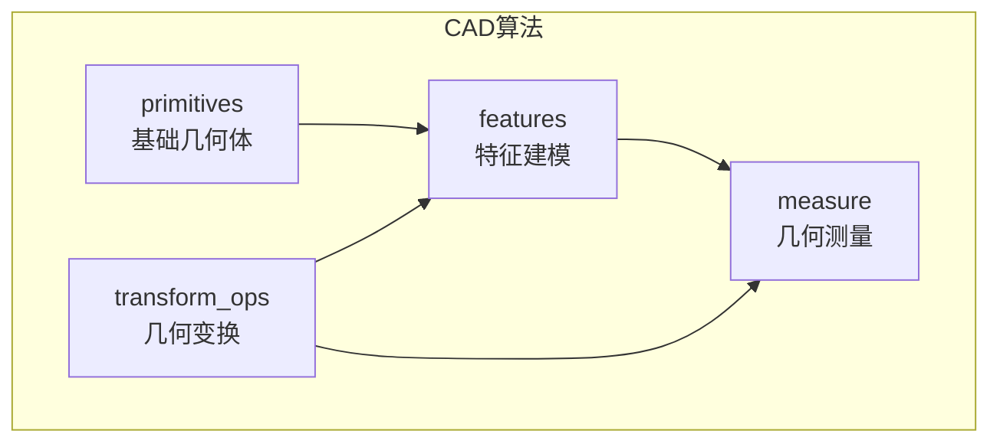
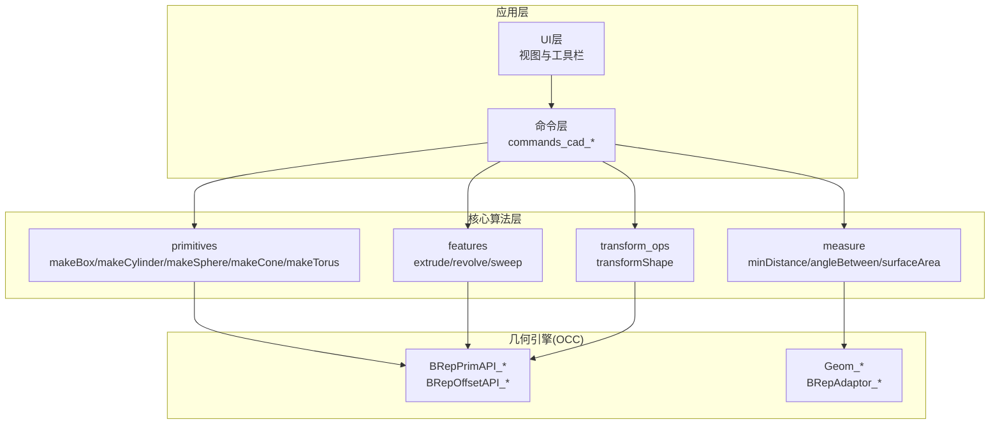
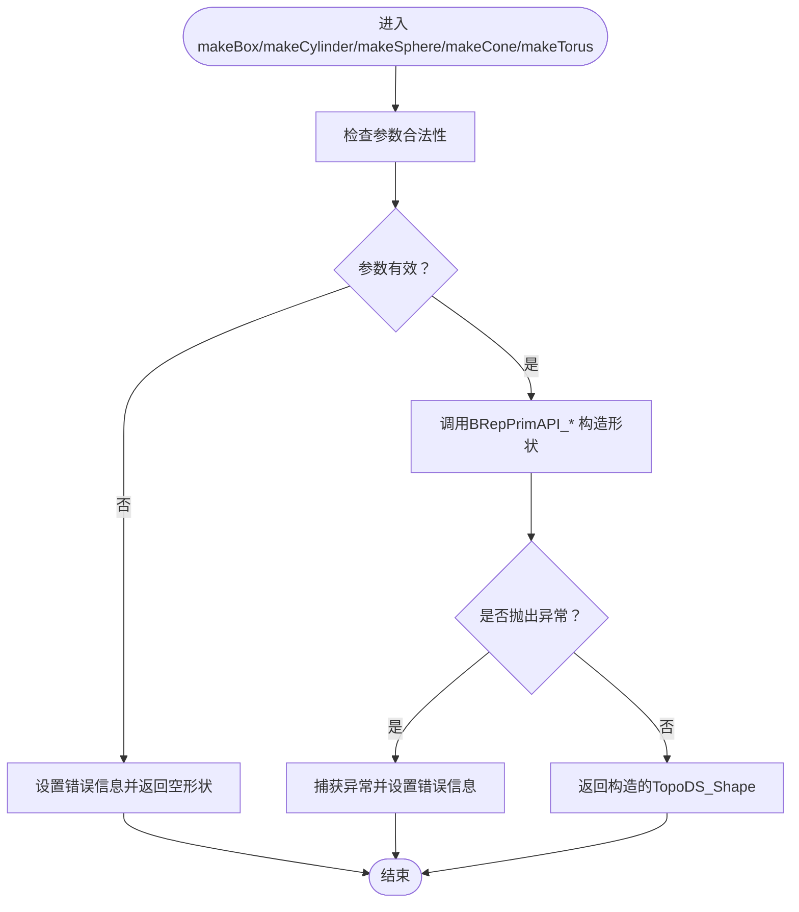
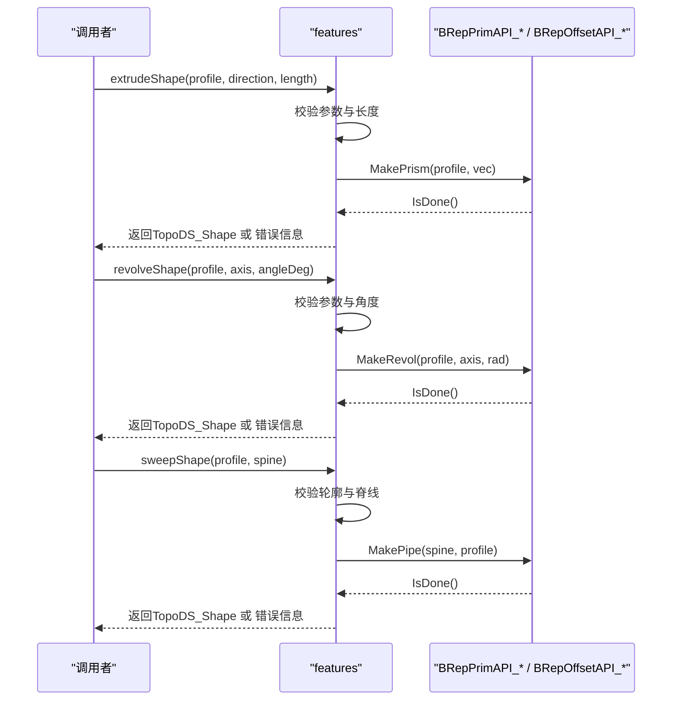
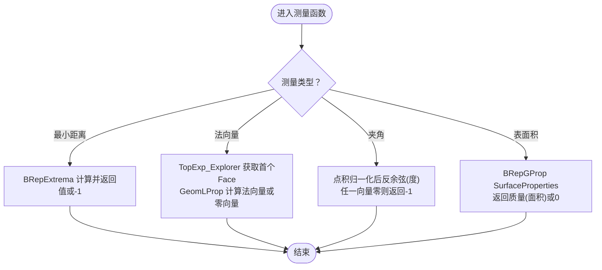
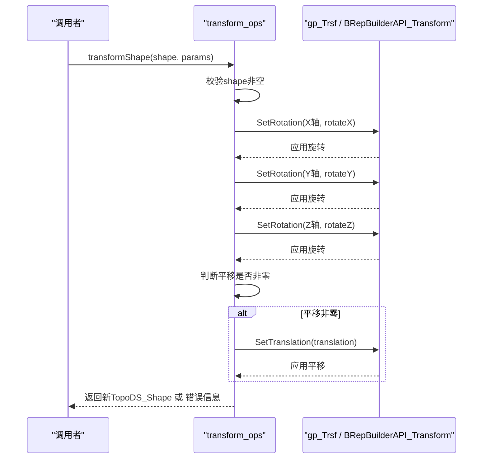
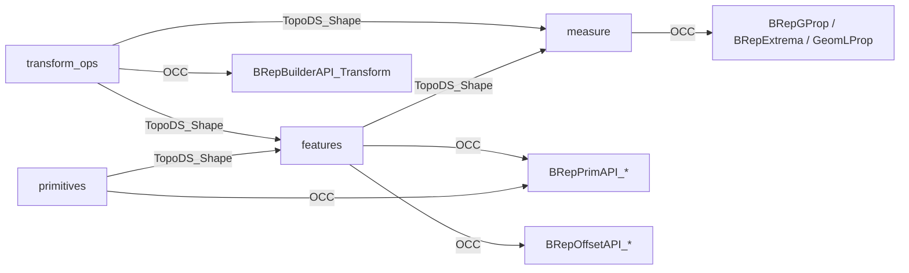

# 几何建模算法

<cite>
**本文引用的文件**
- [primitives.cpp](file://src/core/algorithms/cad/primitives.cpp)
- [primitives.h](file://src/core/algorithms/cad/primitives.h)
- [features.cpp](file://src/core/algorithms/cad/features.cpp)
- [features.h](file://src/core/algorithms/cad/features.h)
- [measure.cpp](file://src/core/algorithms/cad/measure.cpp)
- [measure.h](file://src/core/algorithms/cad/measure.h)
- [transform_ops.cpp](file://src/core/algorithms/cad/transform_ops.cpp)
- [transform_ops.h](file://src/core/algorithms/cad/transform_ops.h)
</cite>

## 目录
1. [引言](#引言)
2. [项目结构](#项目结构)
3. [核心组件](#核心组件)
4. [架构总览](#架构总览)
5. [详细组件分析](#详细组件分析)
6. [依赖关系分析](#依赖关系分析)
7. [性能考虑](#性能考虑)
8. [故障排查指南](#故障排查指南)
9. [结论](#结论)
10. [附录](#附录)

## 引言
本技术文档聚焦于LaserCNC中CAD几何建模算法的核心实现，涵盖以下方面：
- 基本几何体生成：长方体、圆柱体、球体、圆锥/截锥、圆环体的参数化与构造流程。
- 特征建模算法：拉伸、旋转、扫掠的数学原理与边界条件处理。
- 测量算法：距离、角度、面积的计算方法与错误处理。
- 变换操作：平移、绕轴旋转、复合变换的矩阵与坐标系转换。
- 性能优化与数值稳定性保障。

所有算法均基于OpenCASCADE（OCC）的BRep与Geom接口，确保几何精度与拓扑一致性，并通过统一的错误回传机制提升鲁棒性。

## 项目结构
围绕几何建模的算法位于核心模块的CAD算法子目录，采用按功能域分层组织：
- primitives：基础几何体生成
- features：特征建模（拉伸、旋转、扫掠）
- measure：几何测量（距离、角度、面积）
- transform_ops：几何变换（平移、旋转）

**图表来源**
- [primitives.h:1-32](file://src/core/algorithms/cad/primitives.h#L1-L32)
- [features.h:1-35](file://src/core/algorithms/cad/features.h#L1-L35)
- [measure.h:1-26](file://src/core/algorithms/cad/measure.h#L1-L26)
- [transform_ops.h:1-25](file://src/core/algorithms/cad/transform_ops.h#L1-L25)

**章节来源**
- [primitives.h:1-32](file://src/core/algorithms/cad/primitives.h#L1-L32)
- [features.h:1-35](file://src/core/algorithms/cad/features.h#L1-L35)
- [measure.h:1-26](file://src/core/algorithms/cad/measure.h#L1-L26)
- [transform_ops.h:1-25](file://src/core/algorithms/cad/transform_ops.h#L1-L25)

## 核心组件
本节概述四大算法模块的功能职责与接口契约：
- 基础几何体生成：提供长方体、圆柱体、球体、圆锥/截锥、圆环体的构造函数，统一返回TopoDS_Shape或空形状，并通过QString回写错误信息。
- 特征建模：提供拉伸（Prism）、旋转（Revol）、扫掠（Pipe）三类特征操作，均对输入有效性进行严格校验。
- 几何测量：提供两形体最小距离、首个可定义法向量、两向量夹角、表面积等测量能力。
- 几何变换：提供以参考点为中心的欧拉角旋转变换与平移复合变换，返回新形状或失败状态。

**章节来源**
- [primitives.cpp:21-94](file://src/core/algorithms/cad/primitives.cpp#L21-L94)
- [features.cpp:22-98](file://src/core/algorithms/cad/features.cpp#L22-L98)
- [measure.cpp:24-75](file://src/core/algorithms/cad/measure.cpp#L24-L75)
- [transform_ops.cpp:53-78](file://src/core/algorithms/cad/transform_ops.cpp#L53-L78)

## 架构总览
下图展示几何建模算法在系统中的位置与交互关系：

**图表来源**
- [primitives.cpp:3-8](file://src/core/algorithms/cad/primitives.cpp#L3-L8)
- [features.cpp:3-6](file://src/core/algorithms/cad/features.cpp#L3-L6)
- [measure.cpp:3-13](file://src/core/algorithms/cad/measure.cpp#L3-L13)
- [transform_ops.cpp:3-7](file://src/core/algorithms/cad/transform_ops.cpp#L3-L7)

## 详细组件分析

### 基础几何体生成算法
- 设计要点
  - 参数校验前置：对尺寸参数进行非负与正数约束，避免无效输入导致底层异常。
  - 统一异常捕获：使用Standard_Failure捕获OCC内部异常，转换为字符串错误信息并返回空形状。
  - 坐标系约定：长方体原点位于(0,0,0)并沿+X/+Y/+Z方向；圆柱体底面位于XY平面并沿+Z方向；球心位于原点；圆锥/截锥r2=0为标准锥；r1==r2退化为圆柱；圆环体要求r1>r2。
- 数据结构与复杂度
  - 输入：双精度参数（半径、高度、dx/dy/dz等），时间复杂度近似O(1)。
  - 输出：TopoDS_Shape，空间复杂度取决于几何细分与拓扑结构。
- 错误处理
  - 参数非法：返回空形状并设置错误信息。
  - OCC异常：捕获后转换为错误字符串。
- 数值稳定性
  - 使用QString回传错误，避免抛出未捕获异常影响调用方。
  - 对极小值进行阈值判断，避免后续计算不稳定。

**图表来源**
- [primitives.cpp:21-34](file://src/core/algorithms/cad/primitives.cpp#L21-L34)
- [primitives.cpp:36-49](file://src/core/algorithms/cad/primitives.cpp#L36-L49)
- [primitives.cpp:51-64](file://src/core/algorithms/cad/primitives.cpp#L51-L64)
- [primitives.cpp:66-79](file://src/core/algorithms/cad/primitives.cpp#L66-L79)
- [primitives.cpp:81-94](file://src/core/algorithms/cad/primitives.cpp#L81-L94)

**章节来源**
- [primitives.h:9-30](file://src/core/algorithms/cad/primitives.h#L9-L30)
- [primitives.cpp:21-94](file://src/core/algorithms/cad/primitives.cpp#L21-L94)

### 特征建模算法
- 拉伸（Prism）
  - 数学原理：沿给定方向按长度平移二维轮廓形成实体。
  - 边界条件：轮廓不能为空，长度必须非零；内部使用gp_Vec乘法构造平移向量。
  - 失败处理：IsDone()检查与异常捕获。
- 旋转（Revol）
  - 数学原理：绕指定轴旋转一定角度形成实体。
  - 边界条件：轮廓不能为空，角度必须非零；内部将角度转为弧度。
  - 失败处理：IsDone()检查与异常捕获。
- 扫掠（Pipe）
  - 数学原理：轮廓沿导线（脊线）扫掠形成管状实体。
  - 边界条件：轮廓与脊线均不能为空。
  - 失败处理：IsDone()检查与异常捕获。

**图表来源**
- [features.cpp:22-49](file://src/core/algorithms/cad/features.cpp#L22-L49)
- [features.cpp:51-76](file://src/core/algorithms/cad/features.cpp#L51-L76)
- [features.cpp:78-98](file://src/core/algorithms/cad/features.cpp#L78-L98)

**章节来源**
- [features.h:12-33](file://src/core/algorithms/cad/features.h#L12-L33)
- [features.cpp:22-98](file://src/core/algorithms/cad/features.cpp#L22-L98)

### 几何测量算法
- 最小距离
  - 方法：BRepExtrema_DistShapeShape计算两形体间最小距离。
  - 失败返回：-1.0；异常捕获保证健壮性。
- 首个面法向量
  - 方法：遍历第一个FACE，利用BRepAdaptor_Surface与GeomLProp获取局部法向量。
  - 失败返回：零向量；属性不可定义时返回零向量。
- 两向量夹角（度）
  - 方法：归一化后取点积反余弦，范围裁剪[-1,1]。
  - 失败返回：-1.0（任一向量为零向量）。
- 表面积
  - 方法：BRepGProp::SurfaceProperties计算质量即表面积。
  - 失败返回：0.0。

**图表来源**
- [measure.cpp:24-35](file://src/core/algorithms/cad/measure.cpp#L24-L35)
- [measure.cpp:37-53](file://src/core/algorithms/cad/measure.cpp#L37-L53)
- [measure.cpp:55-63](file://src/core/algorithms/cad/measure.cpp#L55-L63)
- [measure.cpp:65-75](file://src/core/algorithms/cad/measure.cpp#L65-L75)

**章节来源**
- [measure.h:9-24](file://src/core/algorithms/cad/measure.h#L9-L24)
- [measure.cpp:24-75](file://src/core/algorithms/cad/measure.cpp#L24-L75)

### 几何变换算法
- 设计要点
  - 参考点：所有旋转围绕referencePoint进行，确保变换的物理意义明确。
  - 欧拉角顺序：依次绕X、Y、Z轴旋转，随后执行平移。
  - 复合变换：通过gp_Trsf累积旋转与平移，最终使用BRepBuilderAPI_Transform应用到形状。
  - 零角度/零平移：跳过对应变换以避免无效操作。
- 数据结构
  - TransformParams包含平移向量、参考点与三轴旋转角。
- 错误处理
  - 输入为空：立即返回错误。
  - 底层变换失败：IsDone()检查失败时回传错误信息。
- 数值稳定性
  - 角度转弧度使用π常量，避免重复定义。
  - 平移平方范数阈值用于判断非零平移。

**图表来源**
- [transform_ops.cpp:53-78](file://src/core/algorithms/cad/transform_ops.cpp#L53-L78)
- [transform_ops.cpp:21-35](file://src/core/algorithms/cad/transform_ops.cpp#L21-L35)
- [transform_ops.cpp:37-49](file://src/core/algorithms/cad/transform_ops.cpp#L37-L49)

**章节来源**
- [transform_ops.h:10-22](file://src/core/algorithms/cad/transform_ops.h#L10-L22)
- [transform_ops.cpp:53-78](file://src/core/algorithms/cad/transform_ops.cpp#L53-L78)

## 依赖关系分析
- 内部耦合
  - 四大模块相对独立，通过TopoDS_Shape与gp_*类型进行数据传递，内聚性高。
- 外部依赖
  - OpenCASCADE（OCC）：BRepPrimAPI_*（基础体）、BRepOffsetAPI_*（扫掠）、BRepBuilderAPI_Transform（变换）、BRepGProp（面积）、BRepExtrema（距离）、GeomLProp（法向）等。
- 潜在循环依赖
  - 当前无循环依赖，模块间单向依赖清晰。
- 接口契约
  - 所有算法均以TopoDS_Shape为输入输出，错误通过QString回传，便于上层统一处理。

**图表来源**
- [primitives.cpp:3-8](file://src/core/algorithms/cad/primitives.cpp#L3-L8)
- [features.cpp:3-6](file://src/core/algorithms/cad/features.cpp#L3-L6)
- [measure.cpp:3-13](file://src/core/algorithms/cad/measure.cpp#L3-L13)
- [transform_ops.cpp:3-7](file://src/core/algorithms/cad/transform_ops.cpp#L3-L7)

**章节来源**
- [primitives.cpp:3-8](file://src/core/algorithms/cad/primitives.cpp#L3-L8)
- [features.cpp:3-6](file://src/core/algorithms/cad/features.cpp#L3-L6)
- [measure.cpp:3-13](file://src/core/algorithms/cad/measure.cpp#L3-L13)
- [transform_ops.cpp:3-7](file://src/core/algorithms/cad/transform_ops.cpp#L3-L7)

## 性能考虑
- 时间复杂度
  - 基础几何体与特征建模：近似O(1)，主要开销在OCC内部网格化与拓扑构建。
  - 扫掠：与脊线与轮廓的离散点数量相关，通常线性增长。
  - 测量：最小距离与表面积依赖形体复杂度，复杂度随面片数增长。
- 空间复杂度
  - 输出形状大小取决于几何细分与拓扑复杂度。
- 优化建议
  - 参数预校验：在调用前尽早拒绝非法输入，减少OCC异常开销。
  - 合理的网格密度：在满足精度前提下降低细分，平衡速度与质量。
  - 批量操作：对多次变换与测量，尽量合并为一次操作序列，减少中间对象创建。
  - 缓存策略：对重复测量结果（如表面积）可缓存至文档状态，避免重复计算。
- 数值稳定性
  - 角度换算使用π常量，避免重复定义误差。
  - 向量归一化前进行幅度阈值判断，防止除零与NaN传播。
  - 使用qFuzzy系列比较（如qFuzzyIsNull）处理浮点比较，避免精度抖动。

[本节为通用性能指导，无需特定文件引用]

## 故障排查指南
- 常见错误与定位
  - 输入为空：检查TopoDS_Shape是否由上一步骤正确生成。
  - 参数非法：确认半径/高度/长度/角度等参数满足约束（>0或非零）。
  - OCC异常：查看错误字符串回传，定位具体OCC调用失败点。
- 调试建议
  - 在关键节点打印参数与布尔标志（IsDone），快速定位失败分支。
  - 对复杂形体先进行简化测试（如仅一个面或简单轮廓），逐步增加复杂度。
  - 使用最小距离与法向量函数验证形体拓扑与定向是否正确。
- 错误处理路径
  - 所有算法均通过QString回传错误信息，调用方可据此提示用户或记录日志。

**章节来源**
- [primitives.cpp:14-18](file://src/core/algorithms/cad/primitives.cpp#L14-L18)
- [features.cpp:14-20](file://src/core/algorithms/cad/features.cpp#L14-L20)
- [measure.cpp:24-35](file://src/core/algorithms/cad/measure.cpp#L24-L35)
- [transform_ops.cpp:21-35](file://src/core/algorithms/cad/transform_ops.cpp#L21-L35)

## 结论
本文件系统梳理了LaserCNC几何建模算法的核心实现，覆盖基础几何体、特征建模、测量与变换四大模块。算法以OCC为基础，强调参数校验、异常捕获与错误回传，确保在复杂几何场景下的稳定性与可维护性。结合性能与数值稳定性建议，可在保证精度的同时提升运行效率。

[本节为总结性内容，无需特定文件引用]

## 附录
- 关键API速览
  - 基础几何体：makeBox、makeCylinder、makeSphere、makeCone、makeTorus
  - 特征建模：extrudeShape、revolveShape、sweepShape
  - 几何测量：minDistance、firstFaceNormal、angleBetween、surfaceArea
  - 几何变换：transformShape（含TransformParams）

[本节为概览性内容，无需特定文件引用]