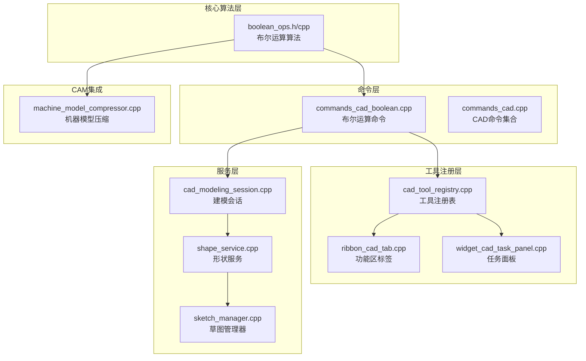
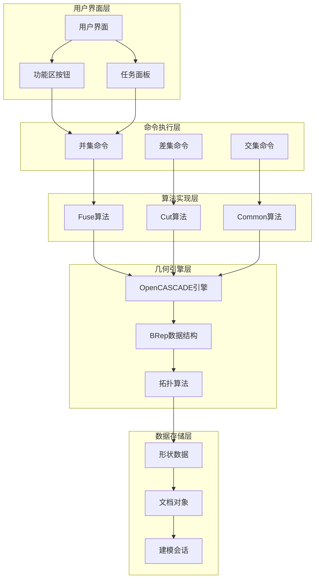
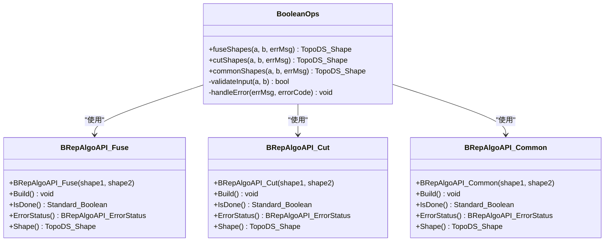
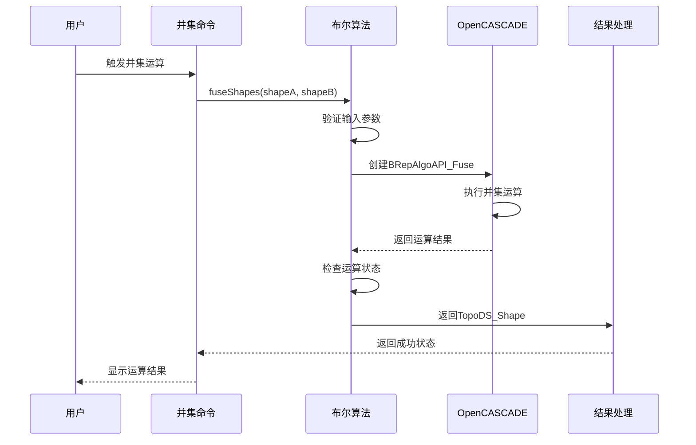
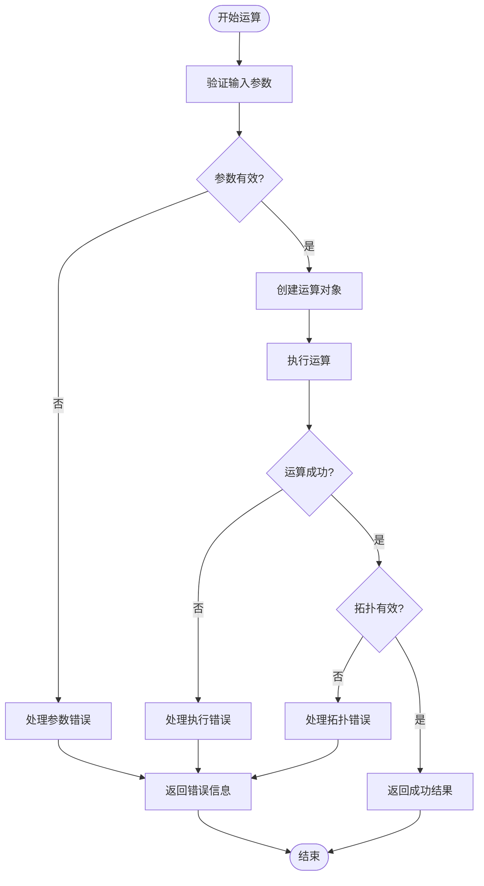
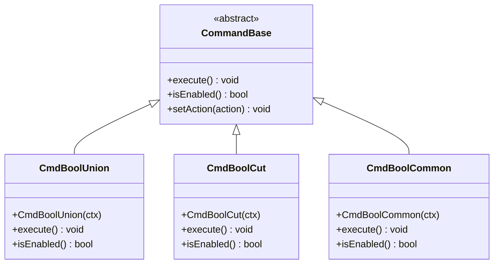
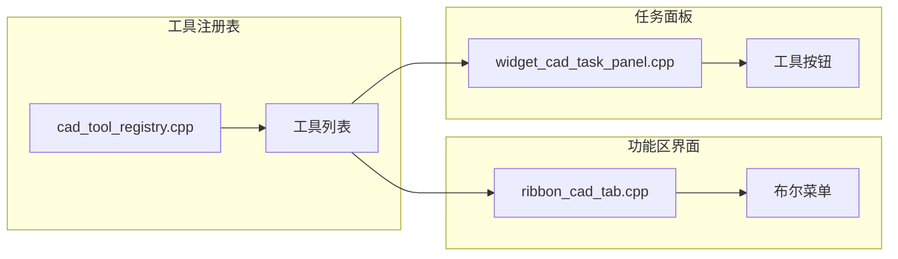
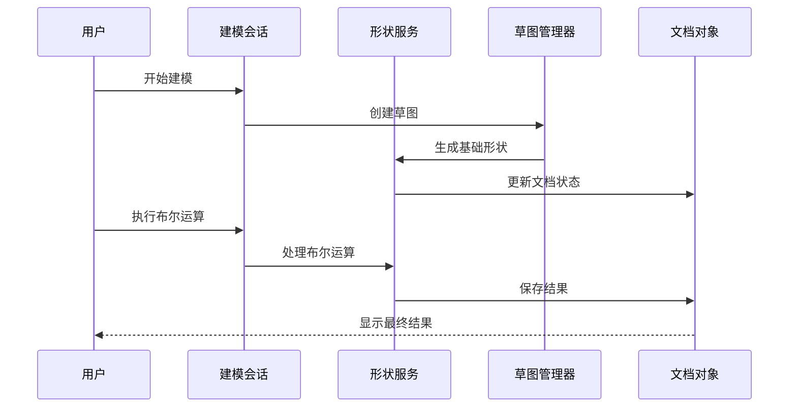
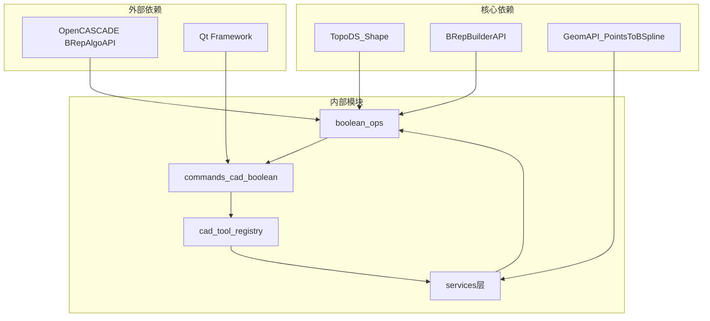
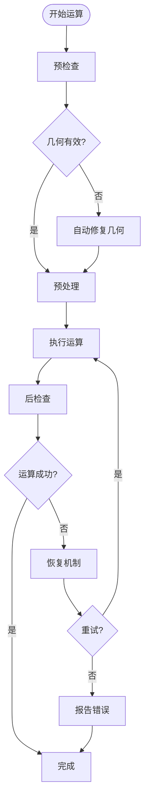

# 布尔运算系统

<cite>
**本文档引用的文件**
- [boolean_ops.h](file://src/core/algorithms/cad/boolean_ops.h)
- [boolean_ops.cpp](file://src/core/algorithms/cad/boolean_ops.cpp)
- [commands_cad_boolean.cpp](file://src/modules/cad/commands/commands_cad_boolean.cpp)
- [cad_tool_registry.cpp](file://src/modules/cad/task/cad_tool_registry.cpp)
- [ribbon_cad_tab.cpp](file://src/modules/cad/ui/ribbon_cad_tab.cpp)
- [widget_cad_task_panel.cpp](file://src/modules/cad/ui/widget_cad_task_panel.cpp)
- [cad_modeling_session.cpp](file://src/modules/cad/services/cad_modeling_session.cpp)
- [shape_service.cpp](file://src/modules/cad/services/shape_service.cpp)
- [sketch_manager.cpp](file://src/modules/cad/services/sketch_manager.cpp)
- [machine_model_compressor.cpp](file://src/core/algorithms/cam/machine_model_compressor.cpp)
</cite>

## 目录
1. [引言](#引言)
2. [项目结构](#项目结构)
3. [核心组件](#核心组件)
4. [架构概览](#架构概览)
5. [详细组件分析](#详细组件分析)
6. [依赖关系分析](#依赖关系分析)
7. [性能考虑](#性能考虑)
8. [故障排除指南](#故障排除指南)
9. [结论](#结论)

## 引言

LaserCNC的布尔运算系统是CAD模块的核心功能之一，负责实现三维几何体之间的布尔运算操作。该系统基于OpenCASCADE几何引擎，提供了并集、交集、差集等基本布尔运算，并将其集成到完整的特征建模工作流中。

布尔运算系统的主要目标是：
- 提供稳定可靠的三维几何布尔运算能力
- 支持复杂的特征建模需求
- 确保几何精度和拓扑完整性
- 提供用户友好的操作界面

## 项目结构

布尔运算系统在LaserCNC项目中的组织结构如下：

**图表来源**
- [boolean_ops.h:1-24](file://src/core/algorithms/cad/boolean_ops.h#L1-L24)
- [commands_cad_boolean.cpp:1-120](file://src/modules/cad/commands/commands_cad_boolean.cpp#L1-L120)
- [cad_tool_registry.cpp:200-235](file://src/modules/cad/task/cad_tool_registry.cpp#L200-L235)

**章节来源**
- [boolean_ops.h:1-24](file://src/core/algorithms/cad/boolean_ops.h#L1-L24)
- [boolean_ops.cpp:1-70](file://src/core/algorithms/cad/boolean_ops.cpp#L1-L70)
- [commands_cad_boolean.cpp:1-120](file://src/modules/cad/commands/commands_cad_boolean.cpp#L1-L120)

## 核心组件

布尔运算系统由以下核心组件构成：

### 1. 布尔运算算法层
- **接口定义**：提供三种基本布尔运算的函数接口
- **错误处理**：统一的错误信息返回机制
- **OpenCASCADE集成**：基于BRepAlgoAPI算法族

### 2. 命令执行层
- **并集运算**：实现A ∪ B操作
- **差集运算**：实现A − B操作  
- **交集运算**：实现A ∩ B操作

### 3. 用户界面层
- **功能区集成**：与CAD功能区无缝集成
- **工具面板**：提供直观的操作界面
- **工具注册**：支持命令行和图形界面操作

**章节来源**
- [boolean_ops.h:9-24](file://src/core/algorithms/cad/boolean_ops.h#L9-L24)
- [commands_cad_boolean.cpp:44-116](file://src/modules/cad/commands/commands_cad_boolean.cpp#L44-L116)

## 架构概览

布尔运算系统的整体架构采用分层设计，确保了良好的模块化和可维护性：

**图表来源**
- [commands_cad_boolean.cpp:44-116](file://src/modules/cad/commands/commands_cad_boolean.cpp#L44-L116)
- [boolean_ops.cpp:1-70](file://src/core/algorithms/cad/boolean_ops.cpp#L1-L70)
- [cad_tool_registry.cpp:207-230](file://src/modules/cad/task/cad_tool_registry.cpp#L207-L230)

## 详细组件分析

### 布尔运算算法实现

#### 核心算法类图

**图表来源**
- [boolean_ops.cpp:1-70](file://src/core/algorithms/cad/boolean_ops.cpp#L1-L70)

#### 并集运算流程

**图表来源**
- [commands_cad_boolean.cpp:44-46](file://src/modules/cad/commands/commands_cad_boolean.cpp#L44-L46)
- [boolean_ops.cpp:20-35](file://src/core/algorithms/cad/boolean_ops.cpp#L20-L35)

#### 错误处理机制

布尔运算系统实现了完善的错误处理机制：

**图表来源**
- [boolean_ops.cpp:15-70](file://src/core/algorithms/cad/boolean_ops.cpp#L15-L70)

**章节来源**
- [boolean_ops.cpp:1-70](file://src/core/algorithms/cad/boolean_ops.cpp#L1-L70)

### 命令执行系统

#### 命令类层次结构

**图表来源**
- [commands_cad_boolean.cpp:1-120](file://src/modules/cad/commands/commands_cad_boolean.cpp#L1-L120)

#### 工具注册和UI集成

布尔运算工具通过注册表系统集成到LaserCNC的用户界面中：

**图表来源**
- [cad_tool_registry.cpp:207-230](file://src/modules/cad/task/cad_tool_registry.cpp#L207-L230)
- [ribbon_cad_tab.cpp:155-162](file://src/modules/cad/ui/ribbon_cad_tab.cpp#L155-L162)
- [widget_cad_task_panel.cpp:477-482](file://src/modules/cad/ui/widget_cad_task_panel.cpp#L477-L482)

**章节来源**
- [commands_cad_boolean.cpp:1-120](file://src/modules/cad/commands/commands_cad_boolean.cpp#L1-L120)
- [cad_tool_registry.cpp:207-230](file://src/modules/cad/task/cad_tool_registry.cpp#L207-L230)

### 特征建模集成

布尔运算系统与LaserCNC的特征建模系统深度集成：

#### 建模会话管理

**图表来源**
- [cad_modeling_session.cpp](file://src/modules/cad/services/cad_modeling_session.cpp)
- [shape_service.cpp](file://src/modules/cad/services/shape_service.cpp)
- [sketch_manager.cpp](file://src/modules/cad/services/sketch_manager.cpp)

**章节来源**
- [cad_modeling_session.cpp](file://src/modules/cad/services/cad_modeling_session.cpp)
- [shape_service.cpp](file://src/modules/cad/services/shape_service.cpp)
- [sketch_manager.cpp](file://src/modules/cad/services/sketch_manager.cpp)

## 依赖关系分析

布尔运算系统的依赖关系体现了清晰的分层架构：

**图表来源**
- [boolean_ops.cpp:1-5](file://src/core/algorithms/cad/boolean_ops.cpp#L1-L5)
- [commands_cad_boolean.cpp:1-5](file://src/modules/cad/commands/commands_cad_boolean.cpp#L1-L5)
- [cad_tool_registry.cpp:1-20](file://src/modules/cad/task/cad_tool_registry.cpp#L1-L20)

**章节来源**
- [boolean_ops.cpp:1-5](file://src/core/algorithms/cad/boolean_ops.cpp#L1-L5)
- [commands_cad_boolean.cpp:1-5](file://src/modules/cad/commands/commands_cad_boolean.cpp#L1-L5)

## 性能考虑

布尔运算系统在性能优化方面采用了多种策略：

### 1. 几何精度控制
- **公差设置**：合理设置几何计算公差
- **网格简化**：对复杂几何进行网格简化
- **缓存机制**：缓存中间计算结果

### 2. 内存管理
- **智能指针**：使用RAII管理内存
- **批量处理**：支持批量布尔运算
- **延迟计算**：避免不必要的重复计算

### 3. 并行处理
- **多线程支持**：利用多核处理器优势
- **异步运算**：非阻塞的用户界面响应
- **进度反馈**：长时间运算的进度显示

### 4. 大规模几何处理
- **增量更新**：只更新受影响的部分
- **LOD技术**：根据视图距离调整细节级别
- **内存映射**：处理超大几何体

## 故障排除指南

### 常见问题及解决方案

#### 1. 几何不合法错误
**症状**：布尔运算失败，返回空形状
**原因**：
- 输入几何体存在缺陷
- 自相交或非流形几何
- 几何精度问题

**解决方法**：
- 使用几何修复工具
- 检查几何体拓扑结构
- 调整几何公差设置

#### 2. 运算性能问题
**症状**：布尔运算耗时过长
**原因**：
- 几何体过于复杂
- 内存不足
- CPU性能限制

**解决方法**：
- 简化几何体
- 分批处理复杂运算
- 优化硬件配置

#### 3. 用户界面问题
**症状**：命令不可用或界面异常
**原因**：
- 选择的实体数量不正确
- 文档状态异常
- 缓存数据损坏

**解决方法**：
- 检查实体选择
- 重置文档状态
- 清除缓存数据

### 错误检测和恢复机制

**图表来源**
- [boolean_ops.cpp:15-70](file://src/core/algorithms/cad/boolean_ops.cpp#L15-L70)

**章节来源**
- [boolean_ops.cpp:15-70](file://src/core/algorithms/cad/boolean_ops.cpp#L15-L70)

## 结论

LaserCNC的布尔运算系统是一个高度模块化、具有良好扩展性的几何运算平台。系统基于OpenCASCADE引擎，提供了稳定可靠的三维布尔运算能力，并成功集成了到完整的CAD工作流中。

### 主要优势

1. **架构清晰**：分层设计确保了良好的模块化和可维护性
2. **功能完整**：支持所有基本布尔运算操作
3. **用户友好**：提供直观的图形界面和命令行接口
4. **性能优秀**：采用多种优化策略处理大规模几何体
5. **错误处理完善**：具备强大的容错和恢复机制

### 发展方向

未来可以考虑的改进方向：
- 支持更复杂的几何运算（如变厚度、扫掠等）
- 增强实时预览功能
- 优化大规模数据处理能力
- 扩展到更高维度的几何运算

该系统为LaserCNC的CAD功能奠定了坚实的基础，为用户提供了一个强大而易用的三维建模工具集。