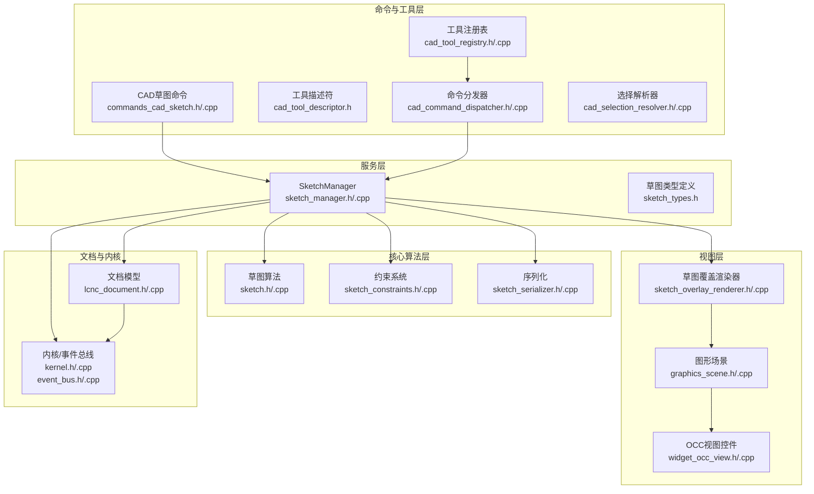
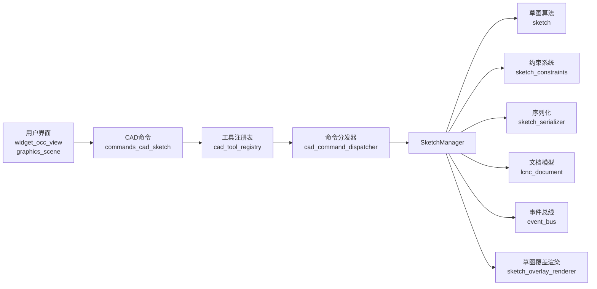
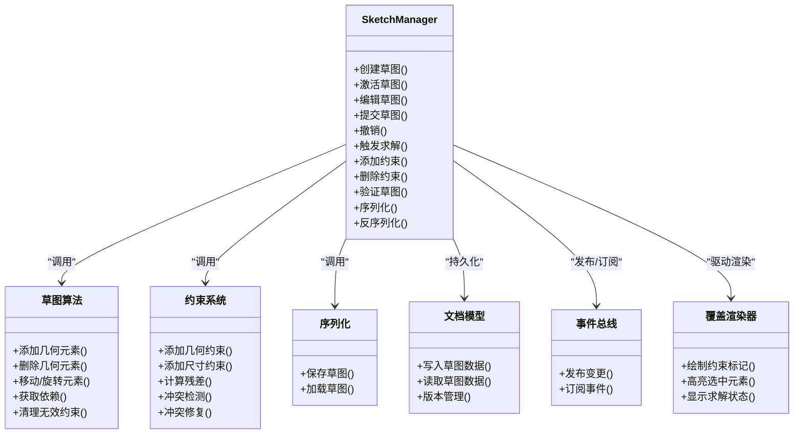
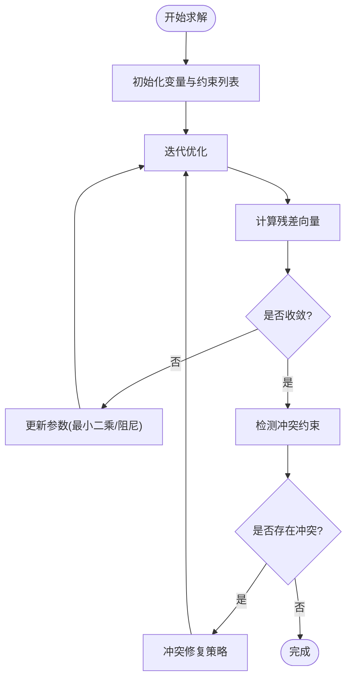
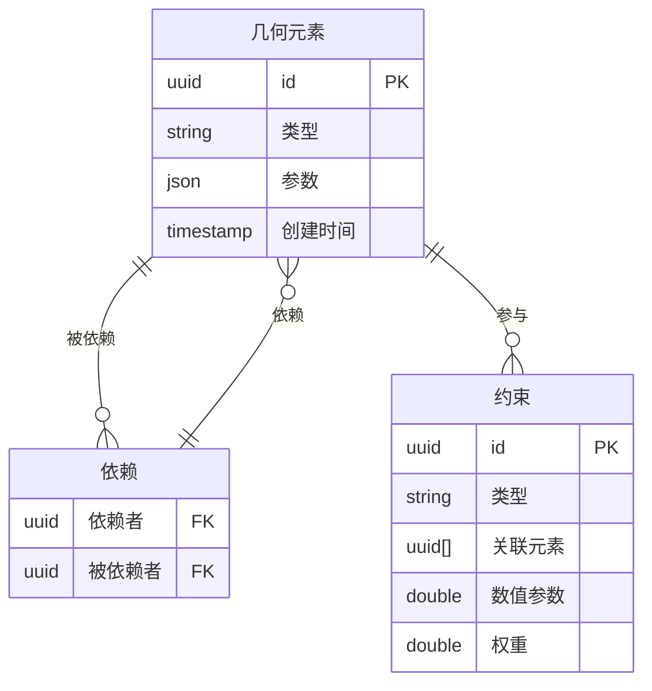
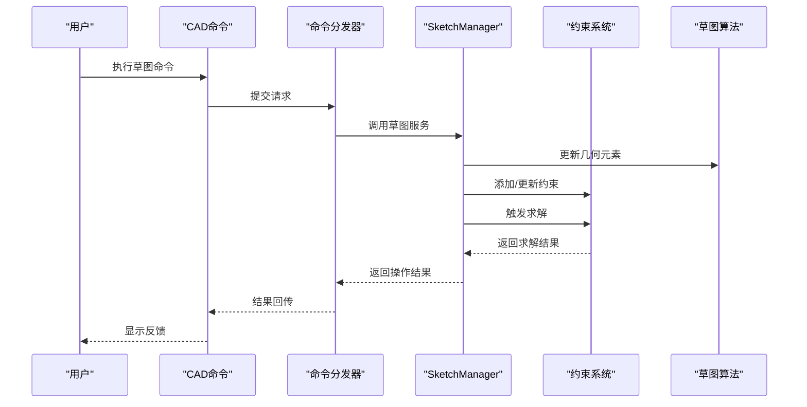
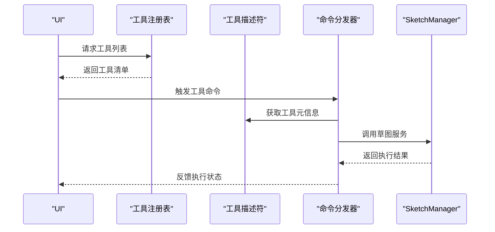
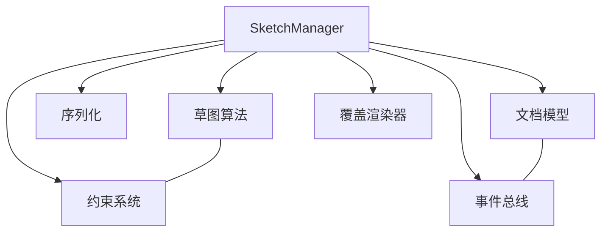

# 草图管理系统

<cite>
**本文引用的文件**
- [sketch_manager.h](file://src/modules/cad/services/sketch_manager.h)
- [sketch_manager.cpp](file://src/modules/cad/services/sketch_manager.cpp)
- [sketch.h](file://src/core/algorithms/cad/sketch.h)
- [sketch.cpp](file://src/core/algorithms/cad/sketch.cpp)
- [sketch_constraints.h](file://src/core/algorithms/cad/sketch_constraints.h)
- [sketch_constraints.cpp](file://src/core/algorithms/cad/sketch_constraints.cpp)
- [sketch_serializer.h](file://src/modules/cad/sketch/sketch_serializer.h)
- [sketch_serializer.cpp](file://src/modules/cad/sketch/sketch_serializer.cpp)
- [sketch_types.h](file://src/modules/cad/services/sketch_types.h)
- [commands_cad_sketch.h](file://src/modules/cad/commands/commands_cad_sketch.h)
- [commands_cad_sketch.cpp](file://src/modules/cad/commands/commands_cad_sketch.cpp)
- [cad_tool_registry.h](file://src/modules/cad/task/cad_tool_registry.h)
- [cad_tool_registry.cpp](file://src/modules/cad/task/cad_tool_registry.cpp)
- [cad_tool_descriptor.h](file://src/modules/cad/task/cad_tool_descriptor.h)
- [cad_command_dispatcher.h](file://src/modules/cad/task/cad_command_dispatcher.h)
- [cad_command_dispatcher.cpp](file://src/modules/cad/task/cad_command_dispatcher.cpp)
- [cad_selection_resolver.h](file://src/modules/cad/selection/cad_selection_resolver.h)
- [cad_selection_resolver.cpp](file://src/modules/cad/selection/cad_selection_resolver.cpp)
- [sketch_overlay_renderer.h](file://src/view/sketch_overlay_renderer.h)
- [sketch_overlay_renderer.cpp](file://src/view/sketch_overlay_renderer.cpp)
- [graphics_scene.h](file://src/view/graphics_scene.h)
- [graphics_scene.cpp](file://src/view/graphics_scene.cpp)
- [widget_occ_view.h](file://src/view/widget_occ_view.h)
- [widget_occ_view.cpp](file://src/view/widget_occ_view.cpp)
- [lcnc_document.h](file://src/core/document/lcnc_document.h)
- [lcnc_document.cpp](file://src/core/document/lcnc_document.cpp)
- [kernel.h](file://src/core/kernel/kernel.h)
- [kernel.cpp](file://src/core/kernel/kernel.cpp)
- [event_bus.h](file://src/core/kernel/event_bus.h)
- [event_bus.cpp](file://src/core/kernel/event_bus.cpp)
</cite>

## 目录
1. [引言](#引言)
2. [项目结构](#项目结构)
3. [核心组件](#核心组件)
4. [架构总览](#架构总览)
5. [详细组件分析](#详细组件分析)
6. [依赖分析](#依赖分析)
7. [性能考虑](#性能考虑)
8. [故障排除指南](#故障排除指南)
9. [结论](#结论)
10. [附录](#附录)

## 引言
本文件为LaserCNC草图管理系统的全面技术文档，聚焦于SketchManager服务的设计与实现，涵盖草图创建、编辑、约束求解与验证机制；深入阐述几何约束与尺寸约束的数学模型与求解算法；说明草图数据结构设计（几何元素存储、约束关系维护与依赖管理）；解释求解器实现（约束满足、冲突检测与修复策略）；并提供草图工具命令的集成与扩展开发指导。

## 项目结构
LaserCNC采用模块化微内核架构，草图系统位于CAD模块中，核心代码分布在以下层次：
- 核心算法层：提供草图建模、约束求解与序列化能力
- 服务层：暴露SketchManager服务接口，协调草图生命周期
- 命令与工具层：提供草图工具命令注册与分发
- 视图层：渲染草图覆盖层与交互反馈
- 文档与内核：承载草图在文档中的持久化与事件总线

图表来源
- [sketch_manager.h](file://src/modules/cad/services/sketch_manager.h)
- [sketch_manager.cpp](file://src/modules/cad/services/sketch_manager.cpp)
- [sketch.h](file://src/core/algorithms/cad/sketch.h)
- [sketch_constraints.h](file://src/core/algorithms/cad/sketch_constraints.h)
- [sketch_serializer.h](file://src/modules/cad/sketch/sketch_serializer.h)
- [commands_cad_sketch.h](file://src/modules/cad/commands/commands_cad_sketch.h)
- [cad_tool_registry.h](file://src/modules/cad/task/cad_tool_registry.h)
- [cad_command_dispatcher.h](file://src/modules/cad/task/cad_command_dispatcher.h)
- [sketch_overlay_renderer.h](file://src/view/sketch_overlay_renderer.h)
- [graphics_scene.h](file://src/view/graphics_scene.h)
- [widget_occ_view.h](file://src/view/widget_occ_view.h)
- [lcnc_document.h](file://src/core/document/lcnc_document.h)
- [kernel.h](file://src/core/kernel/kernel.h)
- [event_bus.h](file://src/core/kernel/event_bus.h)

章节来源
- [sketch_manager.h](file://src/modules/cad/services/sketch_manager.h)
- [sketch_manager.cpp](file://src/modules/cad/services/sketch_manager.cpp)
- [sketch.h](file://src/core/algorithms/cad/sketch.h)
- [sketch.cpp](file://src/core/algorithms/cad/sketch.cpp)
- [sketch_constraints.h](file://src/core/algorithms/cad/sketch_constraints.h)
- [sketch_constraints.cpp](file://src/core/algorithms/cad/sketch_constraints.cpp)
- [sketch_serializer.h](file://src/modules/cad/sketch/sketch_serializer.h)
- [sketch_serializer.cpp](file://src/modules/cad/sketch/sketch_serializer.cpp)
- [sketch_types.h](file://src/modules/cad/services/sketch_types.h)
- [commands_cad_sketch.h](file://src/modules/cad/commands/commands_cad_sketch.h)
- [commands_cad_sketch.cpp](file://src/modules/cad/commands/commands_cad_sketch.cpp)
- [cad_tool_registry.h](file://src/modules/cad/task/cad_tool_registry.h)
- [cad_tool_registry.cpp](file://src/modules/cad/task/cad_tool_registry.cpp)
- [cad_tool_descriptor.h](file://src/modules/cad/task/cad_tool_descriptor.h)
- [cad_command_dispatcher.h](file://src/modules/cad/task/cad_command_dispatcher.h)
- [cad_command_dispatcher.cpp](file://src/modules/cad/task/cad_command_dispatcher.cpp)
- [cad_selection_resolver.h](file://src/modules/cad/selection/cad_selection_resolver.h)
- [cad_selection_resolver.cpp](file://src/modules/cad/selection/cad_selection_resolver.cpp)
- [sketch_overlay_renderer.h](file://src/view/sketch_overlay_renderer.h)
- [sketch_overlay_renderer.cpp](file://src/view/sketch_overlay_renderer.cpp)
- [graphics_scene.h](file://src/view/graphics_scene.h)
- [graphics_scene.cpp](file://src/view/graphics_scene.cpp)
- [widget_occ_view.h](file://src/view/widget_occ_view.h)
- [widget_occ_view.cpp](file://src/view/widget_occ_view.cpp)
- [lcnc_document.h](file://src/core/document/lcnc_document.h)
- [lcnc_document.cpp](file://src/core/document/lcnc_document.cpp)
- [kernel.h](file://src/core/kernel/kernel.h)
- [kernel.cpp](file://src/core/kernel/kernel.cpp)
- [event_bus.h](file://src/core/kernel/event_bus.h)
- [event_bus.cpp](file://src/core/kernel/event_bus.cpp)

## 核心组件
- SketchManager服务：负责草图的创建、编辑、约束求解与验证，协调核心算法与UI渲染，维护草图状态与依赖关系。
- 草图算法（sketch.*）：提供几何元素建模、约束添加/删除、求解流程与验证机制。
- 约束系统（sketch_constraints.*）：定义约束类型、数学模型与求解算法。
- 序列化（sketch_serializer.*）：支持草图数据的持久化与加载。
- CAD命令与工具（commands_cad_sketch.*, cad_tool_registry.*, cad_command_dispatcher.*）：提供草图工具命令的注册、分发与执行。
- 视图渲染（sketch_overlay_renderer.*, graphics_scene.*, widget_occ_view.*）：实时渲染草图覆盖层与交互高亮。
- 文档与内核（lcnc_document.*, kernel.*, event_bus.*）：承载草图在文档中的存储与跨模块通信。

章节来源
- [sketch_manager.h](file://src/modules/cad/services/sketch_manager.h)
- [sketch_manager.cpp](file://src/modules/cad/services/sketch_manager.cpp)
- [sketch.h](file://src/core/algorithms/cad/sketch.h)
- [sketch.cpp](file://src/core/algorithms/cad/sketch.cpp)
- [sketch_constraints.h](file://src/core/algorithms/cad/sketch_constraints.h)
- [sketch_constraints.cpp](file://src/core/algorithms/cad/sketch_constraints.cpp)
- [sketch_serializer.h](file://src/modules/cad/sketch/sketch_serializer.h)
- [sketch_serializer.cpp](file://src/modules/cad/sketch/sketch_serializer.cpp)
- [commands_cad_sketch.h](file://src/modules/cad/commands/commands_cad_sketch.h)
- [commands_cad_sketch.cpp](file://src/modules/cad/commands/commands_cad_sketch.cpp)
- [cad_tool_registry.h](file://src/modules/cad/task/cad_tool_registry.h)
- [cad_tool_registry.cpp](file://src/modules/cad/task/cad_tool_registry.cpp)
- [cad_command_dispatcher.h](file://src/modules/cad/task/cad_command_dispatcher.h)
- [cad_command_dispatcher.cpp](file://src/modules/cad/task/cad_command_dispatcher.cpp)
- [sketch_overlay_renderer.h](file://src/view/sketch_overlay_renderer.h)
- [sketch_overlay_renderer.cpp](file://src/view/sketch_overlay_renderer.cpp)
- [graphics_scene.h](file://src/view/graphics_scene.h)
- [graphics_scene.cpp](file://src/view/graphics_scene.cpp)
- [widget_occ_view.h](file://src/view/widget_occ_view.h)
- [widget_occ_view.cpp](file://src/view/widget_occ_view.cpp)
- [lcnc_document.h](file://src/core/document/lcnc_document.h)
- [lcnc_document.cpp](file://src/core/document/lcnc_document.cpp)
- [kernel.h](file://src/core/kernel/kernel.h)
- [kernel.cpp](file://src/core/kernel/kernel.cpp)
- [event_bus.h](file://src/core/kernel/event_bus.h)
- [event_bus.cpp](file://src/core/kernel/event_bus.cpp)

## 架构总览
草图系统采用“服务-算法-视图-文档”的分层架构，SketchManager作为核心协调者，向上提供统一的草图操作接口，向下调用核心算法与渲染模块，并通过事件总线与文档系统协作。

图表来源
- [sketch_manager.h](file://src/modules/cad/services/sketch_manager.h)
- [sketch_manager.cpp](file://src/modules/cad/services/sketch_manager.cpp)
- [commands_cad_sketch.h](file://src/modules/cad/commands/commands_cad_sketch.h)
- [commands_cad_sketch.cpp](file://src/modules/cad/commands/commands_cad_sketch.cpp)
- [cad_tool_registry.h](file://src/modules/cad/task/cad_tool_registry.h)
- [cad_tool_registry.cpp](file://src/modules/cad/task/cad_tool_registry.cpp)
- [cad_command_dispatcher.h](file://src/modules/cad/task/cad_command_dispatcher.h)
- [cad_command_dispatcher.cpp](file://src/modules/cad/task/cad_command_dispatcher.cpp)
- [sketch.h](file://src/core/algorithms/cad/sketch.h)
- [sketch.cpp](file://src/core/algorithms/cad/sketch.cpp)
- [sketch_constraints.h](file://src/core/algorithms/cad/sketch_constraints.h)
- [sketch_constraints.cpp](file://src/core/algorithms/cad/sketch_constraints.cpp)
- [sketch_serializer.h](file://src/modules/cad/sketch/sketch_serializer.h)
- [sketch_serializer.cpp](file://src/modules/cad/sketch/sketch_serializer.cpp)
- [lcnc_document.h](file://src/core/document/lcnc_document.h)
- [lcnc_document.cpp](file://src/core/document/lcnc_document.cpp)
- [event_bus.h](file://src/core/kernel/event_bus.h)
- [event_bus.cpp](file://src/core/kernel/event_bus.cpp)
- [sketch_overlay_renderer.h](file://src/view/sketch_overlay_renderer.h)
- [sketch_overlay_renderer.cpp](file://src/view/sketch_overlay_renderer.cpp)
- [graphics_scene.h](file://src/view/graphics_scene.h)
- [graphics_scene.cpp](file://src/view/graphics_scene.cpp)
- [widget_occ_view.h](file://src/view/widget_occ_view.h)
- [widget_occ_view.cpp](file://src/view/widget_occ_view.cpp)

## 详细组件分析

### SketchManager服务
SketchManager是草图系统的核心协调者，负责：
- 草图生命周期管理：创建、激活、编辑、提交与撤销
- 约束求解调度：触发求解器、处理冲突与修复
- 数据同步：与文档模型与事件总线保持一致
- 视图更新：驱动草图覆盖渲染器刷新显示

图表来源
- [sketch_manager.h](file://src/modules/cad/services/sketch_manager.h)
- [sketch_manager.cpp](file://src/modules/cad/services/sketch_manager.cpp)
- [sketch.h](file://src/core/algorithms/cad/sketch.h)
- [sketch.cpp](file://src/core/algorithms/cad/sketch.cpp)
- [sketch_constraints.h](file://src/core/algorithms/cad/sketch_constraints.h)
- [sketch_constraints.cpp](file://src/core/algorithms/cad/sketch_constraints.cpp)
- [sketch_serializer.h](file://src/modules/cad/sketch/sketch_serializer.h)
- [sketch_serializer.cpp](file://src/modules/cad/sketch/sketch_serializer.cpp)
- [lcnc_document.h](file://src/core/document/lcnc_document.h)
- [lcnc_document.cpp](file://src/core/document/lcnc_document.cpp)
- [event_bus.h](file://src/core/kernel/event_bus.h)
- [event_bus.cpp](file://src/core/kernel/event_bus.cpp)
- [sketch_overlay_renderer.h](file://src/view/sketch_overlay_renderer.h)
- [sketch_overlay_renderer.cpp](file://src/view/sketch_overlay_renderer.cpp)

章节来源
- [sketch_manager.h](file://src/modules/cad/services/sketch_manager.h)
- [sketch_manager.cpp](file://src/modules/cad/services/sketch_manager.cpp)

### 草图约束系统
约束系统包含几何约束与尺寸约束两类：
- 几何约束：平行、垂直、相等长度、同心、水平/竖直等
- 尺寸约束：长度、角度、半径、距离等

数学模型与求解算法要点：
- 约束函数：每个约束定义一个误差函数（残差），目标是最小化所有残差的平方和
- 求解策略：采用迭代优化（如最小二乘法或阻尼最小二乘）进行数值求解
- 冲突检测：当约束不可满足时，识别冲突集合并报告给用户
- 冲突修复：提供自动修复策略（如优先级排序、局部移除或调整）

图表来源
- [sketch_constraints.h](file://src/core/algorithms/cad/sketch_constraints.h)
- [sketch_constraints.cpp](file://src/core/algorithms/cad/sketch_constraints.cpp)

章节来源
- [sketch_constraints.h](file://src/core/algorithms/cad/sketch_constraints.h)
- [sketch_constraints.cpp](file://src/core/algorithms/cad/sketch_constraints.cpp)

### 草图数据结构设计
草图数据结构围绕“几何元素 + 约束 + 依赖”组织：
- 几何元素：点、线段、圆弧、样条曲线等，具备唯一标识与参数化表示
- 约束关系：以边/顶点为对象的约束图，记录约束类型、参数与权重
- 依赖关系：基于几何元素间的拓扑与参数依赖，形成有向无环图（DAG），用于求解顺序与增量更新

图表来源
- [sketch.h](file://src/core/algorithms/cad/sketch.h)
- [sketch.cpp](file://src/core/algorithms/cad/sketch.cpp)

章节来源
- [sketch.h](file://src/core/algorithms/cad/sketch.h)
- [sketch.cpp](file://src/core/algorithms/cad/sketch.cpp)

### 草图求解器实现机制
求解器实现遵循以下流程：
- 输入：当前几何配置、约束列表、初始猜测
- 过程：构建雅可比矩阵与残差向量，迭代求解最优参数
- 输出：收敛后的几何配置与求解状态（成功/失败/部分满足）
- 冲突检测：对不可满足约束进行冲突集识别
- 修复策略：根据优先级与影响范围进行局部调整或移除

图表来源
- [commands_cad_sketch.h](file://src/modules/cad/commands/commands_cad_sketch.h)
- [commands_cad_sketch.cpp](file://src/modules/cad/commands/commands_cad_sketch.cpp)
- [cad_command_dispatcher.h](file://src/modules/cad/task/cad_command_dispatcher.h)
- [cad_command_dispatcher.cpp](file://src/modules/cad/task/cad_command_dispatcher.cpp)
- [sketch_manager.h](file://src/modules/cad/services/sketch_manager.h)
- [sketch_manager.cpp](file://src/modules/cad/services/sketch_manager.cpp)
- [sketch_constraints.h](file://src/core/algorithms/cad/sketch_constraints.h)
- [sketch_constraints.cpp](file://src/core/algorithms/cad/sketch_constraints.cpp)
- [sketch.h](file://src/core/algorithms/cad/sketch.h)
- [sketch.cpp](file://src/core/algorithms/cad/sketch.cpp)

章节来源
- [sketch_manager.h](file://src/modules/cad/services/sketch_manager.h)
- [sketch_manager.cpp](file://src/modules/cad/services/sketch_manager.cpp)
- [sketch_constraints.h](file://src/core/algorithms/cad/sketch_constraints.h)
- [sketch_constraints.cpp](file://src/core/algorithms/cad/sketch_constraints.cpp)
- [sketch.h](file://src/core/algorithms/cad/sketch.h)
- [sketch.cpp](file://src/core/algorithms/cad/sketch.cpp)

### 草图工具命令集成与扩展
- 工具注册：通过工具注册表注册草图工具，声明工具描述符（名称、图标、行为）
- 命令分发：命令分发器接收来自UI的命令请求，路由到对应工具处理器
- 选择解析：选择解析器将用户选择映射为草图元素或几何对象
- 扩展开发：新增工具需实现工具描述符与处理器，注册到注册表并通过分发器接入

图表来源
- [cad_tool_registry.h](file://src/modules/cad/task/cad_tool_registry.h)
- [cad_tool_registry.cpp](file://src/modules/cad/task/cad_tool_registry.cpp)
- [cad_tool_descriptor.h](file://src/modules/cad/task/cad_tool_descriptor.h)
- [cad_command_dispatcher.h](file://src/modules/cad/task/cad_command_dispatcher.h)
- [cad_command_dispatcher.cpp](file://src/modules/cad/task/cad_command_dispatcher.cpp)
- [commands_cad_sketch.h](file://src/modules/cad/commands/commands_cad_sketch.h)
- [commands_cad_sketch.cpp](file://src/modules/cad/commands/commands_cad_sketch.cpp)
- [sketch_manager.h](file://src/modules/cad/services/sketch_manager.h)
- [sketch_manager.cpp](file://src/modules/cad/services/sketch_manager.cpp)

章节来源
- [cad_tool_registry.h](file://src/modules/cad/task/cad_tool_registry.h)
- [cad_tool_registry.cpp](file://src/modules/cad/task/cad_tool_registry.cpp)
- [cad_tool_descriptor.h](file://src/modules/cad/task/cad_tool_descriptor.h)
- [cad_command_dispatcher.h](file://src/modules/cad/task/cad_command_dispatcher.h)
- [cad_command_dispatcher.cpp](file://src/modules/cad/task/cad_command_dispatcher.cpp)
- [commands_cad_sketch.h](file://src/modules/cad/commands/commands_cad_sketch.h)
- [commands_cad_sketch.cpp](file://src/modules/cad/commands/commands_cad_sketch.cpp)

## 依赖分析
- 组件耦合：SketchManager与草图算法、约束系统、序列化紧密耦合；与文档模型和事件总线松耦合，通过接口隔离
- 外部依赖：依赖OpenCASCADE（通过文档与视图层间接使用）、事件总线与日志系统
- 循环依赖：未发现直接循环依赖；若扩展新模块，应避免在服务层引入循环引用

图表来源
- [sketch_manager.h](file://src/modules/cad/services/sketch_manager.h)
- [sketch_manager.cpp](file://src/modules/cad/services/sketch_manager.cpp)
- [sketch.h](file://src/core/algorithms/cad/sketch.h)
- [sketch.cpp](file://src/core/algorithms/cad/sketch.cpp)
- [sketch_constraints.h](file://src/core/algorithms/cad/sketch_constraints.h)
- [sketch_constraints.cpp](file://src/core/algorithms/cad/sketch_constraints.cpp)
- [sketch_serializer.h](file://src/modules/cad/sketch/sketch_serializer.h)
- [sketch_serializer.cpp](file://src/modules/cad/sketch/sketch_serializer.cpp)
- [lcnc_document.h](file://src/core/document/lcnc_document.h)
- [lcnc_document.cpp](file://src/core/document/lcnc_document.cpp)
- [event_bus.h](file://src/core/kernel/event_bus.h)
- [event_bus.cpp](file://src/core/kernel/event_bus.cpp)
- [sketch_overlay_renderer.h](file://src/view/sketch_overlay_renderer.h)
- [sketch_overlay_renderer.cpp](file://src/view/sketch_overlay_renderer.cpp)

章节来源
- [sketch_manager.h](file://src/modules/cad/services/sketch_manager.h)
- [sketch_manager.cpp](file://src/modules/cad/services/sketch_manager.cpp)
- [sketch.h](file://src/core/algorithms/cad/sketch.h)
- [sketch.cpp](file://src/core/algorithms/cad/sketch.cpp)
- [sketch_constraints.h](file://src/core/algorithms/cad/sketch_constraints.h)
- [sketch_constraints.cpp](file://src/core/algorithms/cad/sketch_constraints.cpp)
- [sketch_serializer.h](file://src/modules/cad/sketch/sketch_serializer.h)
- [sketch_serializer.cpp](file://src/modules/cad/sketch/sketch_serializer.cpp)
- [lcnc_document.h](file://src/core/document/lcnc_document.h)
- [lcnc_document.cpp](file://src/core/document/lcnc_document.cpp)
- [event_bus.h](file://src/core/kernel/event_bus.h)
- [event_bus.cpp](file://src/core/kernel/event_bus.cpp)
- [sketch_overlay_renderer.h](file://src/view/sketch_overlay_renderer.h)
- [sketch_overlay_renderer.cpp](file://src/view/sketch_overlay_renderer.cpp)

## 性能考虑
- 求解复杂度：约束求解的计算复杂度通常与约束数量和几何元素数量成正比，建议控制单草图约束规模，必要时拆分为多个草图
- 增量求解：利用依赖关系图进行增量更新，仅对受影响区域重新求解
- 内存管理：几何元素与约束图应采用轻量结构，及时清理无效约束与孤立元素
- 渲染优化：覆盖渲染器应按需重绘，避免全量刷新

## 故障排除指南
- 求解不收敛：检查约束是否过度约束或存在冲突；尝试移除部分约束或调整权重
- 约束冲突：查看冲突检测输出，定位冲突集合；根据修复策略逐项处理
- 序列化失败：确认草图数据完整性与版本兼容性；必要时重建草图
- 视图不同步：检查事件总线发布/订阅是否正常；确保渲染器刷新逻辑正确

章节来源
- [sketch_constraints.h](file://src/core/algorithms/cad/sketch_constraints.h)
- [sketch_constraints.cpp](file://src/core/algorithms/cad/sketch_constraints.cpp)
- [sketch_serializer.h](file://src/modules/cad/sketch/sketch_serializer.h)
- [sketch_serializer.cpp](file://src/modules/cad/sketch/sketch_serializer.cpp)
- [event_bus.h](file://src/core/kernel/event_bus.h)
- [event_bus.cpp](file://src/core/kernel/event_bus.cpp)

## 结论
LaserCNC草图管理系统通过清晰的服务-算法-视图分层架构，实现了从草图创建、约束求解到渲染反馈的完整闭环。SketchManager作为核心协调者，结合高效的约束求解与严格的依赖管理，为用户提供稳定可靠的草图建模体验。通过标准化的命令集成与扩展机制，开发者可以便捷地扩展新的草图工具与功能。

## 附录
- 开发建议：新增约束类型时，需同时完善数学模型、残差计算与冲突修复策略；扩展草图工具时，严格遵循工具注册与命令分发流程
- 测试要点：重点测试约束冲突检测与修复、增量求解性能、序列化一致性与UI渲染稳定性