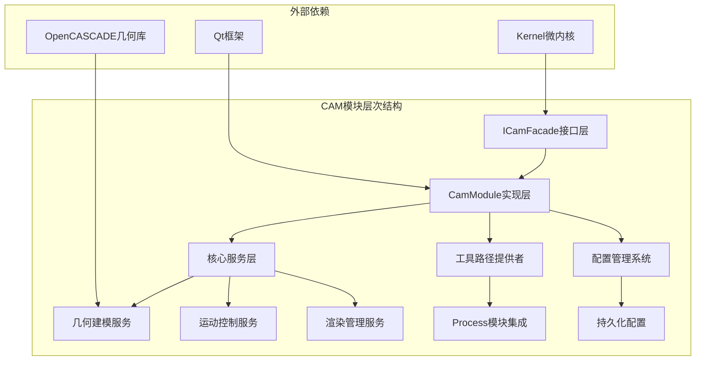
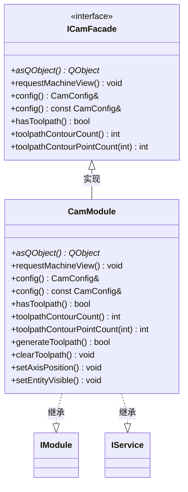
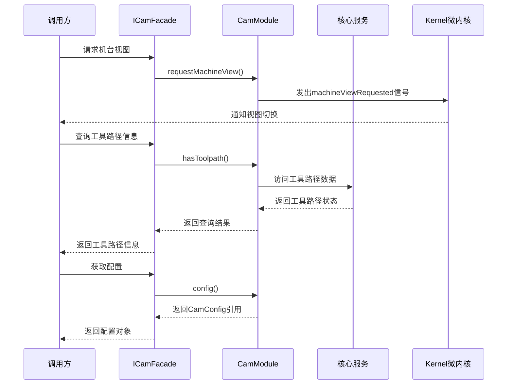
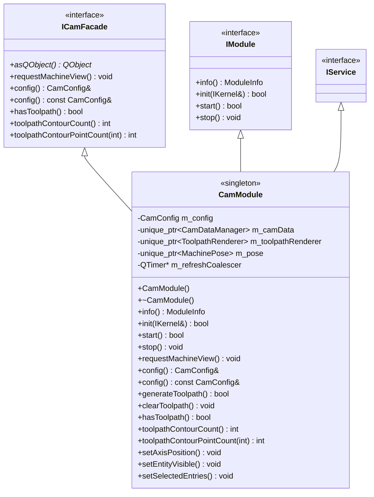
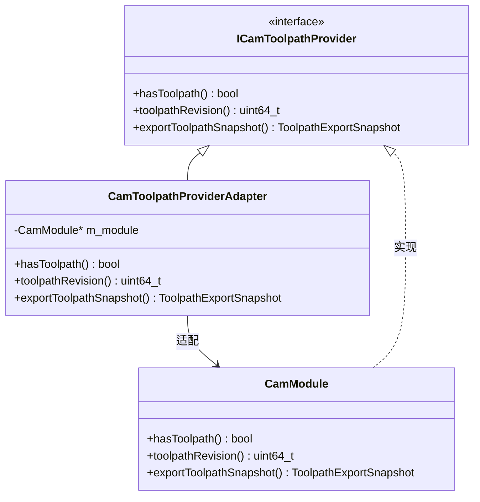
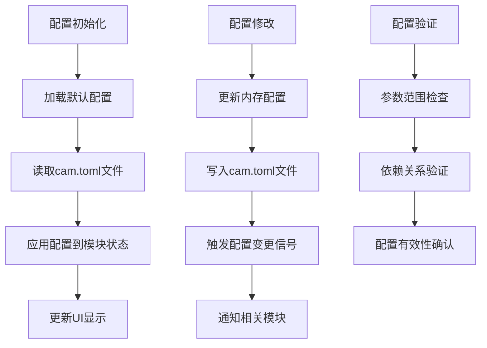
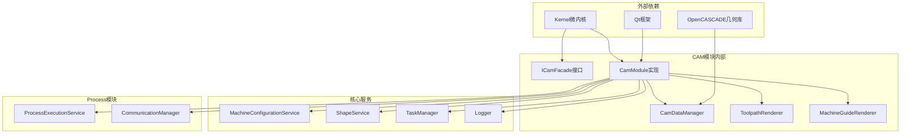
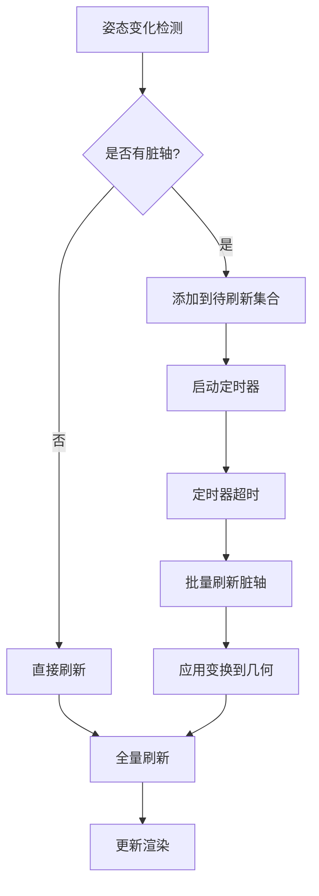

# CAM外观接口设计

<cite>
**本文档引用的文件**
- [i_cam_facade.h](file://src/modules/cam/i_cam_facade.h)
- [cam_module.h](file://src/modules/cam/cam_module.h)
- [cam_module.cpp](file://src/modules/cam/cam_module.cpp)
- [i_cam_toolpath_provider.h](file://src/modules/cam/i_cam_toolpath_provider.h)
- [cam_config.h](file://src/modules/cam/settings/cam_config.h)
- [cam_data_contracts.h](file://src/modules/cam/contracts/cam_data_contracts.h)
- [toolpath_export_dto.h](file://src/modules/cam/contracts/toolpath_export_dto.h)
</cite>

## 目录
1. [引言](#引言)
2. [项目结构](#项目结构)
3. [核心组件](#核心组件)
4. [架构概览](#架构概览)
5. [详细组件分析](#详细组件分析)
6. [依赖关系分析](#依赖关系分析)
7. [性能考虑](#性能考虑)
8. [故障排除指南](#故障排除指南)
9. [结论](#结论)

## 引言

CAM模块外观接口设计是激光切割控制系统中的关键抽象层，它通过外观模式为上层应用提供了统一、简化的访问接口。本文档深入分析了ICamFacade接口的设计理念、对外服务暴露机制以及与核心服务的交互关系。

CAM模块采用外观模式隐藏了内部复杂的几何建模、运动控制和渲染管理等细节，为调用方提供了一个简洁明了的接口。这种设计不仅降低了使用复杂度，还实现了模块间的松耦合通信，提高了系统的可维护性和可扩展性。

## 项目结构

CAM模块位于项目的模块化架构中，采用了清晰的分层组织：

**图表来源**
- [i_cam_facade.h:18-37](file://src/modules/cam/i_cam_facade.h#L18-L37)
- [cam_module.h:64-66](file://src/modules/cam/cam_module.h#L64-L66)

**章节来源**
- [i_cam_facade.h:10-37](file://src/modules/cam/i_cam_facade.h#L10-L37)
- [cam_module.h:44-66](file://src/modules/cam/cam_module.h#L44-L66)

## 核心组件

### ICamFacade接口设计

ICamFacade接口是CAM模块对外暴露的核心接口，采用了最小化设计原则，仅暴露UI/命令最常用的功能：

**图表来源**
- [i_cam_facade.h:18-37](file://src/modules/cam/i_cam_facade.h#L18-L37)
- [cam_module.h:64-66](file://src/modules/cam/cam_module.h#L64-L66)

### 接口方法定义规范

ICamFacade接口定义了以下核心方法：

1. **asQObject()方法**：用于让调用方挂接CamModule的Qt信号
2. **requestMachineView()方法**：切换3D视图至机台工作区
3. **config()方法**：提供模块持有的持久化配置访问
4. **工具路径查询方法**：提供只读的工具路径信息查询

**章节来源**
- [i_cam_facade.h:23-36](file://src/modules/cam/i_cam_facade.h#L23-L36)

## 架构概览

CAM模块采用外观模式实现了统一的对外访问接口：

**图表来源**
- [cam_module.cpp:221-238](file://src/modules/cam/cam_module.cpp#L221-L238)
- [i_cam_facade.h:26-31](file://src/modules/cam/i_cam_facade.h#L26-L31)

### 外观模式实现机制

CAM模块通过以下机制实现外观模式：

1. **单一职责原则**：ICamFacade接口专注于对外服务暴露
2. **隐藏复杂性**：内部复杂的几何建模、运动控制等细节被封装
3. **简化接口**：为调用方提供简化的访问方式
4. **松耦合设计**：通过Kernel微内核实现模块间解耦

**章节来源**
- [cam_module.cpp:221-238](file://src/modules/cam/cam_module.cpp#L221-L238)
- [i_cam_facade.h:12-17](file://src/modules/cam/i_cam_facade.h#L12-L17)

## 详细组件分析

### CamModule类实现

CamModule类是CAM模块的核心实现，继承了多个接口以提供完整的功能：

**图表来源**
- [cam_module.h:64-422](file://src/modules/cam/cam_module.h#L64-L422)
- [i_cam_facade.h:18-37](file://src/modules/cam/i_cam_facade.h#L18-L37)

### 工具路径提供者适配器

CAM模块实现了ICamToolpathProvider接口，为Process模块提供工具路径数据：

**图表来源**
- [i_cam_toolpath_provider.h:11-19](file://src/modules/cam/i_cam_toolpath_provider.h#L11-L19)
- [cam_module.cpp:140-165](file://src/modules/cam/cam_module.cpp#L140-L165)

**章节来源**
- [cam_module.cpp:140-165](file://src/modules/cam/cam_module.cpp#L140-L165)
- [i_cam_toolpath_provider.h:8-19](file://src/modules/cam/i_cam_toolpath_provider.h#L8-L19)

### 配置管理系统

CAM模块通过CamConfig类管理持久化配置：

**图表来源**
- [cam_module.cpp:261-262](file://src/modules/cam/cam_module.cpp#L261-L262)
- [cam_config.h](file://src/modules/cam/settings/cam_config.h)

**章节来源**
- [cam_module.cpp:261-291](file://src/modules/cam/cam_module.cpp#L261-L291)

## 依赖关系分析

CAM模块的依赖关系体现了良好的分层架构：

**图表来源**
- [cam_module.h:13-46](file://src/modules/cam/cam_module.h#L13-L46)
- [cam_module.cpp:1-30](file://src/modules/cam/cam_module.cpp#L1-L30)

### 松耦合通信机制

CAM模块通过以下机制实现模块间的松耦合通信：

1. **Kernel微内核注册**：所有服务通过Kernel进行注册和发现
2. **接口抽象**：通过IService接口实现服务间的解耦
3. **信号槽机制**：Qt的信号槽提供事件驱动的通信方式
4. **配置驱动**：通过CamConfig实现运行时配置的动态调整

**章节来源**
- [cam_module.cpp:221-238](file://src/modules/cam/cam_module.cpp#L221-L238)
- [cam_module.h:108-114](file://src/modules/cam/cam_module.h#L108-L114)

## 性能考虑

CAM模块在设计时充分考虑了性能优化：

### 局部刷新机制

**图表来源**
- [cam_module.cpp:302-322](file://src/modules/cam/cam_module.cpp#L302-L322)
- [cam_module.cpp:2752-2773](file://src/modules/cam/cam_module.cpp#L2752-L2773)

### 工具路径缓存策略

1. **工具路径修订号**：通过toolpathRevision()方法提供版本控制
2. **增量更新**：仅在工具路径发生变化时触发重新计算
3. **预览机制**：支持工具路径的实时预览和验证

**章节来源**
- [cam_module.cpp:2153-2181](file://src/modules/cam/cam_module.cpp#L2153-L2181)
- [cam_module.cpp:2399-2416](file://src/modules/cam/cam_module.cpp#L2399-L2416)

## 故障排除指南

### 常见问题及解决方案

1. **工具路径生成失败**
   - 检查工件几何完整性
   - 验证机台配置正确性
   - 确认几何建模参数设置

2. **视图切换异常**
   - 检查Kernel服务注册状态
   - 验证Qt信号连接有效性
   - 确认GUI上下文可用性

3. **配置加载错误**
   - 检查cam.toml文件格式
   - 验证配置参数范围
   - 确认文件权限设置

**章节来源**
- [cam_module.cpp:771-812](file://src/modules/cam/cam_module.cpp#L771-L812)
- [cam_module.cpp:2063-2069](file://src/modules/cam/cam_module.cpp#L2063-L2069)

## 结论

CAM模块的外观接口设计成功实现了以下目标：

1. **简化复杂性**：通过ICamFacade接口隐藏了内部复杂的几何建模和运动控制逻辑
2. **统一访问**：为调用方提供了统一的对外访问接口
3. **松耦合通信**：通过Kernel微内核和接口抽象实现了模块间的解耦
4. **可扩展性**：支持新的工具路径算法和渲染技术的集成
5. **性能优化**：实现了局部刷新和增量更新等性能优化机制

这种设计不仅提高了系统的可维护性和可扩展性，还为未来的功能扩展奠定了坚实的基础。通过外观模式的应用，CAM模块能够更好地适应不断变化的业务需求和技术发展。