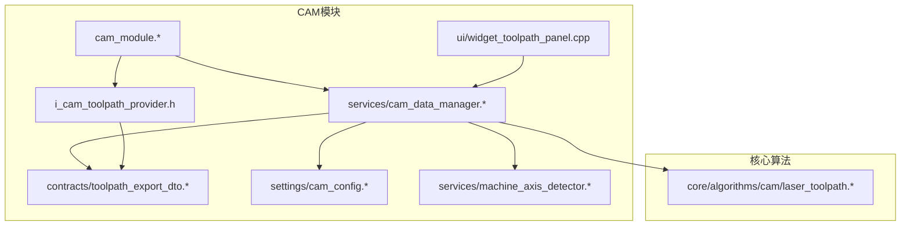
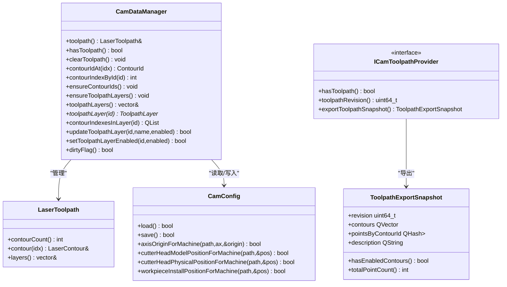
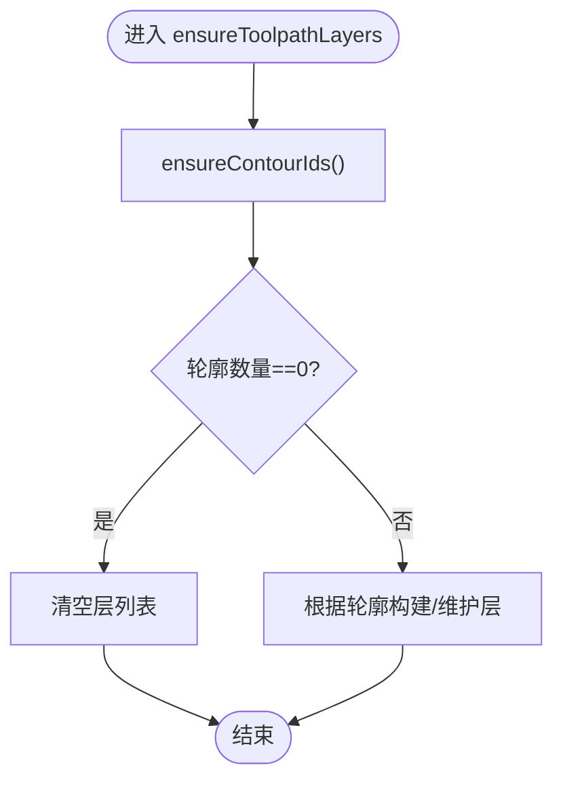
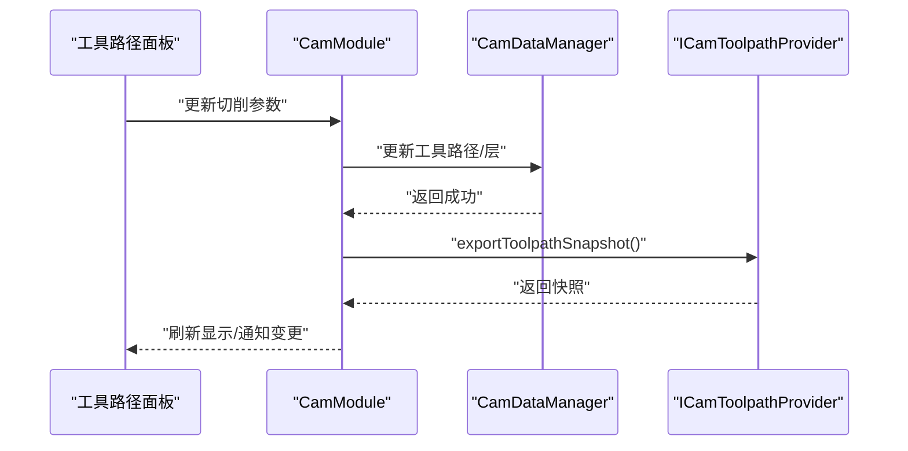
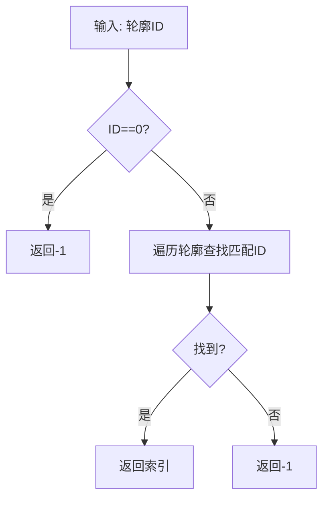
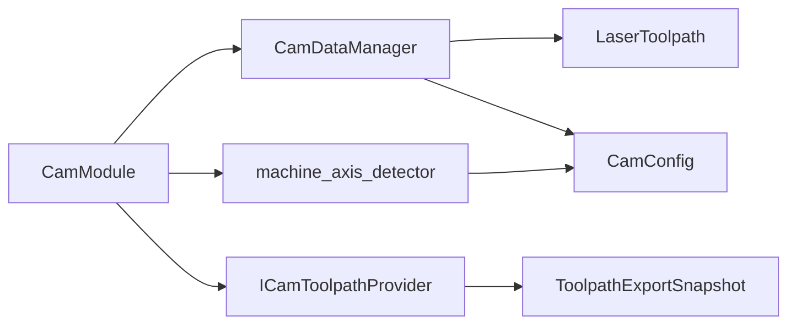

# CAM数据管理服务

<cite>
**本文档引用的文件**
- [cam_data_manager.h](file://src/modules/cam/services/cam_data_manager.h)
- [cam_data_manager.cpp](file://src/modules/cam/services/cam_data_manager.cpp)
- [cam_data_contracts.h](file://src/modules/cam/contracts/cam_data_contracts.h)
- [toolpath_export_dto.h](file://src/modules/cam/contracts/toolpath_export_dto.h)
- [toolpath_export_dto.cpp](file://src/modules/cam/contracts/toolpath_export_dto.cpp)
- [i_cam_toolpath_provider.h](file://src/modules/cam/i_cam_toolpath_provider.h)
- [cam_module.h](file://src/modules/cam/cam_module.h)
- [cam_module.cpp](file://src/modules/cam/cam_module.cpp)
- [machine_axis_detector.h](file://src/modules/cam/services/machine_axis_detector.h)
- [machine_axis_detector.cpp](file://src/modules/cam/services/machine_axis_detector.cpp)
- [cam_config.h](file://src/modules/cam/settings/cam_config.h)
- [cam_config.cpp](file://src/modules/cam/settings/cam_config.cpp)
- [laser_toolpath.h](file://src/core/algorithms/cam/laser_toolpath.h)
- [laser_toolpath.cpp](file://src/core/algorithms/cam/laser_toolpath.cpp)
- [i_cam_facade.h](file://src/modules/cam/i_cam_facade.h)
- [widget_toolpath_panel.cpp](file://src/modules/cam/ui/widget_toolpath_panel.cpp)
</cite>

## 目录
1. [简介](#简介)
2. [项目结构](#项目结构)
3. [核心组件](#核心组件)
4. [架构总览](#架构总览)
5. [详细组件分析](#详细组件分析)
6. [依赖关系分析](#依赖关系分析)
7. [性能考虑](#性能考虑)
8. [故障排除指南](#故障排除指南)
9. [结论](#结论)
10. [附录](#附录)

## 简介
本文件为CAM数据管理服务的技术文档，聚焦于CamDataManager的设计架构与数据存储机制，涵盖刀具数据、工件数据、切削参数的管理策略，以及数据缓存、持久化与同步策略。文档还阐述了数据验证规则、完整性检查与错误处理机制，并提供数据迁移、备份恢复与性能优化的实现方案。

## 项目结构
CAM模块位于src/modules/cam目录下，包含服务层、UI层、设置层与契约层。数据管理核心位于services子目录，围绕CamDataManager组织，配合工具路径导出契约与配置管理，形成完整的CAM数据生命周期管理。

**图表来源**
- [cam_data_manager.h:1-37](file://src/modules/cam/services/cam_data_manager.h#L1-L37)
- [toolpath_export_dto.h:1-66](file://src/modules/cam/contracts/toolpath_export_dto.h#L1-L66)
- [cam_config.h](file://src/modules/cam/settings/cam_config.h)
- [machine_axis_detector.h:1-45](file://src/modules/cam/services/machine_axis_detector.h#L1-L45)
- [laser_toolpath.h](file://src/core/algorithms/cam/laser_toolpath.h)
- [i_cam_toolpath_provider.h:1-21](file://src/modules/cam/i_cam_toolpath_provider.h#L1-L21)
- [cam_module.h:109-134](file://src/modules/cam/cam_module.h#L109-L134)
- [widget_toolpath_panel.cpp:1-37](file://src/modules/cam/ui/widget_toolpath_panel.cpp#L1-L37)

**章节来源**
- [cam_module.h:109-134](file://src/modules/cam/cam_module.h#L109-L134)
- [cam_data_manager.h:1-37](file://src/modules/cam/services/cam_data_manager.h#L1-L37)

## 核心组件
- CamDataManager：项目级CAM运行时数据所有者，负责工具路径、轮廓、层的数据管理与一致性维护。
- Toolpath导出契约：提供OCC无关的工具路径快照，供Process运行时消费。
- CAM配置管理：持久化CAM设置，支持轴配置、路径配置等。
- 机器轴检测器：自动识别轴名称与原点，回填已存储配置。
- 工具路径面板：提供用户交互界面，调整切削参数与显示设置。

**章节来源**
- [cam_data_manager.h:11-37](file://src/modules/cam/services/cam_data_manager.h#L11-L37)
- [toolpath_export_dto.h:52-66](file://src/modules/cam/contracts/toolpath_export_dto.h#L52-L66)
- [cam_config.h](file://src/modules/cam/settings/cam_config.h)
- [machine_axis_detector.h:14-45](file://src/modules/cam/services/machine_axis_detector.h#L14-L45)
- [widget_toolpath_panel.cpp:15-37](file://src/modules/cam/ui/widget_toolpath_panel.cpp#L15-L37)

## 架构总览
CAM数据管理服务采用分层架构：UI层通过CamModule与CamDataManager交互；CamDataManager持有LaserToolpath数据，提供轮廓与层的增删改查；通过ICamToolpathProvider导出OCC无关的工具路径快照；配置通过CamConfig持久化；机器轴检测器在加载阶段完成轴信息的自动识别与回填。

**图表来源**
- [cam_data_manager.h:11-37](file://src/modules/cam/services/cam_data_manager.h#L11-L37)
- [i_cam_toolpath_provider.h:8-21](file://src/modules/cam/i_cam_toolpath_provider.h#L8-L21)
- [toolpath_export_dto.h:52-66](file://src/modules/cam/contracts/toolpath_export_dto.h#L52-L66)
- [cam_config.h](file://src/modules/cam/settings/cam_config.h)
- [laser_toolpath.h](file://src/core/algorithms/cam/laser_toolpath.h)

## 详细组件分析

### CamDataManager设计与数据存储机制
- 数据模型
  - 工具路径：由LaserToolpath承载，包含轮廓数组与层列表。
  - 轮廓：每个轮廓有唯一ID、源形状、采样点等属性。
  - 层：工具路径分层管理，便于启用/禁用与批量操作。
- 关键方法
  - 清空工具路径：重置轮廓与层，更新脏标记。
  - 轮廓ID管理：确保轮廓ID唯一性，自动生成缺失ID并维护下一个可用ID。
  - 层管理：确保轮廓ID后执行层一致性维护，空轮廓时清空层。
  - 查询与索引：按索引获取轮廓ID、按ID查找索引，按层ID获取轮廓索引列表。
  - 层更新：支持重命名、启用/禁用层。
- 数据一致性
  - 通过ensureContourIds与ensureToolpathLayers保证数据结构一致性。
  - 脏标记用于触发后续持久化或渲染更新。

**图表来源**
- [cam_data_manager.cpp:37-55](file://src/modules/cam/services/cam_data_manager.cpp#L37-L55)

**章节来源**
- [cam_data_manager.h:11-37](file://src/modules/cam/services/cam_data_manager.h#L11-L37)
- [cam_data_manager.cpp:9-55](file://src/modules/cam/services/cam_data_manager.cpp#L9-L55)

### 刀具数据管理策略
- 刀具数据通过工具路径导出契约中的元数据传递，包含轮廓ID、层ID、工具名称等。
- CamDataManager不直接存储刀具实体，而是通过导出快照携带所需信息，确保与Process运行时解耦。
- 刀具参数变更通过上层命令或UI触发，CamDataManager更新工具路径后导出新快照。

**章节来源**
- [toolpath_export_dto.h:36-51](file://src/modules/cam/contracts/toolpath_export_dto.h#L36-L51)
- [i_cam_toolpath_provider.h:8-21](file://src/modules/cam/i_cam_toolpath_provider.h#L8-L21)

### 工件数据与切削参数管理
- 工件数据：通过轮廓的源形状与几何信息体现；CamModule在计算工具路径时可选择工作件形状或轮廓源形状。
- 切削参数：通过UI面板与配置系统共同管理，CamModule在生成工具路径时应用参数，CamDataManager负责保存与导出。

**图表来源**
- [widget_toolpath_panel.cpp:15-37](file://src/modules/cam/ui/widget_toolpath_panel.cpp#L15-L37)
- [cam_module.cpp:2497-2510](file://src/modules/cam/cam_module.cpp#L2497-L2510)
- [i_cam_toolpath_provider.h:8-21](file://src/modules/cam/i_cam_toolpath_provider.h#L8-L21)

**章节来源**
- [cam_module.cpp:2497-2510](file://src/modules/cam/cam_module.cpp#L2497-L2510)
- [widget_toolpath_panel.cpp:15-37](file://src/modules/cam/ui/widget_toolpath_panel.cpp#L15-L37)

### 数据缓存机制
- 运行时缓存：CamDataManager持有LaserToolpath作为主要缓存，避免频繁重建。
- 快照缓存：ToolpathExportSnapshot作为不可变快照，供Process运行时稳定消费。
- 脏标记：当数据发生变更时设置脏标记，驱动后续持久化或渲染刷新。

**章节来源**
- [cam_data_manager.h:20-37](file://src/modules/cam/services/cam_data_manager.h#L20-L37)
- [toolpath_export_dto.h:52-66](file://src/modules/cam/contracts/toolpath_export_dto.h#L52-L66)

### 持久化方案
- 配置持久化：CamConfig负责CAM设置的加载与保存，包括轴原点、切割头位置、工件安装位置等。
- 项目数据：CamModule在需要时将稀疏几何镜像到CAM文档，但密集点阵保留在CamDataManager中，避免OCAF膨胀。
- 导出接口：通过ICamToolpathProvider导出OCC无关快照，便于跨模块共享。

**章节来源**
- [cam_config.h](file://src/modules/cam/settings/cam_config.h)
- [cam_config.cpp](file://src/modules/cam/settings/cam_config.cpp)
- [cam_module.h:115-118](file://src/modules/cam/cam_module.h#L115-L118)

### 数据同步策略
- 事件通知：CamModule在修改工具路径后发出信号，通知项目管理器与渲染器更新。
- 版本控制：ToolpathExportSnapshot包含修订号，用于Process侧判断数据新鲜度。
- 一致性保障：ensureContourIds与ensureToolpathLayers在关键操作前后执行，确保数据结构一致。

**章节来源**
- [cam_module.cpp:2492-2495](file://src/modules/cam/cam_module.cpp#L2492-L2495)
- [toolpath_export_dto.h:52-66](file://src/modules/cam/contracts/toolpath_export_dto.h#L52-L66)
- [cam_data_manager.cpp:37-55](file://src/modules/cam/services/cam_data_manager.cpp#L37-L55)

### 数据验证规则与完整性检查
- 轮廓ID有效性：contourIndexById对无效ID返回-1，防止越界访问。
- 空轮廓处理：ensureToolpathLayers在无轮廓时清空层，避免悬挂状态。
- 快照完整性：hasEnabledContours与totalPointCount提供快速完整性检查。

**图表来源**
- [cam_data_manager.cpp:25-35](file://src/modules/cam/services/cam_data_manager.cpp#L25-L35)

**章节来源**
- [cam_data_manager.cpp:17-35](file://src/modules/cam/services/cam_data_manager.cpp#L17-L35)
- [toolpath_export_dto.cpp:5-22](file://src/modules/cam/contracts/toolpath_export_dto.cpp#L5-L22)

### 错误处理机制
- 边界检查：索引访问前进行范围检查，越界返回安全值。
- 空指针保护：涉及外部对象的方法对空指针进行前置校验。
- 导出校验：hasEnabledContours确保至少存在一个启用且有效的轮廓，避免空快照导致运行时异常。

**章节来源**
- [cam_data_manager.cpp:17-35](file://src/modules/cam/services/cam_data_manager.cpp#L17-L35)
- [toolpath_export_dto.cpp:5-12](file://src/modules/cam/contracts/toolpath_export_dto.cpp#L5-L12)

### 数据迁移、备份与恢复
- 配置迁移：CamConfig提供load/save接口，支持版本升级时的字段映射与默认值填充。
- 备份建议：定期导出ToolpathExportSnapshot作为离线备份，结合项目文件进行整体备份。
- 恢复流程：通过CamConfig.load恢复CAM设置；通过重新生成工具路径恢复数据一致性。

**章节来源**
- [cam_config.h](file://src/modules/cam/settings/cam_config.h)
- [cam_config.cpp](file://src/modules/cam/settings/cam_config.cpp)
- [toolpath_export_dto.h:52-66](file://src/modules/cam/contracts/toolpath_export_dto.h#L52-L66)

## 依赖关系分析
- CamDataManager依赖LaserToolpath与CamConfig，通过ICamToolpathProvider向Process模块提供导出快照。
- CamModule协调UI、数据与渲染，通过信号与事件驱动数据变更。
- 机器轴检测器在加载阶段读取文档与配置，写回运动学与配置，不依赖GUI。

**图表来源**
- [cam_module.h:109-134](file://src/modules/cam/cam_module.h#L109-L134)
- [cam_data_manager.h:11-37](file://src/modules/cam/services/cam_data_manager.h#L11-L37)
- [i_cam_toolpath_provider.h:8-21](file://src/modules/cam/i_cam_toolpath_provider.h#L8-L21)
- [machine_axis_detector.h:14-45](file://src/modules/cam/services/machine_axis_detector.h#L14-L45)

**章节来源**
- [cam_module.h:109-134](file://src/modules/cam/cam_module.h#L109-L134)
- [machine_axis_detector.h:14-45](file://src/modules/cam/services/machine_axis_detector.h#L14-L45)

## 性能考虑
- 数据结构优化：LaserToolpath采用紧凑存储，减少内存占用与拷贝开销。
- 批量操作：ensureToolpathLayers在一次操作中完成轮廓ID与层的一致性维护，避免多次扫描。
- 导出快照：ToolpathExportSnapshot为不可变结构，便于并发读取与缓存复用。
- 渲染分离：密集点阵与稀疏几何分离，降低OCAF负担，提升渲染性能。

## 故障排除指南
- 工具路径为空：检查hasToolpath与contourCount，确认是否正确生成工具路径。
- 轮廓ID不唯一：调用ensureContourIds确保ID生成与更新。
- 层状态异常：使用ensureToolpathLayers清理无效层，或通过updateToolpathLayer重置层属性。
- 导出失败：确认hasEnabledContours为真，确保至少存在一个有效轮廓。

**章节来源**
- [cam_data_manager.cpp:9-55](file://src/modules/cam/services/cam_data_manager.cpp#L9-L55)
- [toolpath_export_dto.cpp:5-22](file://src/modules/cam/contracts/toolpath_export_dto.cpp#L5-L22)

## 结论
CamDataManager通过清晰的数据模型与严格的生命周期管理，实现了CAM数据的高效存储与导出。结合ICamToolpathProvider与CamConfig，系统在保证数据一致性的同时，提供了良好的扩展性与运行时稳定性。通过合理的缓存与同步策略，能够满足复杂CAM场景下的性能与可靠性要求。

## 附录
- 相关接口与类型定义可参考以下文件：
  - [cam_data_contracts.h](file://src/modules/cam/contracts/cam_data_contracts.h)
  - [laser_toolpath.h](file://src/core/algorithms/cam/laser_toolpath.h)
  - [i_cam_facade.h:1-39](file://src/modules/cam/i_cam_facade.h#L1-L39)