# CAM模块设计

<cite>
**本文档引用的文件**
- [i_cam_facade.h](file://src/modules/cam/i_cam_facade.h)
- [cam_data_manager.h](file://src/modules/cam/services/cam_data_manager.h)
- [machine_axis_detector.h](file://src/modules/cam/services/machine_axis_detector.h)
- [laser_toolpath.h](file://src/core/algorithms/cam/laser_toolpath.h)
- [face_classifier.h](file://src/core/algorithms/cam/face_classifier.h)
- [cam_module.h](file://src/modules/cam/cam_module.h)
- [commands_cam.h](file://src/modules/cam/commands/commands_cam.h)
- [cam_config.h](file://src/modules/cam/settings/cam_config.h)
- [toolpath_export_dto.h](file://src/modules/cam/contracts/toolpath_export_dto.h)
- [lcnc_document.h](file://src/core/document/lcnc_document.h)
- [kernel.h](file://src/core/kernel/kernel.h)
- [service_registry.h](file://src/core/kernel/service_registry.h)
</cite>

## 目录
1. [引言](#引言)
2. [项目结构](#项目结构)
3. [核心组件](#核心组件)
4. [架构总览](#架构总览)
5. [详细组件分析](#详细组件分析)
6. [依赖关系分析](#依赖关系分析)
7. [性能考虑](#性能考虑)
8. [故障排除指南](#故障排除指南)
9. [结论](#结论)
10. [附录](#附录)

## 引言
本设计文档面向LaserCNC的CAM（Computer Aided Manufacturing）模块，系统性阐述其核心职责与技术实现，包括：
- 刀具路径生成：激光刀路算法、面分类器、参考点检测
- 切削参数设置：基于配置的服务化参数管理
- 后处理器与G代码输出：导出DTO与后续处理流程
- 对外服务暴露：ICamFacade接口设计与模块集成
- 数据管理：CamDataManager、MachineAxisDetector等核心服务
- 扩展开发：新刀路算法集成与参数优化方法

本文件旨在帮助开发者快速理解CAM模块的架构与实现，并为二次开发提供清晰的指导。

## 项目结构
CAM模块位于src/modules/cam目录下，采用分层组织：
- contracts：对外契约与数据传输对象（DTO）
- services：核心业务服务（数据管理、轴检测、IO等）
- settings：CAM配置项
- commands：命令层（与UI交互）
- ui：界面组件
- i_cam_facade.h：对外接口契约
- cam_module.h：模块装配入口

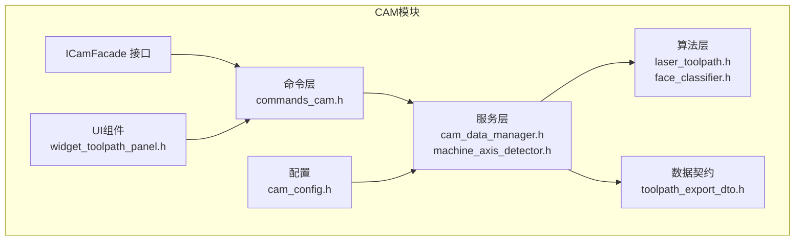

**图表来源**
- [i_cam_facade.h](file://src/modules/cam/i_cam_facade.h)
- [commands_cam.h](file://src/modules/cam/commands/commands_cam.h)
- [cam_data_manager.h](file://src/modules/cam/services/cam_data_manager.h)
- [machine_axis_detector.h](file://src/modules/cam/services/machine_axis_detector.h)
- [laser_toolpath.h](file://src/core/algorithms/cam/laser_toolpath.h)
- [face_classifier.h](file://src/core/algorithms/cam/face_classifier.h)
- [toolpath_export_dto.h](file://src/modules/cam/contracts/toolpath_export_dto.h)
- [cam_config.h](file://src/modules/cam/settings/cam_config.h)

**章节来源**
- [i_cam_facade.h](file://src/modules/cam/i_cam_facade.h)
- [cam_module.h](file://src/modules/cam/cam_module.h)

## 核心组件
- ICamFacade：CAM模块对外统一接口，定义路径生成、参数设置、导出等能力契约，供上层UI与命令层调用。
- CamDataManager：负责CAM文档数据的加载、缓存、变更通知与持久化协调，确保算法与UI共享一致的数据视图。
- MachineAxisDetector：识别机台坐标系与运动轴映射，为路径规划提供几何约束。
- 激光刀路算法：基于面分类与几何特征，生成激光加工轨迹。
- 面分类器：对CAD几何进行分类，确定可加工面与加工策略。
- 参考点检测：辅助定位与对齐，提升路径精度。
- 配置系统：集中管理切削参数、路径策略等配置项。
- 导出DTO：标准化刀路数据结构，便于后处理与G代码生成。

**章节来源**
- [i_cam_facade.h](file://src/modules/cam/i_cam_facade.h)
- [cam_data_manager.h](file://src/modules/cam/services/cam_data_manager.h)
- [machine_axis_detector.h](file://src/modules/cam/services/machine_axis_detector.h)
- [laser_toolpath.h](file://src/core/algorithms/cam/laser_toolpath.h)
- [face_classifier.h](file://src/core/algorithms/cam/face_classifier.h)
- [cam_config.h](file://src/modules/cam/settings/cam_config.h)
- [toolpath_export_dto.h](file://src/modules/cam/contracts/toolpath_export_dto.h)

## 架构总览
CAM模块遵循“接口契约—命令层—服务层—算法层”的分层架构，通过Kernel的服务注册机制完成模块装配与依赖注入。

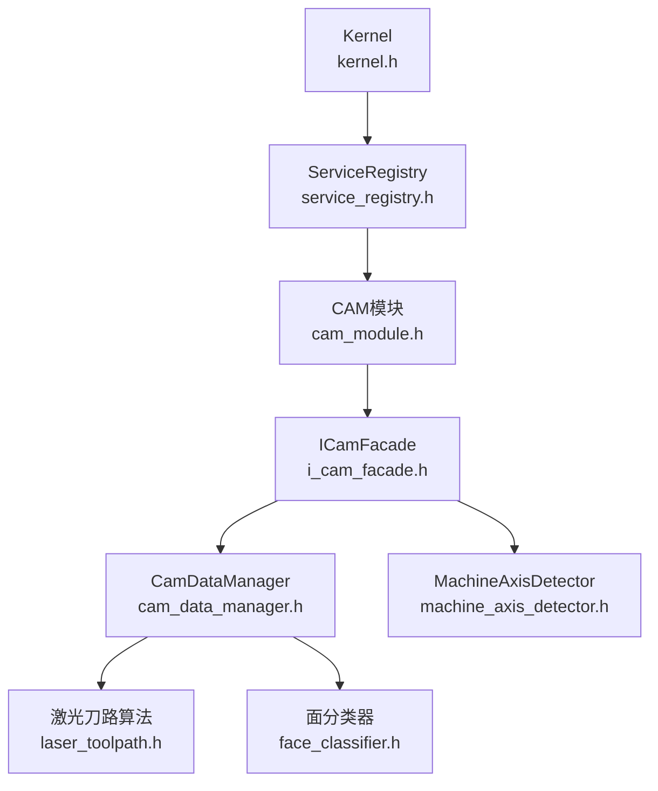

**图表来源**
- [kernel.h](file://src/core/kernel/kernel.h)
- [service_registry.h](file://src/core/kernel/service_registry.h)
- [cam_module.h](file://src/modules/cam/cam_module.h)
- [i_cam_facade.h](file://src/modules/cam/i_cam_facade.h)
- [cam_data_manager.h](file://src/modules/cam/services/cam_data_manager.h)
- [machine_axis_detector.h](file://src/modules/cam/services/machine_axis_detector.h)
- [laser_toolpath.h](file://src/core/algorithms/cam/laser_toolpath.h)
- [face_classifier.h](file://src/core/algorithms/cam/face_classifier.h)

## 详细组件分析

### ICamFacade接口设计与对外服务暴露
- 职责边界：定义CAM功能的最小可用集合，包括路径生成触发、参数设置、导出请求等。
- 服务暴露：通过Kernel的服务注册机制在运行时提供；命令层与UI层仅依赖该接口，降低耦合。
- 版本演进：接口稳定，新增能力以扩展方法或配置项形式存在，避免破坏性变更。

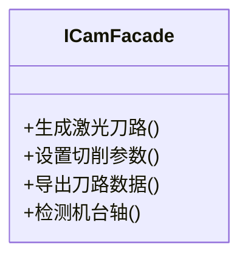

**图表来源**
- [i_cam_facade.h](file://src/modules/cam/i_cam_facade.h)

**章节来源**
- [i_cam_facade.h](file://src/modules/cam/i_cam_facade.h)

### CamDataManager数据管理机制
- 数据来源：从LCNC文档中提取几何与属性信息，构建CAM内部数据模型。
- 缓存策略：对计算结果与中间状态进行缓存，减少重复计算。
- 变更通知：监听文档变化，触发增量更新与失效，保证UI与算法一致性。
- 状态管理：维护当前选中几何、加工策略、参数集等状态，支持撤销/重做。

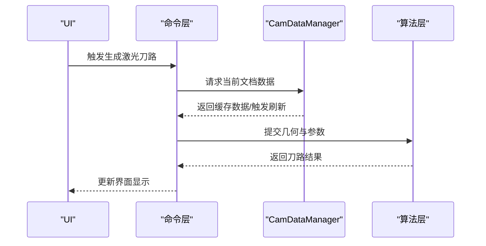

**图表来源**
- [cam_data_manager.h](file://src/modules/cam/services/cam_data_manager.h)
- [laser_toolpath.h](file://src/core/algorithms/cam/laser_toolpath.h)
- [lcnc_document.h](file://src/core/document/lcnc_document.h)

**章节来源**
- [cam_data_manager.h](file://src/modules/cam/services/cam_data_manager.h)
- [lcnc_document.h](file://src/core/document/lcnc_document.h)

### MachineAxisDetector轴检测与几何约束
- 输入：CAD几何、机台配置、参考点信息。
- 输出：坐标系变换矩阵、轴映射关系、运动约束。
- 应用：为路径规划提供全局几何框架，确保刀路与机台运动学一致。

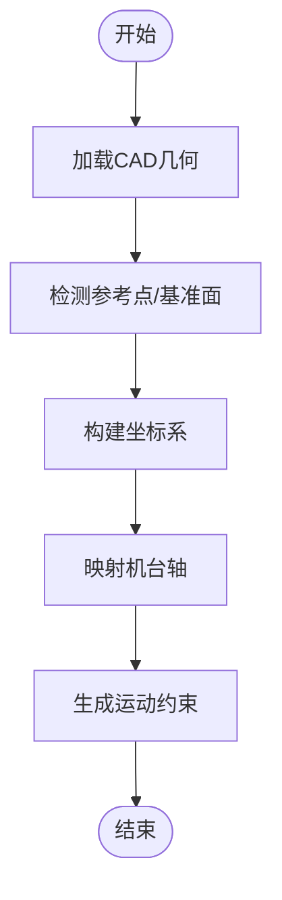

**图表来源**
- [machine_axis_detector.h](file://src/modules/cam/services/machine_axis_detector.h)

**章节来源**
- [machine_axis_detector.h](file://src/modules/cam/services/machine_axis_detector.h)

### 激光刀具路径生成算法
- 输入：分类后的可加工面、切削参数、机台坐标系。
- 处理：根据面类型与几何特征生成连续路径序列，考虑拐角、重叠与速度/加速度限制。
- 输出：刀路轨迹序列，用于后续导出与可视化。

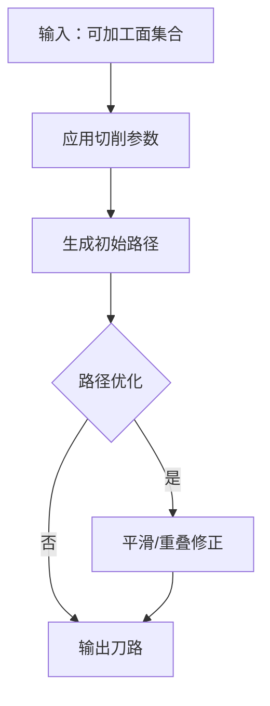

**图表来源**
- [laser_toolpath.h](file://src/core/algorithms/cam/laser_toolpath.h)

**章节来源**
- [laser_toolpath.h](file://src/core/algorithms/cam/laser_toolpath.h)

### 面分类器与参考点检测
- 面分类器：对CAD几何按加工特性进行分类，决定是否参与激光加工及加工策略。
- 参考点检测：自动识别基准点/线/面，作为坐标系原点与方向的依据，提高路径精度与可重复性。

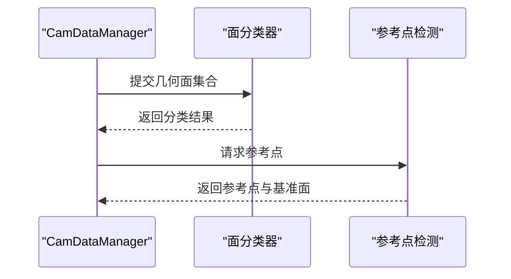

**图表来源**
- [face_classifier.h](file://src/core/algorithms/cam/face_classifier.h)
- [cam_data_manager.h](file://src/modules/cam/services/cam_data_manager.h)

**章节来源**
- [face_classifier.h](file://src/core/algorithms/cam/face_classifier.h)

### CAM文档数据结构与状态管理
- 文档模型：LCNC文档承载几何、属性与元数据，CAM模块通过只读访问与事件订阅参与协作。
- 状态机：维护当前操作状态（空闲/生成中/导出中），控制UI交互与命令可用性。
- 并发安全：通过服务层封装并发访问，避免UI与后台任务竞争资源。

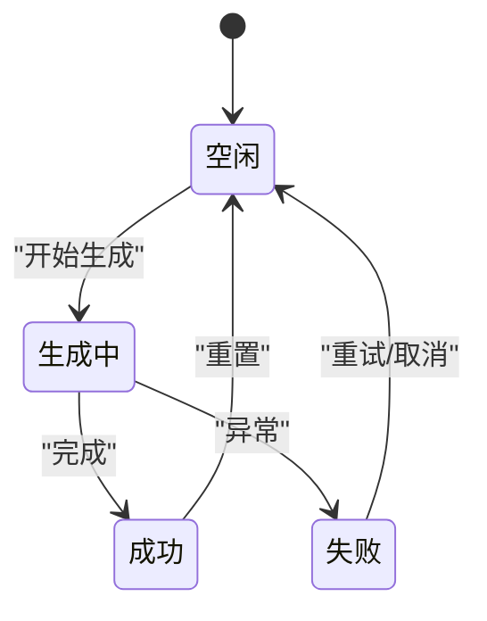

**图表来源**
- [lcnc_document.h](file://src/core/document/lcnc_document.h)

**章节来源**
- [lcnc_document.h](file://src/core/document/lcnc_document.h)

### 命令层与UI集成
- 命令层：封装用户操作（如“生成激光刀路”、“设置参数”、“导出”），协调服务层与UI反馈。
- UI组件：工具面板与任务面板展示状态、进度与结果，支持参数调整与预览。

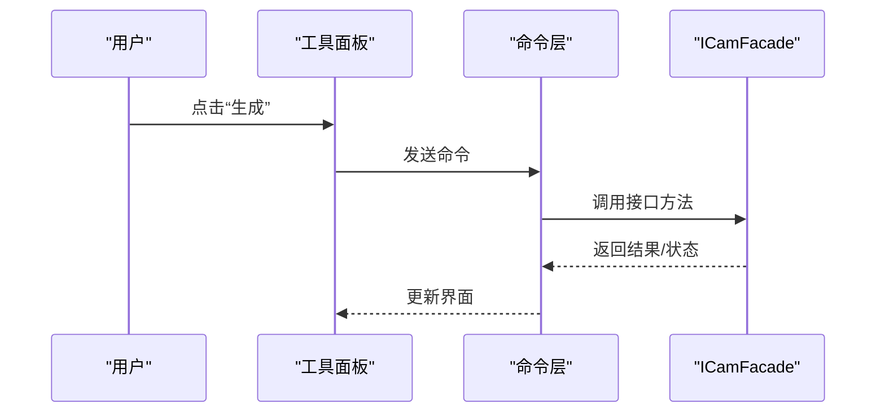

**图表来源**
- [commands_cam.h](file://src/modules/cam/commands/commands_cam.h)
- [i_cam_facade.h](file://src/modules/cam/i_cam_facade.h)

**章节来源**
- [commands_cam.h](file://src/modules/cam/commands/commands_cam.h)

### 后处理器与G代码输出
- 导出DTO：标准化刀路数据结构，包含路径点、速度、功率等切削信息。
- 后处理：由外部后处理器将DTO转换为具体机台的G代码格式。
- 流程：命令层发起导出请求，服务层准备数据，DTO传递给后处理器。

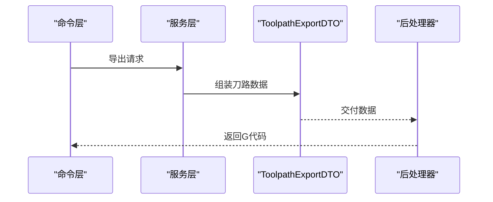

**图表来源**
- [toolpath_export_dto.h](file://src/modules/cam/contracts/toolpath_export_dto.h)
- [commands_cam.h](file://src/modules/cam/commands/commands_cam.h)

**章节来源**
- [toolpath_export_dto.h](file://src/modules/cam/contracts/toolpath_export_dto.h)

## 依赖关系分析
- 内聚性：各层职责明确，算法与UI解耦，服务层承担协调与缓存。
- 耦合度：命令层与UI依赖ICamFacade；服务层依赖算法层；算法层依赖几何与配置。
- 外部依赖：依赖Kernel的服务注册机制与文档模型。

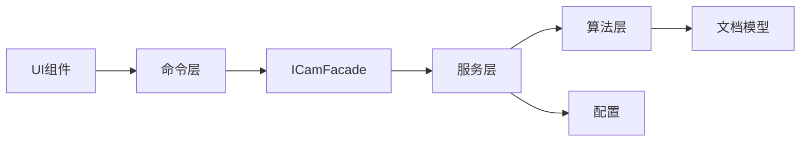

**图表来源**
- [i_cam_facade.h](file://src/modules/cam/i_cam_facade.h)
- [cam_data_manager.h](file://src/modules/cam/services/cam_data_manager.h)
- [laser_toolpath.h](file://src/core/algorithms/cam/laser_toolpath.h)
- [cam_config.h](file://src/modules/cam/settings/cam_config.h)
- [lcnc_document.h](file://src/core/document/lcnc_document.h)

**章节来源**
- [kernel.h](file://src/core/kernel/kernel.h)
- [service_registry.h](file://src/core/kernel/service_registry.h)

## 性能考虑
- 缓存策略：对几何查询、分类结果与路径计算结果进行缓存，避免重复计算。
- 增量更新：监听文档变更，仅对受影响区域重新计算，降低CPU与内存占用。
- 并行化：在不破坏数据一致性的前提下，将独立路径的计算并行化。
- I/O优化：批量导出与流式写入，减少磁盘压力。

## 故障排除指南
- 生成失败：检查几何完整性与参数合理性；查看服务层日志与错误码。
- 路径异常：确认参考点检测结果与坐标系一致性；验证轴映射正确性。
- 导出失败：核对DTO字段完整性与后处理器兼容性。
- 性能问题：启用增量更新与缓存；避免频繁全量重算。

## 结论
CAM模块通过清晰的分层架构与稳定的接口契约，实现了从几何到刀路再到G代码输出的完整链路。CamDataManager与MachineAxisDetector为核心服务，保障了数据一致性与几何约束的正确性。激光刀路算法与面分类器提供了高效的加工路径生成能力。建议在扩展新算法时遵循现有接口与数据契约，确保与模块整体风格一致。

## 附录
- 开发建议：新算法应提供可配置参数与可视化预览，便于调试与优化。
- 参数优化：结合实测数据迭代切削参数，关注速度、功率与路径密度的平衡。
- 集成步骤：实现算法接口→注册为服务→在命令层接入→完善UI与导出流程。