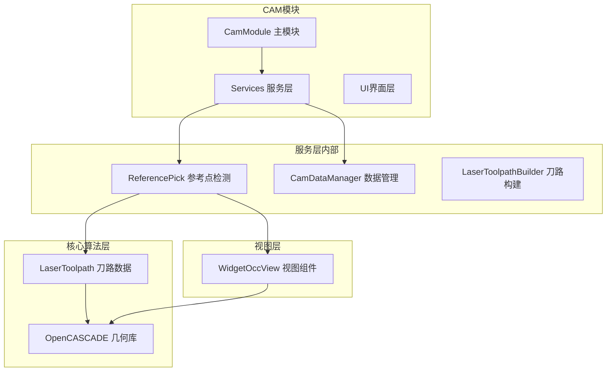
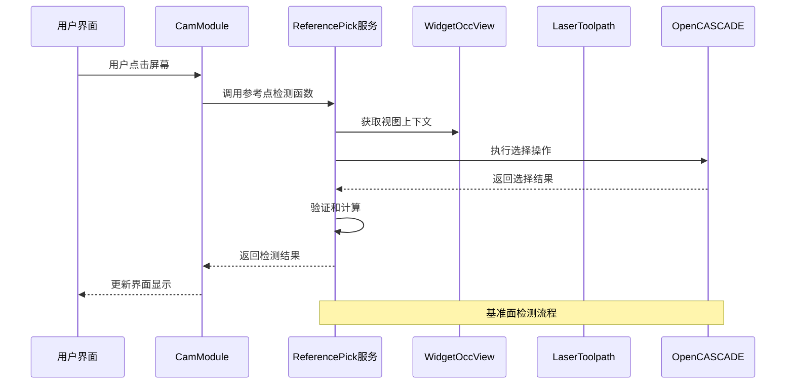
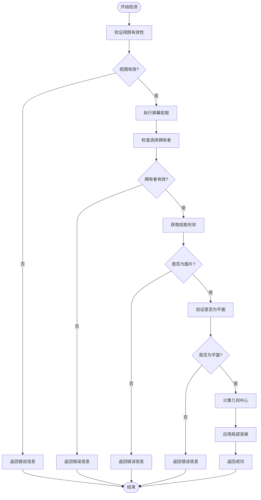
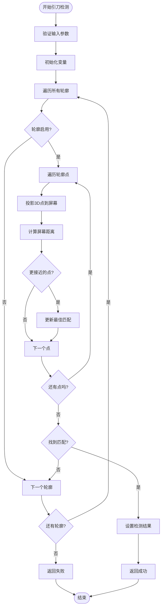
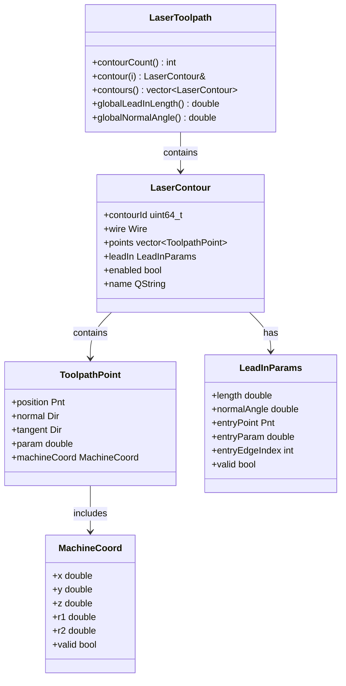
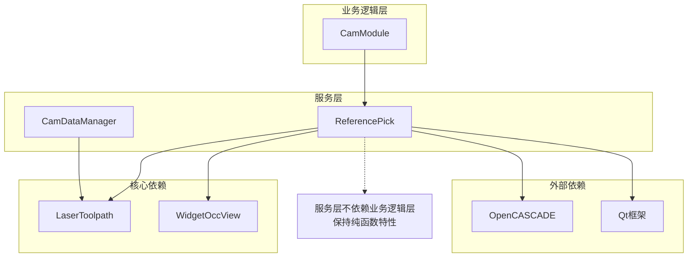

# 参考点检测服务

<cite>
**本文档引用的文件**
- [reference_pick.h](file://src/modules/cam/services/reference_pick.h)
- [reference_pick.cpp](file://src/modules/cam/services/reference_pick.cpp)
- [laser_toolpath.h](file://src/core/algorithms/cam/laser_toolpath.h)
- [widget_occ_view.h](file://src/view/widget_occ_view.h)
- [cam_module.cpp](file://src/modules/cam/cam_module.cpp)
- [cam_data_manager.h](file://src/modules/cam/services/cam_data_manager.h)
</cite>

## 目录
1. [简介](#简介)
2. [项目结构](#项目结构)
3. [核心组件](#核心组件)
4. [架构概览](#架构概览)
5. [详细组件分析](#详细组件分析)
6. [依赖关系分析](#依赖关系分析)
7. [性能考虑](#性能考虑)
8. [故障排除指南](#故障排除指南)
9. [结论](#结论)

## 简介

参考点检测服务是CAM模块中的一个关键功能，专门用于在激光切割加工过程中进行精确的参考点定位。该服务提供了两种主要的检测能力：

1. **基准面中心检测**：通过屏幕坐标拾取OpenCASCADE模型中的平面面片，计算并返回其几何中心点
2. **引刀点检测**：在激光刀路路径上寻找距离屏幕点击位置最近的采样点，用于引刀线的精确定位

该服务采用纯函数设计，不修改任何外部状态，所有错误信息通过输出参数返回，确保了良好的可测试性和可维护性。

## 项目结构

参考点检测服务位于CAM模块的服务层中，与核心算法、视图组件和主模块形成清晰的分层架构：



**图表来源**
- [cam_module.cpp:2060-2069](file://src/modules/cam/cam_module.cpp#L2060-L2069)
- [reference_pick.cpp:34-79](file://src/modules/cam/services/reference_pick.cpp#L34-L79)

**章节来源**
- [reference_pick.h:1-37](file://src/modules/cam/services/reference_pick.h#L1-L37)
- [reference_pick.cpp:1-131](file://src/modules/cam/services/reference_pick.cpp#L1-L131)

## 核心组件

### ReferencePick 服务接口

ReferencePick服务提供了两个核心函数，分别处理不同的检测需求：

#### 基准面中心检测函数
```cpp
bool resolveReferencePlaneCenter(WidgetOccView* occView,
                                const QPoint& screenPos,
                                gp_Pnt& center,
                                QString* errorMessage = nullptr);
```

该函数负责：
- 验证OpenCASCADE视图的有效性
- 执行屏幕坐标到3D空间的选择操作
- 验证拾取对象是否为平面面片
- 计算平面的几何中心
- 应用局部变换以获得正确的世界坐标

#### 引刀点检测函数
```cpp
bool resolveLeadInHit(WidgetOccView* occView,
                     const QPoint& screenPos,
                     const LaserToolpath& toolpath,
                     int& contourIdx,
                     gp_Pnt& entryPoint,
                     double& entryParam);
```

该函数负责：
- 遍历所有启用的刀路轮廓
- 将3D刀路点投影到屏幕坐标
- 计算屏幕距离并寻找最近点
- 返回最接近的引刀点及其参数

**章节来源**
- [reference_pick.h:20-35](file://src/modules/cam/services/reference_pick.h#L20-L35)
- [reference_pick.cpp:34-128](file://src/modules/cam/services/reference_pick.cpp#L34-L128)

## 架构概览

参考点检测服务采用分层架构设计，确保了良好的关注点分离：



**图表来源**
- [cam_module.cpp:2063-2068](file://src/modules/cam/cam_module.cpp#L2063-L2068)
- [reference_pick.cpp:34-79](file://src/modules/cam/services/reference_pick.cpp#L34-L79)

**章节来源**
- [cam_module.cpp:2060-2069](file://src/modules/cam/cam_module.cpp#L2060-L2069)
- [reference_pick.cpp:25-32](file://src/modules/cam/services/reference_pick.cpp#L25-L32)

## 详细组件分析

### 基准面中心检测算法

基准面中心检测是参考点检测服务的核心功能之一，其算法流程如下：



**图表来源**
- [reference_pick.cpp:34-79](file://src/modules/cam/services/reference_pick.cpp#L34-L79)

#### 算法实现细节

1. **视图验证阶段**：检查WidgetOccView及其相关句柄的有效性
2. **选择执行阶段**：使用AIS_InteractiveContext的MoveTo方法执行屏幕拾取
3. **类型验证阶段**：确保拾取对象是TopAbs_FACE类型的面片
4. **几何验证阶段**：验证面片类型为GeomAbs_Plane的平面
5. **中心计算阶段**：使用BRepGProp计算平面的几何中心
6. **坐标变换阶段**：应用局部变换以获得正确的世界坐标

**章节来源**
- [reference_pick.cpp:34-79](file://src/modules/cam/services/reference_pick.cpp#L34-L79)

### 引刀点检测算法

引刀点检测算法专注于在激光刀路中寻找最佳的引刀接触点：



**图表来源**
- [reference_pick.cpp:81-128](file://src/modules/cam/services/reference_pick.cpp#L81-L128)

#### 算法实现细节

1. **距离阈值控制**：使用24像素的屏幕距离阈值，确保用户点击的准确性
2. **最优匹配策略**：通过遍历所有启用的轮廓和点，寻找屏幕距离最小的匹配
3. **投影计算**：使用V3d_View的Convert方法将3D坐标投影到2D屏幕坐标
4. **参数返回**：同时返回轮廓索引、接触点坐标和曲线参数

**章节来源**
- [reference_pick.cpp:81-128](file://src/modules/cam/services/reference_pick.cpp#L81-L128)

### 数据结构设计

参考点检测服务涉及多个关键的数据结构：



**图表来源**
- [laser_toolpath.h:91-208](file://src/core/algorithms/cam/laser_toolpath.h#L91-L208)

**章节来源**
- [laser_toolpath.h:25-208](file://src/core/algorithms/cam/laser_toolpath.h#L25-L208)

## 依赖关系分析

参考点检测服务的依赖关系体现了清晰的分层架构：



**图表来源**
- [reference_pick.cpp:1-24](file://src/modules/cam/services/reference_pick.cpp#L1-L24)
- [cam_module.cpp:2063-2068](file://src/modules/cam/cam_module.cpp#L2063-L2068)

### 组件耦合分析

参考点检测服务具有以下特点：

1. **低耦合设计**：服务层独立于业务逻辑层，通过清晰的接口进行交互
2. **单向依赖**：业务逻辑层依赖服务层，但服务层不依赖业务逻辑层
3. **接口隔离**：每个组件都有明确的职责边界和接口定义

**章节来源**
- [reference_pick.cpp:1-24](file://src/modules/cam/services/reference_pick.cpp#L1-L24)
- [cam_module.cpp:2060-2069](file://src/modules/cam/cam_module.cpp#L2060-L2069)

## 性能考虑

参考点检测服务在设计时充分考虑了性能优化：

### 时间复杂度分析

1. **基准面检测**：O(1)时间复杂度，主要受限于OpenCASCADE的选择操作
2. **引刀检测**：O(N×M)时间复杂度，其中N为轮廓数量，M为每轮廓点数
3. **空间复杂度**：O(1)，只使用常量级额外内存

### 优化策略

1. **早期退出机制**：在检测失败时立即返回，避免不必要的计算
2. **阈值控制**：使用24像素的距离阈值，平衡精度和性能
3. **选择性遍历**：只遍历启用的轮廓，跳过禁用的轮廓

### 内存管理

1. **栈上分配**：所有临时变量都在栈上分配，减少堆分配开销
2. **智能指针使用**：对外部依赖使用标准的Handle智能指针
3. **避免复制**：通过引用传递大对象，避免不必要的数据复制

## 故障排除指南

### 常见问题及解决方案

#### 视图无效错误
**症状**：返回"当前没有可用的机台视图用于参考面拾取"
**原因**：WidgetOccView或其相关句柄为空
**解决方案**：确保视图已正确初始化并激活

#### 选择失败错误  
**症状**：返回"请将光标放在机台模型或挂载工件的平面上"
**原因**：鼠标位置没有选中有效的几何体
**解决方案**：确保鼠标指向可见的平面面片

#### 面片类型错误
**症状**：返回"当前拾取的不是平面面片"
**原因**：选中的对象不是面片类型
**解决方案**：使用Face模式进行选择，确保选中的是面片

#### 平面验证失败
**症状**：返回"当前拾取的面不是平面"
**原因**：选中的面片不是平面类型
**解决方案**：选择平坦的表面区域，避免曲面或边缘

### 调试建议

1. **日志记录**：利用LCNC_DEBUG宏记录检测过程的关键步骤
2. **参数验证**：在调用前验证所有输入参数的有效性
3. **渐进式调试**：分别测试基准面检测和引刀检测功能

**章节来源**
- [reference_pick.cpp:39-68](file://src/modules/cam/services/reference_pick.cpp#L39-L68)
- [cam_module.cpp:788-826](file://src/modules/cam/cam_module.cpp#L788-L826)

## 结论

参考点检测服务通过精心设计的算法和清晰的架构，为CAM模块提供了可靠的参考点定位能力。其主要优势包括：

1. **算法可靠性**：基于OpenCASCADE的成熟几何算法，确保检测精度
2. **架构清晰**：分层设计使得代码易于理解和维护
3. **性能优化**：合理的算法选择和优化策略保证了实时响应
4. **错误处理**：完善的错误处理机制提供了良好的用户体验

该服务在激光切割加工中的应用价值体现在：

- **提高加工精度**：通过精确的参考点定位，确保加工质量
- **简化操作流程**：直观的屏幕拾取方式降低了操作难度
- **增强系统稳定性**：健壮的错误处理机制提高了系统可靠性

未来可以考虑的改进方向包括：

- **多点检测扩展**：支持同时检测多个参考点
- **自适应阈值**：根据视图缩放自动调整检测阈值
- **缓存机制**：对频繁使用的检测结果进行缓存优化