# 机床轴检测系统

<cite>
**本文档引用的文件**
- [machine_axis_detector.cpp](file://src/modules/cam/services/machine_axis_detector.cpp)
- [machine_axis_detector.h](file://src/modules/cam/services/machine_axis_detector.h)
- [machine_configuration_service.cpp](file://src/core/kinematics/machine_configuration_service.cpp)
- [machine_configuration_service.h](file://src/core/kinematics/machine_configuration_service.h)
- [cam_module.cpp](file://src/modules/cam/cam_module.cpp)
- [dialog_axis_calibration_wizard.cpp](file://src/modules/cam/ui/dialog_axis_calibration_wizard.cpp)
- [dialog_axis_calibration_wizard.h](file://src/modules/cam/ui/dialog_axis_calibration_wizard.h)
- [widget_machine_panel.cpp](file://src/modules/cam/ui/widget_machine_panel.cpp)
- [widget_machine_panel.h](file://src/modules/cam/ui/widget_machine_panel.h)
</cite>

## 目录
1. [简介](#简介)
2. [项目结构](#项目结构)
3. [核心组件](#核心组件)
4. [架构概览](#架构概览)
5. [详细组件分析](#详细组件分析)
6. [依赖关系分析](#依赖关系分析)
7. [性能考虑](#性能考虑)
8. [故障排除指南](#故障排除指南)
9. [结论](#结论)
10. [附录](#附录)

## 简介

CAM模块的机床轴检测系统是一个关键的自动化配置组件，负责识别和配置CAM文档中的机床轴。该系统实现了智能的轴类型判断、坐标系建立和运动学约束分析功能，为激光切割和其他CAM操作提供精确的轴配置支持。

系统的核心功能包括：
- 自动轴名称识别和分类
- 旋转轴原点自动检测
- 存储配置文件应用
- 实时坐标系标定
- 多轴协调控制
- 异常处理和错误恢复

## 项目结构

CAM模块的轴检测系统主要分布在以下目录结构中：

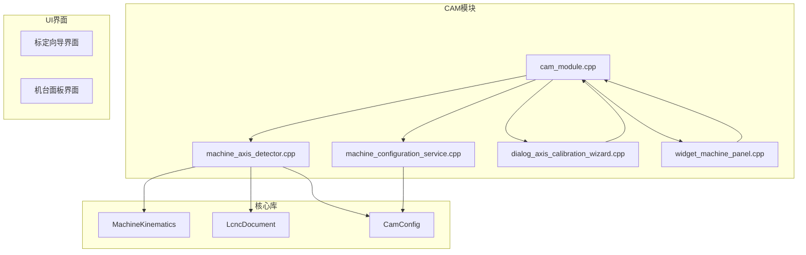

**图表来源**
- [cam_module.cpp:434-549](file://src/modules/cam/cam_module.cpp#L434-L549)
- [machine_axis_detector.cpp:1-105](file://src/modules/cam/services/machine_axis_detector.cpp#L1-L105)
- [machine_configuration_service.cpp:1-411](file://src/core/kinematics/machine_configuration_service.cpp#L1-L411)

**章节来源**
- [cam_module.cpp:434-549](file://src/modules/cam/cam_module.cpp#L434-L549)
- [machine_axis_detector.cpp:1-105](file://src/modules/cam/services/machine_axis_detector.cpp#L1-L105)

## 核心组件

### MachineAxisDetector类

MachineAxisDetector是轴检测系统的核心组件，提供了三个主要的检测和配置功能：

#### 主要功能
1. **轴名称自动检测** (`autoDetectAxisNames`)
2. **轴原点自动检测** (`autoDetectAxisOrigins`)  
3. **存储配置应用** (`applyStoredMachineProfile`)

#### 数据结构
系统使用以下核心数据结构：

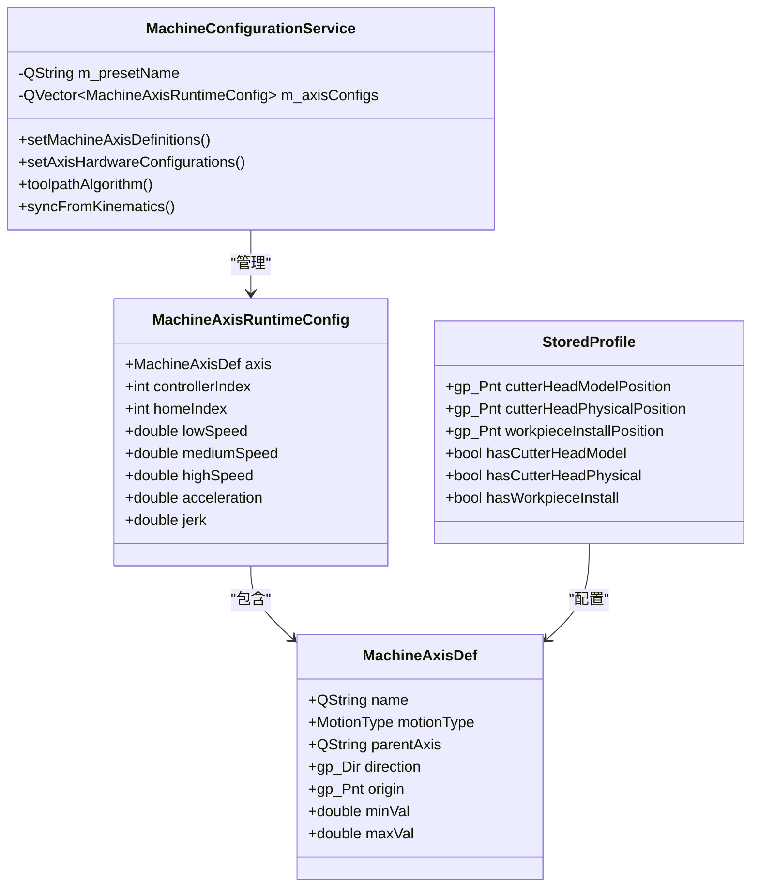

**图表来源**
- [machine_configuration_service.h:23-78](file://src/core/kinematics/machine_configuration_service.h#L23-L78)
- [machine_axis_detector.h:32-42](file://src/modules/cam/services/machine_axis_detector.h#L32-L42)

**章节来源**
- [machine_axis_detector.h:14-45](file://src/modules/cam/services/machine_axis_detector.h#L14-L45)
- [machine_configuration_service.h:14-78](file://src/core/kinematics/machine_configuration_service.h#L14-L78)

## 架构概览

### 系统架构图

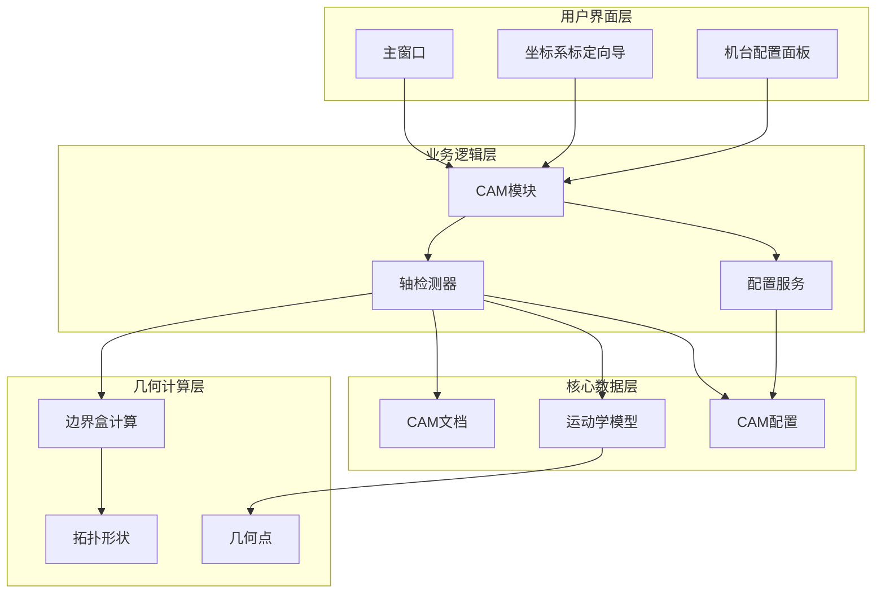

**图表来源**
- [cam_module.cpp:434-549](file://src/modules/cam/cam_module.cpp#L434-L549)
- [machine_axis_detector.cpp:16-104](file://src/modules/cam/services/machine_axis_detector.cpp#L16-L104)
- [machine_configuration_service.cpp:78-139](file://src/core/kinematics/machine_configuration_service.cpp#L78-L139)

### 数据流图

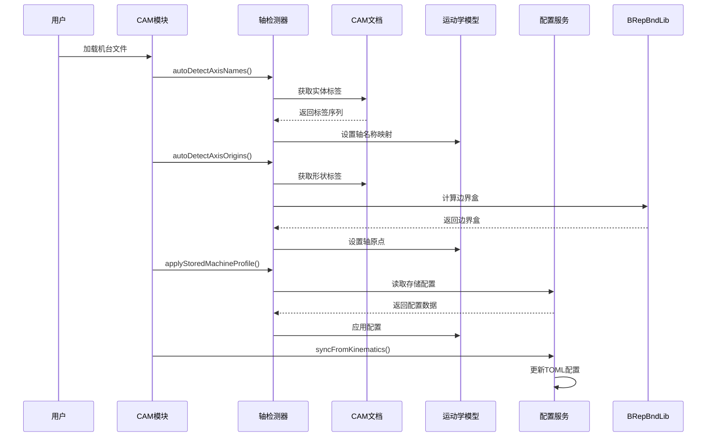

**图表来源**
- [cam_module.cpp:512-527](file://src/modules/cam/cam_module.cpp#L512-L527)
- [machine_axis_detector.cpp:16-104](file://src/modules/cam/services/machine_axis_detector.cpp#L16-L104)

**章节来源**
- [cam_module.cpp:434-549](file://src/modules/cam/cam_module.cpp#L434-L549)
- [machine_axis_detector.cpp:16-104](file://src/modules/cam/services/machine_axis_detector.cpp#L16-L104)

## 详细组件分析

### 轴检测算法实现

#### 自动轴名称检测算法

轴名称检测算法通过分析CAM文档中的机器实体标签来识别和分类不同的轴：

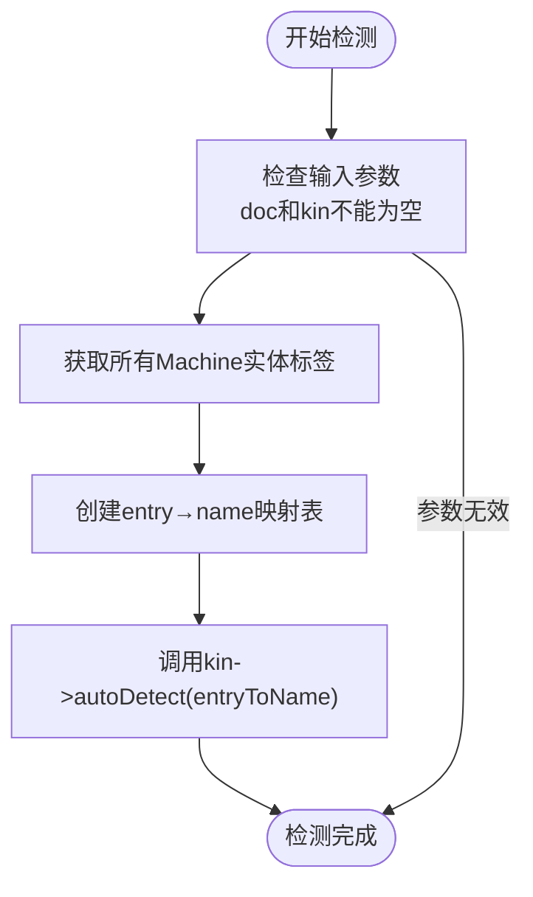

**图表来源**
- [machine_axis_detector.cpp:16-28](file://src/modules/cam/services/machine_axis_detector.cpp#L16-L28)

#### 旋转轴原点自动检测算法

旋转轴原点检测算法基于轴挂载形状的边界盒中心来确定旋转中心：

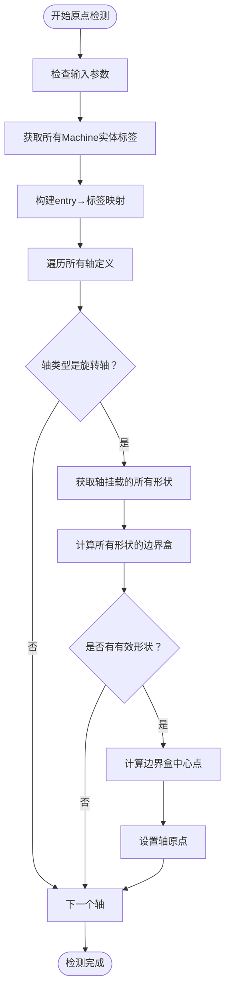

**图表来源**
- [machine_axis_detector.cpp:30-72](file://src/modules/cam/services/machine_axis_detector.cpp#L30-L72)

**章节来源**
- [machine_axis_detector.cpp:16-72](file://src/modules/cam/services/machine_axis_detector.cpp#L16-L72)

### 坐标系建立机制

#### 存储配置应用流程

存储配置应用机制负责从配置文件中读取并应用预设的轴配置：

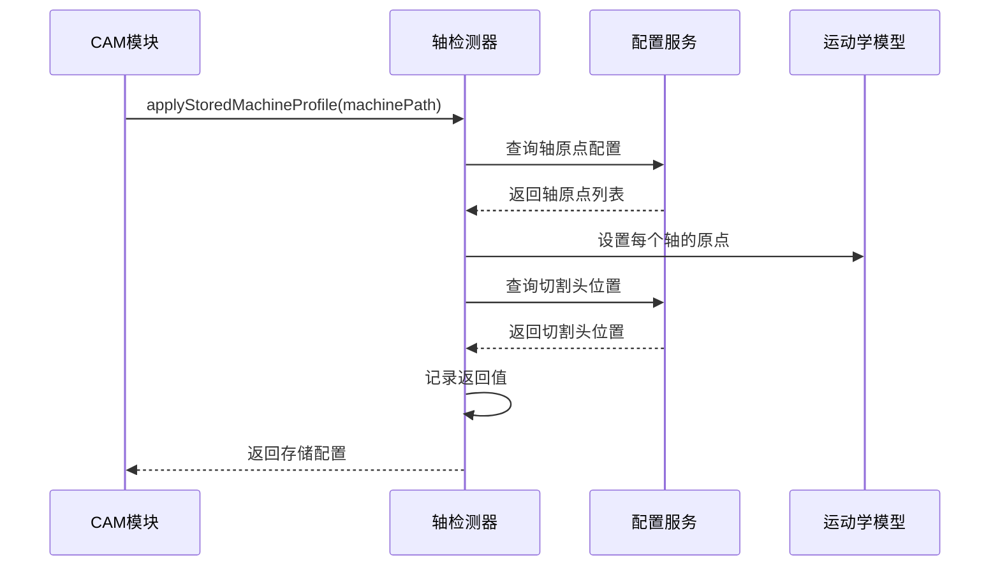

**图表来源**
- [machine_axis_detector.cpp:74-102](file://src/modules/cam/services/machine_axis_detector.cpp#L74-L102)

#### 工具路径算法选择

系统根据轴配置自动选择合适的工具路径算法：

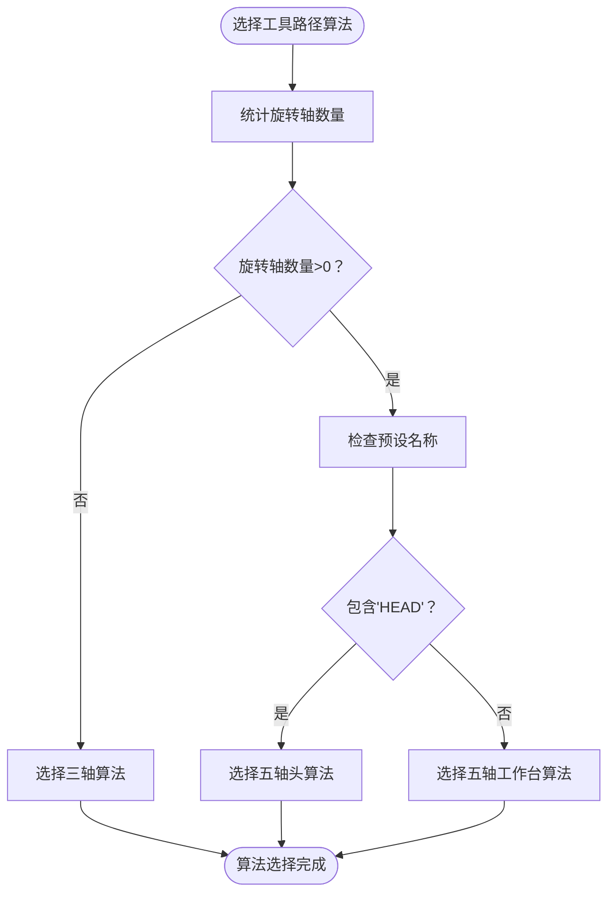

**图表来源**
- [machine_configuration_service.cpp:231-244](file://src/core/kinematics/machine_configuration_service.cpp#L231-L244)

**章节来源**
- [machine_axis_detector.cpp:74-102](file://src/modules/cam/services/machine_axis_detector.cpp#L74-L102)
- [machine_configuration_service.cpp:231-244](file://src/core/kinematics/machine_configuration_service.cpp#L231-L244)

### 运动学约束分析

#### 轴配置验证机制

系统实现了严格的轴配置验证机制，确保配置的一致性和有效性：

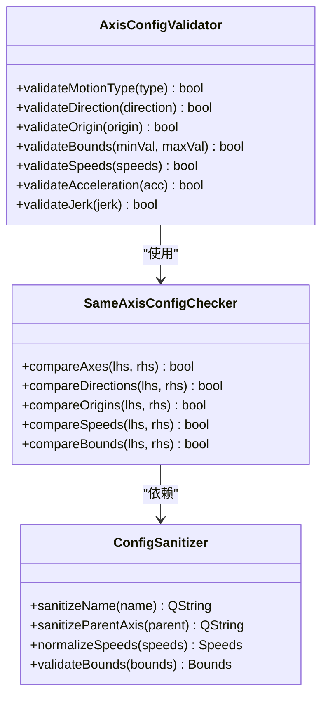

**图表来源**
- [machine_configuration_service.cpp:28-61](file://src/core/kinematics/machine_configuration_service.cpp#L28-L61)
- [machine_configuration_service.cpp:109-139](file://src/core/kinematics/machine_configuration_service.cpp#L109-L139)

**章节来源**
- [machine_configuration_service.cpp:28-61](file://src/core/kinematics/machine_configuration_service.cpp#L28-L61)
- [machine_configuration_service.cpp:109-139](file://src/core/kinematics/machine_configuration_service.cpp#L109-L139)

## 依赖关系分析

### 组件依赖图

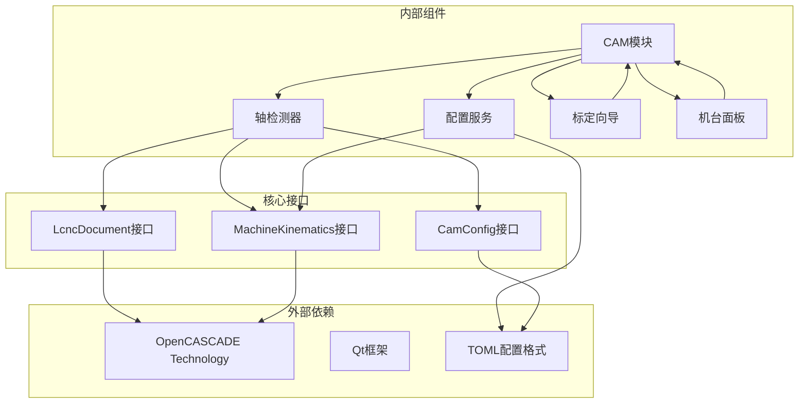

**图表来源**
- [machine_axis_detector.h:8-10](file://src/modules/cam/services/machine_axis_detector.h#L8-L10)
- [machine_configuration_service.h:3-5](file://src/core/kinematics/machine_configuration_service.h#L3-L5)

### 数据依赖关系

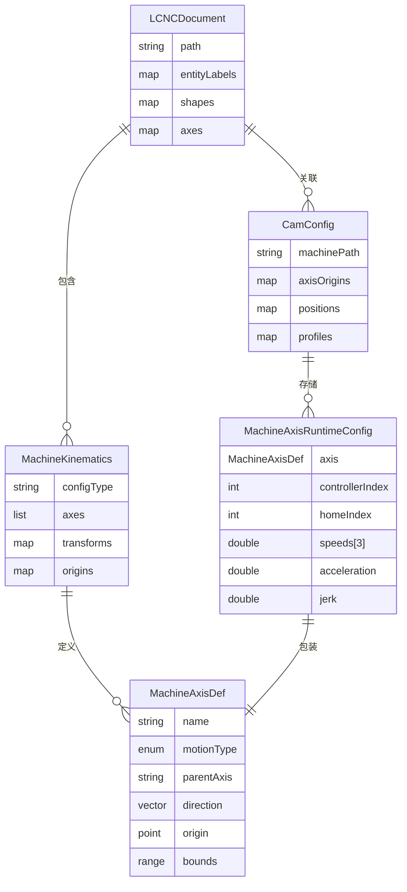

**图表来源**
- [machine_axis_detector.cpp:16-104](file://src/modules/cam/services/machine_axis_detector.cpp#L16-L104)
- [machine_configuration_service.cpp:23-78](file://src/core/kinematics/machine_configuration_service.cpp#L23-L78)

**章节来源**
- [machine_axis_detector.cpp:16-104](file://src/modules/cam/services/machine_axis_detector.cpp#L16-L104)
- [machine_configuration_service.cpp:23-78](file://src/core/kinematics/machine_configuration_service.cpp#L23-L78)

## 性能考虑

### 算法复杂度分析

#### 时间复杂度
- **轴名称检测**: O(n)，其中n是机器实体的数量
- **轴原点检测**: O(n×m)，其中n是旋转轴数量，m是每个轴挂载的平均形状数量
- **配置应用**: O(k)，其中k是配置项数量

#### 空间复杂度
- **内存使用**: 主要取决于形状数量和轴配置数量
- **缓存策略**: 系统采用延迟计算和增量更新策略

### 优化策略

1. **批量处理**: 支持批量轴配置更新，减少重复计算
2. **增量更新**: 只更新发生变化的轴配置
3. **缓存机制**: 缓存计算结果，避免重复计算
4. **异步处理**: 大型模型的轴检测采用异步处理模式

## 故障排除指南

### 常见问题及解决方案

#### 轴检测失败
**症状**: 轴名称或原点检测结果不正确
**可能原因**:
- CAM文档中缺少机器实体标签
- 形状数据损坏或缺失
- 轴分配不正确

**解决步骤**:
1. 检查CAM文档的实体标签完整性
2. 验证形状数据的有效性
3. 使用手动轴分配功能重新配置

#### 配置应用错误
**症状**: 存储配置无法正确应用
**可能原因**:
- 配置文件格式错误
- 轴名称不匹配
- 坐标系转换问题

**解决步骤**:
1. 检查配置文件的TOML格式
2. 验证轴名称的大小写和格式
3. 使用坐标系标定向导重新标定

#### 实时标定异常
**症状**: 标定过程中出现坐标漂移
**可能原因**:
- 拾取点精度不足
- 机械系统存在间隙
- 环境振动影响

**解决步骤**:
1. 提高拾取点的精度要求
2. 检查机械系统的刚性
3. 减少环境振动源

**章节来源**
- [dialog_axis_calibration_wizard.cpp:40-72](file://src/modules/cam/ui/dialog_axis_calibration_wizard.cpp#L40-L72)
- [widget_machine_panel.cpp:533-584](file://src/modules/cam/ui/widget_machine_panel.cpp#L533-L584)

## 结论

CAM模块的机床轴检测系统提供了一个完整、可靠的轴配置解决方案。系统通过智能的轴检测算法、精确的坐标系建立机制和严格的运动学约束分析，为激光切割和其他CAM操作提供了坚实的技术基础。

### 主要优势
1. **自动化程度高**: 减少了人工配置的工作量
2. **精度可靠**: 基于几何计算的精确检测
3. **扩展性强**: 支持多种轴配置和预设
4. **用户友好**: 提供直观的标定向导和配置界面

### 技术特点
- 无状态算法设计，便于测试和维护
- 完善的错误处理和异常恢复机制
- 实时更新机制，支持动态配置调整
- 与机器配置服务深度集成

## 附录

### 集成接口说明

#### CAM模块集成点
- **loadMachine()**: 完整的机台加载和配置流程
- **autoDetectAxes()**: 自动轴检测和配置
- **applyStoredMachineProfile()**: 存储配置应用
- **refreshMachineTransforms()**: 机器变换刷新

#### 配置文件格式
系统使用TOML格式存储轴配置信息，支持以下字段：
- 轴定义：名称、类型、父轴、方向、原点、范围
- 硬件配置：控制器索引、回零索引、速度参数、加速度、急动率
- 运动学参数：运动范围、约束条件

### 后续处理流程

#### 轴检测结果应用
1. **几何变换更新**: 更新所有相关形状的变换矩阵
2. **工具路径生成**: 基于新配置生成优化的工具路径
3. **仿真验证**: 在虚拟环境中验证配置的正确性
4. **实际加工**: 将配置应用于实际的CAM操作

#### 实时监控机制
- **配置变更通知**: 通过信号槽机制通知相关组件
- **状态同步**: 确保各组件间的配置状态一致
- **错误传播**: 及时发现和处理配置冲突