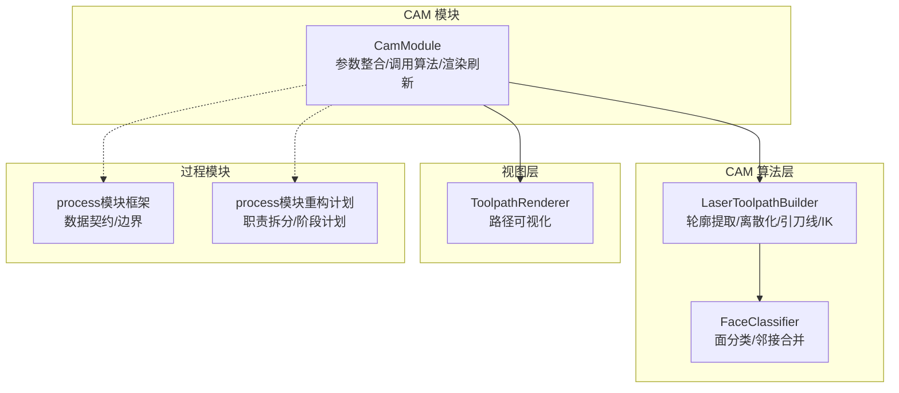
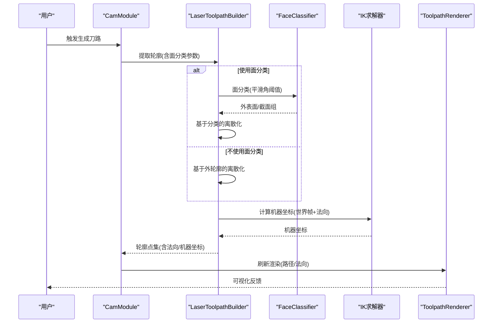
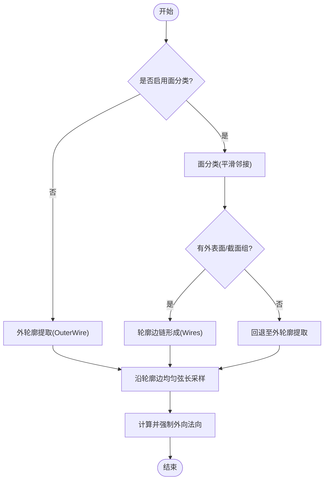
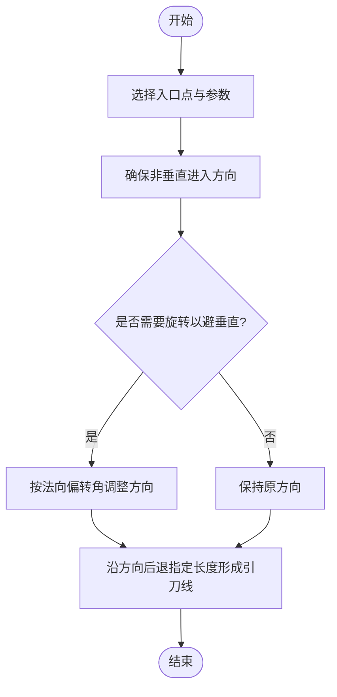
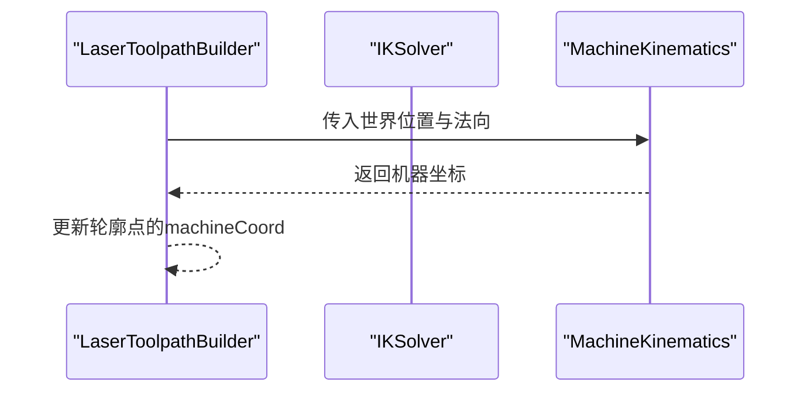
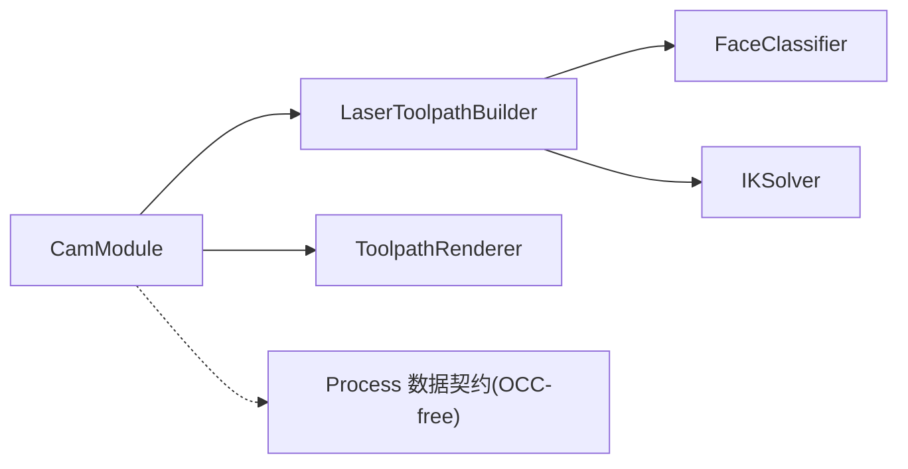

# 激光刀具路径生成

<cite>
**本文档引用的文件**
- [laser_toolpath.h](file://src/core/algorithms/cam/laser_toolpath.h)
- [laser_toolpath.cpp](file://src/core/algorithms/cam/laser_toolpath.cpp)
- [face_classifier.h](file://src/core/algorithms/cam/face_classifier.h)
- [face_classifier.cpp](file://src/core/algorithms/cam/face_classifier.cpp)
- [cam_module.cpp](file://src/modules/cam/cam_module.cpp)
- [toolpath_renderer.cpp](file://src/view/toolpath_renderer.cpp)
- [process模块框架.md](file://process模块框架.md)
- [process模块重构计划.md](file://process模块重构计划.md)
</cite>

## 目录
1. [简介](#简介)
2. [项目结构](#项目结构)
3. [核心组件](#核心组件)
4. [架构总览](#架构总览)
5. [详细组件分析](#详细组件分析)
6. [依赖关系分析](#依赖关系分析)
7. [性能考虑](#性能考虑)
8. [故障排查指南](#故障排查指南)
9. [结论](#结论)
10. [附录](#附录)

## 简介
本技术文档围绕激光刀具路径生成算法进行系统化梳理，重点覆盖以下方面：
- 路径生成原理与算法实现：轮廓提取、离散化采样、法向计算、引刀线（lead-in）生成、机器坐标反解（IK）。
- 加工类型与路径策略：轮廓切割、区域填充、雕刻路径的生成方法与适用场景。
- 质量评估与优化：路径平滑度、速度控制、采样密度与法向一致性。
- 参数调优与性能优化：采样密度、平滑角阈值、引刀长度与角度等关键参数的作用与调优建议。

## 项目结构
激光刀具路径生成位于 CAM 算法层，核心文件组织如下：
- 核心算法：src/core/algorithms/cam/laser_toolpath.{h,cpp} 提供轮廓提取、离散化、引刀线与 IK 计算。
- 面分类辅助：src/core/algorithms/cam/face_classifier.{h,cpp} 提供基于平滑邻接的面分类，支撑更通用的轮廓提取。
- CAM 模块集成：src/modules/cam/cam_module.cpp 调用上述算法，组装为可执行的刀路数据，并驱动渲染与后续流程。
- 视图层渲染：src/view/toolpath_renderer.cpp 将路径点集可视化，便于质量评估与调试。
- 过程模块边界：process模块框架与重构计划明确了 CAM 与 Process 模块之间的数据契约与职责边界。

**图表来源**
- [laser_toolpath.h:141-207](file://src/core/algorithms/cam/laser_toolpath.h#L141-L207)
- [laser_toolpath.cpp:174-357](file://src/core/algorithms/cam/laser_toolpath.cpp#L174-L357)
- [face_classifier.cpp:161-191](file://src/core/algorithms/cam/face_classifier.cpp#L161-L191)
- [cam_module.cpp:1970-2032](file://src/modules/cam/cam_module.cpp#L1970-L2032)
- [toolpath_renderer.cpp:319-358](file://src/view/toolpath_renderer.cpp#L319-L358)
- [process模块框架.md:49-70](file://process模块框架.md#L49-L70)
- [process模块重构计划.md:43-72](file://process模块重构计划.md#L43-L72)

**章节来源**
- [laser_toolpath.h:141-207](file://src/core/algorithms/cam/laser_toolpath.h#L141-L207)
- [laser_toolpath.cpp:174-357](file://src/core/algorithms/cam/laser_toolpath.cpp#L174-L357)
- [face_classifier.cpp:161-191](file://src/core/algorithms/cam/face_classifier.cpp#L161-L191)
- [cam_module.cpp:1970-2032](file://src/modules/cam/cam_module.cpp#L1970-L2032)
- [toolpath_renderer.cpp:319-358](file://src/view/toolpath_renderer.cpp#L319-L358)
- [process模块框架.md:49-70](file://process模块框架.md#L49-L70)
- [process模块重构计划.md:43-72](file://process模块重构计划.md#L43-L72)

## 核心组件
- LaserToolpathBuilder：静态工具类，负责轮廓提取、离散化采样、引刀线生成与机器坐标（IK）计算。
- FaceClassifier：对工件形状进行面分类，识别外表面与截面交界面，支撑更通用的轮廓提取。
- CamModule：CAM 模块入口，整合参数、调用算法、更新渲染与同步数据。
- ToolpathRenderer：将路径点集与法向可视化，辅助质量评估与调试。
- Process 边界：明确 CAM 仅提供 OCC-free 的点集数据，Process 侧不依赖几何库，仅消费纯数据快照。

**章节来源**
- [laser_toolpath.h:141-207](file://src/core/algorithms/cam/laser_toolpath.h#L141-L207)
- [laser_toolpath.cpp:174-357](file://src/core/algorithms/cam/laser_toolpath.cpp#L174-L357)
- [face_classifier.cpp:161-191](file://src/core/algorithms/cam/face_classifier.cpp#L161-L191)
- [cam_module.cpp:1970-2032](file://src/modules/cam/cam_module.cpp#L1970-L2032)
- [toolpath_renderer.cpp:319-358](file://src/view/toolpath_renderer.cpp#L319-L358)
- [process模块框架.md:49-70](file://process模块框架.md#L49-L70)

## 架构总览
激光刀具路径生成的端到端流程如下：
- 输入：工件拓扑形状（TopoDS_Shape）
- 处理：轮廓提取 → 离散化采样 → 法向计算 → 引刀线生成 → 机器坐标（IK）求解
- 输出：包含点集、法向、机器坐标的轮廓集合，供后续指令规划与执行

**图表来源**
- [cam_module.cpp:1970-2032](file://src/modules/cam/cam_module.cpp#L1970-L2032)
- [laser_toolpath.cpp:174-357](file://src/core/algorithms/cam/laser_toolpath.cpp#L174-L357)
- [face_classifier.cpp:161-191](file://src/core/algorithms/cam/face_classifier.cpp#L161-L191)
- [laser_toolpath.cpp:627-640](file://src/core/algorithms/cam/laser_toolpath.cpp#L627-L640)
- [toolpath_renderer.cpp:319-358](file://src/view/toolpath_renderer.cpp#L319-L358)

## 详细组件分析

### 轮廓提取与离散化
- 提取策略
  - 外轮廓优先：仅提取外表面轮廓（OuterWire），内孔/凹槽不参与轮廓提取。
  - 面分类增强：当启用面分类时，基于平滑邻接合并相邻面，识别外表面与截面交界面，形成更连续的轮廓链。
  - 回退机制：若面分类无有效结果，则回退至传统外轮廓提取。
- 离散化采样
  - 沿轮廓边进行均匀弦长采样（UniformDeflection），采样密度由 deflection 控制。
  - 每个采样点记录曲线参数、空间位置与表面法向。
  - 法向方向强制朝向外表面，避免内向法向导致的路径方向异常。
- 分类感知的离散化
  - 当使用面分类时，结合外表面与截面面集，计算更一致的法向，提升路径连续性。

**图表来源**
- [laser_toolpath.cpp:174-357](file://src/core/algorithms/cam/laser_toolpath.cpp#L174-L357)
- [face_classifier.cpp:161-191](file://src/core/algorithms/cam/face_classifier.cpp#L161-L191)

**章节来源**
- [laser_toolpath.cpp:174-357](file://src/core/algorithms/cam/laser_toolpath.cpp#L174-L357)
- [face_classifier.cpp:161-191](file://src/core/algorithms/cam/face_classifier.cpp#L161-L191)

### 引刀线（Lead-in）生成
- 目标：从非垂直方向进入轮廓，避免直接从正上方切入导致的烧蚀或切削不稳定。
- 关键步骤
  - 选择入口点（entryPoint）与曲线参数（entryParam），确保入口处法向与切向合理。
  - 若入口方向过于接近垂直（与+Z夹角过小），则旋转一定角度（默认阈值）以避开垂直方向。
  - 从入口点沿修正后的方向后退指定长度（length），连接形成引刀线（TopoDS_Edge）。
- 参数
  - 长度：globalLeadInLength 或 contour 级别的 LeadInParams.length
  - 法向偏转角：globalNormalAngle 或 contour 级别的 LeadInParams.normalAngle

**图表来源**
- [laser_toolpath.h:43-56](file://src/core/algorithms/cam/laser_toolpath.h#L43-L56)
- [laser_toolpath.cpp:580-621](file://src/core/algorithms/cam/laser_toolpath.cpp#L580-L621)

**章节来源**
- [laser_toolpath.h:43-56](file://src/core/algorithms/cam/laser_toolpath.h#L43-L56)
- [laser_toolpath.cpp:580-621](file://src/core/algorithms/cam/laser_toolpath.cpp#L580-L621)

### 机器坐标（IK）计算
- 输入：世界坐标系下的位置与法向（来自工作台变换与离散化法向）。
- 过程：通过 IK 求解器计算对应的机器坐标（关节角/轴位移），用于后续运动控制与指令生成。
- 注意：需保证工作台变换（wpcTransform）正确传递，使局部点云映射到世界坐标。

**图表来源**
- [laser_toolpath.cpp:627-640](file://src/core/algorithms/cam/laser_toolpath.cpp#L627-L640)

**章节来源**
- [laser_toolpath.cpp:627-640](file://src/core/algorithms/cam/laser_toolpath.cpp#L627-L640)

### 加工类型与路径策略
- 轮廓切割（外轮廓）
  - 适用：板料/型材的外轮廓分离与外形加工。
  - 特点：仅提取外表面轮廓，离散化后生成连续路径；可配置引刀线以改善切入稳定性。
- 区域填充（内孔/平面）
  - 适用：需要去除材料内部区域的加工（如钻孔、清根）。
  - 实现：可通过面分类识别内表面与截面交界面，形成闭合轮廓链；离散化后生成填充路径。
- 雕刻路径（细小特征/文字/图案）
  - 适用：高精度细节加工。
  - 实现：降低采样密度（增大 deflection）或采用更精细的面分类阈值，提高路径连续性与细节保真度。

注：区域填充与雕刻路径的具体算法实现需结合面分类与轮廓链拓扑，确保路径方向与连续性满足加工需求。

**章节来源**
- [laser_toolpath.cpp:174-357](file://src/core/algorithms/cam/laser_toolpath.cpp#L174-L357)
- [face_classifier.cpp:161-191](file://src/core/algorithms/cam/face_classifier.cpp#L161-L191)

### 质量评估指标与平滑度优化
- 质量指标
  - 采样密度：deflection 控制每段边的采样点数，影响路径平滑度与计算量。
  - 法向一致性：强制外向法向，避免法向反转导致的路径抖动。
  - 引刀线合理性：避免垂直切入，减少烧蚀与切削冲击。
  - 路径连续性：通过面分类合并平滑面，提升轮廓链连续性。
- 平滑度优化
  - 降低 deflection 提高采样密度，增强路径连续性。
  - 使用面分类提升相邻面连接的连续性。
  - 在路径点之间进行局部平滑（如滤波/样条拟合）可进一步提升平滑度（需在 CAM 与 Process 间协商实现方式）。

**章节来源**
- [laser_toolpath.cpp:353-392](file://src/core/algorithms/cam/laser_toolpath.cpp#L353-L392)
- [laser_toolpath.cpp:389-430](file://src/core/algorithms/cam/laser_toolpath.cpp#L389-L430)

### 速度控制策略
- 速度控制通常在指令规划阶段实施，基于路径曲率、加速度限制与激光功率特性进行分段速度分配。
- 在 CAM 层可提供路径曲率估计与法向变化率，为后续速度分配提供依据。
- 与引刀线结合：在切入/切出阶段采用较低速度，提升稳定性与质量。

**章节来源**
- [cam_module.cpp:1970-2032](file://src/modules/cam/cam_module.cpp#L1970-L2032)

## 依赖关系分析
- 模块耦合
  - CamModule 依赖 LaserToolpathBuilder 与 FaceClassifier，负责参数整合与流程编排。
  - LaserToolpathBuilder 依赖几何库（OCC）进行轮廓提取与离散化，依赖 IK 求解器进行坐标变换。
  - ToolpathRenderer 依赖可视化框架显示路径与法向，便于质量评估。
- 数据契约
  - Process 模块仅消费 OCC-free 的点集数据快照，不直接依赖几何库，确保模块边界清晰。

**图表来源**
- [cam_module.cpp:1970-2032](file://src/modules/cam/cam_module.cpp#L1970-L2032)
- [laser_toolpath.h:141-207](file://src/core/algorithms/cam/laser_toolpath.h#L141-L207)
- [face_classifier.cpp:161-191](file://src/core/algorithms/cam/face_classifier.cpp#L161-L191)
- [toolpath_renderer.cpp:319-358](file://src/view/toolpath_renderer.cpp#L319-L358)
- [process模块框架.md:49-70](file://process模块框架.md#L49-L70)

**章节来源**
- [cam_module.cpp:1970-2032](file://src/modules/cam/cam_module.cpp#L1970-L2032)
- [laser_toolpath.h:141-207](file://src/core/algorithms/cam/laser_toolpath.h#L141-L207)
- [face_classifier.cpp:161-191](file://src/core/algorithms/cam/face_classifier.cpp#L161-L191)
- [toolpath_renderer.cpp:319-358](file://src/view/toolpath_renderer.cpp#L319-L358)
- [process模块框架.md:49-70](file://process模块框架.md#L49-L70)

## 性能考虑
- 采样密度与计算复杂度
  - deflection 越小，采样点越多，路径越平滑但计算量越大；建议根据加工精度需求折中选择。
- 面分类的代价
  - 面分类涉及邻接关系构建与并查集合并，对复杂几何有一定开销；建议在五轴或复杂曲面时启用。
- 引刀线生成
  - 引刀线计算简单，但过多引刀线会增加路径长度；应按轮廓复杂度与材料特性权衡。
- 可视化成本
  - 法向可视化按固定步长采样绘制，步长过小会增加几何数量；可根据屏幕分辨率动态调整步长。

**章节来源**
- [laser_toolpath.cpp:353-392](file://src/core/algorithms/cam/laser_toolpath.cpp#L353-L392)
- [toolpath_renderer.cpp:319-358](file://src/view/toolpath_renderer.cpp#L319-L358)

## 故障排查指南
- 轮廓为空
  - 检查输入形状是否包含外表面；若为纯线框，需启用回退机制（外轮廓提取）。
  - 确认面分类参数是否合理，必要时降低平滑角阈值。
- 法向异常或反转
  - 确认法向计算是否强制外向；检查工作台变换是否正确传递。
- 引刀线无效
  - 检查入口点选择与法向偏转角；确保引刀线长度与方向不垂直。
- 渲染异常
  - 检查法向可视化步长与颜色设置；确认路径点集是否为空。

**章节来源**
- [laser_toolpath.cpp:174-357](file://src/core/algorithms/cam/laser_toolpath.cpp#L174-L357)
- [laser_toolpath.cpp:353-392](file://src/core/algorithms/cam/laser_toolpath.cpp#L353-L392)
- [laser_toolpath.cpp:580-621](file://src/core/algorithms/cam/laser_toolpath.cpp#L580-L621)
- [toolpath_renderer.cpp:319-358](file://src/view/toolpath_renderer.cpp#L319-L358)

## 结论
激光刀具路径生成以“轮廓提取—离散化—法向—引刀线—IK”为主线，结合面分类提升复杂几何的连续性与稳定性。通过合理的参数配置与质量评估手段，可在保证加工质量的同时兼顾效率。未来在 Process 模块中，应严格遵循 OCC-free 数据契约，将 CAM 的几何能力与 Process 的执行调度解耦，实现更稳健的自动化加工流水线。

## 附录
- 参数清单与建议
  - deflection：控制采样密度，建议从 0.1mm 起步，根据路径平滑度与性能调优。
  - smoothAngleThresholdDeg：面分类平滑角阈值，建议根据曲面复杂度设定（如 5°~15°）。
  - globalLeadInLength：引刀线长度，建议根据材料厚度与激光功率设定（如 3~8mm）。
  - globalNormalAngle：引刀线法向偏转角，建议避免垂直切入（如 ±15°~±30°）。
- 与 Process 模块的协作
  - CAM 仅提供 OCC-free 的点集数据快照，Process 侧负责排序、工具匹配、指令规划与执行。

**章节来源**
- [process模块框架.md:49-70](file://process模块框架.md#L49-L70)
- [process模块重构计划.md:43-72](file://process模块重构计划.md#L43-L72)