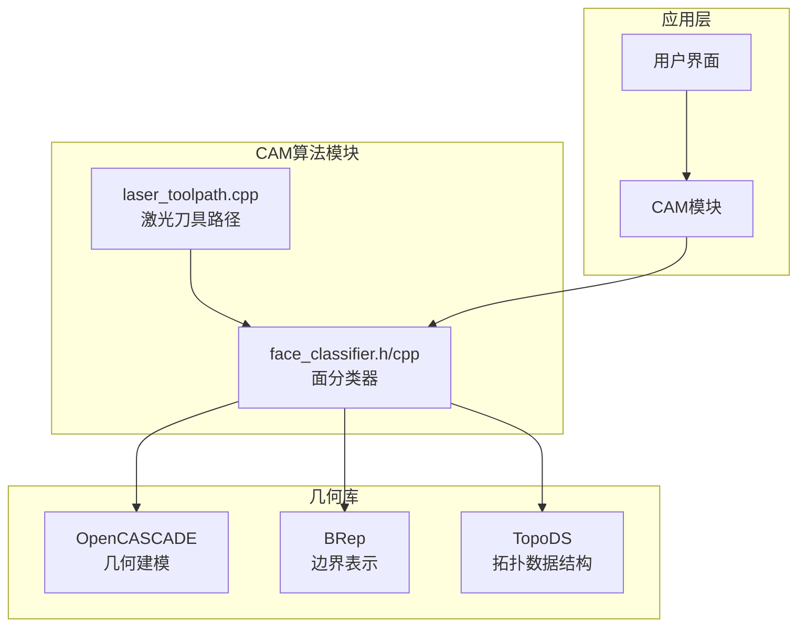
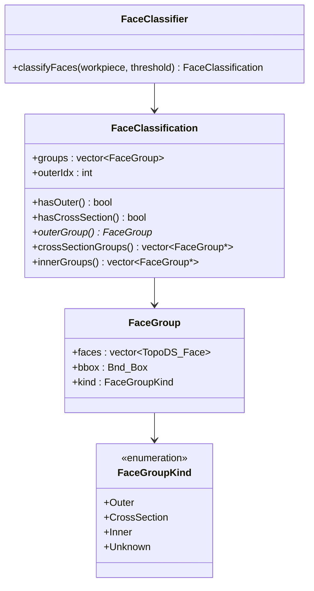
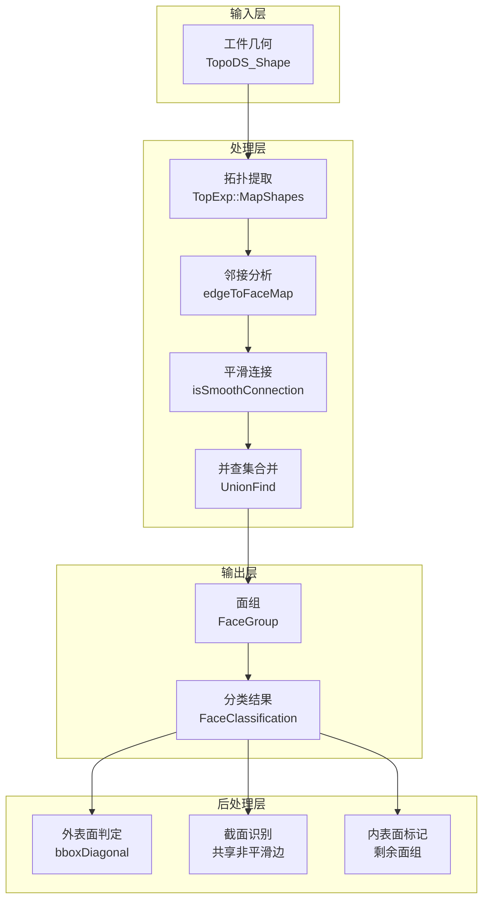
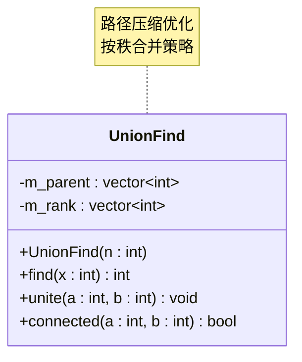
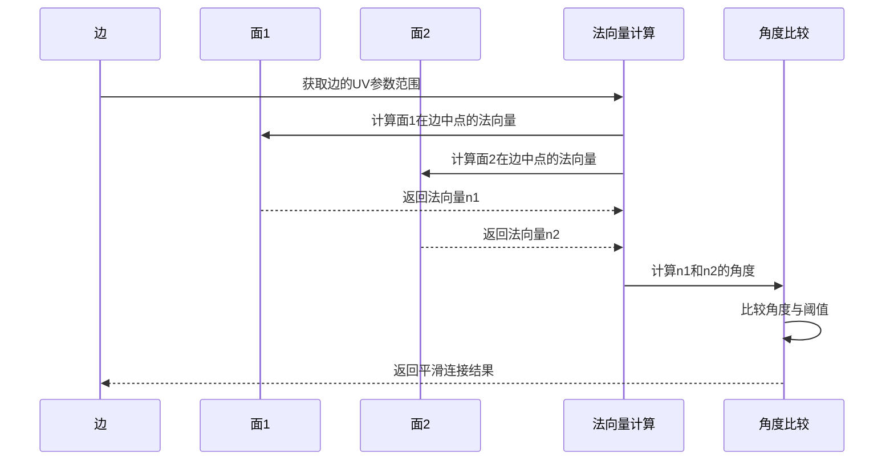
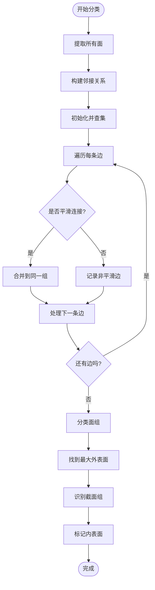
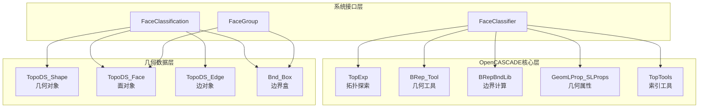

# 面分类系统

<cite>
**本文档引用的文件**
- [face_classifier.h](file://src/core/algorithms/cam/face_classifier.h)
- [face_classifier.cpp](file://src/core/algorithms/cam/face_classifier.cpp)
- [laser_toolpath.cpp](file://src/core/algorithms/cam/laser_toolpath.cpp)
</cite>

## 目录
1. [简介](#简介)
2. [项目结构](#项目结构)
3. [核心组件](#核心组件)
4. [架构概览](#架构概览)
5. [详细组件分析](#详细组件分析)
6. [依赖分析](#依赖分析)
7. [性能考虑](#性能考虑)
8. [故障排除指南](#故障排除指南)
9. [结论](#结论)

## 简介

面分类系统是CAM（计算机辅助制造）模块的核心组件，负责对工件几何形状进行智能分类和特征识别。该系统基于拓扑分析和几何属性计算，将复杂的三维工件表面划分为不同的功能区域：外表面、截面和内表面。

该系统采用先进的算法技术，包括并查集（Union-Find）数据结构、曲面法向量计算和边界分析，为后续的刀具路径生成提供精确的几何指导信息。通过智能的面分类，系统能够优化激光切割工艺参数，提高加工精度和效率。

## 项目结构

面分类系统位于CAM算法模块的核心位置，与刀具路径生成系统紧密集成：

**图表来源**
- [face_classifier.h:1-74](file://src/core/algorithms/cam/face_classifier.h#L1-L74)
- [face_classifier.cpp:1-191](file://src/core/algorithms/cam/face_classifier.cpp#L1-L191)

**章节来源**
- [face_classifier.h:1-74](file://src/core/algorithms/cam/face_classifier.h#L1-L74)
- [face_classifier.cpp:1-191](file://src/core/algorithms/cam/face_classifier.cpp#L1-L191)

## 核心组件

面分类系统由三个主要组件构成：

### 数据结构定义

系统定义了完整的数据结构体系来描述面分类结果：

**图表来源**
- [face_classifier.h:11-47](file://src/core/algorithms/cam/face_classifier.h#L11-L47)

### 算法核心

FaceClassifier类提供了完整的面分类功能，采用以下核心算法流程：

1. **拓扑提取**：从工件几何中提取所有面和边
2. **邻接关系构建**：建立边到面的关联映射
3. **平滑连接检测**：通过法向量角度比较判断面连接的平滑性
4. **连通分量合并**：使用并查集算法合并平滑连接的面
5. **类别判定**：根据几何特征和拓扑关系确定面组类型

**章节来源**
- [face_classifier.h:50-74](file://src/core/algorithms/cam/face_classifier.h#L50-L74)
- [face_classifier.cpp:162-225](file://src/core/algorithms/cam/face_classifier.cpp#L162-L225)

## 架构概览

面分类系统的整体架构采用分层设计，确保了良好的模块化和可扩展性：

**图表来源**
- [face_classifier.cpp:162-225](file://src/core/algorithms/cam/face_classifier.cpp#L162-L225)
- [face_classifier.cpp:101-140](file://src/core/algorithms/cam/face_classifier.cpp#L101-L140)

## 详细组件分析

### 并查集算法实现

并查集（Union-Find）是面分类系统的核心数据结构，用于高效地管理面的连通关系：

**图表来源**
- [face_classifier.cpp:63-97](file://src/core/algorithms/cam/face_classifier.cpp#L63-L97)

并查集算法的关键特性：
- **路径压缩**：在查找操作中压缩搜索路径，提高后续查询效率
- **按秩合并**：总是将较小的树合并到较大的树下，保持树的平衡
- **时间复杂度**：接近O(α(n))，其中α是反阿克曼函数

### 法向量计算机制

系统通过精确的法向量计算来判断面的平滑连接性：

**图表来源**
- [face_classifier.cpp:101-140](file://src/core/algorithms/cam/face_classifier.cpp#L101-L140)

法向量计算的关键步骤：
1. **UV参数获取**：确定边在面参数空间中的范围
2. **表面属性分析**：使用几何属性计算器获取表面信息
3. **法向量定义**：确保法向量方向正确（考虑面的方向）
4. **角度比较**：判断两个面在共享边处的平滑程度

### 面组分类逻辑

系统采用多准则的面组分类策略：

**图表来源**
- [face_classifier.cpp:162-225](file://src/core/algorithms/cam/face_classifier.cpp#L162-L225)

分类过程的详细步骤：
1. **外表面识别**：选择边界框对角线长度最大的面组作为外表面
2. **截面识别**：与外表面共享非平滑边的面组被识别为截面
3. **内表面标记**：剩余的面组标记为内表面

**章节来源**
- [face_classifier.cpp:162-225](file://src/core/algorithms/cam/face_classifier.cpp#L162-L225)

### 几何特征提取

系统实现了多种几何特征提取机制：

| 特征类型 | 提取方法 | 应用场景 |
|---------|---------|---------|
| 曲面法向量 | 基于几何属性的数值计算 | 判断面连接平滑性 |
| 边界框对角线 | 计算面组包围盒尺寸 | 外表面大小比较 |
| UV参数范围 | 分析边在参数空间中的投影 | 精确的法向量计算点 |
| 邻接关系 | 构建边到面的映射 | 拓扑结构分析 |

**章节来源**
- [face_classifier.cpp:101-154](file://src/core/algorithms/cam/face_classifier.cpp#L101-L154)

## 依赖分析

面分类系统与OpenCASCADE几何库深度集成，形成了清晰的依赖层次：

**图表来源**
- [face_classifier.cpp:1-25](file://src/core/algorithms/cam/face_classifier.cpp#L1-L25)
- [face_classifier.h:1-10](file://src/core/algorithms/cam/face_classifier.h#L1-L10)

**章节来源**
- [face_classifier.cpp:1-25](file://src/core/algorithms/cam/face_classifier.cpp#L1-L25)
- [face_classifier.h:1-10](file://src/core/algorithms/cam/face_classifier.h#L1-L10)

## 性能考虑

面分类系统的性能优化策略：

### 时间复杂度分析

| 操作 | 复杂度 | 优化策略 |
|------|--------|----------|
| 面提取 | O(F) | 使用索引映射避免重复遍历 |
| 边提取 | O(E) | 单次遍历构建邻接表 |
| 平滑连接检查 | O(E) | 向量化法向量计算 |
| 并查集操作 | O(α(N)) | 路径压缩和按秩合并 |
| 整体算法 | O(F + E + α(N)) | 线性时间复杂度 |

### 内存优化

1. **稀疏数据结构**：使用索引映射存储拓扑关系
2. **延迟计算**：仅在需要时计算几何属性
3. **缓存友好的布局**：连续存储面组数据

### 参数调优建议

| 参数 | 默认值 | 调整范围 | 影响 |
|------|--------|----------|------|
| smoothAngleThresholdDeg | 15° | 5°-45° | 平滑连接敏感度 |
| bboxDiagonalThreshold | 10mm | 1mm-100mm | 外表面大小判别 |

## 故障排除指南

### 常见问题及解决方案

#### 1. 分类结果不准确

**症状**：面组分类错误或遗漏

**可能原因**：
- 平滑角度阈值设置不当
- 几何模型存在缺陷
- 法向量计算失败

**解决方法**：
1. 调整smoothAngleThresholdDeg参数
2. 检查几何模型的完整性
3. 验证表面几何的有效性

#### 2. 性能问题

**症状**：分类过程耗时过长

**可能原因**：
- 几何模型过于复杂
- 内存不足
- 算法参数不当

**解决方法**：
1. 简化几何模型
2. 增加系统内存
3. 优化算法参数

#### 3. 内存泄漏

**症状**：长时间运行后内存占用持续增长

**解决方法**：
1. 确保正确释放几何对象
2. 检查循环引用
3. 使用智能指针管理资源

**章节来源**
- [face_classifier.cpp:162-225](file://src/core/algorithms/cam/face_classifier.cpp#L162-L225)

## 结论

面分类系统通过创新的算法设计和高效的实现策略，为CAM应用提供了可靠的几何分析基础。系统的主要优势包括：

1. **准确性高**：基于精确的几何计算和拓扑分析
2. **性能优异**：线性时间复杂度，适合大规模几何处理
3. **可扩展性强**：模块化设计支持功能扩展
4. **集成度好**：与OpenCASCADE库无缝集成

该系统为后续的刀具路径生成提供了精确的几何指导，显著提高了激光切割工艺的精度和效率。通过合理的参数调优和性能优化，系统能够在各种复杂的工件几何条件下保持稳定的分类性能。

未来的发展方向包括机器学习辅助分类、实时性能监控和更高级的几何特征提取等功能增强。