# Process模块服务管理架构改进

<cite>
**本文档引用的文件**
- [process_module.cpp](file://src/modules/process/process_module.cpp)
- [process_module.h](file://src/modules/process/process_module.h)
- [kernel.cpp](file://src/core/kernel/kernel.cpp)
- [kernel.h](file://src/core/kernel/kernel.h)
- [module_registry.cpp](file://src/core/kernel/module_registry.cpp)
- [module_registry.h](file://src/core/kernel/module_registry.h)
- [service_registry.cpp](file://src/core/kernel/service_registry.cpp)
- [service_registry.h](file://src/core/kernel/service_registry.h)
- [event_bus.cpp](file://src/core/kernel/event_bus.cpp)
- [event_bus.h](file://src/core/kernel/event_bus.h)
- [process_execution_service.cpp](file://src/modules/process/execution/process_execution_service.cpp)
- [process_execution_service.h](file://src/modules/process/execution/process_execution_service.h)
- [process_monitor_service.cpp](file://src/modules/process/monitor/process_monitor_service.cpp)
- [process_monitor_service.h](file://src/modules/process/monitor/process_monitor_service.h)
- [process_workflow_service.cpp](file://src/modules/process/workflow/process_workflow_service.cpp)
- [process_workflow_service.h](file://src/modules/process/workflow/process_workflow_service.h)
- [process_runtime.cpp](file://src/modules/process/runtime/process_runtime.cpp)
- [process_runtime.h](file://src/modules/process/runtime/process_runtime.h)
- [communication_manager.cpp](file://src/modules/process/communication/communication_manager.cpp)
- [communication_manager.h](file://src/modules/process/communication/communication_manager.h)
- [process_device_manager.cpp](file://src/modules/process/device/MotionControl/process_device_manager.cpp)
- [process_device_manager.h](file://src/modules/process/device/MotionControl/process_device_manager.h)
- [process_device_coordinator.cpp](file://src/modules/process/device/MotionControl/process_device_coordinator.cpp)
- [process_device_coordinator.h](file://src/modules/process/device/MotionControl/process_device_coordinator.h)
- [process_toolpath_service.cpp](file://src/modules/process/toolpath/process_toolpath_service.cpp)
- [process_toolpath_service.h](file://src/modules/process/toolpath/process_toolpath_service.h)
- [process_instruction_planner.cpp](file://src/modules/process/instructions/process_instruction_planner.cpp)
- [process_instruction_planner.h](file://src/modules/process/instructions/process_instruction_planner.h)
- [process_flow_document.cpp](file://src/modules/process/workflow/process_flow_document.cpp)
- [process_flow_document.h](file://src/modules/process/workflow/process_flow_document.h)
- [process_flow_store.cpp](file://src/modules/process/workflow/process_flow_store.cpp)
- [process_flow_store.h](file://src/modules/process/workflow/process_flow_store.h)
- [process_node.cpp](file://src/modules/process/workflow/process_node.cpp)
- [process_node.h](file://src/modules/process/workflow/process_node.h)
- [process_node_registry.cpp](file://src/modules/process/workflow/process_node_registry.cpp)
- [process_node_registry.h](file://src/modules/process/workflow/process_node_registry.h)
- [process_node_executor_registry.cpp](file://src/modules/process/execution/process_node_executor_registry.cpp)
- [process_node_executor_registry.h](file://src/modules/process/execution/process_node_executor_registry.h)
- [process_state_machine.cpp](file://src/modules/process/runtime/process_state_machine.cpp)
- [process_state_machine.h](file://src/modules/process/runtime/process_state_machine.h)
- [process_execution_context.h](file://src/modules/process/runtime/process_execution_context.h)
- [process_settings.h](file://src/modules/process/settings/process_settings.h)
- [process_settings_schema.h](file://src/modules/process/settings/process_settings_schema.h)
- [commands_process.cpp](file://src/modules/process/commands/commands_process.cpp)
- [commands_process.h](file://src/modules/process/commands/commands_process.h)
- [i_process_device.h](file://src/modules/process/i_process_device.h)
- [process_device_manager_dialog.cpp](file://src/modules/process/ui/device/process_device_manager_dialog.cpp)
- [process_device_manager_dialog.h](file://src/modules/process/ui/device/process_device_manager_dialog.h)
- [process_device_coordinator_dialog.cpp](file://src/modules/process/ui/device/process_device_coordinator_dialog.cpp)
- [process_device_coordinator_dialog.h](file://src/modules/process/ui/device/process_device_coordinator_dialog.h)
- [process_flow_tree_view.cpp](file://src/modules/process/ui/process_flow_tree_view.cpp)
- [process_flow_tree_view.h](file://src/modules/process/ui/process_flow_tree_view.h)
- [process_flow_model.cpp](file://src/modules/process/ui/process_flow_model.cpp)
- [process_flow_model.h](file://src/modules/process/ui/process_flow_model.h)
- [process_node_edit_dialog.cpp](file://src/modules/process/ui/process_node_edit_dialog.cpp)
- [process_node_edit_dialog.h](file://src/modules/process/ui/process_node_edit_dialog.h)
- [process_tool_matcher.cpp](file://src/modules/process/toolpath/process_tool_matcher.cpp)
- [process_tool_matcher.h](file://src/modules/process/toolpath/process_tool_matcher.h)
- [process_toolpath_sorter.cpp](file://src/modules/process/toolpath/process_toolpath_sorter.cpp)
- [process_toolpath_sorter.h](file://src/modules/process/toolpath/process_toolpath_sorter.h)
- [process_command.cpp](file://src/modules/process/instructions/process_command.cpp)
- [process_command.h](file://src/modules/process/instructions/process_command.h)
- [i_controller_translator.h](file://src/modules/process/instructions/i_controller_translator.h)
- [acs_translator.cpp](file://src/modules/process/instructions/acs_translator.cpp)
- [gtn_translator.cpp](file://src/modules/process/instructions/gtn_translator.cpp)
- [pure_simulation_translator.cpp](file://src/modules/process/instructions/pure_simulation_translator.cpp)
- [simulation_motion_controller.cpp](file://src/modules/process/controllers/simulation_motion_controller.cpp)
- [simulation_motion_controller.h](file://src/modules/process/controllers/simulation_motion_controller.h)
- [acs_motion_controller_adapter.cpp](file://src/modules/process/controllers/acs_motion_controller_adapter.cpp)
- [acs_motion_controller_adapter.h](file://src/modules/process/controllers/acs_motion_controller_adapter.h)
- [gtn_motion_controller_adapter.cpp](file://src/modules/process/controllers/gtn_motion_controller_adapter.cpp)
- [gtn_motion_controller_adapter.h](file://src/modules/process/controllers/gtn_motion_controller_adapter.h)
- [process_system_service.cpp](file://src/modules/process/System/Service.cpp)
- [process_system_service.h](file://src/modules/process/System/Service.h)
- [process_system_license.cpp](file://src/modules/process/System/LicenseModule.cpp)
- [process_system_license.h](file://src/modules/process/System/LicenseModule.h)
- [process_system_log.cpp](file://src/modules/process/System/LogModule.cpp)
- [process_system_log.h](file://src/modules/process/System/LogModule.h)
- [process_system_message.cpp](file://src/modules/process/System/MessageModule.cpp)
- [process_system_message.h](file://src/modules/process/System/MessageModule.h)
- [process_system_expression.cpp](file://src/modules/process/System/Expression.cpp)
- [process_system_expression.h](file://src/modules/process/System/Expression.h)
- [process_system_datatype.h](file://src/modules/process/System/DataType.h)
- [process_system_regex.h](file://src/modules/process/System/RegexPatterns.h)
- [process_system_message_code.h](file://src/modules/process/System/MessageCode.h)
- [task_manager.h](file://src/core/task/task_manager.h)
- [task_manager.cpp](file://src/core/task/task_manager.cpp)
- [task_progress.h](file://src/core/task/task_progress.h)
- [dialog_task_manager.h](file://src/app/dialog/dialog_task_manager.h)
- [dialog_task_manager.cpp](file://src/app/dialog/dialog_task_manager.cpp)
- [app_command_context.h](file://src/app/app_command_context.h)
- [app_context.h](file://src/app/app_context.h)
- [main_window.h](file://src/app/main_window.h)
- [toml_config.cpp](file://src/core/settings/toml_config.cpp)
- [toml_config.h](file://src/core/settings/toml_config.h)
- [Setting_MotionControl.cpp](file://src/modules/process/Setting/Setting_MotionControl.cpp)
- [Setting_MotionControl.h](file://src/modules/process/Setting/Setting_MotionControl.h)
- [Setting_MotionControl.ui](file://src/modules/process/Setting/Setting_MotionControl.ui)
- [MCFactory.cpp](file://src/modules/process/device/MotionControl/MCFactory.cpp)
- [MCFactory.h](file://src/modules/process/device/MotionControl/MCFactory.h)
- [MotionControl.cpp](file://src/modules/process/device/MotionControl/MotionControl.cpp)
- [MotionControl.h](file://src/modules/process/device/MotionControl/MotionControl.h)
- [ACSMotionControl.cpp](file://src/modules/process/device/MotionControl/ACSMotionControl.cpp)
- [ACSMotionControl.h](file://src/modules/process/device/MotionControl/ACSMotionControl.h)
- [GTNMotionControl.cpp](file://src/modules/process/device/MotionControl/GTNMotionControl.cpp)
- [GTNMotionControl.h](file://src/modules/process/device/MotionControl/GTNMotionControl.h)
- [SimulateCMHPMotionControl.cpp](file://src/modules/process/device/MotionControl/SimulateCMHPMotionControl.cpp)
- [SimulateCMHPMotionControl.h](file://src/modules/process/device/MotionControl/SimulateCMHPMotionControl.h)
</cite>

## 更新摘要
**所做更改**
- 新增Service层MotionControl接口管理章节，详细介绍GetMotionControl()和SetMotionControl()方法的使用
- 更新配置文件加载机制章节，增加TOML配置格式的支持和错误处理
- 新增MCFactory工厂模式章节，展示运动控制器的创建和管理机制
- 更新设备管理架构图，反映新的MotionControl接口管理结构
- 新增配置驱动的运动控制器选择机制

## 目录
1. [引言](#引言)
2. [项目结构](#项目结构)
3. [核心组件](#核心组件)
4. [架构概览](#架构概览)
5. [详细组件分析](#详细组件分析)
6. [Service层MotionControl接口管理](#servicelayermotioncontrol接口管理)
7. [配置文件加载机制](#配置文件加载机制)
8. [MCFactory工厂模式](#mcfactory工厂模式)
9. [依赖关系分析](#依赖关系分析)
10. [性能考虑](#性能考虑)
11. [故障排除指南](#故障排除指南)
12. [结论](#结论)

## 引言

Process模块是LaserCNC激光切割控制系统的核心服务管理模块，负责协调各种加工设备、监控执行状态、管理工艺流程和处理通信协议。该模块采用微内核架构设计，通过服务注册表、事件总线和模块化组件实现高度解耦的服务管理。

**更新** 本版本引入了Service层的MotionControl接口管理，新增了GetMotionControl()和SetMotionControl()方法，以及基于配置文件的运动控制器选择机制。这些改进显著增强了系统的灵活性和可扩展性。

本模块主要包含以下核心功能：
- 工艺流程管理和执行控制
- 设备协调和状态监控
- 通信协议适配和数据传输
- 运行时状态管理和指令规划
- 工具路径生成和优化
- **新增** 统一的任务调度和进度跟踪
- **新增** Service层的MotionControl接口管理
- **新增** 配置驱动的设备选择机制

## 项目结构

Process模块采用分层架构设计，按照功能域进行模块化组织。**更新** 新增了Service层的MotionControl接口管理和配置文件加载机制。

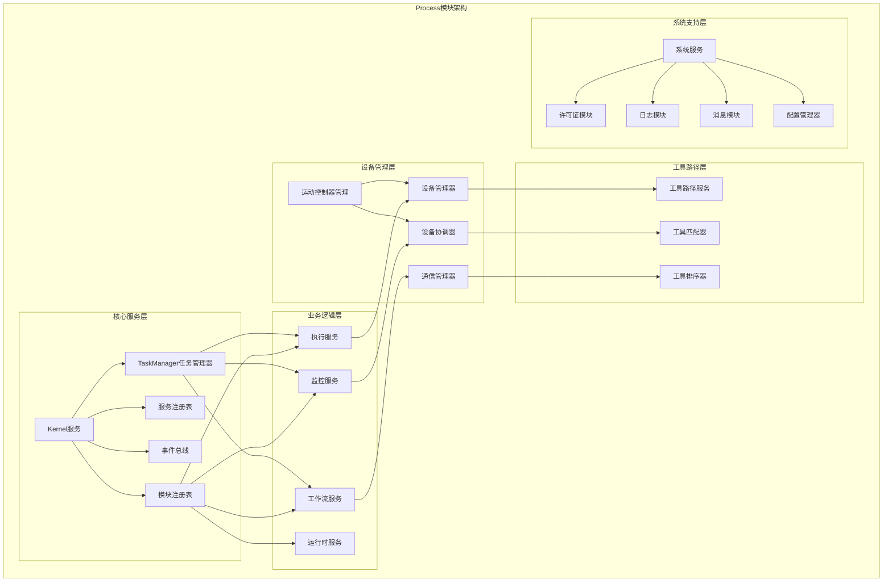
```mermaid
graph TB
subgraph "Process模块架构"
subgraph "核心服务层"
Kernel[Kernel服务]
ModuleReg[模块注册表]
ServiceReg[服务注册表]
EventBus[事件总线]
TaskMgr[TaskManager任务管理器]
end
subgraph "业务逻辑层"
ExecSvc[执行服务]
MonitorSvc[监控服务]
WorkflowSvc[工作流服务]
RuntimeSvc[运行时服务]
end
subgraph "设备管理层"
DeviceMgr[设备管理器]
DeviceCoord[设备协调器]
CommMgr[通信管理器]
MotionCtl[运动控制器管理]
end
subgraph "工具路径层"
ToolpathSvc[工具路径服务]
ToolMatcher[工具匹配器]
ToolSorter[工具排序器]
end
subgraph "系统支持层"
SysSvc[系统服务]
License[许可证模块]
LogMod[日志模块]
MsgMod[消息模块]
CfgMgr[配置管理器]
end
end
Kernel --> ModuleReg
Kernel --> ServiceReg
Kernel --> EventBus
Kernel --> TaskMgr
ModuleReg --> ExecSvc
ModuleReg --> MonitorSvc
ModuleReg --> WorkflowSvc
ModuleReg --> RuntimeSvc
ExecSvc --> DeviceMgr
MonitorSvc --> DeviceCoord
WorkflowSvc --> CommMgr
DeviceMgr --> ToolpathSvc
DeviceCoord --> ToolMatcher
CommMgr --> ToolSorter
SysSvc --> License
SysSvc --> LogMod
SysSvc --> MsgMod
SysSvc --> CfgMgr
TaskMgr --> ExecSvc
TaskMgr --> MonitorSvc
TaskMgr --> WorkflowSvc
MotionCtl --> DeviceMgr
MotionCtl --> DeviceCoord
```

**图表来源**
- [process_module.cpp:1-150](file://src/modules/process/process_module.cpp#L1-L150)
- [kernel.cpp:1-200](file://src/core/kernel/kernel.cpp#L1-L200)
- [task_manager.h:1-46](file://src/core/task/task_manager.h#L1-L46)
- [toml_config.cpp:1-76](file://src/core/settings/toml_config.cpp#L1-L76)

**章节来源**
- [process_module.cpp:1-200](file://src/modules/process/process_module.cpp#L1-L200)
- [process_module.h:1-100](file://src/modules/process/process_module.h#L1-L100)
- [task_manager.h:1-46](file://src/core/task/task_manager.h#L1-L46)
- [toml_config.cpp:1-76](file://src/core/settings/toml_config.cpp#L1-L76)

## 核心组件

### 微内核架构

Process模块基于微内核架构设计，提供轻量级的基础设施服务。**更新** TaskManager作为核心容器的一部分，提供统一的任务管理服务，同时新增了MotionControl接口管理机制。

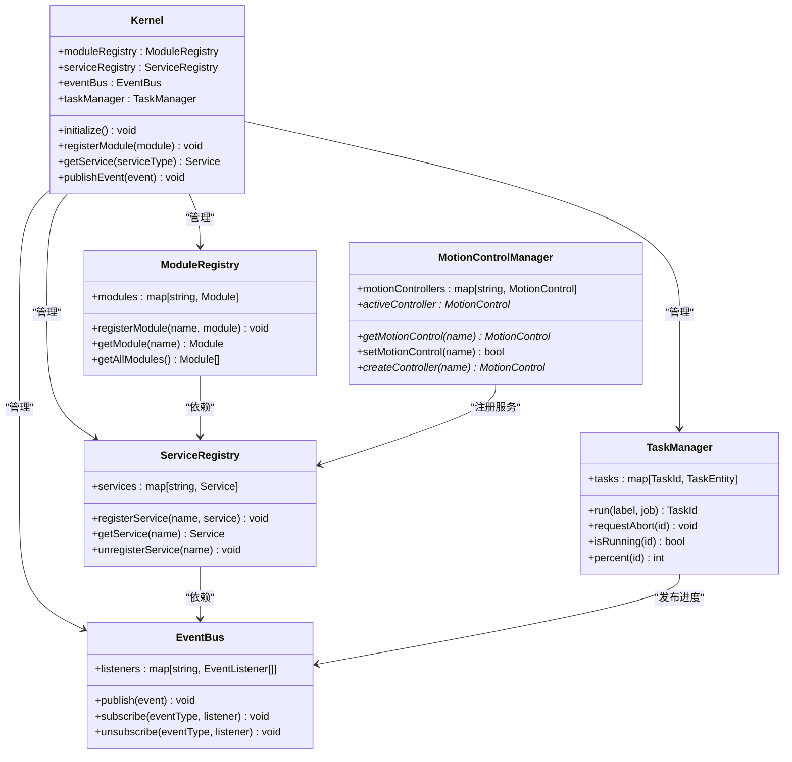
```mermaid
classDiagram
class Kernel {
+moduleRegistry : ModuleRegistry
+serviceRegistry : ServiceRegistry
+eventBus : EventBus
+taskManager : TaskManager
+initialize() void
+registerModule(module) void
+getService(serviceType) Service
+publishEvent(event) void
}
class ModuleRegistry {
+modules : map[string, Module]
+registerModule(name, module) void
+getModule(name) Module
+getAllModules() Module[]
}
class ServiceRegistry {
+services : map[string, Service]
+registerService(name, service) void
+getService(name) Service
+unregisterService(name) void
}
class EventBus {
+listeners : map[string, EventListener[]]
+publish(event) void
+subscribe(eventType, listener) void
+unsubscribe(eventType, listener) void
}
class TaskManager {
+tasks : map[TaskId, TaskEntity]
+run(label, job) TaskId
+requestAbort(id) void
+isRunning(id) bool
+percent(id) int
}
class MotionControlManager {
+motionControllers : map[string, MotionControl]
+activeController : MotionControl*
+getMotionControl(name) MotionControl*
+setMotionControl(name) bool
+createController(name) MotionControl*
}
Kernel --> ModuleRegistry : "管理"
Kernel --> ServiceRegistry : "管理"
Kernel --> EventBus : "管理"
Kernel --> TaskManager : "管理"
ModuleRegistry --> ServiceRegistry : "依赖"
ServiceRegistry --> EventBus : "依赖"
TaskManager --> EventBus : "发布进度"
MotionControlManager --> ServiceRegistry : "注册服务"
```

**图表来源**
- [kernel.h:1-150](file://src/core/kernel/kernel.h#L1-L150)
- [module_registry.h:1-120](file://src/core/kernel/module_registry.h#L1-L120)
- [service_registry.h:1-120](file://src/core/kernel/service_registry.h#L1-L120)
- [event_bus.h:1-120](file://src/core/kernel/event_bus.h#L1-L120)
- [task_manager.h:1-46](file://src/core/task/task_manager.h#L1-L46)
- [MCFactory.h:13-28](file://src/modules/process/device/MotionControl/MCFactory.h#L13-L28)

### 服务管理机制

服务注册表实现了动态服务发现和生命周期管理。**更新** TaskManager集成了统一的任务调度机制，为所有异步操作提供进度跟踪。同时新增了MotionControl接口管理服务。

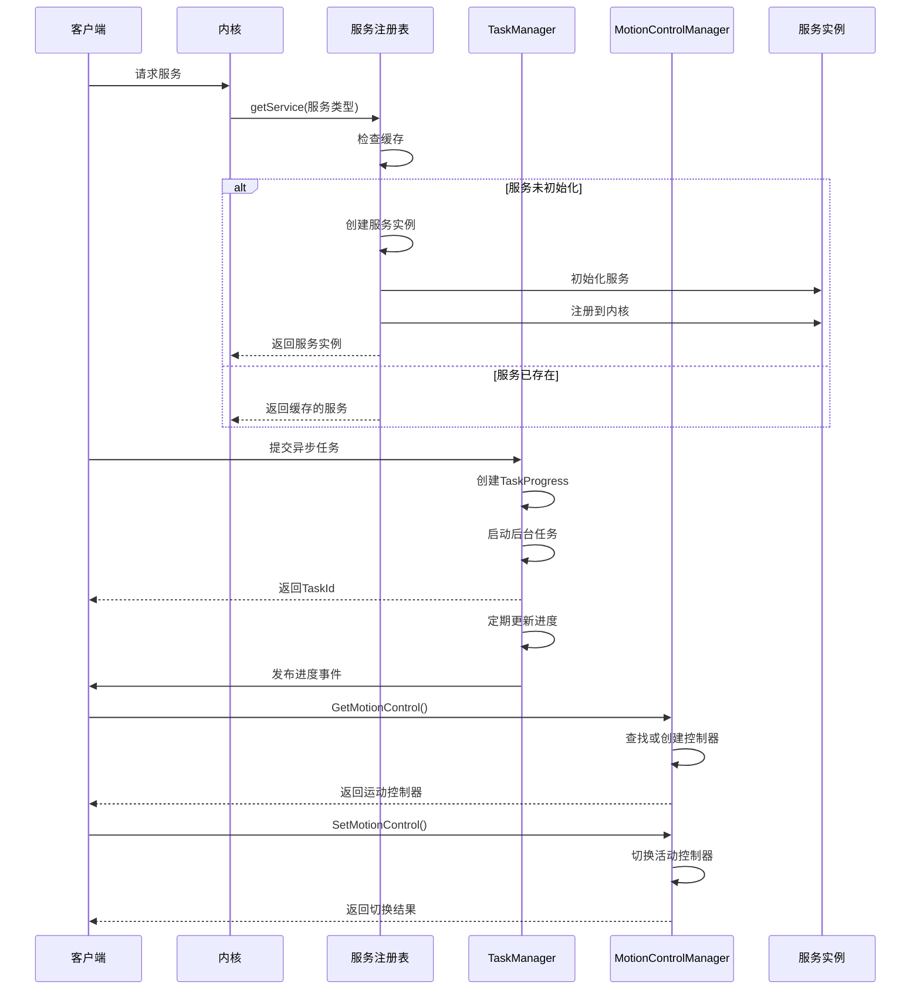
```mermaid
sequenceDiagram
participant Client as 客户端
participant Kernel as 内核
participant Registry as 服务注册表
participant TaskMgr as TaskManager
participant MotionCtlMgr as MotionControlManager
participant Service as 服务实例
Client->>Kernel : 请求服务
Kernel->>Registry : getService(服务类型)
Registry->>Registry : 检查缓存
alt 服务未初始化
Registry->>Registry : 创建服务实例
Registry->>Service : 初始化服务
Registry->>Service : 注册到内核
Registry-->>Kernel : 返回服务实例
else 服务已存在
Registry-->>Kernel : 返回缓存的服务
end
Client->>TaskMgr : 提交异步任务
TaskMgr->>TaskMgr : 创建TaskProgress
TaskMgr->>TaskMgr : 启动后台任务
TaskMgr-->>Client : 返回TaskId
TaskMgr->>TaskMgr : 定期更新进度
TaskMgr->>Client : 发布进度事件
Client->>MotionCtlMgr : GetMotionControl()
MotionCtlMgr->>MotionCtlMgr : 查找或创建控制器
MotionCtlMgr-->>Client : 返回运动控制器
Client->>MotionCtlMgr : SetMotionControl()
MotionCtlMgr->>MotionCtlMgr : 切换活动控制器
MotionCtlMgr-->>Client : 返回切换结果
```

**图表来源**
- [service_registry.cpp:1-200](file://src/core/kernel/service_registry.cpp#L1-L200)
- [kernel.cpp:1-250](file://src/core/kernel/kernel.cpp#L1-L250)
- [task_manager.cpp:35-125](file://src/core/task/task_manager.cpp#L35-L125)
- [MCFactory.cpp:11-24](file://src/modules/process/device/MotionControl/MCFactory.cpp#L11-L24)

**章节来源**
- [kernel.cpp:1-300](file://src/core/kernel/kernel.cpp#L1-L300)
- [service_registry.cpp:1-250](file://src/core/kernel/service_registry.cpp#L1-L250)
- [task_manager.cpp:35-125](file://src/core/task/task_manager.cpp#L35-L125)
- [MCFactory.cpp:11-24](file://src/modules/process/device/MotionControl/MCFactory.cpp#L11-L24)

## 架构概览

Process模块的整体架构采用分层设计，从底层硬件抽象到上层业务逻辑形成清晰的层次结构。**更新** TaskManager作为横切关注点集成到各个服务层中，提供统一的异步任务管理。同时新增了MotionControl接口管理服务。

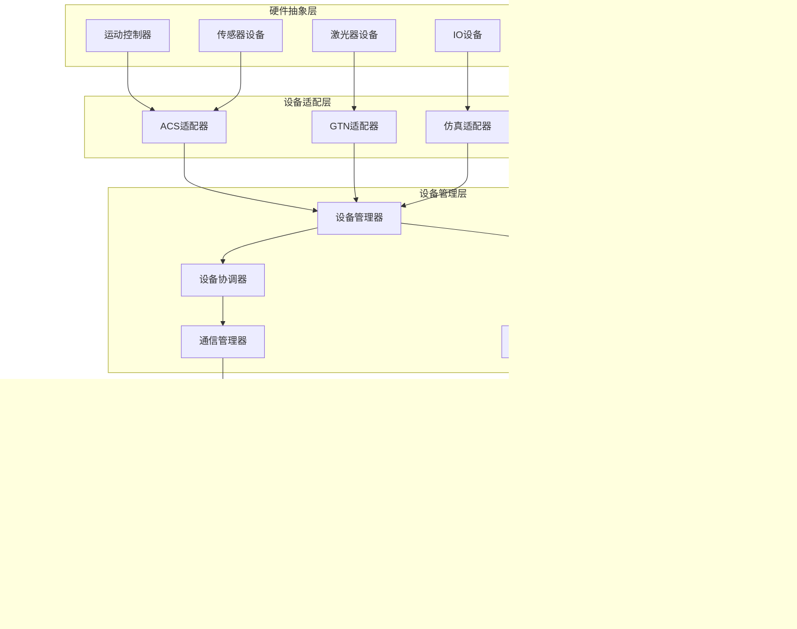
```mermaid
graph TD
subgraph "硬件抽象层"
HW1[运动控制器]
HW2[激光器设备]
HW3[IO设备]
HW4[传感器设备]
end
subgraph "设备适配层"
DA1[ACS适配器]
DA2[GTN适配器]
DA3[仿真适配器]
end
subgraph "设备管理层"
DM[设备管理器]
DC[设备协调器]
CM[通信管理器]
MC[运动控制器管理]
TM[TaskManager]
end
subgraph "业务逻辑层"
ES[执行服务]
MS[监控服务]
WS[工作流服务]
RS[运行时服务]
TS[TaskManager]
end
subgraph "应用界面层"
UI1[流程树视图]
UI2[节点编辑器]
UI3[设备管理器对话框]
UI4[任务管理器对话框]
UI5[MotionControl设置]
end
HW1 --> DA1
HW2 --> DA2
HW3 --> DA3
HW4 --> DA1
DA1 --> DM
DA2 --> DM
DA3 --> DM
DM --> DC
DC --> CM
CM --> ES
ES --> MS
ES --> WS
ES --> RS
RS --> UI1
WS --> UI2
DM --> UI3
TM --> TS
TS --> UI4
MC --> UI5
```

**图表来源**
- [process_device_manager.cpp:1-200](file://src/modules/process/device/MotionControl/process_device_manager.cpp#L1-L200)
- [process_device_coordinator.cpp:1-200](file://src/modules/process/device/MotionControl/process_device_coordinator.cpp#L1-L200)
- [process_execution_service.cpp:1-200](file://src/modules/process/execution/process_execution_service.cpp#L1-L200)
- [task_manager.h:1-46](file://src/core/task/task_manager.h#L1-L46)
- [Setting_MotionControl.ui:1-49](file://src/modules/process/Setting/Setting_MotionControl.ui#L1-L49)

## 详细组件分析

### 执行服务组件

执行服务是Process模块的核心协调器，负责管理整个加工流程的执行。**更新** 集成了TaskManager用于异步任务执行和进度跟踪，并新增了MotionControl接口管理。

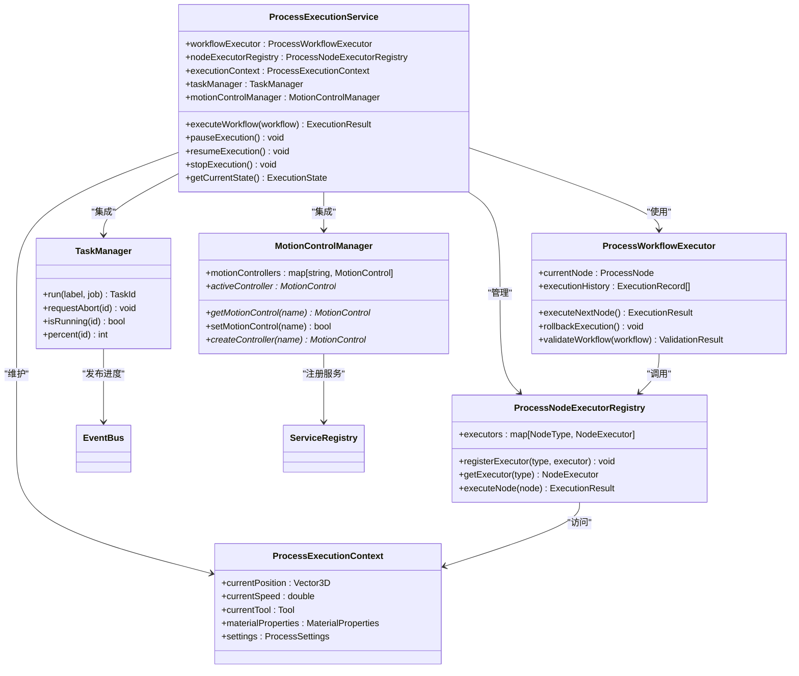
```mermaid
classDiagram
class ProcessExecutionService {
+workflowExecutor : ProcessWorkflowExecutor
+nodeExecutorRegistry : ProcessNodeExecutorRegistry
+executionContext : ProcessExecutionContext
+taskManager : TaskManager
+motionControlManager : MotionControlManager
+executeWorkflow(workflow) ExecutionResult
+pauseExecution() void
+resumeExecution() void
+stopExecution() void
+getCurrentState() ExecutionState
}
class ProcessWorkflowExecutor {
+currentNode : ProcessNode
+executionHistory : ExecutionRecord[]
+executeNextNode() ExecutionResult
+rollbackExecution() void
+validateWorkflow(workflow) ValidationResult
}
class ProcessNodeExecutorRegistry {
+executors : map[NodeType, NodeExecutor]
+registerExecutor(type, executor) void
+getExecutor(type) NodeExecutor
+executeNode(node) ExecutionResult
}
class ProcessExecutionContext {
+currentPosition : Vector3D
+currentSpeed : double
+currentTool : Tool
+materialProperties : MaterialProperties
+settings : ProcessSettings
}
class TaskManager {
+run(label, job) TaskId
+requestAbort(id) void
+isRunning(id) bool
+percent(id) int
}
class MotionControlManager {
+motionControllers : map[string, MotionControl]
+activeController : MotionControl*
+getMotionControl(name) MotionControl*
+setMotionControl(name) bool
+createController(name) MotionControl*
}
ProcessExecutionService --> ProcessWorkflowExecutor : "使用"
ProcessExecutionService --> ProcessNodeExecutorRegistry : "管理"
ProcessExecutionService --> ProcessExecutionContext : "维护"
ProcessExecutionService --> TaskManager : "集成"
ProcessExecutionService --> MotionControlManager : "集成"
ProcessWorkflowExecutor --> ProcessNodeExecutorRegistry : "调用"
ProcessNodeExecutorRegistry --> ProcessExecutionContext : "访问"
TaskManager --> EventBus : "发布进度"
MotionControlManager --> ServiceRegistry : "注册服务"
```

**图表来源**
- [process_execution_service.h:1-200](file://src/modules/process/execution/process_execution_service.h#L1-L200)
- [process_workflow_executor.cpp:1-200](file://src/modules/process/execution/process_workflow_executor.cpp#L1-L200)
- [process_node_executor_registry.h:1-150](file://src/modules/process/execution/process_node_executor_registry.h#L1-L150)
- [task_manager.h:1-46](file://src/core/task/task_manager.h#L1-L46)
- [MCFactory.h:13-28](file://src/modules/process/device/MotionControl/MCFactory.h#L13-L28)

### 监控服务组件

监控服务负责实时跟踪设备状态和执行进度。**更新** 集成了TaskManager的进度跟踪功能，提供更细粒度的状态监控，并集成了MotionControl接口管理。

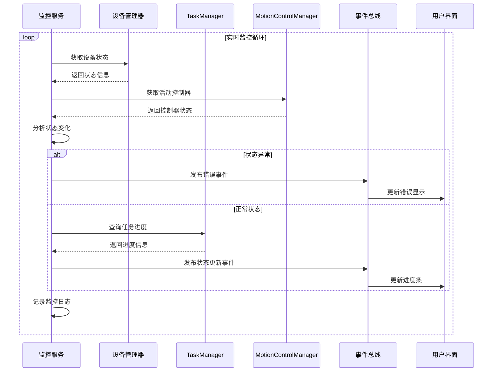
```mermaid
sequenceDiagram
participant Monitor as 监控服务
participant Device as 设备管理器
participant TaskMgr as TaskManager
participant MotionCtlMgr as MotionControlManager
participant Event as 事件总线
participant UI as 用户界面
loop 实时监控循环
Monitor->>Device : 获取设备状态
Device-->>Monitor : 返回状态信息
Monitor->>MotionCtlMgr : 获取活动控制器
MotionCtlMgr-->>Monitor : 返回控制器状态
Monitor->>Monitor : 分析状态变化
alt 状态异常
Monitor->>Event : 发布错误事件
Event->>UI : 更新错误显示
else 正常状态
Monitor->>TaskMgr : 查询任务进度
TaskMgr-->>Monitor : 返回进度信息
Monitor->>Event : 发布状态更新事件
Event->>UI : 更新进度条
end
Monitor->>Monitor : 记录监控日志
end
```

**图表来源**
- [process_monitor_service.cpp:1-250](file://src/modules/process/monitor/process_monitor_service.cpp#L1-L250)
- [event_bus.cpp:1-200](file://src/core/kernel/event_bus.cpp#L1-L200)
- [task_manager.cpp:85-110](file://src/core/task/task_manager.cpp#L85-L110)
- [MCFactory.cpp:11-24](file://src/modules/process/device/MotionControl/MCFactory.cpp#L11-L24)

### 工作流服务组件

工作流服务管理复杂的加工流程定义和执行。**更新** 集成了TaskManager用于异步工作流执行，支持长时间运行的任务进度跟踪，并集成了MotionControl接口管理。

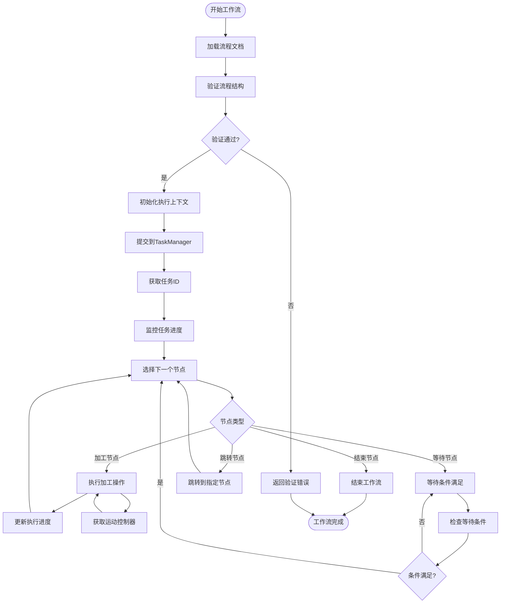
```mermaid
flowchart TD
Start([开始工作流]) --> LoadDoc["加载流程文档"]
LoadDoc --> Validate["验证流程结构"]
Validate --> Valid{"验证通过?"}
Valid --> |否| Error["返回验证错误"]
Valid --> |是| InitContext["初始化执行上下文"]
InitContext --> SubmitTask["提交到TaskManager"]
SubmitTask --> TaskId["获取任务ID"]
TaskId --> MonitorTask["监控任务进度"]
MonitorTask --> SelectNode["选择下一个节点"]
SelectNode --> NodeType{"节点类型"}
NodeType --> |加工节点| ExecuteOp["执行加工操作"]
NodeType --> |等待节点| WaitNode["等待条件满足"]
NodeType --> |跳转节点| JumpNode["跳转到指定节点"]
NodeType --> |结束节点| EndNode["结束工作流"]
ExecuteOp --> UpdateProgress["更新执行进度"]
ExecuteOp --> GetMotionCtl["获取运动控制器"]
GetMotionCtl --> ExecuteOp
WaitNode --> CheckCondition["检查等待条件"]
CheckCondition --> ConditionMet{"条件满足?"}
ConditionMet --> |否| WaitNode
ConditionMet --> |是| SelectNode
UpdateProgress --> SelectNode
JumpNode --> SelectNode
EndNode --> Complete([工作流完成])
Error --> Complete
```

**图表来源**
- [process_workflow_service.cpp:1-300](file://src/modules/process/workflow/process_workflow_service.cpp#L1-L300)
- [process_flow_document.cpp:1-200](file://src/modules/process/workflow/process_flow_document.cpp#L1-L200)
- [task_manager.h:28-38](file://src/core/task/task_manager.h#L28-L38)
- [MCFactory.cpp:11-24](file://src/modules/process/device/MotionControl/MCFactory.cpp#L11-L24)

**章节来源**
- [process_execution_service.cpp:1-300](file://src/modules/process/execution/process_execution_service.cpp#L1-L300)
- [process_monitor_service.cpp:1-300](file://src/modules/process/monitor/process_monitor_service.cpp#L1-L300)
- [process_workflow_service.cpp:1-350](file://src/modules/process/workflow/process_workflow_service.cpp#L1-L350)
- [task_manager.h:28-38](file://src/core/task/task_manager.h#L28-L38)
- [MCFactory.cpp:11-24](file://src/modules/process/device/MotionControl/MCFactory.cpp#L11-L24)

### 设备管理组件

设备管理器负责协调多个设备的同步操作。**更新** 集成了TaskManager用于设备连接和断开的异步管理，提供进度反馈和错误处理，并集成了MotionControl接口管理。

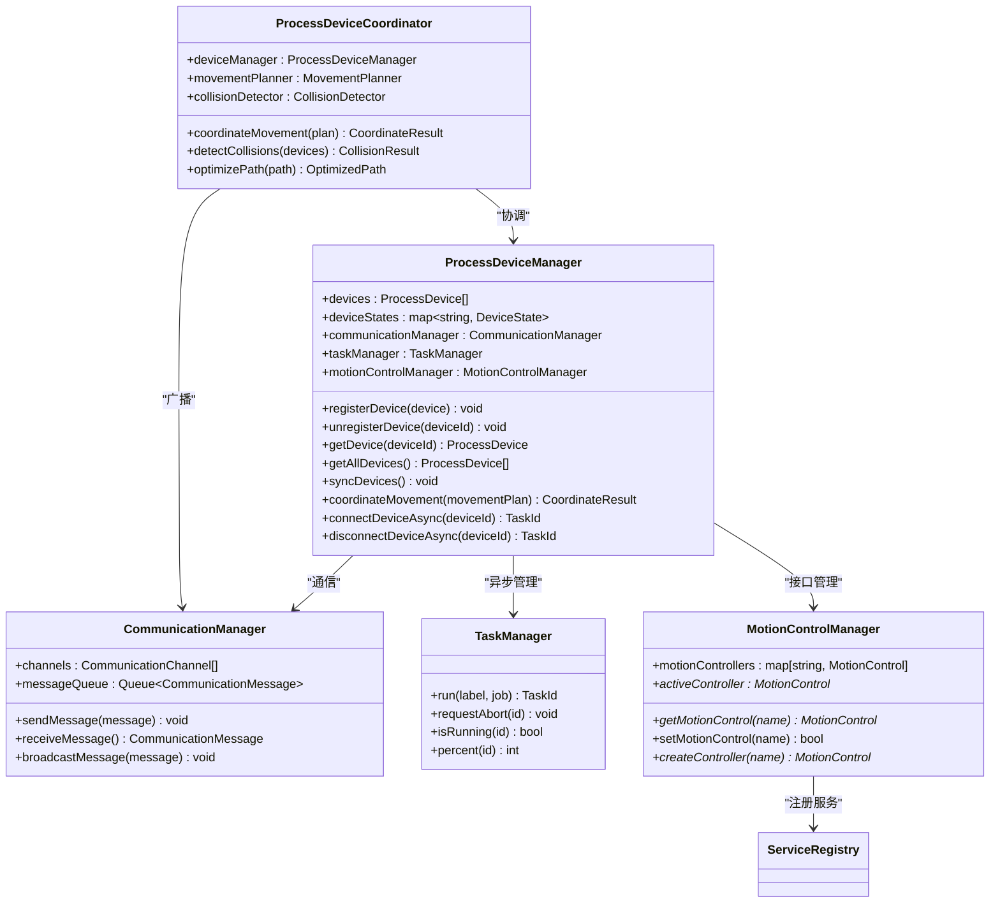
```mermaid
classDiagram
class ProcessDeviceManager {
+devices : ProcessDevice[]
+deviceStates : map~string, DeviceState~
+communicationManager : CommunicationManager
+taskManager : TaskManager
+motionControlManager : MotionControlManager
+registerDevice(device) void
+unregisterDevice(deviceId) void
+getDevice(deviceId) ProcessDevice
+getAllDevices() ProcessDevice[]
+syncDevices() void
+coordinateMovement(movementPlan) CoordinateResult
+connectDeviceAsync(deviceId) TaskId
+disconnectDeviceAsync(deviceId) TaskId
}
class ProcessDeviceCoordinator {
+deviceManager : ProcessDeviceManager
+movementPlanner : MovementPlanner
+collisionDetector : CollisionDetector
+coordinateMovement(plan) CoordinateResult
+detectCollisions(devices) CollisionResult
+optimizePath(path) OptimizedPath
}
class CommunicationManager {
+channels : CommunicationChannel[]
+messageQueue : Queue~CommunicationMessage~
+sendMessage(message) void
+receiveMessage() CommunicationMessage
+broadcastMessage(message) void
}
class TaskManager {
+run(label, job) TaskId
+requestAbort(id) void
+isRunning(id) bool
+percent(id) int
}
class MotionControlManager {
+motionControllers : map[string, MotionControl]
+activeController : MotionControl*
+getMotionControl(name) MotionControl*
+setMotionControl(name) bool
+createController(name) MotionControl*
}
ProcessDeviceManager --> CommunicationManager : "通信"
ProcessDeviceManager --> TaskManager : "异步管理"
ProcessDeviceManager --> MotionControlManager : "接口管理"
ProcessDeviceCoordinator --> ProcessDeviceManager : "协调"
ProcessDeviceCoordinator --> CommunicationManager : "广播"
MotionControlManager --> ServiceRegistry : "注册服务"
```

**图表来源**
- [process_device_manager.h:1-200](file://src/modules/process/device/MotionControl/process_device_manager.h#L1-L200)
- [process_device_coordinator.h:1-200](file://src/modules/process/device/MotionControl/process_device_coordinator.h#L1-L200)
- [communication_manager.h:1-200](file://src/modules/process/communication/communication_manager.h#L1-L200)
- [task_manager.h:1-46](file://src/core/task/task_manager.h#L1-L46)
- [MCFactory.h:13-28](file://src/modules/process/device/MotionControl/MCFactory.h#L13-L28)

### 工具路径服务组件

工具路径服务负责生成和优化加工轨迹。**更新** 集成了TaskManager用于长时间路径计算任务的异步执行和进度跟踪，并集成了MotionControl接口管理。

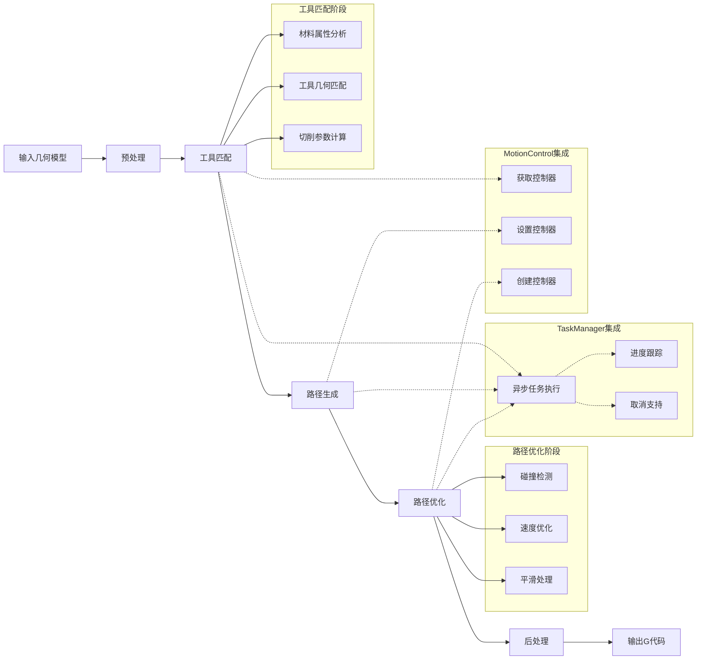
```mermaid
flowchart LR
Input[输入几何模型] --> Preprocess[预处理]
Preprocess --> ToolMatch[工具匹配]
ToolMatch --> PathGen[路径生成]
PathGen --> Optimize[路径优化]
Optimize --> PostProcess[后处理]
PostProcess --> Output[输出G代码]
subgraph "工具匹配阶段"
TM1[材料属性分析]
TM2[工具几何匹配]
TM3[切削参数计算]
end
subgraph "路径优化阶段"
OP1[碰撞检测]
OP2[速度优化]
OP3[平滑处理]
end
ToolMatch --> TM1
ToolMatch --> TM2
ToolMatch --> TM3
Optimize --> OP1
Optimize --> OP2
Optimize --> OP3
subgraph "TaskManager集成"
TM_TASK[异步任务执行]
TM_PROGRESS[进度跟踪]
TM_ABORT[取消支持]
end
ToolMatch -.-> TM_TASK
PathGen -.-> TM_TASK
Optimize -.-> TM_TASK
TM_TASK -.-> TM_PROGRESS
TM_TASK -.-> TM_ABORT
subgraph "MotionControl集成"
MC_GET[获取控制器]
MC_SET[设置控制器]
MC_CREATE[创建控制器]
end
ToolMatch -.-> MC_GET
PathGen -.-> MC_SET
Optimize -.-> MC_CREATE
```

**图表来源**
- [process_toolpath_service.cpp:1-250](file://src/modules/process/toolpath/process_toolpath_service.cpp#L1-L250)
- [process_tool_matcher.cpp:1-200](file://src/modules/process/toolpath/process_tool_matcher.cpp#L1-L200)
- [process_toolpath_sorter.cpp:1-200](file://src/modules/process/toolpath/process_toolpath_sorter.cpp#L1-L200)
- [task_manager.h:28-38](file://src/core/task/task_manager.h#L28-L38)
- [MCFactory.cpp:11-24](file://src/modules/process/device/MotionControl/MCFactory.cpp#L11-L24)

**章节来源**
- [process_device_manager.cpp:1-300](file://src/modules/process/device/MotionControl/process_device_manager.cpp#L1-L300)
- [process_device_coordinator.cpp:1-300](file://src/modules/process/device/MotionControl/process_device_coordinator.cpp#L1-L300)
- [process_toolpath_service.cpp:1-300](file://src/modules/process/toolpath/process_toolpath_service.cpp#L1-L300)
- [task_manager.h:28-38](file://src/core/task/task_manager.h#L28-L38)
- [MCFactory.cpp:11-24](file://src/modules/process/device/MotionControl/MCFactory.cpp#L11-L24)

### 运行时服务组件

运行时服务管理执行过程中的状态转换。**更新** 集成了TaskManager用于长时间运行任务的异步执行和状态管理，并集成了MotionControl接口管理。

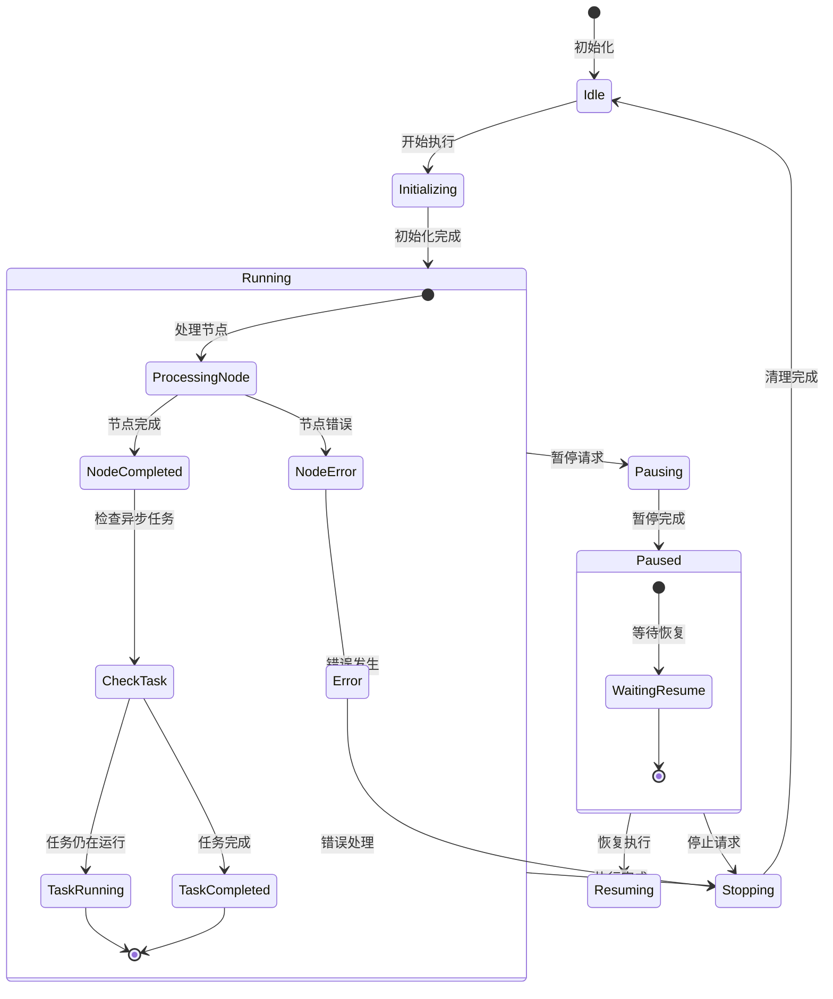
```mermaid
stateDiagram-v2
[*] --> Idle : 初始化
Idle --> Initializing : 开始执行
Initializing --> Running : 初始化完成
Running --> Pausing : 暂停请求
Pausing --> Paused : 暂停完成
Paused --> Resuming : 恢复执行
Paused --> Stopping : 停止请求
Running --> Stopping : 执行完成
Running --> Error : 错误发生
Error --> Stopping : 错误处理
Stopping --> Idle : 清理完成
state Running {
[*] --> ProcessingNode : 处理节点
ProcessingNode --> NodeCompleted : 节点完成
ProcessingNode --> NodeError : 节点错误
NodeCompleted --> CheckTask : 检查异步任务
NodeError --> Error
CheckTask --> TaskRunning : 任务仍在运行
CheckTask --> TaskCompleted : 任务完成
TaskRunning --> [*]
TaskCompleted --> [*]
}
state Paused {
[*] --> WaitingResume : 等待恢复
WaitingResume --> [*]
}
```

**图表来源**
- [process_runtime.cpp:1-250](file://src/modules/process/runtime/process_runtime.cpp#L1-L250)
- [process_state_machine.cpp:1-200](file://src/modules/process/runtime/process_state_machine.cpp#L1-L200)

**章节来源**
- [process_runtime.cpp:1-300](file://src/modules/process/runtime/process_runtime.cpp#L1-L300)
- [process_state_machine.cpp:1-250](file://src/modules/process/runtime/process_state_machine.cpp#L1-L250)

## Service层MotionControl接口管理

### 接口设计原理

Service层的MotionControl接口管理提供了统一的运动控制器访问接口，通过GetMotionControl()和SetMotionControl()方法实现控制器的动态选择和管理。

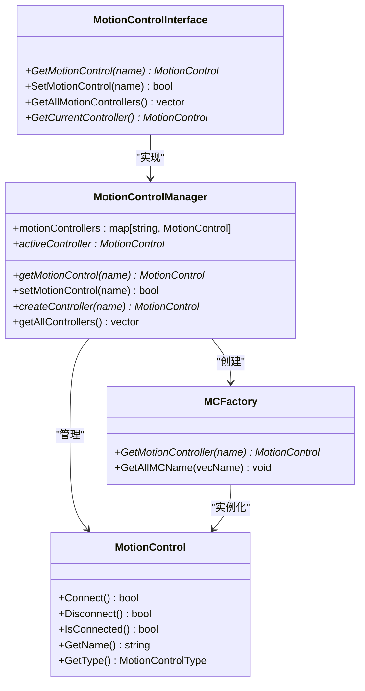
```mermaid
classDiagram
class MotionControlInterface {
+GetMotionControl(name) MotionControl*
+SetMotionControl(name) bool
+GetAllMotionControllers() vector<string>
+GetCurrentController() MotionControl*
}
class MotionControlManager {
+motionControllers : map[string, MotionControl]
+activeController : MotionControl*
+getMotionControl(name) MotionControl*
+setMotionControl(name) bool
+createController(name) MotionControl*
+getAllControllers() vector<string>
}
class MotionControl {
+Connect() bool
+Disconnect() bool
+IsConnected() bool
+GetName() string
+GetType() MotionControlType
}
class MCFactory {
+GetMotionController(name) MotionControl*
+GetAllMCName(vecName) void
}
MotionControlInterface --> MotionControlManager : "实现"
MotionControlManager --> MotionControl : "管理"
MotionControlManager --> MCFactory : "创建"
MCFactory --> MotionControl : "实例化"
```

**图表来源**
- [MCFactory.h:13-28](file://src/modules/process/device/MotionControl/MCFactory.h#L13-L28)
- [MCFactory.cpp:11-37](file://src/modules/process/device/MotionControl/MCFactory.cpp#L11-L37)
- [MotionControl.cpp:544-586](file://src/modules/process/device/MotionControl/MotionControl.cpp#L544-L586)

### GetMotionControl()方法实现

GetMotionControl()方法提供了运动控制器的获取功能，支持动态控制器选择和缓存管理：

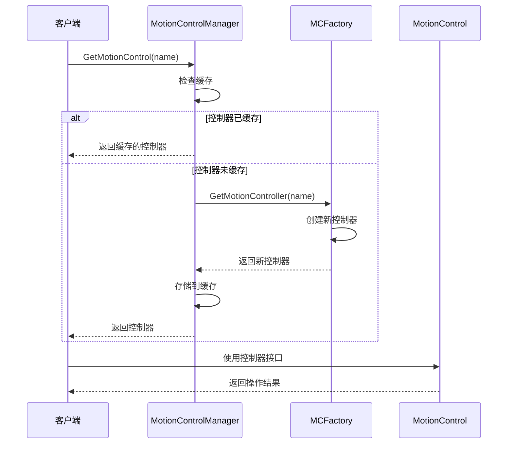
```mermaid
sequenceDiagram
participant Client as 客户端
participant Manager as MotionControlManager
participant Factory as MCFactory
participant Controller as MotionControl
Client->>Manager : GetMotionControl(name)
Manager->>Manager : 检查缓存
alt 控制器已缓存
Manager-->>Client : 返回缓存的控制器
else 控制器未缓存
Manager->>Factory : GetMotionController(name)
Factory->>Factory : 创建新控制器
Factory-->>Manager : 返回新控制器
Manager->>Manager : 存储到缓存
Manager-->>Client : 返回控制器
end
Client->>Controller : 使用控制器接口
Controller-->>Client : 返回操作结果
```

**图表来源**
- [MCFactory.cpp:11-24](file://src/modules/process/device/MotionControl/MCFactory.cpp#L11-L24)
- [MCFactory.h:16](file://src/modules/process/device/MotionControl/MCFactory.h#L16)

### SetMotionControl()方法实现

SetMotionControl()方法实现了活动控制器的切换功能，支持运行时控制器替换：

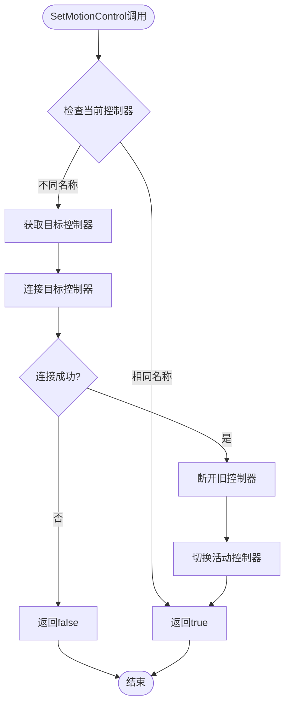
```mermaid
flowchart TD
Start([SetMotionControl调用]) --> CheckActive{"检查当前控制器"}
CheckActive --> |相同名称| ReturnTrue["返回true"]
CheckActive --> |不同名称| GetController["获取目标控制器"]
GetController --> ConnectController["连接目标控制器"]
ConnectController --> ConnectSuccess{"连接成功?"}
ConnectSuccess --> |否| ReturnFalse["返回false"]
ConnectSuccess --> |是| DisconnectOld["断开旧控制器"]
DisconnectOld --> SwitchActive["切换活动控制器"]
SwitchActive --> ReturnTrue
ReturnFalse --> End([结束])
ReturnTrue --> End
```

**图表来源**
- [MCFactory.cpp:11-24](file://src/modules/process/device/MotionControl/MCFactory.cpp#L11-L24)
- [MCFactory.h:16](file://src/modules/process/device/MotionControl/MCFactory.h#L16)

### 配置驱动的控制器选择

系统支持通过配置文件动态选择运动控制器类型，提供灵活的设备兼容性：

```mermaid
flowchart LR
Config[配置文件] --> Parser[TOML解析器]
Parser --> Settings[设置管理器]
Settings --> ControllerSelector[控制器选择器]
ControllerSelector --> MCFactory[MCFactory]
MCFactory --> Controller[运动控制器]
Controller --> DeviceManager[设备管理器]
```

**图表来源**
- [Setting_MotionControl.cpp:80-88](file://src/modules/process/Setting/Setting_MotionControl.cpp#L80-L88)
- [toml_config.cpp:15-46](file://src/core/settings/toml_config.cpp#L15-L46)

**章节来源**
- [MCFactory.cpp:11-37](file://src/modules/process/device/MotionControl/MCFactory.cpp#L11-L37)
- [MCFactory.h:13-28](file://src/modules/process/device/MotionControl/MCFactory.h#L13-L28)
- [MotionControl.cpp:544-586](file://src/modules/process/device/MotionControl/MotionControl.cpp#L544-L586)
- [Setting_MotionControl.cpp:80-88](file://src/modules/process/Setting/Setting_MotionControl.cpp#L80-L88)

## 配置文件加载机制

### TOML配置格式支持

系统采用了现代化的TOML配置格式，提供了更好的可读性和维护性。**更新** 新增了完整的TOML配置加载和保存机制。

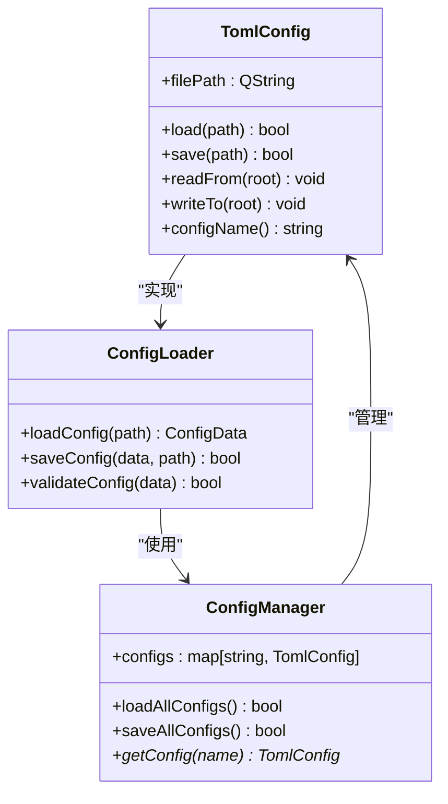
```mermaid
classDiagram
class TomlConfig {
+filePath : QString
+load(path) bool
+save(path) bool
+readFrom(root) void
+writeTo(root) void
+configName() string
}
class ConfigLoader {
+loadConfig(path) ConfigData
+saveConfig(data, path) bool
+validateConfig(data) bool
}
class ConfigManager {
+configs : map[string, TomlConfig]
+loadAllConfigs() bool
+saveAllConfigs() bool
+getConfig(name) TomlConfig*
}
TomlConfig --> ConfigLoader : "实现"
ConfigManager --> TomlConfig : "管理"
ConfigLoader --> ConfigManager : "使用"
```

**图表来源**
- [toml_config.cpp:15-76](file://src/core/settings/toml_config.cpp#L15-L76)
- [toml_config.h:1-100](file://src/core/settings/toml_config.h#L1-L100)

### 配置文件加载流程

配置文件加载机制提供了完整的错误处理和回退策略：

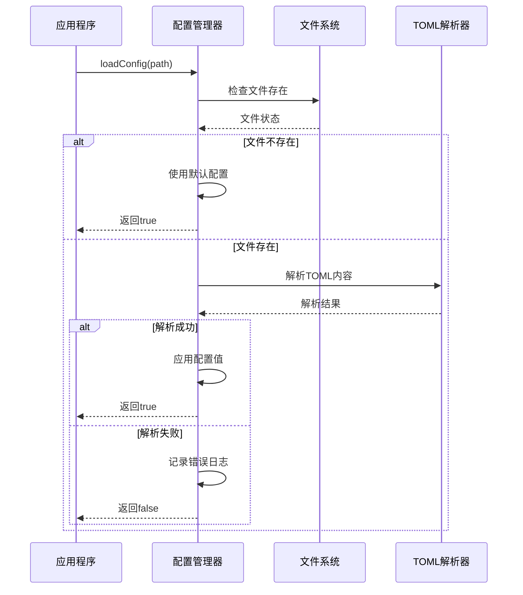
```mermaid
sequenceDiagram
participant App as 应用程序
participant ConfigMgr as 配置管理器
participant FileSys as 文件系统
participant Parser as TOML解析器
App->>ConfigMgr : loadConfig(path)
ConfigMgr->>FileSys : 检查文件存在
FileSys-->>ConfigMgr : 文件状态
alt 文件不存在
ConfigMgr->>ConfigMgr : 使用默认配置
ConfigMgr-->>App : 返回true
else 文件存在
ConfigMgr->>Parser : 解析TOML内容
Parser-->>ConfigMgr : 解析结果
alt 解析成功
ConfigMgr->>ConfigMgr : 应用配置值
ConfigMgr-->>App : 返回true
else 解析失败
ConfigMgr->>ConfigMgr : 记录错误日志
ConfigMgr-->>App : 返回false
end
end
```

**图表来源**
- [toml_config.cpp:15-46](file://src/core/settings/toml_config.cpp#L15-L46)

### 配置验证和错误处理

系统实现了严格的配置验证机制，确保配置数据的完整性和有效性：

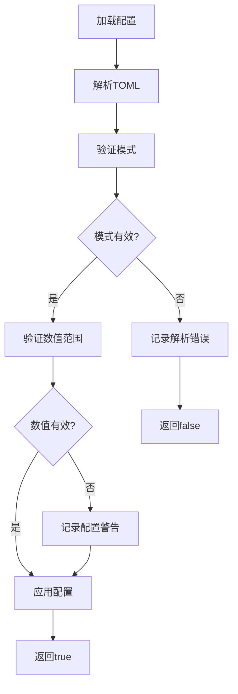
```mermaid
flowchart TD
LoadConfig[加载配置] --> ParseTOML[解析TOML]
ParseTOML --> ValidateSchema[验证模式]
ValidateSchema --> SchemaValid{"模式有效?"}
SchemaValid --> |否| LogError[记录解析错误]
SchemaValid --> |是| ValidateValues[验证数值范围]
ValidateValues --> ValuesValid{"数值有效?"}
ValuesValid --> |否| LogWarning[记录配置警告]
ValuesValid --> |是| ApplyConfig[应用配置]
LogError --> ReturnFalse[返回false]
LogWarning --> ApplyConfig
ApplyConfig --> ReturnTrue[返回true]
```

**图表来源**
- [toml_config.cpp:35-45](file://src/core/settings/toml_config.cpp#L35-L45)

**章节来源**
- [toml_config.cpp:15-76](file://src/core/settings/toml_config.cpp#L15-L76)
- [toml_config.h:1-100](file://src/core/settings/toml_config.h#L1-L100)

## MCFactory工厂模式

### 工厂设计模式

MCFactory实现了标准的工厂设计模式，提供了运动控制器的统一创建和管理接口。

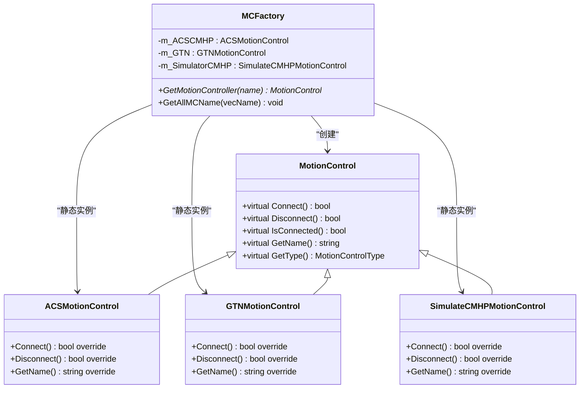
```mermaid
classDiagram
class MCFactory {
+GetMotionController(name) MotionControl*
+GetAllMCName(vecName) void
-m_ACSCMHP : ACSMotionControl
-m_GTN : GTNMotionControl
-m_SimulatorCMHP : SimulateCMHPMotionControl
}
class MotionControl {
+virtual Connect() bool
+virtual Disconnect() bool
+virtual IsConnected() bool
+virtual GetName() string
+virtual GetType() MotionControlType
}
class ACSMotionControl {
+Connect() bool override
+Disconnect() bool override
+GetName() string override
}
class GTNMotionControl {
+Connect() bool override
+Disconnect() bool override
+GetName() string override
}
class SimulateCMHPMotionControl {
+Connect() bool override
+Disconnect() bool override
+GetName() string override
}
MCFactory --> MotionControl : "创建"
MCFactory --> ACSMotionControl : "静态实例"
MCFactory --> GTNMotionControl : "静态实例"
MCFactory --> SimulateCMHPMotionControl : "静态实例"
MotionControl <|-- ACSMotionControl
MotionControl <|-- GTNMotionControl
MotionControl <|-- SimulateCMHPMotionControl
```

**图表来源**
- [MCFactory.h:13-28](file://src/modules/process/device/MotionControl/MCFactory.h#L13-L28)
- [MCFactory.cpp:1-37](file://src/modules/process/device/MotionControl/MCFactory.cpp#L1-37)
- [MotionControl.h:1-200](file://src/modules/process/device/MotionControl/MotionControl.h#L1-L200)

### 动态控制器创建

MCFactory支持根据名称动态创建不同的运动控制器实例：

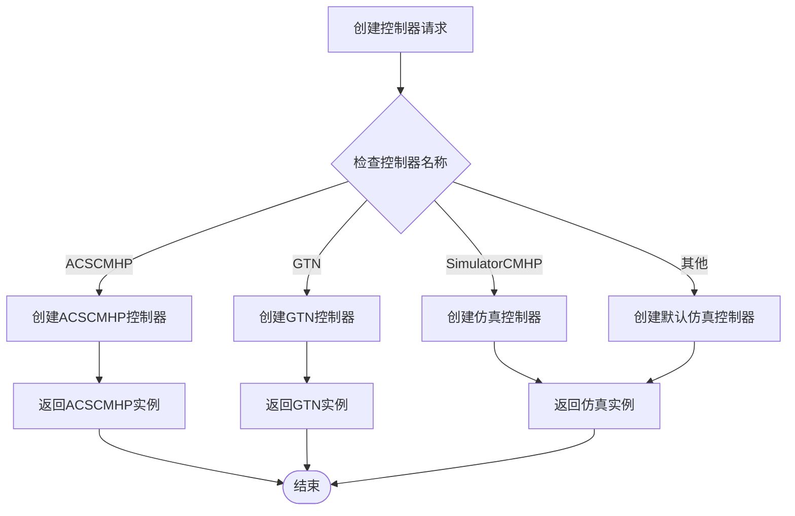
```mermaid
flowchart TD
CreateRequest[创建控制器请求] --> CheckName{检查控制器名称}
CheckName --> |ACSCMHP| CreateACS[创建ACSCMHP控制器]
CheckName --> |GTN| CreateGTN[创建GTN控制器]
CheckName --> |SimulatorCMHP| CreateSim[创建仿真控制器]
CheckName --> |其他| CreateDefault[创建默认仿真控制器]
CreateACS --> ReturnACS[返回ACSCMHP实例]
CreateGTN --> ReturnGTN[返回GTN实例]
CreateSim --> ReturnSim[返回仿真实例]
CreateDefault --> ReturnSim
ReturnACS --> End([结束])
ReturnGTN --> End
ReturnSim --> End
```

**图表来源**
- [MCFactory.cpp:11-24](file://src/modules/process/device/MotionControl/MCFactory.cpp#L11-L24)

### 静态实例管理

MCFactory使用静态成员变量管理不同类型的运动控制器实例，确保全局唯一性：

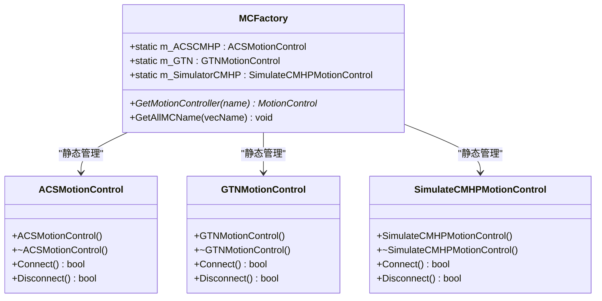
```mermaid
classDiagram
class MCFactory {
+static m_ACSCMHP : ACSMotionControl
+static m_GTN : GTNMotionControl
+static m_SimulatorCMHP : SimulateCMHPMotionControl
+GetMotionController(name) MotionControl*
+GetAllMCName(vecName) void
}
class ACSMotionControl {
+ACSMotionControl()
+~ACSMotionControl()
+Connect() bool
+Disconnect() bool
}
class GTNMotionControl {
+GTNMotionControl()
+~GTNMotionControl()
+Connect() bool
+Disconnect() bool
}
class SimulateCMHPMotionControl {
+SimulateCMHPMotionControl()
+~SimulateCMHPMotionControl()
+Connect() bool
+Disconnect() bool
}
MCFactory --> ACSMotionControl : "静态管理"
MCFactory --> GTNMotionControl : "静态管理"
MCFactory --> SimulateCMHPMotionControl : "静态管理"
```

**图表来源**
- [MCFactory.cpp:3-9](file://src/modules/process/device/MotionControl/MCFactory.cpp#L3-L9)
- [MCFactory.h:19-25](file://src/modules/process/device/MotionControl/MCFactory.h#L19-L25)

**章节来源**
- [MCFactory.cpp:1-37](file://src/modules/process/device/MotionControl/MCFactory.cpp#L1-L37)
- [MCFactory.h:13-28](file://src/modules/process/device/MotionControl/MCFactory.h#L13-L28)

## 依赖关系分析

Process模块内部的依赖关系呈现清晰的层次结构。**更新** TaskManager作为核心依赖被集成到各个服务层中，MCFactory作为运动控制器创建的核心组件。

```mermaid
graph TB
subgraph "外部依赖"
Qt[Qt框架]
Spdlog[日志库]
Toml[TOML配置]
TaskMgr[TaskManager]
DialogTask[DialogTaskManager]
MCFactory[MCFactory]
MotionCtl[MotionControl]
end
subgraph "核心内核"
Kernel[Kernel]
ModuleReg[模块注册表]
ServiceReg[服务注册表]
EventBus[事件总线]
end
subgraph "Process模块"
ExecSvc[执行服务]
MonitorSvc[监控服务]
WorkflowSvc[工作流服务]
RuntimeSvc[运行时服务]
DeviceMgr[设备管理器]
DeviceCoord[设备协调器]
CommMgr[通信管理器]
ToolpathSvc[工具路径服务]
end
subgraph "系统模块"
SysSvc[系统服务]
License[许可证]
LogMod[日志模块]
MsgMod[消息模块]
CfgMgr[配置管理器]
end
Qt --> Kernel
Spdlog --> SysSvc
Toml --> SysSvc
Kernel --> ModuleReg
Kernel --> ServiceReg
Kernel --> EventBus
Kernel --> TaskMgr
ModuleReg --> ExecSvc
ModuleReg --> MonitorSvc
ModuleReg --> WorkflowSvc
ModuleReg --> RuntimeSvc
ExecSvc --> DeviceMgr
ExecSvc --> TaskMgr
MonitorSvc --> DeviceCoord
MonitorSvc --> TaskMgr
WorkflowSvc --> CommMgr
WorkflowSvc --> TaskMgr
DeviceMgr --> ToolpathSvc
DeviceMgr --> TaskMgr
DeviceMgr --> MCFactory
SysSvc --> License
SysSvc --> LogMod
SysSvc --> MsgMod
SysSvc --> CfgMgr
TaskMgr --> DialogTask
DialogTask --> TaskMgr
MCFactory --> MotionCtl
MotionCtl --> DeviceMgr
```

**图表来源**
- [process_module.cpp:1-200](file://src/modules/process/process_module.cpp#L1-L200)
- [kernel.cpp:1-200](file://src/core/kernel/kernel.cpp#L1-L200)
- [task_manager.h:1-46](file://src/core/task/task_manager.h#L1-L46)
- [dialog_task_manager.h:18-44](file://src/app/dialog/dialog_task_manager.h#L18-L44)
- [MCFactory.h:13-28](file://src/modules/process/device/MotionControl/MCFactory.h#L13-L28)

**章节来源**
- [process_module.cpp:1-250](file://src/modules/process/process_module.cpp#L1-L250)
- [module_registry.cpp:1-200](file://src/core/kernel/module_registry.cpp#L1-L200)
- [task_manager.h:1-46](file://src/core/task/task_manager.h#L1-L46)
- [dialog_task_manager.h:18-44](file://src/app/dialog/dialog_task_manager.h#L18-L44)
- [MCFactory.h:13-28](file://src/modules/process/device/MotionControl/MCFactory.h#L13-L28)

## 性能考虑

### 并发处理机制

Process模块采用了多线程并发设计来提高执行效率。**更新** TaskManager集成了异步任务执行，提供了更好的并发性能和用户体验。同时新增了MotionControl接口的线程安全性考虑。

```mermaid
sequenceDiagram
participant Main as 主线程
participant TaskMgr as TaskManager
participant ExecThread as 执行线程
participant MonitorThread as 监控线程
participant IOThread as IO线程
participant MotionCtlMgr as MotionControlManager
Main->>TaskMgr : 提交异步任务
TaskMgr->>ExecThread : 启动执行任务
Main->>MonitorThread : 启动监控任务
Main->>IOThread : 启动IO任务
Main->>MotionCtlMgr : 获取运动控制器
MotionCtlMgr->>MotionCtlMgr : 线程安全检查
MotionCtlMgr-->>Main : 返回控制器
par 并发执行
ExecThread->>ExecThread : 执行加工指令
ExecThread->>TaskMgr : 更新任务进度
TaskMgr->>Main : 异步进度通知
MonitorThread->>MonitorThread : 监控设备状态
IOThread->>IOThread : 处理通信数据
MotionCtlMgr->>MotionCtlMgr : 更新控制器状态
end
ExecThread->>TaskMgr : 任务完成
TaskMgr->>Main : 任务完成通知
MonitorThread->>Main : 状态更新通知
IOThread->>Main : 数据传输完成
MotionCtlMgr->>Main : 控制器状态更新
```

### 内存管理策略

模块采用了智能指针和RAII技术确保内存安全。**更新** TaskManager集成了自动资源清理机制，确保任务完成后的正确资源释放。同时新增了MotionControl对象的生命周期管理。

- 使用std::shared_ptr管理服务对象生命周期
- 使用std::unique_ptr管理临时资源
- 实现自定义删除器处理复杂对象释放
- 采用对象池减少频繁内存分配
- **新增** MotionControl对象缓存和复用机制
- **新增** 静态工厂实例的内存管理

### 缓存机制

为了提高性能，模块实现了多层次缓存。**更新** TaskManager集成了任务结果缓存和进度状态缓存，同时新增了MotionControl控制器的缓存机制。

- 服务实例缓存：避免重复创建昂贵的服务对象
- 设备状态缓存：减少设备查询开销
- 工具路径缓存：重用已计算的加工轨迹
- 配置参数缓存：快速访问常用设置
- **新增** 运动控制器缓存：重用已创建的控制器实例
- **新增** 配置文件缓存：避免重复解析配置
- **新增** 任务进度缓存：避免重复计算进度状态

## 故障排除指南

### 常见问题诊断

```mermaid
flowchart TD
Issue[出现异常] --> CheckLog["检查日志文件"]
CheckLog --> LogLevel{"日志级别"}
LogLevel --> |ERROR| FindError["查找错误信息"]
LogLevel --> |WARN| FindWarn["查找警告信息"]
LogLevel --> |DEBUG| FindDebug["查找调试信息"]
FindError --> AnalyzeError["分析错误原因"]
FindWarn --> AnalyzeWarn["分析警告原因"]
FindDebug --> AnalyzeDebug["分析调试信息"]
AnalyzeError --> Solution{"找到解决方案?"}
AnalyzeWarn --> Solution
AnalyzeDebug --> Solution
Solution --> |是| ApplyFix["应用修复方案"]
Solution --> |否| ContactSupport["联系技术支持"]
ApplyFix --> VerifyFix["验证修复效果"]
VerifyFix --> TestComplete["测试完成"]
ContactSupport --> Escalate["升级处理"]
```

### 错误处理机制

模块实现了完善的错误处理和恢复机制。**更新** TaskManager增强了异常处理和日志记录功能，同时新增了MotionControl接口的错误处理。

```mermaid
classDiagram
class ProcessException {
+errorCode : int
+errorMessage : string
+timestamp : datetime
+context : map~string, string~
+getErrorCode() int
+getErrorMessage() string
+getContext() map~string, string~
}
class ServiceException {
+extends ProcessException
+serviceName : string
+operation : string
+retryCount : int
+canRetry() bool
}
class DeviceException {
+extends ProcessException
+deviceId : string
+deviceType : string
+errorCode : DeviceErrorCode
}
class WorkflowException {
+extends ProcessException
+workflowId : string
+nodeId : string
+executionStep : int
+getRecoveryAction() RecoveryAction
}
class TaskException {
+extends ProcessException
+taskId : TaskId
+taskLabel : string
+exceptionType : string
+handleException() void
}
class MotionControlException {
+extends ProcessException
+controllerName : string
+operation : string
+errorCode : MotionControlErrorCode
+handleException() void
}
ProcessException <|-- ServiceException
ProcessException <|-- DeviceException
ProcessException <|-- WorkflowException
ProcessException <|-- TaskException
ProcessException <|-- MotionControlException
```

**图表来源**
- [process_system_message.cpp:1-200](file://src/modules/process/System/MessageModule.cpp#L1-L200)
- [process_system_log.cpp:1-200](file://src/modules/process/System/LogModule.cpp#L1-L200)
- [task_manager.cpp:62-72](file://src/core/task/task_manager.cpp#L62-L72)
- [MotionControl.cpp:544-586](file://src/modules/process/device/MotionControl/MotionControl.cpp#L544-L586)

**章节来源**
- [process_system_message.cpp:1-250](file://src/modules/process/System/MessageModule.cpp#L1-L250)
- [process_system_log.cpp:1-250](file://src/modules/process/System/LogModule.cpp#L1-L250)
- [task_manager.cpp:62-72](file://src/core/task/task_manager.cpp#L62-L72)
- [MotionControl.cpp:544-586](file://src/modules/process/device/MotionControl/MotionControl.cpp#L544-L586)

### TaskManager错误处理

TaskManager提供了专门的异常处理和恢复机制：

```mermaid
flowchart TD
TaskStart[任务开始] --> TryExecute["尝试执行任务"]
TryExecute --> Success{"执行成功?"}
Success --> |是| MarkSuccess["标记成功"]
Success --> |否| CatchException["捕获异常"]
CatchException --> LogError["记录错误日志"]
LogError --> HandleException["处理异常类型"]
HandleException --> MarkFailed["标记失败"]
MarkSuccess --> Cleanup["清理资源"]
MarkFailed --> Cleanup
Cleanup --> TaskEnd[任务结束]
```

**图表来源**
- [task_manager.cpp:58-77](file://src/core/task/task_manager.cpp#L58-L77)
- [task_manager.cpp:112-125](file://src/core/task/task_manager.cpp#L112-L125)

### MotionControl接口错误处理

MotionControl接口提供了完善的错误处理和状态管理：

```mermaid
flowchart TD
OperationStart[操作开始] --> ValidateInput["验证输入参数"]
ValidateInput --> InputValid{"输入有效?"}
InputValid --> |否| LogInvalidInput["记录无效输入"]
InputValid --> |是| CheckConnection["检查控制器连接"]
CheckConnection --> Connected{"控制器已连接?"}
Connected --> |否| LogNotConnected["记录未连接错误"]
Connected --> |是| ExecuteOperation["执行操作"]
ExecuteOperation --> OperationSuccess{"操作成功?"}
OperationSuccess --> |否| LogOperationError["记录操作错误"]
OperationSuccess --> |是| UpdateState["更新控制器状态"]
LogInvalidInput --> ReturnError[返回错误]
LogNotConnected --> ReturnError
LogOperationError --> ReturnError
UpdateState --> ReturnSuccess[返回成功]
```

**图表来源**
- [MotionControl.cpp:544-586](file://src/modules/process/device/MotionControl/MotionControl.cpp#L544-L586)

**章节来源**
- [task_manager.cpp:58-77](file://src/core/task/task_manager.cpp#L58-L77)
- [task_manager.cpp:112-125](file://src/core/task/task_manager.cpp#L112-L125)
- [MotionControl.cpp:544-586](file://src/modules/process/device/MotionControl/MotionControl.cpp#L544-L586)

## 结论

Process模块通过采用微内核架构和模块化设计，成功实现了激光切割控制系统中复杂服务管理的需求。**更新** 新增的Service层MotionControl接口管理和配置文件加载机制带来了显著的改进：

### 主要改进

1. **统一任务管理**：TaskManager提供了统一的异步任务执行和进度跟踪机制
2. **增强用户体验**：DialogTaskManager提供实时进度显示和用户中断功能
3. **更好的错误处理**：TaskManager集成了完善的异常处理和日志记录
4. **精细的设备控制**：TaskManager支持设备连接和断开的异步管理
5. ****新增** 统一的运动控制器接口**：通过GetMotionControl()和SetMotionControl()方法实现控制器的动态管理
6. ****新增** 配置驱动的设备选择**：支持基于TOML配置文件的运动控制器类型选择
7. ****新增** 工厂模式设计**：MCFactory提供标准化的运动控制器创建和管理机制
8. ****新增** 线程安全的接口设计**：确保多线程环境下的控制器访问安全

### 架构优势

1. **高内聚低耦合**：各组件职责明确，依赖关系清晰
2. **可扩展性强**：支持新设备和新功能的灵活集成
3. **可靠性高**：完善的错误处理和恢复机制
4. **性能优异**：多线程并发和缓存优化策略
5. **易于维护**：清晰的代码结构和文档支持
6. **用户体验佳**：实时进度反馈和用户交互支持
7. **配置灵活**：支持运行时设备类型切换
8. **开发友好**：标准化的接口设计和工厂模式

### 未来发展方向

通过持续的架构改进和性能优化，Process模块将继续为LaserCNC系统提供稳定可靠的服务管理支持。未来的优化方向包括：
- 实现更智能的负载均衡机制
- 增强系统的自适应能力
- 优化内存使用效率
- 改进用户界面交互体验
- **新增** TaskManager的性能监控和优化
- **新增** 更精细的任务优先级管理
- **新增** 运动控制器的热插拔支持
- **新增** 配置文件的实时重载机制

**章节来源**
- [task_manager.h:14-46](file://src/core/task/task_manager.h#L14-L46)
- [dialog_task_manager.h:12-44](file://src/app/dialog/dialog_task_manager.h#L12-L44)
- [app_command_context.h:7-28](file://src/app/app_command_context.h#L7-L28)
- [app_context.h:24](file://src/app/app_context.h#L24)
- [main_window.h:12](file://src/app/main_window.h#L12)
- [MCFactory.h:13-28](file://src/modules/process/device/MotionControl/MCFactory.h#L13-L28)
- [toml_config.cpp:15-76](file://src/core/settings/toml_config.cpp#L15-L76)