# Process模块服务管理架构改进

<cite>
**本文档引用的文件**
- [process_module.cpp](file://src/modules/process/process_module.cpp)
- [process_module.h](file://src/modules/process/process_module.h)
- [kernel.cpp](file://src/core/kernel/kernel.cpp)
- [kernel.h](file://src/core/kernel/kernel.h)
- [module_registry.cpp](file://src/core/kernel/module_registry.cpp)
- [module_registry.h](file://src/core/kernel/module_registry.h)
- [service_registry.cpp](file://src/core/kernel/service_registry.cpp)
- [service_registry.h](file://src/core/kernel/service_registry.h)
- [event_bus.cpp](file://src/core/kernel/event_bus.cpp)
- [event_bus.h](file://src/core/kernel/event_bus.h)
- [process_execution_service.cpp](file://src/modules/process/execution/process_execution_service.cpp)
- [process_execution_service.h](file://src/modules/process/execution/process_execution_service.h)
- [process_monitor_service.cpp](file://src/modules/process/monitor/process_monitor_service.cpp)
- [process_monitor_service.h](file://src/modules/process/monitor/process_monitor_service.h)
- [process_workflow_service.cpp](file://src/modules/process/workflow/process_workflow_service.cpp)
- [process_workflow_service.h](file://src/modules/process/workflow/process_workflow_service.h)
- [process_runtime.cpp](file://src/modules/process/runtime/process_runtime.cpp)
- [process_runtime.h](file://src/modules/process/runtime/process_runtime.h)
- [communication_manager.cpp](file://src/modules/process/communication/communication_manager.cpp)
- [communication_manager.h](file://src/modules/process/communication/communication_manager.h)
- [process_device_manager.cpp](file://src/modules/process/device/MotionControl/process_device_manager.cpp)
- [process_device_manager.h](file://src/modules/process/device/MotionControl/process_device_manager.h)
- [process_device_coordinator.cpp](file://src/modules/process/device/MotionControl/process_device_coordinator.cpp)
- [process_device_coordinator.h](file://src/modules/process/device/MotionControl/process_device_coordinator.h)
- [process_toolpath_service.cpp](file://src/modules/process/toolpath/process_toolpath_service.cpp)
- [process_toolpath_service.h](file://src/modules/process/toolpath/process_toolpath_service.h)
- [process_instruction_planner.cpp](file://src/modules/process/instructions/process_instruction_planner.cpp)
- [process_instruction_planner.h](file://src/modules/process/instructions/process_instruction_planner.h)
- [process_flow_document.cpp](file://src/modules/process/workflow/process_flow_document.cpp)
- [process_flow_document.h](file://src/modules/process/workflow/process_flow_document.h)
- [process_flow_store.cpp](file://src/modules/process/workflow/process_flow_store.cpp)
- [process_flow_store.h](file://src/modules/process/workflow/process_flow_store.h)
- [process_node.cpp](file://src/modules/process/workflow/process_node.cpp)
- [process_node.h](file://src/modules/process/workflow/process_node.h)
- [process_node_registry.cpp](file://src/modules/process/workflow/process_node_registry.cpp)
- [process_node_registry.h](file://src/modules/process/workflow/process_node_registry.h)
- [process_node_executor_registry.cpp](file://src/modules/process/execution/process_node_executor_registry.cpp)
- [process_node_executor_registry.h](file://src/modules/process/execution/process_node_executor_registry.h)
- [process_state_machine.cpp](file://src/modules/process/runtime/process_state_machine.cpp)
- [process_state_machine.h](file://src/modules/process/runtime/process_state_machine.h)
- [process_execution_context.h](file://src/modules/process/runtime/process_execution_context.h)
- [process_settings.h](file://src/modules/process/settings/process_settings.h)
- [process_settings_schema.h](file://src/modules/process/settings/process_settings_schema.h)
- [commands_process.cpp](file://src/modules/process/commands/commands_process.cpp)
- [commands_process.h](file://src/modules/process/commands/commands_process.h)
- [i_process_device.h](file://src/modules/process/i_process_device.h)
- [process_device_manager_dialog.cpp](file://src/modules/process/ui/device/process_device_manager_dialog.cpp)
- [process_device_manager_dialog.h](file://src/modules/process/ui/device/process_device_manager_dialog.h)
- [process_device_coordinator_dialog.cpp](file://src/modules/process/ui/device/process_device_coordinator_dialog.cpp)
- [process_device_coordinator_dialog.h](file://src/modules/process/ui/device/process_device_coordinator_dialog.h)
- [process_flow_tree_view.cpp](file://src/modules/process/ui/process_flow_tree_view.cpp)
- [process_flow_tree_view.h](file://src/modules/process/ui/process_flow_tree_view.h)
- [process_flow_model.cpp](file://src/modules/process/ui/process_flow_model.cpp)
- [process_flow_model.h](file://src/modules/process/ui/process_flow_model.h)
- [process_node_edit_dialog.cpp](file://src/modules/process/ui/process_node_edit_dialog.cpp)
- [process_node_edit_dialog.h](file://src/modules/process/ui/process_node_edit_dialog.h)
- [process_tool_matcher.cpp](file://src/modules/process/toolpath/process_tool_matcher.cpp)
- [process_tool_matcher.h](file://src/modules/process/toolpath/process_tool_matcher.h)
- [process_toolpath_sorter.cpp](file://src/modules/process/toolpath/process_toolpath_sorter.cpp)
- [process_toolpath_sorter.h](file://src/modules/process/toolpath/process_toolpath_sorter.h)
- [process_command.cpp](file://src/modules/process/instructions/process_command.cpp)
- [process_command.h](file://src/modules/process/instructions/process_command.h)
- [i_controller_translator.h](file://src/modules/process/instructions/i_controller_translator.h)
- [acs_translator.cpp](file://src/modules/process/instructions/acs_translator.cpp)
- [gtn_translator.cpp](file://src/modules/process/instructions/gtn_translator.cpp)
- [pure_simulation_translator.cpp](file://src/modules/process/instructions/pure_simulation_translator.cpp)
- [simulation_motion_controller.cpp](file://src/modules/process/controllers/simulation_motion_controller.cpp)
- [simulation_motion_controller.h](file://src/modules/process/controllers/simulation_motion_controller.h)
- [acs_motion_controller_adapter.cpp](file://src/modules/process/controllers/acs_motion_controller_adapter.cpp)
- [acs_motion_controller_adapter.h](file://src/modules/process/controllers/acs_motion_controller_adapter.h)
- [gtn_motion_controller_adapter.cpp](file://src/modules/process/controllers/gtn_motion_controller_adapter.cpp)
- [gtn_motion_controller_adapter.h](file://src/modules/process/controllers/gtn_motion_controller_adapter.h)
- [process_system_service.cpp](file://src/modules/process/System/Service.cpp)
- [process_system_service.h](file://src/modules/process/System/Service.h)
- [process_system_license.cpp](file://src/modules/process/System/LicenseModule.cpp)
- [process_system_license.h](file://src/modules/process/System/LicenseModule.h)
- [process_system_log.cpp](file://src/modules/process/System/LogModule.cpp)
- [process_system_log.h](file://src/modules/process/System/LogModule.h)
- [process_system_message.cpp](file://src/modules/process/System/MessageModule.cpp)
- [process_system_message.h](file://src/modules/process/System/MessageModule.h)
- [process_system_expression.cpp](file://src/modules/process/System/Expression.cpp)
- [process_system_expression.h](file://src/modules/process/System/Expression.h)
- [process_system_datatype.h](file://src/modules/process/System/DataType.h)
- [process_system_regex.h](file://src/modules/process/System/RegexPatterns.h)
- [process_system_message_code.h](file://src/modules/process/System/MessageCode.h)
</cite>

## 目录
1. [引言](#引言)
2. [项目结构](#项目结构)
3. [核心组件](#核心组件)
4. [架构概览](#架构概览)
5. [详细组件分析](#详细组件分析)
6. [依赖关系分析](#依赖关系分析)
7. [性能考虑](#性能考虑)
8. [故障排除指南](#故障排除指南)
9. [结论](#结论)

## 引言

Process模块是LaserCNC激光切割控制系统的核心服务管理模块，负责协调各种加工设备、监控执行状态、管理工艺流程和处理通信协议。该模块采用微内核架构设计，通过服务注册表、事件总线和模块化组件实现高度解耦的服务管理。

本模块主要包含以下核心功能：
- 工艺流程管理和执行控制
- 设备协调和状态监控
- 通信协议适配和数据传输
- 运行时状态管理和指令规划
- 工具路径生成和优化

## 项目结构

Process模块采用分层架构设计，按照功能域进行模块化组织：

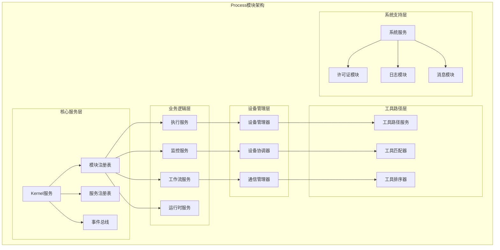

**图表来源**
- [process_module.cpp:1-150](file://src/modules/process/process_module.cpp#L1-L150)
- [kernel.cpp:1-200](file://src/core/kernel/kernel.cpp#L1-L200)

**章节来源**
- [process_module.cpp:1-200](file://src/modules/process/process_module.cpp#L1-L200)
- [process_module.h:1-100](file://src/modules/process/process_module.h#L1-L100)

## 核心组件

### 微内核架构

Process模块基于微内核架构设计，提供轻量级的基础设施服务：

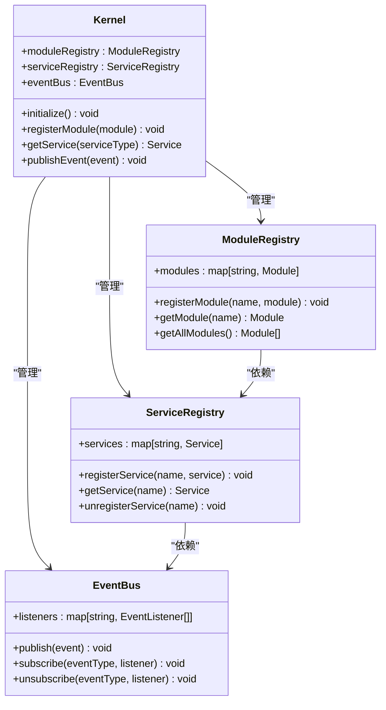

**图表来源**
- [kernel.h:1-150](file://src/core/kernel/kernel.h#L1-L150)
- [module_registry.h:1-120](file://src/core/kernel/module_registry.h#L1-L120)
- [service_registry.h:1-120](file://src/core/kernel/service_registry.h#L1-L120)
- [event_bus.h:1-120](file://src/core/kernel/event_bus.h#L1-L120)

### 服务管理机制

服务注册表实现了动态服务发现和生命周期管理：

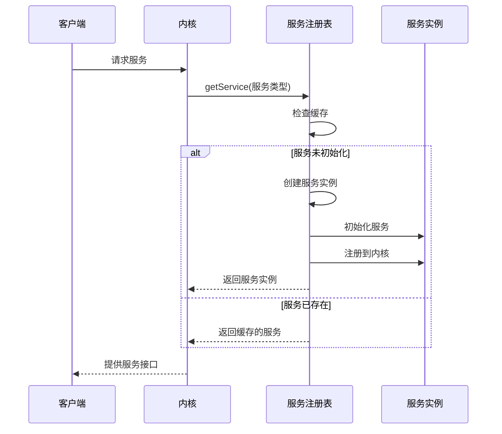

**图表来源**
- [service_registry.cpp:1-200](file://src/core/kernel/service_registry.cpp#L1-L200)
- [kernel.cpp:1-250](file://src/core/kernel/kernel.cpp#L1-L250)

**章节来源**
- [kernel.cpp:1-300](file://src/core/kernel/kernel.cpp#L1-L300)
- [service_registry.cpp:1-250](file://src/core/kernel/service_registry.cpp#L1-L250)

## 架构概览

Process模块的整体架构采用分层设计，从底层硬件抽象到上层业务逻辑形成清晰的层次结构：

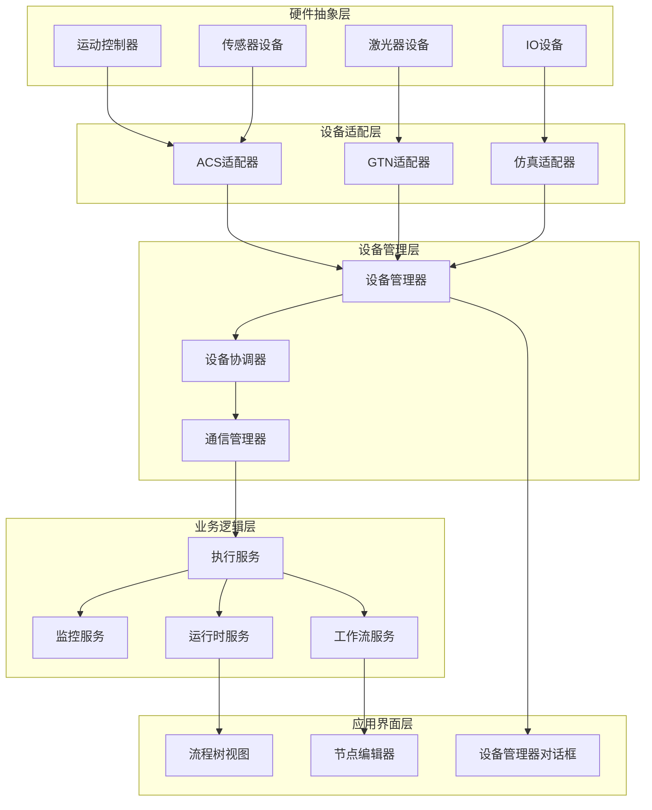

**图表来源**
- [process_device_manager.cpp:1-200](file://src/modules/process/device/MotionControl/process_device_manager.cpp#L1-L200)
- [process_device_coordinator.cpp:1-200](file://src/modules/process/device/MotionControl/process_device_coordinator.cpp#L1-L200)
- [process_execution_service.cpp:1-200](file://src/modules/process/execution/process_execution_service.cpp#L1-L200)

## 详细组件分析

### 执行服务组件

执行服务是Process模块的核心协调器，负责管理整个加工流程的执行：

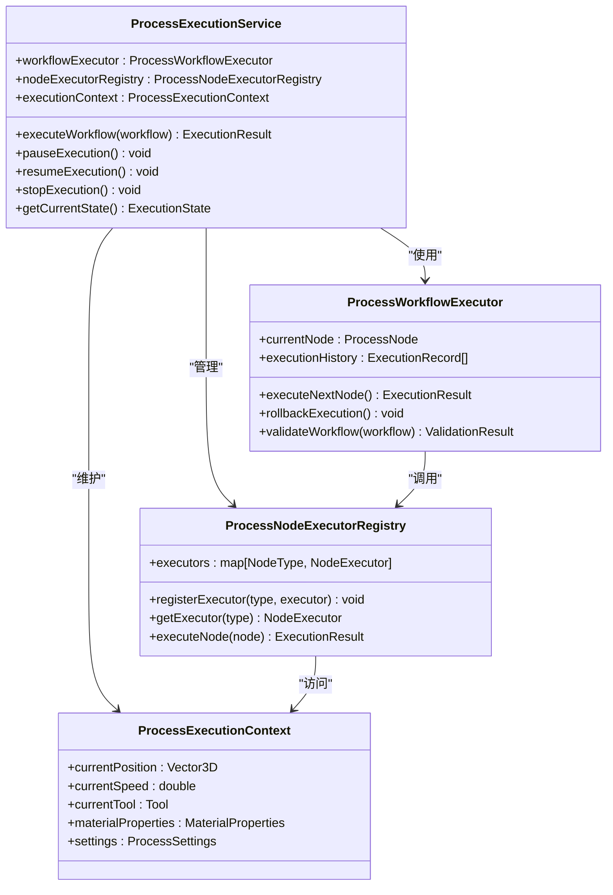

**图表来源**
- [process_execution_service.h:1-200](file://src/modules/process/execution/process_execution_service.h#L1-L200)
- [process_workflow_executor.cpp:1-200](file://src/modules/process/execution/process_workflow_executor.cpp#L1-L200)
- [process_node_executor_registry.h:1-150](file://src/modules/process/execution/process_node_executor_registry.h#L1-L150)

### 监控服务组件

监控服务负责实时跟踪设备状态和执行进度：

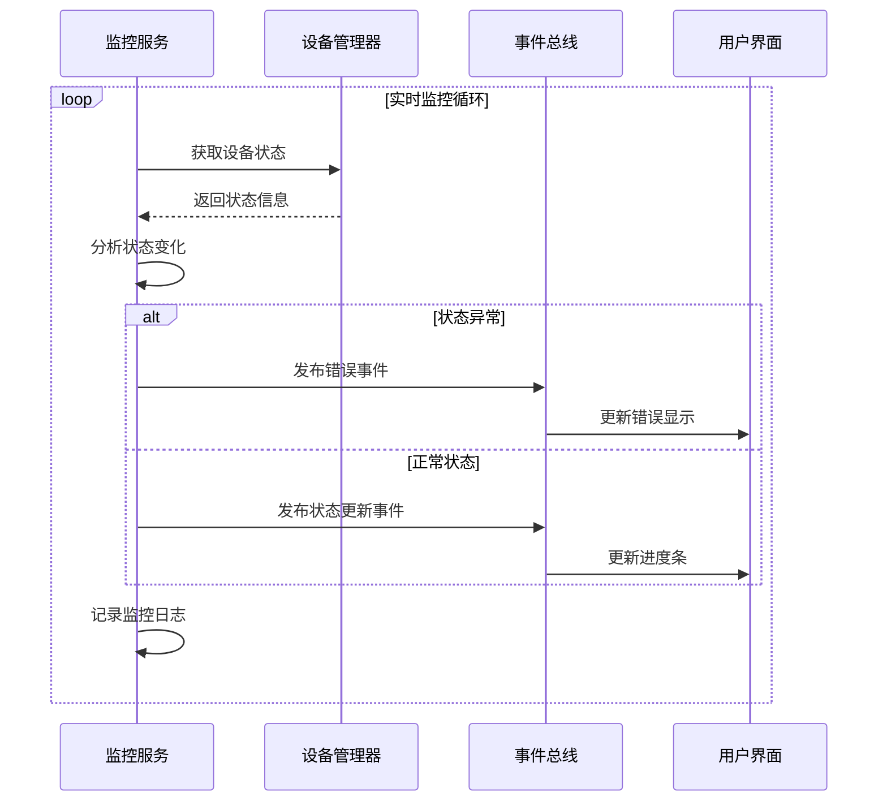

**图表来源**
- [process_monitor_service.cpp:1-250](file://src/modules/process/monitor/process_monitor_service.cpp#L1-L250)
- [event_bus.cpp:1-200](file://src/core/kernel/event_bus.cpp#L1-L200)

### 工作流服务组件

工作流服务管理复杂的加工流程定义和执行：

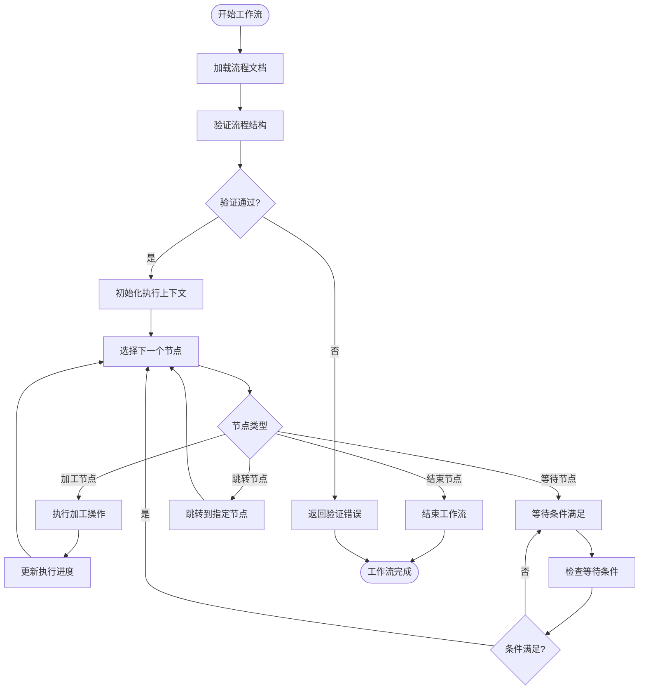

**图表来源**
- [process_workflow_service.cpp:1-300](file://src/modules/process/workflow/process_workflow_service.cpp#L1-L300)
- [process_flow_document.cpp:1-200](file://src/modules/process/workflow/process_flow_document.cpp#L1-L200)

**章节来源**
- [process_execution_service.cpp:1-300](file://src/modules/process/execution/process_execution_service.cpp#L1-L300)
- [process_monitor_service.cpp:1-300](file://src/modules/process/monitor/process_monitor_service.cpp#L1-L300)
- [process_workflow_service.cpp:1-350](file://src/modules/process/workflow/process_workflow_service.cpp#L1-L350)

### 设备管理组件

设备管理器负责协调多个设备的同步操作：

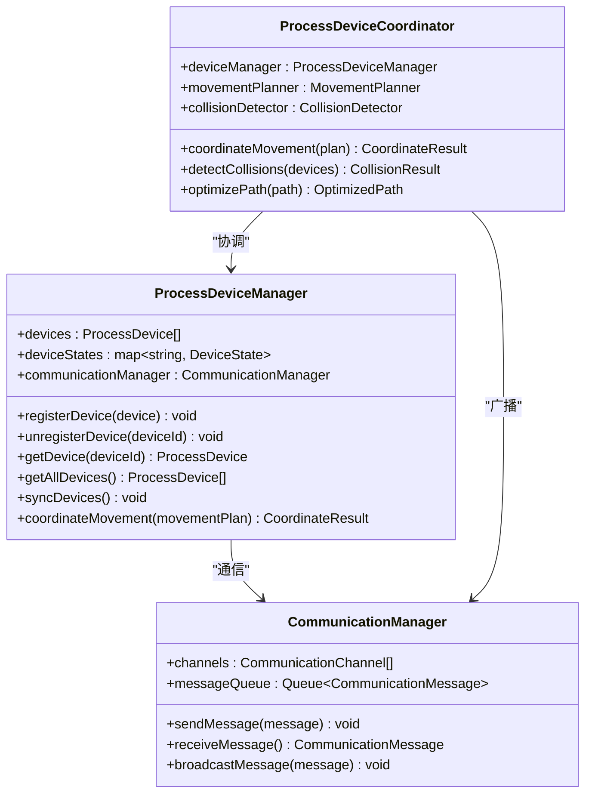

**图表来源**
- [process_device_manager.h:1-200](file://src/modules/process/device/MotionControl/process_device_manager.h#L1-L200)
- [process_device_coordinator.h:1-200](file://src/modules/process/device/MotionControl/process_device_coordinator.h#L1-L200)
- [communication_manager.h:1-200](file://src/modules/process/communication/communication_manager.h#L1-L200)

### 工具路径服务组件

工具路径服务负责生成和优化加工轨迹：

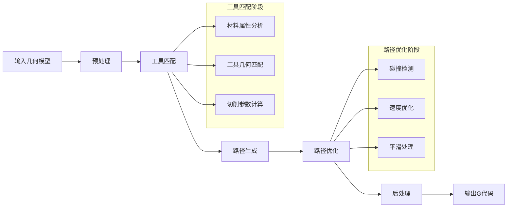

**图表来源**
- [process_toolpath_service.cpp:1-250](file://src/modules/process/toolpath/process_toolpath_service.cpp#L1-L250)
- [process_tool_matcher.cpp:1-200](file://src/modules/process/toolpath/process_tool_matcher.cpp#L1-L200)
- [process_toolpath_sorter.cpp:1-200](file://src/modules/process/toolpath/process_toolpath_sorter.cpp#L1-L200)

**章节来源**
- [process_device_manager.cpp:1-300](file://src/modules/process/device/MotionControl/process_device_manager.cpp#L1-L300)
- [process_device_coordinator.cpp:1-300](file://src/modules/process/device/MotionControl/process_device_coordinator.cpp#L1-L300)
- [process_toolpath_service.cpp:1-300](file://src/modules/process/toolpath/process_toolpath_service.cpp#L1-L300)

### 运行时服务组件

运行时服务管理执行过程中的状态转换：

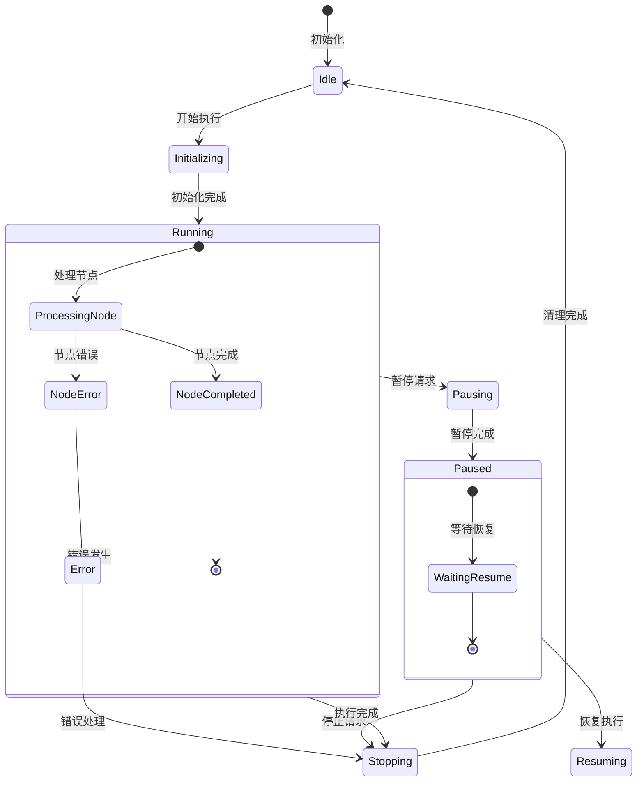

**图表来源**
- [process_runtime.cpp:1-250](file://src/modules/process/runtime/process_runtime.cpp#L1-L250)
- [process_state_machine.cpp:1-200](file://src/modules/process/runtime/process_state_machine.cpp#L1-L200)

**章节来源**
- [process_runtime.cpp:1-300](file://src/modules/process/runtime/process_runtime.cpp#L1-L300)
- [process_state_machine.cpp:1-250](file://src/modules/process/runtime/process_state_machine.cpp#L1-L250)

## 依赖关系分析

Process模块内部的依赖关系呈现清晰的层次结构：

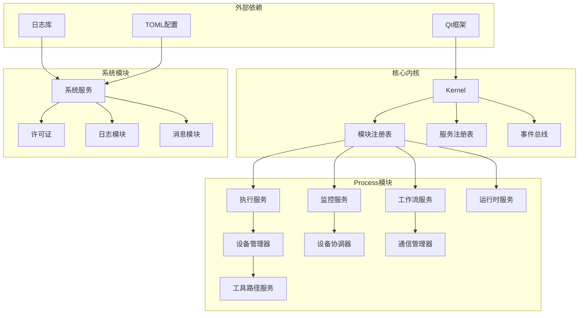

**图表来源**
- [process_module.cpp:1-200](file://src/modules/process/process_module.cpp#L1-L200)
- [kernel.cpp:1-200](file://src/core/kernel/kernel.cpp#L1-L200)

**章节来源**
- [process_module.cpp:1-250](file://src/modules/process/process_module.cpp#L1-L250)
- [module_registry.cpp:1-200](file://src/core/kernel/module_registry.cpp#L1-L200)

## 性能考虑

### 并发处理机制

Process模块采用了多线程并发设计来提高执行效率：

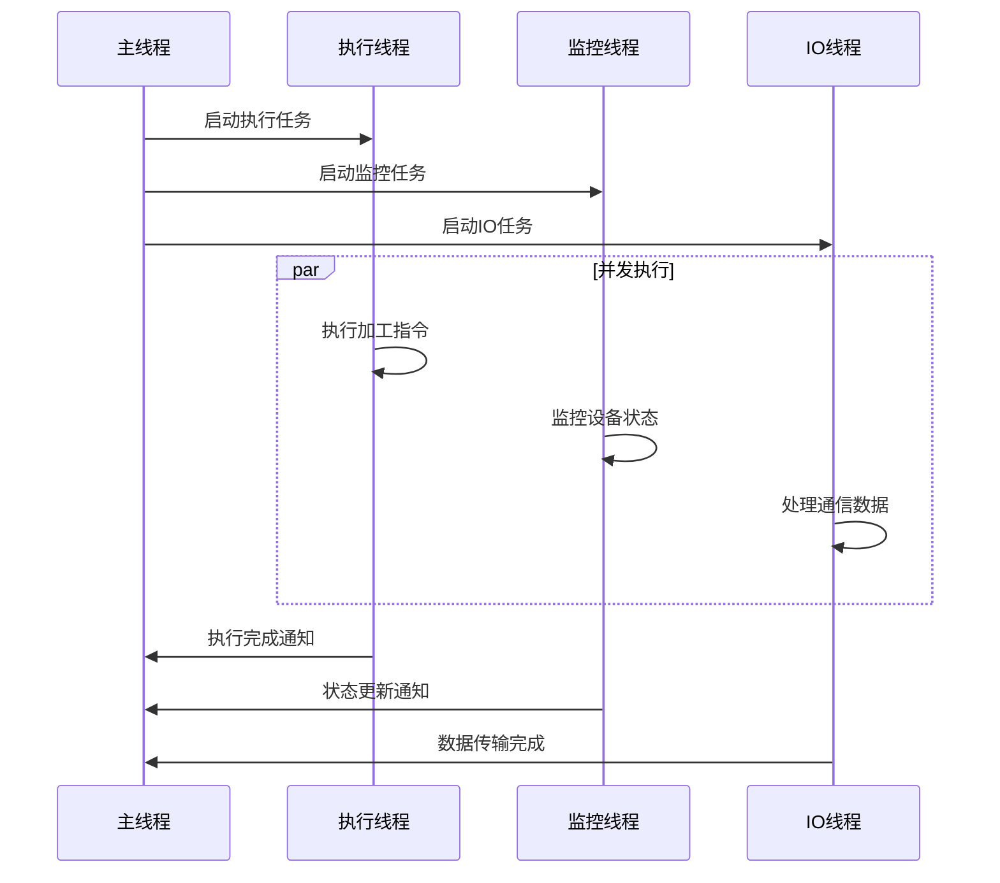

### 内存管理策略

模块采用了智能指针和RAII技术确保内存安全：

- 使用std::shared_ptr管理服务对象生命周期
- 使用std::unique_ptr管理临时资源
- 实现自定义删除器处理复杂对象释放
- 采用对象池减少频繁内存分配

### 缓存机制

为了提高性能，模块实现了多层次缓存：

- 服务实例缓存：避免重复创建昂贵的服务对象
- 设备状态缓存：减少设备查询开销
- 工具路径缓存：重用已计算的加工轨迹
- 配置参数缓存：快速访问常用设置

## 故障排除指南

### 常见问题诊断

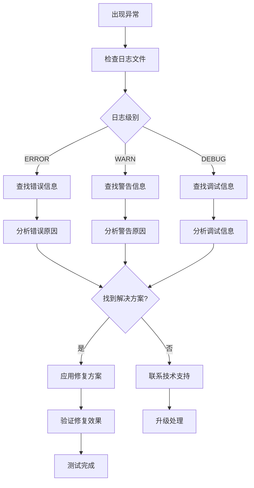

### 错误处理机制

模块实现了完善的错误处理和恢复机制：

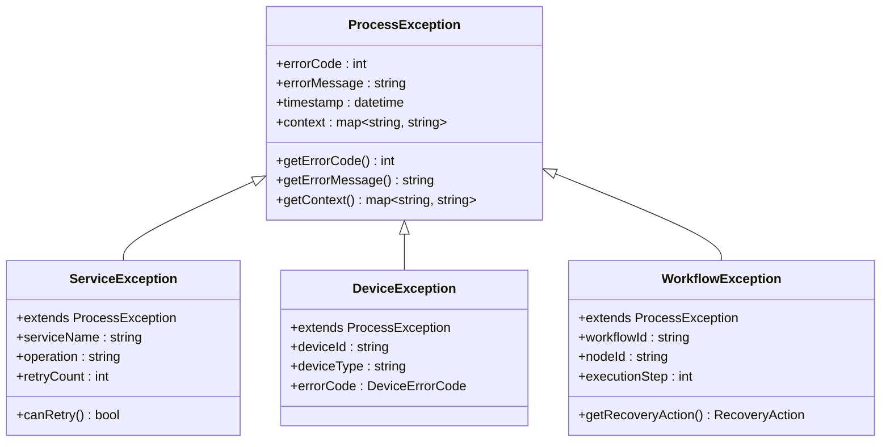

**图表来源**
- [process_system_message.cpp:1-200](file://src/modules/process/System/MessageModule.cpp#L1-L200)
- [process_system_log.cpp:1-200](file://src/modules/process/System/LogModule.cpp#L1-L200)

**章节来源**
- [process_system_message.cpp:1-250](file://src/modules/process/System/MessageModule.cpp#L1-L250)
- [process_system_log.cpp:1-250](file://src/modules/process/System/LogModule.cpp#L1-L250)

## 结论

Process模块通过采用微内核架构和模块化设计，成功实现了激光切割控制系统中复杂服务管理的需求。该架构具有以下优势：

1. **高内聚低耦合**：各组件职责明确，依赖关系清晰
2. **可扩展性强**：支持新设备和新功能的灵活集成
3. **可靠性高**：完善的错误处理和恢复机制
4. **性能优异**：多线程并发和缓存优化策略
5. **易于维护**：清晰的代码结构和文档支持

未来可以进一步优化的方向包括：
- 实现更智能的负载均衡机制
- 增强系统的自适应能力
- 优化内存使用效率
- 改进用户界面交互体验

通过持续的架构改进和性能优化，Process模块将继续为LaserCNC系统提供稳定可靠的服务管理支持。