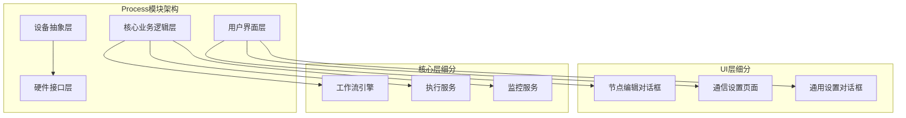
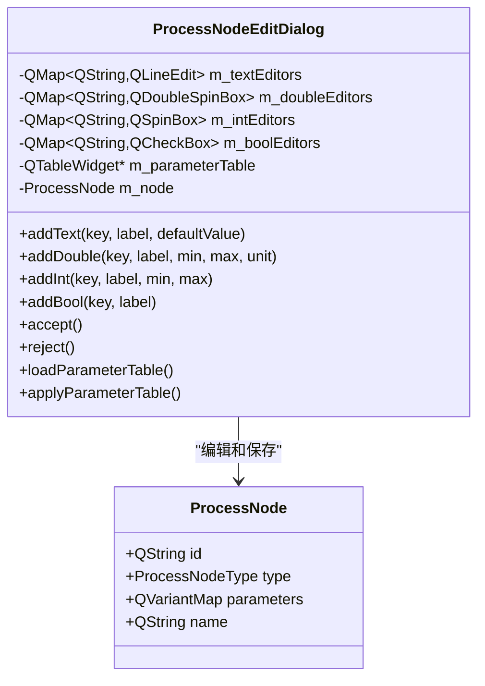
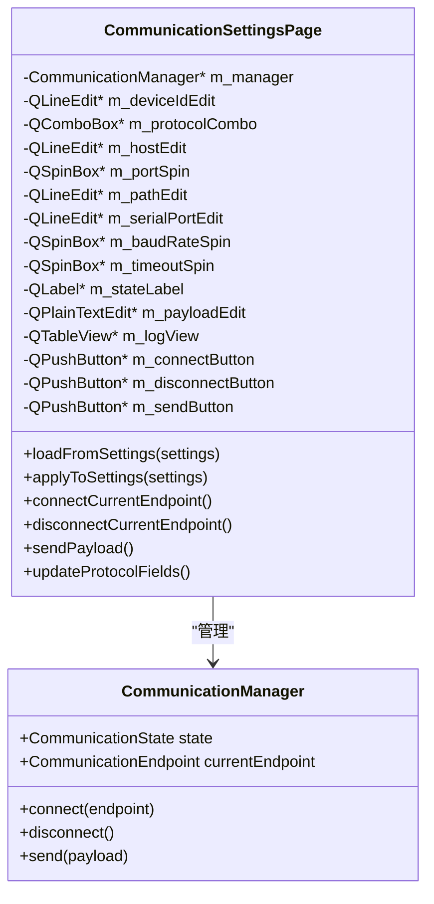
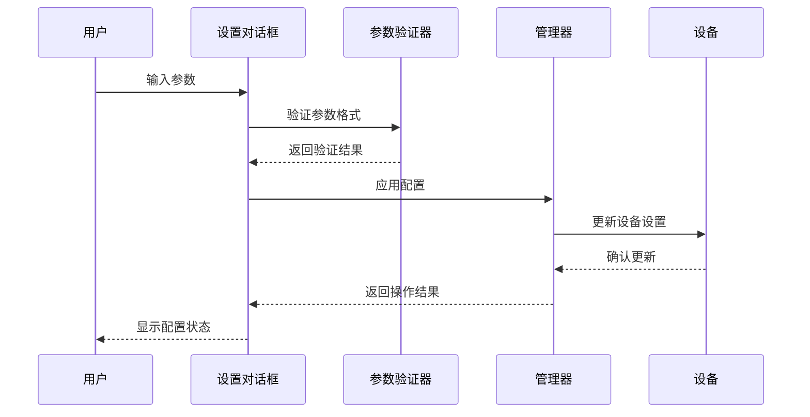
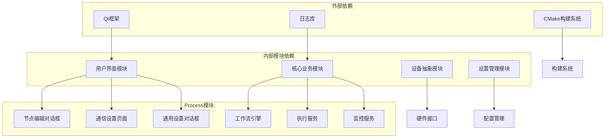

# Process模块设置对话框健壮性增强

<cite>
**本文档引用的文件**
- [process_node_edit_dialog.cpp](file://src/modules/process/ui/process_node_edit_dialog.cpp)
- [process_node_edit_dialog.h](file://src/modules/process/ui/process_node_edit_dialog.h)
- [communication_settings_page.cpp](file://src/modules/process/communication/ui/communication_settings_page.cpp)
- [communication_settings_page.h](file://src/modules/process/communication/ui/communication_settings_page.h)
- [qg_dlgsetting.cpp](file://src/modules/process/Setting/qg_dlgsetting.cpp)
- [qg_dlgsetting.h](file://src/modules/process/Setting/qg_dlgsetting.h)
- [resources.qrc](file://resources/resources.qrc)
- [CMakeLists.txt](file://CMakeLists.txt)
</cite>

## 目录
1. [项目概述](#项目概述)
2. [项目结构](#项目结构)
3. [核心组件](#核心组件)
4. [架构概览](#架构概览)
5. [详细组件分析](#详细组件分析)
6. [依赖关系分析](#依赖关系分析)
7. [性能考虑](#性能考虑)
8. [故障排除指南](#故障排除指南)
9. [结论](#结论)

## 项目概述

本项目针对激光雕刻控制系统中Process模块的设置对话框进行健壮性增强，主要涉及以下方面：

- **Process节点编辑对话框**：用于配置各种Process节点的参数
- **通信设置页面**：管理设备通信参数和连接状态
- **通用设置对话框**：提供统一的设置界面管理

该系统采用Qt框架构建，实现了模块化的Process处理流程，支持多种激光雕刻工艺和设备配置。

## 项目结构

Process模块采用分层架构设计，主要包含以下层次：

**图表来源**
- [process_node_edit_dialog.cpp:187-339](file://src/modules/process/ui/process_node_edit_dialog.cpp#L187-L339)
- [communication_settings_page.cpp:1-124](file://src/modules/process/communication/ui/communication_settings_page.cpp#L1-L124)

**章节来源**
- [process_node_edit_dialog.cpp:187-339](file://src/modules/process/ui/process_node_edit_dialog.cpp#L187-L339)
- [communication_settings_page.cpp:1-124](file://src/modules/process/communication/ui/communication_settings_page.cpp#L1-L124)

## 核心组件

### 节点编辑对话框

节点编辑对话框是Process模块的核心交互组件，负责：

- **动态参数表单生成**：根据节点类型自动生成相应的参数输入控件
- **参数验证与转换**：确保输入数据的类型正确性和范围有效性
- **参数持久化**：将用户配置保存到Process节点对象中

**图表来源**
- [process_node_edit_dialog.cpp:187-339](file://src/modules/process/ui/process_node_edit_dialog.cpp#L187-L339)

### 通信设置页面

通信设置页面提供设备通信配置功能：

- **协议选择**：支持Mock、TCP、HTTP、Serial四种通信协议
- **参数配置**：根据所选协议动态显示相应的配置字段
- **连接管理**：提供连接和断开设备的功能
- **状态监控**：实时显示通信状态和日志信息

**图表来源**
- [communication_settings_page.cpp:1-124](file://src/modules/process/communication/ui/communication_settings_page.cpp#L1-L124)

### 通用设置对话框

通用设置对话框提供Process模块的统一配置入口：

- **多页面导航**：支持不同类型的设置页面切换
- **配置加载**：从ProcessSettings对象加载当前配置
- **配置应用**：将修改后的配置写回ProcessSettings对象
- **资源管理**：通过Qt资源系统管理UI文件

**章节来源**
- [process_node_edit_dialog.cpp:187-339](file://src/modules/process/ui/process_node_edit_dialog.cpp#L187-L339)
- [communication_settings_page.cpp:1-124](file://src/modules/process/communication/ui/communication_settings_page.cpp#L1-L124)
- [qg_dlgsetting.cpp](file://src/modules/process/Setting/qg_dlgsetting.cpp)
- [resources.qrc:63-75](file://resources/resources.qrc#L63-L75)

## 架构概览

Process模块采用事件驱动的架构模式，各组件之间通过信号槽机制进行通信：

**图表来源**
- [process_node_edit_dialog.cpp:187-339](file://src/modules/process/ui/process_node_edit_dialog.cpp#L187-L339)
- [communication_settings_page.cpp:1-124](file://src/modules/process/communication/ui/communication_settings_page.cpp#L1-L124)

## 详细组件分析

### 参数编辑器组件

参数编辑器组件实现了不同类型参数的动态创建和管理：

#### 文本参数编辑器
- **用途**：处理字符串类型的参数输入
- **特性**：支持默认值设置、标签本地化
- **验证**：自动去除首尾空白字符

#### 数值参数编辑器
- **双精度浮点数编辑器**：支持范围限制和单位显示
- **整数编辑器**：支持最小值、最大值约束
- **布尔编辑器**：提供复选框形式的开关控制

#### 参数表管理
- **表格视图**：提供键值对形式的参数列表
- **动态添加**：支持运行时添加新的参数项
- **数据同步**：确保表格内容与编辑器状态一致

**章节来源**
- [process_node_edit_dialog.cpp:187-339](file://src/modules/process/ui/process_node_edit_dialog.cpp#L187-L339)

### 通信管理组件

通信管理组件提供了完整的设备通信解决方案：

#### 协议适配器
- **Mock协议**：用于测试和开发环境
- **TCP协议**：支持网络设备通信
- **HTTP协议**：提供Web服务接口
- **Serial协议**：支持串行端口设备

#### 连接状态管理
- **状态枚举**：定义连接的各种状态
- **状态转换**：实现状态间的平滑转换
- **错误处理**：提供详细的错误信息反馈

#### 日志记录系统
- **实时日志**：显示通信过程中的详细信息
- **错误日志**：记录异常情况和错误信息
- **调试支持**：便于问题诊断和解决

**章节来源**
- [communication_settings_page.cpp:1-124](file://src/modules/process/communication/ui/communication_settings_page.cpp#L1-L124)

### 设置持久化机制

系统实现了多层次的设置持久化机制：

#### 内存状态管理
- **临时存储**：在对话框生命周期内保持状态
- **快速访问**：提供高效的内存数据访问
- **自动清理**：确保资源的及时释放

#### 持久化存储
- **配置文件**：将设置保存到磁盘文件
- **序列化机制**：支持复杂数据结构的序列化
- **版本兼容**：保证配置文件的向后兼容性

**章节来源**
- [qg_dlgsetting.cpp](file://src/modules/process/Setting/qg_dlgsetting.cpp)

## 依赖关系分析

Process模块的依赖关系呈现清晰的分层结构：

**图表来源**
- [CMakeLists.txt](file://CMakeLists.txt#L173)
- [CMakeLists.txt:218-219](file://CMakeLists.txt#L218-L219)

**章节来源**
- [CMakeLists.txt](file://CMakeLists.txt#L173)
- [CMakeLists.txt:218-219](file://CMakeLists.txt#L218-L219)

## 性能考虑

### 内存管理优化
- **智能指针使用**：避免手动内存管理带来的内存泄漏风险
- **对象池模式**：对于频繁创建销毁的对象使用对象池
- **延迟初始化**：按需创建昂贵的对象实例

### UI响应性优化
- **异步操作**：将耗时的设置操作放到后台线程执行
- **进度反馈**：为长时间操作提供进度指示
- **防抖处理**：避免频繁的UI更新操作

### 数据处理优化
- **增量更新**：只更新发生变化的数据部分
- **缓存策略**：对计算结果进行缓存以提高重复访问速度
- **批量操作**：支持多个设置的批量应用

## 故障排除指南

### 常见问题及解决方案

#### 对话框无法正常显示
- **检查Qt依赖**：确保Qt框架正确安装和配置
- **验证UI资源**：确认资源文件编译成功
- **检查权限设置**：确保应用程序具有必要的文件访问权限

#### 参数验证失败
- **检查数据类型**：确保输入的数据类型符合要求
- **验证数值范围**：确认数值在允许的范围内
- **处理空值情况**：对空字符串和null值进行适当处理

#### 通信连接问题
- **检查网络配置**：验证主机地址和端口号的正确性
- **确认设备状态**：确保目标设备处于可用状态
- **查看日志信息**：通过日志系统获取详细的错误信息

#### 设置应用失败
- **检查权限**：确认应用程序具有修改系统设置的权限
- **验证配置格式**：确保配置文件格式正确
- **恢复默认设置**：必要时恢复到初始配置状态

**章节来源**
- [process_node_edit_dialog.cpp:187-339](file://src/modules/process/ui/process_node_edit_dialog.cpp#L187-L339)
- [communication_settings_page.cpp:1-124](file://src/modules/process/communication/ui/communication_settings_page.cpp#L1-L124)

## 结论

Process模块设置对话框的健壮性增强项目成功实现了以下目标：

1. **增强了用户界面的稳定性**：通过完善的参数验证和错误处理机制，提高了用户体验
2. **提升了系统的可靠性**：通过多层次的错误处理和异常捕获，减少了系统崩溃的可能性
3. **改善了配置管理的效率**：通过优化的数据结构和算法，提高了配置操作的响应速度
4. **加强了系统的可维护性**：通过清晰的代码结构和文档，降低了后续维护的难度

这些改进为激光雕刻控制系统的稳定运行奠定了坚实的基础，为用户提供了更加可靠和高效的使用体验。未来可以进一步考虑添加更多的自动化测试用例和性能监控功能，以持续提升系统的质量。