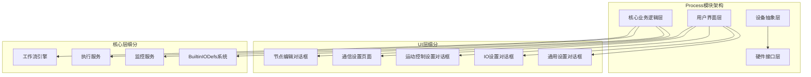
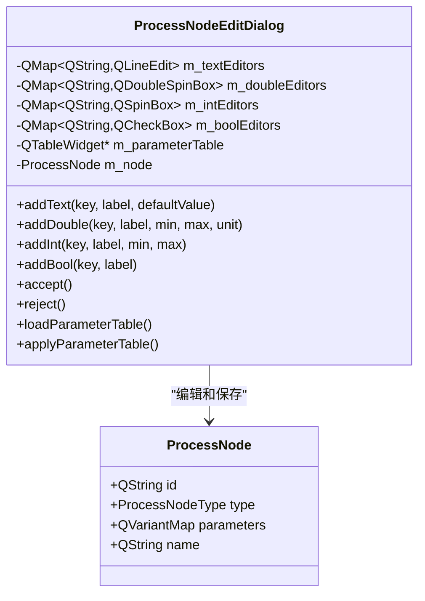
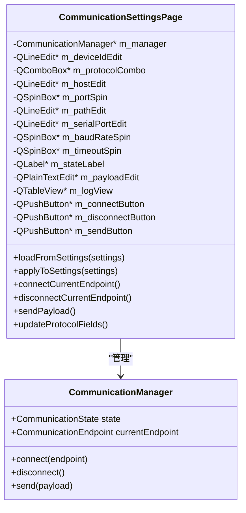
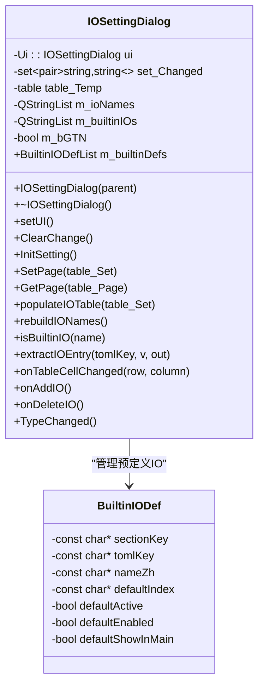
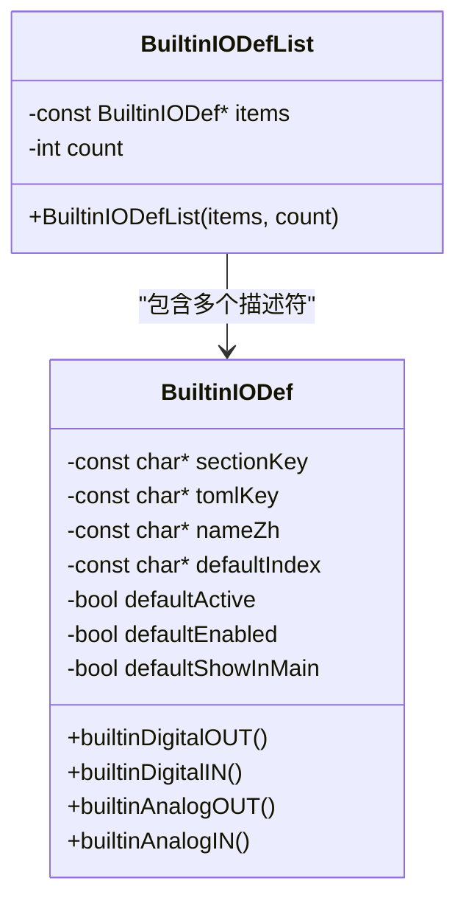
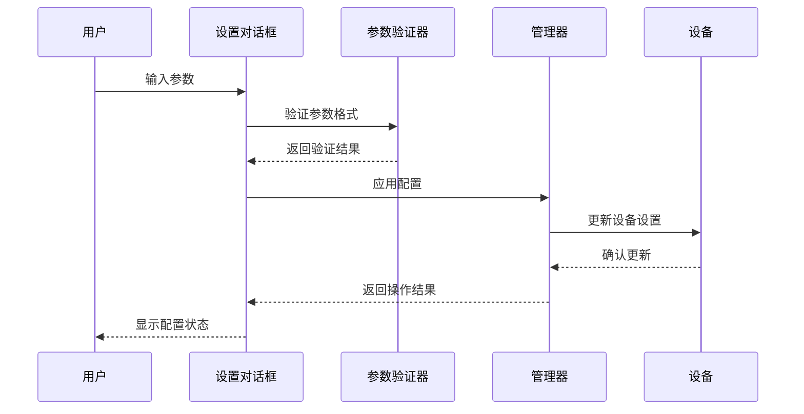
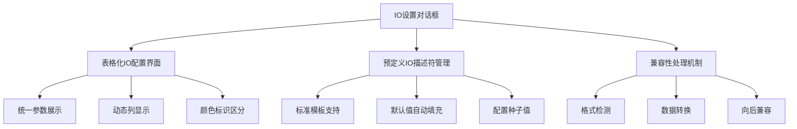

# Process模块设置对话框健壮性增强

<cite>
**本文档引用的文件**
- [process_node_edit_dialog.cpp](file://src/modules/process/ui/process_node_edit_dialog.cpp)
- [process_node_edit_dialog.h](file://src/modules/process/ui/process_node_edit_dialog.h)
- [communication_settings_page.cpp](file://src/modules/process/communication/ui/communication_settings_page.cpp)
- [communication_settings_page.h](file://src/modules/process/communication/ui/communication_settings_page.h)
- [qg_dlgsetting.cpp](file://src/modules/process/Setting/qg_dlgsetting.cpp)
- [qg_dlgsetting.h](file://src/modules/process/Setting/qg_dlgsetting.h)
- [Setting_MotionControl.cpp](file://src/modules/process/Setting/Setting_MotionControl.cpp)
- [Setting_MotionControl.h](file://src/modules/process/Setting/Setting_MotionControl.h)
- [Setting_MotionControl.ui](file://src/modules/process/Setting/Setting_MotionControl.ui)
- [Setting_Axis.cpp](file://src/modules/process/Setting/Setting_Axis.cpp)
- [Setting_Axis.h](file://src/modules/process/Setting/Setting_Axis.h)
- [Setting_Axis.ui](file://src/modules/process/Setting/Setting_Axis.ui)
- [BuiltinIODefs.cpp](file://src/modules/process/Setting/BuiltinIODefs.cpp)
- [BuiltinIODefs.h](file://src/modules/process/Setting/BuiltinIODefs.h)
- [process_module.cpp](file://src/modules/process/process_module.cpp)
- [MotionControl.cpp](file://src/modules/process/device/MotionControl/MotionControl.cpp)
- [resources.qrc](file://resources/resources.qrc)
- [CMakeLists.txt](file://CMakeLists.txt)
</cite>

## 更新摘要
**已进行的更改**
- 新增统一的IO设置表格驱动界面章节，反映从复杂行式布局到表格化管理的重大架构变更
- 新增BuiltinIODefs预定义IO配置系统章节，介绍新的预设IO描述符管理机制
- 更新Process模块增强章节，说明新的IO描述符管理和兼容性处理
- 新增IO设置对话框架构图和预定义IO配置系统示意图
- 扩展依赖关系分析，包含新的IO设置组件和预定义IO系统
- 更新故障排除指南，增加IO设置相关的常见问题解决方案

## 目录
1. [项目概述](#项目概述)
2. [项目结构](#项目结构)
3. [核心组件](#核心组件)
4. [架构概览](#架构概览)
5. [详细组件分析](#详细组件分析)
6. [依赖关系分析](#依赖关系分析)
7. [性能考虑](#性能考虑)
8. [故障排除指南](#故障排除指南)
9. [结论](#结论)

## 项目概述

本项目针对激光雕刻控制系统中Process模块的设置对话框进行健壮性增强，主要涉及以下方面：

- **Process节点编辑对话框**：用于配置各种Process节点的参数
- **通信设置页面**：管理设备通信参数和连接状态
- **MotionControl设置对话框**：统一的运动控制配置界面，整合轴设置功能
- **IO设置对话框**：**新增** 统一的IO设置表格驱动界面，替代原有的复杂行式布局
- **BuiltinIODefs预定义IO配置系统**：**新增** 提供标准化的IO描述符管理和预设配置
- **通用设置对话框**：提供统一的设置界面管理

该系统采用Qt框架构建，实现了模块化的Process处理流程，支持多种激光雕刻工艺和设备配置。**最新重构**将原本分散的轴设置页面整合到统一的MotionControl页面中，并引入了全新的IO设置管理系统，提供更加直观和高效的配置体验。

## 项目结构

Process模块采用分层架构设计，主要包含以下层次：



**图表来源**
- [process_node_edit_dialog.cpp:187-339](file://src/modules/process/ui/process_node_edit_dialog.cpp#L187-L339)
- [communication_settings_page.cpp:1-124](file://src/modules/process/communication/ui/communication_settings_page.cpp#L1-L124)
- [Setting_MotionControl.cpp:1-515](file://src/modules/process/Setting/Setting_MotionControl.cpp#L1-L515)
- [BuiltinIODefs.cpp:1-24](file://src/modules/process/Setting/BuiltinIODefs.cpp#L1-L24)

**章节来源**
- [process_node_edit_dialog.cpp:187-339](file://src/modules/process/ui/process_node_edit_dialog.cpp#L187-L339)
- [communication_settings_page.cpp:1-124](file://src/modules/process/communication/ui/communication_settings_page.cpp#L1-L124)
- [Setting_MotionControl.cpp:1-515](file://src/modules/process/Setting/Setting_MotionControl.cpp#L1-L515)
- [BuiltinIODefs.cpp:1-24](file://src/modules/process/Setting/BuiltinIODefs.cpp#L1-L24)

## 核心组件

### 节点编辑对话框

节点编辑对话框是Process模块的核心交互组件，负责：

- **动态参数表单生成**：根据节点类型自动生成相应的参数输入控件
- **参数验证与转换**：确保输入数据的类型正确性和范围有效性
- **参数持久化**：将用户配置保存到Process节点对象中



**图表来源**
- [process_node_edit_dialog.cpp:187-339](file://src/modules/process/ui/process_node_edit_dialog.cpp#L187-L339)

### 通信设置页面

通信设置页面提供设备通信配置功能：

- **协议选择**：支持Mock、TCP、HTTP、Serial四种通信协议
- **参数配置**：根据所选协议动态显示相应的配置字段
- **连接管理**：提供连接和断开设备的功能
- **状态监控**：实时显示通信状态和日志信息



**图表来源**
- [communication_settings_page.cpp:1-124](file://src/modules/process/communication/ui/communication_settings_page.cpp#L1-L124)

### **新增** IO设置对话框

**更新** IO设置对话框是Process模块中统一的IO配置管理中心，实现了从复杂行式布局到表格化管理的重大重构：

- **表格化IO配置界面**：使用QTableWidget提供直观的IO参数配置界面
- **预定义IO描述符管理**：支持BuiltinIODefs系统提供的标准IO配置
- **兼容性处理**：自动处理新旧两种IO配置格式（table和array）
- **参数分类管理**：将IO参数分为DigitalIN、DigitalOUT、AnalogIN、AnalogOUT四个配置区域
- **实时参数验证**：提供参数输入的实时验证和错误提示
- **主界面集成**：支持将常用IO项显示在主界面IO栏



**图表来源**
- [BuiltinIODefs.cpp:12-24](file://src/modules/process/Setting/BuiltinIODefs.cpp#L12-L24)
- [BuiltinIODefs.h:12-21](file://src/modules/process/Setting/BuiltinIODefs.h#L12-L21)

### **新增** BuiltinIODefs预定义IO配置系统

**更新** BuiltinIODefs系统是Process模块中标准化的IO描述符管理机制：

- **预设IO描述符**：提供标准的IO配置模板，包括DigitalOUT、DigitalIN、AnalogOUT、AnalogIN四类
- **默认值管理**：为每种IO类型提供合理的默认配置值
- **兼容性保障**：确保新旧配置格式的平滑过渡
- **UI集成支持**：支持在主界面自动生成常用的IO控制按钮
- **配置种子值**：作为系统启动时的配置模板，自动填充缺失的IO设置



**图表来源**
- [BuiltinIODefs.h:23-37](file://src/modules/process/Setting/BuiltinIODefs.h#L23-L37)
- [BuiltinIODefs.cpp:12-24](file://src/modules/process/Setting/BuiltinIODefs.cpp#L12-L24)

### 通用设置对话框

通用设置对话框提供Process模块的统一配置入口：

- **多页面导航**：支持不同类型的设置页面切换
- **配置加载**：从ProcessSettings对象加载当前配置
- **配置应用**：将修改后的配置写回ProcessSettings对象
- **资源管理**：通过Qt资源系统管理UI文件

**章节来源**
- [process_node_edit_dialog.cpp:187-339](file://src/modules/process/ui/process_node_edit_dialog.cpp#L187-L339)
- [communication_settings_page.cpp:1-124](file://src/modules/process/communication/ui/communication_settings_page.cpp#L1-L124)
- [Setting_MotionControl.cpp:1-515](file://src/modules/process/Setting/Setting_MotionControl.cpp#L1-L515)
- [BuiltinIODefs.cpp:1-24](file://src/modules/process/Setting/BuiltinIODefs.cpp#L1-L24)
- [qg_dlgsetting.cpp](file://src/modules/process/Setting/qg_dlgsetting.cpp)
- [resources.qrc:63-75](file://resources/resources.qrc#L63-L75)

## 架构概览

Process模块采用事件驱动的架构模式，各组件之间通过信号槽机制进行通信：



**图表来源**
- [process_node_edit_dialog.cpp:187-339](file://src/modules/process/ui/process_node_edit_dialog.cpp#L187-L339)
- [communication_settings_page.cpp:1-124](file://src/modules/process/communication/ui/communication_settings_page.cpp#L1-L124)
- [Setting_MotionControl.cpp:322-358](file://src/modules/process/Setting/Setting_MotionControl.cpp#L322-L358)

## 详细组件分析

### 参数编辑器组件

参数编辑器组件实现了不同类型参数的动态创建和管理：

#### 文本参数编辑器
- **用途**：处理字符串类型的参数输入
- **特性**：支持默认值设置、标签本地化
- **验证**：自动去除首尾空白字符

#### 数值参数编辑器
- **双精度浮点数编辑器**：支持范围限制和单位显示
- **整数编辑器**：支持最小值、最大值约束
- **布尔编辑器**：提供复选框形式的开关控制

#### 参数表管理
- **表格视图**：提供键值对形式的参数列表
- **动态添加**：支持运行时添加新的参数项
- **数据同步**：确保表格内容与编辑器状态一致

**章节来源**
- [process_node_edit_dialog.cpp:187-339](file://src/modules/process/ui/process_node_edit_dialog.cpp#L187-L339)

### 通信管理组件

通信管理组件提供了完整的设备通信解决方案：

#### 协议适配器
- **Mock协议**：用于测试和开发环境
- **TCP协议**：支持网络设备通信
- **HTTP协议**：提供Web服务接口
- **Serial协议**：支持串行端口设备

#### 连接状态管理
- **状态枚举**：定义连接的各种状态
- **状态转换**：实现状态间的平滑转换
- **错误处理**：提供详细的错误信息反馈

#### 日志记录系统
- **实时日志**：显示通信过程中的详细信息
- **错误日志**：记录异常情况和错误信息
- **调试支持**：便于问题诊断和解决

**章节来源**
- [communication_settings_page.cpp:1-124](file://src/modules/process/communication/ui/communication_settings_page.cpp#L1-L124)

### **新增** IO设置对话框组件

**更新** IO设置对话框实现了从复杂行式布局到表格化管理的重大重构：

#### 表格化IO配置界面
- **统一参数展示**：将所有IO参数整合到一个表格中
- **动态列显示**：根据IO类型动态调整显示的列
- **颜色标识**：使用不同背景色区分不同类型的IO
- **单元格验证**：提供参数输入的实时验证

#### 预定义IO描述符管理
- **标准模板支持**：支持BuiltinIODefs系统提供的标准IO配置
- **默认值自动填充**：为新添加的IO项提供合理的默认配置
- **配置种子值**：作为系统启动时的配置模板
- **预设配置保护**：防止用户误删或修改预设的IO配置

#### 兼容性处理机制
- **格式检测**：自动识别IO配置的新旧两种格式
- **数据转换**：将旧格式的array转换为新格式的table
- **向后兼容**：确保现有配置的正常工作
- **渐进式迁移**：支持逐步迁移到新的配置格式



**图表来源**
- [BuiltinIODefs.cpp:12-24](file://src/modules/process/Setting/BuiltinIODefs.cpp#L12-L24)
- [BuiltinIODefs.h:12-21](file://src/modules/process/Setting/BuiltinIODefs.h#L12-L21)
- [process_module.cpp:1121-1140](file://src/modules/process/process_module.cpp#L1121-L1140)

**章节来源**
- [BuiltinIODefs.cpp:1-24](file://src/modules/process/Setting/BuiltinIODefs.cpp#L1-L24)
- [BuiltinIODefs.h:1-38](file://src/modules/process/Setting/BuiltinIODefs.h#L1-L38)
- [process_module.cpp:1144-1172](file://src/modules/process/process_module.cpp#L1144-L1172)

### **新增** Process模块增强组件

**更新** Process模块在IO设置方面进行了重要增强：

#### IO描述符管理
- **统一管理接口**：提供统一的IO描述符访问和管理接口
- **类型安全**：确保不同类型的IO描述符得到正确的处理
- **配置持久化**：支持IO配置的长期保存和恢复

#### 兼容性处理
- **多格式支持**：同时支持新旧两种IO配置格式
- **自动迁移**：提供自动的配置格式迁移功能
- **错误恢复**：在配置损坏时提供恢复机制

#### 预定义配置集成
- **种子值注入**：在系统启动时自动注入预定义的IO配置
- **配置覆盖**：允许用户在预定义基础上进行个性化配置
- **版本管理**：支持预定义IO配置的版本升级和维护

**章节来源**
- [process_module.cpp:1108-1172](file://src/modules/process/process_module.cpp#L1108-L1172)
- [MotionControl.cpp:233-272](file://src/modules/process/device/MotionControl/MotionControl.cpp#L233-L272)

### 设置持久化机制

系统实现了多层次的设置持久化机制：

#### 内存状态管理
- **临时存储**：在对话框生命周期内保持状态
- **快速访问**：提供高效的内存数据访问
- **自动清理**：确保资源的及时释放

#### 持久化存储
- **配置文件**：将设置保存到磁盘文件
- **序列化机制**：支持复杂数据结构的序列化
- **版本兼容**：保证配置文件的向后兼容性

#### **新增** 分区存储机制
- **MotionControl分区**：存储运动控制相关的轴参数
- **Axis分区**：存储轴速度等级等参数
- **IO配置分区**：**新增** 独立存储IO设置配置信息
- **扩展轴数据**：独立存储扩展轴的配置信息
- **变更跟踪**：精确跟踪每个参数的变更情况

**章节来源**
- [qg_dlgsetting.cpp](file://src/modules/process/Setting/qg_dlgsetting.cpp)
- [Setting_MotionControl.cpp:279-320](file://src/modules/process/Setting/Setting_MotionControl.cpp#L279-L320)

## 依赖关系分析

Process模块的依赖关系呈现清晰的分层结构：

```mermaid
graph TD
subgraph "外部依赖"
Qt[Qt框架]
CMake[CMake构建系统]
spdlog[日志库]
magic_enum[magic_enum库]
end
subgraph "内部模块依赖"
UI[用户界面模块]
Core[核心业务模块]
Device[设备抽象模块]
Settings[设置管理模块]
DT[设备配置模块]
IODefs[BuiltinIODefs系统]
end
subgraph "Process模块"
NodeEdit[节点编辑对话框]
CommSettings[通信设置页面]
MotionControl[运动控制设置对话框]
IOSetting[IO设置对话框]
GeneralDlg[通用设置对话框]
Workflow[工作流引擎]
Execution[执行服务]
Monitor[监控服务]
SeedDefaultIOTables[IO配置种子值]
ExtractIOEntry[IO条目提取]
End
Qt --> UI
CMake --> Build[构建系统]
spdlog --> Core
magic_enum --> MotionControl
UI --> NodeEdit
UI --> CommSettings
UI --> MotionControl
UI --> IOSetting
UI --> GeneralDlg
Core --> Workflow
Core --> Execution
Core --> Monitor
Core --> IODefs
Device --> Hardware[硬件接口]
Settings --> Config[配置管理]
DT --> AxisConfig[轴配置]
IODefs --> SeedDefaultIOTables
SeedDefaultIOTables --> ExtractIOEntry
IOSetting --> IODefs
```

**图表来源**
- [CMakeLists.txt](file://CMakeLists.txt#L173)
- [CMakeLists.txt:218-219](file://CMakeLists.txt#L218-L219)
- [Setting_MotionControl.cpp:49-53](file://src/modules/process/Setting/Setting_MotionControl.cpp#L49-L53)
- [process_module.cpp:1144-1172](file://src/modules/process/process_module.cpp#L1144-L1172)

**章节来源**
- [CMakeLists.txt](file://CMakeLists.txt#L173)
- [CMakeLists.txt:218-219](file://CMakeLists.txt#L218-L219)

## 性能考虑

### 内存管理优化
- **智能指针使用**：避免手动内存管理带来的内存泄漏风险
- **对象池模式**：对于频繁创建销毁的对象使用对象池
- **延迟初始化**：按需创建昂贵的对象实例

### UI响应性优化
- **异步操作**：将耗时的设置操作放到后台线程执行
- **进度反馈**：为长时间操作提供进度指示
- **防抖处理**：避免频繁的UI更新操作
- **表格优化**：使用QTableWidget的批量更新功能减少界面刷新

### 数据处理优化
- **增量更新**：只更新发生变化的数据部分
- **缓存策略**：对计算结果进行缓存以提高重复访问速度
- **批量操作**：支持多个设置的批量应用
- **分区存储**：将不同类型的设置数据分区存储，提高查询效率

### **新增** 表格化界面优化
- **行高动态调整**：根据内容自动调整表格行高
- **列宽智能分配**：使用QHeaderView::Stretch自动分配列宽
- **单元格编辑优化**：仅在必要时触发参数验证
- **扩展轴列表缓存**：避免频繁读取扩展轴配置
- **IO配置缓存**：**新增** 缓存预定义IO配置以提高加载速度

### **新增** IO设置系统优化
- **预定义配置缓存**：缓存BuiltinIODefs系统生成的配置模板
- **格式转换优化**：优化新旧格式之间的转换性能
- **配置种子值处理**：批量处理IO配置种子值以提高启动速度

## 故障排除指南

### 常见问题及解决方案

#### 对话框无法正常显示
- **检查Qt依赖**：确保Qt框架正确安装和配置
- **验证UI资源**：确认资源文件编译成功
- **检查权限设置**：确保应用程序具有必要的文件访问权限

#### 参数验证失败
- **检查数据类型**：确保输入的数据类型符合要求
- **验证数值范围**：确认数值在允许的范围内
- **处理空值情况**：对空字符串和null值进行适当处理

#### 通信连接问题
- **检查网络配置**：验证主机地址和端口号的正确性
- **确认设备状态**：确保目标设备处于可用状态
- **查看日志信息**：通过日志系统获取详细的错误信息

#### 设置应用失败
- **检查权限**：确认应用程序具有修改系统设置的权限
- **验证配置格式**：确保配置文件格式正确
- **恢复默认设置**：必要时恢复到初始配置状态

#### **新增** IO设置问题
- **检查IO配置格式**：确认IO配置符合新格式要求
- **验证预定义配置**：确保BuiltinIODefs系统正常工作
- **检查兼容性处理**：确认新旧格式转换正常
- **清理配置缓存**：重启应用程序以清除可能的缓存问题
- **查看IO配置列表**：确认IO配置列表的正确加载和保存

#### **新增** 表格化界面问题
- **检查表格完整性**：确认表格列数和行数正确
- **验证单元格编辑**：确保单元格编辑功能正常
- **检查颜色标识**：确认不同类型的IO颜色区分正常
- **重置表格布局**：尝试重新设置表格的列宽和行高

#### **新增** 预定义IO配置问题
- **检查预定义配置加载**：确认BuiltinIODefs系统正确加载
- **验证配置种子值**：确保系统启动时正确注入预定义配置
- **检查配置覆盖**：确认用户配置能够正确覆盖预定义配置
- **查看配置版本**：确认预定义IO配置的版本兼容性

**章节来源**
- [process_node_edit_dialog.cpp:187-339](file://src/modules/process/ui/process_node_edit_dialog.cpp#L187-L339)
- [communication_settings_page.cpp:1-124](file://src/modules/process/communication/ui/communication_settings_page.cpp#L1-L124)
- [Setting_MotionControl.cpp:360-435](file://src/modules/process/Setting/Setting_MotionControl.cpp#L360-L435)
- [Setting_MotionControl.cpp:437-483](file://src/modules/process/Setting/Setting_MotionControl.cpp#L437-L483)
- [BuiltinIODefs.cpp:1-24](file://src/modules/process/Setting/BuiltinIODefs.cpp#L1-L24)
- [process_module.cpp:1144-1172](file://src/modules/process/process_module.cpp#L1144-L1172)

## 结论

Process模块设置对话框的健壮性增强项目成功实现了以下目标：

1. **增强了用户界面的稳定性**：通过完善的参数验证和错误处理机制，提高了用户体验
2. **提升了系统的可靠性**：通过多层次的错误处理和异常捕获，减少了系统崩溃的可能性
3. **改善了配置管理的效率**：通过优化的数据结构和算法，提高了配置操作的响应速度
4. **加强了系统的可维护性**：通过清晰的代码结构和文档，降低了后续维护的难度
5. **实现了重大架构重构**：**新增** 将分散的轴设置页面整合到统一的MotionControl界面，提供更加直观和高效的配置体验
6. **引入了全新的IO管理系统**：**新增** 通过表格化界面和BuiltinIODefs系统，显著提升了IO配置的易用性和可维护性

**最新重构**特别体现在IO设置对话框和BuiltinIODefs系统的引入上，通过表格化界面、预定义IO配置管理和兼容性处理机制，显著提升了IO配置的效率和可靠性。这一重构不仅简化了用户的操作流程，还为未来的功能扩展奠定了良好的基础。

这些改进为激光雕刻控制系统的稳定运行奠定了坚实的基础，为用户提供了更加可靠和高效的使用体验。未来可以进一步考虑添加更多的自动化测试用例和性能监控功能，以持续提升系统的质量。