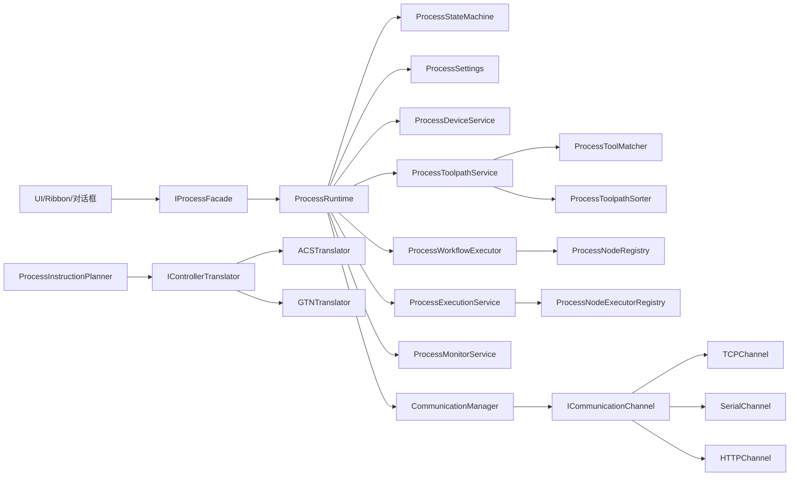
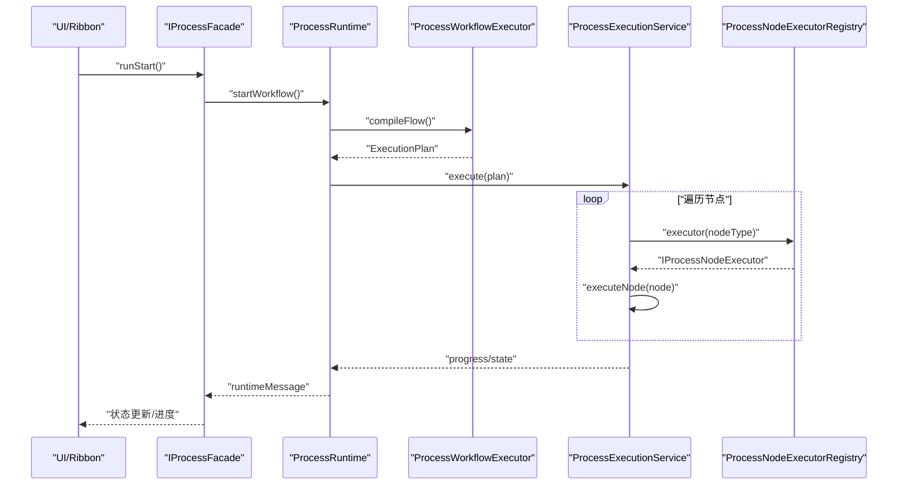
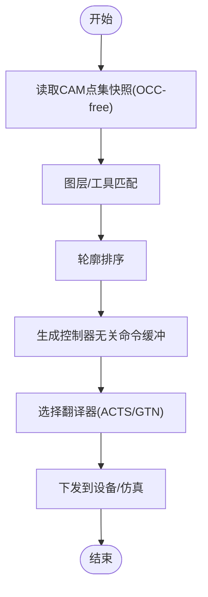
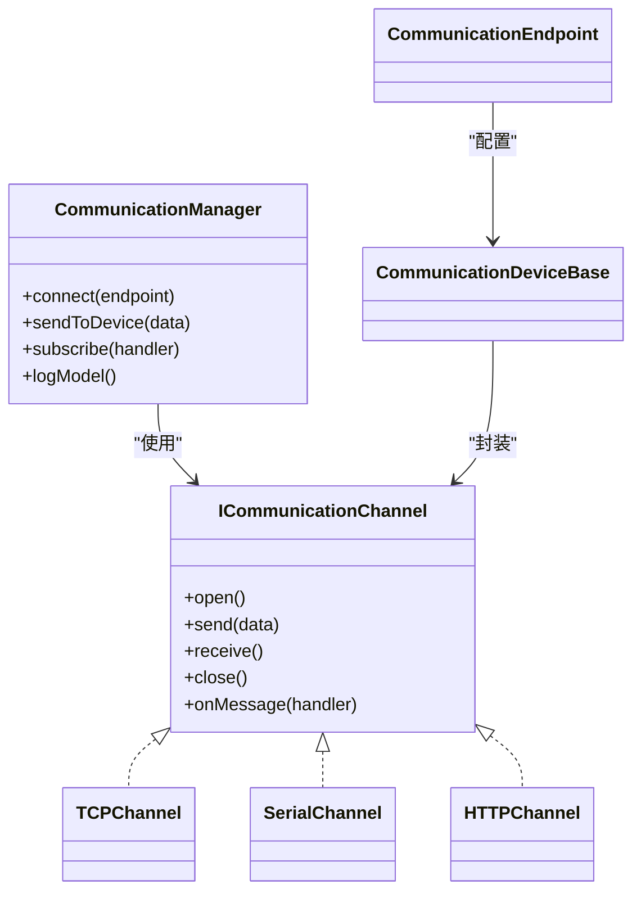
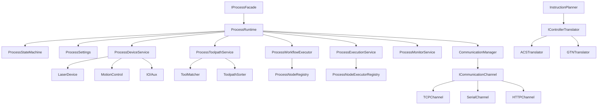

# Process模块设计

<cite>
**本文引用的文件**
- [process模块框架.md](file://process模块框架.md)
- [process模块重构计划.md](file://process模块重构计划.md)
- [i_process_facade.h](file://src/modules/process/i_process_facade.h)
- [process_module.h](file://src/modules/process/process_module.h)
- [process_runtime.h](file://src/modules/process/runtime/process_runtime.h)
- [process_state_machine.h](file://src/modules/process/runtime/process_state_machine.h)
- [process_execution_service.h](file://src/modules/process/execution/process_execution_service.h)
- [process_workflow_executor.h](file://src/modules/process/execution/process_workflow_executor.h)
- [process_node_executor_registry.h](file://src/modules/process/execution/process_node_executor_registry.h)
- [process_monitor_service.h](file://src/modules/process/monitor/process_monitor_service.h)
- [process_flow_document.h](file://src/modules/process/workflow/process_flow_document.h)
- [process_node_registry.h](file://src/modules/process/workflow/process_node_registry.h)
- [process_toolpath_service.h](file://src/modules/process/toolpath/process_toolpath_service.h)
- [process_tool_matcher.h](file://src/modules/process/toolpath/process_tool_matcher.h)
- [process_instruction_planner.h](file://src/modules/process/instructions/process_instruction_planner.h)
- [i_controller_translator.h](file://src/modules/process/instructions/i_controller_translator.h)
- [acs_translator.h](file://src/modules/process/instructions/acs_translator.h)
- [gtn_translator.h](file://src/modules/process/instructions/gtn_translator.h)
- [communication_manager.h](file://src/modules/process/communication/communication_manager.h)
- [i_communication_channel.h](file://src/modules/process/communication/i_communication_channel.h)
- [tcp_channel.h](file://src/modules/process/communication/protocols/tcp_channel.h)
- [serial_channel.h](file://src/modules/process/communication/protocols/serial_channel.h)
- [http_channel.h](file://src/modules/process/communication/protocols/http_channel.h)
- [communication_device_base.h](file://src/modules/process/communication/communication_device_base.h)
- [communication_endpoint.h](file://src/modules/process/communication/communication_endpoint.h)
- [process_settings.h](file://src/modules/process/settings/process_settings.h)
- [process_settings_schema.h](file://src/modules/process/settings/process_settings_schema.h)
- [commands_process.h](file://src/modules/process/commands/commands_process.h)
- [process_toolpath_sorter.h](file://src/modules/process/toolpath/process_toolpath_sorter.h)
- [process_toolpath_service.h](file://src/modules/process/toolpath/process_toolpath_service.h)
- [process_flow_model.h](file://src/modules/process/ui/process_flow_model.h)
- [process_flow_tree_view.h](file://src/modules/process/ui/process_flow_tree_view.h)
- [process_node_edit_dialog.h](file://src/modules/process/ui/process_node_edit_dialog.h)
- [ribbon_process_tab.h](file://src/modules/process/ui/ribbon_process_tab.h)
</cite>

## 目录
1. [引言](#引言)
2. [项目结构](#项目结构)
3. [核心组件](#核心组件)
4. [架构总览](#架构总览)
5. [详细组件分析](#详细组件分析)
6. [依赖关系分析](#依赖关系分析)
7. [性能考虑](#性能考虑)
8. [故障排查指南](#故障排查指南)
9. [结论](#结论)
10. [附录](#附录)

## 引言
本设计文档面向LaserCNC的Process模块，系统化阐述其核心职责、对外接口、内部执行与状态机、工作流引擎、设备通信与实时控制接口，并提供扩展开发指导（新设备适配、新通信协议集成、监控算法开发）。目标是帮助开发者快速理解模块边界、协作关系与实现要点，支撑后续迭代与维护。

## 项目结构
Process模块位于src/modules/process目录下，采用“功能域+层次化”的组织方式，包含运行时(runtime)、设置(settings)、设备(device)、刀路(toolpath)、指令(instructions)、工作流(workflow)、执行(execution)、监控(monitor)、通信(communication)、UI(ui)、命令(commands)等子域。模块通过IModule与IProcessFacade装配与对外暴露，内部以ProcessRuntime为核心协调器，承载状态机与上下文。

```mermaid
graph TB
subgraph "模块装配层"
PM["ProcessModule"]
IF["IProcessFacade"]
end
subgraph "运行时(runtime)"
PR["ProcessRuntime"]
PSM["ProcessStateMachine"]
PEC["ProcessExecutionContext"]
end
subgraph "设置(settings)"
PS["ProcessSettings"]
PSS["ProcessSettingsSchema"]
end
subgraph "设备(device)"
PD["ProcessDeviceService"]
PL["LaserDevice(多实现)"]
PMC["MotionControl(多实现)"]
PIO["IO/Aux Devices"]
end
subgraph "刀路(toolpath)"
PTS["ProcessToolpathService"]
PTM["ProcessToolMatcher"]
STS["ProcessToolpathSorter"]
end
subgraph "指令(instructions)"
PIP["ProcessInstructionPlanner"]
ICT["IControllerTranslator"]
ACT["ACSTranslator"]
GNT["GTNTranslator"]
end
subgraph "工作流(workflow)"
PFD["ProcessFlowDocument"]
PNR["ProcessNodeRegistry"]
end
subgraph "执行(execution)"
PWS["ProcessWorkflowExecutor"]
PES["ProcessExecutionService"]
PNER["ProcessNodeExecutorRegistry"]
end
subgraph "监控(monitor)"
PMS["ProcessMonitorService"]
end
subgraph "通信(communication)"
PCM["CommunicationManager"]
ICC["ICommunicationChannel"]
TCP["TCPChannel"]
SRL["SerialChannel"]
HTTP["HTTPChannel"]
end
subgraph "UI"
PFM["ProcessFlowModel"]
PFTV["ProcessFlowTreeView"]
PNED["ProcessNodeEditDialog"]
RPT["RibbonProcessTab"]
end
PM --> IF
PM --> PR
PR --> PSM
PR --> PEC
PR --> PS
PR --> PD
PR --> PTS
PR --> PWS
PR --> PES
PR --> PMS
PR --> PCM
PD --> PL
PD --> PMC
PD --> PIO
PTS --> PTM
PTS --> STS
PWS --> PNR
PWS --> PNER
PES --> PNER
PIP --> ICT
ICT --> ACT
ICT --> GNT
PCM --> ICC
ICC --> TCP
ICC --> SRL
ICC --> HTTP
IF --> PFM
IF --> PFTV
IF --> PNED
IF --> RPT
```

图表来源
- [process模块框架.md:72-137](file://process模块框架.md#L72-L137)
- [process_module.h](file://src/modules/process/process_module.h)
- [i_process_facade.h](file://src/modules/process/i_process_facade.h)

章节来源
- [process模块框架.md:6-17](file://process模块框架.md#L6-L17)
- [process模块框架.md:72-137](file://process模块框架.md#L72-L137)

## 核心组件
- IProcessFacade：对外统一服务入口，封装运行控制、文件操作、设备连接、设置刷新、状态查询等能力，UI与应用通过该接口驱动Process。
- ProcessRuntime：内部协调器，聚合状态机、执行上下文、设置服务、设备服务、刀路服务、工作流与执行服务，负责编排启动、暂停、停止、急停等流程。
- ProcessStateMachine：运行状态的唯一事实源，定义待机、连接中、准备中、就绪、加工中、暂停、停止中、已停止、异常、急停等状态及其转换条件。
- ProcessExecutionService：执行服务，负责节点执行计划调度、节点执行器注册与分发、执行生命周期管理。
- ProcessWorkflowExecutor：工作流执行器，解析流程节点、编译执行计划、驱动执行服务。
- ProcessMonitorService：监控服务，采集与处理设备/工艺监控数据，提供报警与反馈。
- CommunicationManager：通信管理器，抽象通道与设备，提供连接、发送、接收、日志等能力。
- ProcessToolpathService/ProcessToolMatcher/ProcessToolpathSorter：刀路服务，负责从CAM读取OCC-free点集快照、匹配工具与图层、排序生成有序轮廓。
- ProcessInstructionPlanner + IControllerTranslator家族：指令规划与翻译，先生成控制器无关的命令缓冲，再由翻译器适配到不同控制器（如ACS、GTN）。
- ProcessFlowDocument + ProcessNodeRegistry：工作流文档与节点注册，定义流程节点类型、验证规则与编译执行。

章节来源
- [process模块框架.md:18-22](file://process模块框架.md#L18-L22)
- [process模块框架.md:140-172](file://process模块框架.md#L140-L172)
- [process_module.h](file://src/modules/process/process_module.h)
- [i_process_facade.h](file://src/modules/process/i_process_facade.h)
- [process_runtime.h:10-37](file://src/modules/process/runtime/process_runtime.h#L10-L37)

## 架构总览
Process模块遵循“运行时编排 + 多服务解耦 + 控制器无关指令 + 通道抽象通信”的设计。对外通过IProcessFacade暴露稳定接口；对内以ProcessRuntime为协调中心，串联设置、设备、刀路、指令、工作流、执行、监控、通信等子系统；执行链路先生成控制器无关指令，再由翻译器适配到具体控制器；通信链路通过通道抽象屏蔽底层协议差异。

图表来源
- [process模块框架.md:299-317](file://process模块框架.md#L299-L317)
- [process_module.h](file://src/modules/process/process_module.h)
- [i_process_facade.h](file://src/modules/process/i_process_facade.h)
- [process_runtime.h:10-37](file://src/modules/process/runtime/process_runtime.h#L10-L37)

## 详细组件分析

### IProcessFacade接口设计与对外服务
- 角色定位：Process模块对外唯一入口，封装运行控制、文件操作、设备连接、设置刷新、状态查询等。
- 建议能力集合（来自框架文档）：准备、启动、暂停/恢复、停止、急停、复位急停；新建/加载/保存流程；连接/断开设备、切换活动profile、设备状态查询；重载设置、设置修订查询；状态、消息、错误、进度查询。
- 作用：UI与应用通过该接口发起动作，避免直接访问内部服务；便于未来演进为更薄的facade。

章节来源
- [process模块框架.md:320-328](file://process模块框架.md#L320-L328)
- [i_process_facade.h](file://src/modules/process/i_process_facade.h)

### ProcessRuntime：内部协调器与上下文
- 职责：持有ProcessStateMachine与ProcessExecutionContext，提供initialize、applyFacadeState、canChangeConfiguration等方法；编排启动/暂停/停止/急停流程；转发运行消息。
- 设计要点：仅做编排，不实现具体设备、刀路、参数与指令细节；状态机是唯一事实源；上下文承载运行期参数与共享对象。

章节来源
- [process_runtime.h:10-37](file://src/modules/process/runtime/process_runtime.h#L10-L37)
- [process模块框架.md:140-152](file://process模块框架.md#L140-L152)

### ProcessStateMachine：运行状态机
- 状态建议：未初始化、待机、连接中、准备中、就绪、加工中、暂停、停止中、已停止、异常、急停。
- 作用：统一约束运行时状态流转，确保并发与顺序一致性；为UI与执行服务提供状态查询与事件信号。

章节来源
- [process模块框架.md:154-172](file://process模块框架.md#L154-L172)
- [process_state_machine.h](file://src/modules/process/runtime/process_state_machine.h)

### ProcessExecutionService与ProcessWorkflowExecutor：执行与工作流
- ProcessWorkflowExecutor：解析流程节点、编译执行计划、驱动执行服务；与ProcessNodeRegistry配合，保证节点类型与验证规则一致。
- ProcessExecutionService：调度执行计划、分发给节点执行器；通过ProcessNodeExecutorRegistry注册与发现执行器；支持暂停/恢复/停止/急停。
- 协作机制：工作流编译生成节点序列，执行服务按序调度，节点执行器负责具体动作（如移动、激光功率、IO开关），执行结果回写状态机与监控。

图表来源
- [process_module.h](file://src/modules/process/process_module.h)
- [process_workflow_executor.h](file://src/modules/process/execution/process_workflow_executor.h)
- [process_execution_service.h](file://src/modules/process/execution/process_execution_service.h)
- [process_node_executor_registry.h:27-40](file://src/modules/process/execution/process_node_executor_registry.h#L27-L40)

章节来源
- [process_module.h](file://src/modules/process/process_module.h)
- [process_workflow_executor.h](file://src/modules/process/execution/process_workflow_executor.h)
- [process_execution_service.h](file://src/modules/process/execution/process_execution_service.h)
- [process_node_executor_registry.h:7-42](file://src/modules/process/execution/process_node_executor_registry.h#L7-L42)

### ProcessMonitorService：监控与反馈
- 职责：采集设备/工艺监控数据（如温度、功率、位置偏差等），进行阈值判断与报警；与执行服务协同，必要时触发暂停/停止/急停。
- 设计建议：监控算法可插拔，通过注册表或策略模式扩展；与状态机联动，确保监控事件正确反映到运行状态。

章节来源
- [process_monitor_service.h](file://src/modules/process/monitor/process_monitor_service.h)

### 刀路与工具匹配、指令规划与翻译
- 刀路服务：从CAM读取OCC-free点集快照，进行图层/工具匹配、排序，生成有序轮廓列表。
- 指令规划：生成控制器无关的命令缓冲；翻译器将通用命令映射到具体控制器（如ACS、GTN）。
- 设计优势：将“工作流/刀路”与“控制器SDK”解耦，便于移植与扩展。

图表来源
- [process_toolpath_service.h](file://src/modules/process/toolpath/process_toolpath_service.h)
- [process_tool_matcher.h](file://src/modules/process/toolpath/process_tool_matcher.h)
- [process_toolpath_sorter.h](file://src/modules/process/toolpath/process_toolpath_sorter.h)
- [process_instruction_planner.h](file://src/modules/process/instructions/process_instruction_planner.h)
- [i_controller_translator.h](file://src/modules/process/instructions/i_controller_translator.h)
- [acs_translator.h](file://src/modules/process/instructions/acs_translator.h)
- [gtn_translator.h](file://src/modules/process/instructions/gtn_translator.h)

章节来源
- [process_toolpath_service.h](file://src/modules/process/toolpath/process_toolpath_service.h)
- [process_tool_matcher.h](file://src/modules/process/toolpath/process_tool_matcher.h)
- [process_toolpath_sorter.h](file://src/modules/process/toolpath/process_toolpath_sorter.h)
- [process_instruction_planner.h](file://src/modules/process/instructions/process_instruction_planner.h)
- [i_controller_translator.h](file://src/modules/process/instructions/i_controller_translator.h)
- [acs_translator.h](file://src/modules/process/instructions/acs_translator.h)
- [gtn_translator.h](file://src/modules/process/instructions/gtn_translator.h)

### 通信管理与实时控制接口
- CommunicationManager：统一管理通信通道与设备，提供连接、发送、接收、日志、事件等能力。
- 通道抽象：ICommunicationChannel定义通用接口；TCPChannel、SerialChannel、HTTPChannel等实现具体协议。
- 设备基类：CommunicationDeviceBase封装设备通用行为；Endpoint用于配置端点与参数。
- 实时控制：通过指令翻译器生成命令，经通道发送至控制器/设备；同时接收反馈，驱动状态机与监控。

图表来源
- [i_communication_channel.h](file://src/modules/process/communication/i_communication_channel.h)
- [tcp_channel.h](file://src/modules/process/communication/protocols/tcp_channel.h)
- [serial_channel.h](file://src/modules/process/communication/protocols/serial_channel.h)
- [http_channel.h](file://src/modules/process/communication/protocols/http_channel.h)
- [communication_manager.h](file://src/modules/process/communication/communication_manager.h)
- [communication_device_base.h](file://src/modules/process/communication/communication_device_base.h)
- [communication_endpoint.h](file://src/modules/process/communication/communication_endpoint.h)

章节来源
- [communication_manager.h](file://src/modules/process/communication/communication_manager.h)
- [i_communication_channel.h](file://src/modules/process/communication/i_communication_channel.h)
- [tcp_channel.h](file://src/modules/process/communication/protocols/tcp_channel.h)
- [serial_channel.h](file://src/modules/process/communication/protocols/serial_channel.h)
- [http_channel.h](file://src/modules/process/communication/protocols/http_channel.h)
- [communication_device_base.h](file://src/modules/process/communication/communication_device_base.h)
- [communication_endpoint.h](file://src/modules/process/communication/communication_endpoint.h)

### 工作流引擎与节点执行机制
- ProcessFlowDocument：流程文档模型，承载节点拓扑与属性。
- ProcessNodeRegistry：节点类型注册与验证，确保流程合法性。
- ProcessWorkflowExecutor：编译流程为可执行计划，驱动执行服务。
- ProcessNodeExecutorRegistry：节点执行器注册表，按节点类型分发执行器。
- 节点执行：每个节点对应一个执行器，执行器负责具体动作（如移动、激光、IO），并上报进度与状态。

章节来源
- [process_flow_document.h](file://src/modules/process/workflow/process_flow_document.h)
- [process_node_registry.h](file://src/modules/process/workflow/process_node_registry.h)
- [process_workflow_executor.h](file://src/modules/process/execution/process_workflow_executor.h)
- [process_node_executor_registry.h:27-40](file://src/modules/process/execution/process_node_executor_registry.h#L27-L40)

### 设置与参数体系
- ProcessSettings：集中管理设备profile、轴参数、工具参数、图层/工具绑定、工艺参数、外设参数等typed参数。
- ProcessSettingsSchema：参数schema定义与校验，保障设置一致性与可迁移性。
- 应用：Runtime在启动前读取设置快照，执行期间根据变更刷新设备会话与UI。

章节来源
- [process_settings.h](file://src/modules/process/settings/process_settings.h)
- [process_settings_schema.h](file://src/modules/process/settings/process_settings_schema.h)
- [process_module.h](file://src/modules/process/process_module.h)

### UI与交互
- ProcessFlowModel/ProcessFlowTreeView：流程树视图与模型，支持编辑、拖拽、验证。
- ProcessNodeEditDialog：节点属性编辑对话框。
- RibbonProcessTab：过程标签页，提供运行控制与状态展示。
- 作用：UI通过IProcessFacade与模块交互，不直接操作内部服务，降低耦合。

章节来源
- [process_flow_model.h](file://src/modules/process/ui/process_flow_model.h)
- [process_flow_tree_view.h](file://src/modules/process/ui/process_flow_tree_view.h)
- [process_node_edit_dialog.h](file://src/modules/process/ui/process_node_edit_dialog.h)
- [ribbon_process_tab.h](file://src/modules/process/ui/ribbon_process_tab.h)

## 依赖关系分析
- 松耦合：IProcessFacade隔离UI与内部服务；ProcessRuntime作为协调器，避免全局单例；各子服务独立可替换。
- 控制器无关：指令规划与翻译解耦，便于新增控制器适配。
- 通道抽象：通信通道统一接口，便于新增协议与设备。
- 可观测性：监控服务与状态机联动，日志与通信日志模型提供可观测性。

图表来源
- [process_module.h](file://src/modules/process/process_module.h)
- [i_process_facade.h](file://src/modules/process/i_process_facade.h)
- [process_runtime.h:10-37](file://src/modules/process/runtime/process_runtime.h#L10-L37)

章节来源
- [process_module.h](file://src/modules/process/process_module.h)
- [i_process_facade.h](file://src/modules/process/i_process_facade.h)
- [process_runtime.h:10-37](file://src/modules/process/runtime/process_runtime.h#L10-L37)

## 性能考虑
- 指令生成批量化：尽量合并连续相似动作，减少指令数量与通道往返。
- 执行调度优化：节点执行器并行化（在安全前提下）、优先级队列、背压控制。
- 通信吞吐：选择合适通道（TCP/串口/HTTP），合理设置超时与重试；批量发送与压缩。
- 监控采样：按需采样与降采样，避免阻塞主执行线程。
- UI响应：异步执行与进度回调，避免阻塞主线程。

## 故障排查指南
- 急停/异常状态：检查状态机是否进入EmergencyStop/Error；查看Runtime消息与Communication日志。
- 设备连接失败：确认Endpoint配置、通道可用性、设备握手协议；使用Communication日志模型定位问题。
- 执行中断：检查节点执行器注册与分发、执行计划合法性、翻译器映射；查看执行服务日志。
- 监控告警：核查监控阈值、算法实现、与状态机联动逻辑。
- 设置不生效：确认设置快照读取时机、刷新流程、设备会话重建。

章节来源
- [process_runtime.h:25-31](file://src/modules/process/runtime/process_runtime.h#L25-L31)
- [communication_manager.h](file://src/modules/process/communication/communication_manager.h)
- [process_execution_service.h](file://src/modules/process/execution/process_execution_service.h)
- [process_monitor_service.h](file://src/modules/process/monitor/process_monitor_service.h)

## 结论
Process模块通过“运行时编排 + 多服务解耦 + 控制器无关指令 + 通道抽象通信”的架构，实现了设备控制、工艺监控、工作流执行与通信管理的统一。IProcessFacade提供稳定对外接口，ProcessRuntime作为协调器承载状态与上下文，工作流与执行服务确保流程可控，监控与通信提供可观测与实时性。该设计具备良好的扩展性与可维护性，适合持续演进与新设备/协议接入。

## 附录

### 扩展开发指导

- 新设备适配
  - 设备抽象：实现ProcessDeviceService接口族（激光、运动控制、IO/Aux），在ProcessRuntime中注册与会话管理。
  - 通道对接：若设备通过通信通道接入，确保ICommunicationChannel实现满足需求；否则直接在设备层封装。
  - 翻译器适配：若控制器SDK需要，新增翻译器实现并接入ProcessInstructionPlanner。

- 新通信协议集成
  - 在communication/protocols目录新增协议通道实现，遵循ICommunicationChannel接口。
  - 在CommunicationManager中注册/选择通道；在CommunicationEndpoint中配置参数。
  - 提供日志模型与错误码，便于排障。

- 监控算法开发
  - 在ProcessMonitorService中注册监控策略，按周期采样与阈值判断。
  - 与状态机联动，必要时触发暂停/停止/急停；提供告警上报与历史记录。

- 工作流节点扩展
  - 在ProcessNodeRegistry注册新节点类型与验证规则。
  - 在ProcessNodeExecutorRegistry注册对应执行器，实现具体动作与回传。
  - 在ProcessWorkflowExecutor中完善编译与调度逻辑。

章节来源
- [process_module.h](file://src/modules/process/process_module.h)
- [process_runtime.h:10-37](file://src/modules/process/runtime/process_runtime.h#L10-L37)
- [process_node_registry.h](file://src/modules/process/workflow/process_node_registry.h)
- [process_node_executor_registry.h:7-42](file://src/modules/process/execution/process_node_executor_registry.h#L7-L42)
- [process_monitor_service.h](file://src/modules/process/monitor/process_monitor_service.h)
- [i_communication_channel.h](file://src/modules/process/communication/i_communication_channel.h)
- [tcp_channel.h](file://src/modules/process/communication/protocols/tcp_channel.h)
- [serial_channel.h](file://src/modules/process/communication/protocols/serial_channel.h)
- [http_channel.h](file://src/modules/process/communication/protocols/http_channel.h)