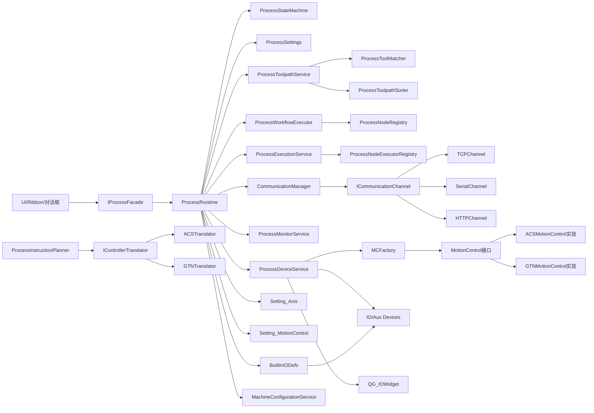
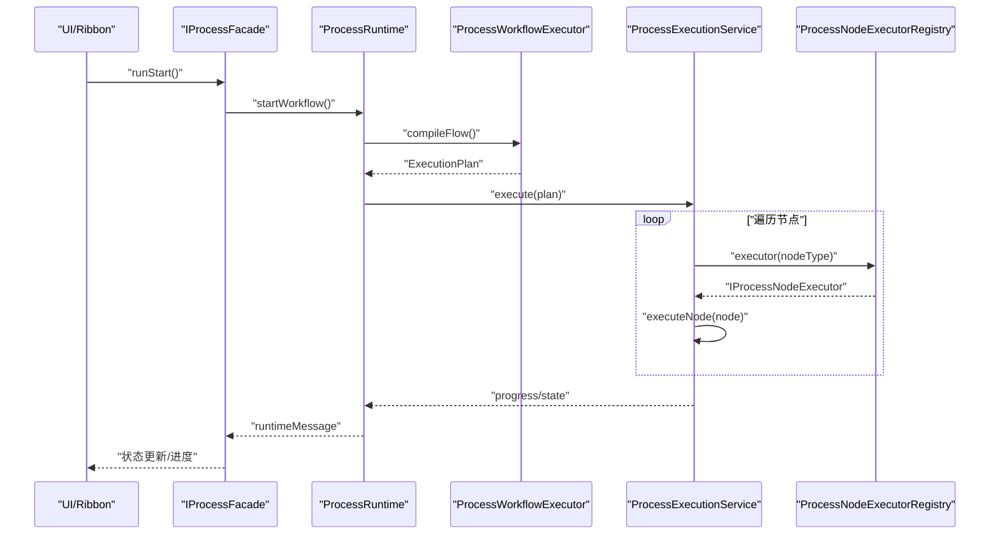
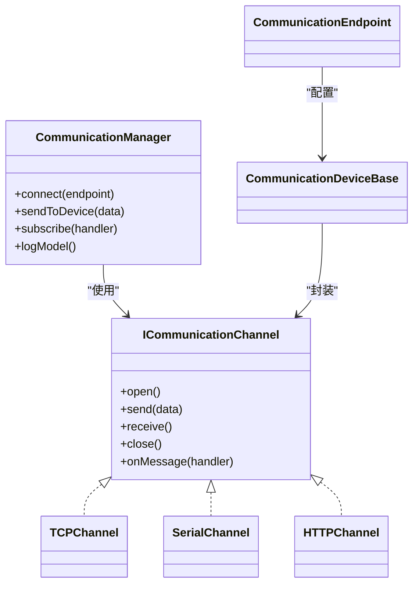
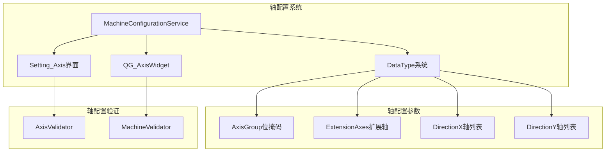
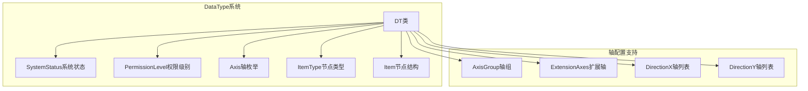
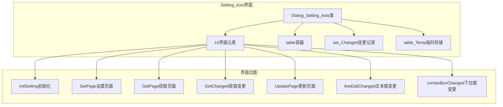
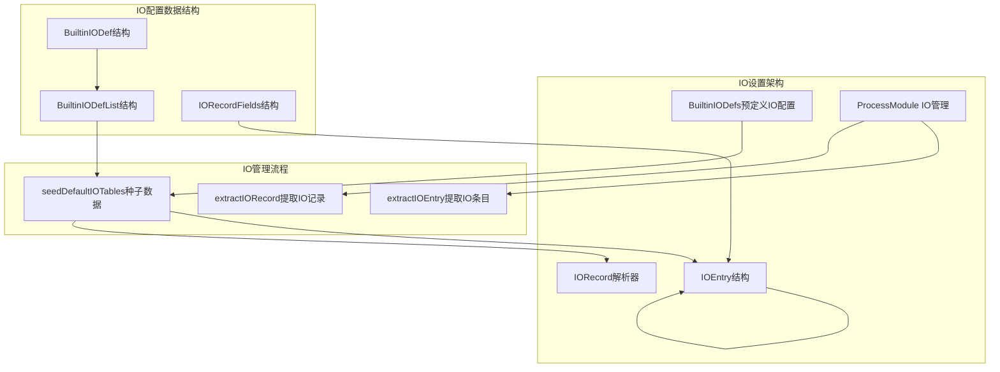
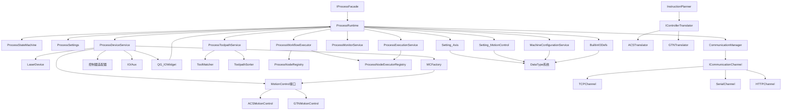

# Process模块设计

<cite>
**本文引用的文件**
- [process模块框架.md](file://process模块框架.md)
- [process模块重构计划.md](file://process模块重构计划.md)
- [i_process_facade.h](file://src/modules/process/i_process_facade.h)
- [process_module.h](file://src/modules/process/process_module.h)
- [process_runtime.h](file://src/modules/process/runtime/process_runtime.h)
- [process_state_machine.h](file://src/modules/process/runtime/process_state_machine.h)
- [process_execution_service.h](file://src/modules/process/execution/process_execution_service.h)
- [process_workflow_executor.h](file://src/modules/process/execution/process_workflow_executor.h)
- [process_node_executor_registry.h](file://src/modules/process/execution/process_node_executor_registry.h)
- [process_monitor_service.h](file://src/modules/process/monitor/process_monitor_service.h)
- [process_flow_document.h](file://src/modules/process/workflow/process_flow_document.h)
- [process_node_registry.h](file://src/modules/process/workflow/process_node_registry.h)
- [process_toolpath_service.h](file://src/modules/process/toolpath/process_toolpath_service.h)
- [process_tool_matcher.h](file://src/modules/process/toolpath/process_tool_matcher.h)
- [process_instruction_planner.h](file://src/modules/process/instructions/process_instruction_planner.h)
- [i_controller_translator.h](file://src/modules/process/instructions/i_controller_translator.h)
- [acs_translator.h](file://src/modules/process/instructions/acs_translator.h)
- [gtn_translator.h](file://src/modules/process/instructions/gtn_translator.h)
- [communication_manager.h](file://src/modules/process/communication/communication_manager.h)
- [i_communication_channel.h](file://src/modules/process/communication/i_communication_channel.h)
- [tcp_channel.h](file://src/modules/process/communication/protocols/tcp_channel.h)
- [serial_channel.h](file://src/modules/process/communication/protocols/serial_channel.h)
- [http_channel.h](file://src/modules/process/communication/protocols/http_channel.h)
- [communication_device_base.h](file://src/modules/process/communication/communication_device_base.h)
- [communication_endpoint.h](file://src/modules/process/communication/communication_endpoint.h)
- [process_settings.h](file://src/modules/process/settings/process_settings.h)
- [process_settings_schema.h](file://src/modules/process/settings/process_settings_schema.h)
- [commands_process.h](file://src/modules/process/commands/commands_process.h)
- [process_toolpath_sorter.h](file://src/modules/process/toolpath/process_toolpath_sorter.h)
- [process_toolpath_service.h](file://src/modules/process/toolpath/process_toolpath_service.h)
- [process_flow_model.h](file://src/modules/process/ui/process_flow_model.h)
- [process_flow_tree_view.h](file://src/modules/process/ui/process_flow_tree_view.h)
- [process_node_edit_dialog.h](file://src/modules/process/ui/process_node_edit_dialog.h)
- [ribbon_process_tab.h](file://src/modules/process/ui/ribbon_process_tab.h)
- [DataType.h](file://src/modules/process/System/DataType.h)
- [Setting_Axis.h](file://src/modules/process/Setting/Setting_Axis.h)
- [Setting_MotionControl.h](file://src/modules/process/Setting/Setting_MotionControl.h)
- [qg_AxisWidget.h](file://src/modules/process/ui/legacy/qg_AxisWidget.h)
- [machine_configuration_service.h](file://src/core/kinematics/machine_configuration_service.h)
- [MotionControl.h](file://src/modules/process/device/MotionControl/MotionControl.h)
- [ACSMotionControl.h](file://src/modules/process/device/MotionControl/ACSMotionControl.h)
- [MCFactory.h](file://src/modules/process/device/MotionControl/MCFactory.h)
- [acs_motion_controller_adapter.h](file://src/modules/process/controllers/acs_motion_controller_adapter.h)
- [gtn_motion_controller_adapter.h](file://src/modules/process/controllers/gtn_motion_controller_adapter.h)
- [BuiltinIODefs.h](file://src/modules/process/Setting/BuiltinIODefs.h)
- [BuiltinIODefs.cpp](file://src/modules/process/Setting/BuiltinIODefs.cpp)
- [qg_IOWidget.h](file://src/modules/process/ui/legacy/qg_IOWidget.h)
- [qg_IOWidget.cpp](file://src/modules/process/ui/legacy/qg_IOWidget.cpp)
- [process_module.cpp](file://src/modules/process/process_module.cpp)
</cite>

## 更新摘要
**所做更改**
- 新增IO设置架构设计章节，详细介绍表格驱动的IO管理、预定义IO配置系统和Process模块的IO描述符管理增强
- 更新了设备控制架构，反映IO管理的表格驱动设计和预定义配置系统
- 新增了BuiltinIODefs预定义IO配置系统和QG_IOWidget IO控制界面的详细分析
- 更新了ProcessModule中的IO描述符管理增强功能

## 目录
1. [引言](#引言)
2. [项目结构](#项目结构)
3. [核心组件](#核心组件)
4. [架构总览](#架构总览)
5. [详细组件分析](#详细组件分析)
6. [轴配置系统与扩展轴功能](#轴配置系统与扩展轴功能)
7. [DataType系统更新](#datatype系统更新)
8. [轴配置设置界面](#轴配置设置界面)
9. [设备控制架构升级](#设备控制架构升级)
10. [IO设置架构设计](#io设置架构设计)
11. [依赖关系分析](#依赖关系分析)
12. [性能考虑](#性能考虑)
13. [故障排查指南](#故障排查指南)
14. [结论](#结论)
15. [附录](#附录)

## 引言
本设计文档面向LaserCNC的Process模块，系统化阐述其核心职责、对外接口、内部执行与状态机、工作流引擎、设备通信与实时控制接口，并提供扩展开发指导（新设备适配、新通信协议集成、监控算法开发）。本次更新重点反映了Process模块整体架构的重大变化，特别是从直接控制器管理转向Service层架构的设计理念，以及新的MotionControl接口和MCFactory工厂模式的应用。**新增的IO设置架构设计章节详细介绍了表格驱动的IO管理、预定义IO配置系统和Process模块的IO描述符管理增强，这些改进显著提升了IO配置的灵活性和可维护性。**

## 项目结构
Process模块位于src/modules/process目录下，采用"功能域+层次化"的组织方式，包含运行时(runtime)、设置(settings)、设备(device)、刀路(toolpath)、指令(instructions)、工作流(workflow)、执行(execution)、监控(monitor)、通信(communication)、UI(ui)、命令(commands)等子域。模块通过IModule与IProcessFacade装配与对外暴露，内部以ProcessRuntime为核心协调器，承载状态机与上下文。

```mermaid
graph TB
subgraph "模块装配层"
PM["ProcessModule"]
IF["IProcessFacade"]
end
subgraph "运行时(runtime)"
PR["ProcessRuntime"]
PSM["ProcessStateMachine"]
PEC["ProcessExecutionContext"]
end
subgraph "设置(settings)"
PS["ProcessSettings"]
PSS["ProcessSettingsSchema"]
SA["Setting_Axis"]
SMC["Setting_MotionControl"]
BIO["BuiltinIODefs预定义IO配置"]
MC["MachineConfigurationService"]
end
subgraph "设备(device)"
PD["ProcessDeviceService"]
PL["LaserDevice(多实现)"]
PMC["MotionControl(多实现)"]
MCFactory["MCFactory工厂"]
PMCAdapter["控制器适配器"]
PIO["IO/Aux Devices"]
QIW["QG_IOWidget IO控制界面"]
end
subgraph "刀路(toolpath)"
PTS["ProcessToolpathService"]
PTM["ProcessToolMatcher"]
STS["ProcessToolpathSorter"]
end
subgraph "指令(instructions)"
PIP["ProcessInstructionPlanner"]
ICT["IControllerTranslator"]
ACT["ACSTranslator"]
GNT["GTNTranslator"]
end
subgraph "工作流(workflow)"
PFD["ProcessFlowDocument"]
PNR["ProcessNodeRegistry"]
end
subgraph "执行(execution)"
PWS["ProcessWorkflowExecutor"]
PES["ProcessExecutionService"]
PNER["ProcessNodeExecutorRegistry"]
end
subgraph "监控(monitor)"
PMS["ProcessMonitorService"]
end
subgraph "通信(communication)"
PCM["CommunicationManager"]
ICC["ICommunicationChannel"]
TCP["TCPChannel"]
SRL["SerialChannel"]
HTTP["HTTPChannel"]
end
subgraph "UI"
PFM["ProcessFlowModel"]
PFTV["ProcessFlowTreeView"]
PNED["ProcessNodeEditDialog"]
RPT["RibbonProcessTab"]
QAW["QG_AxisWidget"]
end
PM --> IF
PM --> PR
PR --> PSM
PR --> PEC
PR --> PS
PR --> PD
PR --> PTS
PR --> PWS
PR --> PES
PR --> PMS
PR --> PCM
PR --> SA
PR --> SMC
PR --> BIO
PR --> MC
PD --> PL
PD --> PMC
PD --> MCFactory
PD --> PMCAdapter
PD --> PIO
PD --> QIW
PTS --> PTM
PTS --> STS
PWS --> PNR
PWS --> PNER
PES --> PNER
PIP --> ICT
ICT --> ACT
ICT --> GNT
PCM --> ICC
ICC --> TCP
ICC --> SRL
ICC --> HTTP
IF --> PFM
IF --> PFTV
IF --> PNED
IF --> RPT
IF --> QAW
```

**图表来源**
- [process模块框架.md:72-137](file://process模块框架.md#L72-L137)
- [process_module.h](file://src/modules/process/process_module.h)
- [i_process_facade.h](file://src/modules/process/i_process_facade.h)
- [Setting_Axis.h](file://src/modules/process/Setting/Setting_Axis.h)
- [Setting_MotionControl.h](file://src/modules/process/Setting/Setting_MotionControl.h)
- [qg_AxisWidget.h](file://src/modules/process/ui/legacy/qg_AxisWidget.h)
- [machine_configuration_service.h](file://src/core/kinematics/machine_configuration_service.h)
- [MCFactory.h](file://src/modules/process/device/MotionControl/MCFactory.h)
- [acs_motion_controller_adapter.h](file://src/modules/process/controllers/acs_motion_controller_adapter.h)
- [gtn_motion_controller_adapter.h](file://src/modules/process/controllers/gtn_motion_controller_adapter.h)
- [BuiltinIODefs.h](file://src/modules/process/Setting/BuiltinIODefs.h)
- [qg_IOWidget.h](file://src/modules/process/ui/legacy/qg_IOWidget.h)

**章节来源**
- [process模块框架.md:6-17](file://process模块框架.md#L6-L17)
- [process模块框架.md:72-137](file://process模块框架.md#L72-L137)

## 核心组件
- IProcessFacade：对外统一服务入口，封装运行控制、文件操作、设备连接、设置刷新、状态查询等能力，UI与应用通过该接口驱动Process。
- ProcessRuntime：内部协调器，聚合状态机、执行上下文、设置服务、设备服务、刀路服务、工作流与执行服务，负责编排启动、暂停、停止、急停等流程。
- ProcessStateMachine：运行状态的唯一事实源，定义待机、连接中、准备中、就绪、加工中、暂停、停止中、已停止、异常、急停等状态及其转换条件。
- ProcessExecutionService：执行服务，负责节点执行计划调度、节点执行器注册与分发、执行生命周期管理。
- ProcessWorkflowExecutor：工作流执行器，解析流程节点、编译执行计划、驱动执行服务。
- ProcessMonitorService：监控服务，采集与处理设备/工艺监控数据，提供报警与反馈。
- CommunicationManager：通信管理器，抽象通道与设备，提供连接、发送、接收、日志等能力。
- ProcessToolpathService/ProcessToolMatcher/ProcessToolpathSorter：刀路服务，负责从CAM读取OCC-free点集快照、匹配工具与图层、排序生成有序轮廓。
- ProcessInstructionPlanner + IControllerTranslator家族：指令规划与翻译，先生成控制器无关的命令缓冲，再由翻译器适配到不同控制器（如ACS、GTN）。
- ProcessFlowDocument + ProcessNodeRegistry：工作流文档与节点注册，定义流程节点类型、验证规则与编译执行。
- **新增** MCFactory：控制器工厂类，提供统一的控制器实例创建和管理接口，支持多种控制器类型的动态选择。
- **新增** Setting_MotionControl：运动控制设置界面，提供运动控制参数的可视化编辑功能。
- **更新** MotionControl接口：统一的运动控制抽象接口，定义了完整的运动控制API，支持多轴控制、IO控制、参数设置等功能。
- **新增** BuiltinIODefs：预定义IO配置系统，提供标准化的IO描述符定义和默认配置。
- **新增** QG_IOWidget：IO控制界面组件，提供直观的IO状态显示和控制功能。

**章节来源**
- [process模块框架.md:18-22](file://process模块框架.md#L18-L22)
- [process模块框架.md:140-172](file://process模块框架.md#L140-L172)
- [process_module.h](file://src/modules/process/process_module.h)
- [i_process_facade.h](file://src/modules/process/i_process_facade.h)
- [process_runtime.h:10-37](file://src/modules/process/runtime/process_runtime.h#L10-L37)
- [Setting_Axis.h](file://src/modules/process/Setting/Setting_Axis.h)
- [Setting_MotionControl.h](file://src/modules/process/Setting/Setting_MotionControl.h)
- [MCFactory.h](file://src/modules/process/device/MotionControl/MCFactory.h)
- [MotionControl.h](file://src/modules/process/device/MotionControl/MotionControl.h)
- [machine_configuration_service.h](file://src/core/kinematics/machine_configuration_service.h)
- [BuiltinIODefs.h](file://src/modules/process/Setting/BuiltinIODefs.h)
- [qg_IOWidget.h](file://src/modules/process/ui/legacy/qg_IOWidget.h)

## 架构总览
Process模块遵循"运行时编排 + 多服务解耦 + 控制器无关指令 + 通道抽象通信"的设计。对外通过IProcessFacade暴露稳定接口；对内以ProcessRuntime为协调中心，串联设置、设备、刀路、指令、工作流、执行、监控、通信等子系统；执行链路先生成控制器无关指令，再由翻译器适配到具体控制器；通信链路通过通道抽象屏蔽底层协议差异。**新的设备控制架构通过MCFactory工厂模式统一管理控制器实例，MotionControl接口提供统一的服务层抽象，移除了直接的控制器管理方式，提升了系统的可扩展性和可维护性。新增的IO设置架构通过表格驱动的IO管理和预定义IO配置系统，提供了更加灵活和标准化的IO配置解决方案。**

**图表来源**
- [process模块框架.md:299-317](file://process模块框架.md#L299-L317)
- [process_module.h](file://src/modules/process/process_module.h)
- [i_process_facade.h](file://src/modules/process/i_process_facade.h)
- [process_runtime.h:10-37](file://src/modules/process/runtime/process_runtime.h#L10-L37)
- [Setting_Axis.h](file://src/modules/process/Setting/Setting_Axis.h)
- [Setting_MotionControl.h](file://src/modules/process/Setting/Setting_MotionControl.h)
- [machine_configuration_service.h](file://src/core/kinematics/machine_configuration_service.h)
- [MCFactory.h](file://src/modules/process/device/MotionControl/MCFactory.h)
- [MotionControl.h](file://src/modules/process/device/MotionControl/MotionControl.h)
- [ACSMotionControl.h](file://src/modules/process/device/MotionControl/ACSMotionControl.h)
- [BuiltinIODefs.h](file://src/modules/process/Setting/BuiltinIODefs.h)
- [qg_IOWidget.h](file://src/modules/process/ui/legacy/qg_IOWidget.h)

## 详细组件分析

### IProcessFacade接口设计与对外服务
- 角色定位：Process模块对外唯一入口，封装运行控制、文件操作、设备连接、设置刷新、状态查询等。
- 建议能力集合（来自框架文档）：准备、启动、暂停/恢复、停止、急停、复位急停；新建/加载/保存流程；连接/断开设备、切换活动profile、设备状态查询；重载设置、设置修订查询；状态、消息、错误、进度查询。
- 作用：UI与应用通过该接口发起动作，避免直接访问内部服务；便于未来演进为更薄的facade。

**章节来源**
- [process_module框架.md:320-328](file://process模块框架.md#L320-L328)
- [i_process_facade.h](file://src/modules/process/i_process_facade.h)

### ProcessRuntime：内部协调器与上下文
- 职责：持有ProcessStateMachine与ProcessExecutionContext，提供initialize、applyFacadeState、canChangeConfiguration等方法；编排启动/暂停/停止/急停流程；转发运行消息。
- 设计要点：仅做编排，不实现具体设备、刀路、参数与指令细节；状态机是唯一事实源；上下文承载运行期参数与共享对象。
- **新增** 轴配置协调：ProcessRuntime现在需要协调轴配置的加载、验证和应用，确保轴配置与设备配置的一致性。
- **新增** IO描述符管理：ProcessRuntime负责管理IO描述符的加载、验证和应用，确保IO配置与设备配置的一致性。

**章节来源**
- [process_runtime.h:10-37](file://src/modules/process/runtime/process_runtime.h#L10-L37)
- [process模块框架.md:140-152](file://process模块框架.md#L140-L152)

### ProcessStateMachine：运行状态机
- 状态建议：未初始化、待机、连接中、准备中、就绪、加工中、暂停、停止中、已停止、异常、急停。
- 作用：统一约束运行时状态流转，确保并发与顺序一致性；为UI与执行服务提供状态查询与事件信号。
- **更新** 系统状态：新增SystemStatus枚举，包含Initializing、Processing、LaserProcessing等状态，支持更精细的系统状态管理。

**章节来源**
- [process模块框架.md:154-172](file://process模块框架.md#L154-L172)
- [process_state_machine.h](file://src/modules/process/runtime/process_state_machine.h)

### ProcessExecutionService与ProcessWorkflowExecutor：执行与工作流
- ProcessWorkflowExecutor：解析流程节点、编译执行计划、驱动执行服务；与ProcessNodeRegistry配合，保证节点类型与验证规则一致。
- ProcessExecutionService：调度执行计划、分发给节点执行器；通过ProcessNodeExecutorRegistry注册与发现执行器；支持暂停/恢复/停止/急停。
- 协作机制：工作流编译生成节点序列，执行服务按序调度，节点执行器负责具体动作（如移动、激光功率、IO开关），执行结果回写状态机与监控。

**图表来源**
- [process_module.h](file://src/modules/process/process_module.h)
- [process_workflow_executor.h](file://src/modules/process/execution/process_workflow_executor.h)
- [process_execution_service.h](file://src/modules/process/execution/process_execution_service.h)
- [process_node_executor_registry.h:27-40](file://src/modules/process/execution/process_node_executor_registry.h#L27-L40)

**章节来源**
- [process_module.h](file://src/modules/process/process_module.h)
- [process_workflow_executor.h](file://src/modules/process/execution/process_workflow_executor.h)
- [process_execution_service.h](file://src/modules/process/execution/process_execution_service.h)
- [process_node_executor_registry.h:7-42](file://src/modules/process/execution/process_node_executor_registry.h#L7-L42)

### ProcessMonitorService：监控与反馈
- 职责：采集设备/工艺监控数据（如温度、功率、位置偏差等），进行阈值判断与报警；与执行服务协同，必要时触发暂停/停止/急停。
- 设计建议：监控算法可插拔，通过注册表或策略模式扩展；与状态机联动，确保监控事件正确反映到运行状态。

**章节来源**
- [process_monitor_service.h](file://src/modules/process/monitor/process_monitor_service.h)

### 刀路与工具匹配、指令规划与翻译
- 刀路服务：从CAM读取OCC-free点集快照，进行图层/工具匹配、排序，生成有序轮廓列表。
- 指令规划：生成控制器无关的命令缓冲；翻译器将通用命令映射到具体控制器（如ACS、GTN）。
- 设计优势：将"工作流/刀路"与"控制器SDK"解耦，便于移植与扩展。

**图表来源**
- [process_toolpath_service.h](file://src/modules/process/toolpath/process_toolpath_service.h)
- [process_tool_matcher.h](file://src/modules/process/toolpath/process_tool_matcher.h)
- [process_toolpath_sorter.h](file://src/modules/process/toolpath/process_toolpath_sorter.h)
- [process_instruction_planner.h](file://src/modules/process/instructions/process_instruction_planner.h)
- [i_controller_translator.h](file://src/modules/process/instructions/i_controller_translator.h)
- [acs_translator.h](file://src/modules/process/instructions/acs_translator.h)
- [gtn_translator.h](file://src/modules/process/instructions/gtn_translator.h)

**章节来源**
- [process_toolpath_service.h](file://src/modules/process/toolpath/process_toolpath_service.h)
- [process_tool_matcher.h](file://src/modules/process/toolpath/process_tool_matcher.h)
- [process_toolpath_sorter.h](file://src/modules/process/toolpath/process_toolpath_sorter.h)
- [process_instruction_planner.h](file://src/modules/process/instructions/process_instruction_planner.h)
- [i_controller_translator.h](file://src/modules/process/instructions/i_controller_translator.h)
- [acs_translator.h](file://src/modules/process/instructions/acs_translator.h)
- [gtn_translator.h](file://src/modules/process/instructions/gtn_translator.h)

### 通信管理与实时控制接口
- CommunicationManager：统一管理通信通道与设备，提供连接、发送、接收、日志、事件等能力。
- 通道抽象：ICommunicationChannel定义通用接口；TCPChannel、SerialChannel、HTTPChannel等实现具体协议。
- 设备基类：CommunicationDeviceBase封装设备通用行为；Endpoint用于配置端点与参数。
- 实时控制：通过指令翻译器生成命令，经通道发送至控制器/设备；同时接收反馈，驱动状态机与监控。

**图表来源**
- [i_communication_channel.h](file://src/modules/process/communication/i_communication_channel.h)
- [tcp_channel.h](file://src/modules/process/communication/protocols/tcp_channel.h)
- [serial_channel.h](file://src/modules/process/communication/protocols/serial_channel.h)
- [http_channel.h](file://src/modules/process/communication/protocols/http_channel.h)
- [communication_manager.h](file://src/modules/process/communication/communication_manager.h)
- [communication_device_base.h](file://src/modules/process/communication/communication_device_base.h)
- [communication_endpoint.h](file://src/modules/process/communication/communication_endpoint.h)

**章节来源**
- [communication_manager.h](file://src/modules/process/communication/communication_manager.h)
- [i_communication_channel.h](file://src/modules/process/communication/i_communication_channel.h)
- [tcp_channel.h](file://src/modules/process/communication/protocols/tcp_channel.h)
- [serial_channel.h](file://src/modules/process/communication/protocols/serial_channel.h)
- [http_channel.h](file://src/modules/process/communication/protocols/http_channel.h)
- [communication_device_base.h](file://src/modules/process/communication/communication_device_base.h)
- [communication_endpoint.h](file://src/modules/process/communication/communication_endpoint.h)

### 工作流引擎与节点执行机制
- ProcessFlowDocument：流程文档模型，承载节点拓扑与属性。
- ProcessNodeRegistry：节点类型注册与验证，确保流程合法性。
- ProcessWorkflowExecutor：编译流程为可执行计划，驱动执行服务。
- ProcessNodeExecutorRegistry：节点执行器注册表，按节点类型分发执行器。
- 节点执行：每个节点对应一个执行器，执行器负责具体动作（如移动、激光、IO），并上报进度与状态。

**章节来源**
- [process_flow_document.h](file://src/modules/process/workflow/process_flow_document.h)
- [process_node_registry.h](file://src/modules/process/workflow/process_node_registry.h)
- [process_workflow_executor.h](file://src/modules/process/execution/process_workflow_executor.h)
- [process_node_executor_registry.h:27-40](file://src/modules/process/execution/process_node_executor_registry.h#L27-L40)

### 设置与参数体系
- ProcessSettings：集中管理设备profile、轴参数、工具参数、图层/工具绑定、工艺参数、外设参数等typed参数。
- ProcessSettingsSchema：参数schema定义与校验，保障设置一致性与可迁移性。
- 应用：Runtime在启动前读取设置快照，执行期间根据变更刷新设备会话与UI。
- **新增** Setting_MotionControl：专门的运动控制设置界面，提供运动控制参数的可视化编辑功能。
- **新增** Setting_Axis：专门的轴配置设置界面，提供轴配置参数的可视化编辑功能。
- **新增** BuiltinIODefs：预定义IO配置系统，提供标准化的IO描述符定义和默认配置。

**章节来源**
- [process_settings.h](file://src/modules/process/settings/process_settings.h)
- [process_settings_schema.h](file://src/modules/process/settings/process_settings_schema.h)
- [process_module.h](file://src/modules/process/process_module.h)
- [Setting_Axis.h](file://src/modules/process/Setting/Setting_Axis.h)
- [Setting_MotionControl.h](file://src/modules/process/Setting/Setting_MotionControl.h)
- [BuiltinIODefs.h](file://src/modules/process/Setting/BuiltinIODefs.h)

### UI与交互
- ProcessFlowModel/ProcessFlowTreeView：流程树视图与模型，支持编辑、拖拽、验证。
- ProcessNodeEditDialog：节点属性编辑对话框。
- RibbonProcessTab：过程标签页，提供运行控制与状态展示。
- **新增** QG_AxisWidget：轴控制界面组件，提供轴状态显示和控制功能。
- **新增** Setting_MotionControl：运动控制设置界面，提供运动控制参数的可视化编辑功能。
- **新增** QG_IOWidget：IO控制界面组件，提供直观的IO状态显示和控制功能。
- 作用：UI通过IProcessFacade与模块交互，不直接操作内部服务，降低耦合。

**章节来源**
- [process_flow_model.h](file://src/modules/process/ui/process_flow_model.h)
- [process_flow_tree_view.h](file://src/modules/process/ui/process_flow_tree_view.h)
- [process_node_edit_dialog.h](file://src/modules/process/ui/process_node_edit_dialog.h)
- [ribbon_process_tab.h](file://src/modules/process/ui/ribbon_process_tab.h)
- [qg_AxisWidget.h](file://src/modules/process/ui/legacy/qg_AxisWidget.h)
- [Setting_MotionControl.h](file://src/modules/process/Setting/Setting_MotionControl.h)
- [qg_IOWidget.h](file://src/modules/process/ui/legacy/qg_IOWidget.h)

## 轴配置系统与扩展轴功能

### 轴配置系统架构
Process模块引入了全新的轴配置系统，支持灵活的多轴配置和扩展轴功能。该系统通过MachineConfigurationService统一管理轴配置参数，DataType系统提供轴配置相关的系统状态和权限管理支持。

**图表来源**
- [machine_configuration_service.h](file://src/core/kinematics/machine_configuration_service.h)
- [DataType.h](file://src/modules/process/System/DataType.h)
- [Setting_Axis.h](file://src/modules/process/Setting/Setting_Axis.h)
- [qg_AxisWidget.h](file://src/modules/process/ui/legacy/qg_AxisWidget.h)

### 轴配置参数管理
轴配置系统通过DataType.h中的DT类提供统一的轴配置参数管理：

- **AxisGroup位掩码**：使用位掩码表示轴配置，支持X、Y、Z、A、B、C轴的组合配置
- **ExtensionAxes扩展轴**：动态添加的扩展轴列表，支持用户自定义轴名称
- **DirectionX/DirectionY轴列表**：基于轴配置自动计算的X/Y方向轴列表
- **轴使用检测**：提供IsAxisUse方法检测特定轴是否启用

### 扩展轴功能
系统支持动态扩展轴功能，允许用户添加自定义轴：

- **扩展轴命名规则**：支持标准轴名（X、Y、Z、A、B、C）和扩展轴名（如X1、Y1、A1等）
- **扩展轴验证**：通过isExtensionAxis方法验证扩展轴的有效性
- **扩展轴配置**：在Setting_Axis界面中配置扩展轴参数
- **扩展轴应用**：在设备控制和指令生成中识别和使用扩展轴

### 轴配置验证机制
轴配置系统包含多层次的验证机制：

- **轴有效性验证**：验证轴配置的物理可行性
- **设备兼容性验证**：确保轴配置与设备硬件兼容
- **工艺参数验证**：验证轴配置与工艺要求匹配
- **权限控制验证**：基于权限级别控制轴配置的修改权限

**章节来源**
- [DataType.h](file://src/modules/process/System/DataType.h)
- [Setting_Axis.h](file://src/modules/process/Setting/Setting_Axis.h)
- [qg_AxisWidget.h](file://src/modules/process/ui/legacy/qg_AxisWidget.h)
- [machine_configuration_service.h](file://src/core/kinematics/machine_configuration_service.h)

## DataType系统更新

### DataType系统架构
DataType系统经过重大更新，增加了轴配置相关的系统状态管理和权限控制功能：

**图表来源**
- [DataType.h](file://src/modules/process/System/DataType.h)

### 系统状态管理
新增的SystemStatus枚举提供了更精细的系统状态管理：

- **UnInit/Initializing**：系统初始化阶段
- **Idle**：系统空闲状态
- **Paused/Pausing**：系统暂停状态
- **Processing/LaserProcessing**：系统处理状态，包含激光加工子状态

### 权限管理系统
DataType系统引入了完整的权限管理机制：

- **PermissionLevel枚举**：定义了从Operator到Developers的完整权限等级
- **权限控制**：通过getPermission/setPermission方法管理用户权限
- **权限验证**：在轴配置修改等敏感操作中实施权限控制

### 轴配置相关数据结构
DataType系统新增了多个与轴配置相关的数据结构：

- **Axis枚举**：定义X、Y、Z、A、B、C六个标准轴
- **DirectionXList/DirectionYList**：自动计算的X/Y方向轴列表
- **ExtensionAxes**：用户动态添加的扩展轴列表

**章节来源**
- [DataType.h](file://src/modules/process/System/DataType.h)

## 轴配置设置界面

### Setting_Axis界面设计
Setting_Axis提供了专门的轴配置设置界面，支持轴配置参数的可视化编辑：

**图表来源**
- [Setting_Axis.h](file://src/modules/process/Setting/Setting_Axis.h)

### 界面功能特性
Setting_Axis界面具有以下核心功能：

- **轴配置参数编辑**：提供轴配置参数的可视化编辑界面
- **变更跟踪**：通过set_Changed记录用户修改的参数
- **临时存储**：使用table_Temp临时存储编辑内容
- **实时验证**：提供输入验证和参数有效性检查
- **批量应用**：支持批量应用轴配置参数

### 数据绑定与验证
界面采用双向数据绑定机制：

- **参数绑定**：将界面元素与轴配置参数进行绑定
- **实时验证**：在用户输入时进行参数有效性验证
- **错误提示**：对无效输入提供友好的错误提示
- **状态同步**：确保界面状态与系统状态保持同步

**章节来源**
- [Setting_Axis.h](file://src/modules/process/Setting/Setting_Axis.h)

## 设备控制架构升级

### MotionControl接口设计
Process模块的设备控制架构经历了重大升级，从直接控制器管理转向Service层架构。新的MotionControl接口提供了统一的运动控制抽象：

```mermaid
classDiagram
class MotionControl {
<<abstract>>
+CreateMotor(Axis, table)
+Connect() bool
+Disconnect() bool
+IsConnected() bool
+Reboot() bool
+Home() bool
+Home(Axis) bool
+IsHomed() bool
+IsHomed(Axis) bool
+StopHome() bool
+Enable() bool
+Enable(Axis) bool
+Disable() bool
+Disable(Axis) bool
+IsEnabled() bool
+IsEnabled(Axis) bool
+Jog(Axis, bool, double) bool
+MoveRelative(Axis, double, double) bool
+MoveAbsolute(Axis, double, double) bool
+MoveMRelative(vector, vector, double) bool
+MoveMAbsolute(vector, vector, double) bool
+StopMotion() bool
+StopMotion(Axis) bool
+IsAxisMoving() bool
+IsAxisMoving(Axis) bool
+GetActualPos(Axis, double&) bool
+GetFeedbackPos(Axis, double&) bool
+SetAxisTable(Axis, table)
+SetAxisHomePrm(Axis, table) bool
+SetDigitalTable() void
+SetAnalogTable() void
+SetLaserParameterTable() ErrorCode
+DigitalOutputSet(IOData, int, bool) bool
+DigitalInputGet(IOData, int&, bool) bool
+AnalogOutputSet(IOData, double, bool) bool
+AnalogInputGet(IOData, double&, bool) bool
+LogError() void
+GetName() string
}
class ACSMotionControl {
+GetName() string
+Connect() bool
+Disconnect() bool
+IsConnected() bool
+Reboot() bool
+Home() bool
+Home(Axis) bool
+IsHomed() bool
+IsHomed(Axis) bool
+StopHome() bool
+Enable() bool
+Enable(Axis) bool
+Disable() bool
+Disable(Axis) bool
+IsEnabled() bool
+IsEnabled(Axis) bool
+Jog(Axis, bool, double) bool
+MoveRelative(Axis, double, double) bool
+MoveAbsolute(Axis, double, double) bool
+MoveMRelative(vector, vector, double) bool
+MoveMAbsolute(vector, vector, double) bool
+StopMotion() bool
+StopMotion(Axis) bool
+IsAxisMoving() bool
+IsAxisMoving(Axis) bool
+GetActualPos(Axis, double&) bool
+GetFeedbackPos(Axis, double&) bool
+SetAxisIndex(Axis, int) bool
+SetAxisVel(Axis, double) bool
+SetAxisAcc(Axis, double) bool
+SetAxisDec(Axis, double) bool
+SetAxisJerk(Axis, double) bool
+SetAxisSoftLimit(Axis, double, double) bool
+DigitalOutputSet(IOData, int, bool) bool
+DigitalInputGet(IOData, int&, bool) bool
+AnalogOutputSet(IOData, double, bool) bool
+AnalogInputGet(IOData, double&, bool) bool
+SetShutterOnOffWaitTime(double, double, double, double, double) bool
+BeginACSSegment(Tool) void
+EndProgramCommand(Tool) void
+OffsetLineTo(double, double, Tool) void
+OffsetArcTo(double, double, double, double, bool, Tool, double, double) void
+SendCommand() bool
+ResetProgramCommand() void
+StopQueue() bool
+StopMovingCuttingHead() bool
+StartMovingCuttingHead(Tool) bool
+MoveZCutting(double) bool
+GetCuttingCommand() string
+LoadCommandAndRunBuffer(int, string, int) bool
+RunBuffer(int) bool
+PauseBuffer(int) bool
+StopBuffer(int) bool
+StopAllBuffer() bool
+CheckBuffer(int, string&) bool
+IsBufferRunning(int) bool
+IsOffsetCutting() bool
+IsAxisStatusNormal(int&) bool
+SetFPos(Axis, double) bool
+GetFPos(Axis, double&) bool
+HaltMotor(Axis) bool
+AcscReadReal(string, double&) bool
+AcscWriteReal(string, double) bool
+AcscReadInt(string, int&) bool
+AcscWriteInt(string, int) bool
+IsReachPos(Axis, bool, double) bool
+SetAxisEnable(Axis, bool) bool
+InitCrd(Tool) bool
+PrfTrapAxis() bool
+GSN_SetLaserParameterApplication(double, double, double) bool
+GSN_SetLaserEnablePro(bool) bool
+GSN_LaserOnStatus(int&) bool
}
class MCFactory {
<<singleton>>
+GetMotionController(string) MotionControl*
+GetAllMCName(vector~string~) void
}
MotionControl <|-- ACSMotionControl
MCFactory --> MotionControl : "创建/管理"
```

**图表来源**
- [MotionControl.h](file://src/modules/process/device/MotionControl/MotionControl.h)
- [ACSMotionControl.h](file://src/modules/process/device/MotionControl/ACSMotionControl.h)
- [MCFactory.h](file://src/modules/process/device/MotionControl/MCFactory.h)

### MCFactory工厂模式
MCFactory类提供了统一的控制器实例创建和管理机制：

- **控制器实例化**：根据控制器名称动态创建相应的MotionControl实现
- **控制器管理**：维护内置的控制器实例（如ACSCMHP、GTN等）
- **控制器查询**：提供所有可用控制器名称的查询接口
- **配置支持**：通过预处理器宏控制不同控制器的编译支持

### 控制器适配器设计
Process模块还包含了控制器适配器，用于将不同的控制器接口适配到统一的服务层：

- **ACSMotionControllerAdapter**：适配ACS控制器到MotionControl接口
- **GTNMotionControllerAdapter**：适配GTN控制器到MotionControl接口
- **接口适配**：通过适配器模式实现不同控制器的统一接口

### Service层架构优势
新的Service层架构带来了以下优势：

- **统一接口**：MotionControl接口提供统一的控制API
- **可扩展性**：通过工厂模式轻松添加新的控制器实现
- **松耦合**：上层代码只依赖抽象接口，不依赖具体实现
- **测试友好**：可以轻松创建模拟控制器进行单元测试
- **配置灵活**：通过配置文件选择不同的控制器实现

**章节来源**
- [MotionControl.h](file://src/modules/process/device/MotionControl/MotionControl.h)
- [ACSMotionControl.h](file://src/modules/process/device/MotionControl/ACSMotionControl.h)
- [MCFactory.h](file://src/modules/process/device/MotionControl/MCFactory.h)
- [acs_motion_controller_adapter.h](file://src/modules/process/controllers/acs_motion_controller_adapter.h)
- [gtn_motion_controller_adapter.h](file://src/modules/process/controllers/gtn_motion_controller_adapter.h)

## IO设置架构设计

### 表格驱动的IO管理架构
Process模块引入了全新的表格驱动IO管理架构，通过标准化的数据结构和解析机制实现IO配置的统一管理：

**图表来源**
- [BuiltinIODefs.h](file://src/modules/process/Setting/BuiltinIODefs.h)
- [BuiltinIODefs.cpp](file://src/modules/process/Setting/BuiltinIODefs.cpp)
- [process_module.cpp](file://src/modules/process/process_module.cpp)
- [process_module.h](file://src/modules/process/process_module.h)

### 预定义IO配置系统
BuiltinIODefs提供了标准化的预定义IO配置，确保系统启动时具有合理的默认IO配置：

- **BuiltinIODef结构**：定义单个IO配置的标准格式，包含sectionKey、tomlKey、nameZh、defaultIndex、defaultActive、defaultEnabled、defaultShowInMain等字段
- **BuiltinIODefList结构**：定义IO配置列表的结构，包含items数组和count数量
- **预定义IO类型**：提供DigitalOUT、DigitalIN、AnalogOUT、AnalogIN四类预定义IO配置
- **默认配置值**：为每种IO类型提供合理的默认配置，如激光、吹气、夹头、出/回水泵等常用IO的默认索引和显示设置

### IO描述符管理增强
ProcessModule中的IO描述符管理功能得到了显著增强，支持更灵活的IO配置管理：

- **seedDefaultIOTables函数**：在系统启动时根据预定义配置生成默认IO表，确保IO配置的完整性和一致性
- **extractIOEntry函数**：解析settings中的IO条目，支持新旧两种数据格式（table和array）
- **extractIORecord函数**：解析单条IO记录，支持新旧两种schema格式
- **IO描述符缓存**：维护IO描述符的缓存，支持主界面IO栏的数字量输出按钮列表管理

### IO控制界面集成
QG_IOWidget提供了直观的IO控制界面，支持多种IO类型的控制和状态显示：

- **多客户化支持**：根据不同客户（Standard、Mindray、JAPHL）提供不同的IO界面布局
- **按钮状态管理**：通过ButtonState结构管理按钮的按下、释放、长按状态
- **IO状态轮询**：定时轮询IO状态，实时更新界面显示
- **IO控制逻辑**：支持点击、长按等不同操作模式的IO控制
- **灯光状态指示**：通过红绿黄三色灯指示系统状态

### IO配置兼容性设计
IO设置架构采用了向后兼容的设计，确保新旧版本的平滑过渡：

- **双格式支持**：同时支持新式table格式和旧式array格式的IO配置
- **字段兼容**：新格式支持name、index、active、enabled、showInMain等字段，旧格式仅支持name和index
- **默认值处理**：对于缺失的字段，使用合理的默认值进行填充
- **配置迁移**：支持从旧配置格式自动迁移到新格式

**章节来源**
- [BuiltinIODefs.h](file://src/modules/process/Setting/BuiltinIODefs.h)
- [BuiltinIODefs.cpp](file://src/modules/process/Setting/BuiltinIODefs.cpp)
- [qg_IOWidget.h](file://src/modules/process/ui/legacy/qg_IOWidget.h)
- [qg_IOWidget.cpp](file://src/modules/process/ui/legacy/qg_IOWidget.cpp)
- [process_module.cpp](file://src/modules/process/process_module.cpp)
- [process_module.h](file://src/modules/process/process_module.h)

## 依赖关系分析
- 松耦合：IProcessFacade隔离UI与内部服务；ProcessRuntime作为协调器，避免全局单例；各子服务独立可替换。
- 控制器无关：指令规划与翻译解耦，便于新增控制器适配。
- 通道抽象：通信通道统一接口，便于新增协议与设备。
- 可观测性：监控服务与状态机联动，日志与通信日志模型提供可观测性。
- **新增** 轴配置依赖：Setting_Axis与DataType系统紧密耦合，确保轴配置参数的一致性和有效性。
- **新增** 控制器工厂依赖：ProcessDeviceService依赖MCFactory进行控制器实例管理。
- **新增** IO配置依赖：ProcessModule依赖BuiltinIODefs进行IO配置的种子数据生成，QG_IOWidget依赖ProcessModule进行IO状态管理。

**图表来源**
- [process_module.h](file://src/modules/process/process_module.h)
- [i_process_facade.h](file://src/modules/process/i_process_facade.h)
- [process_runtime.h:10-37](file://src/modules/process/runtime/process_runtime.h#L10-L37)
- [Setting_Axis.h](file://src/modules/process/Setting/Setting_Axis.h)
- [Setting_MotionControl.h](file://src/modules/process/Setting/Setting_MotionControl.h)
- [machine_configuration_service.h](file://src/core/kinematics/machine_configuration_service.h)
- [DataType.h](file://src/modules/process/System/DataType.h)
- [MCFactory.h](file://src/modules/process/device/MotionControl/MCFactory.h)
- [MotionControl.h](file://src/modules/process/device/MotionControl/MotionControl.h)
- [ACSMotionControl.h](file://src/modules/process/device/MotionControl/ACSMotionControl.h)
- [BuiltinIODefs.h](file://src/modules/process/Setting/BuiltinIODefs.h)
- [qg_IOWidget.h](file://src/modules/process/ui/legacy/qg_IOWidget.h)

**章节来源**
- [process_module.h](file://src/modules/process/process_module.h)
- [i_process_facade.h](file://src/modules/process/i_process_facade.h)
- [process_runtime.h:10-37](file://src/modules/process/runtime/process_runtime.h#L10-L37)

## 性能考虑
- 指令生成批量化：尽量合并连续相似动作，减少指令数量与通道往返。
- 执行调度优化：节点执行器并行化（在安全前提下）、优先级队列、背压控制。
- 通信吞吐：选择合适通道（TCP/串口/HTTP），合理设置超时与重试；批量发送与压缩。
- 监控采样：按需采样与降采样，避免阻塞主执行线程。
- UI响应：异步执行与进度回调，避免阻塞主线程。
- **新增** 轴配置缓存：轴配置参数应进行缓存，避免频繁的配置读取和验证操作。
- **新增** 控制器实例池：通过MCFactory管理控制器实例，避免频繁创建销毁带来的性能损耗。
- **新增** IO配置缓存：IO描述符配置应进行缓存，避免频繁的配置读取和解析操作。
- **新增** IO状态轮询优化：QG_IOWidget的IO状态轮询应合理设置间隔，避免过度轮询影响系统性能。

## 故障排查指南
- 急停/异常状态：检查状态机是否进入EmergencyStop/Error；查看Runtime消息与Communication日志。
- 设备连接失败：确认Endpoint配置、通道可用性、设备握手协议；使用Communication日志模型定位问题。
- 执行中断：检查节点执行器注册与分发、执行计划合法性、翻译器映射；查看执行服务日志。
- 监控告警：核查监控阈值、算法实现、与状态机联动逻辑。
- 设置不生效：确认设置快照读取时机、刷新流程、设备会话重建。
- **新增** 轴配置问题：检查轴配置参数的有效性、扩展轴的正确性、权限级别的限制。
- **新增** 控制器连接问题：检查MCFactory是否正确创建控制器实例、控制器连接状态、控制器适配器配置。
- **新增** 运动控制异常：检查MotionControl接口调用参数、轴配置与控制器配置的匹配性、IO配置的正确性。
- **新增** IO配置问题：检查BuiltinIODefs预定义配置是否正确加载、ProcessModule的IO描述符管理是否正常、QG_IOWidget的IO状态显示是否正确。
- **新增** IO控制异常：检查QG_IOWidget的按钮状态管理、IO控制逻辑、灯光状态指示功能。

**章节来源**
- [process_runtime.h:25-31](file://src/modules/process/runtime/process_runtime.h#L25-L31)
- [communication_manager.h](file://src/modules/process/communication/communication_manager.h)
- [process_execution_service.h](file://src/modules/process/execution/process_execution_service.h)
- [process_monitor_service.h](file://src/modules/process/monitor/process_monitor_service.h)
- [MCFactory.h](file://src/modules/process/device/MotionControl/MCFactory.h)
- [MotionControl.h](file://src/modules/process/device/MotionControl/MotionControl.h)
- [BuiltinIODefs.h](file://src/modules/process/Setting/BuiltinIODefs.h)
- [qg_IOWidget.cpp](file://src/modules/process/ui/legacy/qg_IOWidget.cpp)

## 结论
Process模块通过"运行时编排 + 多服务解耦 + 控制器无关指令 + 通道抽象通信"的架构，实现了设备控制、工艺监控、工作流执行与通信管理的统一。IProcessFacade提供稳定对外接口，ProcessRuntime作为协调器承载状态与上下文，工作流与执行服务确保流程可控，监控与通信提供可观测性。**最新的架构升级通过MCFactory工厂模式和MotionControl接口，实现了从直接控制器管理到Service层架构的转变，提供了更好的可扩展性和可维护性。轴配置系统和扩展轴功能进一步增强了模块的灵活性，通过MachineConfigurationService和DataType系统的协同工作，为复杂的多轴配置提供了强大的支持。新增的IO设置架构设计通过表格驱动的IO管理和预定义IO配置系统，显著提升了IO配置的灵活性、可维护性和用户体验。**该设计具备良好的扩展性与可维护性，适合持续演进与新设备/协议接入。

## 附录

### 扩展开发指导

- 新设备适配
  - 设备抽象：实现ProcessDeviceService接口族（激光、运动控制、IO/Aux），在ProcessRuntime中注册与会话管理。
  - 通道对接：若设备通过通信通道接入，确保ICommunicationChannel实现满足需求；否则直接在设备层封装。
  - 翻译器适配：若控制器SDK需要，新增翻译器实现并接入ProcessInstructionPlanner。
  - **新增** 控制器适配：通过控制器适配器将新控制器适配到MotionControl接口。
  - **新增** IO适配：在新设备中实现IO配置支持，利用BuiltinIODefs系统提供预定义IO配置。

- 新通信协议集成
  - 在communication/protocols目录新增协议通道实现，遵循ICommunicationChannel接口。
  - 在CommunicationManager中注册/选择通道；在CommunicationEndpoint中配置参数。
  - 提供日志模型与错误码，便于排障。

- 监控算法开发
  - 在ProcessMonitorService中注册监控策略，按周期采样与阈值判断。
  - 与状态机联动，必要时触发暂停/停止/急停；提供告警上报与历史记录。

- 工作流节点扩展
  - 在ProcessNodeRegistry注册新节点类型与验证规则。
  - 在ProcessNodeExecutorRegistry注册对应执行器，实现具体动作与回传。
  - 在ProcessWorkflowExecutor中完善编译与调度逻辑。

- **新增** 轴配置扩展开发
  - **轴配置服务**：在MachineConfigurationService中注册新的轴配置类型和验证规则。
  - **DataType扩展**：在DataType.h中定义新的轴配置参数和枚举类型。
  - **界面集成**：在Setting_Axis中添加新的轴配置参数编辑界面。
  - **权限控制**：通过PermissionLevel枚举定义新的轴配置操作权限。
  - **设备适配**：在设备驱动中实现对新轴配置的支持和验证。

- **新增** 扩展轴功能开发
  - **扩展轴注册**：在Setting_Axis中添加扩展轴的配置选项。
  - **轴验证**：在MachineConfigurationService中实现扩展轴的有效性验证。
  - **指令生成**：在ProcessInstructionPlanner中支持扩展轴的指令生成。
  - **UI集成**：在QG_AxisWidget中添加扩展轴的显示和控制功能。
  - **权限管理**：通过DataType系统实现扩展轴配置的权限控制。

- **新增** 控制器工厂扩展开发
  - **新控制器实现**：实现MotionControl接口，提供完整的控制器功能。
  - **工厂注册**：在MCFactory中注册新的控制器实现。
  - **适配器开发**：如有需要，开发控制器适配器将现有控制器适配到新接口。
  - **配置支持**：通过预处理器宏控制新控制器的编译支持。
  - **测试验证**：提供单元测试和集成测试，确保控制器实现的正确性。

- **新增** IO设置架构扩展开发
  - **预定义IO配置扩展**：在BuiltinIODefs中添加新的IO类型和默认配置。
  - **IO配置解析扩展**：在ProcessModule中扩展IO配置解析逻辑，支持新的IO格式。
  - **IO控制界面扩展**：在QG_IOWidget中添加新的IO控制功能和界面元素。
  - **IO状态管理扩展**：扩展ProcessModule的IO状态管理功能，支持新的IO类型。
  - **IO配置迁移**：提供从旧IO配置格式到新格式的迁移工具和逻辑。

**章节来源**
- [process_module.h](file://src/modules/process/process_module.h)
- [process_runtime.h:10-37](file://src/modules/process/runtime/process_runtime.h#L10-L37)
- [process_node_registry.h](file://src/modules/process/workflow/process_node_registry.h)
- [process_node_executor_registry.h:7-42](file://src/modules/process/execution/process_node_executor_registry.h#L7-L42)
- [process_monitor_service.h](file://src/modules/process/monitor/process_monitor_service.h)
- [i_communication_channel.h](file://src/modules/process/communication/i_communication_channel.h)
- [tcp_channel.h](file://src/modules/process/communication/protocols/tcp_channel.h)
- [serial_channel.h](file://src/modules/process/communication/protocols/serial_channel.h)
- [http_channel.h](file://src/modules/process/communication/protocols/http_channel.h)
- [DataType.h](file://src/modules/process/System/DataType.h)
- [Setting_Axis.h](file://src/modules/process/Setting/Setting_Axis.h)
- [qg_AxisWidget.h](file://src/modules/process/ui/legacy/qg_AxisWidget.h)
- [machine_configuration_service.h](file://src/core/kinematics/machine_configuration_service.h)
- [MCFactory.h](file://src/modules/process/device/MotionControl/MCFactory.h)
- [MotionControl.h](file://src/modules/process/device/MotionControl/MotionControl.h)
- [ACSMotionControl.h](file://src/modules/process/device/MotionControl/ACSMotionControl.h)
- [acs_motion_controller_adapter.h](file://src/modules/process/controllers/acs_motion_controller_adapter.h)
- [gtn_motion_controller_adapter.h](file://src/modules/process/controllers/gtn_motion_controller_adapter.h)
- [BuiltinIODefs.h](file://src/modules/process/Setting/BuiltinIODefs.h)
- [BuiltinIODefs.cpp](file://src/modules/process/Setting/BuiltinIODefs.cpp)
- [qg_IOWidget.cpp](file://src/modules/process/ui/legacy/qg_IOWidget.cpp)