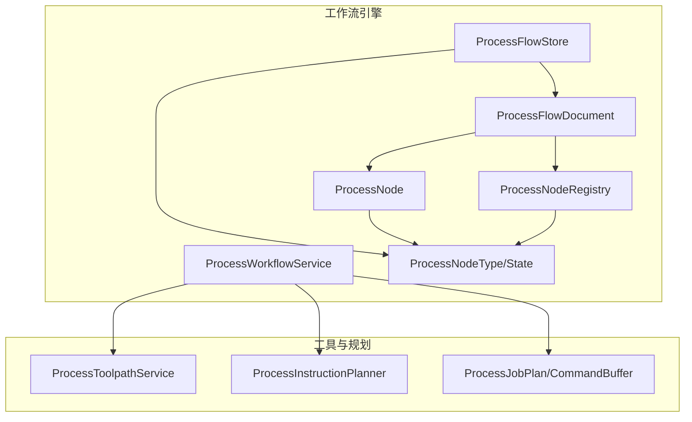
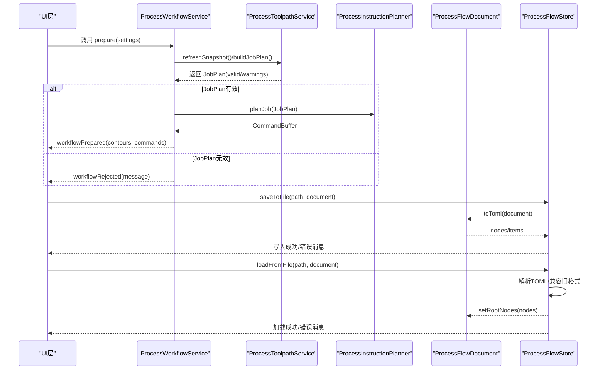
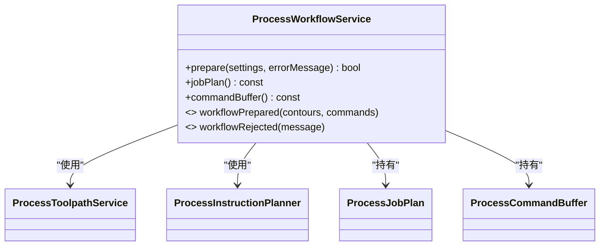
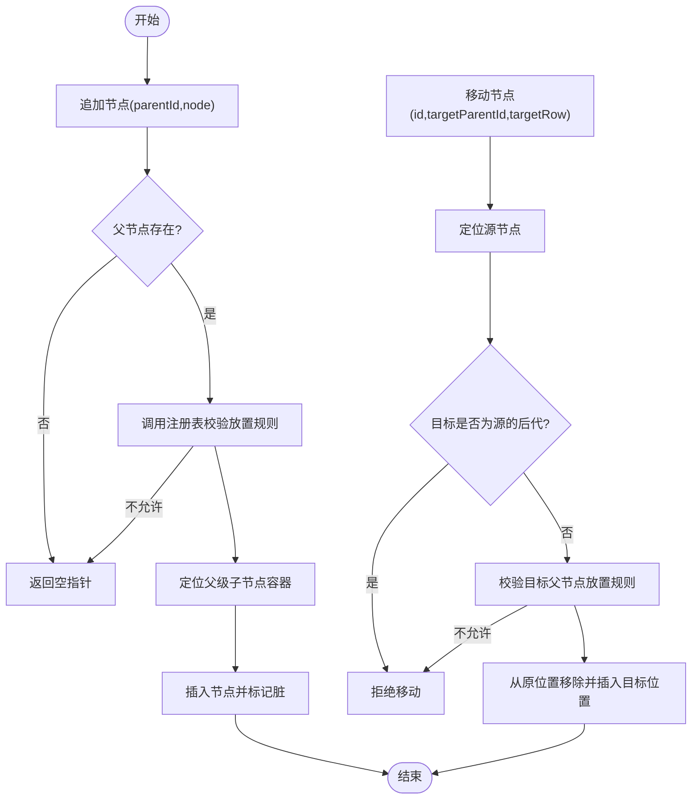
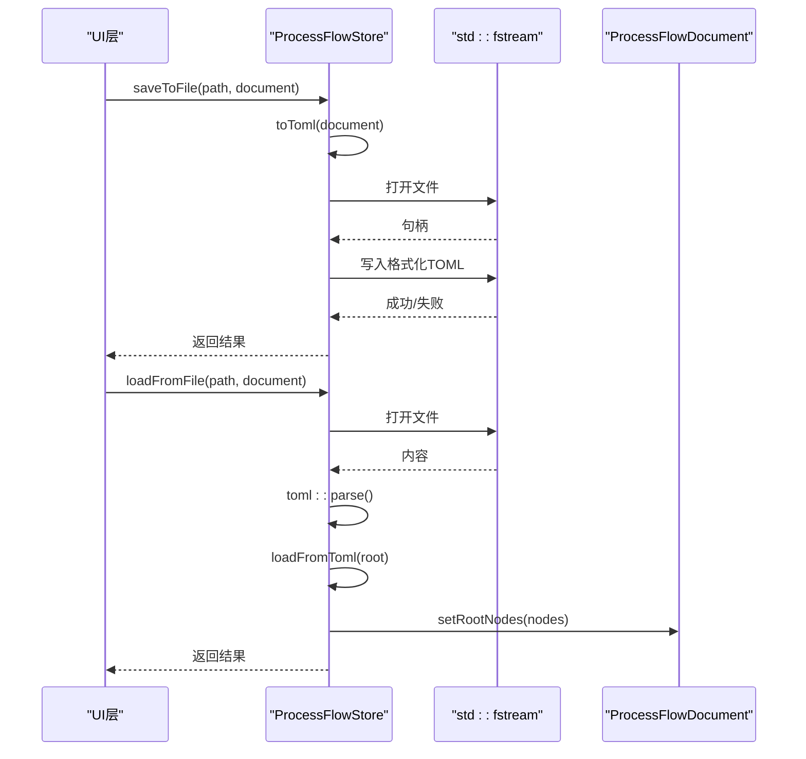
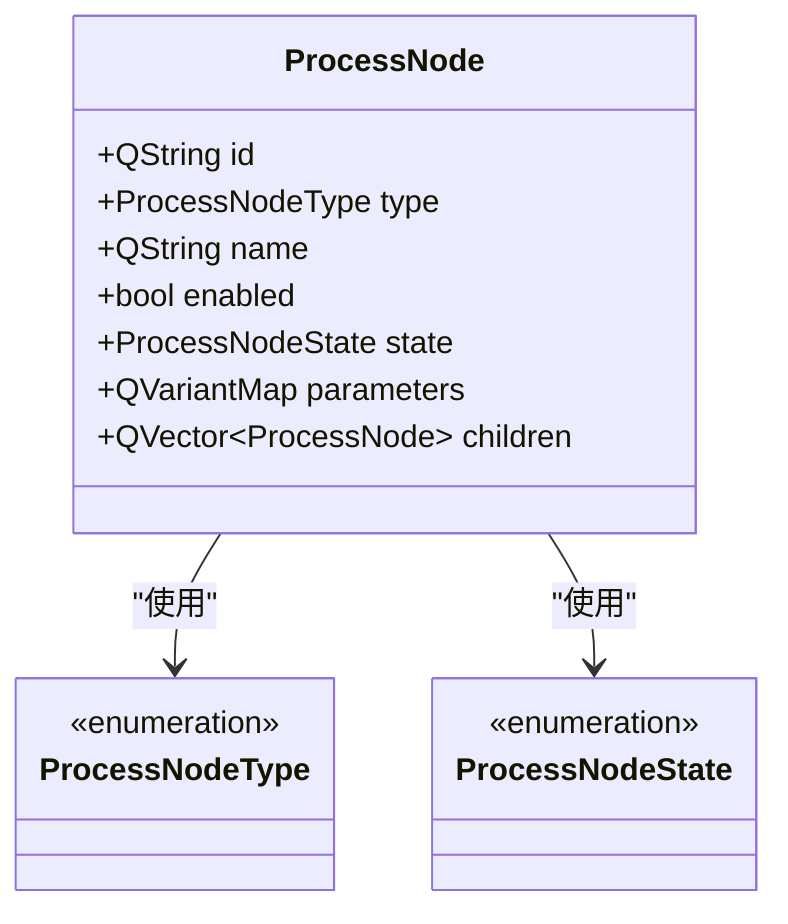
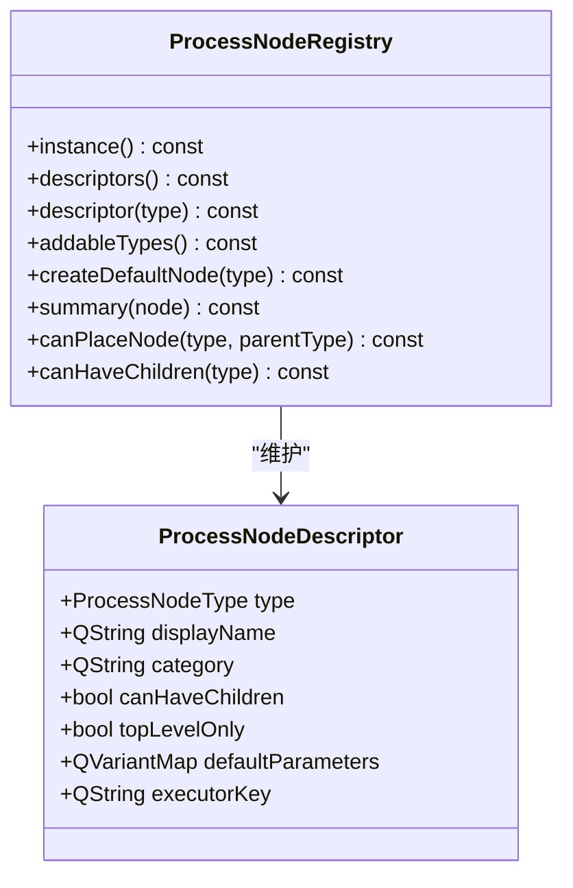
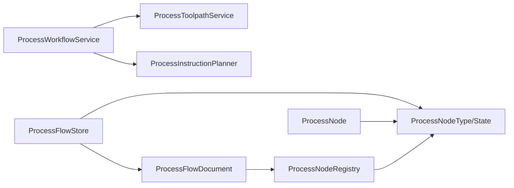

# 工作流引擎

<cite>
**本文引用的文件**
- [process_workflow_service.h](file://src/modules/process/workflow/process_workflow_service.h)
- [process_workflow_service.cpp](file://src/modules/process/workflow/process_workflow_service.cpp)
- [process_flow_document.h](file://src/modules/process/workflow/process_flow_document.h)
- [process_flow_document.cpp](file://src/modules/process/workflow/process_flow_document.cpp)
- [process_flow_store.h](file://src/modules/process/workflow/process_flow_store.h)
- [process_flow_store.cpp](file://src/modules/process/workflow/process_flow_store.cpp)
- [process_node.h](file://src/modules/process/workflow/process_node.h)
- [process_node.cpp](file://src/modules/process/workflow/process_node.cpp)
- [process_node_registry.h](file://src/modules/process/workflow/process_node_registry.h)
- [process_node_registry.cpp](file://src/modules/process/workflow/process_node_registry.cpp)
- [process_node_type.h](file://src/modules/process/workflow/process_node_type.h)
</cite>

## 目录
1. [引言](#引言)
2. [项目结构](#项目结构)
3. [核心组件](#核心组件)
4. [架构总览](#架构总览)
5. [详细组件分析](#详细组件分析)
6. [依赖分析](#依赖分析)
7. [性能考虑](#性能考虑)
8. [故障排查指南](#故障排查指南)
9. [结论](#结论)
10. [附录](#附录)

## 引言
本技术文档围绕Process模块中的工作流引擎展开，系统性阐述以下关键主题：
- ProcessWorkflowService的工作流准备与命令生成机制
- ProcessFlowDocument流程文档的数据结构与树形管理
- ProcessFlowStore流程存储系统（TOML）的读写与兼容性
- ProcessNode节点模型的属性与状态设计
- ProcessNodeRegistry节点注册表的类型管理与动态约束
- ProcessNodeType节点类型的分类体系与用途
- 工作流UI组件（流程模型、树形视图、节点编辑对话框）的实现思路
- 扩展开发指导：自定义节点类型与流程设计器开发技巧

## 项目结构
工作流引擎位于src/modules/process/workflow目录下，采用“数据模型 + 注册表 + 文档 + 存储 + 服务”的分层设计，配合UI层在src/modules/process/ui中进行展示与交互。

图表来源
- [process_workflow_service.h:10-36](file://src/modules/process/workflow/process_workflow_service.h#L10-L36)
- [process_flow_document.h:10-46](file://src/modules/process/workflow/process_flow_document.h#L10-L46)
- [process_flow_store.h:13-32](file://src/modules/process/workflow/process_flow_store.h#L13-L32)
- [process_node_registry.h:21-49](file://src/modules/process/workflow/process_node_registry.h#L21-L49)
- [process_node_type.h:10-62](file://src/modules/process/workflow/process_node_type.h#L10-L62)
- [process_node.h:13-31](file://src/modules/process/workflow/process_node.h#L13-L31)

章节来源
- [process_workflow_service.h:10-36](file://src/modules/process/workflow/process_workflow_service.h#L10-L36)
- [process_flow_document.h:10-46](file://src/modules/process/workflow/process_flow_document.h#L10-L46)
- [process_flow_store.h:13-32](file://src/modules/process/workflow/process_flow_store.h#L13-L32)
- [process_node_registry.h:21-49](file://src/modules/process/workflow/process_node_registry.h#L21-L49)
- [process_node_type.h:10-62](file://src/modules/process/workflow/process_node_type.h#L10-L62)
- [process_node.h:13-31](file://src/modules/process/workflow/process_node.h#L13-L31)

## 核心组件
- ProcessWorkflowService：负责从CAM工具路径与设置快照生成工作流作业计划与命令缓冲区，并通过信号通知UI层结果。
- ProcessFlowDocument：独立于Qt视图的可编辑流程树文档，提供节点增删改查、移动与定位能力。
- ProcessFlowStore：以TOML格式读写流程文档，支持新旧格式兼容与Schema版本管理。
- ProcessNode：节点数据结构，包含稳定ID、类型、名称、启用状态、运行状态、参数映射与子节点列表。
- ProcessNodeRegistry：节点类型注册表，提供描述符、默认节点创建、放置规则与摘要信息。
- ProcessNodeType/State：节点类型与运行状态枚举，配套序列化/反序列化工具函数。

章节来源
- [process_workflow_service.h:10-36](file://src/modules/process/workflow/process_workflow_service.h#L10-L36)
- [process_workflow_service.cpp:7-37](file://src/modules/process/workflow/process_workflow_service.cpp#L7-L37)
- [process_flow_document.h:10-46](file://src/modules/process/workflow/process_flow_document.h#L10-L46)
- [process_flow_document.cpp:13-178](file://src/modules/process/workflow/process_flow_document.cpp#L13-L178)
- [process_flow_store.h:13-32](file://src/modules/process/workflow/process_flow_store.h#L13-L32)
- [process_flow_store.cpp:169-253](file://src/modules/process/workflow/process_flow_store.cpp#L169-L253)
- [process_node.h:13-31](file://src/modules/process/workflow/process_node.h#L13-L31)
- [process_node.cpp:7-131](file://src/modules/process/workflow/process_node.cpp#L7-L131)
- [process_node_registry.h:10-49](file://src/modules/process/workflow/process_node_registry.h#L10-L49)
- [process_node_registry.cpp:22-222](file://src/modules/process/workflow/process_node_registry.cpp#L22-L222)
- [process_node_type.h:10-62](file://src/modules/process/workflow/process_node_type.h#L10-L62)

## 架构总览
工作流引擎的控制流由“准备阶段”和“持久化/读取阶段”构成。准备阶段通过工具路径服务构建作业计划，再由指令规划器生成命令缓冲区；持久化阶段通过TOML存储器读写流程树。

图表来源
- [process_workflow_service.cpp:13-35](file://src/modules/process/workflow/process_workflow_service.cpp#L13-L35)
- [process_flow_store.cpp:169-253](file://src/modules/process/workflow/process_flow_store.cpp#L169-L253)
- [process_flow_document.cpp:19-48](file://src/modules/process/workflow/process_flow_document.cpp#L19-L48)

## 详细组件分析

### ProcessWorkflowService 工作流服务
- 职责
  - 从ProcessToolpathService刷新并构建JobPlan
  - 使用ProcessInstructionPlanner将JobPlan转换为命令缓冲区
  - 发出workflowPrepared或workflowRejected信号
- 关键点
  - 依赖ProcessToolpathService与ProcessInstructionPlanner
  - 通过信号向UI层反馈轮廓数量与命令数量
  - 失败时收集warnings作为错误消息

图表来源
- [process_workflow_service.h:15-36](file://src/modules/process/workflow/process_workflow_service.h#L15-L36)
- [process_workflow_service.cpp:7-37](file://src/modules/process/workflow/process_workflow_service.cpp#L7-L37)

章节来源
- [process_workflow_service.h:10-36](file://src/modules/process/workflow/process_workflow_service.h#L10-L36)
- [process_workflow_service.cpp:7-37](file://src/modules/process/workflow/process_workflow_service.cpp#L7-L37)

### ProcessFlowDocument 流程文档
- 数据结构
  - 根节点集合：QVector<ProcessNode>
  - 脏标记：用于变更追踪
- 核心操作
  - 清空、设置根节点、追加根节点
  - 追加子节点、删除节点、移动节点（含循环依赖检测）
  - 按ID查找节点与定位节点位置
- 约束
  - 通过ProcessNodeRegistry校验节点放置合法性（父子类型、顶层限制等）

图表来源
- [process_flow_document.cpp:32-95](file://src/modules/process/workflow/process_flow_document.cpp#L32-L95)
- [process_flow_document.cpp:135-175](file://src/modules/process/workflow/process_flow_document.cpp#L135-L175)

章节来源
- [process_flow_document.h:10-46](file://src/modules/process/workflow/process_flow_document.h#L10-L46)
- [process_flow_document.cpp:13-178](file://src/modules/process/workflow/process_flow_document.cpp#L13-L178)

### ProcessFlowStore 流程存储
- 功能
  - 从文件加载/保存到TOML
  - 从TOML对象读取/写入文档
  - 兼容旧版“items”字段与新版“nodes”字段
  - 写入SchemaVersion
- 参数映射
  - QVariantMap与TOML值双向转换，支持字符串、布尔、整数、浮点
- 错误处理
  - 统一通过errorMessage返回错误信息

图表来源
- [process_flow_store.cpp:169-253](file://src/modules/process/workflow/process_flow_store.cpp#L169-L253)

章节来源
- [process_flow_store.h:13-32](file://src/modules/process/workflow/process_flow_store.h#L13-L32)
- [process_flow_store.cpp:169-253](file://src/modules/process/workflow/process_flow_store.cpp#L169-L253)

### ProcessNode 节点模型
- 字段
  - id：全局唯一标识（UUID去花括号）
  - type：节点类型（ProcessNodeType）
  - name：显示名
  - enabled：启用标志
  - state：运行状态（ProcessNodeState）
  - parameters：参数映射
  - children：子节点列表
- 工具函数
  - 类型与状态的字符串序列化/反序列化
  - 判断某类型是否可拥有子节点
  - 默认节点名生成

图表来源
- [process_node.h:13-31](file://src/modules/process/workflow/process_node.h#L13-L31)
- [process_node.cpp:30-131](file://src/modules/process/workflow/process_node.cpp#L30-L131)
- [process_node_type.h:10-62](file://src/modules/process/workflow/process_node_type.h#L10-L62)

章节来源
- [process_node.h:13-31](file://src/modules/process/workflow/process_node.h#L13-L31)
- [process_node.cpp:7-131](file://src/modules/process/workflow/process_node.cpp#L7-L131)
- [process_node_type.h:10-62](file://src/modules/process/workflow/process_node_type.h#L10-L62)

### ProcessNodeRegistry 节点注册表
- 描述符结构
  - type：节点类型
  - displayName：显示名
  - category：分类（如Structure/Motion/Process/Device/Vision/Logic）
  - canHaveChildren：是否允许有子节点
  - topLevelOnly：是否仅允许作为顶级节点
  - defaultParameters：默认参数映射
  - executorKey：执行器键（用于绑定执行器）
- 能力
  - 单例实例、描述符查询、可添加类型枚举
  - 创建默认节点（填充名称与默认参数）
  - 摘要信息（根据参数生成简要描述）
  - 放置规则判断（父子类型与顶层限制）
  - 注册内置节点类型（Start/Stop/Group/Loop/If/RunGroup/Axis/AxesMove/Feeding/Cutting/OverCutting/EnergySwitch/IO/Camera/Measurement/MarkAcquire/Alignment/AutoFocus/Monitor/Commands/Calculation/Compare）

图表来源
- [process_node_registry.h:10-49](file://src/modules/process/workflow/process_node_registry.h#L10-L49)
- [process_node_registry.cpp:22-222](file://src/modules/process/workflow/process_node_registry.cpp#L22-L222)

章节来源
- [process_node_registry.h:10-49](file://src/modules/process/workflow/process_node_registry.h#L10-L49)
- [process_node_registry.cpp:22-222](file://src/modules/process/workflow/process_node_registry.cpp#L22-L222)

### ProcessNodeType 节点类型分类体系
- 结构类（Structure）
  - Start/Stop：流程入口与出口
  - If/Loop/Group/RunGroup/RunGroupCheck：流程控制与分组
- 运动类（Motion）
  - Axis/AxesMove/Feeding/AutoFocus：运动控制与对焦
- 工序类（Process）
  - Cutting/OverCutting/EnergySwitch：激光加工相关
- 设备类（Device）
  - IO/Commands/Monitor：IO控制、命令下发、信号监控
- 视觉类（Vision）
  - Camera/Measurement/MarkAcquire/Alignment：相机、测量、标记采集与对齐
- 逻辑类（Logic）
  - Calculation/Compare：表达式计算与比较

章节来源
- [process_node_type.h:10-62](file://src/modules/process/workflow/process_node_type.h#L10-L62)
- [process_node_registry.cpp:151-201](file://src/modules/process/workflow/process_node_registry.cpp#L151-L201)

## 依赖分析
- 组件耦合
  - ProcessWorkflowService依赖ProcessToolpathService与ProcessInstructionPlanner
  - ProcessFlowDocument依赖ProcessNodeRegistry进行放置规则校验
  - ProcessFlowStore依赖ProcessFlowDocument与ProcessNodeType/State进行序列化
  - ProcessNodeRegistry依赖ProcessNodeType/State与ProcessNode进行描述符与默认节点生成
- 外部依赖
  - toml11库用于TOML解析与序列化
  - Qt的QVariant/QVariantMap用于参数映射
  - QUuid用于生成稳定节点ID

图表来源
- [process_workflow_service.h:3-5](file://src/modules/process/workflow/process_workflow_service.h#L3-L5)
- [process_flow_document.h:3-3](file://src/modules/process/workflow/process_flow_document.h#L3-L3)
- [process_flow_store.h:3-6](file://src/modules/process/workflow/process_flow_store.h#L3-L6)
- [process_node.h:3-6](file://src/modules/process/workflow/process_node.h#L3-L6)
- [process_node_registry.h:3-6](file://src/modules/process/workflow/process_node_registry.h#L3-L6)

章节来源
- [process_workflow_service.h:3-5](file://src/modules/process/workflow/process_workflow_service.h#L3-L5)
- [process_flow_document.h:3-3](file://src/modules/process/workflow/process_flow_document.h#L3-L3)
- [process_flow_store.h:3-6](file://src/modules/process/workflow/process_flow_store.h#L3-L6)
- [process_node.h:3-6](file://src/modules/process/workflow/process_node.h#L3-L6)
- [process_node_registry.h:3-6](file://src/modules/process/workflow/process_node_registry.h#L3-L6)

## 性能考虑
- 文档遍历
  - ProcessFlowDocument的按ID查找与定位采用递归遍历，建议在节点数量较大时引入索引缓存（如按ID的哈希表）以降低查找复杂度。
- 序列化
  - TOML读写为线性扫描，参数映射转换为QVariantMap时避免重复拷贝，可考虑移动语义优化。
- 并发访问控制
  - 当前未见显式锁机制。若需多线程读写，建议在ProcessFlowDocument与ProcessFlowStore层面增加互斥锁或读写锁，并在UI层进行同步调度。

## 故障排查指南
- 准备阶段失败
  - 检查JobPlan.valid与warnings，确认工具路径与设置快照是否有效。
  - 若workflowRejected被触发，查看错误消息并定位具体设置项。
- 持久化失败
  - 文件路径为空或不可写会导致保存失败；解析异常会通过errorMessage返回。
  - 加载时若缺少“Process”表或“nodes/items”，将返回缺失节点的错误提示。
- 节点放置失败
  - 父节点不存在或不允许多子节点、顶层节点被放置到非顶层位置，均会导致放置失败。
  - 移动节点时若目标为源节点的后代，将被拒绝以防止循环依赖。

章节来源
- [process_workflow_service.cpp:13-35](file://src/modules/process/workflow/process_workflow_service.cpp#L13-L35)
- [process_flow_store.cpp:169-253](file://src/modules/process/workflow/process_flow_store.cpp#L169-L253)
- [process_flow_document.cpp:32-95](file://src/modules/process/workflow/process_flow_document.cpp#L32-L95)

## 结论
该工作流引擎以清晰的分层设计实现了从工具路径到命令缓冲区的准备、以TOML为核心的流程持久化以及可扩展的节点类型体系。通过ProcessNodeRegistry统一管理节点元数据与默认行为，结合ProcessFlowDocument的树形管理与ProcessFlowStore的兼容读写，形成了可维护、可扩展且易于UI集成的工作流基础设施。

## 附录

### 工作流UI组件实现要点
- 流程模型（ProcessFlowModel）
  - 基于ProcessFlowDocument提供树形数据模型，支持拖拽、重命名、启用/禁用切换。
- 树形视图（ProcessFlowTreeView）
  - 展示ProcessFlowDocument的根节点与子节点，支持右键菜单（新增、删除、移动）。
- 节点编辑对话框（ProcessNodeEditDialog）
  - 根据ProcessNodeRegistry提供的描述符与默认参数，动态生成编辑界面，支持参数校验与预览摘要。

章节来源
- [process_flow_document.h:10-46](file://src/modules/process/workflow/process_flow_document.h#L10-L46)
- [process_node_registry.h:10-49](file://src/modules/process/workflow/process_node_registry.h#L10-L49)

### 扩展开发指导
- 自定义节点类型
  - 在ProcessNodeRegistry中注册新类型（category、默认参数、是否可有子节点、是否仅顶层、executorKey）。
  - 提供默认节点创建与摘要生成逻辑，确保UI可正确显示与编辑。
- 流程设计器
  - 基于ProcessFlowDocument的增删改查接口实现拖拽布局与连线（连接关系可扩展为额外的边数据结构）。
  - 使用ProcessFlowStore的load/save接口实现流程文件的导入导出，注意SchemaVersion与兼容策略。
- 执行器绑定
  - 通过ProcessNodeRegistry的executorKey将节点类型与执行器实现关联，确保运行时可按类型路由到对应处理器。

章节来源
- [process_node_registry.cpp:151-222](file://src/modules/process/workflow/process_node_registry.cpp#L151-L222)
- [process_flow_store.cpp:233-253](file://src/modules/process/workflow/process_flow_store.cpp#L233-L253)