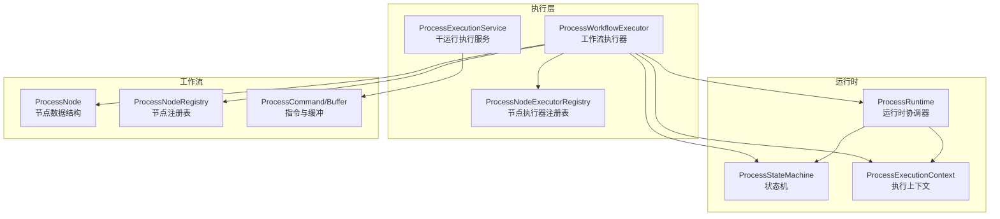
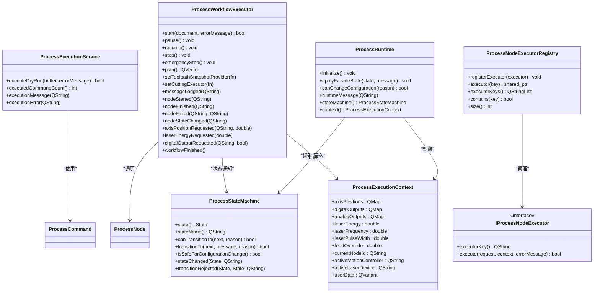
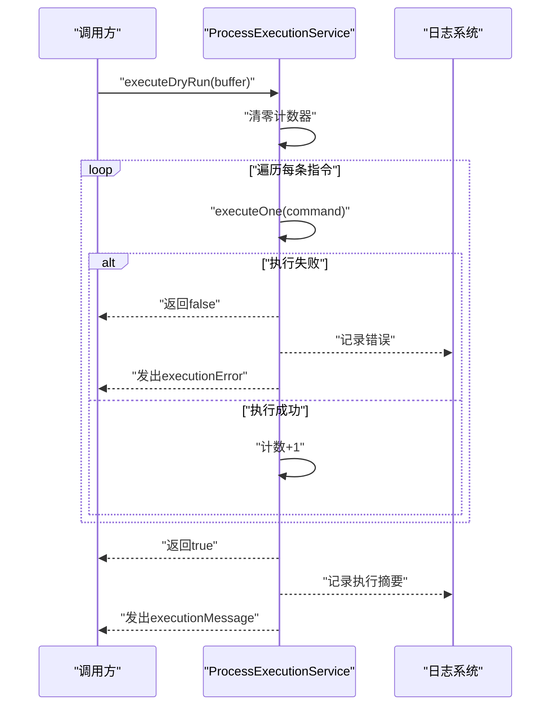
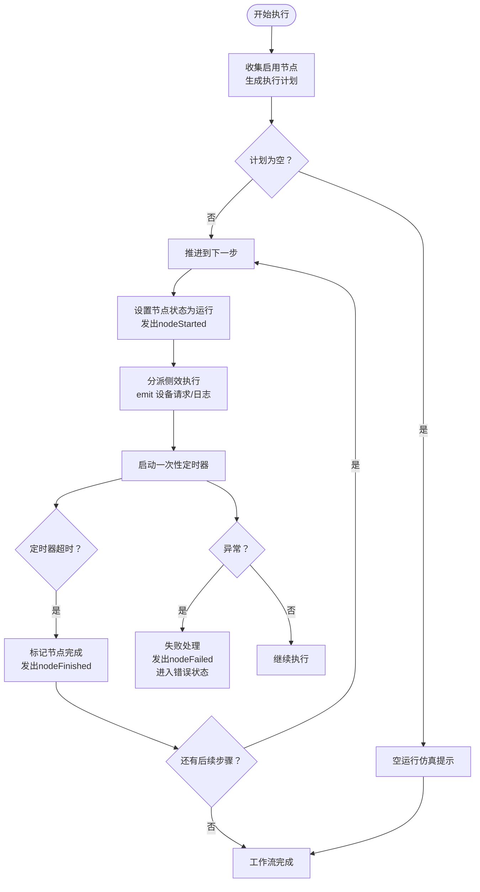
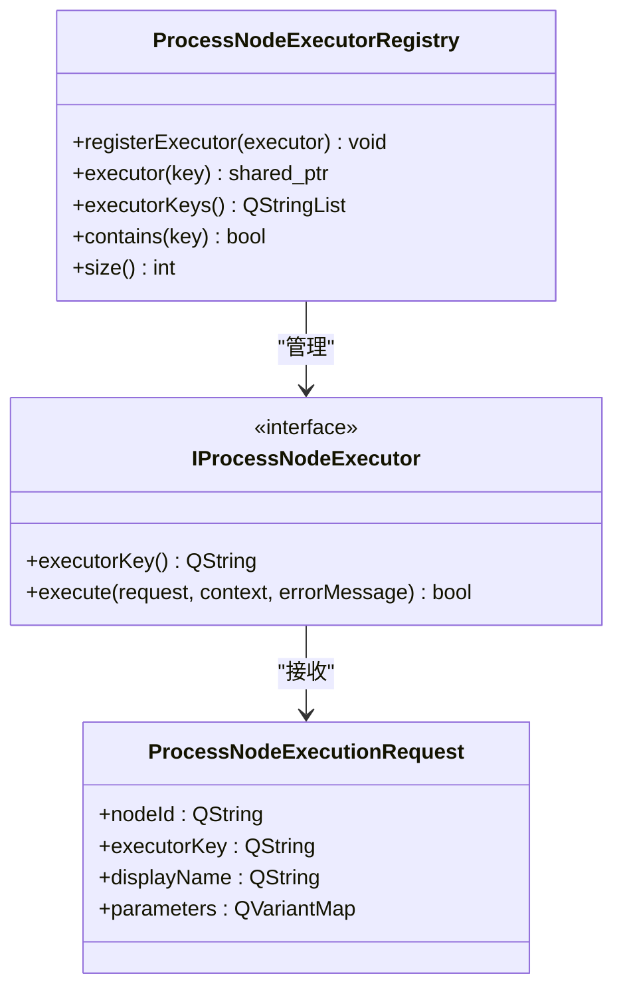
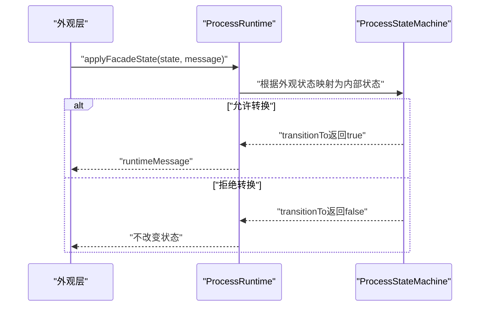
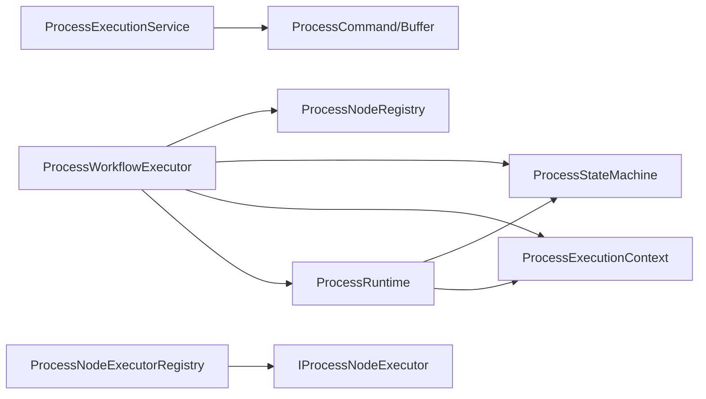

# 执行系统

<cite>
**本文引用的文件**
- [process_execution_service.h](file://src/modules/process/execution/process_execution_service.h)
- [process_execution_service.cpp](file://src/modules/process/execution/process_execution_service.cpp)
- [process_workflow_executor.h](file://src/modules/process/execution/process_workflow_executor.h)
- [process_workflow_executor.cpp](file://src/modules/process/execution/process_workflow_executor.cpp)
- [process_node_executor_registry.h](file://src/modules/process/execution/process_node_executor_registry.h)
- [process_node_executor_registry.cpp](file://src/modules/process/execution/process_node_executor_registry.cpp)
- [process_runtime.h](file://src/modules/process/runtime/process_runtime.h)
- [process_runtime.cpp](file://src/modules/process/runtime/process_runtime.cpp)
- [process_state_machine.h](file://src/modules/process/runtime/process_state_machine.h)
- [process_state_machine.cpp](file://src/modules/process/runtime/process_state_machine.cpp)
- [process_execution_context.h](file://src/modules/process/runtime/process_execution_context.h)
- [process_node.h](file://src/modules/process/workflow/process_node.h)
- [process_node_registry.h](file://src/modules/process/workflow/process_node_registry.h)
- [process_node_registry.cpp](file://src/modules/process/workflow/process_node_registry.cpp)
- [process_command.h](file://src/modules/process/instructions/process_command.h)
</cite>

## 目录
1. [简介](#简介)
2. [项目结构](#项目结构)
3. [核心组件](#核心组件)
4. [架构总览](#架构总览)
5. [详细组件分析](#详细组件分析)
6. [依赖关系分析](#依赖关系分析)
7. [性能考虑](#性能考虑)
8. [故障排查指南](#故障排查指南)
9. [结论](#结论)
10. [附录：扩展与开发指南](#附录扩展与开发指南)

## 简介
本文件面向Process模块的执行系统，系统性梳理并解释以下关键子系统与职责边界：
- 工作流调度与节点执行管理：由ProcessWorkflowExecutor负责将流程图中的节点转换为可执行步骤，并通过定时器驱动的顺序执行模型推进。
- 节点执行器注册表与动态加载：通过ProcessNodeExecutorRegistry集中管理不同节点类型的执行器接口，支持按元数据键位动态分派。
- 运行时环境与状态机：ProcessRuntime协调状态机与上下文，统一对外暴露状态变更与消息通道。
- 干运行执行服务：ProcessExecutionService提供与设备解耦的指令级干运行能力，便于离线验证与性能评估。

本文件同时提供可视化图示（类图、时序图、流程图）以帮助读者快速把握各组件之间的交互关系与数据流向。

## 项目结构
执行系统位于src/modules/process/execution与src/modules/process/runtime目录下，配合workflow层的节点定义与注册表，形成“工作流定义—执行引擎—运行时环境”的分层架构。

图表来源
- [process_workflow_executor.h:32-88](file://src/modules/process/execution/process_workflow_executor.h#L32-L88)
- [process_execution_service.h:14-31](file://src/modules/process/execution/process_execution_service.h#L14-L31)
- [process_node_executor_registry.h:40-51](file://src/modules/process/execution/process_node_executor_registry.h#L40-L51)
- [process_runtime.h:15-35](file://src/modules/process/runtime/process_runtime.h#L15-L35)
- [process_state_machine.h:11-48](file://src/modules/process/runtime/process_state_machine.h#L11-L48)
- [process_execution_context.h:12-25](file://src/modules/process/runtime/process_execution_context.h#L12-L25)
- [process_node.h:13-25](file://src/modules/process/workflow/process_node.h#L13-L25)
- [process_node_registry.h:21-46](file://src/modules/process/workflow/process_node_registry.h#L21-L46)
- [process_command.h:28-61](file://src/modules/process/instructions/process_command.h#L28-L61)

章节来源
- [process_workflow_executor.h:1-91](file://src/modules/process/execution/process_workflow_executor.h#L1-L91)
- [process_execution_service.h:1-34](file://src/modules/process/execution/process_execution_service.h#L1-L34)
- [process_node_executor_registry.h:1-53](file://src/modules/process/execution/process_node_executor_registry.h#L1-L53)
- [process_runtime.h:1-38](file://src/modules/process/runtime/process_runtime.h#L1-L38)
- [process_state_machine.h:1-50](file://src/modules/process/runtime/process_state_machine.h#L1-L50)
- [process_execution_context.h:1-27](file://src/modules/process/runtime/process_execution_context.h#L1-L27)
- [process_node.h:1-31](file://src/modules/process/workflow/process_node.h#L1-L31)
- [process_node_registry.h:1-49](file://src/modules/process/workflow/process_node_registry.h#L1-L49)
- [process_command.h:1-63](file://src/modules/process/instructions/process_command.h#L1-L63)

## 核心组件
- ProcessExecutionService：提供与设备无关的干运行执行能力，遍历指令缓冲逐条执行，输出统计与日志。
- ProcessWorkflowExecutor：将流程图节点展开为执行步骤，基于单次触发定时器推进，发出节点生命周期信号。
- ProcessNodeExecutorRegistry：抽象节点执行器接口，按键位注册与查询，支持动态扩展。
- ProcessRuntime：聚合状态机与执行上下文，桥接上层外观状态与内部状态机。
- ProcessStateMachine：受约束的状态机，提供合法转换检查与安全配置变更判定。
- ProcessExecutionContext：共享的运行时快照，承载轴位置、数字/模拟输出、激光参数、当前节点等。

章节来源
- [process_execution_service.h:14-31](file://src/modules/process/execution/process_execution_service.h#L14-L31)
- [process_execution_service.cpp:12-48](file://src/modules/process/execution/process_execution_service.cpp#L12-L48)
- [process_workflow_executor.h:32-88](file://src/modules/process/execution/process_workflow_executor.h#L32-L88)
- [process_workflow_executor.cpp:19-295](file://src/modules/process/execution/process_workflow_executor.cpp#L19-L295)
- [process_node_executor_registry.h:27-51](file://src/modules/process/execution/process_node_executor_registry.h#L27-L51)
- [process_node_executor_registry.cpp:7-41](file://src/modules/process/execution/process_node_executor_registry.cpp#L7-L41)
- [process_runtime.h:15-35](file://src/modules/process/runtime/process_runtime.h#L15-L35)
- [process_runtime.cpp:7-44](file://src/modules/process/runtime/process_runtime.cpp#L7-L44)
- [process_state_machine.h:11-48](file://src/modules/process/runtime/process_state_machine.h#L11-L48)
- [process_state_machine.cpp:35-118](file://src/modules/process/runtime/process_state_machine.cpp#L35-L118)
- [process_execution_context.h:12-25](file://src/modules/process/runtime/process_execution_context.h#L12-L25)

## 架构总览
执行系统采用“事件驱动 + 状态机 + 上下文共享”的设计，确保在不直接依赖具体设备的前提下，完成从流程图到设备动作的解耦调度。

图表来源
- [process_execution_service.h:14-31](file://src/modules/process/execution/process_execution_service.h#L14-L31)
- [process_execution_service.cpp:12-48](file://src/modules/process/execution/process_execution_service.cpp#L12-L48)
- [process_workflow_executor.h:32-88](file://src/modules/process/execution/process_workflow_executor.h#L32-L88)
- [process_workflow_executor.cpp:19-295](file://src/modules/process/execution/process_workflow_executor.cpp#L19-L295)
- [process_node_executor_registry.h:27-51](file://src/modules/process/execution/process_node_executor_registry.h#L27-L51)
- [process_runtime.h:15-35](file://src/modules/process/runtime/process_runtime.h#L15-L35)
- [process_state_machine.h:11-48](file://src/modules/process/runtime/process_state_machine.h#L11-L48)
- [process_execution_context.h:12-25](file://src/modules/process/runtime/process_execution_context.h#L12-L25)

## 详细组件分析

### ProcessExecutionService：干运行执行服务
- 职责
  - 对传入的控制器中立指令缓冲进行顺序执行，用于离线验证与性能评估。
  - 统计执行命令数量，输出成功/失败消息。
- 关键行为
  - 遍历指令缓冲，逐条调用执行函数；若任一指令失败则发出错误信号并终止。
  - 使用统一的日志接口记录执行摘要。
- 适用场景
  - 在无设备连接或仿真阶段，验证指令序列的正确性与耗时特性。

图表来源
- [process_execution_service.cpp:12-48](file://src/modules/process/execution/process_execution_service.cpp#L12-L48)

章节来源
- [process_execution_service.h:14-31](file://src/modules/process/execution/process_execution_service.h#L14-L31)
- [process_execution_service.cpp:12-48](file://src/modules/process/execution/process_execution_service.cpp#L12-L48)
- [process_command.h:28-61](file://src/modules/process/instructions/process_command.h#L28-L61)

### ProcessWorkflowExecutor：工作流执行引擎
- 职责
  - 将流程文档中的节点树展开为扁平的执行步骤序列，按深度优先收集启用节点。
  - 基于单次触发定时器推进执行，发出节点生命周期与设备请求信号。
  - 提供暂停/恢复/停止/急停控制，维护当前索引与状态。
- 关键机制
  - 步骤计划生成：遍历根节点，递归收集启用节点，记录类型、名称、参数与深度。
  - 并发控制：单步执行，使用一次性定时器作为节拍器，避免抢占式并发。
  - 错误恢复：捕获异常并转入错误状态，发出失败信号；支持急停中断。
  - 侧效执行分派：根据节点类型向外部发出轴位置、激光能量、数字输出等请求，并可调用切割执行器。
- 时间片与等待
  - 不同节点类型对应不同的持续时间，如等待、轴移动、切割（干/实跑）等，保证UI与设备响应节奏。

图表来源
- [process_workflow_executor.cpp:19-178](file://src/modules/process/execution/process_workflow_executor.cpp#L19-L178)

章节来源
- [process_workflow_executor.h:32-88](file://src/modules/process/execution/process_workflow_executor.h#L32-L88)
- [process_workflow_executor.cpp:19-295](file://src/modules/process/execution/process_workflow_executor.cpp#L19-L295)
- [process_node.h:13-25](file://src/modules/process/workflow/process_node.h#L13-L25)

### ProcessNodeExecutorRegistry：节点执行器注册表与动态加载
- 职责
  - 定义节点执行器接口，统一执行入口与上下文传递。
  - 提供注册、查询、枚举与存在性判断，支持按执行器键位动态分派。
- 动态加载方式
  - 外部模块创建符合接口的执行器实例，调用注册表的注册函数，随后可通过键位检索并调用。
- 日志与健壮性
  - 注册空指针或空键位会被记录警告并跳过，避免污染注册表。

图表来源
- [process_node_executor_registry.h:27-51](file://src/modules/process/execution/process_node_executor_registry.h#L27-L51)
- [process_node_executor_registry.cpp:7-41](file://src/modules/process/execution/process_node_executor_registry.cpp#L7-L41)

章节来源
- [process_node_executor_registry.h:27-51](file://src/modules/process/execution/process_node_executor_registry.h#L27-L51)
- [process_node_executor_registry.cpp:7-41](file://src/modules/process/execution/process_node_executor_registry.cpp#L7-L41)

### ProcessRuntime与ProcessStateMachine：运行时环境与状态机
- ProcessRuntime
  - 聚合状态机与执行上下文，提供初始化、外观状态应用与配置变更安全判定。
  - 将状态机的内部状态变化映射为运行时消息信号。
- ProcessStateMachine
  - 定义合法状态转换规则，拒绝非法转换并给出原因。
  - 提供安全配置变更判定，仅在特定状态下允许修改控制器或关键参数。

图表来源
- [process_runtime.cpp:22-33](file://src/modules/process/runtime/process_runtime.cpp#L22-L33)
- [process_state_machine.cpp:86-112](file://src/modules/process/runtime/process_state_machine.cpp#L86-L112)

章节来源
- [process_runtime.h:15-35](file://src/modules/process/runtime/process_runtime.h#L15-L35)
- [process_runtime.cpp:7-44](file://src/modules/process/runtime/process_runtime.cpp#L7-L44)
- [process_state_machine.h:11-48](file://src/modules/process/runtime/process_state_machine.h#L11-L48)
- [process_state_machine.cpp:35-118](file://src/modules/process/runtime/process_state_machine.cpp#L35-L118)

### ProcessExecutionContext：上下文管理与状态跟踪
- 作用
  - 作为跨模块共享的运行时快照，承载轴位置、数字/模拟输出、激光参数、进给倍率、当前节点ID、活动设备键位以及用户数据。
- 使用方式
  - 执行器在执行前后读取/更新上下文，确保状态一致性与可观测性。
- 性能监控
  - 可通过上下文中的用户数据字段扩展指标采集（例如计数器、时间戳），并与日志系统联动。

章节来源
- [process_execution_context.h:12-25](file://src/modules/process/runtime/process_execution_context.h#L12-L25)

## 依赖关系分析
- 执行层依赖
  - ProcessWorkflowExecutor依赖工作流节点定义与注册表，依赖状态机与上下文，依赖运行时协调器。
  - ProcessExecutionService依赖指令类型与缓冲，依赖日志系统。
- 运行时依赖
  - ProcessRuntime聚合状态机与上下文，向上提供统一的消息与状态查询接口。
- 注册表依赖
  - ProcessNodeExecutorRegistry管理IProcessNodeExecutor接口实例，供执行器按需分派。

图表来源
- [process_workflow_executor.h:32-88](file://src/modules/process/execution/process_workflow_executor.h#L32-L88)
- [process_execution_service.h:14-31](file://src/modules/process/execution/process_execution_service.h#L14-L31)
- [process_node_registry.h:21-46](file://src/modules/process/workflow/process_node_registry.h#L21-L46)
- [process_runtime.h:15-35](file://src/modules/process/runtime/process_runtime.h#L15-L35)
- [process_state_machine.h:11-48](file://src/modules/process/runtime/process_state_machine.h#L11-L48)
- [process_execution_context.h:12-25](file://src/modules/process/runtime/process_execution_context.h#L12-L25)
- [process_node_executor_registry.h:40-51](file://src/modules/process/execution/process_node_executor_registry.h#L40-L51)

章节来源
- [process_workflow_executor.h:32-88](file://src/modules/process/execution/process_workflow_executor.h#L32-L88)
- [process_execution_service.h:14-31](file://src/modules/process/execution/process_execution_service.h#L14-L31)
- [process_node_registry.h:21-46](file://src/modules/process/workflow/process_node_registry.h#L21-L46)
- [process_runtime.h:15-35](file://src/modules/process/runtime/process_runtime.h#L15-L35)
- [process_state_machine.h:11-48](file://src/modules/process/runtime/process_state_machine.h#L11-L48)
- [process_execution_context.h:12-25](file://src/modules/process/runtime/process_execution_context.h#L12-L25)
- [process_node_executor_registry.h:40-51](file://src/modules/process/execution/process_node_executor_registry.h#L40-L51)

## 性能考虑
- 执行粒度与时钟
  - 使用一次性定时器作为步进节拍，避免抢占式并发，降低锁竞争与上下文切换开销。
- 调度开销
  - 节点展开采用深度优先收集，复杂度与节点总数线性相关；建议在构建流程时保持合理的层级深度。
- I/O与设备交互
  - 通过信号驱动设备请求，避免阻塞执行线程；实际设备执行应异步化并及时回传结果。
- 日志与诊断
  - 使用统一日志接口记录执行摘要与错误信息，便于定位瓶颈与异常路径。

## 故障排查指南
- 常见问题与定位
  - 切割参数校验失败：检查进给速度与激光能量参数是否满足非负/正数要求。
  - 非干运行缺少刀路：确认工具路径快照可用性，否则会拒绝执行。
  - 状态转换被拒：查看状态机拒绝原因，确认当前状态是否允许目标转换。
  - 急停中断：执行器会立即停止当前步骤并进入紧急停止状态。
- 建议排查步骤
  - 查看执行器发出的节点失败信号与错误消息。
  - 检查状态机状态变化日志与拒绝原因。
  - 核对上下文中关键参数（如激光能量、进给倍率、活动设备键位）是否一致。
  - 对照节点注册表默认参数与节点参数覆盖情况。

章节来源
- [process_workflow_executor.cpp:180-193](file://src/modules/process/execution/process_workflow_executor.cpp#L180-L193)
- [process_state_machine.cpp:86-112](file://src/modules/process/runtime/process_state_machine.cpp#L86-L112)
- [process_execution_service.cpp:12-29](file://src/modules/process/execution/process_execution_service.cpp#L12-L29)

## 结论
执行系统通过清晰的分层与接口抽象，实现了从流程图到设备动作的可控调度。工作流执行器以事件驱动与一次性定时器为核心，结合状态机与上下文共享，提供了稳定且可扩展的执行框架。注册表机制为节点执行器的动态扩展提供了基础，而干运行执行服务则保障了离线验证与性能评估的能力。

## 附录：扩展与开发指南

### 自定义节点执行器实现
- 实现步骤
  - 实现IProcessNodeExecutor接口，定义唯一executorKey与execute方法。
  - 在模块初始化阶段调用ProcessNodeExecutorRegistry::registerExecutor注册。
  - 在节点注册表中为对应节点类型配置executorKey，使流程图节点与执行器绑定。
- 参数与上下文
  - execute方法接收执行请求与上下文，可在执行前后读取/更新上下文中的状态字段。
- 错误处理
  - 在执行失败时设置errorMessage并返回false，执行器会据此发出失败信号并进入错误状态。

章节来源
- [process_node_executor_registry.h:27-51](file://src/modules/process/execution/process_node_executor_registry.h#L27-L51)
- [process_node_executor_registry.cpp:7-41](file://src/modules/process/execution/process_node_executor_registry.cpp#L7-L41)
- [process_node_registry.cpp:151-201](file://src/modules/process/workflow/process_node_registry.cpp#L151-L201)

### 性能优化技巧
- 减少不必要的设备往返
  - 合理合并轴移动与IO操作，减少信号发射频率。
- 异步执行与回调
  - 将耗时的设备操作异步化，完成后通过信号回传结果，避免阻塞执行器主循环。
- 参数预校验
  - 在节点创建或编辑阶段提前校验关键参数，降低运行期失败概率。
- 日志采样
  - 对高频日志进行采样或分级，避免日志系统成为瓶颈。