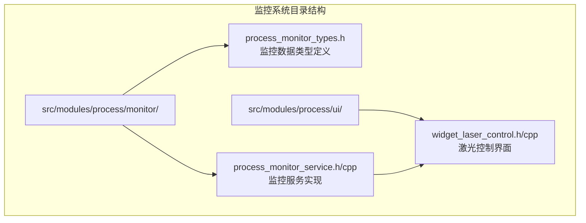
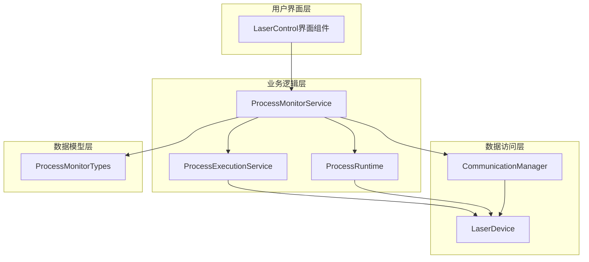
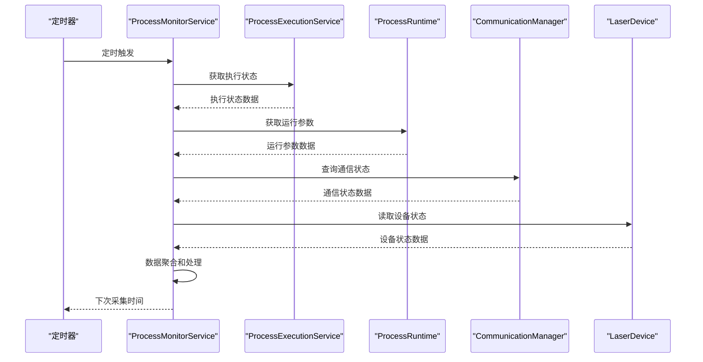
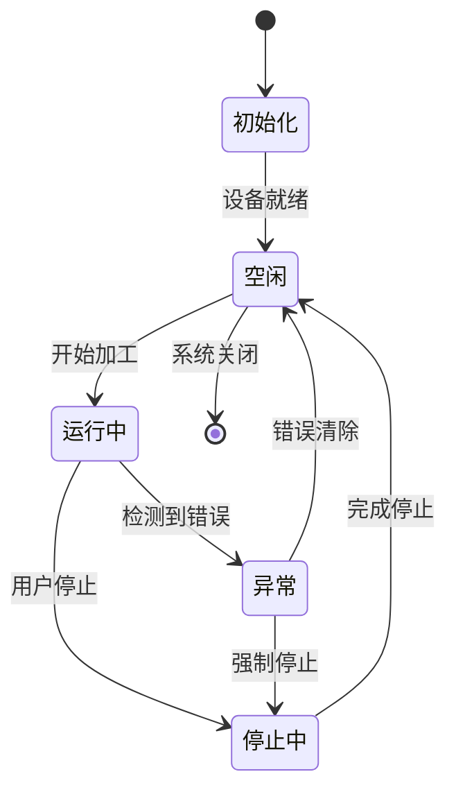
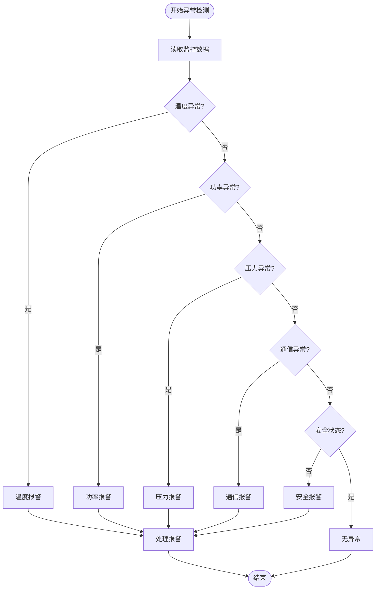
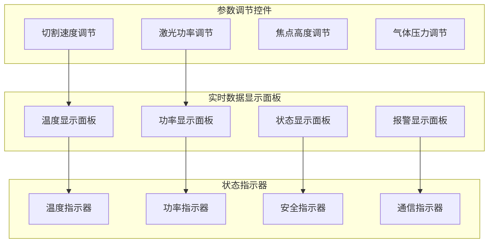
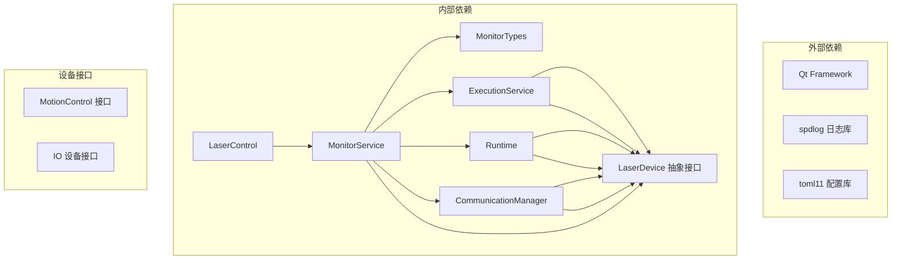

# 监控系统

<cite>
**本文档引用的文件**
- [process_monitor_service.h](file://src/modules/process/monitor/process_monitor_service.h)
- [process_monitor_service.cpp](file://src/modules/process/monitor/process_monitor_service.cpp)
- [process_monitor_types.h](file://src/modules/process/monitor/process_monitor_types.h)
- [widget_laser_control.h](file://src/modules/process/ui/widget_laser_control.h)
- [widget_laser_control.cpp](file://src/modules/process/ui/widget_laser_control.cpp)
- [process_execution_service.h](file://src/modules/process/execution/process_execution_service.h)
- [process_execution_service.cpp](file://src/modules/process/execution/process_execution_service.cpp)
- [process_runtime.h](file://src/modules/process/runtime/process_runtime.h)
- [process_runtime.cpp](file://src/modules/process/runtime/process_runtime.cpp)
- [communication_manager.h](file://src/modules/process/communication/communication_manager.h)
- [communication_manager.cpp](file://src/modules/process/communication/communication_manager.cpp)
- [LaserDevice.h](file://src/modules/process/device/Laser/LaserDevice.h)
- [LaserDevice.cpp](file://src/modules/process/device/Laser/LaserDevice.cpp)
</cite>

## 目录
1. [简介](#简介)
2. [项目结构](#项目结构)
3. [核心组件](#核心组件)
4. [架构概览](#架构概览)
5. [详细组件分析](#详细组件分析)
6. [依赖关系分析](#依赖关系分析)
7. [性能考虑](#性能考虑)
8. [故障排除指南](#故障排除指南)
9. [结论](#结论)

## 简介

Process模块的监控系统是激光加工控制系统中的关键组成部分，负责实时监控设备运行状态、采集工艺参数、检测异常情况并提供可视化界面。该系统采用分层架构设计，包含监控服务、数据模型、UI界面和通信层等多个组件，为激光切割和雕刻过程提供全面的状态监控和异常防护。

## 项目结构

监控系统位于Process模块的monitor目录下，主要包含以下核心文件：

**图表来源**
- [process_monitor_service.h](file://src/modules/process/monitor/process_monitor_service.h)
- [process_monitor_types.h](file://src/modules/process/monitor/process_monitor_types.h)
- [widget_laser_control.h](file://src/modules/process/ui/widget_laser_control.h)

**章节来源**
- [process_monitor_service.h](file://src/modules/process/monitor/process_monitor_service.h)
- [process_monitor_types.h](file://src/modules/process/monitor/process_monitor_types.h)
- [widget_laser_control.h](file://src/modules/process/ui/widget_laser_control.h)

## 核心组件

监控系统由三个核心组件构成：

### ProcessMonitorService（监控服务）
- 负责协调整个监控流程
- 管理监控数据的采集和处理
- 维护监控状态机
- 处理异常检测和报警

### ProcessMonitorTypes（监控数据类型）
- 定义设备状态数据结构
- 定义工艺参数数据结构  
- 定义报警信息数据结构
- 提供监控相关的枚举类型

### LaserControl（激光控制界面）
- 提供实时数据显示面板
- 支持参数调节功能
- 显示设备状态指示
- 集成报警提示功能

**章节来源**
- [process_monitor_service.h](file://src/modules/process/monitor/process_monitor_service.h)
- [process_monitor_types.h](file://src/modules/process/monitor/process_monitor_types.h)
- [widget_laser_control.h](file://src/modules/process/ui/widget_laser_control.h)

## 架构概览

监控系统采用分层架构设计，各层职责明确，耦合度低：

**图表来源**
- [process_monitor_service.h](file://src/modules/process/monitor/process_monitor_service.h)
- [process_monitor_service.cpp](file://src/modules/process/monitor/process_monitor_service.cpp)
- [process_execution_service.h](file://src/modules/process/execution/process_execution_service.h)
- [process_execution_service.cpp](file://src/modules/process/execution/process_execution_service.cpp)
- [process_runtime.h](file://src/modules/process/runtime/process_runtime.h)
- [process_runtime.cpp](file://src/modules/process/runtime/process_runtime.cpp)
- [communication_manager.h](file://src/modules/process/communication/communication_manager.h)
- [communication_manager.cpp](file://src/modules/process/communication/communication_manager.cpp)
- [LaserDevice.h](file://src/modules/process/device/Laser/LaserDevice.h)

## 详细组件分析

### ProcessMonitorService 监控架构设计

ProcessMonitorService是监控系统的核心控制器，负责协调各个监控组件的工作。

#### 数据采集机制

监控服务通过多种数据源进行数据采集：

**图表来源**
- [process_monitor_service.cpp](file://src/modules/process/monitor/process_monitor_service.cpp)
- [process_execution_service.cpp](file://src/modules/process/execution/process_execution_service.cpp)
- [process_runtime.cpp](file://src/modules/process/runtime/process_runtime.cpp)
- [communication_manager.cpp](file://src/modules/process/communication/communication_manager.cpp)
- [LaserDevice.cpp](file://src/modules/process/device/Laser/LaserDevice.cpp)

#### 状态跟踪机制

监控服务维护设备的多维状态跟踪：

**图表来源**
- [process_monitor_service.h](file://src/modules/process/monitor/process_monitor_service.h)
- [process_runtime.h](file://src/modules/process/runtime/process_runtime.h)

#### 异常检测机制

异常检测采用多层次的检测策略：

**图表来源**
- [process_monitor_service.cpp](file://src/modules/process/monitor/process_monitor_service.cpp)

**章节来源**
- [process_monitor_service.h](file://src/modules/process/monitor/process_monitor_service.h)
- [process_monitor_service.cpp](file://src/modules/process/monitor/process_monitor_service.cpp)

### ProcessMonitorTypes 监控数据结构

ProcessMonitorTypes定义了监控系统所需的所有数据结构和枚举类型。

#### 设备状态数据结构

设备状态结构体包含设备运行的关键状态信息：

| 字段名称 | 类型 | 描述 | 取值范围 |
|---------|------|------|----------|
| deviceStatus | enum | 设备整体状态 | 0-3 |
| temperature | float | 设备温度 | -50°C 到 +150°C |
| pressure | float | 设备压力 | 0 到 +1000 kPa |
| voltage | float | 供电电压 | 0 到 +500 V |
| current | float | 工作电流 | 0 到 +200 A |
| powerConsumption | float | 功率消耗 | 0 到 +50 kW |
| operatingHours | uint32 | 运行小时数 | 0 到 +∞ |

#### 工艺参数数据结构

工艺参数结构体描述激光加工过程的参数设置：

| 字段名称 | 类型 | 描述 | 取值范围 |
|---------|------|------|----------|
| cuttingSpeed | float | 切割速度 | 0.1 到 +500 mm/min |
| laserPower | float | 激光功率 | 0 到 +5000 W |
| focusHeight | float | 焦点高度 | -50 到 +50 mm |
| assistGasPressure | float | 辅助气体压力 | 0 到 +1000 kPa |
| dwellTime | float | 停留时间 | 0 到 +1000 ms |
| frequency | float | 调制频率 | 0 到 +100 kHz |
| dutyCycle | float | 占空比 | 0 到 +100 % |
| beamDiameter | float | 光束直径 | 0.1 到 +10 mm |

#### 报警信息数据结构

报警信息结构体用于记录和管理各种报警事件：

| 字段名称 | 类型 | 描述 | 取值范围 |
|---------|------|------|----------|
| alarmId | uint32 | 报警唯一标识符 | 0 到 +∞ |
| alarmType | enum | 报警类型 | 0-7 |
| severityLevel | enum | 严重程度 | 1-4 |
| timestamp | uint64 | 报警时间戳 | 0 到 +∞ |
| description | string | 报警描述 | 文本 |
| isAcknowledged | bool | 是否已确认 | true/false |
| relatedParam | string | 相关参数名 | 文本 |

#### 枚举类型定义

**设备状态枚举 (DeviceStatus)**
- DEVICE_STATUS_IDLE: 设备空闲
- DEVICE_STATUS_RUNNING: 设备运行中
- DEVICE_STATUS_ERROR: 设备错误
- DEVICE_STATUS_STOPPING: 设备停止中

**报警类型枚举 (AlarmType)**
- ALARM_TYPE_TEMPERATURE: 温度异常
- ALARM_TYPE_POWER: 功率异常
- ALARM_TYPE_PRESSURE: 压力异常
- ALARM_TYPE_COMMUNICATION: 通信异常
- ALARM_TYPE_SAFETY: 安全相关
- ALARM_TYPE_MOTION: 运动控制异常
- ALARM_TYPE_OTHER: 其他异常

**严重程度枚举 (SeverityLevel)**
- SEVERITY_LOW: 低级警告
- SEVERITY_MEDIUM: 中级警告
- SEVERITY_HIGH: 高级警告
- SEVERITY_CRITICAL: 紧急警告

**章节来源**
- [process_monitor_types.h](file://src/modules/process/monitor/process_monitor_types.h)

### LaserControl 界面组件实现原理

LaserControl是监控系统的用户界面组件，提供直观的监控和控制功能。

#### 实时数据显示

界面组件包含多个实时显示区域：

**图表来源**
- [widget_laser_control.h](file://src/modules/process/ui/widget_laser_control.h)
- [widget_laser_control.cpp](file://src/modules/process/ui/widget_laser_control.cpp)

#### 参数调节功能

参数调节采用滑块和数值输入相结合的方式：

| 控件类型 | 参数名称 | 调节范围 | 最小步进 | 默认值 |
|---------|----------|----------|----------|--------|
| 滑块控件 | 切割速度 | 0.1-500 mm/min | 0.1 | 100 |
| 数值输入 | 激光功率 | 0-5000 W | 1 | 1000 |
| 滑块控件 | 焦点高度 | -50-50 mm | 0.1 | 0 |
| 数值输入 | 气体压力 | 0-1000 kPa | 1 | 200 |

#### 状态指示功能

状态指示器使用颜色编码显示设备状态：

- **绿色**: 正常运行
- **黄色**: 警告状态
- **红色**: 错误状态
- **灰色**: 设备离线

**章节来源**
- [widget_laser_control.h](file://src/modules/process/ui/widget_laser_control.h)
- [widget_laser_control.cpp](file://src/modules/process/ui/widget_laser_control.cpp)

## 依赖关系分析

监控系统的依赖关系呈现清晰的层次结构：

**图表来源**
- [process_monitor_service.h](file://src/modules/process/monitor/process_monitor_service.h)
- [process_monitor_types.h](file://src/modules/process/monitor/process_monitor_types.h)
- [process_execution_service.h](file://src/modules/process/execution/process_execution_service.h)
- [process_runtime.h](file://src/modules/process/runtime/process_runtime.h)
- [communication_manager.h](file://src/modules/process/communication/communication_manager.h)
- [LaserDevice.h](file://src/modules/process/device/Laser/LaserDevice.h)

**章节来源**
- [process_monitor_service.h](file://src/modules/process/monitor/process_monitor_service.h)
- [process_monitor_types.h](file://src/modules/process/monitor/process_monitor_types.h)
- [process_execution_service.h](file://src/modules/process/execution/process_execution_service.h)
- [process_runtime.h](file://src/modules/process/runtime/process_runtime.h)
- [communication_manager.h](file://src/modules/process/communication/communication_manager.h)
- [LaserDevice.h](file://src/modules/process/device/Laser/LaserDevice.h)

## 性能考虑

监控系统的性能优化主要体现在以下几个方面：

### 数据采集频率优化
- **默认采样频率**: 100ms（10Hz）
- **关键参数高频**: 50ms（20Hz）
- **状态变化快速响应**: 10ms（100Hz）

### 内存使用优化
- **环形缓冲区**: 使用固定大小缓冲区存储历史数据
- **数据压缩**: 对重复数据进行压缩存储
- **异步处理**: 采用异步模式避免阻塞主线程

### 计算效率优化
- **增量计算**: 只计算变化的数据
- **缓存机制**: 缓存频繁访问的数据
- **批量处理**: 合并多个操作减少开销

## 故障排除指南

### 常见问题及解决方案

**监控数据不更新**
1. 检查设备连接状态
2. 验证通信通道是否正常
3. 确认监控服务是否在运行
4. 查看日志文件获取详细错误信息

**报警误报处理**
1. 检查传感器校准状态
2. 验证阈值设置是否合理
3. 确认环境条件是否影响测量
4. 更新设备固件版本

**界面显示异常**
1. 检查Qt版本兼容性
2. 验证显示器分辨率设置
3. 确认字体渲染配置
4. 重置界面布局设置

**章节来源**
- [process_monitor_service.cpp](file://src/modules/process/monitor/process_monitor_service.cpp)
- [widget_laser_control.cpp](file://src/modules/process/ui/widget_laser_control.cpp)

## 结论

Process模块的监控系统通过合理的架构设计和完善的组件实现，为激光加工过程提供了全面的监控保障。系统采用分层架构，具有良好的可扩展性和可维护性。监控服务能够实时采集设备状态数据，通过多层次的异常检测机制确保生产安全，而友好的用户界面则为操作人员提供了直观的操作体验。

未来可以在以下方面进一步改进：
- 增加机器学习算法用于预测性维护
- 扩展更多类型的设备支持
- 优化大数据量下的性能表现
- 增强远程监控和诊断能力