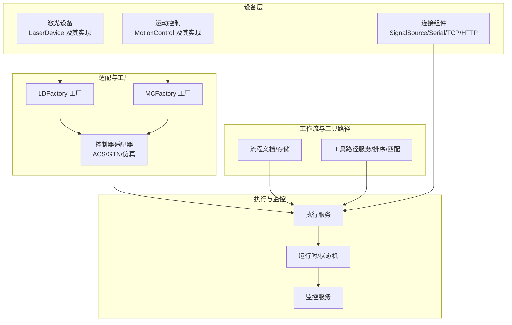
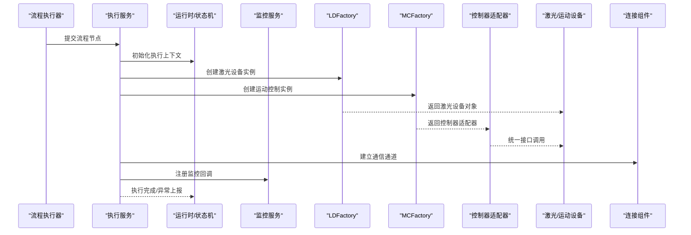
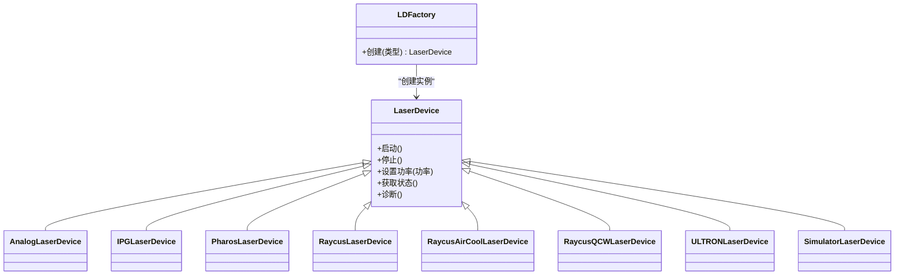
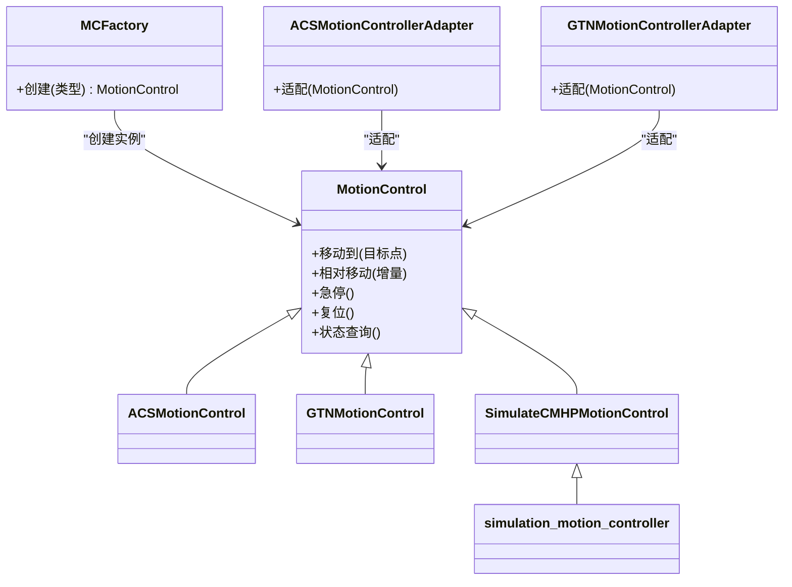
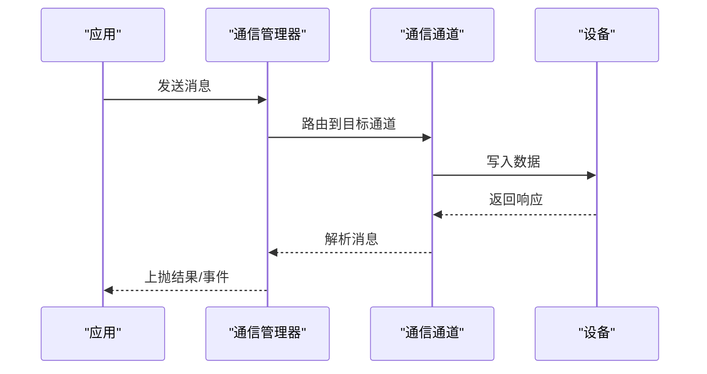
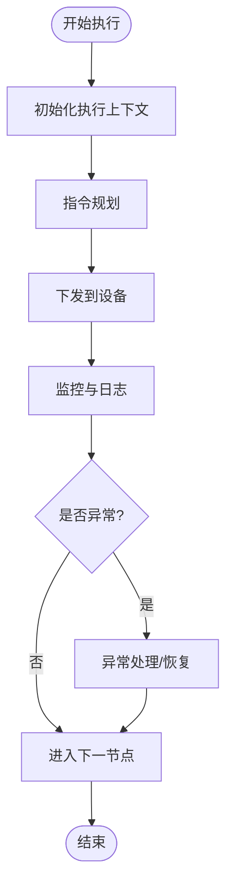
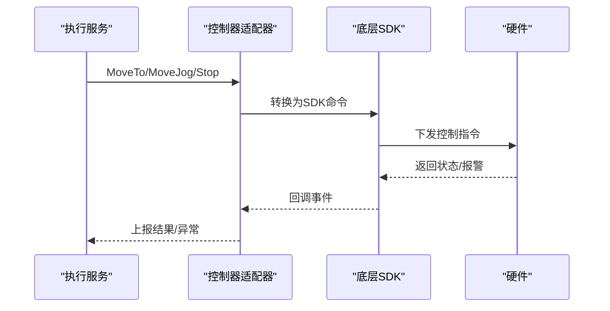
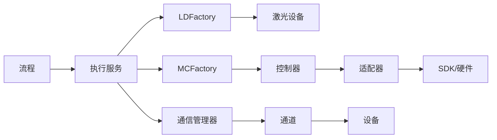

# 设备控制

<cite>
**本文引用的文件**
- [LaserDevice.h](file://src/modules/process/device/Laser/LaserDevice.h)
- [LaserDevice.cpp](file://src/modules/process/device/Laser/LaserDevice.cpp)
- [LDFactory.h](file://src/modules/process/device/Laser/LDFactory.h)
- [LDFactory.cpp](file://src/modules/process/device/Laser/LDFactory.cpp)
- [AnalogLaserDevice.h](file://src/modules/process/device/Laser/AnalogLaserDevice.h)
- [AnalogLaserDevice.cpp](file://src/modules/process/device/Laser/AnalogLaserDevice.cpp)
- [IPGLaserDevice.h](file://src/modules/process/device/Laser/IPGLaserDevice.h)
- [IPGLaserDevice.cpp](file://src/modules/process/device/Laser/IPGLaserDevice.cpp)
- [PharosLaserDevice.h](file://src/modules/process/device/Laser/PharosLaserDevice.h)
- [PharosLaserDevice.cpp](file://src/modules/process/device/Laser/PharosLaserDevice.cpp)
- [RaycusLaserDevice.h](file://src/modules/process/device/Laser/RaycusLaserDevice.h)
- [RaycusLaserDevice.cpp](file://src/modules/process/device/Laser/RaycusLaserDevice.cpp)
- [RaycusAirCoolLaserDevice.h](file://src/modules/process/device/Laser/RaycusAirCoolLaserDevice.h)
- [RaycusAirCoolLaserDevice.cpp](file://src/modules/process/device/Laser/RaycusAirCoolLaserDevice.cpp)
- [RaycusQCWLaserDevice.h](file://src/modules/process/device/Laser/RaycusQCWLaserDevice.h)
- [RaycusQCWLaserDevice.cpp](file://src/modules/process/device/Laser/RaycusQCWLaserDevice.cpp)
- [ULTRONLaserDevice.h](file://src/modules/process/device/Laser/ULTRONLaserDevice.h)
- [ULTRONLaserDevice.cpp](file://src/modules/process/device/Laser/ULTRONLaserDevice.cpp)
- [SimulatorLaserDevice.h](file://src/modules/process/device/Laser/SimulatorLaserDevice.h)
- [SimulatorLaserDevice.cpp](file://src/modules/process/device/Laser/SimulatorLaserDevice.cpp)
- [MotionControl.h](file://src/modules/process/device/MotionControl/MotionControl.h)
- [MotionControl.cpp](file://src/modules/process/device/MotionControl/MotionControl.cpp)
- [MCFactory.h](file://src/modules/process/device/MotionControl/MCFactory.h)
- [MCFactory.cpp](file://src/modules/process/device/MotionControl/MCFactory.cpp)
- [ACSMotionControl.h](file://src/modules/process/device/MotionControl/ACSMotionControl.h)
- [ACSMotionControl.cpp](file://src/modules/process/device/MotionControl/ACSMotionControl.cpp)
- [GTNMotionControl.h](file://src/modules/process/device/MotionControl/GTNMotionControl.h)
- [GTNMotionControl.cpp](file://src/modules/process/device/MotionControl/GTNMotionControl.cpp)
- [acs_motion_controller_adapter.h](file://src/modules/process/controllers/acs_motion_controller_adapter.h)
- [acs_motion_controller_adapter.cpp](file://src/modules/process/controllers/acs_motion_controller_adapter.cpp)
- [gtn_motion_controller_adapter.h](file://src/modules/process/controllers/gtn_motion_controller_adapter.h)
- [gtn_motion_controller_adapter.cpp](file://src/modules/process/controllers/gtn_motion_controller_adapter.cpp)
- [simulation_motion_controller.h](file://src/modules/process/controllers/simulation_motion_controller.h)
- [simulation_motion_controller.cpp](file://src/modules/process/controllers/simulation_motion_controller.cpp)
- [SimulateCMHPMotionControl.h](file://src/modules/process/device/MotionControl/SimulateCMHPMotionControl.h)
- [SimulateCMHPMotionControl.cpp](file://src/modules/process/device/MotionControl/SimulateCMHPMotionControl.cpp)
- [SignalSource.h](file://src/modules/process/device/Connect/SignalSource.h)
- [SignalSource.cpp](file://src/modules/process/device/Connect/SignalSource.cpp)
- [SerialPort.h](file://src/modules/process/device/Connect/SerialPort.h)
- [SerialPort.cpp](file://src/modules/process/device/Connect/SerialPort.cpp)
- [TCPClient.h](file://src/modules/process/device/Connect/TCPClient.h)
- [TCPClient.cpp](file://src/modules/process/device/Connect/TCPClient.cpp)
- [HTTPClient.h](file://src/modules/process/device/Connect/HTTPClient.h)
- [HTTPClient.cpp](file://src/modules/process/device/Connect/HTTPClient.cpp)
- [communication_channel_base.h](file://src/modules/process/communication/communication_channel_base.h)
- [communication_channel_base.cpp](file://src/modules/process/communication/communication_channel_base.cpp)
- [i_communication_channel.h](file://src/modules/process/communication/i_communication_channel.h)
- [communication_endpoint.h](file://src/modules/process/communication/communication_endpoint.h)
- [communication_endpoint.cpp](file://src/modules/process/communication/communication_endpoint.cpp)
- [communication_manager.h](file://src/modules/process/communication/communication_manager.h)
- [communication_manager.cpp](file://src/modules/process/communication/communication_manager.cpp)
- [communication_types.h](file://src/modules/process/communication/communication_types.h)
- [communication_types.cpp](file://src/modules/process/communication/communication_types.cpp)
- [process_execution_service.h](file://src/modules/process/execution/process_execution_service.h)
- [process_execution_service.cpp](file://src/modules/process/execution/process_execution_service.cpp)
- [process_runtime.h](file://src/modules/process/runtime/process_runtime.h)
- [process_runtime.cpp](file://src/modules/process/runtime/process_runtime.cpp)
- [process_state_machine.h](file://src/modules/process/runtime/process_state_machine.h)
- [process_state_machine.cpp](file://src/modules/process/runtime/process_state_machine.cpp)
- [process_monitor_service.h](file://src/modules/process/monitor/process_monitor_service.h)
- [process_monitor_service.cpp](file://src/modules/process/monitor/process_monitor_service.cpp)
- [process_workflow_executor.h](file://src/modules/process/workflow/process_workflow_executor.h)
- [process_workflow_executor.cpp](file://src/modules/process/workflow/process_workflow_executor.cpp)
- [process_node_executor_registry.h](file://src/modules/process/execution/process_node_executor_registry.h)
- [process_node_executor_registry.cpp](file://src/modules/process/execution/process_node_executor_registry.cpp)
- [process_node.h](file://src/modules/process/workflow/process_node.h)
- [process_node.cpp](file://src/modules/process/workflow/process_node.cpp)
- [process_node_registry.h](file://src/modules/process/workflow/process_node_registry.h)
- [process_node_registry.cpp](file://src/modules/process/workflow/process_node_registry.cpp)
- [process_toolpath_service.h](file://src/modules/process/toolpath/process_toolpath_service.h)
- [process_toolpath_service.cpp](file://src/modules/process/toolpath/process_toolpath_service.cpp)
- [process_toolpath_sorter.h](file://src/modules/process/toolpath/process_toolpath_sorter.h)
- [process_toolpath_sorter.cpp](file://src/modules/process/toolpath/process_toolpath_sorter.cpp)
- [process_tool_matcher.h](file://src/modules/process/toolpath/process_tool_matcher.h)
- [process_tool_matcher.cpp](file://src/modules/process/toolpath/process_tool_matcher.cpp)
- [process_instruction_planner.h](file://src/modules/process/instructions/process_instruction_planner.h)
- [process_instruction_planner.cpp](file://src/modules/process/instructions/process_instruction_planner.cpp)
- [i_controller_translator.h](file://src/modules/process/instructions/i_controller_translator.h)
- [acs_translator.h](file://src/modules/process/instructions/acs_translator.h)
- [acs_translator.cpp](file://src/modules/process/instructions/acs_translator.cpp)
- [gtn_translator.h](file://src/modules/process/instructions/gtn_translator.h)
- [gtn_translator.cpp](file://src/modules/process/instructions/gtn_translator.cpp)
- [pure_simulation_translator.h](file://src/modules/process/instructions/pure_simulation_translator.h)
- [pure_simulation_translator.cpp](file://src/modules/process/instructions/pure_simulation_translator.cpp)
- [process_settings.h](file://src/modules/process/settings/process_settings.h)
- [process_settings_schema.h](file://src/modules/process/settings/process_settings_schema.h)
- [DataType.h](file://src/modules/process/System/DataType.h)
- [MessageModule.h](file://src/modules/process/System/MessageModule.h)
- [MessageModule.cpp](file://src/modules/process/System/MessageModule.cpp)
- [LogModule.h](file://src/modules/process/System/LogModule.h)
- [LogModule.cpp](file://src/modules/process/System/LogModule.cpp)
- [LicenseModule.h](file://src/modules/process/System/LicenseModule.h)
- [LicenseModule.cpp](file://src/modules/process/System/LicenseModule.cpp)
- [Expression.h](file://src/modules/process/System/Expression.h)
- [Expression.cpp](file://src/modules/process/System/Expression.cpp)
- [process_module.h](file://src/modules/process/process_module.h)
- [process_module.cpp](file://src/modules/process/process_module.cpp)
- [process_flow_document.h](file://src/modules/process/workflow/process_flow_document.h)
- [process_flow_document.cpp](file://src/modules/process/workflow/process_flow_document.cpp)
- [process_flow_store.h](file://src/modules/process/workflow/process_flow_store.h)
- [process_flow_store.cpp](file://src/modules/process/workflow/process_flow_store.cpp)
- [commands_process.h](file://src/modules/process/commands/commands_process.h)
- [commands_process.cpp](file://src/modules/process/commands/commands_process.cpp)
</cite>

## 目录
1. [引言](#引言)
2. [项目结构](#项目结构)
3. [核心组件](#核心组件)
4. [架构总览](#架构总览)
5. [详细组件分析](#详细组件分析)
6. [依赖关系分析](#依赖关系分析)
7. [性能考虑](#性能考虑)
8. [故障排查指南](#故障排查指南)
9. [结论](#结论)
10. [附录](#附录)

## 引言
本文件面向Process模块的设备控制系统，系统化梳理激光设备与运动控制的抽象设计、工厂模式应用、连接组件实现、控制器适配器设计、仿真与调试能力，并给出实时性、错误处理与安全保护的实践建议，以及扩展开发指导。目标是帮助开发者快速理解并高效扩展新的激光设备类型与运动控制器。

## 项目结构
Process模块围绕“设备控制”主线，将激光设备、运动控制、通信通道、执行与监控、工作流与工具匹配等子系统解耦组合，形成可插拔的设备控制体系。关键目录与职责如下：
- device/Laser：激光设备抽象与多厂商实现（含仿真）
- device/MotionControl：运动控制抽象与具体驱动（含仿真）
- controllers：控制器适配器（ACS、GTN、仿真）
- device/Connect：信号源与网络/串口连接组件
- communication：通信管理与通道基类
- execution/monitor/runtime：执行、运行时状态机与监控
- workflow/toolpath：流程编排与工具路径服务
- instructions：指令规划与翻译器
- System：系统支撑（日志、消息、许可）

图示来源
- [LaserDevice.h:1-200](file://src/modules/process/device/Laser/LaserDevice.h#L1-L200)
- [MotionControl.h:1-200](file://src/modules/process/device/MotionControl/MotionControl.h#L1-L200)
- [LDFactory.h:1-200](file://src/modules/process/device/Laser/LDFactory.h#L1-L200)
- [MCFactory.h:1-200](file://src/modules/process/device/MotionControl/MCFactory.h#L1-L200)
- [acs_motion_controller_adapter.h:1-200](file://src/modules/process/controllers/acs_motion_controller_adapter.h#L1-L200)
- [gtn_motion_controller_adapter.h:1-200](file://src/modules/process/controllers/gtn_motion_controller_adapter.h#L1-L200)
- [process_execution_service.h:1-200](file://src/modules/process/execution/process_execution_service.h#L1-L200)
- [process_runtime.h:1-200](file://src/modules/process/runtime/process_runtime.h#L1-L200)
- [process_monitor_service.h:1-200](file://src/modules/process/monitor/process_monitor_service.h#L1-L200)
- [process_workflow_executor.h:1-200](file://src/modules/process/workflow/process_workflow_executor.h#L1-L200)
- [process_toolpath_service.h:1-200](file://src/modules/process/toolpath/process_toolpath_service.h#L1-L200)

章节来源
- [process_module.h:1-200](file://src/modules/process/process_module.h#L1-L200)
- [process_module.cpp:1-200](file://src/modules/process/process_module.cpp#L1-L200)

## 核心组件
- 激光设备抽象与工厂
  - LaserDevice定义激光设备的统一接口，LDFactory通过类型标识动态创建具体激光设备实例，支持模拟器与多品牌实现。
- 运动控制抽象与工厂
  - MotionControl定义运动控制统一接口，MCFactory按配置选择具体驱动（ACS、GTN或仿真），控制器适配器屏蔽底层差异。
- 连接组件
  - SignalSource提供信号源抽象；SerialPort、TCPClient、HTTPClient分别封装串口、TCP与HTTP通信通道，统一由通信管理器调度。
- 执行与监控
  - 执行服务负责节点级执行；运行时状态机管理生命周期；监控服务提供运行期观测与告警。
- 工作流与工具路径
  - 流程文档/存储承载作业定义；工具路径服务负责生成与排序；工具匹配器将工具与节点关联。

章节来源
- [LaserDevice.h:1-200](file://src/modules/process/device/Laser/LaserDevice.h#L1-L200)
- [LDFactory.h:1-200](file://src/modules/process/device/Laser/LDFactory.h#L1-L200)
- [MotionControl.h:1-200](file://src/modules/process/device/MotionControl/MotionControl.h#L1-L200)
- [MCFactory.h:1-200](file://src/modules/process/device/MotionControl/MCFactory.h#L1-L200)
- [SignalSource.h:1-200](file://src/modules/process/device/Connect/SignalSource.h#L1-L200)
- [SerialPort.h:1-200](file://src/modules/process/device/Connect/SerialPort.h#L1-L200)
- [TCPClient.h:1-200](file://src/modules/process/device/Connect/TCPClient.h#L1-L200)
- [HTTPClient.h:1-200](file://src/modules/process/device/Connect/HTTPClient.h#L1-L200)
- [process_execution_service.h:1-200](file://src/modules/process/execution/process_execution_service.h#L1-L200)
- [process_runtime.h:1-200](file://src/modules/process/runtime/process_runtime.h#L1-L200)
- [process_monitor_service.h:1-200](file://src/modules/process/monitor/process_monitor_service.h#L1-L200)
- [process_workflow_executor.h:1-200](file://src/modules/process/workflow/process_workflow_executor.h#L1-L200)
- [process_toolpath_service.h:1-200](file://src/modules/process/toolpath/process_toolpath_service.h#L1-L200)

## 架构总览
下图展示从流程到执行、再到控制器适配与连接组件的整体调用链路，体现“工厂+适配器+统一接口”的解耦设计。

图示来源
- [process_workflow_executor.h:1-200](file://src/modules/process/workflow/process_workflow_executor.h#L1-L200)
- [process_execution_service.h:1-200](file://src/modules/process/execution/process_execution_service.h#L1-L200)
- [LDFactory.h:1-200](file://src/modules/process/device/Laser/LDFactory.h#L1-L200)
- [MCFactory.h:1-200](file://src/modules/process/device/MotionControl/MCFactory.h#L1-L200)
- [acs_motion_controller_adapter.h:1-200](file://src/modules/process/controllers/acs_motion_controller_adapter.h#L1-L200)
- [gtn_motion_controller_adapter.h:1-200](file://src/modules/process/controllers/gtn_motion_controller_adapter.h#L1-L200)
- [communication_manager.h:1-200](file://src/modules/process/communication/communication_manager.h#L1-L200)

## 详细组件分析

### 激光设备抽象与LDFactory工厂模式
- 抽象设计
  - LaserDevice定义激光功率、启停、参数设置等统一接口，确保上层流程无需感知具体厂商差异。
  - 各品牌实现（如Analog、IPG、Pharos、Raycus系列、ULTRON）继承自LaserDevice，覆盖特定协议与特性。
  - SimulatorLaserDevice用于离线仿真与调试，便于在无硬件环境下验证流程。
- 工厂模式
  - LDFactory根据配置或枚举值返回对应激光设备实例，隐藏创建细节与依赖注入，支持扩展新设备类型时仅需注册映射。
- 关键接口与实现要点
  - 统一接口：功率设定、启停控制、状态查询、异常处理。
  - 厂商差异：协议封装、超时重试、校准流程、保护阈值。
  - 仿真策略：指令缓存、状态模拟、延迟注入、断言校验。

图示来源
- [LaserDevice.h:1-200](file://src/modules/process/device/Laser/LaserDevice.h#L1-L200)
- [AnalogLaserDevice.h:1-200](file://src/modules/process/device/Laser/AnalogLaserDevice.h#L1-L200)
- [IPGLaserDevice.h:1-200](file://src/modules/process/device/Laser/IPGLaserDevice.h#L1-L200)
- [PharosLaserDevice.h:1-200](file://src/modules/process/device/Laser/PharosLaserDevice.h#L1-L200)
- [RaycusLaserDevice.h:1-200](file://src/modules/process/device/Laser/RaycusLaserDevice.h#L1-L200)
- [RaycusAirCoolLaserDevice.h:1-200](file://src/modules/process/device/Laser/RaycusAirCoolLaserDevice.h#L1-L200)
- [RaycusQCWLaserDevice.h:1-200](file://src/modules/process/device/Laser/RaycusQCWLaserDevice.h#L1-L200)
- [ULTRONLaserDevice.h:1-200](file://src/modules/process/device/Laser/ULTRONLaserDevice.h#L1-L200)
- [SimulatorLaserDevice.h:1-200](file://src/modules/process/device/Laser/SimulatorLaserDevice.h#L1-L200)
- [LDFactory.h:1-200](file://src/modules/process/device/Laser/LDFactory.h#L1-L200)

章节来源
- [LaserDevice.cpp:1-200](file://src/modules/process/device/Laser/LaserDevice.cpp#L1-L200)
- [LDFactory.cpp:1-200](file://src/modules/process/device/Laser/LDFactory.cpp#L1-L200)
- [AnalogLaserDevice.cpp:1-200](file://src/modules/process/device/Laser/AnalogLaserDevice.cpp#L1-L200)
- [IPGLaserDevice.cpp:1-200](file://src/modules/process/device/Laser/IPGLaserDevice.cpp#L1-L200)
- [PharosLaserDevice.cpp:1-200](file://src/modules/process/device/Laser/PharosLaserDevice.cpp#L1-L200)
- [RaycusLaserDevice.cpp:1-200](file://src/modules/process/device/Laser/RaycusLaserDevice.cpp#L1-L200)
- [RaycusAirCoolLaserDevice.cpp:1-200](file://src/modules/process/device/Laser/RaycusAirCoolLaserDevice.cpp#L1-L200)
- [RaycusQCWLaserDevice.cpp:1-200](file://src/modules/process/device/Laser/RaycusQCWLaserDevice.cpp#L1-L200)
- [ULTRONLaserDevice.cpp:1-200](file://src/modules/process/device/Laser/ULTRONLaserDevice.cpp#L1-L200)
- [SimulatorLaserDevice.cpp:1-200](file://src/modules/process/device/Laser/SimulatorLaserDevice.cpp#L1-L200)

### 运动控制架构与MCFactory工厂
- 抽象设计
  - MotionControl定义运动控制统一接口，屏蔽轴数、坐标系、加减速策略等差异。
  - 具体实现包括ACSMotionControl与GTNMotionControl，分别对接不同厂商驱动库。
  - SimulateCMHPMotionControl与simulation_motion_controller提供仿真与调试能力。
- 工厂模式
  - MCFactory依据配置选择具体驱动，支持在运行时切换控制器类型，便于测试与迁移。
- 控制器适配器
  - ACSMotionControlAdapter与GTNMotionControllerAdapter将MotionControl接口映射到底层SDK命令，统一错误码与事件回调。

图示来源
- [MotionControl.h:1-200](file://src/modules/process/device/MotionControl/MotionControl.h#L1-L200)
- [ACSMotionControl.h:1-200](file://src/modules/process/device/MotionControl/ACSMotionControl.h#L1-L200)
- [GTNMotionControl.h:1-200](file://src/modules/process/device/MotionControl/GTNMotionControl.h#L1-L200)
- [SimulateCMHPMotionControl.h:1-200](file://src/modules/process/device/MotionControl/SimulateCMHPMotionControl.h#L1-L200)
- [simulation_motion_controller.h:1-200](file://src/modules/process/controllers/simulation_motion_controller.h#L1-L200)
- [MCFactory.h:1-200](file://src/modules/process/device/MotionControl/MCFactory.h#L1-L200)
- [acs_motion_controller_adapter.h:1-200](file://src/modules/process/controllers/acs_motion_controller_adapter.h#L1-L200)
- [gtn_motion_controller_adapter.h:1-200](file://src/modules/process/controllers/gtn_motion_controller_adapter.h#L1-L200)

章节来源
- [MotionControl.cpp:1-200](file://src/modules/process/device/MotionControl/MotionControl.cpp#L1-L200)
- [MCFactory.cpp:1-200](file://src/modules/process/device/MotionControl/MCFactory.cpp#L1-L200)
- [ACSMotionControl.cpp:1-200](file://src/modules/process/device/MotionControl/ACSMotionControl.cpp#L1-L200)
- [GTNMotionControl.cpp:1-200](file://src/modules/process/device/MotionControl/GTNMotionControl.cpp#L1-L200)
- [SimulateCMHPMotionControl.cpp:1-200](file://src/modules/process/device/MotionControl/SimulateCMHPMotionControl.cpp#L1-L200)
- [simulation_motion_controller.cpp:1-200](file://src/modules/process/controllers/simulation_motion_controller.cpp#L1-L200)
- [acs_motion_controller_adapter.cpp:1-200](file://src/modules/process/controllers/acs_motion_controller_adapter.cpp#L1-L200)
- [gtn_motion_controller_adapter.cpp:1-200](file://src/modules/process/controllers/gtn_motion_controller_adapter.cpp#L1-L200)

### 连接组件：SignalSource、SerialPort、TCPClient、HTTPClient
- SignalSource
  - 提供信号源抽象，统一事件/数据发布订阅模型，便于与激光/运动设备交互。
- SerialPort
  - 封装串口读写、波特率、数据位、停止位等参数配置，支持异步收发与超时控制。
- TCPClient
  - 提供TCP连接建立、发送接收、断线重连与心跳保活机制。
- HTTPClient
  - 提供HTTP请求封装，支持GET/POST、头部设置、响应解析与错误码处理。
- 通信管理器
  - communication_manager负责通道生命周期管理、消息路由与日志记录。

图示来源
- [communication_manager.h:1-200](file://src/modules/process/communication/communication_manager.h#L1-L200)
- [communication_channel_base.h:1-200](file://src/modules/process/communication/communication_channel_base.h#L1-L200)
- [i_communication_channel.h:1-200](file://src/modules/process/communication/i_communication_channel.h#L1-L200)
- [communication_endpoint.h:1-200](file://src/modules/process/communication/communication_endpoint.h#L1-L200)
- [SignalSource.h:1-200](file://src/modules/process/device/Connect/SignalSource.h#L1-L200)
- [SerialPort.h:1-200](file://src/modules/process/device/Connect/SerialPort.h#L1-L200)
- [TCPClient.h:1-200](file://src/modules/process/device/Connect/TCPClient.h#L1-L200)
- [HTTPClient.h:1-200](file://src/modules/process/device/Connect/HTTPClient.h#L1-L200)

章节来源
- [SignalSource.cpp:1-200](file://src/modules/process/device/Connect/SignalSource.cpp#L1-L200)
- [SerialPort.cpp:1-200](file://src/modules/process/device/Connect/SerialPort.cpp#L1-L200)
- [TCPClient.cpp:1-200](file://src/modules/process/device/Connect/TCPClient.cpp#L1-L200)
- [HTTPClient.cpp:1-200](file://src/modules/process/device/Connect/HTTPClient.cpp#L1-L200)
- [communication_channel_base.cpp:1-200](file://src/modules/process/communication/communication_channel_base.cpp#L1-L200)
- [communication_endpoint.cpp:1-200](file://src/modules/process/communication/communication_endpoint.cpp#L1-L200)
- [communication_manager.cpp:1-200](file://src/modules/process/communication/communication_manager.cpp#L1-L200)
- [communication_types.h:1-200](file://src/modules/process/communication/communication_types.h#L1-L200)
- [communication_types.cpp:1-200](file://src/modules/process/communication/communication_types.cpp#L1-L200)

### 执行、运行时与监控
- 执行服务
  - process_execution_service负责节点级执行，协调指令规划、设备交互与状态回传。
- 运行时与状态机
  - process_runtime维护执行上下文；process_state_machine驱动状态流转与异常恢复。
- 监控服务
  - process_monitor_service采集运行指标、异常事件与日志，提供可视化与告警。
- 工作流与工具路径
  - process_workflow_executor编排流程；process_toolpath_service生成与排序工具路径；process_tool_matcher进行工具与节点匹配。

图示来源
- [process_execution_service.h:1-200](file://src/modules/process/execution/process_execution_service.h#L1-L200)
- [process_runtime.h:1-200](file://src/modules/process/runtime/process_runtime.h#L1-L200)
- [process_state_machine.h:1-200](file://src/modules/process/runtime/process_state_machine.h#L1-L200)
- [process_monitor_service.h:1-200](file://src/modules/process/monitor/process_monitor_service.h#L1-L200)
- [process_workflow_executor.h:1-200](file://src/modules/process/workflow/process_workflow_executor.h#L1-L200)
- [process_toolpath_service.h:1-200](file://src/modules/process/toolpath/process_toolpath_service.h#L1-L200)
- [process_tool_matcher.h:1-200](file://src/modules/process/toolpath/process_tool_matcher.h#L1-L200)

章节来源
- [process_execution_service.cpp:1-200](file://src/modules/process/execution/process_execution_service.cpp#L1-L200)
- [process_runtime.cpp:1-200](file://src/modules/process/runtime/process_runtime.cpp#L1-L200)
- [process_state_machine.cpp:1-200](file://src/modules/process/runtime/process_state_machine.cpp#L1-L200)
- [process_monitor_service.cpp:1-200](file://src/modules/process/monitor/process_monitor_service.cpp#L1-L200)
- [process_workflow_executor.cpp:1-200](file://src/modules/process/workflow/process_workflow_executor.cpp#L1-L200)
- [process_toolpath_service.cpp:1-200](file://src/modules/process/toolpath/process_toolpath_service.cpp#L1-L200)
- [process_tool_matcher.cpp:1-200](file://src/modules/process/toolpath/process_tool_matcher.cpp#L1-L200)

### 控制器适配器设计（ACS与GTN）
- 适配器职责
  - 将统一的MotionControl接口映射到ACS或GTN底层SDK命令，屏蔽厂商差异。
  - 提供错误码转换、事件回调桥接、参数校验与超时处理。
- 开发要点
  - 映射表设计：统一命令字与SDK命令的对应关系。
  - 线程模型：避免阻塞UI线程，采用异步回调与队列。
  - 安全约束：限速、限位、急停优先级高于业务指令。

图示来源
- [acs_motion_controller_adapter.h:1-200](file://src/modules/process/controllers/acs_motion_controller_adapter.h#L1-L200)
- [acs_motion_controller_adapter.cpp:1-200](file://src/modules/process/controllers/acs_motion_controller_adapter.cpp#L1-L200)
- [gtn_motion_controller_adapter.h:1-200](file://src/modules/process/controllers/gtn_motion_controller_adapter.h#L1-L200)
- [gtn_motion_controller_adapter.cpp:1-200](file://src/modules/process/controllers/gtn_motion_controller_adapter.cpp#L1-L200)

章节来源
- [acs_motion_controller_adapter.cpp:1-200](file://src/modules/process/controllers/acs_motion_controller_adapter.cpp#L1-L200)
- [gtn_motion_controller_adapter.cpp:1-200](file://src/modules/process/controllers/gtn_motion_controller_adapter.cpp#L1-L200)

### 仿真控制器与调试
- 仿真激光器
  - SimulatorLaserDevice缓存指令、模拟状态变化、注入延迟与断言，便于离线验证。
- 仿真运动控制
  - simulation_motion_controller与SimulateCMHPMotionControl提供轨迹模拟、碰撞检测与边界约束。
- 调试策略
  - 通过日志模块与监控服务输出详细事件；结合断点与单元测试覆盖关键分支。

章节来源
- [SimulatorLaserDevice.h:1-200](file://src/modules/process/device/Laser/SimulatorLaserDevice.h#L1-L200)
- [SimulatorLaserDevice.cpp:1-200](file://src/modules/process/device/Laser/SimulatorLaserDevice.cpp#L1-L200)
- [simulation_motion_controller.h:1-200](file://src/modules/process/controllers/simulation_motion_controller.h#L1-L200)
- [simulation_motion_controller.cpp:1-200](file://src/modules/process/controllers/simulation_motion_controller.cpp#L1-L200)
- [SimulateCMHPMotionControl.h:1-200](file://src/modules/process/device/MotionControl/SimulateCMHPMotionControl.h#L1-L200)
- [SimulateCMHPMotionControl.cpp:1-200](file://src/modules/process/device/MotionControl/SimulateCMHPMotionControl.cpp#L1-L200)
- [LogModule.h:1-200](file://src/modules/process/System/LogModule.h#L1-L200)
- [LogModule.cpp:1-200](file://src/modules/process/System/LogModule.cpp#L1-L200)

## 依赖关系分析
- 松耦合设计
  - 设备层通过抽象接口与工厂解耦；控制器适配器隔离SDK差异；通信通道独立于设备。
- 关键依赖链
  - 流程 -> 执行服务 -> 工厂 -> 设备/控制器 -> 适配器 -> SDK/硬件
  - 通信管理器 -> 通道基类 -> 具体通道 -> 设备
- 风险点
  - 适配器与SDK版本不兼容；通道超时未正确处理导致阻塞；仿真与真实设备状态不一致。

图示来源
- [process_workflow_executor.h:1-200](file://src/modules/process/workflow/process_workflow_executor.h#L1-L200)
- [process_execution_service.h:1-200](file://src/modules/process/execution/process_execution_service.h#L1-L200)
- [LDFactory.h:1-200](file://src/modules/process/device/Laser/LDFactory.h#L1-L200)
- [MCFactory.h:1-200](file://src/modules/process/device/MotionControl/MCFactory.h#L1-L200)
- [acs_motion_controller_adapter.h:1-200](file://src/modules/process/controllers/acs_motion_controller_adapter.h#L1-L200)
- [gtn_motion_controller_adapter.h:1-200](file://src/modules/process/controllers/gtn_motion_controller_adapter.h#L1-L200)
- [communication_manager.h:1-200](file://src/modules/process/communication/communication_manager.h#L1-L200)

章节来源
- [process_node.h:1-200](file://src/modules/process/workflow/process_node.h#L1-L200)
- [process_node.cpp:1-200](file://src/modules/process/workflow/process_node.cpp#L1-L200)
- [process_node_registry.h:1-200](file://src/modules/process/workflow/process_node_registry.h#L1-L200)
- [process_node_registry.cpp:1-200](file://src/modules/process/workflow/process_node_registry.cpp#L1-L200)
- [process_node_executor_registry.h:1-200](file://src/modules/process/execution/process_node_executor_registry.h#L1-L200)
- [process_node_executor_registry.cpp:1-200](file://src/modules/process/execution/process_node_executor_registry.cpp#L1-L200)

## 性能考虑
- 实时性
  - 控制指令应尽量短路径直达适配器与SDK，避免跨线程同步开销；对高频事件采用批处理与去抖。
- 资源管理
  - 串口/TCP/HTTP通道应复用连接池，设置合理超时与重试上限；日志与监控避免阻塞主执行线程。
- 并发模型
  - 采用事件驱动与异步回调，保持UI与执行线程的响应性；对共享资源使用轻量锁或无锁队列。

## 故障排查指南
- 常见问题
  - 设备无响应：检查通信通道状态、端口占用与权限；确认工厂创建类型与配置一致。
  - 控制器异常：查看适配器错误码映射与SDK回调日志；核对急停与报警状态。
  - 仿真不一致：比对仿真设备与真实设备的状态机与参数；确保断言与延迟设置合理。
- 排查步骤
  - 启用详细日志与监控；分层定位（通道->适配器->设备）；使用最小化流程复现问题。
- 安全保护
  - 在适配器中实现限速、限位与急停优先级；在运行时状态机中加入异常恢复策略。

章节来源
- [MessageModule.h:1-200](file://src/modules/process/System/MessageModule.h#L1-L200)
- [MessageModule.cpp:1-200](file://src/modules/process/System/MessageModule.cpp#L1-L200)
- [LogModule.h:1-200](file://src/modules/process/System/LogModule.h#L1-L200)
- [LogModule.cpp:1-200](file://src/modules/process/System/LogModule.cpp#L1-L200)
- [process_state_machine.h:1-200](file://src/modules/process/runtime/process_state_machine.h#L1-L200)
- [process_state_machine.cpp:1-200](file://src/modules/process/runtime/process_state_machine.cpp#L1-L200)

## 结论
通过抽象接口、工厂模式与适配器设计，Process模块实现了激光设备与运动控制的高内聚低耦合架构。LDFactory与MCFactory提供了灵活的动态创建机制；控制器适配器屏蔽了SDK差异；仿真与调试能力保障了开发效率与质量。配合完善的执行、监控与工作流体系，系统具备良好的可扩展性与稳定性。

## 附录
- 扩展开发指导
  - 新激光设备类型
    - 继承LaserDevice并实现统一接口；在LDFactory注册类型映射；编写单元测试与集成测试。
  - 新运动控制器
    - 实现MotionControl接口并在MCFactory注册；开发对应适配器；完善错误码与事件处理。
  - 新连接通道
    - 实现i_communication_channel接口；在通信管理器中注册；补充超时与重试逻辑。
  - 指令翻译器
    - 实现i_controller_translator接口；在指令规划器中注册；确保与控制器适配器的一致性。
- 最佳实践
  - 保持接口稳定与向后兼容；严格区分抽象层与实现层；为每个关键路径添加可观测性与告警。

章节来源
- [process_settings.h:1-200](file://src/modules/process/settings/process_settings.h#L1-L200)
- [process_settings_schema.h:1-200](file://src/modules/process/settings/process_settings_schema.h#L1-L200)
- [DataType.h:1-200](file://src/modules/process/System/DataType.h#L1-L200)
- [Expression.h:1-200](file://src/modules/process/System/Expression.h#L1-L200)
- [Expression.cpp:1-200](file://src/modules/process/System/Expression.cpp#L1-L200)
- [LicenseModule.h:1-200](file://src/modules/process/System/LicenseModule.h#L1-L200)
- [LicenseModule.cpp:1-200](file://src/modules/process/System/LicenseModule.cpp#L1-L200)
- [process_instruction_planner.h:1-200](file://src/modules/process/instructions/process_instruction_planner.h#L1-L200)
- [process_instruction_planner.cpp:1-200](file://src/modules/process/instructions/process_instruction_planner.cpp#L1-L200)
- [i_controller_translator.h:1-200](file://src/modules/process/instructions/i_controller_translator.h#L1-L200)
- [acs_translator.h:1-200](file://src/modules/process/instructions/acs_translator.h#L1-L200)
- [acs_translator.cpp:1-200](file://src/modules/process/instructions/acs_translator.cpp#L1-L200)
- [gtn_translator.h:1-200](file://src/modules/process/instructions/gtn_translator.h#L1-L200)
- [gtn_translator.cpp:1-200](file://src/modules/process/instructions/gtn_translator.cpp#L1-L200)
- [pure_simulation_translator.h:1-200](file://src/modules/process/instructions/pure_simulation_translator.h#L1-L200)
- [pure_simulation_translator.cpp:1-200](file://src/modules/process/instructions/pure_simulation_translator.cpp#L1-L200)