# 通信系统

<cite>
**本文引用的文件**
- [communication_manager.h](file://src/modules/process/communication/communication_manager.h)
- [communication_manager.cpp](file://src/modules/process/communication/communication_manager.cpp)
- [communication_channel_base.h](file://src/modules/process/communication/communication_channel_base.h)
- [communication_channel_base.cpp](file://src/modules/process/communication/communication_channel_base.cpp)
- [communication_device_base.h](file://src/modules/process/communication/communication_device_base.h)
- [communication_device_base.cpp](file://src/modules/process/communication/communication_device_base.cpp)
- [i_communication_channel.h](file://src/modules/process/communication/i_communication_channel.h)
- [communication_types.h](file://src/modules/process/communication/communication_types.h)
- [communication_endpoint.h](file://src/modules/process/communication/communication_endpoint.h)
- [communication_message.h](file://src/modules/process/communication/communication_message.h)
- [communication_log_model.h](file://src/modules/process/communication/communication_log_model.h)
- [serial_channel.h](file://src/modules/process/communication/protocols/serial_channel.h)
- [serial_channel.cpp](file://src/modules/process/communication/protocols/serial_channel.cpp)
- [tcp_channel.h](file://src/modules/process/communication/protocols/tcp_channel.h)
- [tcp_channel.cpp](file://src/modules/process/communication/protocols/tcp_channel.cpp)
- [http_channel.h](file://src/modules/process/communication/protocols/http_channel.h)
- [http_channel.cpp](file://src/modules/process/communication/protocols/http_channel.cpp)
</cite>

## 目录
1. [简介](#简介)
2. [项目结构](#项目结构)
3. [核心组件](#核心组件)
4. [架构总览](#架构总览)
5. [详细组件分析](#详细组件分析)
6. [依赖关系分析](#依赖关系分析)
7. [性能考虑](#性能考虑)
8. [故障排查指南](#故障排查指南)
9. [结论](#结论)
10. [附录：扩展开发指南](#附录扩展开发指南)

## 简介
本文件面向Process模块的通信系统，围绕CommunicationManager的通信架构进行深入技术说明，涵盖通道管理、设备连接与消息路由机制；解释CommunicationChannelBase与CommunicationDeviceBase的抽象设计及统一接口；阐述SerialChannel（串口）、TCPChannel（网络）与HTTPChannel（Web）三种协议的实现特点与适用场景；说明CommunicationEndpoint端点管理机制（地址解析、连接建立与断开处理）；解释CommunicationMessage消息格式设计（数据封装、序列化与协议转换）；介绍通信日志系统（消息记录、调试分析与性能监控）；最后提供扩展开发指导（新协议集成与设备适配器开发技巧）。

## 项目结构
通信子系统位于Process模块下，采用“接口+基类+具体协议实现”的分层设计，并通过CommunicationManager集中编排与日志输出。关键目录与文件如下：
- 接口与基础抽象：i_communication_channel.h、communication_channel_base.h/.cpp、communication_device_base.h/.cpp
- 类型与端点：communication_types.h、communication_endpoint.h、communication_message.h
- 日志模型：communication_log_model.h
- 协议实现：serial_channel.*、tcp_channel.*、http_channel.*
- 管理器：communication_manager.*

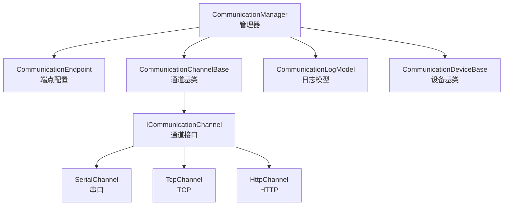

图表来源
- [communication_manager.cpp:13-146](file://src/modules/process/communication/communication_manager.cpp#L13-L146)
- [i_communication_channel.h:11-32](file://src/modules/process/communication/i_communication_channel.h#L11-L32)
- [communication_channel_base.h:7-27](file://src/modules/process/communication/communication_channel_base.h#L7-L27)
- [communication_device_base.h:12-30](file://src/modules/process/communication/communication_device_base.h#L12-L30)
- [communication_log_model.h:10-31](file://src/modules/process/communication/communication_log_model.h#L10-L31)
- [serial_channel.h:9-24](file://src/modules/process/communication/protocols/serial_channel.h#L9-L24)
- [tcp_channel.h:9-24](file://src/modules/process/communication/protocols/tcp_channel.h#L9-L24)
- [http_channel.h:9-24](file://src/modules/process/communication/protocols/http_channel.h#L9-L24)

章节来源
- [communication_manager.h:13-42](file://src/modules/process/communication/communication_manager.h#L13-L42)
- [communication_manager.cpp:13-146](file://src/modules/process/communication/communication_manager.cpp#L13-L146)

## 核心组件
- CommunicationManager：通信系统中枢，负责端点配置、通道创建与替换、设备连接/断开、数据发送、状态查询与日志聚合。
- ICommunicationChannel：通道统一接口，定义配置、连接、断开、发送与状态变化等契约。
- CommunicationChannelBase：通道基类，封装通用状态机与消息上报逻辑，供各协议继承。
- CommunicationDeviceBase：设备侧抽象，封装对CommunicationManager的调用，屏蔽通道细节。
- CommunicationEndpoint：端点配置载体，包含协议、主机、端口、路径、串口号、波特率、超时、请求头等。
- CommunicationMessage：消息体，包含时间戳、设备ID、方向、载荷与文本描述。
- CommunicationLogModel：日志表模型，支持容量限制、清空与表格展示。
- 协议实现：SerialChannel（串口）、TcpChannel（TCP）、HttpChannel（HTTP），均继承自CommunicationChannelBase。

章节来源
- [communication_manager.h:13-42](file://src/modules/process/communication/communication_manager.h#L13-L42)
- [i_communication_channel.h:11-32](file://src/modules/process/communication/i_communication_channel.h#L11-L32)
- [communication_channel_base.h:7-27](file://src/modules/process/communication/communication_channel_base.h#L7-L27)
- [communication_device_base.h:12-30](file://src/modules/process/communication/communication_device_base.h#L12-L30)
- [communication_endpoint.h:11-29](file://src/modules/process/communication/communication_endpoint.h#L11-L29)
- [communication_message.h:17-35](file://src/modules/process/communication/communication_message.h#L17-L35)
- [communication_log_model.h:10-31](file://src/modules/process/communication/communication_log_model.h#L10-L31)
- [serial_channel.h:9-24](file://src/modules/process/communication/protocols/serial_channel.h#L9-L24)
- [tcp_channel.h:9-24](file://src/modules/process/communication/protocols/tcp_channel.h#L9-L24)
- [http_channel.h:9-24](file://src/modules/process/communication/protocols/http_channel.h#L9-L24)

## 架构总览
CommunicationManager作为门面，根据CommunicationEndpoint.protocol选择对应通道实现，完成配置、连接、断开与数据发送；通道通过基类上报消息事件，由管理器统一写入日志模型并发出全局信号，便于UI或上层服务订阅。

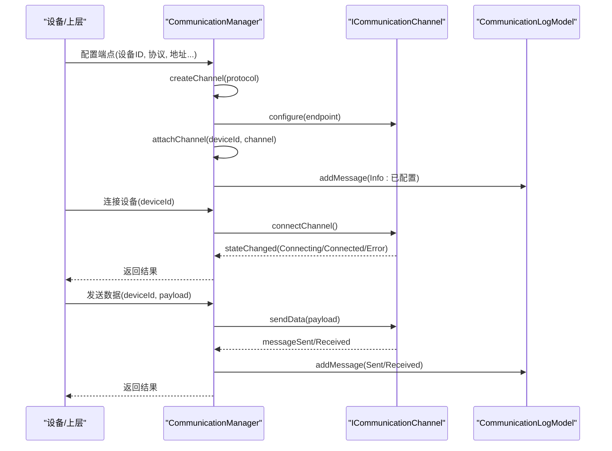

图表来源
- [communication_manager.cpp:21-84](file://src/modules/process/communication/communication_manager.cpp#L21-L84)
- [i_communication_channel.h:18-30](file://src/modules/process/communication/i_communication_channel.h#L18-L30)
- [communication_channel_base.cpp:10-42](file://src/modules/process/communication/communication_channel_base.cpp#L10-L42)
- [communication_log_model.h:21-24](file://src/modules/process/communication/communication_log_model.h#L21-L24)

## 详细组件分析

### CommunicationManager 管理器
- 职责
  - 端点配置：根据协议创建对应通道，替换旧通道并绑定信号。
  - 设备连接/断开：委托给对应通道。
  - 数据发送：校验通道存在性后转发至通道。
  - 状态查询：返回通道当前状态。
  - 日志聚合：将通道事件转交日志模型并广播消息。
- 关键流程
  - createChannel：按协议枚举创建具体通道实例，串口协议在特定构建宏下启用。
  - attachChannel：连接通道状态与消息信号到管理器槽函数，统一上报。
  - logMessage：写入日志模型并发出messageLogged信号。
  - normalizedDeviceId：规范化设备ID为空时使用默认值。

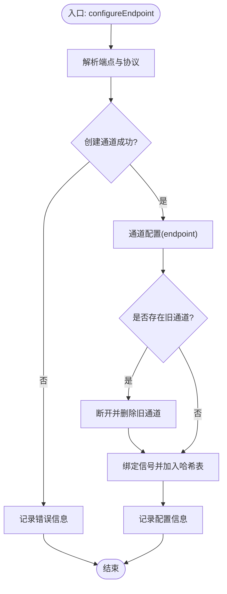

图表来源
- [communication_manager.cpp:21-48](file://src/modules/process/communication/communication_manager.cpp#L21-L48)
- [communication_manager.cpp:86-108](file://src/modules/process/communication/communication_manager.cpp#L86-L108)
- [communication_manager.cpp:116-131](file://src/modules/process/communication/communication_manager.cpp#L116-L131)

章节来源
- [communication_manager.h:13-42](file://src/modules/process/communication/communication_manager.h#L13-L42)
- [communication_manager.cpp:13-146](file://src/modules/process/communication/communication_manager.cpp#L13-L146)

### 通道抽象层：ICommunicationChannel 与 CommunicationChannelBase
- ICommunicationChannel
  - 统一接口：endpoint/configure/state/connect/disconnect/sendData。
  - 事件信号：stateChanged/messageSent/messageReceived/errorOccurred。
- CommunicationChannelBase
  - 状态机：维护CommunicationState，setState触发stateChanged。
  - 消息上报：reportSent/reportReceived/reportError统一构造CommunicationMessage并发射相应信号。
  - 端点持有：保存CommunicationEndpoint，用于生成设备ID与显示名。

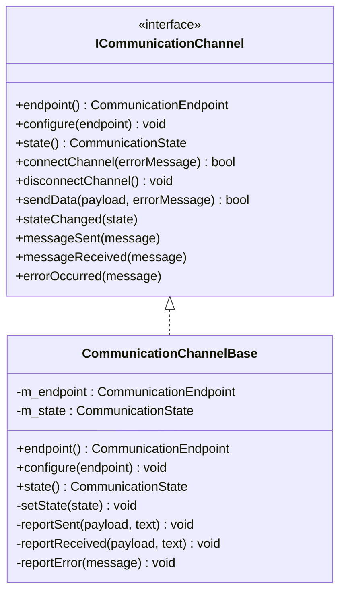

图表来源
- [i_communication_channel.h:11-32](file://src/modules/process/communication/i_communication_channel.h#L11-L32)
- [communication_channel_base.h:7-27](file://src/modules/process/communication/communication_channel_base.h#L7-L27)

章节来源
- [i_communication_channel.h:11-32](file://src/modules/process/communication/i_communication_channel.h#L11-L32)
- [communication_channel_base.h:7-27](file://src/modules/process/communication/communication_channel_base.h#L7-L27)
- [communication_channel_base.cpp:5-44](file://src/modules/process/communication/communication_channel_base.cpp#L5-L44)

### 设备抽象层：CommunicationDeviceBase
- 职责
  - 保存deviceId与CommunicationManager指针。
  - 提供sendCommunicationData封装调用，简化上层调用。
  - 提供communicationState查询当前通道状态。
- 规范化设备ID：若传入为空则使用默认值。

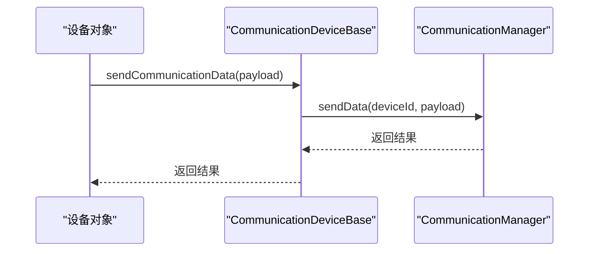

图表来源
- [communication_device_base.cpp:19-27](file://src/modules/process/communication/communication_device_base.cpp#L19-L27)

章节来源
- [communication_device_base.h:12-30](file://src/modules/process/communication/communication_device_base.h#L12-L30)
- [communication_device_base.cpp:7-29](file://src/modules/process/communication/communication_device_base.cpp#L7-L29)

### 端点管理：CommunicationEndpoint
- 字段
  - 设备ID、协议、主机、端口、路径、串口名、波特率、超时、请求头。
- 方法
  - defaults：默认端点。
  - normalizedDeviceId：规范化设备ID。
  - url：基于host/port/path生成QUrl。
  - displayName：用于UI显示的名称。

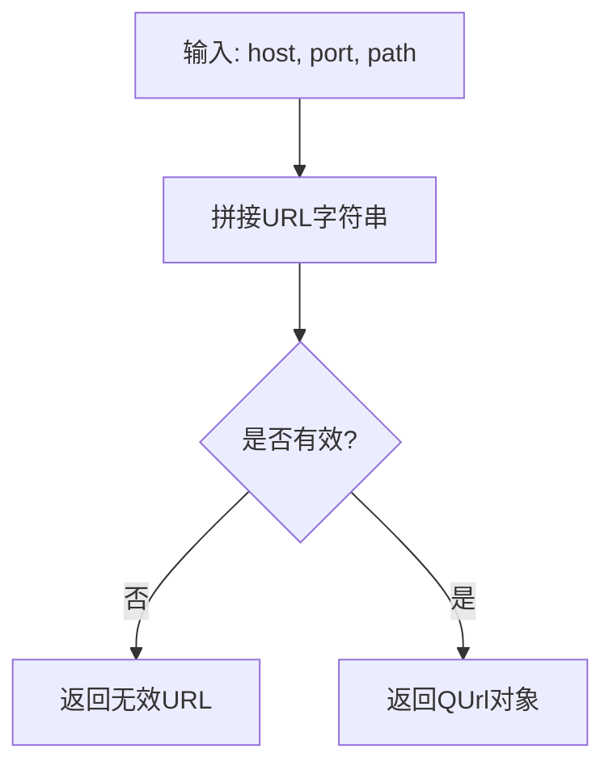

图表来源
- [communication_endpoint.h:25-26](file://src/modules/process/communication/communication_endpoint.h#L25-L26)

章节来源
- [communication_endpoint.h:11-29](file://src/modules/process/communication/communication_endpoint.h#L11-L29)

### 消息格式：CommunicationMessage
- 字段
  - 时间戳、设备ID、方向（发送/接收/信息/错误）、载荷、文本。
- 行为
  - displayText：优先返回文本，否则尝试UTF-8解码载荷。
- 方向枚举：CommunicationMessageDirection。

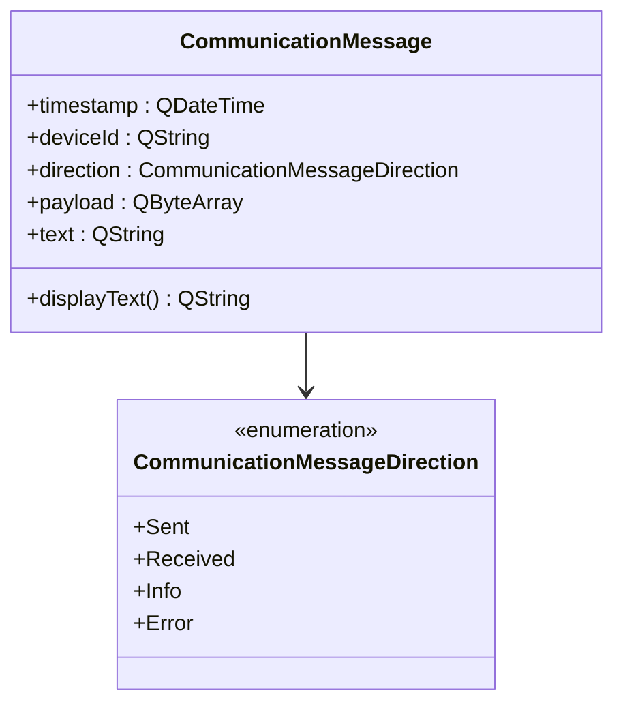

图表来源
- [communication_message.h:17-35](file://src/modules/process/communication/communication_message.h#L17-L35)

章节来源
- [communication_message.h:9-35](file://src/modules/process/communication/communication_message.h#L9-L35)

### 日志模型：CommunicationLogModel
- 功能
  - 表格模型：rowCount/columnCount/data/headerData。
  - 容量控制：setCapacity/capacity，内部队列长度限制。
  - 操作：addMessage/clear。
- 用途
  - 与CommunicationManager配合，统一记录所有通道事件，支持UI展示与导出。

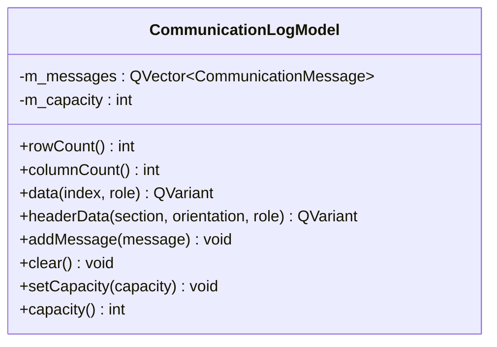

图表来源
- [communication_log_model.h:10-31](file://src/modules/process/communication/communication_log_model.h#L10-L31)

章节来源
- [communication_log_model.h:10-31](file://src/modules/process/communication/communication_log_model.h#L10-L31)

### 协议实现

#### SerialChannel（串口）
- 特点
  - 基于QSerialPort，配置波特率、数据位、奇偶校验、停止位与流控。
  - 连接即打开端口；断开即关闭端口。
  - readyRead自动上报收到的数据；errorOccurred上报错误。
- 适用场景
  - 控制器直连串口、传感器数据采集、设备调试。

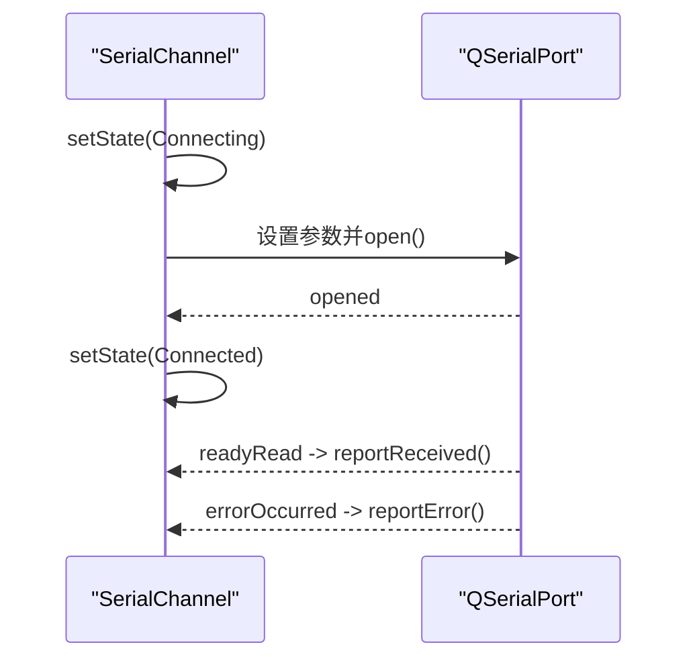

图表来源
- [serial_channel.cpp:24-55](file://src/modules/process/communication/protocols/serial_channel.cpp#L24-L55)
- [serial_channel.cpp:64-84](file://src/modules/process/communication/protocols/serial_channel.cpp#L64-L84)

章节来源
- [serial_channel.h:9-24](file://src/modules/process/communication/protocols/serial_channel.h#L9-L24)
- [serial_channel.cpp:7-86](file://src/modules/process/communication/protocols/serial_channel.cpp#L7-L86)

#### TcpChannel（TCP）
- 特点
  - 基于QTcpSocket，connectToHost建立连接；connected/disconnected切换状态。
  - readyRead自动上报收到的数据；errorOccurred上报错误。
- 适用场景
  - 与远程控制器或服务端通信，如PLC、网关、HTTP服务前置代理。

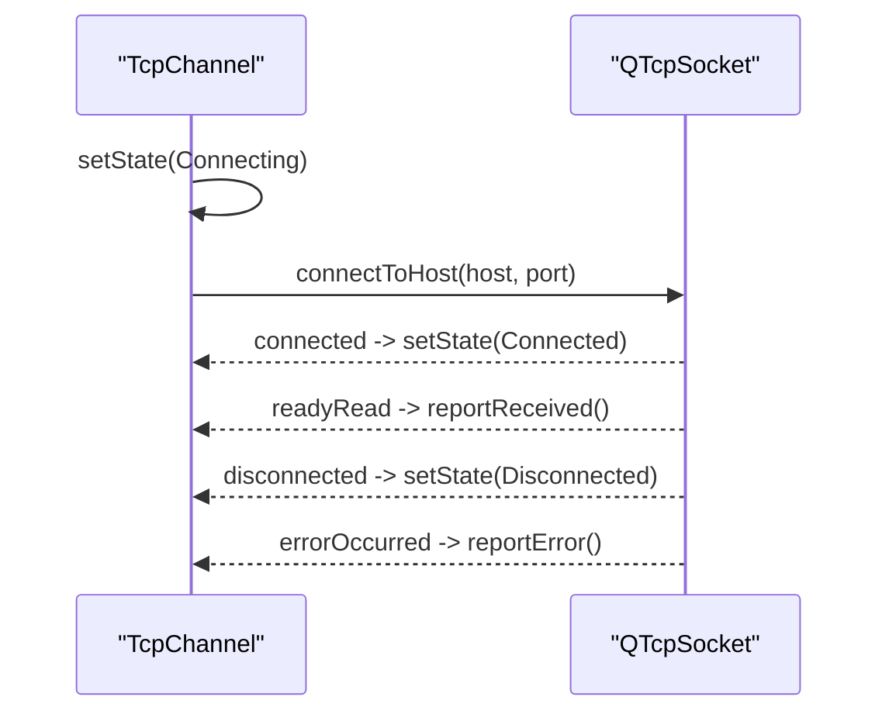

图表来源
- [tcp_channel.cpp:30-45](file://src/modules/process/communication/protocols/tcp_channel.cpp#L30-L45)
- [tcp_channel.cpp:56-76](file://src/modules/process/communication/protocols/tcp_channel.cpp#L56-L76)

章节来源
- [tcp_channel.h:9-24](file://src/modules/process/communication/protocols/tcp_channel.h#L9-L24)
- [tcp_channel.cpp:8-78](file://src/modules/process/communication/protocols/tcp_channel.cpp#L8-L78)

#### HttpChannel（HTTP）
- 特点
  - 连接即视为已连接；发送时构造QNetworkRequest，设置Content-Type与超时。
  - 使用QNetworkAccessManager.post异步发送，finished回调中读取响应并上报。
  - 支持自定义请求头。
- 适用场景
  - REST API对接、远程服务调用、设备固件升级、日志上报。

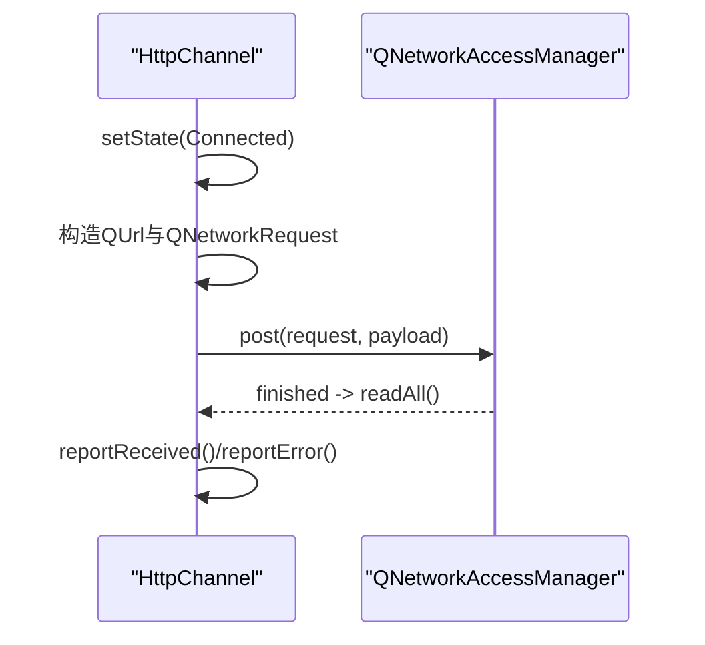

图表来源
- [http_channel.cpp:28-64](file://src/modules/process/communication/protocols/http_channel.cpp#L28-L64)

章节来源
- [http_channel.h:9-24](file://src/modules/process/communication/protocols/http_channel.h#L9-L24)
- [http_channel.cpp:9-66](file://src/modules/process/communication/protocols/http_channel.cpp#L9-L66)

## 依赖关系分析
- 管理器依赖
  - 通过ICommunicationChannel接口与具体协议解耦。
  - 通过CommunicationEndpoint统一承载端点参数。
  - 通过CommunicationLogModel集中记录消息。
- 协议实现依赖
  - 串口依赖QSerialPort，TCP依赖QTcpSocket，HTTP依赖QNetworkAccessManager。
- 抽象层依赖
  - CommunicationChannelBase复用状态机与消息上报逻辑。
  - CommunicationDeviceBase复用对管理器的调用封装。

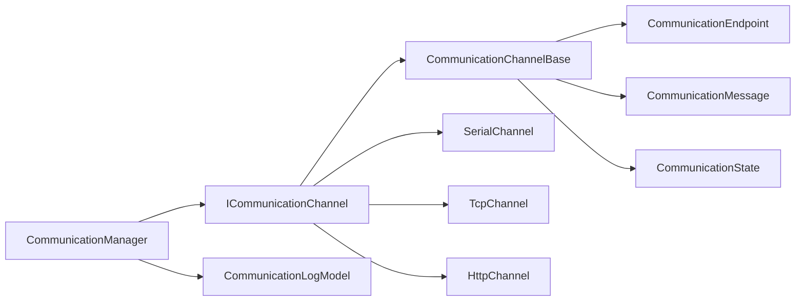

图表来源
- [communication_manager.cpp:86-108](file://src/modules/process/communication/communication_manager.cpp#L86-L108)
- [i_communication_channel.h:11-32](file://src/modules/process/communication/i_communication_channel.h#L11-L32)
- [communication_channel_base.h:7-27](file://src/modules/process/communication/communication_channel_base.h#L7-L27)
- [communication_endpoint.h:11-29](file://src/modules/process/communication/communication_endpoint.h#L11-L29)
- [communication_message.h:17-35](file://src/modules/process/communication/communication_message.h#L17-L35)
- [communication_types.h:15-21](file://src/modules/process/communication/communication_types.h#L15-L21)

章节来源
- [communication_types.h:7-27](file://src/modules/process/communication/communication_types.h#L7-L27)
- [communication_manager.cpp:86-108](file://src/modules/process/communication/communication_manager.cpp#L86-L108)

## 性能考虑
- 异步I/O
  - TCP与HTTP采用Qt网络栈异步回调，避免阻塞主线程。
  - 串口使用readyRead信号驱动，低延迟高吞吐。
- 日志容量控制
  - CommunicationLogModel通过容量上限限制内存占用，建议在高并发场景下调小容量或定期清理。
- 超时与重试
  - HTTP通道支持超时设置；上层可结合业务策略增加重试与退避。
- 线程模型
  - 建议在独立线程中运行网络I/O，避免UI卡顿；必要时使用队列或信号槽跨线程传递数据。

## 故障排查指南
- 常见错误来源
  - 端点未配置：调用connect/send前需先configureEndpoint。
  - 协议不支持：检查协议枚举与构建宏（串口）。
  - 连接失败：查看errorOccurred信号与报告的错误字符串。
  - 发送失败：确认通道状态为Connected且端口/套接字处于可用状态。
- 调试步骤
  - 订阅CommunicationManager::messageLogged信号，观察Sent/Received/Info/Error消息。
  - 在UI中绑定CommunicationLogModel，实时查看日志。
  - 使用CommunicationManager::state查询设备状态，辅助定位问题。
- 日志分析
  - 使用displayText优先显示文本描述，其次尝试UTF-8解码载荷，便于快速识别异常内容。

章节来源
- [communication_manager.cpp:21-48](file://src/modules/process/communication/communication_manager.cpp#L21-L48)
- [communication_channel_base.cpp:38-42](file://src/modules/process/communication/communication_channel_base.cpp#L38-L42)
- [serial_channel.cpp:26-51](file://src/modules/process/communication/protocols/serial_channel.cpp#L26-L51)
- [tcp_channel.cpp:30-45](file://src/modules/process/communication/protocols/tcp_channel.cpp#L30-L45)
- [http_channel.cpp:28-64](file://src/modules/process/communication/protocols/http_channel.cpp#L28-L64)

## 结论
该通信系统以接口与基类为核心，通过CommunicationManager实现统一编排与日志聚合，协议实现遵循相同的状态机与消息上报模式，具备良好的可扩展性与可维护性。串口、TCP与HTTP三种协议覆盖了工业控制与Web通信的主要场景，结合端点配置与日志模型，能够满足从本地设备到远程服务的多样化需求。

## 附录：扩展开发指南

### 新通信协议集成步骤
- 定义协议枚举
  - 在CommunicationProtocol中新增枚举值，保持与管理器创建分支一致。
- 实现通道类
  - 继承CommunicationChannelBase，实现connectChannel/disconnectChannel/sendData。
  - 在构造函数中注册底层I/O信号（如readyRead、errorOccurred）并调用reportReceived/reportError。
- 注册到管理器
  - 在CommunicationManager::createChannel中添加分支，返回新通道实例。
- 端点参数
  - 在CommunicationEndpoint中补充必要的参数字段（如IP/TCP端口、HTTP路径、串口参数等）。
- 测试与验证
  - 编写单元测试与集成测试，覆盖连接、断开、发送、错误上报与日志记录。

章节来源
- [communication_types.h:7-27](file://src/modules/process/communication/communication_types.h#L7-L27)
- [communication_manager.cpp:86-108](file://src/modules/process/communication/communication_manager.cpp#L86-L108)
- [communication_channel_base.cpp:18-42](file://src/modules/process/communication/communication_channel_base.cpp#L18-L42)
- [communication_endpoint.h:11-29](file://src/modules/process/communication/communication_endpoint.h#L11-L29)

### 设备适配器开发技巧
- 使用CommunicationDeviceBase
  - 将设备ID与CommunicationManager注入基类，统一通过sendCommunicationData发送数据。
- 状态同步
  - 订阅CommunicationManager::deviceStateChanged，及时更新设备UI与业务状态。
- 错误处理
  - 对上层暴露清晰的错误信息，便于用户或运维诊断。
- 日志友好
  - 在关键节点添加文本描述，提升日志可读性；必要时对敏感载荷进行脱敏。

章节来源
- [communication_device_base.h:12-30](file://src/modules/process/communication/communication_device_base.h#L12-L30)
- [communication_device_base.cpp:14-27](file://src/modules/process/communication/communication_device_base.cpp#L14-L27)
- [communication_manager.h:27-30](file://src/modules/process/communication/communication_manager.h#L27-L30)