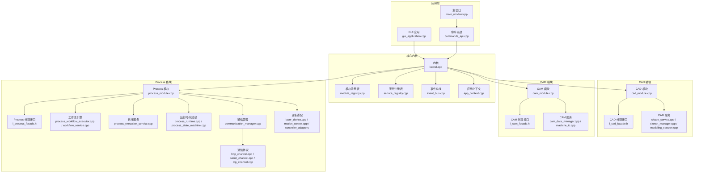
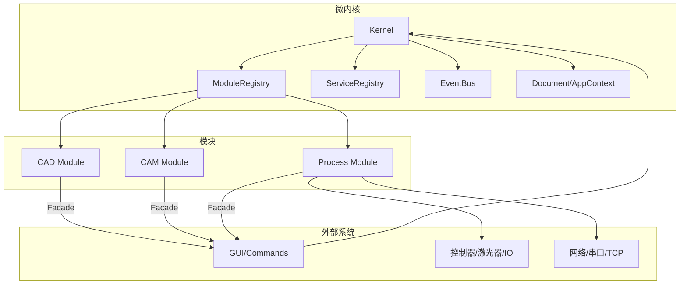
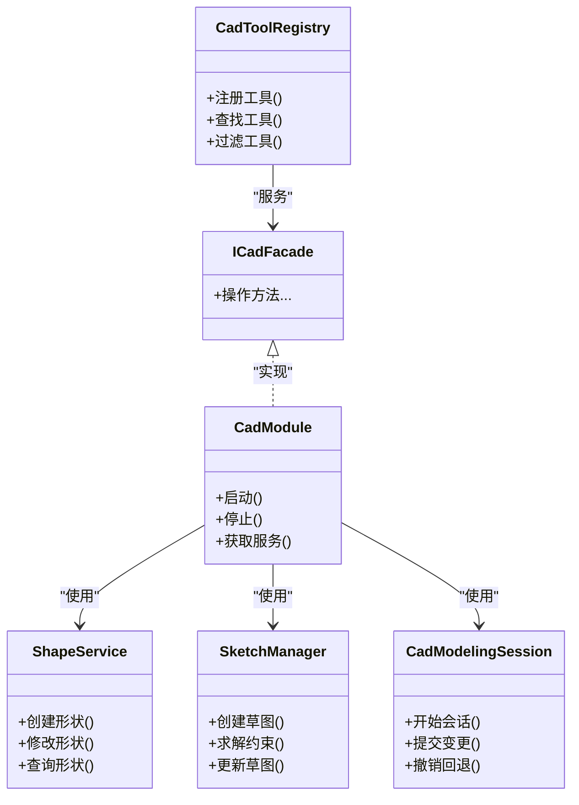
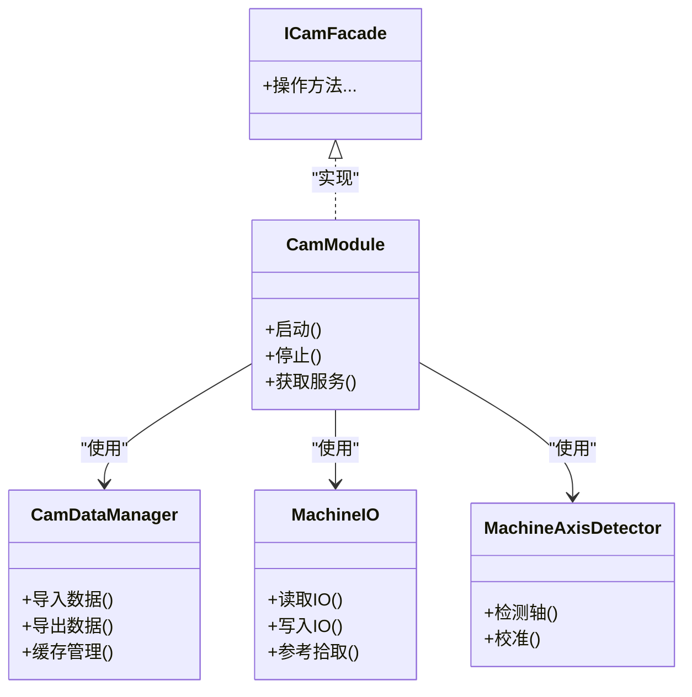
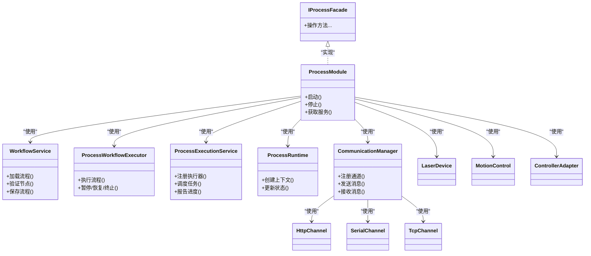
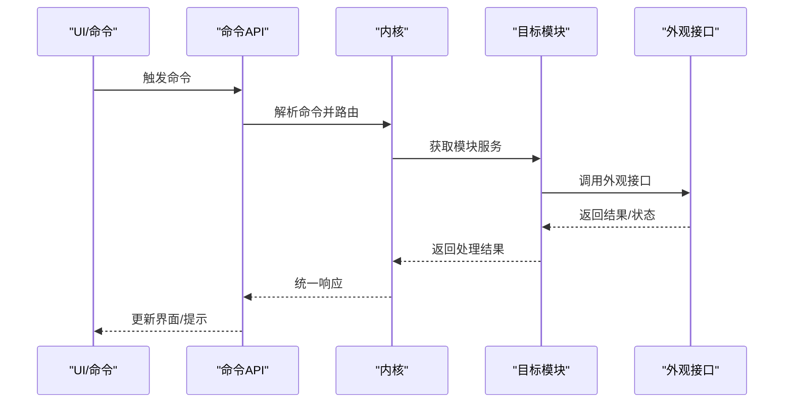
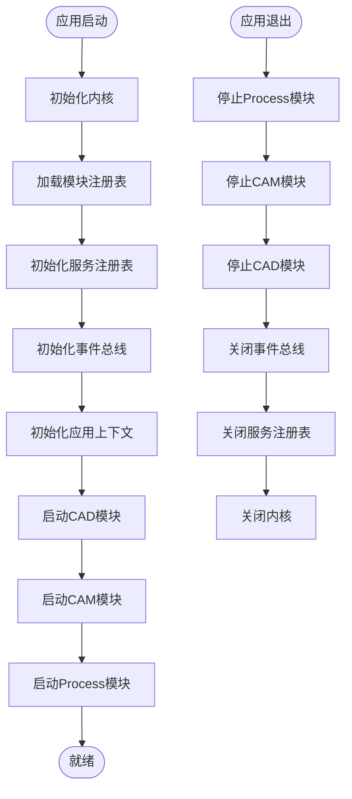
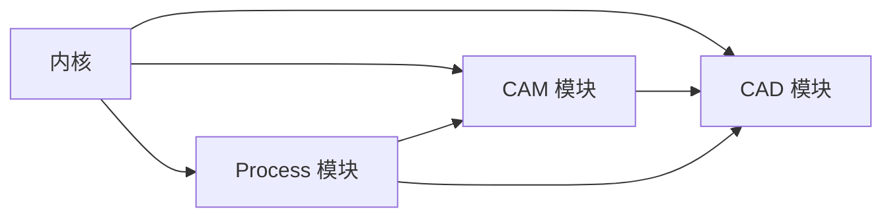

# 模块设计

<cite>
**本文引用的文件**
- [main.cpp](file://src/main.cpp)
- [gui_application.cpp](file://src/app/gui_application.cpp)
- [kernel.cpp](file://src/core/kernel/kernel.cpp)
- [i_kernel.h](file://src/core/kernel/i_kernel.h)
- [module_registry.cpp](file://src/core/kernel/module_registry.cpp)
- [service_registry.cpp](file://src/core/kernel/service_registry.cpp)
- [event_bus.cpp](file://src/core/kernel/event_bus.cpp)
- [cad_module.cpp](file://src/modules/cad/cad_module.cpp)
- [i_cad_facade.h](file://src/modules/cad/i_cad_facade.h)
- [cam_module.cpp](file://src/modules/cam/cam_module.cpp)
- [i_cam_facade.h](file://src/modules/cam/i_cam_facade.h)
- [process_module.cpp](file://src/modules/process/process_module.cpp)
- [i_process_facade.h](file://src/modules/process/i_process_facade.h)
- [cad_modeling_session.cpp](file://src/modules/cad/services/cad_modeling_session.cpp)
- [shape_service.cpp](file://src/modules/cad/services/shape_service.cpp)
- [sketch_manager.cpp](file://src/modules/cad/services/sketch_manager.cpp)
- [cam_data_manager.cpp](file://src/modules/cam/services/cam_data_manager.cpp)
- [machine_io.cpp](file://src/modules/cam/services/machine_io.cpp)
- [process_execution_service.cpp](file://src/modules/process/execution/process_execution_service.cpp)
- [process_workflow_executor.cpp](file://src/modules/process/workflow/process_workflow_executor.cpp)
- [workflow_service.cpp](file://src/modules/process/workflow/process_workflow_service.cpp)
- [communication_manager.cpp](file://src/modules/process/communication/communication_manager.cpp)
- [http_channel.cpp](file://src/modules/process/communication/protocols/http_channel.cpp)
- [serial_channel.cpp](file://src/modules/process/communication/protocols/serial_channel.cpp)
- [tcp_channel.cpp](file://src/modules/process/communication/protocols/tcp_channel.cpp)
- [acs_motion_controller_adapter.cpp](file://src/modules/process/controllers/acs_motion_controller_adapter.cpp)
- [gtn_motion_controller_adapter.cpp](file://src/modules/process/controllers/gtn_motion_controller_adapter.cpp)
- [laser_device.cpp](file://src/modules/process/device/Laser/LaserDevice.cpp)
- [motion_control.cpp](file://src/modules/process/device/MotionControl/MotionControl.cpp)
- [process_runtime.cpp](file://src/modules/process/runtime/process_runtime.cpp)
- [process_state_machine.cpp](file://src/modules/process/runtime/process_state_machine.cpp)
- [lcnc_document.cpp](file://src/core/document/lcnc_document.cpp)
- [app_context.cpp](file://src/app/app_context.cpp)
- [command_registry.cpp](file://src/app/command_registry.cpp)
- [commands_api.cpp](file://src/core/command/commands_api.cpp)
- [commands_cad.cpp](file://src/modules/cad/commands/commands_cad.cpp)
- [commands_cam.cpp](file://src/modules/cam/commands/commands_cam.cpp)
- [commands_process.cpp](file://src/modules/process/commands/commands_process.cpp)
</cite>

## 目录
1. [引言](#引言)
2. [项目结构](#项目结构)
3. [核心组件](#核心组件)
4. [架构总览](#架构总览)
5. [详细组件分析](#详细组件分析)
6. [依赖分析](#依赖分析)
7. [性能考虑](#性能考虑)
8. [故障排查指南](#故障排查指南)
9. [结论](#结论)
10. [附录](#附录)

## 引言
本设计文档面向LaserCNC项目的模块化架构，聚焦CAD（计算机辅助设计）、CAM（计算机辅助制造）与Process（加工执行与设备控制）三大功能域。文档从职责划分、设计原则、功能边界、对外接口、内部实现、模块协作、生命周期与初始化顺序、扩展与定制指导，以及模块间数据交换格式与协议规范等方面进行系统性阐述，帮助开发者快速理解并参与模块开发。

## 项目结构
LaserCNC采用微内核+模块化架构：核心内核负责模块注册、服务注册、事件总线与生命周期管理；各功能模块（CAD/CAM/Process）通过统一的Facade接口暴露能力，并通过命令系统与UI交互。Process模块进一步细分为工作流、执行器、通信、设备适配与运行时等子系统，形成完整的从“设计-仿真-指令生成-设备执行”的闭环。

图表来源
- [gui_application.cpp](file://src/app/gui_application.cpp)
- [kernel.cpp](file://src/core/kernel/kernel.cpp)
- [module_registry.cpp](file://src/core/kernel/module_registry.cpp)
- [service_registry.cpp](file://src/core/kernel/service_registry.cpp)
- [event_bus.cpp](file://src/core/kernel/event_bus.cpp)
- [cad_module.cpp](file://src/modules/cad/cad_module.cpp)
- [i_cad_facade.h](file://src/modules/cad/i_cad_facade.h)
- [cam_module.cpp](file://src/modules/cam/cam_module.cpp)
- [i_cam_facade.h](file://src/modules/cam/i_cam_facade.h)
- [process_module.cpp](file://src/modules/process/process_module.cpp)
- [i_process_facade.h](file://src/modules/process/i_process_facade.h)
- [process_workflow_executor.cpp](file://src/modules/process/workflow/process_workflow_executor.cpp)
- [workflow_service.cpp](file://src/modules/process/workflow/process_workflow_service.cpp)
- [process_execution_service.cpp](file://src/modules/process/execution/process_execution_service.cpp)
- [process_runtime.cpp](file://src/modules/process/runtime/process_runtime.cpp)
- [process_state_machine.cpp](file://src/modules/process/runtime/process_state_machine.cpp)
- [communication_manager.cpp](file://src/modules/process/communication/communication_manager.cpp)
- [http_channel.cpp](file://src/modules/process/communication/protocols/http_channel.cpp)
- [serial_channel.cpp](file://src/modules/process/communication/protocols/serial_channel.cpp)
- [tcp_channel.cpp](file://src/modules/process/communication/protocols/tcp_channel.cpp)
- [laser_device.cpp](file://src/modules/process/device/Laser/LaserDevice.cpp)
- [motion_control.cpp](file://src/modules/process/device/MotionControl/MotionControl.cpp)

章节来源
- [main.cpp](file://src/main.cpp)
- [gui_application.cpp](file://src/app/gui_application.cpp)
- [kernel.cpp](file://src/core/kernel/kernel.cpp)
- [module_registry.cpp](file://src/core/kernel/module_registry.cpp)
- [service_registry.cpp](file://src/core/kernel/service_registry.cpp)
- [event_bus.cpp](file://src/core/kernel/event_bus.cpp)

## 核心组件
- 内核（Kernel）：负责模块生命周期管理、服务注册与发现、事件总线、应用上下文初始化与全局配置加载。
- 模块注册表（Module Registry）：维护模块清单、启动顺序与依赖关系，确保按序初始化。
- 服务注册表（Service Registry）：集中管理跨模块可共享的服务实例，提供依赖注入式获取。
- 事件总线（Event Bus）：模块间解耦通信的中枢，支持发布/订阅模式与异步消息传递。
- 文档与上下文（Document/App Context）：承载项目数据模型与全局状态，为各模块提供统一的数据访问入口。
- 命令系统（Commands API）：统一的命令入口，将UI操作映射到具体模块的业务逻辑。

章节来源
- [i_kernel.h](file://src/core/kernel/i_kernel.h)
- [kernel.cpp](file://src/core/kernel/kernel.cpp)
- [module_registry.cpp](file://src/core/kernel/module_registry.cpp)
- [service_registry.cpp](file://src/core/kernel/service_registry.cpp)
- [event_bus.cpp](file://src/core/kernel/event_bus.cpp)
- [lcnc_document.cpp](file://src/core/document/lcnc_document.cpp)
- [app_context.cpp](file://src/app/app_context.cpp)
- [commands_api.cpp](file://src/core/command/commands_api.cpp)

## 架构总览
LaserCNC采用“微内核 + 插件化模块”架构。内核作为基础设施，模块通过统一接口接入；模块内部再细分子系统，如Process模块的工作流、执行器、通信与设备适配。模块间通过Facade接口与事件总线交互，命令系统贯穿UI与模块边界，形成清晰的职责分层与低耦合协作。

图表来源
- [kernel.cpp](file://src/core/kernel/kernel.cpp)
- [module_registry.cpp](file://src/core/kernel/module_registry.cpp)
- [service_registry.cpp](file://src/core/kernel/service_registry.cpp)
- [event_bus.cpp](file://src/core/kernel/event_bus.cpp)
- [cad_module.cpp](file://src/modules/cad/cad_module.cpp)
- [cam_module.cpp](file://src/modules/cam/cam_module.cpp)
- [process_module.cpp](file://src/modules/process/process_module.cpp)

## 详细组件分析

### CAD 模块设计
- 职责划分
  - 设计建模：提供草图、实体建模、布尔运算、变换与测量等能力。
  - 文档与选择：维护CAD文档状态、选择解析与序列化。
  - 工具与命令：封装建模工具、编辑命令与文件操作。
  - Facade 接口：对外暴露统一的CAD操作入口，隐藏内部复杂度。
- 对外接口
  - i_cad_facade.h：定义CAD外观接口，供上层调用。
  - commands_cad.cpp：将UI命令映射到CAD工具链。
- 内部实现
  - cad_modeling_session.cpp：建模会话管理，协调草图与实体建模。
  - shape_service.cpp：几何形状的创建、修改与查询。
  - sketch_manager.cpp：草图管理与约束求解。
  - cad_document_state.cpp/.h：CAD文档状态持久化与恢复。
  - cad_tool_registry.cpp/.h：工具注册与过滤。
- 生命周期与初始化
  - 由内核在启动阶段按序加载，依赖服务注册表提供的几何与文档服务。
- 扩展与定制
  - 新建工具：实现ICADToolCommand接口，注册到工具注册表。
  - 新增命令：在commands_cad.cpp中添加映射，保持命令命名与参数约定一致。

图表来源
- [i_cad_facade.h](file://src/modules/cad/i_cad_facade.h)
- [cad_module.cpp](file://src/modules/cad/cad_module.cpp)
- [shape_service.cpp](file://src/modules/cad/services/shape_service.cpp)
- [sketch_manager.cpp](file://src/modules/cad/services/sketch_manager.cpp)
- [cad_modeling_session.cpp](file://src/modules/cad/services/cad_modeling_session.cpp)
- [cad_tool_registry.cpp](file://src/modules/cad/task/cad_tool_registry.cpp)

章节来源
- [i_cad_facade.h](file://src/modules/cad/i_cad_facade.h)
- [cad_module.cpp](file://src/modules/cad/cad_module.cpp)
- [commands_cad.cpp](file://src/modules/cad/commands/commands_cad.cpp)
- [shape_service.cpp](file://src/modules/cad/services/shape_service.cpp)
- [sketch_manager.cpp](file://src/modules/cad/services/sketch_manager.cpp)
- [cad_modeling_session.cpp](file://src/modules/cad/services/cad_modeling_session.cpp)
- [cad_tool_registry.cpp](file://src/modules/cad/task/cad_tool_registry.cpp)

### CAM 模块设计
- 职责划分
  - 刀路生成：基于CAD几何生成激光加工刀路。
  - 数据管理：CAM数据的导入、导出与缓存。
  - 机器IO：与设备IO交互，处理参考点拾取与轴检测。
- 对外接口
  - i_cam_facade.h：CAM外观接口，统一暴露刀路与数据管理能力。
  - commands_cam.cpp：将UI命令映射到CAM流程。
- 内部实现
  - cam_data_manager.cpp：CAM数据的统一管理与版本控制。
  - machine_io.cpp：机器IO抽象与设备交互。
  - machine_axis_detector.cpp：自动识别与校准机床坐标轴。
  - 参考拾取与压缩器：reference_pick.cpp、machine_model_compressor.cpp。
- 生命周期与初始化
  - 在内核启动后按序初始化，依赖CAD模块提供的几何数据与文档上下文。
- 扩展与定制
  - 新增刀路算法：实现刀路生成策略并注册到数据管理器。
  - 新增命令：在commands_cam.cpp中新增映射，遵循参数与返回约定。

图表来源
- [i_cam_facade.h](file://src/modules/cam/i_cam_facade.h)
- [cam_module.cpp](file://src/modules/cam/cam_module.cpp)
- [cam_data_manager.cpp](file://src/modules/cam/services/cam_data_manager.cpp)
- [machine_io.cpp](file://src/modules/cam/services/machine_io.cpp)
- [machine_axis_detector.cpp](file://src/modules/cam/services/machine_axis_detector.cpp)

章节来源
- [i_cam_facade.h](file://src/modules/cam/i_cam_facade.h)
- [cam_module.cpp](file://src/modules/cam/cam_module.cpp)
- [commands_cam.cpp](file://src/modules/cam/commands/commands_cam.cpp)
- [cam_data_manager.cpp](file://src/modules/cam/services/cam_data_manager.cpp)
- [machine_io.cpp](file://src/modules/cam/services/machine_io.cpp)
- [machine_axis_detector.cpp](file://src/modules/cam/services/machine_axis_detector.cpp)

### Process 模块设计
- 职责划分
  - 工作流与节点：定义加工流程、节点类型与执行编排。
  - 执行服务：将流程转换为可执行指令，调度与监控执行过程。
  - 运行时与状态机：管理执行上下文、状态迁移与异常处理。
  - 通信：支持HTTP、串口、TCP等通道，抽象设备通信协议。
  - 设备适配：控制器（ACS/GTN）、激光器、运动控制卡等设备抽象。
- 对外接口
  - i_process_facade.h：Process外观接口，统一暴露执行与监控能力。
  - commands_process.cpp：将UI命令映射到Process流程。
- 内部实现
  - workflow_service.cpp / process_workflow_executor.cpp：工作流解析与执行。
  - process_execution_service.cpp：执行器注册与任务调度。
  - process_runtime.cpp / process_state_machine.cpp：执行上下文与状态机。
  - communication_manager.cpp + 协议通道：HTTP/Serial/TCP通道实现。
  - 设备适配器：控制器与激光器/运动控制的适配层。
- 生命周期与初始化
  - 启动顺序：先初始化通信与设备适配，再加载工作流与执行服务，最后启动运行时。
- 扩展与定制
  - 新增节点类型：实现节点执行器并注册到执行器注册表。
  - 新增通信通道：实现通信通道接口并注册到通信管理器。
  - 新增设备适配：实现设备基类并注册到设备工厂。

图表来源
- [i_process_facade.h](file://src/modules/process/i_process_facade.h)
- [process_module.cpp](file://src/modules/process/process_module.cpp)
- [workflow_service.cpp](file://src/modules/process/workflow/process_workflow_service.cpp)
- [process_workflow_executor.cpp](file://src/modules/process/workflow/process_workflow_executor.cpp)
- [process_execution_service.cpp](file://src/modules/process/execution/process_execution_service.cpp)
- [process_runtime.cpp](file://src/modules/process/runtime/process_runtime.cpp)
- [process_state_machine.cpp](file://src/modules/process/runtime/process_state_machine.cpp)
- [communication_manager.cpp](file://src/modules/process/communication/communication_manager.cpp)
- [http_channel.cpp](file://src/modules/process/communication/protocols/http_channel.cpp)
- [serial_channel.cpp](file://src/modules/process/communication/protocols/serial_channel.cpp)
- [tcp_channel.cpp](file://src/modules/process/communication/protocols/tcp_channel.cpp)
- [laser_device.cpp](file://src/modules/process/device/Laser/LaserDevice.cpp)
- [motion_control.cpp](file://src/modules/process/device/MotionControl/MotionControl.cpp)
- [acs_motion_controller_adapter.cpp](file://src/modules/process/controllers/acs_motion_controller_adapter.cpp)
- [gtn_motion_controller_adapter.cpp](file://src/modules/process/controllers/gtn_motion_controller_adapter.cpp)

章节来源
- [i_process_facade.h](file://src/modules/process/i_process_facade.h)
- [process_module.cpp](file://src/modules/process/process_module.cpp)
- [commands_process.cpp](file://src/modules/process/commands/commands_process.cpp)
- [workflow_service.cpp](file://src/modules/process/workflow/process_workflow_service.cpp)
- [process_workflow_executor.cpp](file://src/modules/process/workflow/process_workflow_executor.cpp)
- [process_execution_service.cpp](file://src/modules/process/execution/process_execution_service.cpp)
- [process_runtime.cpp](file://src/modules/process/runtime/process_runtime.cpp)
- [process_state_machine.cpp](file://src/modules/process/runtime/process_state_machine.cpp)
- [communication_manager.cpp](file://src/modules/process/communication/communication_manager.cpp)
- [http_channel.cpp](file://src/modules/process/communication/protocols/http_channel.cpp)
- [serial_channel.cpp](file://src/modules/process/communication/protocols/serial_channel.cpp)
- [tcp_channel.cpp](file://src/modules/process/communication/protocols/tcp_channel.cpp)
- [laser_device.cpp](file://src/modules/process/device/Laser/LaserDevice.cpp)
- [motion_control.cpp](file://src/modules/process/device/MotionControl/MotionControl.cpp)
- [acs_motion_controller_adapter.cpp](file://src/modules/process/controllers/acs_motion_controller_adapter.cpp)
- [gtn_motion_controller_adapter.cpp](file://src/modules/process/controllers/gtn_motion_controller_adapter.cpp)

### 模块协作机制
- Facade 接口设计
  - 每个模块均提供一个外观接口（i_cad_facade.h、i_cam_facade.h、i_process_facade.h），统一对外暴露能力，隐藏内部复杂性与实现细节。
- 服务注册与依赖注入
  - 通过service_registry.cpp集中管理服务实例，模块通过内核获取所需服务，避免硬编码依赖。
- 事件通信
  - event_bus.cpp提供发布/订阅机制，模块间通过事件解耦通信，支持异步与同步消息。
- 命令系统
  - commands_api.cpp统一接收UI命令，根据命令类型路由到对应模块的命令处理器（如commands_cad.cpp、commands_cam.cpp、commands_process.cpp）。

图表来源
- [commands_api.cpp](file://src/core/command/commands_api.cpp)
- [kernel.cpp](file://src/core/kernel/kernel.cpp)
- [i_cad_facade.h](file://src/modules/cad/i_cad_facade.h)
- [i_cam_facade.h](file://src/modules/cam/i_cam_facade.h)
- [i_process_facade.h](file://src/modules/process/i_process_facade.h)

章节来源
- [commands_api.cpp](file://src/core/command/commands_api.cpp)
- [kernel.cpp](file://src/core/kernel/kernel.cpp)
- [event_bus.cpp](file://src/core/kernel/event_bus.cpp)
- [i_cad_facade.h](file://src/modules/cad/i_cad_facade.h)
- [i_cam_facade.h](file://src/modules/cam/i_cam_facade.h)
- [i_process_facade.h](file://src/modules/process/i_process_facade.h)

### 模块生命周期与初始化顺序
- 启动阶段
  - 应用启动（main.cpp/gui_application.cpp）→ 内核初始化（kernel.cpp）→ 加载模块注册表（module_registry.cpp）→ 初始化服务注册表（service_registry.cpp）→ 初始化事件总线（event_bus.cpp）→ 初始化应用上下文（app_context.cpp）→ 按序启动CAD/CAM/Process模块。
- 停止阶段
  - 逆序关闭：先停止模块，再释放服务与事件总线，最后释放内核与上下文。
- 依赖关系
  - Process依赖CAM/CAD输出的几何/刀路数据；CAM依赖CAD几何；内核为所有模块提供基础设施。

图表来源
- [main.cpp](file://src/main.cpp)
- [gui_application.cpp](file://src/app/gui_application.cpp)
- [kernel.cpp](file://src/core/kernel/kernel.cpp)
- [module_registry.cpp](file://src/core/kernel/module_registry.cpp)
- [service_registry.cpp](file://src/core/kernel/service_registry.cpp)
- [event_bus.cpp](file://src/core/kernel/event_bus.cpp)
- [app_context.cpp](file://src/app/app_context.cpp)
- [cad_module.cpp](file://src/modules/cad/cad_module.cpp)
- [cam_module.cpp](file://src/modules/cam/cam_module.cpp)
- [process_module.cpp](file://src/modules/process/process_module.cpp)

章节来源
- [main.cpp](file://src/main.cpp)
- [gui_application.cpp](file://src/app/gui_application.cpp)
- [kernel.cpp](file://src/core/kernel/kernel.cpp)
- [module_registry.cpp](file://src/core/kernel/module_registry.cpp)
- [service_registry.cpp](file://src/core/kernel/service_registry.cpp)
- [event_bus.cpp](file://src/core/kernel/event_bus.cpp)
- [app_context.cpp](file://src/app/app_context.cpp)

### 模块扩展与定制指导
- 新增CAD工具
  - 实现ICADToolCommand接口，注册到cad_tool_registry.cpp，确保命令名称与参数规范化。
- 新增CAM功能
  - 在cam_data_manager.cpp中扩展数据处理逻辑，或在machine_io.cpp中扩展IO行为。
- 新增Process节点/通道/设备
  - 节点：实现节点执行器并注册到执行器注册表。
  - 通道：实现通信通道接口并注册到communication_manager.cpp。
  - 设备：实现设备基类并注册到设备工厂。
- 命令扩展
  - 在对应模块的commands_xxx.cpp中添加命令映射，保持与现有命令风格一致。

章节来源
- [cad_tool_registry.cpp](file://src/modules/cad/task/cad_tool_registry.cpp)
- [cam_data_manager.cpp](file://src/modules/cam/services/cam_data_manager.cpp)
- [machine_io.cpp](file://src/modules/cam/services/machine_io.cpp)
- [process_execution_service.cpp](file://src/modules/process/execution/process_execution_service.cpp)
- [communication_manager.cpp](file://src/modules/process/communication/communication_manager.cpp)
- [commands_cad.cpp](file://src/modules/cad/commands/commands_cad.cpp)
- [commands_cam.cpp](file://src/modules/cam/commands/commands_cam.cpp)
- [commands_process.cpp](file://src/modules/process/commands/commands_process.cpp)

### 模块间数据交换格式与协议规范
- 文档与几何数据
  - 使用LCNC文档模型（lcnc_document.cpp）承载CAD/CAM数据，保证跨模块一致性。
- 刀路与几何
  - CAM模块以标准化几何对象与刀路数据形式向Process模块提供输入。
- 通信协议
  - HTTP/Serial/TCP通道：统一的消息封装与错误码约定，支持请求/响应与事件推送。
- 设备指令
  - 控制器适配器将高层指令翻译为具体控制器指令集，确保设备兼容性与可移植性。

章节来源
- [lcnc_document.cpp](file://src/core/document/lcnc_document.cpp)
- [cam_data_manager.cpp](file://src/modules/cam/services/cam_data_manager.cpp)
- [communication_manager.cpp](file://src/modules/process/communication/communication_manager.cpp)
- [http_channel.cpp](file://src/modules/process/communication/protocols/http_channel.cpp)
- [serial_channel.cpp](file://src/modules/process/communication/protocols/serial_channel.cpp)
- [tcp_channel.cpp](file://src/modules/process/communication/protocols/tcp_channel.cpp)
- [acs_motion_controller_adapter.cpp](file://src/modules/process/controllers/acs_motion_controller_adapter.cpp)
- [gtn_motion_controller_adapter.cpp](file://src/modules/process/controllers/gtn_motion_controller_adapter.cpp)

## 依赖分析
- 模块内聚与耦合
  - 模块内部高内聚，通过Facade与服务注册表降低对外耦合。
- 直接与间接依赖
  - Process对CAM/CAD存在直接依赖；CAM对CAD存在直接依赖；内核为基础设施层，向上提供通用能力。
- 外部依赖
  - 第三方库（spdlog、toml11等）用于日志与配置，不直接参与业务逻辑。
- 风险点
  - 模块间数据格式不一致可能导致集成问题；需强化文档与契约。

图表来源
- [kernel.cpp](file://src/core/kernel/kernel.cpp)
- [cad_module.cpp](file://src/modules/cad/cad_module.cpp)
- [cam_module.cpp](file://src/modules/cam/cam_module.cpp)
- [process_module.cpp](file://src/modules/process/process_module.cpp)

章节来源
- [kernel.cpp](file://src/core/kernel/kernel.cpp)
- [module_registry.cpp](file://src/core/kernel/module_registry.cpp)
- [service_registry.cpp](file://src/core/kernel/service_registry.cpp)

## 性能考虑
- 事件总线异步化：减少UI阻塞，提高交互流畅度。
- 服务注册表懒加载：按需创建服务实例，降低启动时间。
- 刀路与几何缓存：CAM模块缓存中间结果，避免重复计算。
- 通信通道缓冲与批处理：Process模块通信层采用缓冲与批处理策略，提升吞吐量。
- 状态机与执行器并发：执行服务合理拆分任务，利用多核并行。

## 故障排查指南
- 命令无法执行
  - 检查命令注册表与路由是否正确，确认命令API已正确映射到模块命令处理器。
- 模块启动失败
  - 查看内核日志与模块注册表，确认依赖服务可用且初始化顺序正确。
- 通信异常
  - 检查通信管理器配置与通道状态，核对协议实现与设备端一致性。
- 设备控制异常
  - 校验控制器适配器与设备驱动，确认指令翻译与设备响应匹配。

章节来源
- [command_registry.cpp](file://src/app/command_registry.cpp)
- [commands_api.cpp](file://src/core/command/commands_api.cpp)
- [kernel.cpp](file://src/core/kernel/kernel.cpp)
- [communication_manager.cpp](file://src/modules/process/communication/communication_manager.cpp)

## 结论
LaserCNC通过微内核+模块化架构实现了CAD、CAM与Process的清晰分工与高效协作。Facade接口、服务注册与事件总线构成了模块间稳定的协作基础；命令系统与文档模型保障了用户交互与数据一致性。遵循本文的扩展与定制指导，开发者可快速在现有框架下实现新功能与设备集成。

## 附录
- 关键文件索引
  - 应用入口与GUI：main.cpp、gui_application.cpp
  - 内核与注册：kernel.cpp、module_registry.cpp、service_registry.cpp、event_bus.cpp
  - 文档与上下文：lcnc_document.cpp、app_context.cpp
  - 命令系统：commands_api.cpp、command_registry.cpp
  - CAD：i_cad_facade.h、cad_module.cpp、shape_service.cpp、sketch_manager.cpp、cad_modeling_session.cpp
  - CAM：i_cam_facade.h、cam_module.cpp、cam_data_manager.cpp、machine_io.cpp
  - Process：i_process_facade.h、process_module.cpp、workflow_service.cpp、process_workflow_executor.cpp、process_execution_service.cpp、process_runtime.cpp、process_state_machine.cpp、communication_manager.cpp、http_channel.cpp、serial_channel.cpp、tcp_channel.cpp、laser_device.cpp、motion_control.cpp、控制器适配器