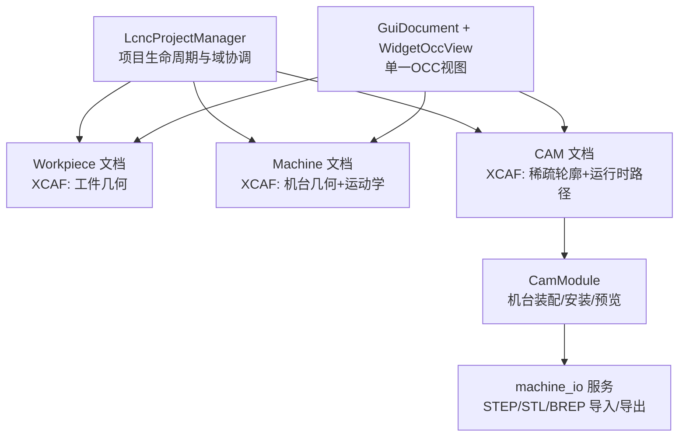
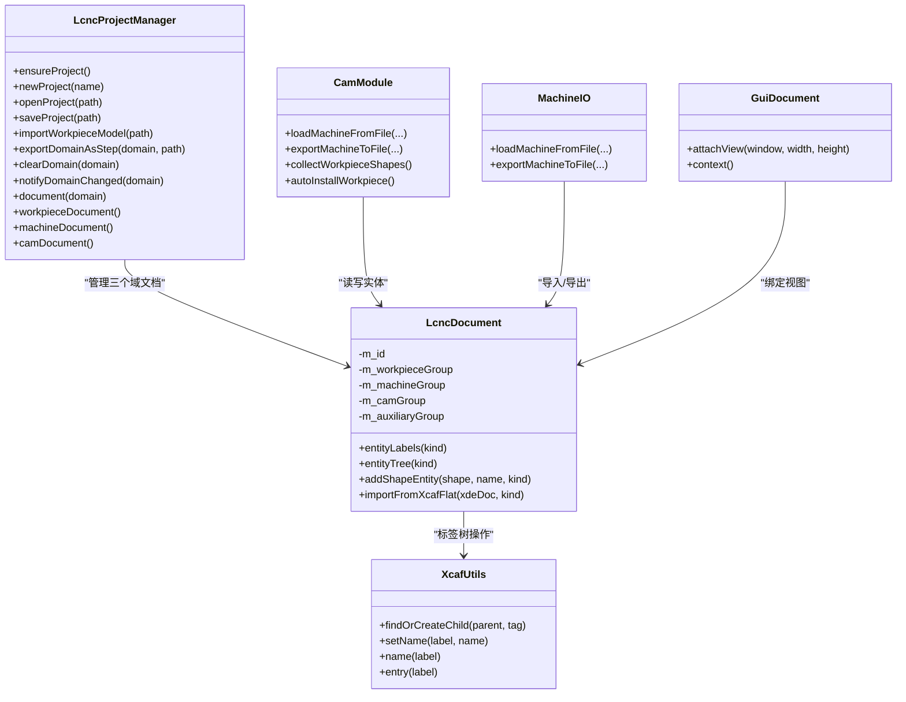
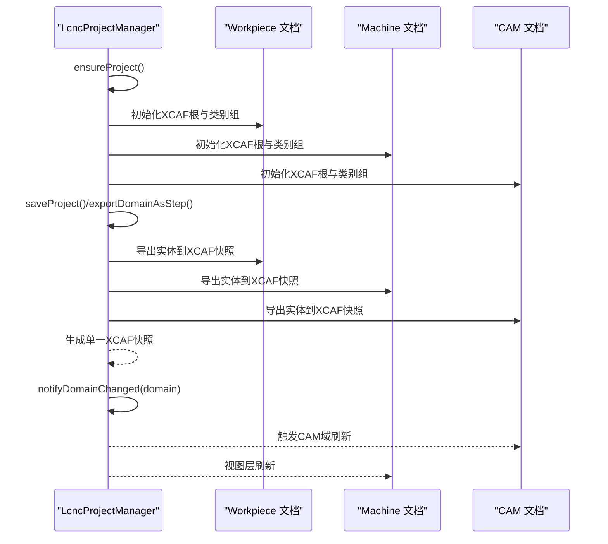
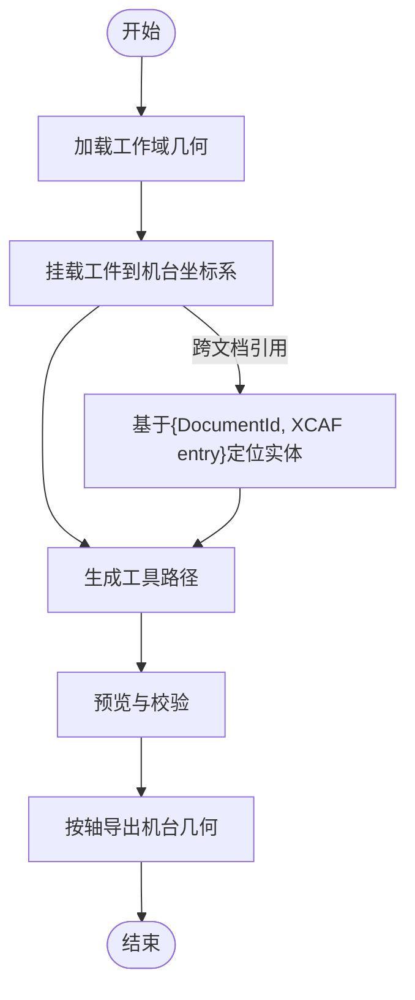
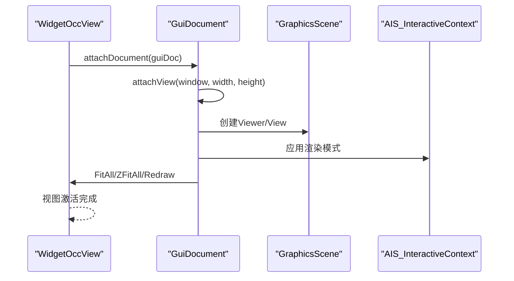
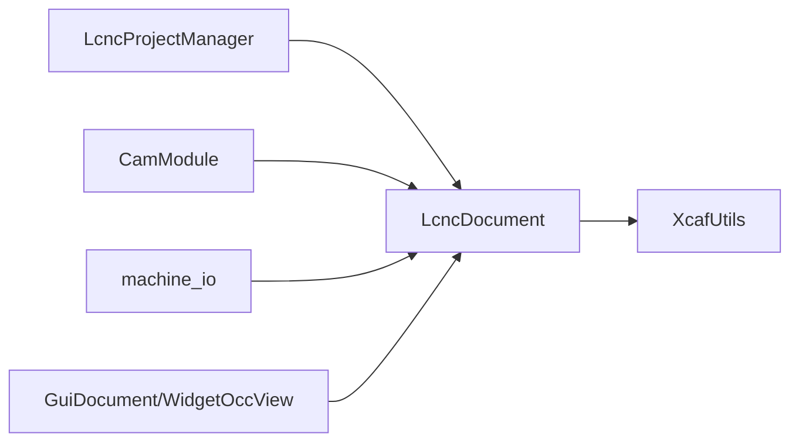

# 三层文档架构

<cite>
**本文引用的文件**
- [lcnc_project_manager.h](file://src/core/project/lcnc_project_manager.h)
- [lcnc_project_manager.cpp](file://src/core/project/lcnc_project_manager.cpp)
- [lcnc_project_package.cpp](file://src/core/project/lcnc_project_package.cpp)
- [lcnc_document.h](file://src/core/document/lcnc_document.h)
- [lcnc_document.cpp](file://src/core/document/lcnc_document.cpp)
- [xcaf_utils.h](file://src/core/document/xcaf_utils.h)
- [xcaf_utils.cpp](file://src/core/document/xcaf_utils.cpp)
- [gui_document.h](file://src/view/gui_document.h)
- [gui_document.cpp](file://src/view/gui_document.cpp)
- [widget_occ_view.cpp](file://src/view/widget_occ_view.cpp)
- [cam_module.h](file://src/modules/cam/cam_module.h)
- [cam_module.cpp](file://src/modules/cam/cam_module.cpp)
- [machine_io.h](file://src/modules/cam/services/machine_io.h)
- [machine_io.cpp](file://src/modules/cam/services/machine_io.cpp)
</cite>

## 目录
1. [引言](#引言)
2. [项目结构](#项目结构)
3. [核心组件](#核心组件)
4. [架构总览](#架构总览)
5. [详细组件分析](#详细组件分析)
6. [依赖关系分析](#依赖关系分析)
7. [性能考量](#性能考量)
8. [故障排查指南](#故障排查指南)
9. [结论](#结论)
10. [附录](#附录)

## 引言
本文件系统性阐述LaserCNC的三层文档架构：Workpiece（工件几何）、Machine（机台工具与运动学）、CAM（稀疏轮廓与密集刀具路径运行时数据）。重点说明以下内容：
- 三种文档类型的职责边界与数据隔离
- Workpiece文档以XCAF为源几何存储的设计思路
- Machine文档对机台工具几何与运动学信息的管理方式
- CAM文档对稀疏轮廓与密集刀具路径运行时数据的架构设计
- LcncProjectManager如何统一管理三个独立文档的生命周期与数据同步
- 文档间数据流转与冲突避免机制（基于{DocumentId, XCAF entry}注册）
- 单工作空间GuiDocument的实现原理：如何在单一OCC视图中协调显示三个不同域的内容

## 项目结构
LaserCNC采用微内核+模块化架构，三层文档由LcncProjectManager集中管理，分别对应Workpiece、Machine、CAM三个域。每个域文档均以XCAF为底层几何存储，并通过XCAF标签树组织实体类别。视图层通过GuiDocument与OCC交互，在单一视图中渲染多域内容。

图表来源
- [lcnc_project_manager.h:11-40](file://src/core/project/lcnc_project_manager.h#L11-L40)
- [lcnc_document.h:120-144](file://src/core/document/lcnc_document.h#L120-L144)
- [cam_module.h:52-63](file://src/modules/cam/cam_module.h#L52-L63)
- [machine_io.h:13-34](file://src/modules/cam/services/machine_io.h#L13-L34)
- [gui_document.cpp:80-110](file://src/view/gui_document.cpp#L80-L110)
- [widget_occ_view.cpp:446-467](file://src/view/widget_occ_view.cpp#L446-L467)

章节来源
- [lcnc_project_manager.h:11-40](file://src/core/project/lcnc_project_manager.h#L11-L40)
- [lcnc_document.h:120-144](file://src/core/document/lcnc_document.h#L120-L144)

## 核心组件
- LcncProjectManager：负责项目级生命周期、域文档实例化与持久化打包；提供域变更通知与域内文档查询。
- LcncDocument：封装XCAF文档，按EntityKind分类组织实体（Workpiece/Machine/CAM/Auxiliary），提供实体树与标签工具。
- XcafUtils：提供XCAF标签树操作的通用工具（查找/创建子节点、命名、entry转换等）。
- CamModule：CAM域业务入口，负责机台装配、工件安装、工具路径生成与预览；与Machine文档协作。
- machine_io：纯服务层，负责机台模型的STEP/STL/BREP导入导出与XCAF装配。
- GuiDocument/WidgetOccView：单工作空间视图容器，统一管理OCC视图与交互上下文，协调多域显示。

章节来源
- [lcnc_project_manager.cpp:258-306](file://src/core/project/lcnc_project_manager.cpp#L258-L306)
- [lcnc_document.cpp:36-65](file://src/core/document/lcnc_document.cpp#L36-L65)
- [xcaf_utils.cpp:13-39](file://src/core/document/xcaf_utils.cpp#L13-L39)
- [cam_module.h:52-63](file://src/modules/cam/cam_module.h#L52-L63)
- [machine_io.h:13-34](file://src/modules/cam/services/machine_io.h#L13-L34)
- [gui_document.cpp:80-110](file://src/view/gui_document.cpp#L80-L110)
- [widget_occ_view.cpp:446-467](file://src/view/widget_occ_view.cpp#L446-L467)

## 架构总览
三层文档架构围绕“文档即域”的理念构建，每个域拥有独立的XCAF文档与实体树，彼此通过统一的项目包（XCAF快照）进行序列化与反序列化，确保数据边界清晰、可独立编辑与持久化。

图表来源
- [lcnc_project_manager.h:11-40](file://src/core/project/lcnc_project_manager.h#L11-L40)
- [lcnc_document.h:120-144](file://src/core/document/lcnc_document.h#L120-L144)
- [xcaf_utils.h:1-39](file://src/core/document/xcaf_utils.h#L1-L39)
- [cam_module.h:52-90](file://src/modules/cam/cam_module.h#L52-L90)
- [machine_io.h:13-34](file://src/modules/cam/services/machine_io.h#L13-L34)
- [gui_document.h:1-120](file://src/view/gui_document.h#L1-L120)

## 详细组件分析

### Workpiece 文档：源几何存储设计
- 设计要点
  - 使用XCAF顶层自由形状（free shape）存储实体，通过TDataStd_Integer属性标记EntityKind::Workpiece，实现按类过滤。
  - 通过XCAF装配树记录导入层次（ShapeTreeNode），支持装配层级与部件清单的可视化与检索。
  - 仅存储源几何与必要的标注，不包含CAM运行时数据，保证数据边界清晰。
- 关键接口与行为
  - entityLabels(EntityKind::Workpiece)：枚举并筛选工作域实体。
  - entityTree(EntityKind::Workpiece)：返回导入层次树，便于工程管理与显示。
  - importFromXcafFlat：从外部XCAF快照扁平导入工作域实体，保留装配顶层组件为独立实体。
- 冲突避免
  - 通过{DocumentId, XCAF entry}唯一标识实体，避免跨文档实体ID冲突。

章节来源
- [lcnc_document.cpp:146-161](file://src/core/document/lcnc_document.cpp#L146-L161)
- [lcnc_document.cpp:340-372](file://src/core/document/lcnc_document.cpp#L340-L372)
- [lcnc_document.h:115-118](file://src/core/document/lcnc_document.h#L115-L118)
- [xcaf_utils.cpp:38-39](file://src/core/document/xcaf_utils.cpp#L38-L39)

### Machine 文档：机台工具几何与运动学
- 设计要点
  - 同样以XCAF自由形状存储机台几何，EntityKind::Machine分类管理。
  - 每个机台文档可持有MachineKinematics指针（由文档拥有），用于运动学计算与轴配置。
  - 支持按轴分组导出为STEP（含LCNC_AXIS_*命名约定），便于与控制器对接。
- 关键接口与行为
  - entityLabels(EntityKind::Machine)：枚举机台实体。
  - entityTree(EntityKind::Machine)：导入层次树，支持装配层级展示。
  - machine_io::exportMachineToFile：按轴导出机台几何。
- 冲突避免
  - 通过{DocumentId, XCAF entry}唯一标识机台实体，避免与工作域或CAM域冲突。

章节来源
- [lcnc_document.cpp:146-161](file://src/core/document/lcnc_document.cpp#L146-L161)
- [lcnc_document.h:139-144](file://src/core/document/lcnc_document.h#L139-L144)
- [machine_io.h:28-32](file://src/modules/cam/services/machine_io.h#L28-L32)
- [machine_io.cpp:1-200](file://src/modules/cam/services/machine_io.cpp#L1-L200)

### CAM 文档：稀疏轮廓与密集路径运行时数据
- 设计要点
  - 存储稀疏轮廓（如交线、边界）与密集刀具路径（运行时生成），EntityKind::Cam分类管理。
  - 与Machine文档协作：在机台坐标系下挂载工件，生成与验证工具路径。
  - CamModule负责工具路径生成、预览与“准备”页面管理。
- 关键接口与行为
  - entityLabels(EntityKind::Cam)：枚举CAM域实体。
  - collectWorkpieceShapes：收集工作域几何供CAM处理。
  - autoInstallWorkpiece：自动将当前工件安装到机台坐标系。
- 冲突避免
  - 通过{DocumentId, XCAF entry}唯一标识CAM实体，避免与工作域或机台域冲突。

章节来源
- [cam_module.cpp:1324-1351](file://src/modules/cam/cam_module.cpp#L1324-L1351)
- [cam_module.cpp:1930-1968](file://src/modules/cam/cam_module.cpp#L1930-L1968)
- [cam_module.h:52-63](file://src/modules/cam/cam_module.h#L52-L63)

### LcncProjectManager：生命周期与数据同步
- 职责边界
  - 统一管理Workpiece/Machine/CAM三个域文档的创建、打开、保存与清理。
  - 提供域变更通知（notifyDomainChanged），驱动视图与模块更新。
  - 将三个域文档打包为单一XCAF快照（包含Workpiece/Machine/CAM/Auxiliary），实现项目整体持久化。
- 关键流程
  - 新建/打开项目：初始化三个域文档，设置根节点与类别组标签。
  - 导入/导出：支持从外部STEP/STL/BREP导入工作域模型；支持将机台按轴导出。
  - 清理与通知：清空指定域后发出变更信号，触发UI与模块刷新。
- 冲突避免
  - 通过documentId(domain)与domainForDocument(documentId, domain)映射，确保跨域引用稳定可靠。

图表来源
- [lcnc_project_manager.cpp:258-306](file://src/core/project/lcnc_project_manager.cpp#L258-L306)
- [lcnc_project_package.cpp:264-294](file://src/core/project/lcnc_project_package.cpp#L264-L294)
- [lcnc_document.cpp:45-65](file://src/core/document/lcnc_document.cpp#L45-L65)

章节来源
- [lcnc_project_manager.h:11-40](file://src/core/project/lcnc_project_manager.h#L11-L40)
- [lcnc_project_manager.cpp:258-306](file://src/core/project/lcnc_project_manager.cpp#L258-L306)
- [lcnc_project_package.cpp:264-324](file://src/core/project/lcnc_project_package.cpp#L264-L324)

### 文档间数据流转与冲突避免机制
- 数据流转
  - Workpiece → CAM：CamModule收集工作域几何，生成工具路径与预览。
  - Machine → CAM：CamModule将工件挂载到机台坐标系，结合机台运动学生成路径。
  - CAM → Machine：导出机台几何（按轴分组）以便控制器使用。
- 冲突避免
  - 所有实体均以{DocumentId, XCAF entry}作为唯一标识，跨文档引用时以此组合定位，避免ID碰撞。
  - XCAF标签树严格区分类别组（Workpiece/Machine/CAM/Auxiliary），实体按类别过滤，减少误操作。

图表来源
- [cam_module.cpp:1324-1351](file://src/modules/cam/cam_module.cpp#L1324-L1351)
- [machine_io.h:28-32](file://src/modules/cam/services/machine_io.h#L28-L32)
- [xcaf_utils.cpp:38-39](file://src/core/document/xcaf_utils.cpp#L38-L39)

章节来源
- [cam_module.cpp:1324-1351](file://src/modules/cam/cam_module.cpp#L1324-L1351)
- [machine_io.h:28-32](file://src/modules/cam/services/machine_io.h#L28-L32)
- [xcaf_utils.cpp:38-39](file://src/core/document/xcaf_utils.cpp#L38-L39)

### 单工作空间GuiDocument实现原理
- 实现要点
  - GuiDocument持有GraphicsScene与AIS_InteractiveContext，负责在单一OCC视图中渲染多域内容。
  - attachView在首次创建时初始化视图与上下文，并应用渲染管理器的显示模式，随后进行FitAll与Redraw。
  - WidgetOccView负责将GuiDocument绑定到具体窗口句柄，支持默认场景与文档场景切换。
- 协调多域显示
  - 通过统一的AIS_InteractiveContext，将Workpiece/Machine/CAM域的实体加入同一视图上下文，实现“一个视图，多域可见”。

图表来源
- [gui_document.cpp:80-110](file://src/view/gui_document.cpp#L80-L110)
- [widget_occ_view.cpp:446-467](file://src/view/widget_occ_view.cpp#L446-L467)

章节来源
- [gui_document.cpp:80-110](file://src/view/gui_document.cpp#L80-L110)
- [widget_occ_view.cpp:446-467](file://src/view/widget_occ_view.cpp#L446-L467)

## 依赖关系分析
- 组件耦合
  - LcncProjectManager是域文档的唯一协调者，CamModule与machine_io通过文档接口访问几何与运动学。
  - LcncDocument与XcafUtils强耦合，前者提供实体分类与树结构，后者提供标签树操作。
  - 视图层（GuiDocument/WidgetOccView）与文档层解耦，通过AIS_InteractiveContext统一渲染。
- 外部依赖
  - OCC/XCAF：作为几何与装配的核心存储与渲染基础。
  - Qt：事件循环与UI容器，配合OCC进行窗口与渲染管理。

图表来源
- [lcnc_project_manager.h:11-40](file://src/core/project/lcnc_project_manager.h#L11-L40)
- [lcnc_document.h:120-144](file://src/core/document/lcnc_document.h#L120-L144)
- [xcaf_utils.h:1-39](file://src/core/document/xcaf_utils.h#L1-L39)
- [cam_module.h:52-63](file://src/modules/cam/cam_module.h#L52-L63)
- [machine_io.h:13-34](file://src/modules/cam/services/machine_io.h#L13-L34)
- [gui_document.h:1-120](file://src/view/gui_document.h#L1-L120)

章节来源
- [lcnc_project_manager.h:11-40](file://src/core/project/lcnc_project_manager.h#L11-L40)
- [lcnc_document.h:120-144](file://src/core/document/lcnc_document.h#L120-L144)
- [xcaf_utils.h:1-39](file://src/core/document/xcaf_utils.h#L1-L39)
- [cam_module.h:52-63](file://src/modules/cam/cam_module.h#L52-L63)
- [machine_io.h:13-34](file://src/modules/cam/services/machine_io.h#L13-L34)
- [gui_document.h:1-120](file://src/view/gui_document.h#L1-L120)

## 性能考量
- 几何存储与查询
  - 使用XCAF自由形状与标签树，避免重复拷贝几何；通过EntityKind属性快速过滤实体，降低查询成本。
- 渲染与显示
  - GuiDocument在首次attach时应用渲染模式并执行一次完整Redraw，确保OCC内部表示生成，避免后续FitAll失败。
- 导入/导出
  - 机台导出按轴分组，减少单文件体量；项目打包为单一XCAF快照，提升持久化效率。

## 故障排查指南
- 无法找到实体
  - 检查实体是否正确标记EntityKind且未被删除；确认使用entityLabels(EntityKind)过滤。
- 跨文档引用错误
  - 确认使用{DocumentId, XCAF entry}定位实体；避免直接使用全局ID。
- 视图不显示模型
  - 确认GuiDocument已attachView并执行FitAll/ZFitAll；检查AIS_InteractiveContext是否已Display实体。
- 机台导出异常
  - 检查MachineKinematics配置与轴命名；确保导出前已完成装配与坐标系对齐。

章节来源
- [lcnc_document.cpp:146-161](file://src/core/document/lcnc_document.cpp#L146-L161)
- [gui_document.cpp:80-110](file://src/view/gui_document.cpp#L80-L110)
- [machine_io.h:28-32](file://src/modules/cam/services/machine_io.h#L28-L32)

## 结论
三层文档架构通过XCAF统一存储与标签树组织，实现了Workpiece、Machine、CAM三域的清晰边界与高效协同。LcncProjectManager作为域协调者，结合CamModule与machine_io服务，提供了从几何导入、机台装配、工具路径生成到导出的完整闭环。单工作空间GuiDocument在单一OCC视图中协调多域显示，提升了用户体验。通过{DocumentId, XCAF entry}的唯一标识机制，有效避免了跨文档冲突，保障了系统的稳定性与可维护性。

## 附录
- 术语
  - XCAF：OpenCASCADE的XML/二进制装配与几何文档格式。
  - EntityKind：XCAF实体分类（Workpiece/Machine/CAM/Auxiliary）。
  - ShapeTreeNode：XCAF装配导入层次树节点。
- 参考路径
  - [LcncProjectManager 类定义:11-40](file://src/core/project/lcnc_project_manager.h#L11-L40)
  - [LcncDocument 类定义:120-144](file://src/core/document/lcnc_document.h#L120-L144)
  - [XcafUtils 工具函数:13-39](file://src/core/document/xcaf_utils.cpp#L13-L39)
  - [CamModule 机台与CAM集成:52-90](file://src/modules/cam/cam_module.h#L52-L90)
  - [machine_io 机台导入导出:13-34](file://src/modules/cam/services/machine_io.h#L13-L34)
  - [GuiDocument 视图绑定:80-110](file://src/view/gui_document.cpp#L80-L110)
  - [WidgetOccView 视图激活:446-467](file://src/view/widget_occ_view.cpp#L446-L467)