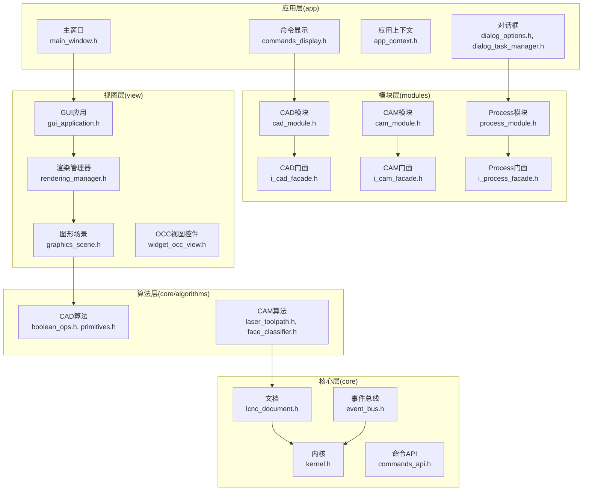
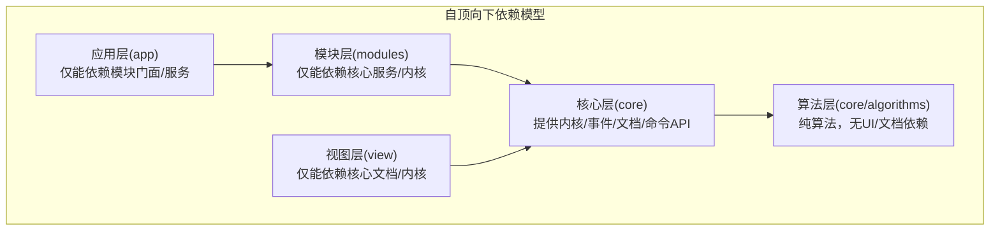
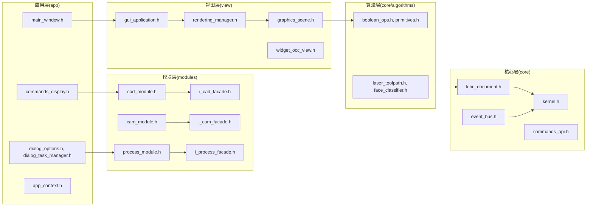

# 分层依赖规则

<cite>
**本文引用的文件**
- [CMakeLists.txt](file://CMakeLists.txt)
- [main.cpp](file://src/main.cpp)
- [kernel.h](file://src/core/kernel/kernel.h)
- [event_bus.h](file://src/core/kernel/event_bus.h)
- [i_kernel.h](file://src/core/kernel/i_kernel.h)
- [module_registry.h](file://src/core/kernel/module_registry.h)
- [service_registry.h](file://src/core/kernel/service_registry.h)
- [cad_module.h](file://src/modules/cad/cad_module.h)
- [cam_module.h](file://src/modules/cam/cam_module.h)
- [process_module.h](file://src/modules/process/process_module.h)
- [i_cad_facade.h](file://src/modules/cad/i_cad_facade.h)
- [i_cam_facade.h](file://src/modules/cam/i_cam_facade.h)
- [i_process_facade.h](file://src/modules/process/i_process_facade.h)
- [gui_application.h](file://src/view/gui_application.h)
- [graphics_scene.h](file://src/view/graphics_scene.h)
- [rendering_manager.h](file://src/view/rendering_manager.h)
- [machine_guide_renderer.h](file://src/view/machine_guide_renderer.h)
- [widget_occ_view.h](file://src/view/widget_occ_view.h)
- [lcnc_document.h](file://src/core/document/lcnc_document.h)
- [commands_api.h](file://src/core/command/commands_api.h)
- [boolean_ops.h](file://src/core/algorithms/cad/boolean_ops.h)
- [primitives.h](file://src/core/algorithms/cad/primitives.h)
- [laser_toolpath.h](file://src/core/algorithms/cam/laser_toolpath.h)
- [face_classifier.h](file://src/core/algorithms/cam/face_classifier.h)
- [app_context.h](file://src/app/app_context.h)
- [main_window.h](file://src/app/main_window.h)
- [commands_display.h](file://src/app/commands/commands_display.h)
- [dialog_options.h](file://src/app/dialog/dialog_options.h)
- [dialog_task_manager.h](file://src/app/dialog/dialog_task_manager.h)
- [process_module_framework.md](file://process模块框架.md)
- [微内核框架结构.md](file://微内核框架结构.md)
- [代码规范.md](file://代码规范.md)
</cite>

## 目录
1. [引言](#引言)
2. [项目结构](#项目结构)
3. [核心组件](#核心组件)
4. [架构总览](#架构总览)
5. [详细组件分析](#详细组件分析)
6. [依赖分析](#依赖分析)
7. [性能考虑](#性能考虑)
8. [故障排除指南](#故障排除指南)
9. [结论](#结论)
10. [附录](#附录)

## 引言
本文件为LaserCNC项目的分层依赖规则权威文档，系统阐述严格的自顶向下依赖模型：应用层(app) → 模块门面/服务(modules) → 视图(view) → 核心算法(core/algorithms) → 核心(core)。文档明确各层职责边界与禁止依赖关系，解释为何core/**不能包含view、modules或app，view/**不能包含modules或app等硬性规定；说明这些规则如何保障模块独立性与可测试性；提供依赖检查工具与方法，以及在构建过程中验证依赖规则的实践；最后给出跨模块通信的推荐模式（通过facade/service契约显式调用，通过EventBus/Qt信号进行松耦合通知），并阐释算法层如何保持与UI和文档无关的纯净性。

## 项目结构
LaserCNC采用清晰的分层目录组织：
- app：应用入口与顶层UI容器，负责命令注册、主窗口、对话框等
- modules：功能模块（CAD/CAM/Process），每个模块包含ui、services/facades、commands、document/task等子域
- view：图形渲染、GUI抽象、视图控件等
- core：内核、文档、命令API、算法库等
- 3rd：第三方库头文件与实现
- 资源：图标与资源打包

图表来源
- [CMakeLists.txt](file://CMakeLists.txt)
- [main.cpp](file://src/main.cpp)
- [kernel.h](file://src/core/kernel/kernel.h)
- [event_bus.h](file://src/core/kernel/event_bus.h)
- [cad_module.h](file://src/modules/cad/cad_module.h)
- [cam_module.h](file://src/modules/cam/cam_module.h)
- [process_module.h](file://src/modules/process/process_module.h)
- [i_cad_facade.h](file://src/modules/cad/i_cad_facade.h)
- [i_cam_facade.h](file://src/modules/cam/i_cam_facade.h)
- [i_process_facade.h](file://src/modules/process/i_process_facade.h)
- [gui_application.h](file://src/view/gui_application.h)
- [graphics_scene.h](file://src/view/graphics_scene.h)
- [rendering_manager.h](file://src/view/rendering_manager.h)
- [widget_occ_view.h](file://src/view/widget_occ_view.h)
- [lcnc_document.h](file://src/core/document/lcnc_document.h)
- [commands_api.h](file://src/core/command/commands_api.h)
- [boolean_ops.h](file://src/core/algorithms/cad/boolean_ops.h)
- [primitives.h](file://src/core/algorithms/cad/primitives.h)
- [laser_toolpath.h](file://src/core/algorithms/cam/laser_toolpath.h)
- [face_classifier.h](file://src/core/algorithms/cam/face_classifier.h)

章节来源
- [CMakeLists.txt](file://CMakeLists.txt)
- [main.cpp](file://src/main.cpp)

## 核心组件
- 应用层(app)：提供命令展示、对话框、主窗口与应用上下文，作为顶层UI容器与入口点
- 模块层(modules)：CAD/CAM/Process三大模块，各自提供门面接口与服务实现，负责业务逻辑与用户交互
- 视图层(view)：封装图形渲染、GUI抽象与视图控件，面向具体UI实现
- 核心层(core)：内核、事件总线、文档与命令API，提供系统运行时基础设施
- 算法层(core/algorithms)：纯数学/几何/工艺算法，不依赖UI与文档

章节来源
- [app_context.h](file://src/app/app_context.h)
- [main_window.h](file://src/app/main_window.h)
- [commands_display.h](file://src/app/commands/commands_display.h)
- [dialog_options.h](file://src/app/dialog/dialog_options.h)
- [dialog_task_manager.h](file://src/app/dialog/dialog_task_manager.h)
- [cad_module.h](file://src/modules/cad/cad_module.h)
- [cam_module.h](file://src/modules/cam/cam_module.h)
- [process_module.h](file://src/modules/process/process_module.h)
- [i_cad_facade.h](file://src/modules/cad/i_cad_facade.h)
- [i_cam_facade.h](file://src/modules/cam/i_cam_facade.h)
- [i_process_facade.h](file://src/modules/process/i_process_facade.h)
- [gui_application.h](file://src/view/gui_application.h)
- [graphics_scene.h](file://src/view/graphics_scene.h)
- [rendering_manager.h](file://src/view/rendering_manager.h)
- [widget_occ_view.h](file://src/view/widget_occ_view.h)
- [kernel.h](file://src/core/kernel/kernel.h)
- [event_bus.h](file://src/core/kernel/event_bus.h)
- [lcnc_document.h](file://src/core/document/lcnc_document.h)
- [commands_api.h](file://src/core/command/commands_api.h)
- [boolean_ops.h](file://src/core/algorithms/cad/boolean_ops.h)
- [primitives.h](file://src/core/algorithms/cad/primitives.h)
- [laser_toolpath.h](file://src/core/algorithms/cam/laser_toolpath.h)
- [face_classifier.h](file://src/core/algorithms/cam/face_classifier.h)

## 架构总览
LaserCNC采用“微内核+模块化”的架构，严格遵循自顶向下的依赖规则。应用层仅依赖模块门面/服务；模块层仅依赖核心服务与内核；视图层仅依赖核心文档与内核；算法层完全独立于UI与文档。

图表来源
- [微内核框架结构.md](file://微内核框架结构.md)
- [kernel.h](file://src/core/kernel/kernel.h)
- [event_bus.h](file://src/core/kernel/event_bus.h)
- [lcnc_document.h](file://src/core/document/lcnc_document.h)
- [commands_api.h](file://src/core/command/commands_api.h)

## 详细组件分析

### 应用层(app)职责与边界
- 职责：命令展示、对话框管理、主窗口容器、应用上下文初始化
- 禁止依赖：不得直接依赖模块内部实现或视图层，必须通过模块门面/服务进行交互
- 证据：命令显示与对话框均通过模块门面间接访问，避免直接耦合

章节来源
- [commands_display.h](file://src/app/commands/commands_display.h)
- [dialog_options.h](file://src/app/dialog/dialog_options.h)
- [dialog_task_manager.h](file://src/app/dialog/dialog_task_manager.h)
- [main_window.h](file://src/app/main_window.h)
- [app_context.h](file://src/app/app_context.h)

### 模块层(modules)职责与边界
- 职责：提供业务能力的门面接口与服务实现，封装UI与核心之间的交互
- 禁止依赖：不得直接依赖应用层，必须通过门面契约暴露能力
- 推荐模式：通过facade/service契约进行显式调用，确保模块独立性与可测试性

章节来源
- [cad_module.h](file://src/modules/cad/cad_module.h)
- [cam_module.h](file://src/modules/cam/cam_module.h)
- [process_module.h](file://src/modules/process/process_module.h)
- [i_cad_facade.h](file://src/modules/cad/i_cad_facade.h)
- [i_cam_facade.h](file://src/modules/cam/i_cam_facade.h)
- [i_process_facade.h](file://src/modules/process/i_process_facade.h)

### 视图层(view)职责与边界
- 职责：图形渲染、GUI抽象、视图控件，面向具体UI实现
- 禁止依赖：不得直接依赖模块或应用层，必须通过核心文档与内核进行解耦
- 证据：渲染管理器与图形场景仅依赖核心文档与内核，不反向依赖模块

章节来源
- [gui_application.h](file://src/view/gui_application.h)
- [graphics_scene.h](file://src/view/graphics_scene.h)
- [rendering_manager.h](file://src/view/rendering_manager.h)
- [widget_occ_view.h](file://src/view/widget_occ_view.h)
- [machine_guide_renderer.h](file://src/view/machine_guide_renderer.h)

### 核心层(core)职责与边界
- 职责：内核、事件总线、文档与命令API，提供系统基础设施
- 禁止依赖：不得被上层直接依赖，应通过门面/服务向上提供能力
- 证据：内核与事件总线被模块与视图间接使用，不反向依赖上层

章节来源
- [kernel.h](file://src/core/kernel/kernel.h)
- [event_bus.h](file://src/core/kernel/event_bus.h)
- [i_kernel.h](file://src/core/kernel/i_kernel.h)
- [module_registry.h](file://src/core/kernel/module_registry.h)
- [service_registry.h](file://src/core/kernel/service_registry.h)
- [lcnc_document.h](file://src/core/document/lcnc_document.h)
- [commands_api.h](file://src/core/command/commands_api.h)

### 算法层(core/algorithms)职责与边界
- 职责：纯数学/几何/工艺算法，保持与UI和文档无关的纯净性
- 禁止依赖：不得依赖view、modules或app，仅可依赖core基础类型与数据结构
- 证据：CAD与CAM算法头文件声明独立，不包含UI或文档相关依赖

章节来源
- [boolean_ops.h](file://src/core/algorithms/cad/boolean_ops.h)
- [primitives.h](file://src/core/algorithms/cad/primitives.h)
- [laser_toolpath.h](file://src/core/algorithms/cam/laser_toolpath.h)
- [face_classifier.h](file://src/core/algorithms/cam/face_classifier.h)

### 跨模块通信推荐模式
- 显式调用：通过模块门面/服务契约进行强类型接口调用，便于单元测试与替换
- 松耦合通知：通过EventBus或Qt信号进行事件发布/订阅，降低模块间直接依赖
- 证据：内核提供事件总线接口，模块可通过事件进行解耦协作

章节来源
- [event_bus.h](file://src/core/kernel/event_bus.h)
- [kernel.h](file://src/core/kernel/kernel.h)

### 依赖检查工具与方法
- 构建期检查：在CMake中配置目标属性，限制允许的包含路径，拒绝违反依赖方向的头文件包含
- 静态分析：使用clang-tidy或cppcheck对头文件包含进行静态扫描，识别反向依赖
- 单元测试隔离：通过mock门面/服务接口，验证模块在无UI/文档依赖下的可测试性
- 文档与规范：在代码规范中明确列出禁止依赖关系，形成团队共识

章节来源
- [CMakeLists.txt](file://CMakeLists.txt)
- [代码规范.md](file://代码规范.md)

## 依赖分析
下图展示LaserCNC实际的依赖流向，验证自顶向下规则：

图表来源
- [main_window.h](file://src/app/main_window.h)
- [commands_display.h](file://src/app/commands/commands_display.h)
- [dialog_options.h](file://src/app/dialog/dialog_options.h)
- [dialog_task_manager.h](file://src/app/dialog/dialog_task_manager.h)
- [gui_application.h](file://src/view/gui_application.h)
- [graphics_scene.h](file://src/view/graphics_scene.h)
- [rendering_manager.h](file://src/view/rendering_manager.h)
- [widget_occ_view.h](file://src/view/widget_occ_view.h)
- [kernel.h](file://src/core/kernel/kernel.h)
- [event_bus.h](file://src/core/kernel/event_bus.h)
- [lcnc_document.h](file://src/core/document/lcnc_document.h)
- [commands_api.h](file://src/core/command/commands_api.h)
- [boolean_ops.h](file://src/core/algorithms/cad/boolean_ops.h)
- [primitives.h](file://src/core/algorithms/cad/primitives.h)
- [laser_toolpath.h](file://src/core/algorithms/cam/laser_toolpath.h)
- [face_classifier.h](file://src/core/algorithms/cam/face_classifier.h)
- [cad_module.h](file://src/modules/cad/cad_module.h)
- [cam_module.h](file://src/modules/cam/cam_module.h)
- [process_module.h](file://src/modules/process/process_module.h)
- [i_cad_facade.h](file://src/modules/cad/i_cad_facade.h)
- [i_cam_facade.h](file://src/modules/cam/i_cam_facade.h)
- [i_process_facade.h](file://src/modules/process/i_process_facade.h)

章节来源
- [CMakeLists.txt](file://CMakeLists.txt)
- [微内核框架结构.md](file://微内核框架结构.md)

## 性能考虑
- 依赖方向越靠上，耦合度越高，影响系统扩展与维护成本
- 将UI与算法分离，有利于针对算法进行独立优化与缓存策略
- 使用事件总线进行异步通知，减少同步阻塞带来的性能瓶颈
- 在模块边界处引入门面/服务契约，便于替换实现与性能监控

## 故障排除指南
- 违反依赖规则的常见症状：编译错误提示找不到头文件、链接阶段出现未定义符号、模块间产生循环依赖
- 处理步骤：检查目标的包含路径设置，移除反向依赖的头文件包含；通过门面/服务接口重构调用链
- 验证方法：在构建脚本中启用严格包含检查；编写单元测试覆盖门面契约；使用静态分析工具扫描依赖违规

章节来源
- [CMakeLists.txt](file://CMakeLists.txt)
- [代码规范.md](file://代码规范.md)

## 结论
LaserCNC的分层依赖规则通过严格的自顶向下约束，确保了模块的独立性与可测试性。应用层仅依赖模块门面/服务，模块层仅依赖核心服务/内核，视图层仅依赖核心文档/内核，算法层保持纯净与独立。结合门面契约与事件总线的通信模式，系统实现了高内聚、低耦合的架构设计。建议在构建流程中强制执行依赖检查，以持续维护这一架构原则。

## 附录
- 参考文档：微内核框架结构、Process模块框架、代码规范
- 关键文件清单：见本文引用的文件列表

章节来源
- [process_module_framework.md](file://process_module框架.md)
- [微内核框架结构.md](file://微内核框架结构.md)
- [代码规范.md](file://代码规范.md)