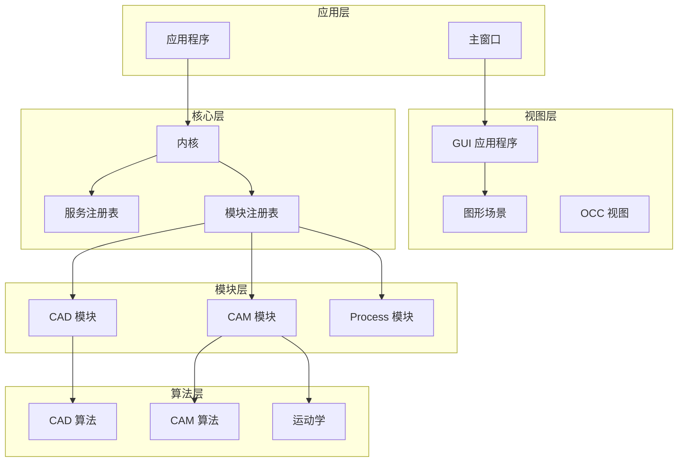
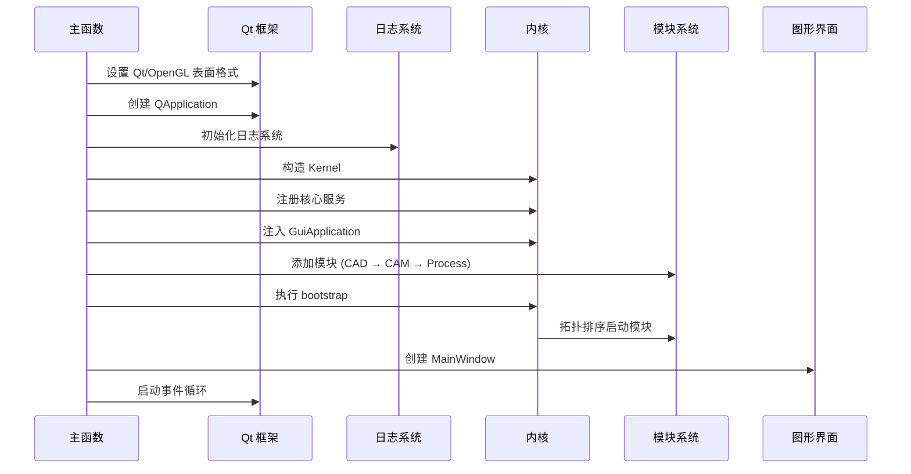
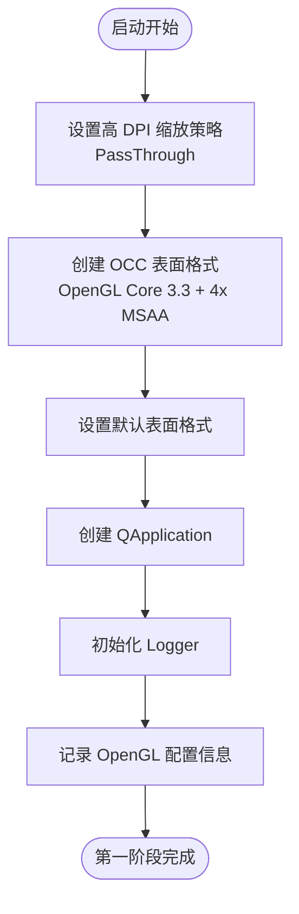
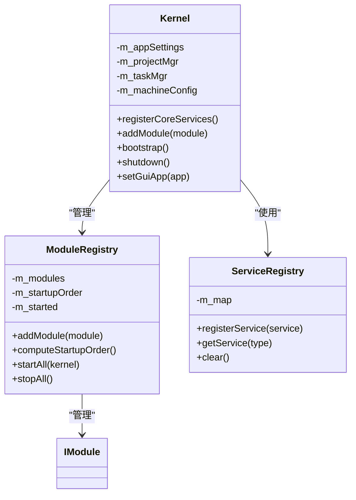
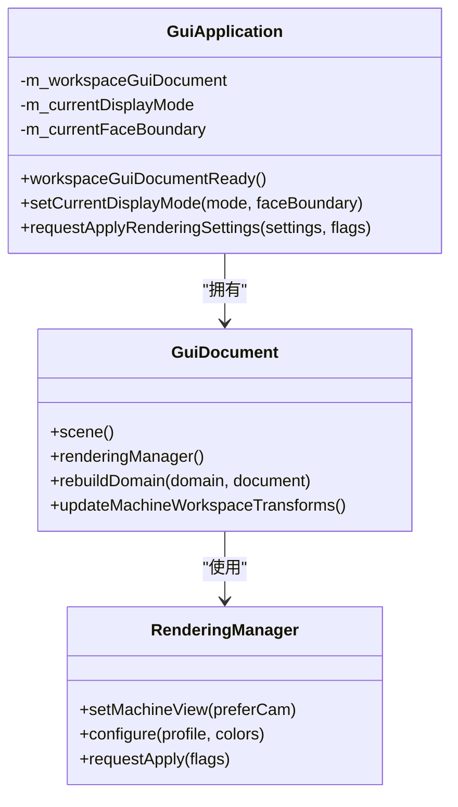
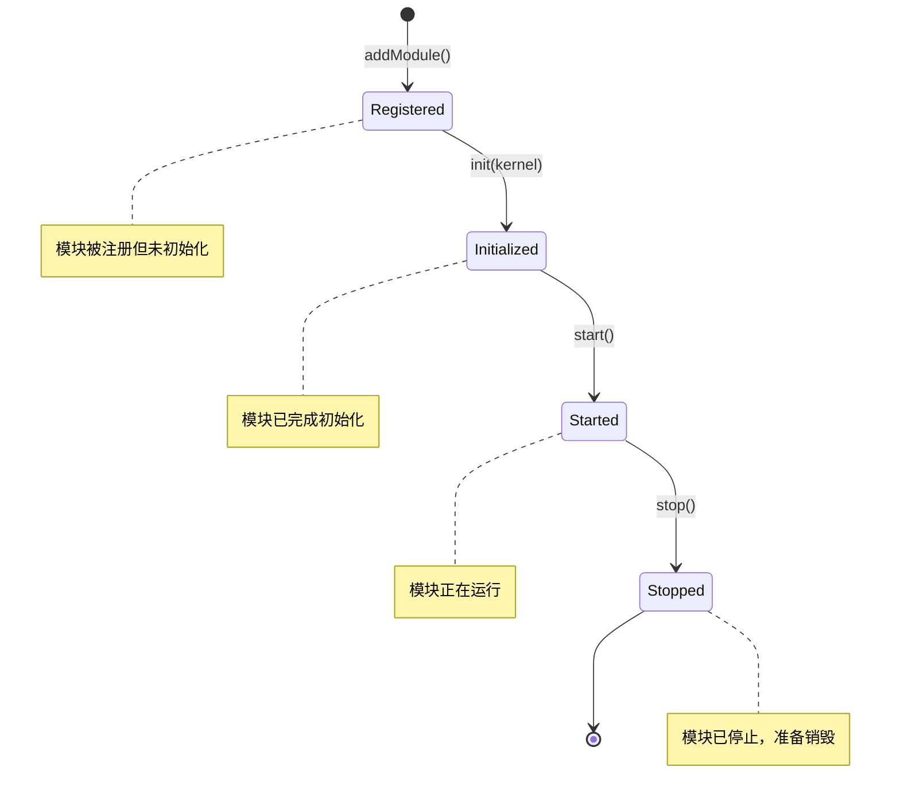
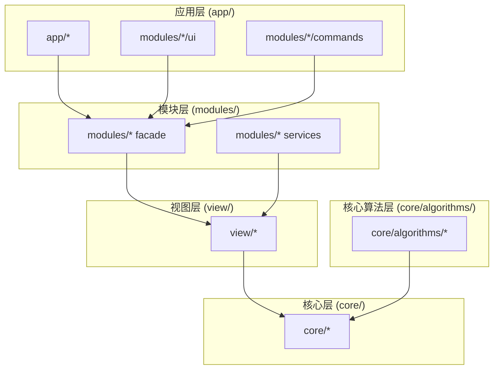
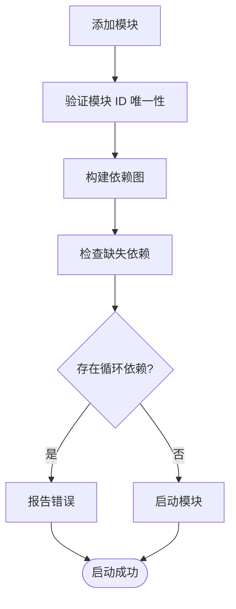

# 启动初始化序列

<cite>
**本文档引用的文件**
- [main.cpp](file://src/main.cpp)
- [CLAUDE.md](file://CLAUDE.md)
- [kernel.cpp](file://src/core/kernel/kernel.cpp)
- [module_registry.cpp](file://src/core/kernel/module_registry.cpp)
- [logger.cpp](file://src/core/logging/logger.cpp)
- [gui_application.cpp](file://src/view/gui_application.cpp)
- [main_window.cpp](file://src/app/main_window.cpp)
- [cad_module.cpp](file://src/modules/cad/cad_module.cpp)
- [cam_module.cpp](file://src/modules/cam/cam_module.cpp)
</cite>

## 目录
1. [简介](#简介)
2. [项目结构](#项目结构)
3. [核心组件](#核心组件)
4. [架构概览](#架构概览)
5. [详细组件分析](#详细组件分析)
6. [依赖关系分析](#依赖关系分析)
7. [性能考虑](#性能考虑)
8. [故障排除指南](#故障排除指南)
9. [结论](#结论)

## 简介

LaserCNC 是一个基于 Qt 和 OpenCASCADE 的五轴激光加工 CAM 软件。本文档详细分析了应用程序的启动初始化序列，从 Qt 表面格式设置到应用退出的完整流程。该系统采用微内核架构，通过模块化设计实现 CAD、CAM 和 Process 三个核心领域的分离。

## 项目结构

LaserCNC 采用分层架构设计，主要包含以下层次：



**图表来源**
- [main.cpp:33-135](file://src/main.cpp#L33-L135)
- [kernel.cpp:16-105](file://src/core/kernel/kernel.cpp#L16-L105)

## 核心组件

### Qt/OpenGL 表面格式设置

Qt/OpenGL 表面格式必须在 QApplication 创建之前设置，这是确保 OpenCASCADE 正常工作的关键要求。系统配置了以下 OpenGL 参数：

- **渲染类型**: OpenGL Core Profile
- **版本**: 3.3
- **深度缓冲**: 24 位
- **模板缓冲**: 8 位
- **多重采样**: 4x
- **交换行为**: 双缓冲
- **交换间隔**: 1

### Logger 初始化

Logger 使用 spdlog 作为底层日志库，提供多级日志记录功能：

- **文件日志**: 5MB 分割，保留 5 个文件
- **控制台日志**: 彩色输出
- **MSVC 日志**: Windows 平台调试输出
- **级别控制**: 调试模式下每条消息立即刷新，发布模式下警告级别以上刷新

### Kernel 架构

Kernel 是系统的全局入口点，负责管理核心服务和模块生命周期：

- **AppSettings**: 应用程序配置管理
- **LcncProjectManager**: 项目管理器
- **TaskManager**: 任务管理器
- **MachineConfigurationService**: 机器配置服务
- **ServiceRegistry**: 服务注册表
- **EventBus**: 事件总线

**章节来源**
- [main.cpp:17-29](file://src/main.cpp#L17-L29)
- [logger.cpp:44-95](file://src/core/logging/logger.cpp#L44-L95)
- [kernel.cpp:51-76](file://src/core/kernel/kernel.cpp#L51-L76)

## 架构概览

LaserCNC 采用微内核 + 模块化的设计模式，实现了严格的分层依赖关系：



**图表来源**
- [main.cpp:33-135](file://src/main.cpp#L33-L135)
- [CLAUDE.md:56-66](file://CLAUDE.md#L56-L66)

## 详细组件分析

### 启动序列详解

#### 第一阶段：Qt/OpenGL 配置

系统必须在创建任何原生窗口之前设置 Qt/OpenGL 表面格式：



**图表来源**
- [main.cpp:35-66](file://src/main.cpp#L35-L66)

#### 第二阶段：内核初始化

内核负责注册核心服务并管理模块生命周期：



**图表来源**
- [kernel.cpp:16-105](file://src/core/kernel/kernel.cpp#L16-L105)
- [module_registry.cpp:12-211](file://src/core/kernel/module_registry.cpp#L12-L211)

#### 第三阶段：模块注册与启动

系统采用拓扑排序确保模块依赖关系正确处理：

```mermaid
flowchart LR
subgraph "模块依赖图"
CAD[CAD 模块] --> CAM[CAM 模块]
CAM --> PROCESS[Process 模块]
end
subgraph "启动顺序"
A[注册 CAD 模块] --> B[注册 CAM 模块]
B --> C[注册 Process 模块]
C --> D[执行拓扑排序]
D --> E[init() 阶段]
E --> F[start() 阶段]
end
```

**图表来源**
- [main.cpp:86-108](file://src/main.cpp#L86-L108)
- [module_registry.cpp:33-108](file://src/core/kernel/module_registry.cpp#L33-L108)

#### 第四阶段：GUI 应用程序初始化

GuiApplication 作为视图层的核心组件，负责管理图形界面：



**图表来源**
- [gui_application.cpp:16-89](file://src/view/gui_application.cpp#L16-L89)

**章节来源**
- [main.cpp:75-117](file://src/main.cpp#L75-L117)
- [kernel.cpp:51-92](file://src/core/kernel/kernel.cpp#L51-L92)

### 模块生命周期管理

每个模块都实现了标准化的生命周期接口：



**图表来源**
- [module_registry.cpp:110-188](file://src/core/kernel/module_registry.cpp#L110-L188)

**章节来源**
- [cad_module.cpp:429-470](file://src/modules/cad/cad_module.cpp#L429-L470)
- [cam_module.cpp:211-252](file://src/modules/cam/cam_module.cpp#L211-L252)

## 依赖关系分析

### 模块依赖图

系统采用严格的单向依赖关系，确保各层之间的清晰边界：



**图表来源**
- [CLAUDE.md:34-48](file://CLAUDE.md#L34-L48)

### 依赖检查机制

系统在模块启动时进行依赖验证，防止循环依赖和缺失依赖：



**图表来源**
- [module_registry.cpp:33-108](file://src/core/kernel/module_registry.cpp#L33-L108)

**章节来源**
- [module_registry.cpp:33-108](file://src/core/kernel/module_registry.cpp#L33-L108)

## 性能考虑

### 启动性能优化

1. **延迟初始化**: 核心服务在需要时才初始化
2. **异步加载**: 大型模块采用异步启动策略
3. **内存管理**: 使用智能指针避免内存泄漏
4. **资源池**: 重复使用的对象通过池化减少分配开销

### 运行时性能监控

系统提供了详细的性能监控机制：

- **模块启动时间**: 记录每个模块的初始化耗时
- **内存使用情况**: 监控核心服务和模块的内存占用
- **OpenGL 性能**: 监控渲染帧率和 GPU 使用情况

## 故障排除指南

### 常见启动失败原因

#### 1. Qt/OpenGL 配置问题

**症状**: 应用程序启动后立即崩溃或显示空白窗口

**诊断步骤**:
1. 检查 OpenGL 版本是否支持 3.3 Core Profile
2. 验证显卡驱动程序版本
3. 确认多重采样设置兼容性

**解决方案**:
- 降级到兼容的 OpenGL 版本
- 更新显卡驱动程序
- 调整多重采样参数

#### 2. 模块依赖冲突

**症状**: 模块启动时出现依赖错误或循环依赖警告

**诊断步骤**:
1. 检查模块 ID 是否唯一
2. 验证依赖声明的准确性
3. 确认依赖模块是否正确注册

**解决方案**:
- 修正模块 ID 或依赖声明
- 确保依赖模块在当前模块之前注册
- 移除循环依赖关系

#### 3. 内核初始化异常

**症状**: 内核构造失败或服务注册失败

**诊断步骤**:
1. 检查核心服务的依赖关系
2. 验证服务注册表的状态
3. 确认内存分配是否成功

**解决方案**:
- 修复服务依赖链
- 清理内存资源
- 重新初始化内核

#### 4. 日志系统故障

**症状**: 应用程序无法生成日志文件或日志输出异常

**诊断步骤**:
1. 检查日志目录权限
2. 验证文件系统空间
3. 确认 spdlog 配置正确性

**解决方案**:
- 授予日志目录写权限
- 清理磁盘空间
- 重新配置日志参数

**章节来源**
- [logger.cpp:44-95](file://src/core/logging/logger.cpp#L44-L95)
- [module_registry.cpp:115-156](file://src/core/kernel/module_registry.cpp#L115-L156)

### 调试技巧

#### 启动日志分析

系统提供了详细的启动日志，包括：

- **OpenGL 配置信息**: 版本、缓冲区大小、采样数等
- **模块启动顺序**: 按拓扑排序的实际启动顺序
- **服务注册详情**: 核心服务和模块服务的注册状态
- **错误堆栈跟踪**: 异常发生时的完整调用栈

#### 性能分析工具

推荐使用以下工具进行性能分析：

1. **Qt Creator Profiler**: 分析内存使用和 CPU 占用
2. **Visual Studio Diagnostic Tools**: Windows 平台的性能分析
3. **GPU-Z**: 显卡性能监控
4. **Process Monitor**: 系统调用和文件访问监控

## 结论

LaserCNC 的启动初始化序列体现了现代桌面应用程序的最佳实践。通过严格的启动顺序、模块化设计和完善的错误处理机制，系统确保了稳定可靠的启动过程。

关键成功因素包括：

1. **严格的启动顺序**: Qt/OpenGL 配置必须在 QApplication 之前完成
2. **模块化架构**: 通过拓扑排序确保模块依赖关系正确处理
3. **完善的日志系统**: 提供详细的启动信息和错误诊断
4. **健壮的错误处理**: 包容性的异常处理和回滚机制

这种设计不仅提高了系统的稳定性，还为未来的功能扩展提供了良好的基础。开发者可以基于现有的启动框架轻松添加新的模块和服务，而无需修改核心启动逻辑。