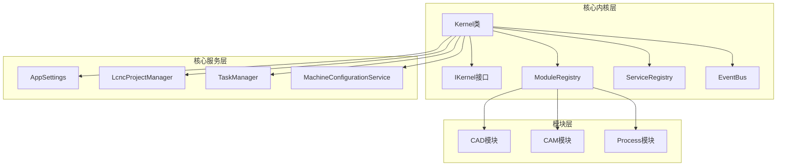
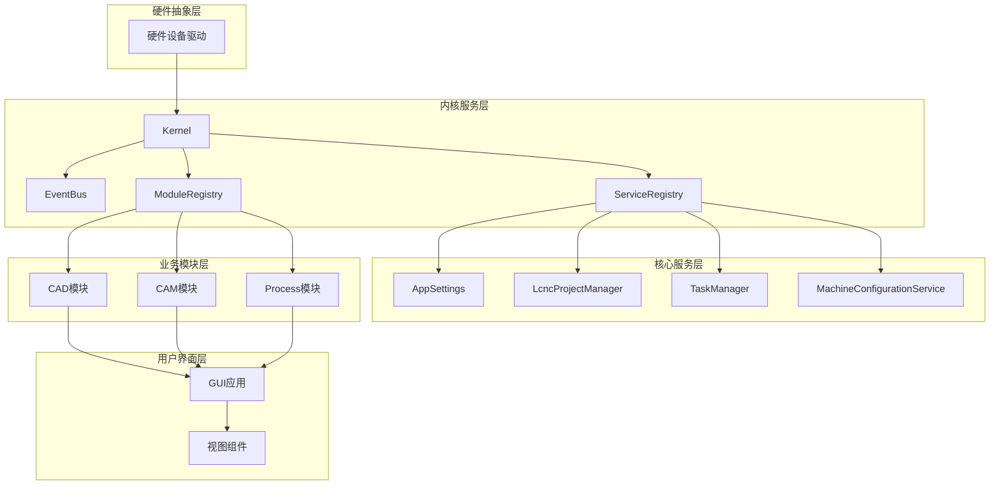
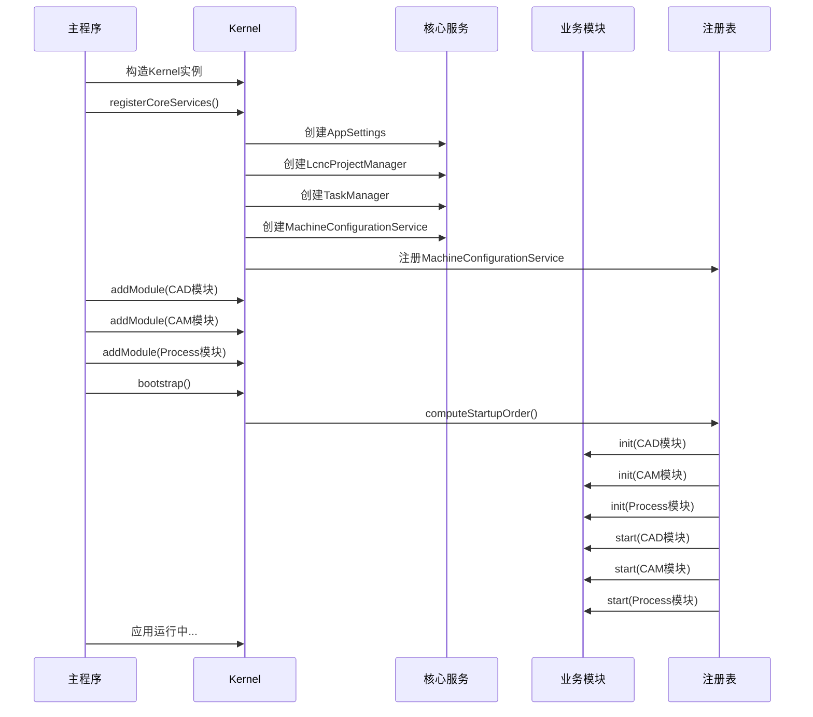
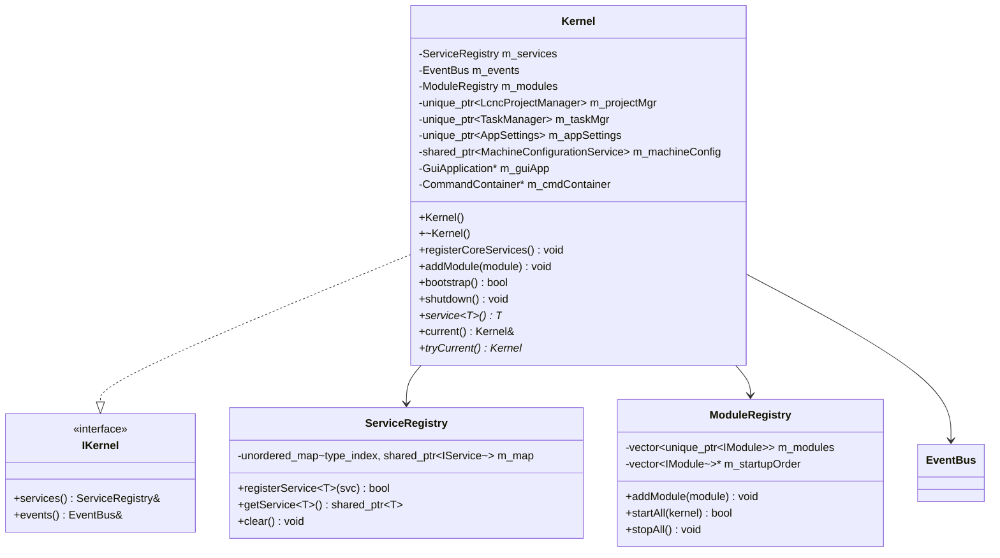
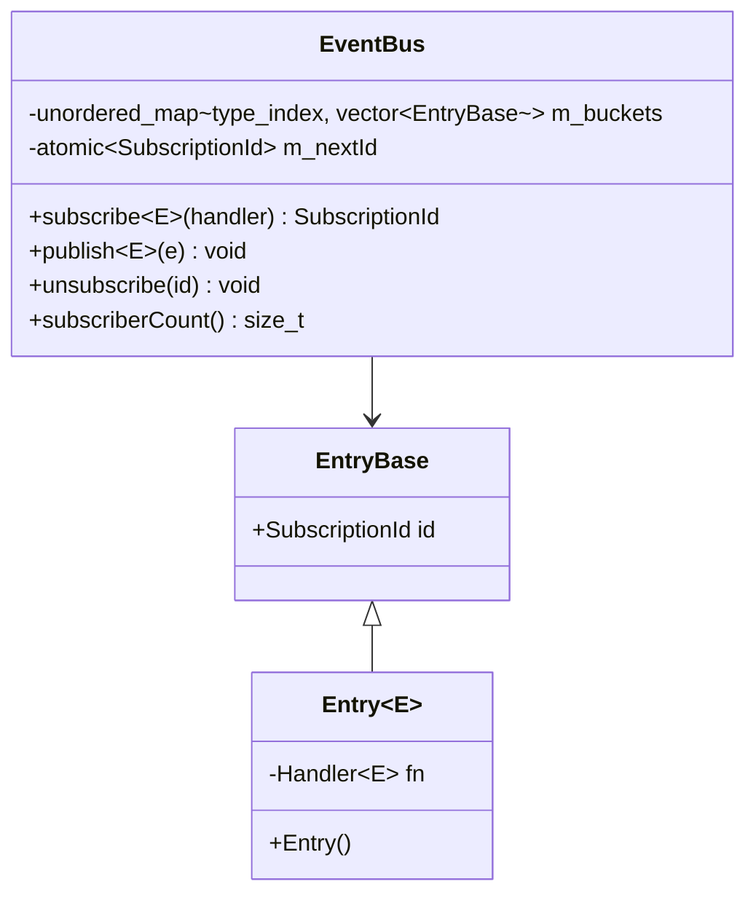
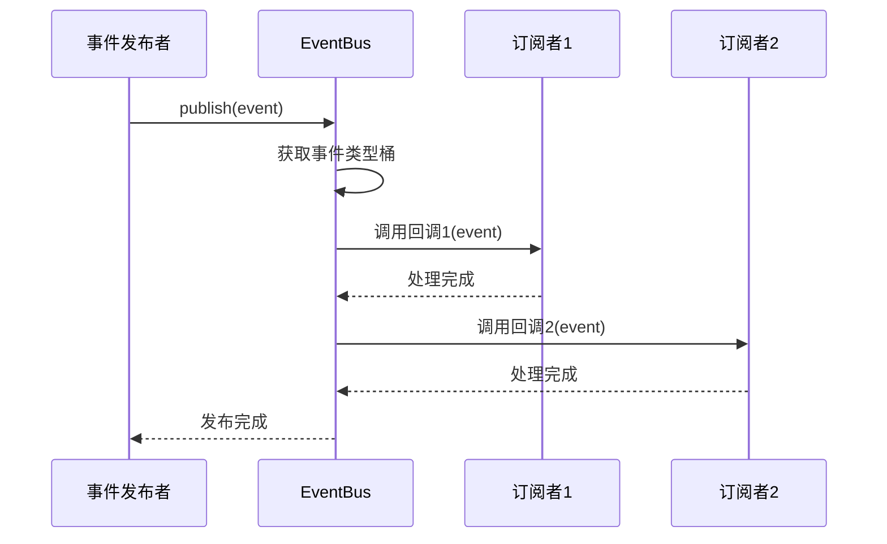
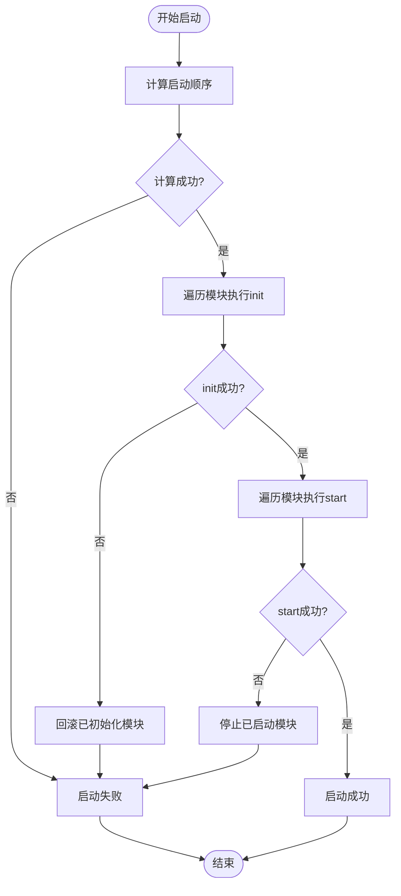
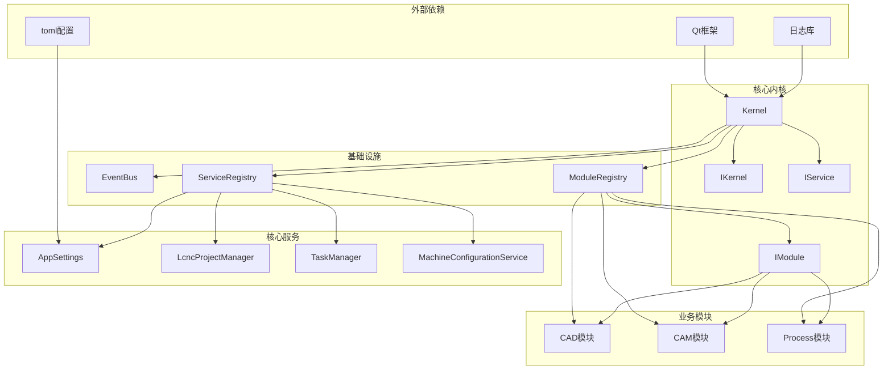

# 微内核架构设计

<cite>
**本文档引用的文件**
- [kernel.h](file://src/core/kernel/kernel.h)
- [kernel.cpp](file://src/core/kernel/kernel.cpp)
- [i_kernel.h](file://src/core/kernel/i_kernel.h)
- [module_registry.h](file://src/core/kernel/module_registry.h)
- [module_registry.cpp](file://src/core/kernel/module_registry.cpp)
- [service_registry.h](file://src/core/kernel/service_registry.h)
- [service_registry.cpp](file://src/core/kernel/service_registry.cpp)
- [event_bus.h](file://src/core/kernel/event_bus.h)
- [event_bus.cpp](file://src/core/kernel/event_bus.cpp)
- [i_module.h](file://src/core/kernel/i_module.h)
- [i_service.h](file://src/core/kernel/i_service.h)
- [app_settings.h](file://src/core/settings/app_settings.h)
- [lcnc_project_manager.h](file://src/core/project/lcnc_project_manager.h)
- [task_manager.h](file://src/core/task/task_manager.h)
- [machine_configuration_service.h](file://src/core/kinematics/machine_configuration_service.h)
</cite>

## 目录
1. [简介](#简介)
2. [项目结构](#项目结构)
3. [核心组件](#核心组件)
4. [架构概览](#架构概览)
5. [详细组件分析](#详细组件分析)
6. [依赖分析](#依赖分析)
7. [性能考虑](#性能考虑)
8. [故障排除指南](#故障排除指南)
9. [结论](#结论)

## 简介

LaserCNC采用微内核架构设计，通过Kernel作为全局唯一入口点来管理整个应用程序的生命周期。这种架构相比传统单体架构具有显著优势：

- **模块解耦**：每个功能模块都是独立的插件，通过标准接口进行通信
- **独立开发**：模块可以独立开发、测试和部署
- **热插拔支持**：模块可以在运行时动态加载和卸载
- **松耦合通信**：通过事件总线和依赖注入实现模块间通信
- **可扩展性**：新的功能模块可以轻松添加到系统中

微内核架构的核心理念是将通用基础设施抽象为内核，而具体的业务功能作为模块插件形式存在，实现了关注点分离和高度的模块化。

## 项目结构

LaserCNC的微内核架构主要分布在以下目录结构中：

**图表来源**
- [kernel.h:18-36](file://src/core/kernel/kernel.h#L18-L36)
- [module_registry.h:15-29](file://src/core/kernel/module_registry.h#L15-L29)

**章节来源**
- [kernel.h:1-149](file://src/core/kernel/kernel.h#L1-L149)
- [module_registry.h:1-64](file://src/core/kernel/module_registry.h#L1-L64)

## 核心组件

### Kernel类设计

Kernel是微内核架构的中央协调者，承担着以下职责：

1. **全局唯一入口点**：作为进程内的唯一全局对象，提供统一的访问接口
2. **核心服务管理**：注册和管理AppSettings、LcncProjectManager、TaskManager等核心服务
3. **模块生命周期管理**：负责模块的注册、启动、停止和清理
4. **依赖注入容器**：通过ServiceRegistry提供服务发现和依赖注入
5. **事件通信中枢**：通过EventBus实现模块间的松耦合通信

Kernel的设计遵循单一职责原则，不直接持有业务状态，所有模块和服务都可以独立替换或裁剪。

### 服务注册机制

ServiceRegistry提供了基于类型的轻量级服务注册和发现机制：

- **类型安全**：使用std::type_index确保类型安全的注册和查找
- **共享所有权**：服务实例使用std::shared_ptr管理生命周期
- **线程安全**：当前实现假设注册在主线程进行，查询阶段也以主线程为主
- **无异常设计**：失败时返回空指针或false，通过日志记录错误信息

### 模块管理系统

ModuleRegistry实现了模块的完整生命周期管理：

- **拓扑排序**：根据模块依赖关系进行拓扑排序，确保正确的初始化顺序
- **启动调度**：顺序调用模块的init→start阶段
- **回滚机制**：任一模块初始化失败时，自动回滚已初始化的模块
- **反向清理**：shutdown时按相反顺序停止模块并清理资源

**章节来源**
- [kernel.h:37-146](file://src/core/kernel/kernel.h#L37-L146)
- [kernel.cpp:51-102](file://src/core/kernel/kernel.cpp#L51-L102)
- [service_registry.h:12-68](file://src/core/kernel/service_registry.h#L12-L68)

## 架构概览

LaserCNC的微内核架构采用分层设计，从下到上分别为：

**图表来源**
- [i_kernel.h:10-25](file://src/core/kernel/i_kernel.h#L10-L25)
- [module_registry.h:15-29](file://src/core/kernel/module_registry.h#L15-L29)

### 初始化流程

微内核的启动流程严格按照预定义的顺序执行：

**图表来源**
- [kernel.cpp:51-92](file://src/core/kernel/kernel.cpp#L51-L92)
- [module_registry.cpp:110-187](file://src/core/kernel/module_registry.cpp#L110-L187)

**章节来源**
- [kernel.cpp:16-102](file://src/core/kernel/kernel.cpp#L16-L102)
- [module_registry.cpp:110-187](file://src/core/kernel/module_registry.cpp#L110-L187)

## 详细组件分析

### Kernel类详细分析

Kernel类是微内核架构的核心，采用了多种设计模式来实现其功能：

**图表来源**
- [kernel.h:37-146](file://src/core/kernel/kernel.h#L37-L146)
- [i_kernel.h:26-34](file://src/core/kernel/i_kernel.h#L26-L34)
- [service_registry.h:26-68](file://src/core/kernel/service_registry.h#L26-L68)
- [module_registry.h:30-61](file://src/core/kernel/module_registry.h#L30-L61)

#### 依赖注入模式

Kernel通过依赖注入模式管理模块生命周期：

1. **构造时注入**：模块在构造时接收Kernel引用
2. **运行时解析**：模块通过Kernel.services()获取所需服务
3. **弱引用管理**：建议模块保存weak_ptr而不是raw pointer
4. **生命周期隔离**：Kernel负责服务的创建和销毁

### 事件总线系统

EventBus实现了类型化的发布/订阅模式：

**图表来源**
- [event_bus.h:46-89](file://src/core/kernel/event_bus.h#L46-L89)

#### 事件处理流程

**图表来源**
- [event_bus.cpp:119-155](file://src/core/kernel/event_bus.cpp#L119-L155)

**章节来源**
- [kernel.h:118-130](file://src/core/kernel/kernel.h#L118-L130)
- [event_bus.h:24-45](file://src/core/kernel/event_bus.h#L24-L45)
- [event_bus.cpp:93-155](file://src/core/kernel/event_bus.cpp#L93-L155)

### 模块注册表

ModuleRegistry实现了复杂的模块生命周期管理：

**图表来源**
- [module_registry.cpp:33-108](file://src/core/kernel/module_registry.cpp#L33-L108)
- [module_registry.cpp:110-187](file://src/core/kernel/module_registry.cpp#L110-L187)

**章节来源**
- [module_registry.h:15-29](file://src/core/kernel/module_registry.h#L15-L29)
- [module_registry.cpp:110-187](file://src/core/kernel/module_registry.cpp#L110-L187)

## 依赖分析

微内核架构的依赖关系呈现星型结构，Kernel位于中心位置：

**图表来源**
- [kernel.h:8-17](file://src/core/kernel/kernel.h#L8-L17)
- [i_kernel.h:8-25](file://src/core/kernel/i_kernel.h#L8-L25)
- [i_module.h:20-48](file://src/core/kernel/i_module.h#L20-L48)

### 模块间通信机制

微内核架构通过多种机制实现模块间的松耦合通信：

1. **事件总线**：模块通过EventBus发布和订阅类型化事件
2. **服务注册表**：模块通过ServiceRegistry注册和获取服务
3. **依赖声明**：模块通过ModuleInfo.dependencies声明依赖关系
4. **接口契约**：所有服务接口继承自IService，确保类型安全

**章节来源**
- [i_service.h:19-25](file://src/core/kernel/i_service.h#L19-L25)
- [i_module.h:10-26](file://src/core/kernel/i_module.h#L10-L26)

## 性能考虑

微内核架构在性能方面具有以下特点：

### 启动性能
- **延迟启动**：模块按需启动，避免一次性加载所有功能
- **并行初始化**：模块初始化过程可以并行执行（取决于具体实现）
- **内存效率**：服务实例共享所有权，避免重复内存分配

### 运行时性能
- **事件处理**：EventBus使用类型索引快速定位订阅者
- **服务查找**：ServiceRegistry基于哈希表实现O(1)平均查找复杂度
- **模块通信**：事件驱动的异步通信避免阻塞调用

### 内存管理
- **智能指针**：广泛使用std::shared_ptr和std::unique_ptr管理生命周期
- **弱引用**：推荐使用std::weak_ptr避免循环引用
- **延迟加载**：服务按需创建，减少初始内存占用

## 故障排除指南

### 常见问题及解决方案

#### 模块启动失败
**症状**：应用启动时某些模块无法初始化
**原因分析**：
1. 模块依赖关系配置错误
2. 模块init方法抛出异常
3. 依赖的服务未正确注册

**解决步骤**：
1. 检查ModuleInfo.dependencies配置
2. 查看模块init方法的异常日志
3. 确认依赖服务已在registerCoreServices中注册

#### 事件订阅问题
**症状**：模块无法收到预期的事件
**排查方法**：
1. 确认事件类型定义为轻量值类型
2. 检查订阅句柄是否有效
3. 验证事件发布时机

#### 服务获取失败
**症状**：模块无法获取所需服务
**解决方法**：
1. 确认服务已在ServiceRegistry中注册
2. 检查服务接口类型是否正确
3. 验证模块启动顺序是否正确

**章节来源**
- [module_registry.cpp:127-157](file://src/core/kernel/module_registry.cpp#L127-L157)
- [event_bus.cpp:93-155](file://src/core/kernel/event_bus.cpp#L93-L155)
- [service_registry.cpp:7-15](file://src/core/kernel/service_registry.cpp#L7-L15)

## 结论

LaserCNC的微内核架构通过Kernel作为全局唯一入口点，成功实现了模块化、可扩展的应用程序设计。该架构的主要优势包括：

1. **高度模块化**：每个功能模块都是独立的插件，可以独立开发和维护
2. **松耦合通信**：通过事件总线和依赖注入实现模块间通信
3. **灵活的生命周期管理**：支持模块的动态加载和卸载
4. **类型安全**：基于模板的类型系统确保编译时类型安全
5. **易于测试**：服务接口的抽象化便于单元测试和模拟

微内核架构为LaserCNC提供了强大的扩展能力和良好的维护性，使得新功能可以快速集成，同时保持系统的稳定性和性能。通过合理的依赖管理和事件驱动通信机制，该架构能够支持复杂工业应用的需求。