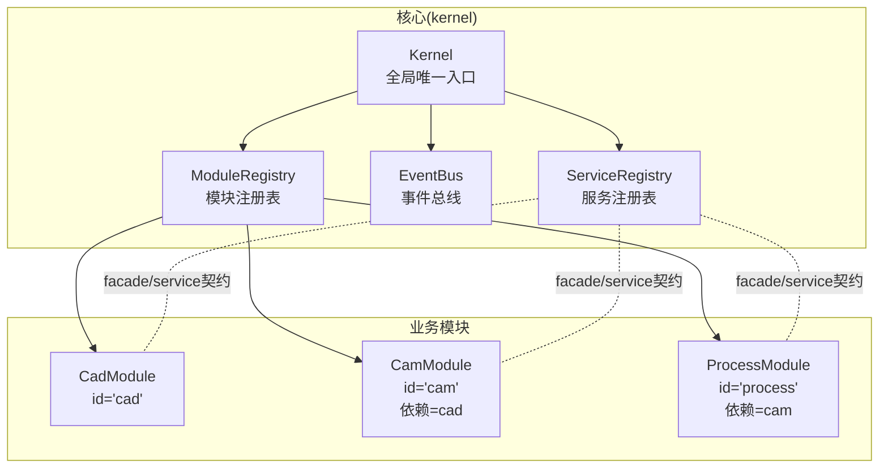
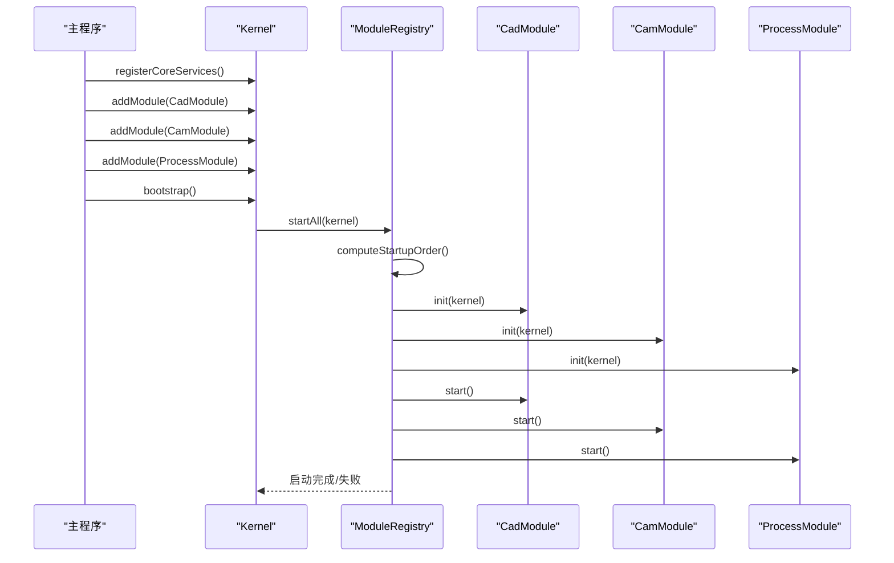
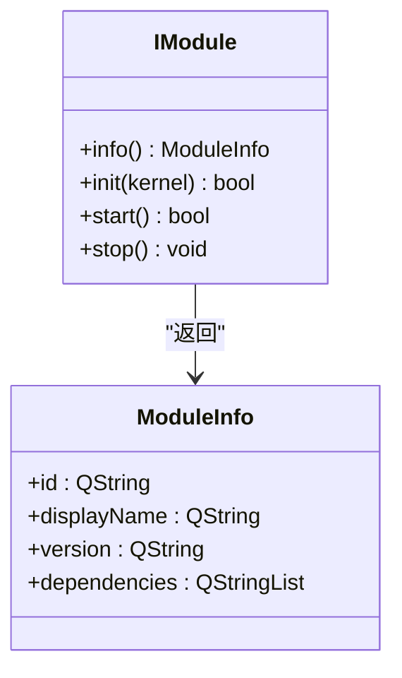
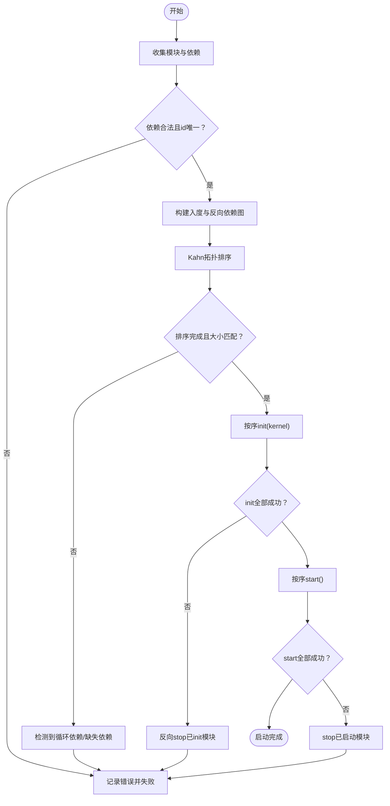
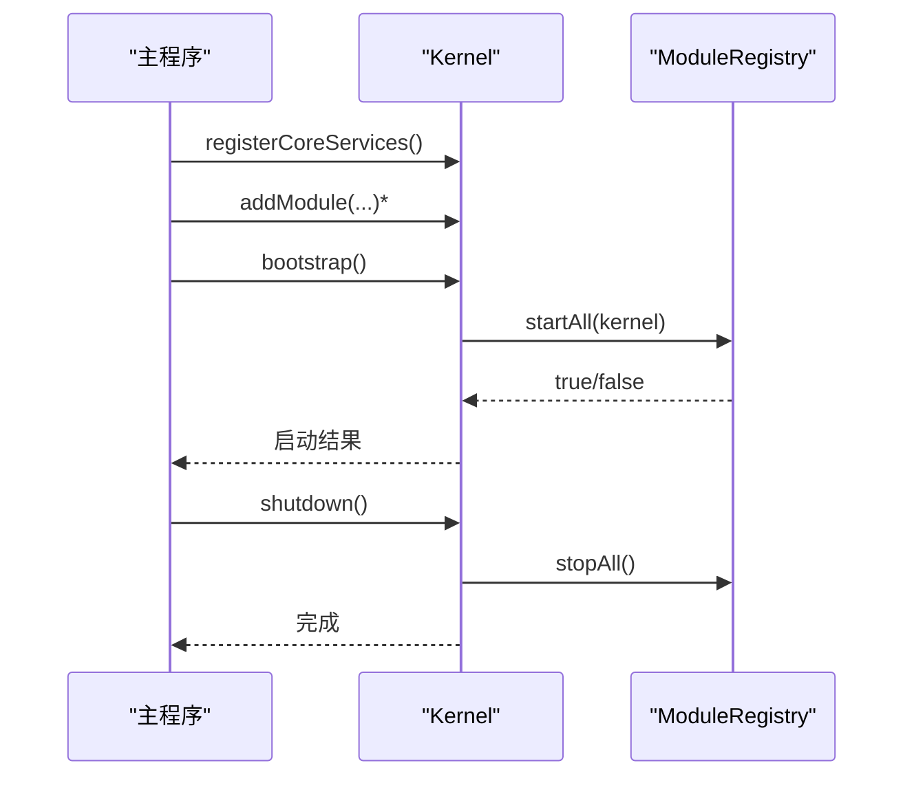
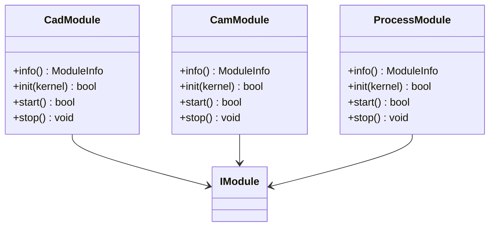
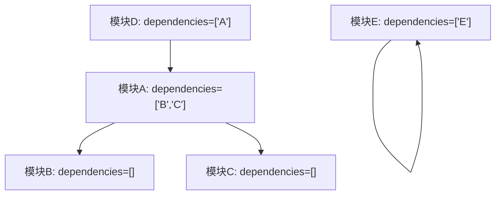
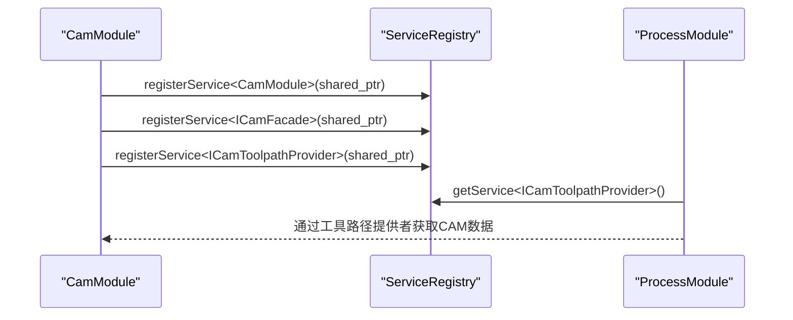
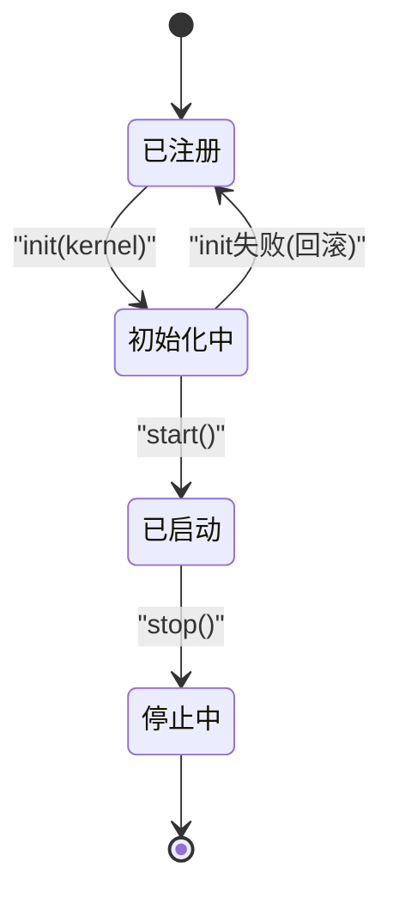
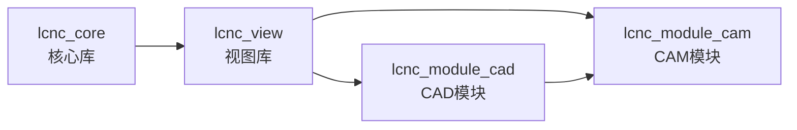

# 模块生命周期管理

<cite>
**本文档引用的文件**
- [CMakeLists.txt](file://CMakeLists.txt)
- [main.cpp](file://src/main.cpp)
- [i_module.h](file://src/core/kernel/i_module.h)
- [module_registry.h](file://src/core/kernel/module_registry.h)
- [module_registry.cpp](file://src/core/kernel/module_registry.cpp)
- [kernel.h](file://src/core/kernel/kernel.h)
- [kernel.cpp](file://src/core/kernel/kernel.cpp)
- [cad_module.h](file://src/modules/cad/cad_module.h)
- [cad_module.cpp](file://src/modules/cad/cad_module.cpp)
- [cam_module.h](file://src/modules/cam/cam_module.h)
- [cam_module.cpp](file://src/modules/cam/cam_module.cpp)
- [process_module.h](file://src/modules/process/process_module.h)
- [process_module.cpp](file://src/modules/process/process_module.cpp)
</cite>

## 更新摘要
**所做更改**
- 新增构建系统对模块生命周期管理的影响分析
- 更新模块化静态库架构对模块隔离和依赖管理的改进
- 增强启动顺序控制和模块卸载处理的说明
- 补充新的构建系统对模块间依赖解析的支持

## 目录
1. [简介](#简介)
2. [项目结构](#项目结构)
3. [核心组件](#核心组件)
4. [架构总览](#架构总览)
5. [详细组件分析](#详细组件分析)
6. [构建系统影响分析](#构建系统影响分析)
7. [依赖分析](#依赖分析)
8. [性能考虑](#性能考虑)
9. [故障排除指南](#故障排除指南)
10. [结论](#结论)

## 简介
本文件系统性阐述LaserCNC微内核框架中的模块生命周期管理机制，围绕IModule接口设计与四个核心方法（info()、init(kernel)、start()、stop()）的职责与调用时机展开；详解ModuleRegistry的拓扑排序算法与依赖解析策略；梳理模块注册、初始化、启动与停止的完整流程及错误处理与回滚机制；说明模块间依赖声明与解析过程，以及通过facade/service契约实现的跨模块通信方式；最后给出模块生命周期状态转换图与启动顺序控制示例，覆盖模块启动失败与卸载场景。

**更新** 新的构建系统通过模块化静态库架构提供了更好的模块隔离和依赖管理，支持更清晰的模块启动顺序控制。

## 项目结构
LaserCNC采用微内核架构，核心位于src/core/kernel目录，业务模块位于src/modules下，分别对应CAD、CAM、Process三个域。Kernel作为全局唯一入口，承载服务注册表、事件总线与模块注册表；各业务模块实现IModule接口，声明自身依赖并通过服务注册表进行跨模块协作。

**图表来源**
- [kernel.h:37-149](file://src/core/kernel/kernel.h#L37-L149)
- [module_registry.h:30-64](file://src/core/kernel/module_registry.h#L30-L64)
- [cad_module.h:45-307](file://src/modules/cad/cad_module.h#L45-L307)
- [cam_module.h:64-422](file://src/modules/cam/cam_module.h#L64-L422)
- [process_module.h:35-132](file://src/modules/process/process_module.h#L35-L132)

**章节来源**
- [kernel.h:18-36](file://src/core/kernel/kernel.h#L18-L36)
- [module_registry.h:15-29](file://src/core/kernel/module_registry.h#L15-L29)

## 核心组件
- IModule接口：定义模块元信息与生命周期方法，确保模块以声明式方式表达依赖与行为。
- ModuleRegistry：负责收集模块、基于依赖信息进行拓扑排序、顺序执行init/start，并在失败时进行回滚。
- Kernel：微内核唯一入口，注册核心服务、收集业务模块、触发bootstrap并管理shutdown。
- 业务模块：CadModule、CamModule、ProcessModule分别实现IModule，声明依赖并提供facade/service接口。

**章节来源**
- [i_module.h:49-76](file://src/core/kernel/i_module.h#L49-L76)
- [module_registry.h:30-64](file://src/core/kernel/module_registry.h#L30-L64)
- [kernel.h:37-149](file://src/core/kernel/kernel.h#L37-L149)

## 架构总览
微内核通过Kernel集中管理模块生命周期，模块通过ServiceRegistry暴露facade/service接口，实现跨模块松耦合通信。启动顺序由ModuleRegistry根据模块依赖自动确定，确保依赖先于被依赖模块完成初始化与启动。

**图表来源**
- [kernel.cpp:51-92](file://src/core/kernel/kernel.cpp#L51-L92)
- [module_registry.cpp:110-188](file://src/core/kernel/module_registry.cpp#L110-L188)
- [cad_module.cpp:439-459](file://src/modules/cad/cad_module.cpp#L439-L459)
- [cam_module.cpp:221-244](file://src/modules/cam/cam_module.cpp#L221-L244)
- [process_module.cpp:155-218](file://src/modules/process/process_module.cpp#L155-L218)

## 详细组件分析

### IModule接口与生命周期方法
- info()：返回模块元信息，包含id、显示名、版本与依赖列表。依赖用于拓扑排序与启动顺序控制。
- init(kernel)：模块注册阶段，向ServiceRegistry注册自身服务与facade接口，订阅事件、注册命令等；不应在此阶段操作其他模块业务。
- start()：激活阶段，所有依赖均已init完成；可发布"模块就绪"事件、加载默认数据等。
- stop()：反向释放阶段，取消订阅、注销服务、释放资源；允许在init阶段保存的内核引用在stop中使用。

**图表来源**
- [i_module.h:20-76](file://src/core/kernel/i_module.h#L20-L76)

**章节来源**
- [i_module.h:28-73](file://src/core/kernel/i_module.h#L28-L73)

### ModuleRegistry拓扑排序与启动流程
- 模块收集：addModule接收模块所有权，记录到内部容器。
- 依赖解析：遍历模块info().dependencies，构建入度(inDeg)与反向依赖(reverseDeps)映射，校验依赖存在性与唯一id。
- 拓扑排序：Kahn算法，入度为0的节点优先，稳定排序避免不确定性；若最终结果数量小于模块总数，判定存在循环依赖。
- 启动顺序：按拓扑序执行init(kernel)，随后执行start()。
- 回滚策略：
  - init阶段失败：反向stop已init模块。
  - start阶段失败：stop已启动模块，保留init状态便于诊断。
- 查询与状态：find按id查找模块；size返回注册数；m_initialized标记是否完成启动。

**图表来源**
- [module_registry.cpp:33-108](file://src/core/kernel/module_registry.cpp#L33-L108)
- [module_registry.cpp:110-188](file://src/core/kernel/module_registry.cpp#L110-L188)

**章节来源**
- [module_registry.h:15-64](file://src/core/kernel/module_registry.h#L15-L64)
- [module_registry.cpp:12-23](file://src/core/kernel/module_registry.cpp#L12-L23)
- [module_registry.cpp:33-108](file://src/core/kernel/module_registry.cpp#L33-L108)
- [module_registry.cpp:110-188](file://src/core/kernel/module_registry.cpp#L110-L188)

### Kernel启动与关闭流程
- registerCoreServices：注册AppSettings、LcncProjectManager、TaskManager、MachineConfigurationService等核心服务。
- addModule：委托ModuleRegistry收集模块。
- bootstrap：触发ModuleRegistry::startAll，记录日志并返回结果。
- shutdown：调用ModuleRegistry::stopAll，清空服务注册表，释放核心对象。

**图表来源**
- [kernel.cpp:51-102](file://src/core/kernel/kernel.cpp#L51-L102)

**章节来源**
- [kernel.h:52-106](file://src/core/kernel/kernel.h#L52-L106)
- [kernel.cpp:51-102](file://src/core/kernel/kernel.cpp#L51-L102)

### 业务模块实现与依赖声明
- CadModule
  - info(): id="cad"，无依赖。
  - init(): 注册服务与facade接口，建立与项目域的信号连接。
  - start()/stop(): 占位实现，stop中清理初始化标记。
- CamModule
  - info(): id="cam"，依赖["cad"]。
  - init(): 注册服务、facade与工具路径提供者，暴露MachinePose共享服务。
  - start()/stop(): 占位实现。
- ProcessModule
  - info(): id="process"，依赖["cam"]。
  - init(): 注册服务与facade，创建仿真运动控制器与工作流执行器，监听执行器消息与状态变化。
  - start()/stop(): 占位实现，stop中停止控制器与执行器。

**图表来源**
- [cad_module.h:45-307](file://src/modules/cad/cad_module.h#L45-L307)
- [cam_module.h:64-422](file://src/modules/cam/cam_module.h#L64-L422)
- [process_module.h:35-132](file://src/modules/process/process_module.h#L35-L132)

**章节来源**
- [cad_module.h:120-129](file://src/modules/cad/cad_module.h#L120-L129)
- [cam_module.h:108-114](file://src/modules/cam/cam_module.h#L108-L114)
- [process_module.h:46-51](file://src/modules/process/process_module.h#L46-L51)
- [cad_module.cpp:429-470](file://src/modules/cad/cad_module.cpp#L429-L470)
- [cam_module.cpp:211-253](file://src/modules/cam/cam_module.cpp#L211-L253)
- [process_module.cpp:145-231](file://src/modules/process/process_module.cpp#L145-L231)

### 依赖声明与解析过程
- 依赖声明：各模块在info()中通过dependencies字段声明依赖id列表。
- 解析与校验：
  - 重复id检测：若发现重复id，记录错误并失败。
  - 缺失依赖检测：若依赖id不存在于已注册模块集合，记录错误并失败。
  - 循环依赖检测：拓扑排序后结果数量不足，判定存在循环依赖。
- 启动顺序：拓扑排序后的顺序即为init与start的执行顺序，确保依赖先于被依赖模块完成。

**图表来源**
- [cad_module.h:121-122](file://src/modules/cad/cad_module.h#L121-L122)
- [cam_module.h:109-110](file://src/modules/cam/cam_module.h#L109-L110)
- [process_module.h:147-152](file://src/modules/process/process_module.h#L147-L152)
- [module_registry.cpp:38-72](file://src/core/kernel/module_registry.cpp#L38-L72)
- [module_registry.cpp:97-102](file://src/core/kernel/module_registry.cpp#L97-L102)

**章节来源**
- [module_registry.cpp:38-72](file://src/core/kernel/module_registry.cpp#L38-L72)
- [module_registry.cpp:97-102](file://src/core/kernel/module_registry.cpp#L97-L102)

### 跨模块通信：facade/service契约
- 服务注册：模块在init(kernel)期间通过kernel.services().registerService<T>()注册自身或适配器为服务接口。
- 门面接口：模块同时注册facade接口（如ICadFacade、ICamFacade、IProcessFacade），供UI与命令层以抽象类型访问。
- 依赖注入：模块可通过kernel.services().getService<T>()获取其他模块的服务接口，实现松耦合协作。
- 示例：
  - CamModule在init中注册CamModule、ICamFacade与ICamToolpathProvider，并可能注册MachinePose共享服务。
  - ProcessModule在init中注册ProcessModule与IProcessFacade，并创建仿真运动控制器与工作流执行器，监听执行器消息。

**图表来源**
- [cam_module.cpp:221-238](file://src/modules/cam/cam_module.cpp#L221-L238)
- [process_module.cpp:155-212](file://src/modules/process/process_module.cpp#L155-L212)

**章节来源**
- [cam_module.cpp:221-238](file://src/modules/cam/cam_module.cpp#L221-L238)
- [process_module.cpp:155-212](file://src/modules/process/process_module.cpp#L155-L212)

### 模块生命周期状态转换图
模块生命周期包含四个阶段：构造、init、start、stop。启动失败时，init阶段失败触发已init模块的反向stop；start阶段失败触发已启动模块的反向stop。卸载时，Kernel::shutdown调用ModuleRegistry::stopAll并清空服务。

**图表来源**
- [module_registry.cpp:110-188](file://src/core/kernel/module_registry.cpp#L110-L188)
- [kernel.cpp:94-102](file://src/core/kernel/kernel.cpp#L94-L102)

**章节来源**
- [module_registry.cpp:110-188](file://src/core/kernel/module_registry.cpp#L110-L188)
- [kernel.cpp:94-102](file://src/core/kernel/kernel.cpp#L94-L102)

### 启动顺序控制示例
- cad → cam → process：依赖声明为cad无依赖，cam依赖cad，process依赖cam，因此拓扑排序结果为cad→cam→process。
- 启动流程：
  - Kernel::bootstrap调用ModuleRegistry::startAll。
  - ModuleRegistry::computeStartupOrder生成启动顺序。
  - 按顺序执行init(kernel)与start()。
  - 若cam.init失败，则反向stop cad；若process.start失败，则stop已启动的cam与cad。

**章节来源**
- [cad_module.h:121-122](file://src/modules/cad/cad_module.h#L121-L122)
- [cam_module.h:109-110](file://src/modules/cam/cam_module.h#L109-L110)
- [process_module.h:147-152](file://src/modules/process/process_module.h#L147-L152)
- [module_registry.cpp:110-188](file://src/core/kernel/module_registry.cpp#L110-L188)

## 构建系统影响分析

### 模块化静态库架构的优势
新的构建系统通过模块化静态库架构显著改善了模块生命周期管理：

- **增强的模块隔离**：每个模块编译为独立的静态库（lcnc_module_cad、lcnc_module_cam），提供更强的编译时隔离，减少模块间的意外依赖。
- **清晰的依赖链**：通过CMake的target_link_libraries明确声明模块间的依赖关系，确保编译顺序正确。
- **更好的启动顺序控制**：静态库的链接顺序直接影响运行时的模块加载顺序，结合IModule的依赖声明，提供双重保障。

### 构建配置对模块生命周期的影响

**图表来源**
- [CMakeLists.txt:361-399](file://CMakeLists.txt#L361-L399)

### 静态库架构下的模块管理
- **编译时依赖验证**：CMake在构建时验证模块间的静态库依赖关系，任何循环依赖或缺失依赖都会在编译阶段被发现。
- **运行时启动顺序**：静态库的链接顺序决定了模块的初始化顺序，配合IModule的依赖声明，确保启动顺序的确定性和可预测性。
- **模块卸载优化**：静态库的生命周期与应用程序相同，模块卸载时无需复杂的动态卸载逻辑，简化了shutdown流程。

**章节来源**
- [CMakeLists.txt:361-399](file://CMakeLists.txt#L361-L399)
- [main.cpp:106-108](file://src/main.cpp#L106-L108)

## 依赖分析
- 模块间依赖关系：
  - cad: 无依赖
  - cam: 依赖cad
  - process: 依赖cam
- 依赖解析与启动顺序：
  - ModuleRegistry::computeStartupOrder基于依赖列表构建入度图，Kahn算法保证依赖先于被依赖模块。
  - 若出现循环依赖或缺失依赖，记录错误并终止启动。
- 服务与事件：
  - 通过ServiceRegistry实现跨模块服务调用。
  - 通过EventBus实现模块间事件解耦。

**图表来源**
- [cad_module.h:121-122](file://src/modules/cad/cad_module.h#L121-L122)
- [cam_module.h:109-110](file://src/modules/cam/cam_module.h#L109-L110)
- [process_module.h:147-152](file://src/modules/process/process_module.h#L147-L152)
- [module_registry.cpp:56-72](file://src/core/kernel/module_registry.cpp#L56-L72)

**章节来源**
- [module_registry.cpp:56-72](file://src/core/kernel/module_registry.cpp#L56-L72)

## 性能考虑
- 拓扑排序复杂度：O(V+E)，其中V为模块数，E为依赖边数；在模块规模较小的情况下开销可忽略。
- 启动阶段避免重负载：init阶段仅注册服务与订阅事件，不进行耗时业务操作；耗时逻辑放入start或异步任务。
- 反向停止的幂等性：stop应具备幂等性，避免重复释放导致崩溃。
- 事件与信号：合理使用EventBus与Qt信号，避免过度耦合与频繁触发。
- **构建系统优化**：静态库架构减少了编译时的重复工作，模块间的编译依赖更加明确，提升了整体构建效率。

## 故障排除指南
- 启动失败回滚：
  - init失败：记录错误并反向stop已init模块，防止部分初始化状态残留。
  - start失败：stop已启动模块，保留init状态便于诊断。
- 常见问题定位：
  - 依赖声明错误：检查info()中dependencies是否正确，是否存在拼写错误或遗漏。
  - 循环依赖：拓扑排序检测到结果数量不足时，检查模块间相互依赖关系。
  - 服务未找到：确认模块已在init中注册服务，调用方使用kernel.services().getService<T>()获取。
  - **构建系统问题**：静态库链接错误通常在编译阶段就会报错，检查CMakeLists.txt中的target_link_libraries配置。
- 日志与诊断：
  - 使用LCNC_DEBUG/LOG/ERR/CRIT记录关键事件与错误，便于定位问题。

**章节来源**
- [module_registry.cpp:110-188](file://src/core/kernel/module_registry.cpp#L110-L188)
- [kernel.cpp:24-37](file://src/core/kernel/kernel.cpp#L24-L37)

## 结论
LaserCNC通过IModule接口与ModuleRegistry实现了清晰的模块生命周期管理与依赖控制。Kernel作为全局入口协调核心服务与模块启动，业务模块通过facade/service契约实现松耦合协作。拓扑排序确保启动顺序正确，回滚机制保障启动失败时系统的稳定性。

**更新** 新的构建系统通过模块化静态库架构进一步增强了模块隔离和依赖管理能力，提供了更好的模块启动顺序控制和更可靠的模块卸载处理。静态库的链接顺序与IModule的依赖声明形成双重保障，确保了模块生命周期管理的确定性和可预测性。遵循本文所述流程与最佳实践，可有效管理模块生命周期并提升系统可靠性与可维护性。