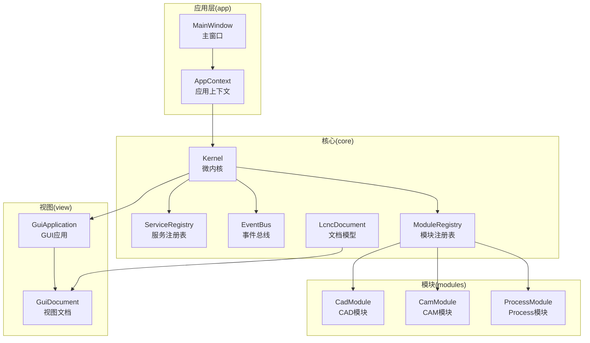
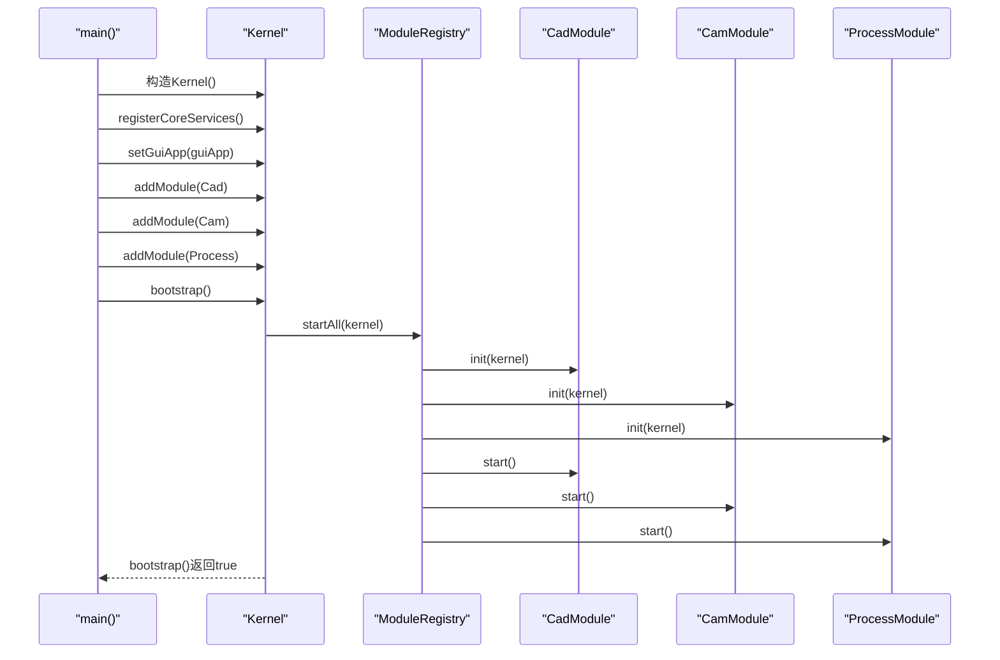
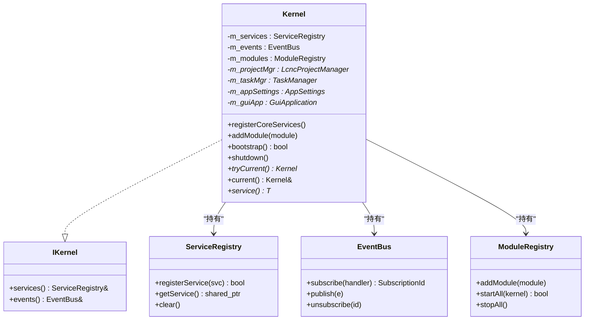
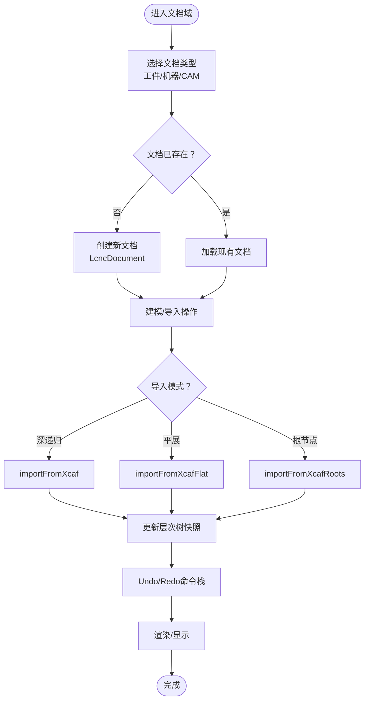
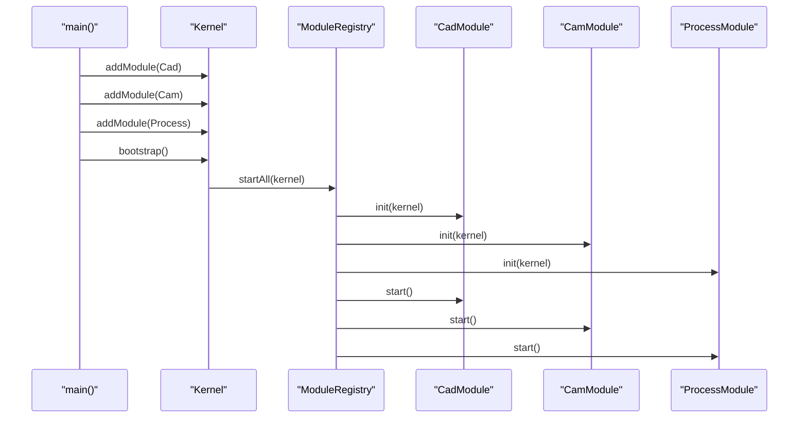
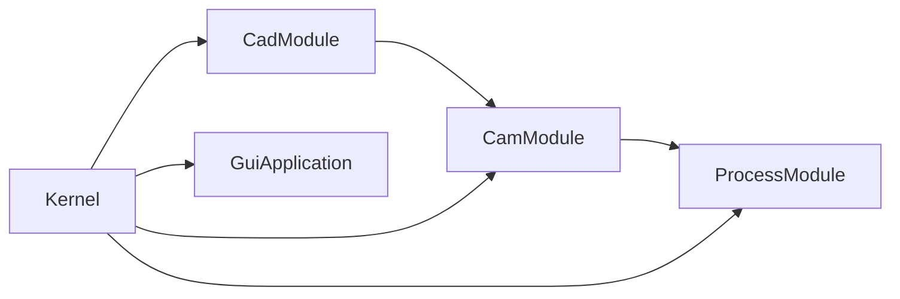

# 系统架构

<cite>
**本文引用的文件**
- [src/main.cpp](file://src/main.cpp)
- [src/core/kernel/kernel.h](file://src/core/kernel/kernel.h)
- [src/core/kernel/i_kernel.h](file://src/core/kernel/i_kernel.h)
- [src/core/kernel/service_registry.h](file://src/core/kernel/service_registry.h)
- [src/core/kernel/event_bus.h](file://src/core/kernel/event_bus.h)
- [src/core/kernel/module_registry.h](file://src/core/kernel/module_registry.h)
- [src/view/gui_application.h](file://src/view/gui_application.h)
- [src/modules/cad/cad_module.h](file://src/modules/cad/cad_module.h)
- [src/core/document/lcnc_document.h](file://src/core/document/lcnc_document.h)
</cite>

## 目录
1. [简介](#简介)
2. [项目结构](#项目结构)
3. [核心组件](#核心组件)
4. [架构总览](#架构总览)
5. [详细组件分析](#详细组件分析)
6. [依赖分析](#依赖分析)
7. [性能考虑](#性能考虑)
8. [故障排查指南](#故障排查指南)
9. [结论](#结论)
10. [附录](#附录)

## 简介
本文件面向LaserCNC项目的系统架构，围绕“微内核”设计理念与实现进行深入解析。重点包括：
- Kernel作为全局唯一入口点的角色与职责边界
- 三层文档架构（工件/机器/CAM）的数据流与组织方式
- 单工作空间视图的实现原理与跨文档显示协调
- 模块生命周期管理、依赖注入与启动顺序控制
- 分层依赖规则与架构约束的设计原理

目标是帮助开发者快速理解整体设计思路与组件交互关系。

## 项目结构
LaserCNC采用分层与模块化结合的组织方式：
- 核心层（core）：提供微内核、事件总线、服务注册表、文档模型等基础设施
- 视图层（view）：负责渲染、GUI应用与工作空间管理
- 模块层（modules）：按领域划分的业务模块（CAD、CAM、Process）
- 应用层（app）：应用上下文、命令体系、主窗口等
- 外部库（3rd）：OpenCASCADE、第三方日志与配置库等

图表来源
- [src/main.cpp:68-114](file://src/main.cpp#L68-L114)
- [src/core/kernel/kernel.h:37-146](file://src/core/kernel/kernel.h#L37-L146)
- [src/core/kernel/service_registry.h:26-137](file://src/core/kernel/service_registry.h#L26-L137)
- [src/core/kernel/event_bus.h:46-157](file://src/core/kernel/event_bus.h#L46-L157)
- [src/core/kernel/module_registry.h:30-61](file://src/core/kernel/module_registry.h#L30-L61)
- [src/view/gui_application.h:17-46](file://src/view/gui_application.h#L17-L46)
- [src/modules/cad/cad_module.h:45-306](file://src/modules/cad/cad_module.h#L45-L306)
- [src/core/document/lcnc_document.h:28-157](file://src/core/document/lcnc_document.h#L28-L157)

章节来源
- [src/main.cpp:33-135](file://src/main.cpp#L33-L135)

## 核心组件
- Kernel（微内核）
  - 唯一允许的进程级全局对象，生命周期与QApplication一致
  - 职责：注册核心服务、聚合模块、启动/停止模块、提供事件总线与服务注册表
  - 通过静态方法提供全局访问入口，替代传统单例
- ServiceRegistry（服务注册表）
  - 按类型索引注册/查找服务实例，支持覆盖注册与清理
  - 无生命周期管理，仅作为“服务定位器”
- EventBus（事件总线）
  - 类型化发布/订阅，线程安全（注册/发布/取消订阅互斥）
  - 回调在发布线程同步执行，订阅者自行处理线程切换
- ModuleRegistry（模块注册表）
  - 收集IModule实例，基于依赖声明进行拓扑排序，顺序init/start/stop
  - 失败处理：任一init失败则反向stop已init模块；start失败仅stop已start模块
- GuiApplication（GUI应用）
  - 管理单工作空间GuiDocument与渲染设置
  - 与Kernel解耦，避免core反向依赖view
- LcncDocument（文档模型）
  - 基于XCAF的实体存储，支持Undo/Redo、层次树快照、机器运动学模型
  - 文档内实体分类：工件、机器、辅助、CAM

章节来源
- [src/core/kernel/kernel.h:37-146](file://src/core/kernel/kernel.h#L37-L146)
- [src/core/kernel/i_kernel.h:26-34](file://src/core/kernel/i_kernel.h#L26-L34)
- [src/core/kernel/service_registry.h:26-137](file://src/core/kernel/service_registry.h#L26-L137)
- [src/core/kernel/event_bus.h:46-157](file://src/core/kernel/event_bus.h#L46-L157)
- [src/core/kernel/module_registry.h:30-61](file://src/core/kernel/module_registry.h#L30-L61)
- [src/view/gui_application.h:17-46](file://src/view/gui_application.h#L17-L46)
- [src/core/document/lcnc_document.h:28-157](file://src/core/document/lcnc_document.h#L28-L157)

## 架构总览
微内核架构通过Kernel集中管理模块生命周期与服务发现，模块间通过事件总线与服务注册表通信，避免直接耦合。启动顺序严格遵循依赖拓扑，确保上游模块先于下游模块初始化。

图表来源
- [src/main.cpp:68-114](file://src/main.cpp#L68-L114)
- [src/core/kernel/module_registry.h:30-61](file://src/core/kernel/module_registry.h#L30-L61)
- [src/modules/cad/cad_module.h:120-128](file://src/modules/cad/cad_module.h#L120-L128)

章节来源
- [src/main.cpp:68-114](file://src/main.cpp#L68-L114)

## 详细组件分析

### Kernel（微内核）
- 角色与职责
  - 唯一允许的进程级全局对象，提供服务注册表与事件总线
  - 聚合核心服务（项目管理、任务管理、应用设置等），并持有其所有权
  - 通过静态方法提供全局访问，避免散落的单例
- 生命周期
  - 构造：仅构造，不做重活
  - 初始化：registerCoreServices注册核心服务
  - 启动：bootstrap触发拓扑排序+init+start
  - 关闭：shutdown反向stop模块并清空服务
- 依赖注入
  - 通过setGuiApp注入GuiApplication裸指针（避免core反向依赖view）
  - 通过setCommandContainer注入命令容器（MainWindow拥有）

图表来源
- [src/core/kernel/i_kernel.h:26-34](file://src/core/kernel/i_kernel.h#L26-L34)
- [src/core/kernel/kernel.h:37-146](file://src/core/kernel/kernel.h#L37-L146)
- [src/core/kernel/service_registry.h:26-137](file://src/core/kernel/service_registry.h#L26-L137)
- [src/core/kernel/event_bus.h:46-157](file://src/core/kernel/event_bus.h#L46-L157)
- [src/core/kernel/module_registry.h:30-61](file://src/core/kernel/module_registry.h#L30-L61)

章节来源
- [src/core/kernel/kernel.h:37-146](file://src/core/kernel/kernel.h#L37-L146)
- [src/core/kernel/i_kernel.h:26-34](file://src/core/kernel/i_kernel.h#L26-L34)

### 三层文档架构（Workpiece/Machine/CAM）
- 设计思路
  - 以LcncDocument为核心，承载XCAF数据树、Undo/Redo状态与实体标签
  - 文档内按实体类别分组：工件、机器、辅助、CAM
  - 机器运动学模型与文档绑定，支持导入不同粒度的几何（深递归、平展、根节点）
- 数据流转
  - 工件文档：CAD模块创建/编辑形状，更新XCAF树与层次快照
  - 机器文档：Process模块导入机器几何，保持轴组为独立实体
  - CAM文档：CAM模块生成轮廓等几何，供渲染与导出
- 协同机制
  - 通过事件总线通知文档变更（如workpieceStructureChanged、finishedSketchesChanged）
  - 通过服务注册表查询各模块提供的门面接口（如ICadFacade、ICamFacade）

图表来源
- [src/core/document/lcnc_document.h:83-118](file://src/core/document/lcnc_document.h#L83-L118)

章节来源
- [src/core/document/lcnc_document.h:28-157](file://src/core/document/lcnc_document.h#L28-L157)

### 单工作空间视图与跨文档显示协调
- 单工作空间视图
  - GuiApplication管理单一可见的GuiDocument，作为所有项目域共享的工作区
  - 渲染配置与显示模式在GuiApplication中统一维护
- 跨文档显示协调
  - 通过事件总线在模块间传递文档变更事件（如workpieceViewRequested、documentModified）
  - 通过服务注册表查询模块门面接口，实现跨域操作（如CAM从CAD获取几何）
- 视图与模型解耦
  - Core层不包含视图逻辑，避免反向依赖
  - 视图层通过服务注册表与模块交互，模块通过事件总线广播状态变化

章节来源
- [src/view/gui_application.h:17-46](file://src/view/gui_application.h#L17-L46)
- [src/modules/cad/cad_module.h:147-148](file://src/modules/cad/cad_module.h#L147-L148)

### 模块生命周期管理、依赖注入与启动顺序控制
- 生命周期
  - init阶段：模块注册自身为服务、建立信号转发、准备资源
  - start阶段：模块启动运行时功能（当前占位）
  - stop阶段：注销服务、释放资源（反向顺序）
- 依赖注入
  - Kernel.registerCoreServices注册核心服务（项目管理、任务管理、应用设置）
  - Kernel.setGuiApp注入GuiApplication裸指针（避免core依赖view）
  - Kernel.setCommandContainer注入命令容器（MainWindow拥有）
- 启动顺序控制
  - 依赖声明：cad无依赖；cam依赖cad；process依赖cam
  - Kernel内部使用Kahn拓扑排序保证依赖在前
  - 配置层面可通过禁用模块影响启动顺序与依赖传播

图表来源
- [src/main.cpp:86-108](file://src/main.cpp#L86-L108)
- [src/core/kernel/module_registry.h:30-61](file://src/core/kernel/module_registry.h#L30-L61)
- [src/modules/cad/cad_module.h:120-128](file://src/modules/cad/cad_module.h#L120-L128)

章节来源
- [src/main.cpp:68-114](file://src/main.cpp#L68-L114)
- [src/core/kernel/module_registry.h:30-61](file://src/core/kernel/module_registry.h#L30-L61)

### 分层依赖规则与架构约束
- 分层依赖
  - Core层不依赖View层（通过裸指针注入GuiApplication）
  - 模块间通过事件总线与服务注册表通信，避免直接耦合
  - 文档模型（LcncDocument）位于Core层，视图层仅持有GuiDocument
- 架构约束
  - Kernel是唯一允许的进程级全局对象
  - 服务注册表不持有所有权语义之外的状态，不参与生命周期管理
  - 事件总线回调在发布线程同步执行，订阅者自行处理线程切换
  - 模块必须声明依赖，避免循环依赖与缺失依赖

章节来源
- [src/core/kernel/kernel.h:18-36](file://src/core/kernel/kernel.h#L18-L36)
- [src/core/kernel/service_registry.h:12-25](file://src/core/kernel/service_registry.h#L12-L25)
- [src/core/kernel/event_bus.h:24-44](file://src/core/kernel/event_bus.h#L24-L44)
- [src/view/gui_application.h:10-16](file://src/view/gui_application.h#L10-L16)

## 依赖分析
- 模块依赖图
  - cad ← cam ← process（Process使用CAM的轴定义）
  - Kernel内部使用Kahn拓扑排序保证依赖在前
- 服务依赖
  - 模块通过IKernel获取服务注册表与事件总线
  - 通过服务注册表查询其他模块提供的门面接口
- 视图依赖
  - Core层不包含视图逻辑，GuiApplication由main创建并注入Kernel

图表来源
- [src/main.cpp:106-108](file://src/main.cpp#L106-L108)
- [src/core/kernel/kernel.h:97-101](file://src/core/kernel/kernel.h#L97-L101)

章节来源
- [src/main.cpp:68-114](file://src/main.cpp#L68-L114)

## 性能考虑
- 启动阶段
  - 拓扑排序一次性计算启动顺序，避免运行时开销
  - 服务注册表按类型索引，查找复杂度近似O(1)
- 事件总线
  - 发布时复制订阅快照，避免回调中订阅/取消导致的迭代器失效
  - 回调在发布线程同步执行，减少线程切换成本
- 文档模型
  - 层次树快照与Undo/Redo栈配合，降低撤销/重做时的重建成本
  - 导入模式区分（深递归/平展/根节点）以平衡精度与性能

## 故障排查指南
- 启动失败
  - 若任一模块init返回false，已init模块将反向stop，整体启动失败
  - 若start失败，仅已start模块被stop，保留init状态便于诊断
  - 检测到循环依赖或缺失依赖时会记录错误日志
- 服务未找到
  - 通过服务注册表getService<T>()返回空shared_ptr时，调用方需自行空判断
  - 重复注册同一服务会覆盖并记录警告
- 事件订阅
  - 订阅句柄用于取消订阅，避免悬挂回调
  - 回调异常会被捕获并记录错误日志

章节来源
- [src/core/kernel/module_registry.h:24-28](file://src/core/kernel/module_registry.h#L24-L28)
- [src/core/kernel/service_registry.h:72-97](file://src/core/kernel/service_registry.h#L72-L97)
- [src/core/kernel/event_bus.h:93-116](file://src/core/kernel/event_bus.h#L93-L116)

## 结论
LaserCNC采用清晰的微内核架构，通过Kernel集中管理模块生命周期与服务发现，模块间通过事件总线与服务注册表松耦合协作。三层文档架构以LcncDocument为核心，结合单工作空间视图与跨文档显示协调机制，实现了工件、机器与CAM的统一数据流。严格的分层依赖与启动顺序控制确保了系统的可维护性与可扩展性。

## 附录
- 启动流程要点
  - main()固定顺序：构造Kernel → registerCoreServices → setGuiApp → addModule × N → bootstrap → show MainWindow → app.exec()
  - 关闭流程：保存设置 → shutdown → 作用域销毁（UI → GuiApplication → Kernel）
- 配置与模块禁用
  - 通过配置项禁用模块及其依赖的下游模块，Kernel内部使用Kahn拓扑排序保证依赖在前

章节来源
- [src/main.cpp:68-131](file://src/main.cpp#L68-L131)