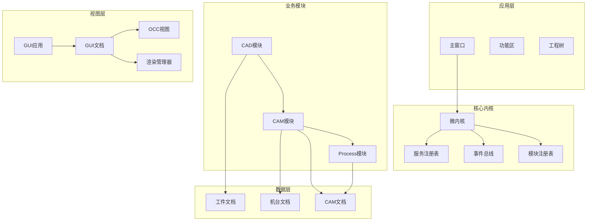

# 项目介绍

<cite>
**本文档引用的文件**
- [src/main.cpp](file://src/main.cpp)
- [src/app/main_window.h](file://src/app/main_window.h)
- [src/app/main_window.cpp](file://src/app/main_window.cpp)
- [src/core/kernel/kernel.h](file://src/core/kernel/kernel.h)
- [src/core/kernel/i_kernel.h](file://src/core/kernel/i_kernel.h)
- [src/modules/cad/cad_module.h](file://src/modules/cad/cad_module.h)
- [src/modules/cam/cam_module.h](file://src/modules/cam/cam_module.h)
- [src/modules/process/process_module.h](file://src/modules/process/process_module.h)
- [src/view/gui_application.h](file://src/view/gui_application.h)
- [src/view/gui_document.h](file://src/view/gui_document.h)
- [src/view/widget_occ_view.h](file://src/view/widget_occ_view.h)
- [src/view/rendering_manager.h](file://src/view/rendering_manager.h)
- [src/core/project/project_types.h](file://src/core/project/project_types.h)
- [CMakeLists.txt](file://CMakeLists.txt)
- [CLAUDE.md](file://CLAUDE.md)
- [微内核框架结构.md](file://微内核框架结构.md)
- [文件结构.md](file://文件结构.md)
- [todo.md](file://todo.md)
- [实施进度.md](file://实施进度.md)
</cite>

## 目录
1. [项目概述](#项目概述)
2. [核心目标与价值主张](#核心目标与价值主张)
3. [技术架构概览](#技术架构概览)
4. [模块化设计详解](#模块化设计详解)
5. [五轴激光加工技术背景](#五轴激光加工技术背景)
6. [市场定位与差异化优势](#市场定位与差异化优势)
7. [发展历程与版本演进](#发展历程与版本演进)
8. [应用场景与用户群体](#应用场景与用户群体)
9. [技术特色与创新点](#技术特色与创新点)
10. [未来发展规划](#未来发展规划)

## 项目概述

LaserCNC是一款专为五轴激光加工设备设计的CAD/CAM/Process一体化桌面应用。该项目基于现代微内核架构，采用单进程、三数据域的设计理念，为用户提供从三维建模、刀路生成到加工执行的完整解决方案。

### 项目核心特性

- **单进程架构**：整个应用运行在单一进程中，避免了进程间通信开销
- **三数据域分离**：Workpiece（工件）、Machine（机台）、CAM（刀路）三个独立的数据域
- **唯一工作空间**：所有数据域共享同一个OpenGL视图进行显示
- **模块化设计**：CAD、CAM、Process三大核心模块完全解耦
- **实时控制**：支持仿真和真实设备控制，具备紧急停止等安全功能

## 核心目标与价值主张

### 解决行业痛点

传统的激光加工设备在CAD、CAM、Process集成方面存在以下痛点：

1. **工具链割裂**：CAD建模软件、CAM软件、加工控制系统各自独立，数据传递复杂
2. **精度损失**：多次数据转换导致几何精度和工艺参数丢失
3. **效率低下**：人工干预多，自动化程度低
4. **安全性不足**：缺乏统一的安全控制和状态监控

### 价值主张

LaserCNC通过以下方式创造价值：

- **一体化解决方案**：从建模到加工的全流程集成，减少数据转换环节
- **高精度控制**：直接从CAM生成加工指令，确保几何和工艺参数的精确传递
- **实时监控**：加工过程的实时状态监控和异常处理
- **安全可靠**：完善的急停机制和状态机控制

## 技术架构概览

### 整体架构设计

**图表来源**
- [src/core/kernel/kernel.h:37-146](file://src/core/kernel/kernel.h#L37-L146)
- [src/app/main_window.h:41-147](file://src/app/main_window.h#L41-L147)

### 微内核架构特点

LaserCNC采用微内核架构，具有以下特点：

1. **进程级唯一入口**：Kernel::current()提供全局访问点
2. **服务注册表**：统一管理所有服务和模块
3. **事件总线**：模块间松耦合通信
4. **模块生命周期管理**：严格的启动和关闭顺序

**章节来源**
- [src/core/kernel/kernel.h:18-36](file://src/core/kernel/kernel.h#L18-L36)
- [src/core/kernel/i_kernel.h:10-25](file://src/core/kernel/i_kernel.h#L10-L25)

## 模块化设计详解

### CAD模块（工件建模）

CAD模块负责工件的三维建模，提供完整的CAD功能：

- **几何建模**：基础体素、布尔运算、特征建模
- **草图系统**：二维草图绘制和约束
- **变换操作**：平移、旋转、缩放
- **文件管理**：STEP、IGES、STL等多种格式导入导出

### CAM模块（刀路生成）

CAM模块专注于从CAD几何生成加工刀路：

- **机台配置**：支持多种五轴机台构型
- **工件挂载**：自动识别和挂载工件到机台
- **刀路生成**：基于几何特征的智能刀路生成
- **仿真显示**：刀路轨迹的可视化验证

### Process模块（加工执行）

Process模块负责实际的加工执行：

- **运动控制**：五轴联动控制
- **激光控制**：激光功率、频率等参数控制
- **IO控制**：辅助设备的开关控制
- **状态监控**：实时监控加工状态

**章节来源**
- [src/modules/cad/cad_module.h:27-45](file://src/modules/cad/cad_module.h#L27-L45)
- [src/modules/cam/cam_module.h:48-64](file://src/modules/cam/cam_module.h#L48-L64)
- [src/modules/process/process_module.h:28-35](file://src/modules/process/process_module.h#L28-L35)

## 五轴激光加工技术背景

### 技术发展现状

五轴激光加工技术相比传统三轴加工具有显著优势：

1. **复杂几何加工**：能够加工复杂的曲面和异形工件
2. **提高材料利用率**：减少装夹次数，提高材料使用效率
3. **提升加工质量**：刀具始终以最佳角度接触工件表面
4. **缩短生产周期**：减少工序和装夹时间

### 市场需求分析

当前市场对五轴激光加工软件的需求主要体现在：

- **精度要求**：航空航天、医疗器械等高端制造领域对精度要求极高
- **效率提升**：汽车、能源等行业需要更高的生产效率
- **成本控制**：通过自动化减少人工成本
- **质量稳定**：确保产品的一致性和可靠性

## 市场定位与差异化优势

### 目标市场

LaserCNC主要面向以下市场：

1. **高端制造业**：航空航天、船舶、能源装备
2. **精密医疗器械**：植入物、手术器械等
3. **模具制造**：复杂模具和精密零件
4. **个性化定制**：小批量、多品种的定制化生产

### 核心竞争优势

1. **一体化集成**：从建模到加工的完整解决方案
2. **高精度控制**：确保从CAD到加工的精度传递
3. **实时监控**：加工过程的全程监控和异常处理
4. **模块化架构**：便于功能扩展和定制化开发
5. **开源生态**：基于Qt和OpenCASCADE的成熟技术栈

## 发展历程与版本演进

### 阶段性发展里程碑

项目经历了多个发展阶段：

#### 阶段1：基础架构搭建（2024-2025）
- 建立微内核架构框架
- 实现CAD、CAM、Process基础功能
- 完成三数据域分离设计

#### 阶段2：功能完善（2025-2026）
- 优化刀路生成算法
- 增强实时控制功能
- 完善用户界面体验

#### 阶段3：性能优化（2026-2027）
- 提升系统响应速度
- 增强稳定性
- 扩展支持的机台类型

### 技术决策背景

1. **技术栈选择**：基于Qt6和OpenCASCADE的成熟技术
2. **架构设计**：微内核架构确保系统的可维护性
3. **模块化设计**：便于功能扩展和团队协作
4. **实时性考虑**：满足工业控制的实时性要求

**章节来源**
- [实施进度.md:1-381](file://实施进度.md#L1-L381)
- [todo.md:33-72](file://todo.md#L33-L72)

## 应用场景与用户群体

### 典型应用场景

1. **航空航天制造**
   - 复杂曲面零件的激光切割
   - 叶片、机翼等异形部件加工
   - 航天发动机零部件制造

2. **医疗器械制造**
   - 植入物的精密加工
   - 手术器械的高精度制造
   - 医疗设备外壳加工

3. **汽车制造**
   - 汽车车身复杂曲面加工
   - 发动机零部件激光焊接
   - 底盘系统异形件制造

### 用户群体特征

1. **工程师用户**：负责产品设计和工艺规划
2. **操作工人**：负责设备操作和日常维护
3. **管理人员**：负责生产管理和质量控制
4. **技术人员**：负责设备调试和故障排除

## 技术特色与创新点

### 核心技术创新

1. **三数据域架构**
   - Workpiece：工件源几何数据
   - Machine：机台几何和运动学数据
   - Cam：刀路和加工参数数据

2. **唯一工作空间显示**
   - 所有数据域共享同一个OpenGL视图
   - 通过DocumentId+entry避免冲突
   - 支持按域局部刷新

3. **实时状态监控**
   - 加工过程的实时状态反馈
   - 异常情况的自动检测和处理
   - 急停功能的快速响应

### 性能优化措施

1. **内存管理优化**
   - 智能缓存机制
   - 按需加载策略
   - 内存泄漏防护

2. **计算性能优化**
   - 多线程并行处理
   - 算法复杂度优化
   - GPU加速支持

3. **用户体验优化**
   - 直观的操作界面
   - 实时反馈机制
   - 智能错误提示

**章节来源**
- [微内核框架结构.md:1-226](file://微内核框架结构.md#L1-L226)
- [文件结构.md:1-289](file://文件结构.md#L1-L289)

## 未来发展规划

### 短期目标（6-12个月）

1. **功能完善**
   - 增强刀路生成算法
   - 优化用户界面体验
   - 完善报告生成功能

2. **性能提升**
   - 提升系统响应速度
   - 增强稳定性
   - 优化内存使用

3. **兼容性扩展**
   - 支持更多机台品牌
   - 增加新的文件格式
   - 优化网络功能

### 中期目标（1-2年）

1. **智能化升级**
   - AI辅助的工艺参数优化
   - 自适应加工控制
   - 预测性维护功能

2. **云端集成**
   - 云端数据存储
   - 远程监控功能
   - 协作开发平台

3. **生态系统建设**
   - 插件开发平台
   - 第三方集成支持
   - 开发者社区建设

### 长期愿景

1. **工业互联网**
   - 构建工业互联网平台
   - 实现设备互联互通
   - 提供大数据分析服务

2. **智能制造**
   - 与MES系统深度集成
   - 支持柔性制造
   - 实现智能工厂

3. **全球化布局**
   - 多语言支持
   - 本地化服务
   - 国际市场拓展

## 总结

LaserCNC作为一款专业的五轴激光加工CAD/CAM/Process一体化软件，通过先进的微内核架构和模块化设计理念，为用户提供了从三维建模到实际加工的完整解决方案。项目不仅解决了传统激光加工设备在集成方面的痛点，还通过技术创新和持续优化，为用户创造了显著的价值。

随着技术的不断发展和市场的持续扩大，LaserCNC将继续秉承"高精度、高效率、高可靠性"的理念，为全球制造业的数字化转型贡献力量。