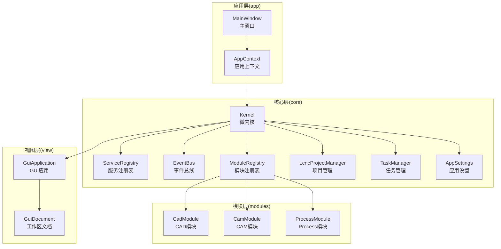
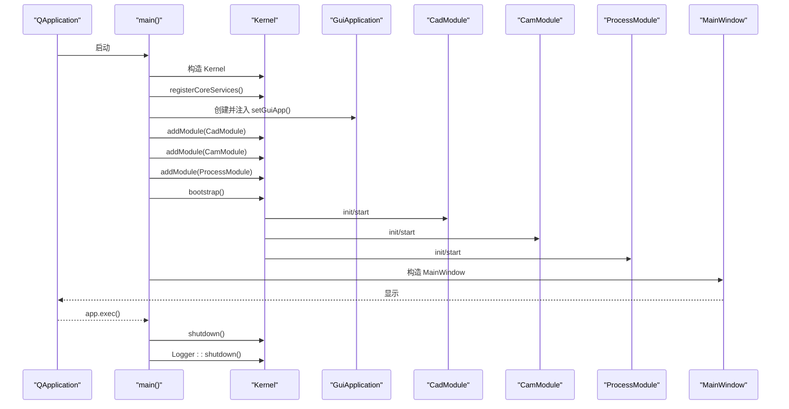
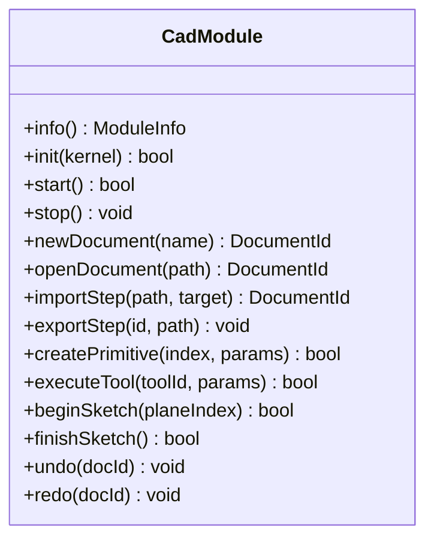
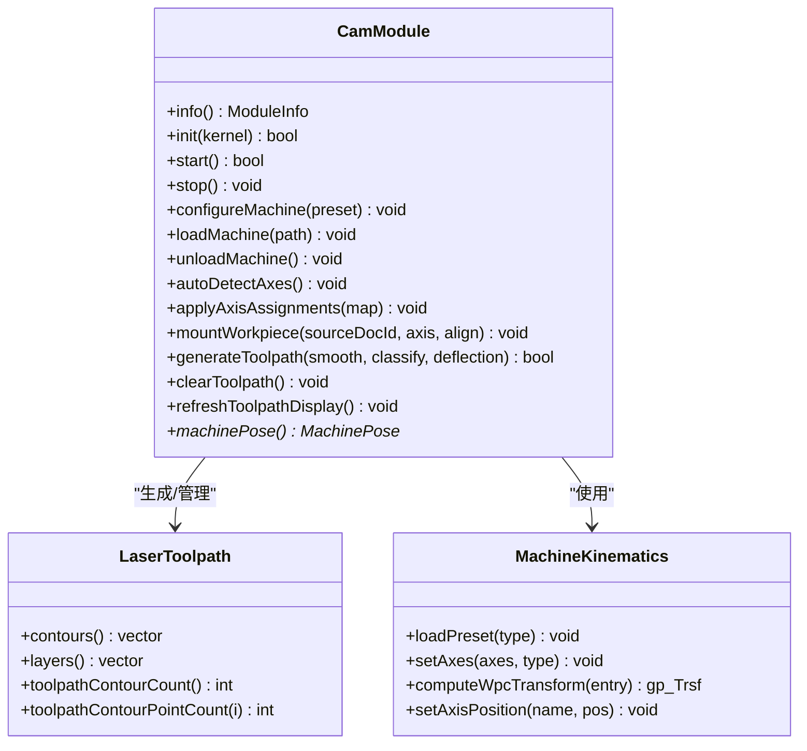
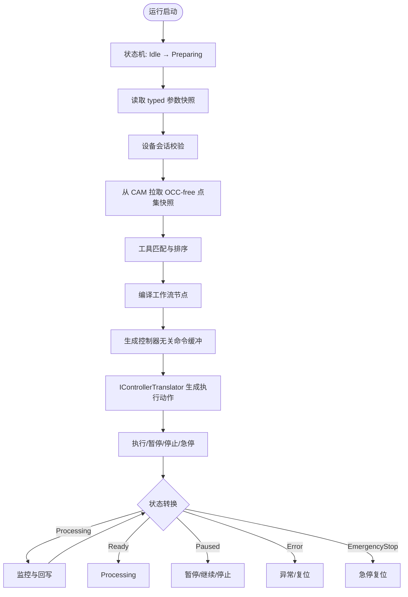
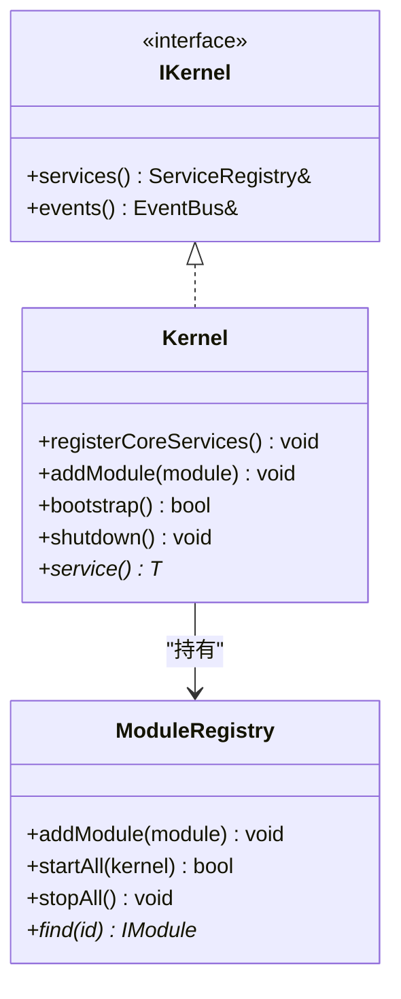
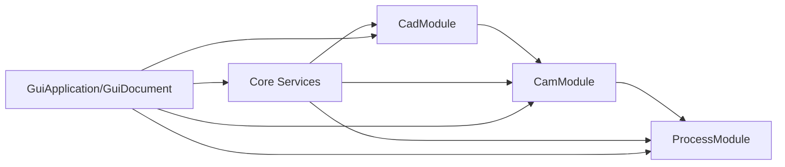

# 项目概述

<cite>
**本文档引用的文件**
- [src/main.cpp](file://src/main.cpp)
- [微内核框架结构.md](file://微内核框架结构.md)
- [process模块框架.md](file://process模块框架.md)
- [CMakeLists.txt](file://CMakeLists.txt)
- [src/core/kernel/kernel.h](file://src/core/kernel/kernel.h)
- [src/core/kernel/i_kernel.h](file://src/core/kernel/i_kernel.h)
- [src/core/kernel/module_registry.h](file://src/core/kernel/module_registry.h)
- [src/modules/cad/cad_module.h](file://src/modules/cad/cad_module.h)
- [src/modules/cam/cam_module.h](file://src/modules/cam/cam_module.h)
- [src/modules/process/process_module.h](file://src/modules/process/process_module.h)
- [src/core/project/project_types.h](file://src/core/project/project_types.h)
- [src/core/kinematics/machine_kinematics.h](file://src/core/kinematics/machine_kinematics.h)
- [src/core/algorithms/cam/laser_toolpath.h](file://src/core/algorithms/cam/laser_toolpath.h)
- [src/view/gui_application.h](file://src/view/gui_application.h)
- [src/app/main_window.h](file://src/app/main_window.h)
</cite>

## 目录
1. [简介](#简介)
2. [项目结构](#项目结构)
3. [核心组件](#核心组件)
4. [架构总览](#架构总览)
5. [详细组件分析](#详细组件分析)
6. [依赖分析](#依赖分析)
7. [性能考虑](#性能考虑)
8. [故障排查指南](#故障排查指南)
9. [结论](#结论)
10. [附录](#附录)

## 简介
LaserCNC 是一款面向五轴激光加工的桌面应用，提供从 CAD 建模、CAM 刀路生成到 Process 执行控制的一体化解决方案。项目采用微内核架构，将核心服务、模块化业务域与视图层解耦，支持模块按需启用/禁用、依赖拓扑排序启动、以及跨模块稳定的 Facade/Service 接口。三大核心模块分别为：
- CAD：工件建模、草图与特征、布尔运算、变换与测量等
- CAM：机台加载与轴标定、工件挂载、刀路生成与预览
- Process：设备连接与控制、参数与外设管理、工作流执行与状态机

项目目标是在保证高性能与可扩展性的前提下，提供稳定可靠的五轴激光加工全流程体验。

## 项目结构
LaserCNC 采用清晰的分层与模块化组织：
- 核心层（core）：提供项目管理、文档模型、算法库、内核与服务注册、事件总线、任务管理等
- 视图层（view）：统一的 3D 工作区与渲染管线，支持多域显示与交互
- 应用层（app）：主窗口、命令容器、上下文与对话框
- 模块层（modules）：CAD、CAM、Process 三大业务模块及其子服务

**图表来源**
- [src/app/main_window.h:41-147](file://src/app/main_window.h#L41-L147)
- [src/core/kernel/kernel.h:37-149](file://src/core/kernel/kernel.h#L37-L149)
- [src/core/kernel/module_registry.h:30-64](file://src/core/kernel/module_registry.h#L30-L64)
- [src/view/gui_application.h:17-47](file://src/view/gui_application.h#L17-L47)
- [src/modules/cad/cad_module.h:45-307](file://src/modules/cad/cad_module.h#L45-L307)
- [src/modules/cam/cam_module.h:64-422](file://src/modules/cam/cam_module.h#L64-L422)
- [src/modules/process/process_module.h:35-132](file://src/modules/process/process_module.h#L35-L132)

**章节来源**
- [CMakeLists.txt:81-244](file://CMakeLists.txt#L81-L244)
- [微内核框架结构.md:1-226](file://微内核框架结构.md#L1-L226)

## 核心组件
- 微内核（Kernel）：进程级唯一入口，负责注册核心服务、模块生命周期管理与依赖拓扑排序启动
- 服务注册表（ServiceRegistry）：模块 Facade 与服务的统一注册与查询入口
- 事件总线（EventBus）：跨模块松耦合通信机制
- 模块注册表（ModuleRegistry）：按依赖顺序启动/停止模块
- 项目管理（LcncProjectManager）：三域文档（工件/机台/CAM）的生命周期与状态管理
- 视图管理（GuiApplication/GuiDocument）：统一 3D 工作区与渲染管线
- 三大模块（CadModule/CamModule/ProcessModule）：分别承担建模、刀路与执行控制

**章节来源**
- [src/core/kernel/kernel.h:37-149](file://src/core/kernel/kernel.h#L37-L149)
- [src/core/kernel/i_kernel.h:26-37](file://src/core/kernel/i_kernel.h#L26-L37)
- [src/core/kernel/module_registry.h:30-64](file://src/core/kernel/module_registry.h#L30-L64)
- [src/core/project/project_types.h:15-39](file://src/core/project/project_types.h#L15-L39)
- [src/view/gui_application.h:17-47](file://src/view/gui_application.h#L17-L47)

## 架构总览
LaserCNC 的微内核架构强调“服务定位、模块自治、依赖可控”。启动流程遵循严格的顺序：核心服务注册 → GUI 应用注入 → 模块注册 → 依赖拓扑排序启动 → 主窗口显示 → 运行时 → 关闭时反向停止。

**图表来源**
- [src/main.cpp:68-127](file://src/main.cpp#L68-L127)
- [src/core/kernel/kernel.h:52-88](file://src/core/kernel/kernel.h#L52-L88)
- [src/modules/cad/cad_module.h:120-129](file://src/modules/cad/cad_module.h#L120-L129)
- [src/modules/cam/cam_module.h:108-114](file://src/modules/cam/cam_module.h#L108-L114)
- [src/modules/process/process_module.h:46-51](file://src/modules/process/process_module.h#L46-L51)

**章节来源**
- [src/main.cpp:33-135](file://src/main.cpp#L33-L135)
- [微内核框架结构.md:192-217](file://微内核框架结构.md#L192-L217)

## 详细组件分析

### CAD 模块
- 职责：工件导入/导出、建模、草图与特征、布尔运算、变换、测量、选择与撤销/重做
- 数据域：Workpiece 文档（OCC/XCAF）
- 交互：通过 Facade 暴露 API，配合 TaskPanel 与 Ribbon 命令
- 依赖：无（被 CAM 依赖）

**图表来源**
- [src/modules/cad/cad_module.h:45-307](file://src/modules/cad/cad_module.h#L45-L307)

**章节来源**
- [src/modules/cad/cad_module.h:27-44](file://src/modules/cad/cad_module.h#L27-L44)

### CAM 模块
- 职责：机台加载与轴标定、工件挂载、刀路生成与预览、CAM 运行时数据管理
- 数据域：Machine/CAM 文档（只读访问工件几何）
- 依赖：CAD（三域文档由项目管理器统一管理）
- 关键算法：LaserToolpathBuilder（轮廓提取、离散化、引刀线计算、IK 机座坐标）

**图表来源**
- [src/modules/cam/cam_module.h:64-422](file://src/modules/cam/cam_module.h#L64-L422)
- [src/core/algorithms/cam/laser_toolpath.h:91-208](file://src/core/algorithms/cam/laser_toolpath.h#L91-L208)
- [src/core/kinematics/machine_kinematics.h:39-107](file://src/core/kinematics/machine_kinematics.h#L39-L107)

**章节来源**
- [src/modules/cam/cam_module.h:48-63](file://src/modules/cam/cam_module.h#L48-L63)

### Process 模块
- 职责：设备连接与控制、参数与外设管理、工作流编辑与执行、运行状态机
- 依赖：CAM（通过 ToolpathExportSnapshot 消费不含 OCC 的点集）
- 关键边界：不直接包含 OCC 类型，控制器差异收敛在翻译器与适配器

**图表来源**
- [process模块框架.md:299-318](file://process模块框架.md#L299-L318)
- [src/modules/process/process_module.h:35-132](file://src/modules/process/process_module.h#L35-L132)

**章节来源**
- [process模块框架.md:6-17](file://process模块框架.md#L6-L17)
- [src/modules/process/process_module.h:28-35](file://src/modules/process/process_module.h#L28-L35)

### 微内核与模块生命周期
- Kernel 暴露服务注册表与事件总线，模块通过 ModuleInfo 声明依赖，ModuleRegistry 使用拓扑排序保证启动顺序
- 模块 init 阶段完成 Facade 注册与服务绑定，start 阶段完成资源初始化，stop 阶段反向释放

**图表来源**
- [src/core/kernel/i_kernel.h:26-37](file://src/core/kernel/i_kernel.h#L26-L37)
- [src/core/kernel/kernel.h:37-149](file://src/core/kernel/kernel.h#L37-L149)
- [src/core/kernel/module_registry.h:30-64](file://src/core/kernel/module_registry.h#L30-L64)

**章节来源**
- [src/core/kernel/kernel.h:18-36](file://src/core/kernel/kernel.h#L18-L36)
- [src/core/kernel/module_registry.h:15-29](file://src/core/kernel/module_registry.h#L15-L29)

## 依赖分析
- 启动依赖：cad → cam → process（Process 使用 CAM 的轴定义）
- 运行时依赖：CAM 依赖 CAD 文档几何；Process 依赖 CAM 的 ToolpathExportSnapshot
- 视图依赖：GuiApplication 持有唯一 GuiDocument，避免 core 反向依赖 view
- 外设与控制器：Process 通过 IControllerTranslator 与设备适配器隔离 SDK 头文件

**图表来源**
- [src/main.cpp:106-108](file://src/main.cpp#L106-L108)
- [src/view/gui_application.h:17-47](file://src/view/gui_application.h#L17-L47)
- [微内核框架结构.md:121-135](file://微内核框架结构.md#L121-L135)

**章节来源**
- [src/main.cpp:68-114](file://src/main.cpp#L68-L114)
- [微内核框架结构.md:121-135](file://微内核框架结构.md#L121-L135)

## 性能考虑
- OpenGL 默认格式在 QApplication 创建前设置，确保渲染稳定性与性能
- CAM 刀路生成采用离散化与引刀线计算，支持参数化调节以平衡精度与性能
- Process 执行采用状态机与命令缓冲，减少 UI 阻塞，支持仿真与真实控制器路径
- 模块间通信通过 Facade/Service 与事件总线，避免紧耦合导致的性能退化

**章节来源**
- [src/main.cpp:17-29](file://src/main.cpp#L17-L29)
- [src/core/algorithms/cam/laser_toolpath.h:141-208](file://src/core/algorithms/cam/laser_toolpath.h#L141-L208)
- [process模块框架.md:268-289](file://process模块框架.md#L268-L289)

## 故障排查指南
- 启动失败：检查模块依赖与配置禁用项，确认拓扑排序与依赖满足
- 显示异常：确认 OpenGL 格式设置与 Qt 初始化顺序，检查 GuiApplication 注入时机
- CAM 刀路问题：核查工件几何、面分类参数与引刀线设置
- Process 执行异常：检查设备连接状态、参数快照与工作流节点有效性

**章节来源**
- [src/main.cpp:68-114](file://src/main.cpp#L68-L114)
- [src/core/kernel/module_registry.h:24-29](file://src/core/kernel/module_registry.h#L24-L29)
- [process模块框架.md:337-347](file://process模块框架.md#L337-L347)

## 结论
LaserCNC 通过微内核架构实现了 CAD、CAM、Process 三大领域的解耦与协同，具备良好的可扩展性与可维护性。模块化设计与稳定的 Facade/Service 接口使得功能迭代与设备适配更加灵活；同时，清晰的启动与关闭生命周期保障了系统的稳定性。未来可在模块服务化、包管理后端抽象与渲染管线收敛等方面持续优化。

## 附录
- 技术栈：Qt6、OpenCASCADE、SARibbon、CMake
- 构建选项：可选启用 ACS/GTN/BDAQ/真实激光 SDK 与串口通信
- 项目包：.lcnc 工程包采用 zip 封装，包含项目元数据与数据文件

**章节来源**
- [CMakeLists.txt:1-425](file://CMakeLists.txt#L1-L425)
- [微内核框架结构.md:167-191](file://微内核框架结构.md#L167-L191)